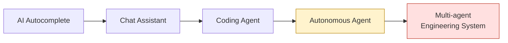
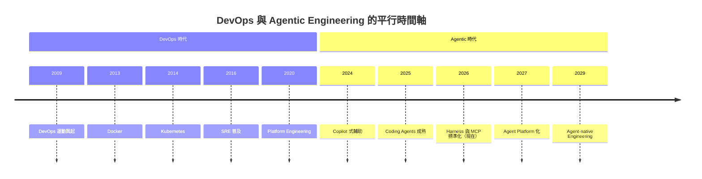
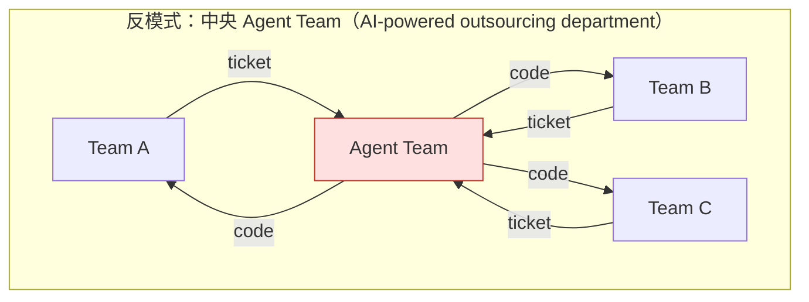
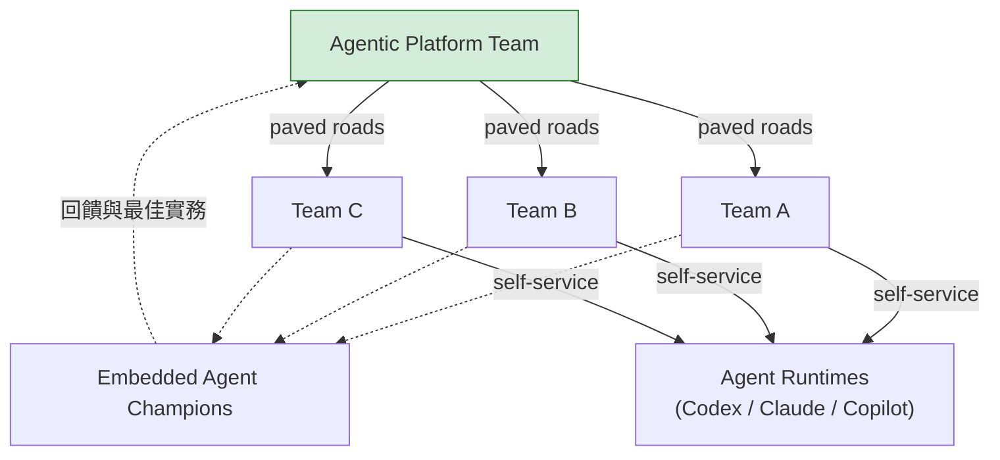
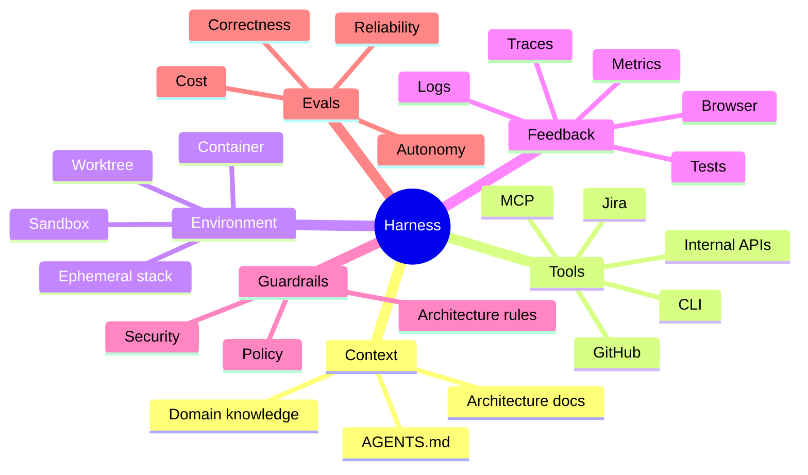
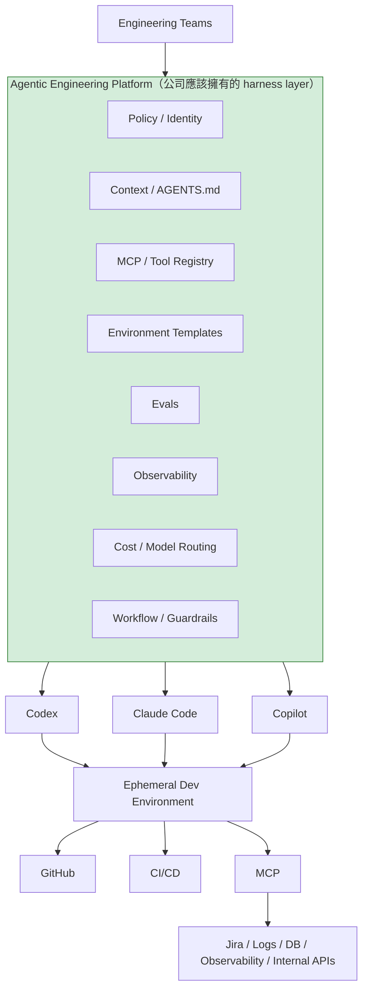
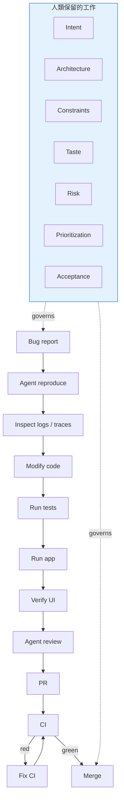

# 別急著打造你的 Devin：2026 年 Agentic Engineering 的組織策略與 Harness 藍圖

> **TL;DR** — 多數 Engineering Group 不需要成立一個「幫各 Team 做 Agent」的 silo，但很值得成立一個小型的 **Agentic Engineering Platform / Enablement Team**。而且不要從零打造完整的 agent runtime：正確策略是「**買/採用通用 agent runtime，自建 organization-specific harness layer**」。如果用 DevOps 的歷史對照，2026 年 9 月的 Agentic Engineering，大約等於 DevOps / Cloud Native 的 2014–2016 年：方向已經確定，基礎元件開始出現，但最佳實務與組織架構還沒定型。文末附上前 90 天的行動藍圖。

---

## 一、每個 Engineering VP 都在問的問題

過去一年，幾乎每一個工程組織都在問同一組問題：

- 我們要不要成立一個 AI Agent Team？
- 我們要不要自己打造 harness，甚至自己的 agent？
- 現在投資，是太早還是已經太晚？

這篇文章是我對這三個問題的完整回答。先講結論：

> **Own your Agentic Engineering Platform, but don't own the whole agent.**

以下從市場現況、DevOps 的歷史教訓、組織設計、Buy vs Build 的判斷，一路推到具體的決策建議與前 90 天的行動藍圖。

---

## 二、2026 年，市場實際走到哪裡了

整個產業已經明顯從左邊往右邊移動，而且重心正在壓到最後兩個階段：



各家生態的重點與真正重要的訊號如下：

| 生態 | 目前重點 | 我認為真正重要的訊號 |
|---|---|---|
| **OpenAI Codex** | Harness Engineering、長時間 autonomous runs、agent review agent、Symphony orchestration | **Repo / environment 本身變成 agent runtime 的一部分** |
| **Anthropic Claude Code** | Long-running harness、planner / generator / evaluator、multi-agent、sandbox、Managed Agents | **Model 與 execution environment 解耦** |
| **GitHub Copilot** | Cloud agent、custom agents、sub-agent、MCP、repo 內的 Agents 定義 | GitHub 正在變成 **Agent Control Plane** |
| **Google** | Jules → Antigravity、multi-agent backend、agent-first IDE | **IDE 從「人的工具」翻轉成 agent 的 control surface，人退到 review 與 steer** |
| **Cursor** | Cloud Agents、VM isolation、background tasks、automations | Local IDE → **remote engineering workers** |
| **Devin 與同類產品** | Autonomous software engineer、agent fleets | 接近「工程人力 abstraction」 |
| **Open ecosystem** | MCP、AGENTS.md、goose、AAIF | 開始形成類似 CNCF 時代的 interoperability layer |

幾個訊號值得特別展開。

### OpenAI：工程師的工作變成設計環境

OpenAI 公開的 [Harness Engineering 實驗](https://openai.com/index/harness-engineering/)最值得注意：三位工程師透過 Codex，在約五個月內產生約一百萬行程式碼、約 1,500 個 PR。但真正的重點不是 LOC，而是他們發現工程師的工作開始變成「**設計 environment、constraints、feedback loops**」，而不是直接寫程式碼。後來的 Symphony 更直接把 Linear backlog 當成 agent orchestration 的 control plane。

### Anthropic：brain 與 hands 分離

Anthropic 得到的結論幾乎相同。他們在 [Effective harnesses for long-running agents](https://www.anthropic.com/engineering/effective-harnesses-for-long-running-agents) 中，把 long-running application development 拆成 planner / generator / evaluator，並在 Managed Agents 中進一步把 **brain、hands、session** 分離：model + harness 是 brain，container / device / MCP tools 是 hands。

Anthropic 自己也提醒：harness 會 encode model 的能力假設，而 model 變強後，這些假設很快會過時。**這正是我不建議企業從零打造完整 agent runtime 的核心原因。**

### GitHub：Repository 變成 agent 的工作管理系統

GitHub 的方向非常像當年 CI/CD 的平台化。[Copilot cloud agent](https://github.blog/changelog/2026-04-01-research-plan-and-code-with-copilot-cloud-agent/) 已經可以在自己的 development environment 工作、研究 codebase、產生 plan、寫程式碼；[Custom agents](https://docs.github.com/en/copilot/how-tos/copilot-on-github/customize-copilot/customize-cloud-agent/create-custom-agents) 可以在 repo 裡定義 tools、MCP servers、prompt，再由 parent agent 當成 sub-agent 呼叫。這已經不是「Copilot」，而是在把 GitHub repository 變成 agent work management system。

### Cursor：CI Runner 演化史的重演

Cursor 也在解相同問題：每個 [Cloud Agent](https://cursor.com/blog/cloud-agent-lessons) 都有 dedicated VM、repo、dependencies、secrets 與 network policy，完成工作後提供 screenshot、影片、logs 等 artifacts，讓人類驗證「結果」而不是盯著 agent 的每一步。他們甚至開始 [cache ready-to-use development environments](https://cursor.com/blog/cloud-agent-environment)，因為 agent infrastructure 的 startup time 已經成為效能瓶頸——這非常像早期 CI runner → containerized CI → warm runner 的演化。

### 最大的訊號：標準化開始收斂

2025 年 12 月，Linux Foundation 成立 [Agentic AI Foundation（AAIF）](https://www.linuxfoundation.org/press/linux-foundation-announces-the-formation-of-the-agentic-ai-foundation)，納入 **MCP、AGENTS.md、goose**；截至 2026 年 8 月，AAIF 已有 247 個 member organizations。這代表業界開始把「model ↔ tools ↔ repository context」這些介面標準化，而不是讓每一家 agent 都有自己的封閉 integration——非常像當年 CNCF 生態開始收斂的時刻。

---

## 三、DevOps 的歷史，其實已經演過一次

兩個時代幾乎可以逐項對應：

| DevOps / Cloud Native | Agentic Engineering |
|---|---|
| Shell scripts | Prompt |
| Jenkins job | Agent workflow |
| CI runner | Agent sandbox |
| Dockerfile | Agent environment definition |
| Kubernetes | Agent orchestration |
| Helm / templates | Agent skills / workflows |
| Service mesh | MCP / agent gateway |
| SRE observability | Agent observability / traces |
| CI quality gates | Agent evals |
| IDP / Backstage | Agentic Engineering Platform |
| "You build it, you run it" | **"You specify it, agents build it, you own it"** |

把兩條時間軸疊起來看：



我認為 **2026 就是 Kubernetes 出現前後的那個時間點**。大家已經知道 agent 一定會存在，現在正在爭的是：agent 怎麼執行、怎麼拿 context、怎麼連 tools、怎麼彼此協作、怎麼被限制、怎麼被觀測。

而 DevOps 留下最大的組織教訓是：

> **不要把一個文化與能力問題，變成另一個 functional silo。**

很多公司早期成立獨立的 DevOps Team，結果只是把「Dev → Ops ticket」變成「Dev → DevOps ticket」，最後才演化成 Platform Team + paved roads + 各 Team self-service 的模式。Agentic Engineering 應該**直接跳過中間那個錯誤階段**。

---

## 四、不要成立這種 Team



這種設計必然失敗，原因有二：

1. 它只是把等待 Ops 的 ticket queue，換成等待 Agent Team 的 ticket queue。
2. Agent Team 永遠不可能比 domain team 更懂 business context——而 context 恰好是 agent 產出品質的決定因素。

除了中央 Agent Team，還有三種同樣常見、但比較少被點名的失敗模式：

- **自己造 runtime**：投入 6–12 個月自建內部版 Claude Code 或 Devin。vendor 的下一個 release 就會讓它過時——你是在跟整個產業的資本支出對賭，而且賭輸的機率接近 100%。
- **AGENTS.md 文件墳場**：轟轟烈烈地要求每個 repo 都寫 AGENTS.md，但沒有人負責維護、沒有 eval 驗證它是否真的改善 agent 產出。半年後它就跟公司 wiki 一樣過時。context 是需要 ownership 的 living artifact，不是寫一次就封存的文件。
- **Review 成為新瓶頸**：agent 產出 PR 的速度是人類的十倍，review 流程卻完全沒變。結果不是交付變快，而是 review queue 爆炸、reviewer 疲乏、rubber-stamp 放行——品質問題只是往後移到 production。這也是為什麼 agent review agent 與 eval，必須跟產出能力同步投資。

---

## 五、應該成立這種 Team

正確的模式是 **Platform + Federation**：中央 Platform Team 鋪路，domain team 自助上路，再加上 embedded champions 串接兩者。



Ownership 的切分如下：

| Agentic Platform Team 負責 | Product Engineering Team 負責 |
|---|---|
| Agent runtime integration | Business requirements |
| Vendor abstraction | Acceptance criteria |
| MCP gateway | Domain MCP tools |
| Identity / secrets | Domain permissions |
| Sandbox | Domain environment |
| Agent observability | Domain dashboards |
| Eval framework | Eval cases |
| Cost / quota | Usage |
| AGENTS.md template | Repo 的 AGENTS.md |
| Golden workflows | Domain workflow |
| Security guardrails | Production ownership |

其中最重要的一個觀念：

> **Platform Team 建 harness；Product Team 建 agent-legible software。**

這是兩件完全不同的事。

至於規模，我的建議值（不是業界標準）：

| Engineering 規模 | 建議 |
|---:|---|
| < 30 人 | 不成立 Team；1–2 位 champions |
| 30–100 人 | 2–4 人的 Agentic Enablement Pod |
| 100–500 人 | **4–8 人的 permanent Agentic Platform Team** |
| > 500 人 | Agent Platform + Eval + Security 專業分工 |

即使超過 500 人，我也不會讓中央 Team 負責「替大家做 agents」。

還有一個常被跳過的問題：**champion 怎麼選、人怎麼轉型**。好的 agent champion 不是「最會寫 prompt 的人」，而是原本就擅長經營 developer experience 的人——會寫測試、會整理文件、對 CI/CD 與 tooling 有 sense 的工程師。因為 harness engineering 本質上就是 DX engineering 的延伸，對象從人換成了 agent 而已。

至於 junior engineer，我的看法與流行的悲觀論相反：agent 時代最稀缺的能力——拆解問題、定義驗收條件、判斷產出品質——恰好要靠大量 review agent 的產出來練成。組織應該刻意把「review agent 的 PR」設計成 junior 的訓練路徑，而不是把這件事全部留給 senior，然後困惑為什麼三年後沒有人能接班。

---

## 六、Harness 不是 Prompt

企業自己的 harness，我會這樣定義：



**Prompt 反而可能是其中最不重要的一小塊。**這也是為什麼業界最近開始講 Harness Engineering，而不再是 Prompt Engineering。

把這個 harness 放進整個系統，就是公司真正應該擁有的那一層：



注意：**擁有中間那一層，不等於自己再寫一個 Claude Code。**

### Guardrails 不是選配

上圖的 Policy / Identity 與 Guardrails 值得單獨強調，因為當你拿這套架構去說服 CISO 時，被問的一定是這一塊：

- **Identity 與最小權限**：每個 agent run 都應該有自己的 identity 與 scoped credentials——只拿得到這個 task 需要的 repo、secrets 與 API，而不是共用一組人類的 token。出事的時候，「哪個 agent、哪次 run、用什麼權限做的」必須能在五分鐘內回答。
- **Prompt injection 是真實的攻擊面**：agent 會讀 issue、PR comment、外部網頁與 log，這些全是不可信輸入。tool 權限分級與 sandbox 的 egress policy 是底線，不是加分項。
- **Audit trail**：每個 agent 的每個 tool call 都要可追溯。等到 compliance 來問「這段程式碼當初是誰決定這樣寫的」才開始補，就太遲了。

---

## 七、真正的護城河：Agent Legibility

OpenAI 那篇 Harness Engineering 文章裡，我認為最重要的東西甚至不是 Codex，而是一句話：

> **Make the system legible to agents.**

把 logs、metrics、traces、browser、DOM、screenshots、tests、architecture、dependency rules、CI、PR feedback，全部變成 agent 可以直接 query / operate / validate 的東西。做到之後，整條交付流程長這樣：



人類只剩下 intent、architecture、constraints、taste、risk、prioritization、acceptance。**這就是我認為 Agentic Engineering 真正的定義。**

### Brownfield 怎麼辦

上面的流程圖隱含了一個假設：系統本來就有測試、log 有結構、架構有文件。多數企業的現實是 15 年的 legacy monolith，三者皆無——而這正是 legibility 投資需要排序的原因。我的建議順序：

1. **先補 characterization tests**：讓 agent 有 feedback 可以驗證自己的修改，這是其他一切的前提。
2. **再結構化 logs / traces**：讓 agent 能自己 debug，而不是每次都把 stack trace 貼回來問人。
3. **最後才是 architecture rules 與文件**：這一層價值最高，但沒有前兩層，agent 讀得懂也做不對。

反直覺的是，這個順序跟「讓新進工程師快速上手」的投資完全同構——agent legibility 與 human legibility 是同一件事。這也是為什麼即使 agent 路線失敗，這筆投資也幾乎不會白費。

---

## 八、哪些該 Buy，哪些該 Build

這可能是整題最關鍵的判斷：

```mermaid
flowchart LR
    subgraph BUY["Buy / Adopt（買或採用）"]
        direction TB
        B1["Codex / Claude Code /<br/>Copilot / Antigravity"]
        B2["Base agent loop"]
        B3["Generic planning / memory"]
        B4["Generic code search"]
        B5["Generic sandbox technology"]
    end
    subgraph BUILD["Build / Own（自建並擁有）"]
        direction TB
        C1["Company context"]
        C2["MCP gateway"]
        C3["Identity / permissions"]
        C4["Repo conventions /<br/>architecture constraints"]
        C5["Internal tools"]
        C6["Eval dataset"]
        C7["Observability / cost controls"]
        C8["Workflow integration"]
    end
    BUY -->|組合| BUILD
    style BUY fill:#fff3cd,stroke:#b8860b
    style BUILD fill:#d4edda,stroke:#2e7d32
```



簡化成一句話：

> **Buy the intelligence. Build the environment. Own the feedback loop.**

理由回到 Anthropic 的提醒：harness 會 encode model 的能力假設，而 model 每半年就會讓這些假設過時。通用能力（agent loop、planning、sandbox 技術）是 vendor 之間高速競爭、持續免費升級的層；你的 context、conventions、eval dataset、feedback loop 才是不會被下一個 model release 抹掉的資產。

---

## 九、Eval：唯一會複利的資產

前面說 eval dataset 是不會被 model release 抹掉的護城河，但多數團隊卡在第一步：「eval 要從哪裡來？」答案是：**你的工程歷史裡已經有了。**

- **從 incident 回收**：每份 post-mortem 都是現成的 eval case——給 agent 當時的 context 與症狀，它能不能找到 root cause？
- **從 PR history 回收**：被 reviewer 打回的 agent PR，連同 review comment，就是最真實的 negative example；一次就過關的，則是 golden path。
- **Golden tasks**：挑 10–20 個有代表性的已完成任務（bug fix、小 feature、refactor 各幾個），固定 context 與驗收條件。每次 model 或 harness 改版，就重跑一輪。

維護成本比想像中低：eval 不需要一開始就全自動化，每月一次人工 review 打分數，就足以回答兩個最貴的問題——「新 model 出來了，我們該不該換」與「harness 這次改動，是變好還是變壞」。沒有 eval 的組織只能靠感覺回答這兩題，而感覺，在 vendor 的行銷與 demo 面前不堪一擊。

這就是「複利」的意思：市場上每一次 model 升級、每一家 vendor 的價格戰，都會讓你的 eval dataset 增值一次——因為只有你能在一天內用自己的工作負載驗證新選項，別人只能讀 benchmark 猜。

---

## 十、如果我是 Engineering VP，我會怎麼決策

我**不會**核准：

> 「成立 10 人 AI Agent Team，打造公司自己的 Devin。」

我**會**核准：

> 「成立 4–6 人的 Agentic Engineering Platform Team，半年內讓所有 Engineering Teams 都可以安全、自助式地使用 Codex / Claude / Copilot 等 agent。」

第一年的 North Star 不應該是 AI generated LOC，也不是 PR count，而應該接近：

```text
% tasks successfully delegated
        ×
end-to-end completion rate
        ×
human attention saved
        ×
production correctness
```

再搭配一組營運指標：

| 指標 | 意義 |
|---|---|
| Time to Merge | 交付週期是否真的縮短 |
| Human Review Minutes / PR | 人類注意力是否真的被節省 |
| Agent Retry Rate | Harness 與 context 的品質 |
| Eval Pass Rate | 產出可靠度 |
| Production Escape Rate | 正確性的最終防線 |
| Cost / Successful Task | 單位經濟 |
| Autonomous Completion Rate | 自主程度的實際進展 |

其中 **Cost / Successful Task** 值得展開，因為 agent 的單位經濟跟人力完全不同：一次成功的 autonomous run，花費可能從幾十美分到幾十美元不等，決定因素是 retry 次數與 context 大小，而不是任務本身的難度。兩個實務原則：

- **Model routing**：用最強的 model 做 planning 與 review，用便宜的 model 跑大量 generation 與 eval。這一層路由邏輯放在 platform，各 team 不需要各自發明。
- **把 Agent Retry Rate 當成 leading indicator**：retry 燒掉的錢，幾乎都是 context 與 feedback loop 沒做好的稅。retry rate 降不下來，先修 harness，不要先怪 model。

這才能避免重演早期 DevOps 的 vanity metrics——「部署次數很多，所以我們 DevOps 做得很好」。

順帶一個預測：到 2028–2030 年，「Agentic Engineering Team」這個名字可能會逐漸消失，就像今天成熟的工程組織不會特別成立「Git Team」或「CI Team」。Agentic capability 最終會被吸收進 Developer Platform、SRE、Security 與 Engineering Productivity 之中。

---

## 十一、前 90 天的行動藍圖

如果決定要做，我會這樣排前 90 天：

| 階段 | 目標 | 退出條件 |
|---|---|---|
| **第 1 個月** | 選定 2 個 pilot teams 與 champions；量出 baseline（Time to Merge、review minutes / PR）；runtime 選型完成，sandbox 與權限就緒 | pilot team 每天都有人真的在用 agent |
| **第 2 個月** | 第一條 golden workflow 上線（建議從 bug-fix flow 開始）；AGENTS.md template 進 pilot repos；建立前 10–20 個 eval case | agent 完成的任務有 eval 可驗，不再靠感覺 |
| **第 3 個月** | 對照 baseline 檢視 pilot 的成效指標；做去留與擴大決策；開放 self-service 給下一批 teams | 有量化證據支撐的 go / no-go，而不是 vibes |

三個提醒：

1. **Pilot 選「痛但不致命」的情境**——internal tools、測試補強、bug backlog，不要選 mission-critical path。
2. **Baseline 沒量就開跑，三個月後你將無法證明任何事**。這是最常見、代價也最高的失誤。
3. **平台 team 的第一個客戶是 pilot team，不是全公司**。太早追求 coverage，是 platform team 死掉最常見的方式。

---

## 十二、結語

現在確實到了該投資 Agentic Engineering 的時間，但投資標的不應該是「自己的 agent」，而是：

> **讓任何 agent 都能在你的 Engineering System 裡工作得很好。**

這會是比押注 Codex、Claude Code、Copilot 或 Devin 哪一家勝出，更長期的資產。

---

### References

1. OpenAI — [Harness engineering: leveraging Codex in an agent-first world](https://openai.com/index/harness-engineering/)
2. Anthropic — [Effective harnesses for long-running agents](https://www.anthropic.com/engineering/effective-harnesses-for-long-running-agents)
3. GitHub — [Research, plan, and code with Copilot cloud agent](https://github.blog/changelog/2026-04-01-research-plan-and-code-with-copilot-cloud-agent/)、[Creating custom agents for Copilot cloud agent](https://docs.github.com/en/copilot/how-tos/copilot-on-github/customize-copilot/customize-cloud-agent/create-custom-agents)
4. Cursor — [What we've learned building cloud agents](https://cursor.com/blog/cloud-agent-lessons)、[How we set up our cloud agent environment](https://cursor.com/blog/cloud-agent-environment)
5. Linux Foundation — [Announcing the Agentic AI Foundation(AAIF)](https://www.linuxfoundation.org/press/linux-foundation-announces-the-formation-of-the-agentic-ai-foundation)

---

*本文發表於 [Medium @fantasybz](https://medium.com/@fantasybz)。若你也在建立組織的 Agentic Engineering 能力，歡迎交流。*
