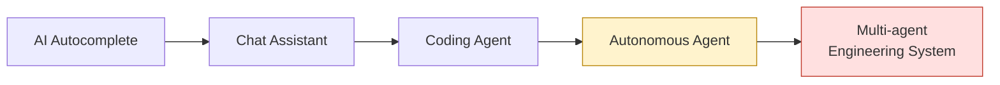
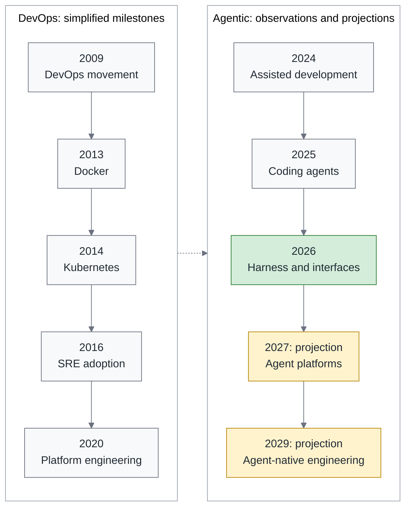
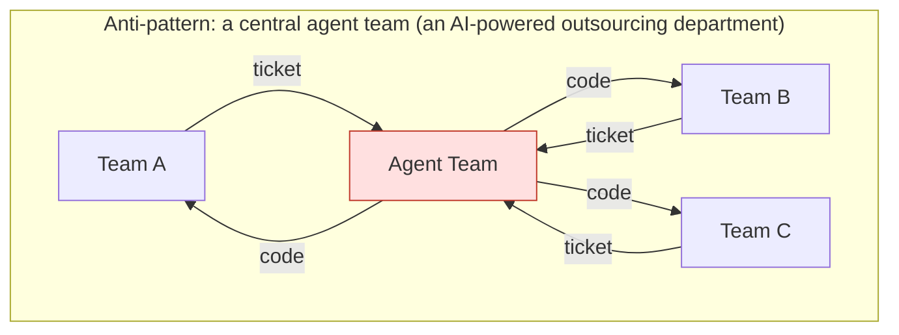
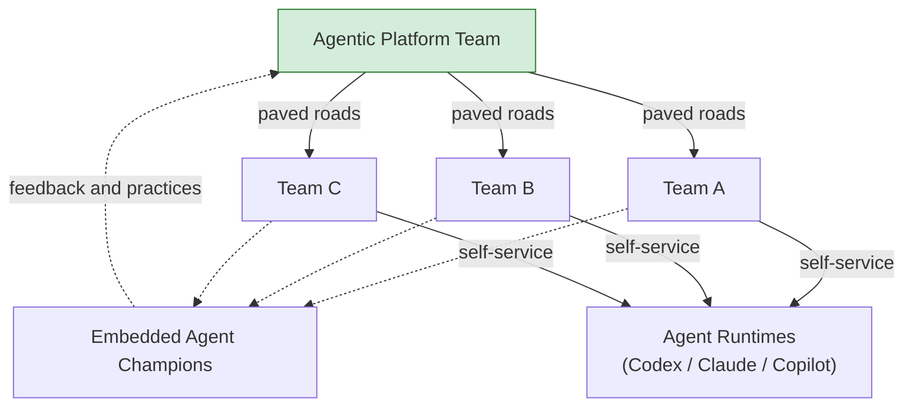
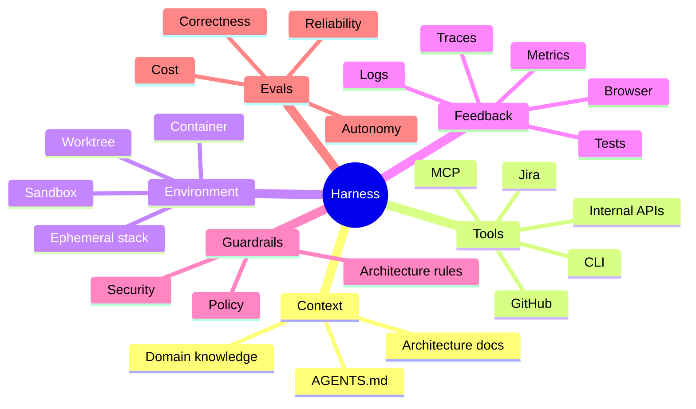
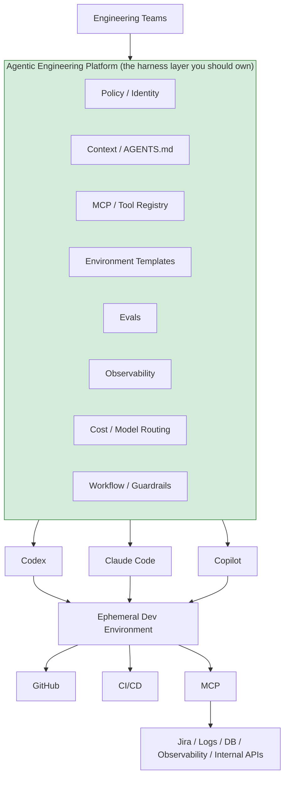
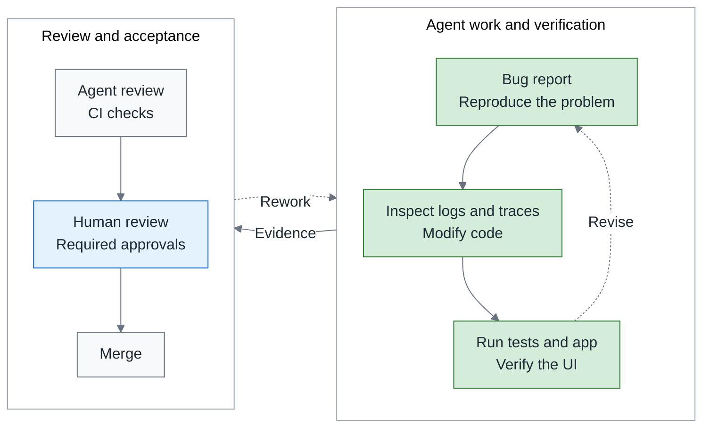
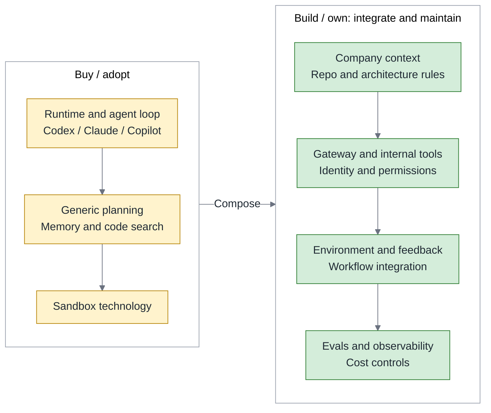

# Don't Build Your Own Devin: Org Strategy and a 90-Day Blueprint for Agentic Engineering

> **TL;DR** — Engineering organizations have reason to invest in Agentic Engineering, starting with the conditions product teams need to use agents: clear permissions, working environments, and acceptance criteria. My recommendation is to assign champions or a small Platform / Enablement Team according to scale, adopt a general-purpose runtime first, and invest in the organization’s harness and feedback loop. From the perspective of September 2026, this resembles DevOps and Cloud Native in 2014–2016: components are coming together while organizational responsibilities and maintenance practices are still evolving. This piece develops that comparison, the staffing and sourcing decisions, and a 90-day pilot blueprint to adapt to local conditions.

> Series: **Overview (this piece)** → [1. Org Design](https://fantasybz.medium.com/agentic-engineering-part-1-who-does-this-platform-plus-federation-in-practice-92343384d987) → [2. The Harness Blueprint](https://fantasybz.medium.com/agentic-engineering-part-2-the-harness-blueprint-making-your-system-legible-to-agents-3facc281f633) → [3. Evals and Unit Economics](https://fantasybz.medium.com/agentic-engineering-part-3-evals-unit-economics-and-scaling-running-agents-like-a-product-1cb1855a2046)

---

## 1. The questions engineering leaders need to answer

As agents move from individual tools into team workflows, engineering leaders face questions beyond which product to choose. Someone must maintain the environment, accept the results, and explain what the investment should improve. I want to begin with three questions:

- Should we stand up an AI Agent team?
- Should we build our own harness — or even our own agent?
- Is investing now too early, or already too late?

This piece sets out my judgment on those questions. The central position is:

> **Own your Agentic Engineering Platform, but don't own the whole agent.**

Putting that position into practice starts with understanding what the market offers, then revisiting the organizational experience of DevOps. From there, teams can assign responsibilities, choose what to adopt or build, and design a pilot.

The order matters to me because a capable agent demonstration does not establish who will look after it once a team adopts it. Considering technology choices alongside everyday responsibilities gives an experiment a better chance of leaving something maintainable behind.

---

## 2. Where the market actually is in 2026

Start with a diagram of different working arrangements. It describes the scope of work people might delegate, rather than a maturity ladder every organization must climb in order.

Products are exploring longer autonomous runs and multi-agent collaboration. In actual use, teams retain different levels of human involvement according to task risk:



[Google’s 2025 DORA survey](https://blog.google/innovation-and-ai/technology/developers-tools/dora-report-2025/) helps show the gap. It covered nearly 5,000 technology professionals and reported that 90% of surveyed software development professionals used AI at work, while about 24% expressed high trust in its output. [Stack Overflow’s 2026 pulse survey](https://stackoverflow.blog/2026/05/27/agents-on-a-leash-agentic-ai-remains-mostly-monitored-at-work/), with about 1,100 developers and working professionals, found agent use at 59%, compared with 31% in the previous year’s Developer Survey. That comparison does not track the same people over time. The pulse survey also found 63% rarely or never let agents run entirely on autopilot. My reading is that use is expanding while verification and human supervision remain part of adoption. Using AI is not equivalent to delegating the whole workflow.

The table groups several product directions and the engineering implications I draw from them. The right column is interpretation; capabilities still need validation in the environment where they will be used:

| Ecosystem | Direction being explored | Engineering implication I would examine |
|---|---|---|
| **OpenAI Codex** | Harness engineering, agents participating in development and verification | Design the repo and feedback environment together |
| **Anthropic Claude Code** | Initialization, incremental long-task execution, and session handoffs | Agents need work state they can resume |
| **GitHub Copilot** | Cloud agents, research and planning, repo-defined custom agents | Repositories increasingly support agent work management |
| **Google Antigravity** | An agent-centered development environment | Interfaces need to support delegation, inspection, and steering |
| **Cursor** | Cloud agents, VM environments, and result verification | The remote working environment becomes part of the product |
| **Devin and peers** | Delegating more complete development tasks | Task decomposition and acceptance responsibilities need attention |
| **Open ecosystem** | MCP, AGENTS.md, goose, AAIF | A shared basis for collaboration on tool and context interoperability |

Several engineering accounts make these directions more concrete.

### OpenAI: engineering becomes environment design

In its [harness engineering account](https://openai.com/index/harness-engineering/), OpenAI reports roughly five months of work resulting in a repository of about a million lines across application code, infrastructure, tooling, and documentation, with about 1,500 opened and merged PRs. The team started with three engineers and had grown to seven by the time of writing. This is one team’s experience, not a general productivity multiplier. What interests me is the extension of engineering work into **designing environments, constraints, and feedback loops** that support continuing agent work.

### Anthropic: carrying a long task across sessions

In [Effective harnesses for long-running agents](https://www.anthropic.com/engineering/effective-harnesses-for-long-running-agents), Anthropic describes two roles: an initializer agent prepares the environment, and a coding agent makes incremental progress while leaving records that later sessions can understand. The case draws attention to preserving progress, identifying unfinished work, and verifying the previous change. A long task needs more support than a well-written prompt.

Those designs need reassessment as model capabilities and task forms change. I would therefore adopt an existing runtime first, then identify the capabilities specific to the organization that it lacks. A proposal to build one should establish the unmet need and the cost of maintaining it.

### GitHub: the repository becomes the agent's work management system

[Copilot cloud agent](https://github.blog/changelog/2026-04-01-research-plan-and-code-with-copilot-cloud-agent/) extends work into codebase research, implementation planning, and changes on a branch. [Custom agents](https://docs.github.com/en/copilot/how-tos/copilot-on-github/customize-copilot/customize-cloud-agent/create-custom-agents) provide a way to define roles and tools. I read this as a repository increasingly becoming a place to organize agent work and review results, alongside storing code.

### Cursor: the CI runner story, repeating

Cursor’s [cloud agent account](https://cursor.com/blog/cloud-agent-lessons) treats dedicated VMs, dependencies, and network access as part of the product. Its [development environment article](https://cursor.com/blog/cloud-agent-environment) explains why skills alone did not resolve convoluted build commands: the team also simplified operating interfaces, maintained environment health, and enabled agents to execute and verify changes. This reminds me of the evolution of CI runners. Whether work starts reliably and failures can be diagnosed determines whether a tool fits everyday development.

### The biggest signal: standards are converging

In December 2025, the Linux Foundation [announced the Agentic AI Foundation (AAIF)](https://www.linuxfoundation.org/press/linux-foundation-announces-the-formation-of-the-agentic-ai-foundation), with **MCP, AGENTS.md, and goose** as initial contributions. These projects address tool connections, repo guidance, and agent implementation. To me, the significant development is a shared basis for work on interoperability. Compatibility and governance still require practical effort.

---

## 3. DevOps already ran this experiment

First, what this comparison is for. I'm not claiming Agentic Engineering will repeat DevOps step by step. I want to borrow what DevOps and Cloud Native went through, so we can tell which parts of today are only new names and which are old problems handed to a new kind of worker.

This comparison reveals similar engineering responsibilities. The table is an analogy; paired tools do not necessarily perform the same functions:

| DevOps / Cloud Native | Agentic Engineering |
|---|---|
| Shell scripts | Prompts |
| Jenkins job | Agent workflow |
| CI runner | Agent sandbox |
| Dockerfile | Agent environment definition |
| Kubernetes | Agent orchestration |
| Helm / templates | Agent skills / workflows |
| Service mesh | MCP / agent gateway |
| SRE observability | Agent observability and traces |
| CI quality gates | Agent evals |
| IDP / Backstage | Agentic Engineering Platform |
| "You build it, you run it" | **"You specify it, agents build it, you own it"** |

The last row makes the responsibility clear: even when an agent performs implementation, the organization still owns requirements, acceptance, and consequences after delivery. Components can change without transferring that responsibility.

The diagram places the two periods side by side as a reference. DevOps dates are simplified historical markers; 2027 and 2029 in the Agentic section are my projections, not an established industry schedule:



I see 2026 as a period when basic components are becoming available while integration practices are still evolving, with some resemblance to the period around Kubernetes’ arrival. The work worth examining is concrete: how agents execute, obtain context, use tools, encounter restrictions, and leave records that support investigation.

And the biggest organizational lesson DevOps left behind:

> **Don't turn a culture-and-capability problem into another functional silo.**

If a DevOps team becomes another handoff point, the queue that once waited for Ops can persist under a different name. Platform teams and paved roads create value by making repeated capabilities available for self-service. When planning Agentic Engineering, I would first check whether the proposal creates another place for requests to wait.

---

## 4. Don't build this team

Suppose an organization establishes a central agent team to receive development requests from product teams. The work can take this form:



Two limitations need attention in this arrangement, even with a highly capable central team:

1. Product requests enter a shared queue, making the central team a potential delivery bottleneck.
2. Domain context and acceptance judgments require continuing handoffs. If product teams only submit requests, the central team must repeatedly recover missing background.

I would also check an adoption plan for three risks:

- **Building a runtime too early.** Months spent recreating a full agent before validating demand can create a continuing obligation to keep up with general-purpose capabilities. Adopt an existing option first, establish the gaps, then choose the build scope.
- **AGENTS.md without maintenance.** Requiring a file in every repo without owners, updates, or effectiveness checks lets guidance drift as code evolves. Context needs to follow the way work is actually done.
- **Review becoming the bottleneck.** As PR output grows, insufficient review and verification capacity can turn the gain into waiting and rework. Improve tests, review support, and workload allocation together, and check whether reviewers’ burden actually falls.

---

## 5. Build this team instead

My proposed starting point is **platform plus federation**. A central platform team maintains shared environments, permissions, tools, and evals. Domain teams work through that default path, while embedded champions support adoption and bring problems back to the platform. The default path still needs continuing validation; platform ownership alone does not make it risk-free.



Make ownership explicit: the platform team maintains shared infrastructure and controls across repos; product engineering teams own requirements, domain judgments, and acceptance. During an incident, both need to address the parts for which they are responsible.

Use the table as a starting point for discussion, then assign owners to the actual workflow:

| Agentic Platform Team owns | Product Engineering Team owns |
|---|---|
| Agent runtime integration | Business requirements |
| Vendor abstraction | Acceptance criteria |
| MCP gateway | Domain MCP tools |
| Identity and secrets | Domain permissions |
| Sandbox | Domain environment |
| Agent observability | Domain dashboards |
| Eval framework | Eval cases |
| Cost and quota | Usage |
| AGENTS.md template | The repo's own AGENTS.md |
| Golden workflows | Domain workflows |
| Security guardrails | Production ownership |

The split can be expressed as a working relationship:

> **The platform team builds the harness. The product team builds agent-legible software.**

These responsibilities need distinct owners and joint validation.

The harness provides a controlled working environment. Agent-legible software gives the product system clear tests, documentation, logs, traces, and rules for understanding and verifying changes. The platform provides the road; product teams add the domain’s signs. Neither can complete the work alone.

The following numbers are my starting suggestions, not industry standards. Actual staffing also depends on repo count, risk, existing platform capability, and support demand. Champion time must be included in work planning:

| Engineering headcount | Recommendation |
|---:|---|
| < 30 | No team. 1–2 champions |
| 30–100 | Still no dedicated headcount: 2 champions (20% each) plus a sponsor. Only when champions are overloaded do you open a 2–4 person enablement pod |
| 100–500 | **A permanent 4–8 person Agentic Platform Team** |
| > 500 | Agent platform, evals, and security as specialties (8–12 people and up) |

Even above 500 engineers, I would keep the focus on shared capabilities and self-service. Staffing examples, skill mix, and signals for increasing capacity are developed in [“Who Does This? Platform Plus Federation in Practice,” the org design piece](https://fantasybz.medium.com/agentic-engineering-part-1-who-does-this-platform-plus-federation-in-practice-92343384d987).

**Choosing champions and developing people** also belong in the plan. Engineers with strength in testing, documentation, CI/CD, and developer experience can often identify where colleagues get stuck and turn a solution into a reusable workflow. Alongside technical skill, they need time and organizational support to help others.

I want junior engineers to participate in that process too. Problem decomposition, acceptance criteria, and judgment require practice. Reviewing bounded agent PRs with senior guidance can be one learning path, alongside implementation, debugging, and writing tests. Assign approval responsibility according to capability and risk rather than placing a newcomer at the final gate.

---

## 6. A harness is not a prompt

Once responsibilities are clear, the next question is what the platform team provides. Self-service needs an environment that supports real tasks if it is to move from an organization chart into everyday work.

The harness integrates context, tools, environment, feedback, guardrails, and evals. It supports information retrieval, execution, result checking, and work within an authorized scope.

I would use these six aspects to examine the team’s environment:



Prompts still matter, alongside available tools, explicit permissions, and reliable verification. Harness engineering lets the team examine those conditions together rather than attributing every problem to prompt wording.

### AGENTS.md: extending an overview into operating guidance

For context, AGENTS.md can extend project background into operating guidance. This hypothetical order service illustrates the difference; commands and paths still need to match the actual project:

```text
# Project background
This is an order management service using Go and PostgreSQL with clean architecture.

# Add operating instructions and limits
- During development, run affected tests: `make test FILTER=<path>`; run `make test` before submission
- Do not modify `legacy/` by default; open an issue for @platform-team review when a change is needed
```

Background helps explain the system; operating guidance explains what to do next and whom to contact about a restriction. The text does not prevent writes by itself. Enforced boundaries still need tool permissions and CI checks.

I would assess whether an agent or new engineer can find the necessary commands, complete verification, and identify someone to ask when stuck. Representative task evals then provide evidence of how the guidance affects actual behavior.

Placing these capabilities in the wider system shows what the platform needs to integrate:



The middle layer can combine purchased components, custom work, and existing services. The organization needs to understand how they work together and who maintains and changes them.

### Guardrails are not optional

Policy, identity, and guardrails should be designed with security early. I would begin with three checks:

- **Identity and least privilege.** Give each run a traceable identity and restricted credentials for the resources its task needs. Finding the run, permissions, and actions within five minutes can be an initial drill target, with requirements adjusted to risk.
- **Untrusted inputs.** Issues, PR comments, external pages, and logs may carry malicious instructions. Tool authorization, sandbox isolation, and egress policy should jointly restrict actions, with attack scenarios used to verify the controls.
- **Audit trail.** Retain tool calls, policy decisions, results, and necessary human approvals, while redacting sensitive content. Records should connect to the same run and support investigation and improvement.

---

## 7. The real moat: agent legibility

Reading OpenAI’s harness engineering account, I was particularly interested in the investment in agent legibility. I would summarize that direction this way:

> **Make the system legible to agents.**

Legibility means giving agents access to the clues engineers need for debugging and review, with guidance on how to use them. Documentation is one part, alongside queryable execution state and repeatable verification.

Making logs, metrics, traces, browser state, tests, architectural rules, and PR feedback available under appropriate permissions supports the loop below. Passing CI must still be followed by the team’s required review and approvals before merge:



People remain responsible for intent, architecture, constraints, risk, priorities, acceptance, and exceptions the workflow does not cover. The level of item-by-item review should follow task risk and the evidence available.

To me, Agentic Engineering extends engineering work into continually improving delegation, feedback, and acceptance. It redistributes work without removing responsibility for engineering judgment.

### What about brownfield?

The workflow needs usable tests and observability. Teams maintaining older systems may need to strengthen those foundations first. I would choose one bounded workflow and prioritize the following improvements, allowing them to overlap where necessary:

1. **Establish characterization tests.** Record current behavior to expose later differences, then ask someone who understands the product which behavior should remain. A baseline may contain bugs; it is not automatically a correct answer.
2. **Improve logs and traces.** Supply fields, versions, and input clues needed for investigation. Sometimes observability must improve before a reproduction test can be written.
3. **Implement architectural checks and guidance.** Put confirmed boundaries into CI and explain how to verify them. Necessary permissions and operating instructions can begin before the other work is complete.

These investments also help new engineers understand the system and reduce repeated requests for background from colleagues. Even if the pilot does not expand, usable tests, clear errors, and maintainable documentation remain useful in everyday work.

---

## 8. What to buy and what to build

The sourcing decision should follow what the organization needs to understand and control. The Buy / Adopt group lists general-purpose capabilities worth evaluating first. Build / Own lists work the organization must integrate and maintain, which can also use existing components:



I use this line to keep responsibility focused on the parts that require understanding the organization’s workload:

> **Buy the intelligence. Build the environment. Own the feedback loop.**

General-purpose runtimes, planning, and sandbox tools will keep evolving, so assess existing options before building. The organization needs to accumulate its own context, conventions, eval dataset, and feedback practices. These assets can also become stale. Maintaining them preserves a basis for judgment when changing models or tools.

---

## 9. Evals: making engineering experience reusable and testable

An eval dataset is worth maintaining because it turns problems the team has encountered into cases that can support the next assessment. Engineering history often provides the starting material, with preparation and verification still required:

- **Prepare incident cases.** Reconstruct symptoms, versions, and necessary inputs, and confirm reproducibility. Keep root causes and repair answers on the scoring side, outside the evaluated agent’s context.
- **Find judgment gaps in PR history.** Review comments provide clues that need checking. Merged PRs also need verified outcomes before serving as reference answers.
- **Establish golden tasks.** Begin with 10–20 representative completed tasks, fixing context and acceptance criteria. Re-run this small initial set when a model or harness changes, and gradually add task types.

The first version need not be fully automated. Tests and a human scoring rubric can establish a baseline, with continuing sampling afterward. That requires allocated maintenance time and execution records for unstable cases. It supplies evidence for model changes and harness improvements; a small sample cannot guarantee reliability across all work.

As the team adds requirements and failure cases, experience supports the next selection or improvement. That is the accumulated value I mean: each comparison can reuse an established basis while correcting parts that no longer apply.

---

## 10. If I were the engineering VP

When reviewing an investment proposal, I would ask this one to establish its needs and maintenance rationale first:

> "Stand up a 10-person AI agent team and build our own Devin."

For an organization with several product teams and existing platform infrastructure, I would be more willing to support this starting point:

> “Assign a 4–6 person Agentic Engineering Platform Team to enable a few pilot teams to use existing agents under clear permissions and acceptance criteria. Within six months, decide the next rollout scope based on results and support capacity.”

AI-generated LOC and PR counts are insufficient measures of first-year engineering value. I would examine four dimensions together:

```text
Delegation: share of eligible tasks assigned to agents
Completion: accepted tasks / delegated tasks
Attention: human effort needed per comparable task
Quality: defects discovered after delivery
```

These dimensions form a decision framework, not a formula to multiply. Delegation and completion have different denominators; effort and quality have their own units. Compare each dimension across similar work to see whether a gain carries a cost elsewhere.

A weekly or monthly review can begin with the following indicators, after agreeing on definitions and observation periods:

| Metric | What to examine |
|---|---|
| Time to merge | Delivery duration under a consistent start and end definition |
| Human review minutes per PR | Changes in review effort, alongside rework time |
| Agent retry rate | Share of delegated tasks needing additional attempts, followed by cause analysis |
| Eval pass rate | Performance on this dataset under its scoring criteria |
| Production escape rate | Share of a delivered cohort with defects discovered after delivery |
| Cost per successful task | Direct cost per accepted task, including failures and retries |
| Autonomous completion rate | Share of delegated tasks accepted without human mid-task correction |

**Cost per successful task** must include failures, retries, and abandoned work from the same observation period, divided by accepted tasks. Overall economics also needs human review, rework, and platform maintenance. Escape-rate comparisons need a fixed defect definition and post-delivery observation window, so undiscovered problems are not mistaken for better quality.

- **Validate routing for the task.** The platform maintains shared routes, domain teams supply risk and acceptance criteria, and evals compare the choices. Tests and lint can execute directly without an LLM at every step. High-risk judgments still need appropriate human responsibility.
- **Use retry rate to guide investigation.** Determine whether retries reflect missing context, unclear feedback, tool failure, or a mismatch between model and task. Diagnose before choosing a layer to improve; not every retry is a harness defect.

These numbers should identify the next problem to improve. Growing PR or run counts alone can obscure whether delivery is more reliable and whether people’s burden has actually decreased.

One projection: by 2028–2030, some organizations may stop using “Agentic Engineering Team” as a separate name and integrate the capability into developer platform, SRE, security, and engineering productivity. Whatever the name becomes, maintenance, acceptance, and support still need owners.

---

## 11. The first 90 days

I would treat the first 90 days as a bounded period of learning and verification. The schedule below is a suggestion; unmet exit conditions call for scope changes or longer observation:

| Phase | Work to do | Check before progressing |
|---|---|---|
| **Month 1** | Select two pilot teams and champions; measure delivery and human-effort baselines; prepare runtime, sandbox, and permissions | Owners and support time are assigned; representative tasks can start in a controlled environment |
| **Month 2** | Establish a first golden workflow, such as a bounded bug fix; maintain repo guidance; prepare 10–20 eval cases | Acceptance has evidence; failures and retries are traceable; human handoff conditions are clear |
| **Month 3** | Compare similar tasks on baseline, quality, human burden, and cost; review continuation or expansion | A documented go/no-go; open the next team group only after review |

During execution, I would watch three things:

1. **Choose valuable work with a containable impact.** Internal tools, test improvements, and bug backlogs may fit, but inspect the data and external systems they touch.
2. **Establish a comparable baseline before starting.** Record task types, start and end points, review, and rework. Changes in work or personnel can affect before-and-after comparisons; a single number cannot establish causation.
3. **Address the pilot team’s actual needs first.** Resolve stalled steps, support delays, and acceptance difficulties before pursuing wider coverage.

---

## 12. Closing

Returning to the three opening questions, my judgment is that an organization can begin with a bounded pilot without building a complete agent first. The capability worth accumulating is this:

> **Enable suitable agents to participate in engineering work under clear environments, constraints, and acceptance criteria.**

Product, platform, and security teams need to maintain this capability together. It helps engineers find support when problems arise and preserves judgment when the organization changes tools. I would begin with one verifiable cycle of work, then use what the team learns to decide what comes next.

---

### The series

This is the overview of the Agentic Engineering series. The three deep dives develop organizational responsibilities, technical design, and operational decisions so teams can plan implementation around their own conditions:

1. **Overview (this piece)**: market state, the DevOps parallel, the decision framework, and the 90-day blueprint
2. [1. Org Design: who does this? Platform plus federation in practice](https://fantasybz.medium.com/agentic-engineering-part-1-who-does-this-platform-plus-federation-in-practice-92343384d987) — headcount, the champion system, merge decisions, budget narrative
3. [2. The Harness Blueprint: making your system legible to agents](https://fantasybz.medium.com/agentic-engineering-part-2-the-harness-blueprint-making-your-system-legible-to-agents-3facc281f633) — three-tier AGENTS.md, MCP gateway, sandboxing, brownfield playbook
4. [3. Evals, Unit Economics, and Scaling: running agents like a product](https://fantasybz.medium.com/agentic-engineering-part-3-evals-unit-economics-and-scaling-running-agents-like-a-product-1cb1855a2046) — eval pipeline, cost model, gaming-resistant metrics, scaling gates

---

### References

1. OpenAI — [Harness engineering: leveraging Codex in an agent-first world](https://openai.com/index/harness-engineering/)
2. Anthropic — [Effective harnesses for long-running agents](https://www.anthropic.com/engineering/effective-harnesses-for-long-running-agents)
3. GitHub — [Research, plan, and code with Copilot cloud agent](https://github.blog/changelog/2026-04-01-research-plan-and-code-with-copilot-cloud-agent/), [Creating custom agents for Copilot cloud agent](https://docs.github.com/en/copilot/how-tos/copilot-on-github/customize-copilot/customize-cloud-agent/create-custom-agents)
4. Cursor — [What we've learned building cloud agents](https://cursor.com/blog/cloud-agent-lessons), [How we set up our cloud agent environment](https://cursor.com/blog/cloud-agent-environment)
5. Linux Foundation — [Announcing the Agentic AI Foundation (AAIF)](https://www.linuxfoundation.org/press/linux-foundation-announces-the-formation-of-the-agentic-ai-foundation)
6. Google — [2025 DORA report: How are developers using AI?](https://blog.google/innovation-and-ai/technology/developers-tools/dora-report-2025/)
7. Stack Overflow — [Agents on a leash: Agentic AI remains mostly monitored at work](https://stackoverflow.blog/2026/05/27/agents-on-a-leash-agentic-ai-remains-mostly-monitored-at-work/)
8. Google — [Antigravity](https://antigravity.google/)
9. Cognition — [Devin](https://devin.ai/)

---

### On how this piece was made

The initial concept and chapter structure are the author's; the prose was drafted in collaboration with AI (Claude), then reviewed and revised section by section by the author before publication. The views and judgments are the author's own, as is responsibility for the content.

---

*Originally published in Chinese: [中文版](https://fantasybz.medium.com/%E5%88%A5%E6%80%A5%E8%91%97%E6%89%93%E9%80%A0%E4%BD%A0%E7%9A%84-devin-agentic-engineering-%E7%9A%84%E7%B5%84%E7%B9%94%E7%AD%96%E7%95%A5%E8%88%87-90-%E5%A4%A9%E8%A1%8C%E5%8B%95%E8%97%8D%E5%9C%96-7342ababc417). Also on [Medium @fantasybz](https://medium.com/@fantasybz) — if you're building Agentic Engineering capability in your organization, I'd like to hear from you.*
