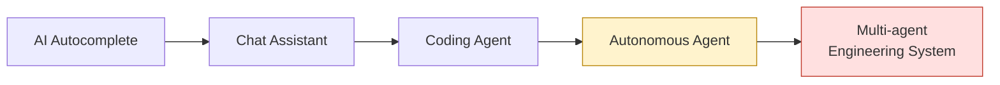
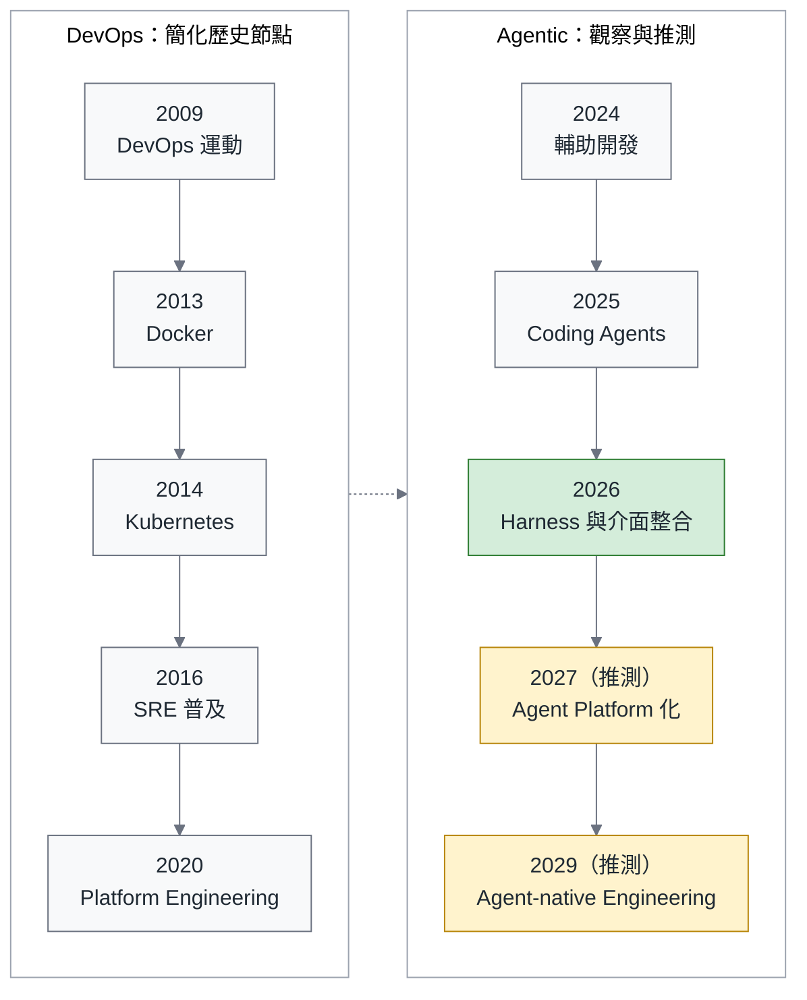
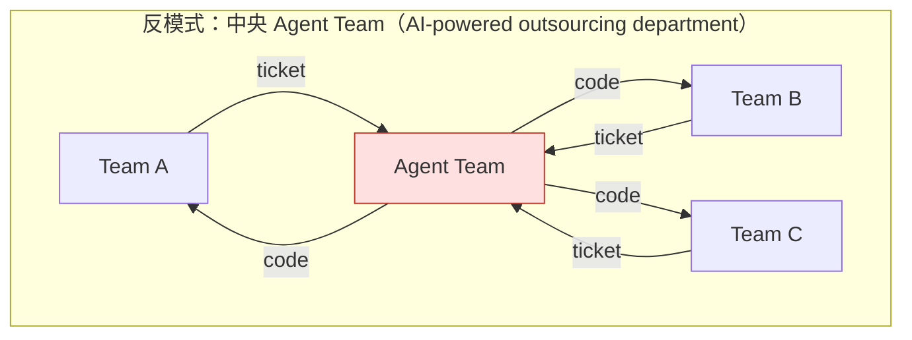
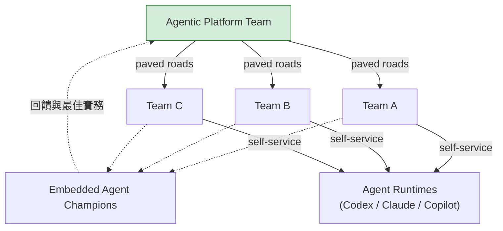
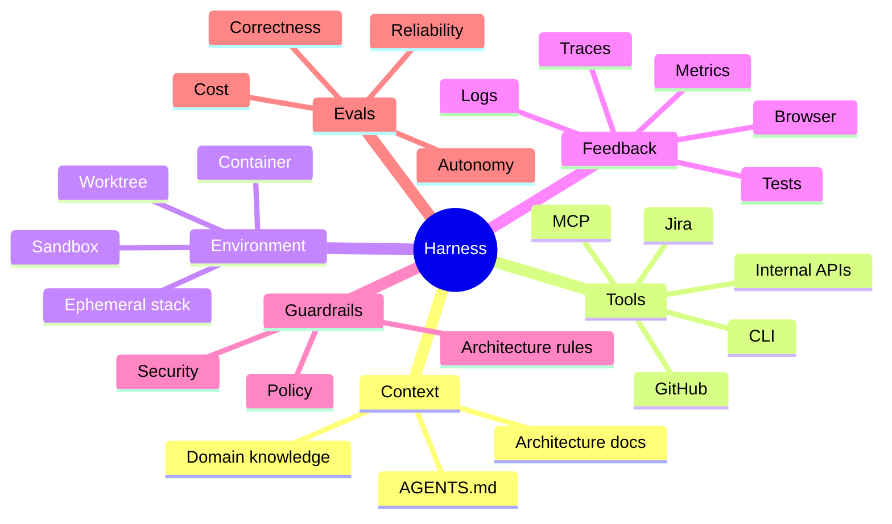
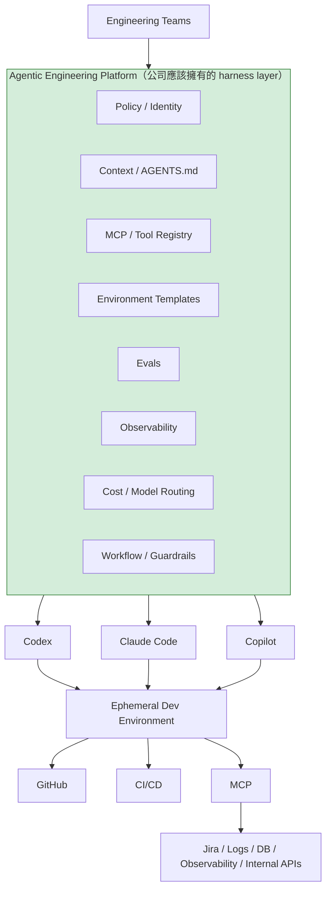
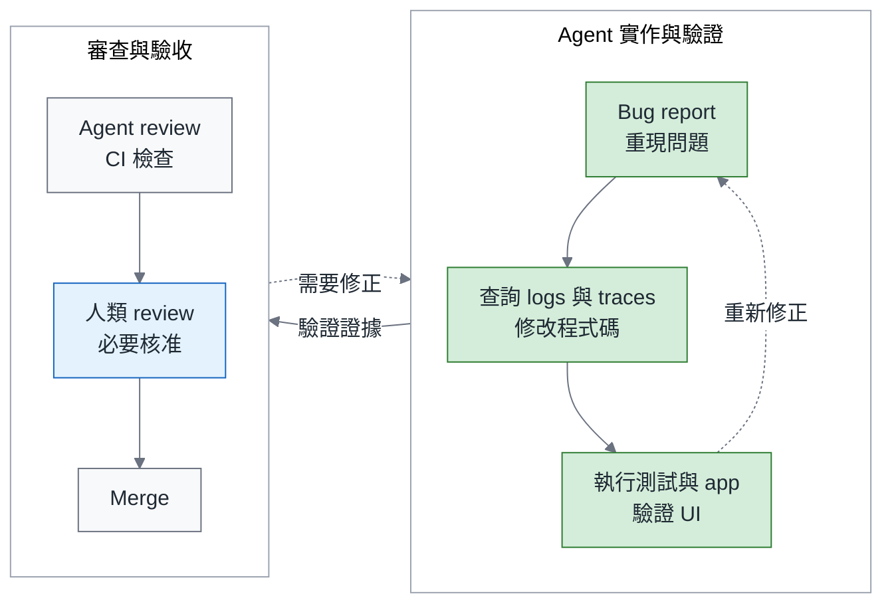
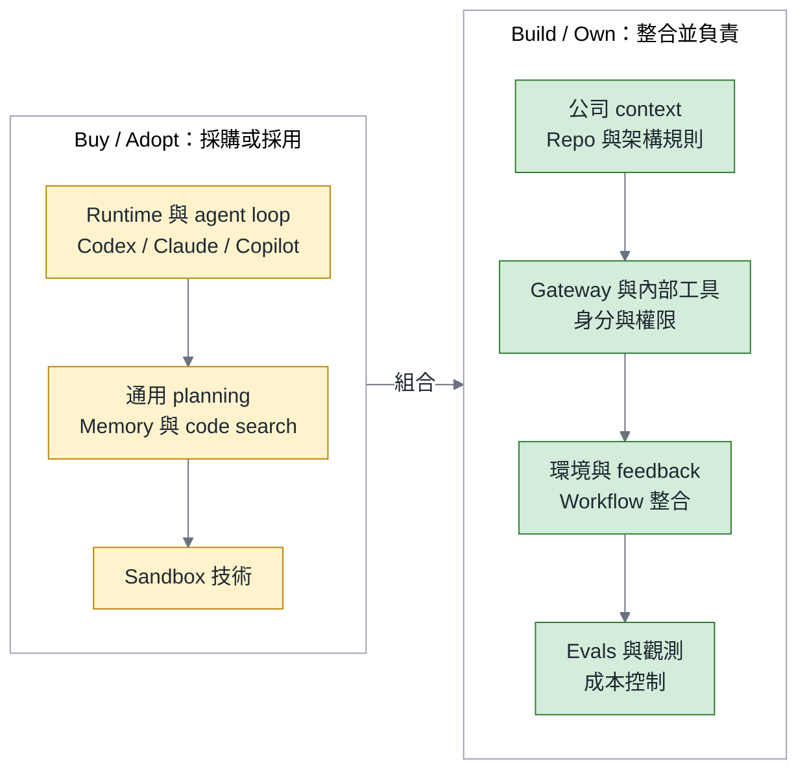

# 別急著打造你的 Devin：Agentic Engineering 的組織策略與 90 天行動藍圖

> **TL;DR** — 工程組織值得投資 Agentic Engineering，但起點應該是讓產品團隊能在清楚的權限、環境與驗收條件下使用 agent。我的建議是：依規模安排 champions 或小型 Platform / Enablement Team，優先採用通用 runtime，把力氣放在組織需要的 harness 與回饋迴圈。以 2026 年 9 月的觀察來看，這讓我想到 DevOps / Cloud Native 在 2014–2016 年的階段：元件逐漸齊備，組織分工與維護方式仍在摸索。本文整理這個歷史對照、組織與採購判斷，最後提出可依自身條件調整的 90 天 pilot 藍圖。

> 系列導覽：**總論（本篇）** → [一、組織篇](https://fantasybz.medium.com/agentic-engineering-%E4%B8%89%E9%83%A8%E6%9B%B2-%E4%B8%80-%E8%AA%B0%E4%BE%86%E5%81%9A-platform-federation-%E7%9A%84%E7%B5%84%E7%B9%94%E8%A8%AD%E8%A8%88%E5%AF%A6%E5%8B%99-9d9353ef7f3a) → [二、技術篇](https://fantasybz.medium.com/agentic-engineering-%E4%B8%89%E9%83%A8%E6%9B%B2-%E4%BA%8C-harness-%E8%97%8D%E5%9C%96-%E6%8A%8A%E7%B3%BB%E7%B5%B1%E8%AE%8A%E6%88%90-agent-%E8%AE%80%E5%BE%97%E6%87%82%E7%9A%84%E5%9C%B0%E6%96%B9-f2a139f5b561) → [三、營運篇](https://fantasybz.medium.com/agentic-engineering-%E4%B8%89%E9%83%A8%E6%9B%B2-%E4%B8%89-eval-%E5%96%AE%E4%BD%8D%E7%B6%93%E6%BF%9F%E8%88%87%E8%A6%8F%E6%A8%A1%E5%8C%96-%E6%8A%8A-agent-%E7%95%B6%E7%94%A2%E5%93%81%E7%87%9F%E9%81%8B-d6d9623c2dc6)

---

## 一、工程主管先要回答的問題

當 agent 從個人工具走進團隊流程，工程主管要面對的問題也跟著改變：除了選哪一個工具，還得決定誰來維護環境、誰驗收結果，以及這筆投資想改善什麼。我想從三個問題開始：

- 我們要不要成立一個 AI Agent Team？
- 我們要不要自己打造 harness，甚至自己的 agent？
- 現在投資，是太早還是已經太晚？

這篇文章整理我對這三個問題的判斷。核心主張是：

> **Own your Agentic Engineering Platform, but don't own the whole agent.**

要落實這個主張，需要先理解市場正在提供什麼，再回頭看 DevOps 的組織經驗，最後才安排分工、決定採購與自建範圍，並設計 pilot。

我在意這個順序，是因為一個看起來很有能力的 agent，還不能回答團隊導入後由誰照顧它。把技術選項與日常責任一起想清楚，才比較有機會讓試用留下可維護的成果。

---

## 二、2026 年，市場實際走到哪裡了

先用一張示意圖區分幾種工作方式。圖中描述的是人可能交付給 agent 的任務範圍，不是每個組織都必須依序走過的成熟度階梯。

產品正在探索較長時間的自主執行與多 agent 協作；實際使用時，團隊仍會依任務風險保留不同程度的人類參與：



兩份調查有助於看清這個落差。[Google 的 2025 DORA 調查](https://blog.google/innovation-and-ai/technology/developers-tools/dora-report-2025/)涵蓋近 5,000 名技術工作者，報告指出受訪的軟體開發專業人士中，90% 在工作中使用 AI，但對其產出高度信任的約為 24%。[Stack Overflow 2026 年的 pulse survey](https://stackoverflow.blog/2026/05/27/agents-on-a-leash-agentic-ai-remains-mostly-monitored-at-work/)則在約 1,100 名開發者與工作者中觀察到 59% 使用 agent；相較前一年 Developer Survey 的 31%，比例上升，但這不是追蹤同一群人的實驗。同份 pulse survey 也有 63% 表示很少或從不讓 agent 完全自主執行。這些結果讓我認為，使用正在擴展，驗證與人工監督仍是導入的一部分，不能直接把採用 AI 等同於全面委派工作。

下面整理幾種產品方向，以及我從中讀到的工程意義。右欄是我的解讀，產品能力仍需在實際環境中驗證：

| 生態 | 觀察方向 | 我認為值得注意的工程意義 |
|---|---|---|
| **OpenAI Codex** | Harness Engineering、agent 參與開發與驗證 | Repo 與回饋環境需要一起設計 |
| **Anthropic Claude Code** | 長任務的初始化、逐步執行與跨 session 交接 | Agent 需要可接續的工作狀態 |
| **GitHub Copilot** | Cloud agent、研究與規劃、repo 內的 custom agents | Repository 逐漸承載 agent 的工作管理 |
| **Google Antigravity** | 以 agent 為中心的開發環境 | 開發介面需要支援委派、檢查與調整方向 |
| **Cursor** | Cloud agents、VM 環境與執行結果的驗證 | 遠端工作環境成為產品能力的一部分 |
| **Devin 與同類產品** | 將較完整的開發任務交給 agent | 任務拆解與驗收責任需要重新安排 |
| **Open ecosystem** | MCP、AGENTS.md、goose、AAIF | 工具與 context 的互通有了共同協作的基礎 |

其中幾個工程案例，讓上述方向更具體。

### OpenAI：工程師的工作變成設計環境

OpenAI 在 [Harness Engineering 文章](https://openai.com/index/harness-engineering/)中，自述團隊約五個月的實作成果：repo 累積約一百萬行內容，包含產品程式碼、基礎設施、工具與文件，並有約 1,500 個已開啟且合併的 PR。團隊從三位工程師起步，撰文時已增加到七位。這是特定團隊的經驗，不能直接當成所有組織的生產力倍率；我更在意的是，他們把工程師的工作延伸到 **environment、constraints 與 feedback loops 的設計**，讓 agent 有條件持續完成任務。

### Anthropic：讓長任務能在不同 session 之間接續

Anthropic 在 [Effective harnesses for long-running agents](https://www.anthropic.com/engineering/effective-harnesses-for-long-running-agents) 中，描述了兩種分工：initializer agent 先準備工作環境，coding agent 再逐次推進任務，並留下後續 session 能理解的紀錄。這個案例提醒我，長任務的困難包含如何保存進度、辨認未完成工作，以及驗證前一次修改。它需要的支援超過一段好的 prompt。

隨著 model 能力與任務形式改變，這些設計也要重新評估。因此我會優先採用現成 runtime，再確認它缺少哪些組織特有的能力。若要自建，應先說清楚現成方案無法滿足的需求，以及長期維護成本。

### GitHub：Repository 變成 agent 的工作管理系統

GitHub 的 [Copilot cloud agent](https://github.blog/changelog/2026-04-01-research-plan-and-code-with-copilot-cloud-agent/)把工作延伸到 codebase 研究、實作規劃與分支上的修改；[Custom agents](https://docs.github.com/en/copilot/how-tos/copilot-on-github/customize-copilot/customize-cloud-agent/create-custom-agents) 則提供定義工作角色與工具的方式。我把這個方向理解為：repository 除了保存程式碼，也逐漸成為安排 agent 工作與審閱結果的地方。

### Cursor：CI Runner 演化史的重演

Cursor 的 [Cloud Agent 經驗](https://cursor.com/blog/cloud-agent-lessons)把 dedicated VM、依賴與網路存取視為產品的一部分。他們在[開發環境文章](https://cursor.com/blog/cloud-agent-environment)中進一步說明，光寫 skills 不足以解決複雜的 build 指令，還需要簡化操作入口、維持環境健康，並讓 agent 實際執行與驗證修改。這讓我想到 CI runner 的演化：工作能否穩定開始、失敗時能否診斷，會直接影響工具能否成為日常流程。

### 最大的訊號：標準化開始收斂

2025 年 12 月，Linux Foundation [宣布成立 Agentic AI Foundation（AAIF）](https://www.linuxfoundation.org/press/linux-foundation-announces-the-formation-of-the-agentic-ai-foundation)，初始貢獻包含 **MCP、AGENTS.md 與 goose**。這些專案分別處理工具連接、repo 指引與 agent 實作。對我來說，值得注意的是互通介面有了共同協作的基礎；距離各種工具都能順利整合，仍需要實際的相容性與治理工作。

---

## 三、DevOps 的歷史，其實已經演過一次

先講清楚這個對照的用途。我不是說 Agentic Engineering 會照抄 DevOps 的每一步，而是想借 DevOps / Cloud Native 的演化經驗，幫我們辨認今天哪些東西只是新名詞，哪些其實是舊問題換了新的執行者。

用這個角度看，可以找出一些相似的工程責任。下面是類比，不代表兩欄的工具功能完全相同：

| DevOps / Cloud Native | Agentic Engineering |
|---|---|
| Shell scripts | Prompt |
| Jenkins job | Agent workflow |
| CI runner | Agent sandbox |
| Dockerfile | Agent environment definition |
| Kubernetes | Agent orchestration |
| Helm / templates | Agent skills / workflows |
| Service mesh | MCP / agent gateway |
| SRE observability | Agent observability / traces |
| CI quality gates | Agent evals |
| IDP / Backstage | Agentic Engineering Platform |
| "You build it, you run it" | **"You specify it, agents build it, you own it"** |

最後一列把責任說得最清楚：即使由 agent 執行實作，需求、驗收與交付後的責任仍由組織承擔。前面的元件可以更換，這項責任不會因為使用新工具而轉移。

下圖把兩段發展並列，作為理解問題的參考。DevOps 的年份是簡化的歷史節點；Agentic 部分的 2027 與 2029 是我的推測，並非已確定的產業時程：



我把 2026 年理解為一個基礎元件逐漸齊備、整合方式仍在摸索的階段，這點與 Kubernetes 出現前後有些相似。接下來值得投入的問題很具體：agent 如何執行、取得 context、使用 tools、受到限制，以及留下可調查的紀錄。

而 DevOps 留下最大的組織教訓是：

> **不要把一個文化與能力問題，變成另一個 functional silo。**

如果 DevOps Team 只是成為新的交接窗口，原本等待 Ops 的 ticket queue 就可能換個名字繼續存在。Platform Team 與 paved roads 的價值，在於把重複能力整理成各團隊能自助使用的服務。規劃 Agentic Engineering 時，我會先檢查是否也在建立另一個需求排隊的地方。

---

## 四、不要成立這種 Team

假設組織成立中央 Agent Team，讓產品團隊把開發需求交給它處理，工作就可能變成下圖這樣：



這種模式需要留意兩個限制，即使中央團隊很有能力，也不會自然消失：

1. 產品需求集中排隊，容易讓中央團隊成為交付瓶頸。
2. Domain context 與驗收判斷需要持續交接；如果產品團隊只負責提需求，中央團隊就得反覆補問背景。

此外，我也會在導入計畫裡檢查三種風險：

- **過早自建 runtime**：在尚未驗證需求之前，先投入數月重做完整 agent，容易背上持續追趕通用能力的維護成本。先採用現成方案，確認缺口後再決定自建範圍。
- **AGENTS.md 無人維護**：要求每個 repo 建檔，卻沒有 owner、更新流程與效果檢查，文件就可能隨程式碼演進而失效。Context 需要跟著工作方式持續整理。
- **Review 成為瓶頸**：當 PR 產出增加，審查與驗證能力若沒有跟上，等待與返工可能抵銷收益。需要一起改善測試、review 支援與工作量安排，並觀察 reviewer 是否真的減少負擔。

---

## 五、應該成立這種 Team

我建議的起點是 **Platform + Federation**。中央 Platform Team 維護共用的環境、權限、工具與 eval，domain team 在這條預設路徑上自助工作，embedded champions 則協助導入並把問題帶回平台。預設路徑要持續驗證，不能因為由平台提供就視為沒有風險。



這套分工需要先說清楚 ownership：跨 repo 的共用基礎設施與控制機制由 Platform Team 維護，產品需求、domain 判斷與驗收則由 Product Engineering Team 負責。發生事故時，兩邊仍要依各自負責的環節共同處理。

可以先用下面的分工表討論，再為實際流程指定 owner：

| Agentic Platform Team 負責 | Product Engineering Team 負責 |
|---|---|
| Agent runtime integration | Business requirements |
| Vendor abstraction | Acceptance criteria |
| MCP gateway | Domain MCP tools |
| Identity / secrets | Domain permissions |
| Sandbox | Domain environment |
| Agent observability | Domain dashboards |
| Eval framework | Eval cases |
| Cost / quota | Usage |
| AGENTS.md template | Repo 的 AGENTS.md |
| Golden workflows | Domain workflow |
| Security guardrails | Production ownership |

這份分工可以整理成一個合作關係：

> **Platform Team 建 harness；Product Team 建 agent-legible software。**

這兩項工作需要分別有人負責，也需要一起驗證。

Harness 提供受控的工作環境；agent-legible software 則讓產品系統有清楚的測試、文件、logs、traces 與規則，支援 agent 理解與驗證修改。平台提供道路，產品團隊補上領域裡的路標；任何一邊缺席，另一邊都很難獨自完成這件事。

下面是我用來開始討論人力的建議值，不是業界標準。實際編制還要看 repo 數量、風險、既有平台能力與支援需求，champion 工時也要排進工作計畫：

| Engineering 規模 | 建議 |
|---:|---|
| < 30 人 | 不成立 Team；1–2 位 champions |
| 30–100 人 | 仍不編專職：2 位 champions（各 20%）+ 1 位 sponsor；champions 過載才開 2–4 人的 Enablement Pod |
| 100–500 人 | **4–8 人的 permanent Agentic Platform Team** |
| > 500 人 | Agent Platform + Eval + Security 專業分工（8–12 人起跳） |

即使超過 500 人，我仍會把重點放在共用能力與自助流程。不同規模的編制、skill mix，以及何時需要增加人力，可參考系列的[組織篇「誰來做？Platform + Federation 的組織設計實務」](https://fantasybz.medium.com/agentic-engineering-%E4%B8%89%E9%83%A8%E6%9B%B2-%E4%B8%80-%E8%AA%B0%E4%BE%86%E5%81%9A-platform-federation-%E7%9A%84%E7%B5%84%E7%B9%94%E8%A8%AD%E8%A8%88%E5%AF%A6%E5%8B%99-9d9353ef7f3a)。

**Champion 怎麼選、人怎麼培養**，也需要放進計畫。擅長測試、文件、CI/CD 與 developer experience 的工程師，往往能辨認同事在哪裡卡住，並把解法整理成可重用的流程。除了技術能力，組織還要給他們協助同事的時間與支援。

我也希望 junior engineer 能參與這個過程。拆解問題、定義驗收與判斷結果，需要實際練習；在 senior 帶領下 review 範圍清楚的 agent PR，可以是其中一條路徑。同時仍要保留親手實作、除錯與寫測試的機會，核准責任則依能力與風險安排，不能把新人直接放在最後一道防線。

---

## 六、Harness 不是 Prompt

分工確定之後，下一個問題是 Platform Team 要提供什麼。前面談到的自助能力，需要一套能支援實際任務的環境，才能從組織圖走進日常工作。

這裡的 harness 把 context、tools、environment、feedback、guardrails 與 evals 整合起來，支援 agent 取得資訊、執行操作、檢查結果，並在授權範圍內工作。

我會從這六個面向檢查團隊的環境是否完整：



Prompt 仍然重要，但它需要與可用的工具、明確的權限及可靠的驗證方式搭配。Harness Engineering 讓團隊能一起檢查這些條件，而不把所有問題都歸因於提示文字。

### AGENTS.md：從專案介紹走向操作指引

以 Context 為例，AGENTS.md 可以把專案背景延伸成實際操作指引。下面用假設的訂單系統說明差別，指令與路徑仍要換成專案實際使用的內容：

```text
# 專案背景
本專案是訂單系統，使用 Go 與 PostgreSQL，採用 clean architecture。

# 補上操作方式與限制
- 修改期間先執行受影響的測試：`make test FILTER=<path>`；提交前執行 `make test`
- `legacy/` 預設不可修改；需要變更時，先開 issue 請 @platform-team 審核
```

專案背景幫助理解系統，操作指引則交代下一步怎麼做、遇到限制時找誰處理。這些文字本身不會阻止寫入；需要強制遵守的邊界，仍要由工具權限與 CI 落實。

檢查品質時，我會看 agent 或新進工程師是否找得到必要指令、能否完成驗證，以及卡住時是否知道向誰求助。再搭配代表性任務的 eval，確認文件對實際行為有什麼影響。

把這些能力放進完整系統，可以看見平台需要整合的位置：



圖中的中間層可以包含採購、自建與既有服務。組織需要掌握的是它們如何一起工作，以及誰負責維護與變更。

### Guardrails 不是選配

Policy、Identity 與 Guardrails 需要及早和資安團隊一起設計。我會先確認三件事：

- **身分與最小權限**：每次 agent run 都有可追溯的 identity 與受限憑證，只開放任務需要的資源。可以用「五分鐘內找出 run、權限與操作」作為初始演練目標，再依風險設定要求。
- **不可信輸入的處理**：issue、PR comment、外部網頁與 log 可能包含惡意指令。工具授權、sandbox 隔離與 egress policy 需要一起限制可執行的操作，並用攻擊情境驗證。
- **Audit trail**：保留 tool call、政策判斷、結果與必要的人工核准紀錄，敏感內容則要遮蔽。這些資料需要能對應回同一次 run，支援調查與改善。

---

## 七、真正的護城河：Agent Legibility

讀 OpenAI 的 Harness Engineering 文章時，我最在意的是它對 agent legibility 的投入。我把這個方向整理成一句話：

> **Make the system legible to agents.**

這裡的 legible，指的是讓 agent 取得工程師除錯與 review 時需要的線索，並知道如何使用。文件是其中一部分，還包括可查詢的執行狀態與可重複的驗證方式。

在適當權限下，把 logs、metrics、traces、browser 狀態、tests、架構規則與 PR feedback 提供給 agent，才能形成下圖的迴圈。CI 通過後仍要符合團隊的 review 與核准要求，才進入合併：



人類仍負責意圖、架構、限制、風險、優先順序與驗收，也需要處理流程尚未涵蓋的例外。是否保留逐項 review，應由任務風險與已取得的證據決定。

對我來說，Agentic Engineering 的重點，是讓工程師除了實作，也能持續改善委派、回饋與驗收的條件。它改變了工作的分配，沒有取消工程判斷的責任。

### Brownfield 怎麼辦

上面的流程需要可用的測試與觀測資訊。維護多年既有系統的團隊，可能還要先補足這些基礎。我會挑一條範圍清楚的流程，依下列優先序安排改善，必要時讓工作重疊進行：

1. **建立 characterization tests**：記錄現有行為，讓後續差異可見，再由熟悉產品的人確認哪些行為應保留。現況可能包含 bug，不能直接把基準當成正確答案。
2. **改善 logs 與 traces**：補足定位問題需要的欄位、版本與輸入線索。有時要先改善觀測，才有辦法建立重現測試。
3. **落實架構規則與文件**：把已確認的邊界納入 CI，並交代驗證方式。必要的權限限制與工作指引，不必等前兩項全部完成才開始。

這些投資也會幫助新進工程師理解系統，減少同事反覆補問背景的負擔。即使 pilot 沒有擴大，可用的測試、清楚的錯誤訊息與可維護的文件，仍能留在團隊日常工作裡。

---

## 八、哪些該 Buy，哪些該 Build

Buy 與 Build 的判斷，要回到組織需要掌握什麼。下圖的 Buy / Adopt 列出可以優先評估的通用能力，Build / Own 則列出需要由組織負責整合與維護的內容；後者同樣可以採用現成元件：



我會用這句話提醒自己，把維護責任放在真正需要理解自身工作負載的地方：

> **Buy the intelligence. Build the environment. Own the feedback loop.**

通用 runtime、planning 與 sandbox 工具會持續演進，自建之前應先評估現成方案。組織更需要累積的是自己的 context、conventions、eval dataset 與回饋流程。這些資產也會過時，但持續維護它們，能讓團隊在更換 model 或工具時保有判斷依據。

---

## 九、Eval：把工程經驗累積成可驗證的資產

Eval dataset 值得投入，是因為它能把團隊經歷過的問題，整理成下一次評估時可重複使用的案例。起點通常已經存在於工程歷史裡，但還需要整理與查證：

- **從 incident 整理案例**：重建當時的症狀、版本與必要輸入，確認能夠重現。根因與修復答案保留在評分端，不能洩漏給受測 agent。
- **從 PR history 找出判斷缺口**：review comment 可以提供線索，但仍需查證；已合併的 PR 也要確認實際結果，才能作為參考答案。
- **建立 golden tasks**：先選 10–20 個代表性的已完成任務，固定 context 與驗收條件，作為小型起始集合。Model 或 harness 改版時重新執行，再逐步擴充任務類型。

第一版不必全自動化，可以先用測試結果與人工 rubric 建立基準，再安排持續抽查。這需要明確的維護工時，也要保留不穩定案例的執行紀錄。它提供的是判斷「要不要換 model」與「這次改動是否有幫助」的證據，不能用少量樣本保證所有任務都可靠。

當團隊持續把新需求與失敗案例補進來，過去的經驗就能支援下一次選型與改造。這是我所說的累積價值：每一次比較都能沿用已建立的基準，同時修正它不再適用的部分。

---

## 十、如果我是 Engineering VP，我會怎麼決策

如果要審查一份投資計畫，我會先要求下列提案補清楚需求與維護理由：

> 「成立 10 人 AI Agent Team，打造公司自己的 Devin。」

對已有多個產品團隊、也具備平台基礎的組織，我更願意支持這樣的起點：

> 「安排 4–6 人的 Agentic Engineering Platform Team，先讓少數 pilot teams 在明確權限與驗收條件下自助使用現成 agent；半年內依成效與支援能力，決定下一批開放範圍。」

第一年要檢查的工程效益，不能只靠 AI generated LOC 或 PR count。我會同時觀察四個面向：

```text
Delegation: share of eligible tasks assigned to agents
Completion: accepted tasks / delegated tasks
Attention: human effort needed per comparable task
Quality: defects discovered after delivery
```

這四項是判斷方向的框架，不是可以直接相乘的公式。Delegation 與 Completion 的分母不同，人工投入與品質也有各自的單位。實際營運時，要依相近任務比較各項變化，才看得見收益是否以其他代價換來。

週會或月會可以從下面這組指標開始，但要先約定定義與觀察期間：

| 指標 | 用來檢查什麼 |
|---|---|
| Time to Merge | 在相同起訖定義下，交付週期是否縮短 |
| Human Review Minutes / PR | 審查投入如何改變，並搭配返工時間 |
| Agent Retry Rate | 多少委派任務需要額外嘗試，再追查原因 |
| Eval Pass Rate | 在這份 dataset 與評分標準下的表現 |
| Production Escape Rate | 同批交付變更中，交付後才發現缺陷的比例 |
| Cost / Successful Task | 包含失敗與重試成本，每件通過驗收任務的直接成本 |
| Autonomous Completion Rate | 已委派任務中，不需人工中途修正且通過驗收的比例 |

其中 **Cost / Successful Task** 要把同一觀察期內的失敗、重試與放棄成本一起計入，再除以通過驗收的任務數。比較總效益時，還要另外看人工 review、返工與平台維護。Escape rate 則需固定缺陷定義與交付後觀察窗口，避免把尚未發現的問題誤認為品質改善。

- **Model routing 依任務驗證**：平台維護共同路由，domain team 提供風險與驗收條件，再用 eval 比較選項。測試與 lint 可以直接執行工具，不必為了每一步都安排 LLM；高風險判斷仍要保留適當的人類責任。
- **Retry rate 用來引導調查**：查看是 context 不足、feedback 不清楚、工具故障，還是 model 與任務不匹配。只有確認原因，才知道應該修哪一層，不能把所有重試都歸咎於 harness。

這些數字應該幫團隊找出下一個要改善的問題。若只追求 PR 件數或執行次數增加，就容易忽略工作是否更可靠，以及人的負擔是否真的減少。

我也有一個推測：到 2028–2030 年，部分組織可能不再單獨使用「Agentic Engineering Team」這個名稱，而把能力整合進 Developer Platform、SRE、Security 與 Engineering Productivity。名稱如何變化不是重點，維護、驗收與支援責任仍需要有人承擔。

---

## 十一、前 90 天的行動藍圖

如果決定開始，我會把前 90 天當成有範圍的學習與驗證，而不是全面導入的倒數。下面是排程建議，退出條件未達到時就調整範圍或延長觀察：

| 階段 | 工作重點 | 進入下一步前的檢查 |
|---|---|---|
| **第 1 個月** | 選定 2 個 pilot teams 與 champions；量測交付時間與人工投入 baseline；完成 runtime、sandbox 與權限準備 | Owner 與支援工時明確，代表性任務可在受控環境開始執行 |
| **第 2 個月** | 建立第一條 golden workflow，例如範圍清楚的 bug fix；維護 repo 指引；整理前 10–20 個 eval cases | 任務有驗收證據，失敗與重試可追查，知道何時交回人類 |
| **第 3 個月** | 比較相近任務的 baseline、品質、人工負擔與成本；檢視是否繼續或擴大 | 有紀錄支持 go / no-go；通過審查後才分批開放下一批 teams |

執行時，我會特別留意三件事：

1. **挑有價值、也能限制影響的任務**。Internal tools、測試補強與 bug backlog 都可能合適，但仍要檢查它們接觸的資料與外部系統。
2. **開始前留下可比較的 baseline**。記錄任務類型、起訖時間、review 與返工投入；前後比較仍受工作量與人員變化影響，不能只靠一個數字宣稱因果。
3. **先照顧 pilot team 的實際需要**。把卡住的步驟、等待支援的時間與驗收困難處理好，再考慮覆蓋更多團隊。

---

## 十二、結語

回到開場的三個問題，我的判斷是：組織可以從範圍清楚的 pilot 開始投資，不必先把整套 agent 自己做出來。更值得累積的能力，是：

> **讓適合的 agent，在清楚的環境、限制與驗收條件下，參與你的工程工作。**

這份能力需要產品團隊、平台與資安一起維護。它讓工程師遇到問題時找得到支援，也讓組織更換工具時仍保有判斷依據。比起先猜哪一家 vendor 最終勝出，我會先讓團隊完成一輪可驗證的工作，再用那份經驗決定下一步。

---

### 系列文章

本文是「Agentic Engineering 三部曲」的總論。三篇深掘分別把組織分工、技術設計與營運判斷展開，供團隊依自身條件安排實作：

1. **總論（本篇）**：市場現況、DevOps 對照、決策框架與前 90 天藍圖
2. [一、組織篇：誰來做？Platform + Federation 的組織設計實務](https://fantasybz.medium.com/agentic-engineering-%E4%B8%89%E9%83%A8%E6%9B%B2-%E4%B8%80-%E8%AA%B0%E4%BE%86%E5%81%9A-platform-federation-%E7%9A%84%E7%B5%84%E7%B9%94%E8%A8%AD%E8%A8%88%E5%AF%A6%E5%8B%99-9d9353ef7f3a)—編制、champion 制度、整併決策、預算敘事
3. [二、技術篇：Harness 藍圖—把系統變成 agent 讀得懂的地方](https://fantasybz.medium.com/agentic-engineering-%E4%B8%89%E9%83%A8%E6%9B%B2-%E4%BA%8C-harness-%E8%97%8D%E5%9C%96-%E6%8A%8A%E7%B3%BB%E7%B5%B1%E8%AE%8A%E6%88%90-agent-%E8%AE%80%E5%BE%97%E6%87%82%E7%9A%84%E5%9C%B0%E6%96%B9-f2a139f5b561)—AGENTS.md 三層架構、MCP gateway、sandbox、brownfield playbook
4. [三、營運篇：Eval、單位經濟與規模化—把 agent 當產品營運](https://fantasybz.medium.com/agentic-engineering-%E4%B8%89%E9%83%A8%E6%9B%B2-%E4%B8%89-eval-%E5%96%AE%E4%BD%8D%E7%B6%93%E6%BF%9F%E8%88%87%E8%A6%8F%E6%A8%A1%E5%8C%96-%E6%8A%8A-agent-%E7%95%B6%E7%94%A2%E5%93%81%E7%87%9F%E9%81%8B-d6d9623c2dc6)—eval pipeline、成本模型、指標反作弊、scaling gates

---

### References

1. OpenAI — [Harness engineering: leveraging Codex in an agent-first world](https://openai.com/index/harness-engineering/)
2. Anthropic — [Effective harnesses for long-running agents](https://www.anthropic.com/engineering/effective-harnesses-for-long-running-agents)
3. GitHub — [Research, plan, and code with Copilot cloud agent](https://github.blog/changelog/2026-04-01-research-plan-and-code-with-copilot-cloud-agent/)、[Creating custom agents for Copilot cloud agent](https://docs.github.com/en/copilot/how-tos/copilot-on-github/customize-copilot/customize-cloud-agent/create-custom-agents)
4. Cursor — [What we've learned building cloud agents](https://cursor.com/blog/cloud-agent-lessons)、[How we set up our cloud agent environment](https://cursor.com/blog/cloud-agent-environment)
5. Linux Foundation — [Announcing the Agentic AI Foundation（AAIF）](https://www.linuxfoundation.org/press/linux-foundation-announces-the-formation-of-the-agentic-ai-foundation)
6. Google — [2025 DORA report: How are developers using AI?](https://blog.google/innovation-and-ai/technology/developers-tools/dora-report-2025/)
7. Stack Overflow — [Agents on a leash: Agentic AI remains mostly monitored at work](https://stackoverflow.blog/2026/05/27/agents-on-a-leash-agentic-ai-remains-mostly-monitored-at-work/)
8. Google — [Antigravity](https://antigravity.google/)
9. Cognition — [Devin](https://devin.ai/)

---

### AI 協作說明

本文由筆者提出初步構想與章節架構，文字撰寫由 AI（Claude）協作完成，再經筆者逐節校閱與修訂後定稿。文中觀點與判斷為筆者所持，文責亦由筆者自負。

---

*本文發表於 [Medium @fantasybz](https://medium.com/@fantasybz)。英文版：[English edition](https://fantasybz.medium.com/dont-build-your-own-devin-org-strategy-and-a-90-day-blueprint-for-agentic-engineering-8187e7ec80f9)。若你也在建立組織的 Agentic Engineering 能力，歡迎交流。*
