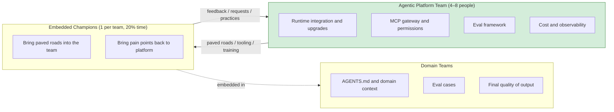
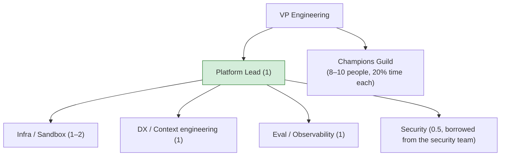
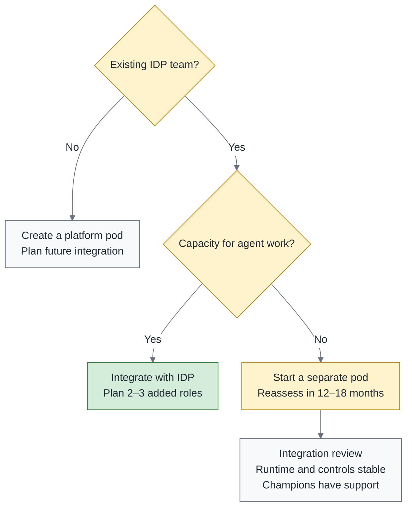

# Agentic Engineering, Part 1 — Who Does This? Platform Plus Federation in Practice

> **TL;DR** — The first deep dive from [Don't Build Your Own Devin](https://fantasybz.medium.com/dont-build-your-own-devin-org-strategy-and-a-90-day-blueprint-for-agentic-engineering-8187e7ec80f9). The overview proposes champions or a small Agentic Platform team according to organizational scale and workload, helping product teams use and improve agents more independently. This piece turns that proposal into concrete options for a headcount discussion: suggested staffing models at three company sizes, how to select and evaluate champions, how to merge with your existing DevEx or SRE function, and the budget narrative that works with a CFO.

> Series: [Overview](https://fantasybz.medium.com/dont-build-your-own-devin-org-strategy-and-a-90-day-blueprint-for-agentic-engineering-8187e7ec80f9) → **1. Org Design (this piece)** → [2. The Harness Blueprint](https://fantasybz.medium.com/agentic-engineering-part-2-the-harness-blueprint-making-your-system-legible-to-agents-3facc281f633) → [3. Evals and Unit Economics](https://fantasybz.medium.com/agentic-engineering-part-3-evals-unit-economics-and-scaling-running-agents-like-a-product-1cb1855a2046)

---

## 1. Why organizations drift into the wrong design

The overview, Don't Build Your Own Devin, named four failure modes. This piece starts with the central agent team because it is often the easiest option to agree on in a headcount meeting: someone manages the budget, scarce expertise sits together, and security has a contact. Those needs are reasonable. The question is whether the new team will help product engineers do more of their own work independently.

I think of this tendency as three forms of organizational gravity. Understanding the needs behind them is the first step toward designing a different division of work:

- **Budget gravity.** When AI gets a new budget, finance needs to know who manages it. Creating a cost center and a team can quickly become the first answer.
- **Scarcity gravity.** Few people understand agents at first. Bringing them together appears to reduce duplicated exploration, but it can also keep every other team dependent on those same people.
- **Control gravity.** Legal and security need a clear point of contact. A central team can provide one without having to perform every task on everyone else's behalf.

Budget, expertise, and governance all need attention. Trouble starts when the design answers who will manage the work but leaves out how product teams will develop the capability themselves. What makes administration easier can then make delivery slower.

Conway's law reminds us that an organization's communication patterns shape its systems. Here I would work backward from the delivery model we want and arrange collaboration to support it. If every domain team must go through a central team to use agents, requests can turn into a ticket queue. Engineers who own a product gradually become people who submit requests and wait for a slot, instead of people equipped to solve the problem.

> If you want a self-service system, you have to draw a self-service org chart first.

---

## 2. Platform plus federation, in full

The overview gave the concept; RACI makes the responsibilities more explicit. R does the work, A is accountable for the result, C supplies necessary advice, and I receives relevant information. The headcount in the diagram is illustrative; the next section discusses staffing. For now, look at what the platform team, champions, and domain teams need to deliver to one another.

Where the champion sits matters. They still do product work inside the domain team, so they can bring adoption problems and their context back to the platform while helping colleagues use it. The paved road is a default path that integrates the runtime, sandbox, AGENTS.md template, and eval framework. When the platform handles that shared integration, each product team has less to rediscover on its own.

Put the three roles through RACI item by item and the split looks like this:

| Item | Platform Team | Champion | Domain Team |
|---|---|---|---|
| Runtime selection and upgrades | **R / A** | C | I |
| Sandbox and permission infrastructure | **R / A** | C | I |
| AGENTS.md template and standards | **A** | R (drives) | **R** (content) |
| Domain MCP tools | C | C | **R / A** |
| Eval framework | **R / A** | C | I |
| Eval cases (domain) | C | R (drives) | **R / A** |
| Cost and quota policy | **R / A** | I | C |
| Output quality and production ownership | I | I | **R / A** |

**Production ownership for the product stays with the domain team.** Using an agent does not transfer business judgment or acceptance to the platform. That does not let the platform step aside either: if an incident involves the sandbox, permissions, or shared tools, the platform team remains responsible for its part. RACI should help people find the right colleagues to resolve an incident, rather than give either side a way to disclaim responsibility.

---

## 3. Planning staffing at three sizes

RACI describes responsibilities. Staffing asks how much time those responsibilities take and which capabilities need dedicated maintenance. The 50-, 200-, and 1,000-engineer examples below are planning scenarios. Their headcounts and time allocations are my recommendations, not thresholds that automatically require a new team. Usage, system complexity, and existing platform capability still decide what fits.

### 50 engineers: the no-team version

- Start without dedicated headcount if the workload allows it: two champions at 20% time each, plus a sponsor such as a VP or senior EM who can coordinate resources.
- Evaluate a SaaS runtime and the vendor's sandbox first, checking that permissions, data handling, and audit capabilities fit your needs. A checklist can organize those checks at this stage; a custom gateway need not be the first investment.
- **Upgrade signal:** if champions spend more than 30% of their total working time helping other teams integrate tooling for several consecutive weeks, the promised 20% no longer covers the work. The sponsor should assess additional capacity or a dedicated pod.

### 200 engineers: a 4–6 person platform pod

Once adoption spans several teams, shared environments, permissions, and evals may need more maintenance than part-time champions can provide. The chart is one staffing proposal for an organization of roughly 200 engineers: four to five dedicated members plus half of a security role, within this section's suggested four-to-six-person allocation. Look beyond reporting lines and check that the borrowed time is actually available.

Drawing the chart is only the beginning. Can those people form a **product team** that serves internal engineers? The product is the paved road, so experience with developer tooling, CI, test infrastructure, and user feedback is closer to its daily work than a hiring plan built around model research alone.

The half security role is an explicit allocation of working time, not an extra responsibility somebody takes on after finishing their day job. That person remains managed and evaluated by security while participating regularly in platform design, risk decisions, and acceptance. Building that collaboration into the work makes it easier to understand constraints early, rather than asking security to review a finished system.

### 1,000 engineers: a platform group with specialization

- A platform group could have 8–12 people, divided by workload into **runtime and environment**, **context and tools**, and **eval and FinOps** squads.
- Bring representatives from security, legal, and platform into a virtual security council to review policy and exceptions. Monthly meetings can be a starting point; urgent risks still need a separate, timely decision path.
- Even at this scale, I would not create a service team that uses agents to write code for everyone else. Additional staffing should improve shared capabilities and support, rather than centralize product work in a queue.

Putting the scenarios side by side should help identify the capability you need next, rather than encourage you to choose the most elaborate org chart:

| Size | Dedicated | Champions | Governance | Next upgrade signal |
|---:|---|---|---|---|
| ~50 | 0 | 2 (20% time each) | Checklist plus verified vendor capabilities | Support work persistently exceeds allocated time |
| ~200 | 4–6 | 1 per team | Gateway plus policy as code | Evals and cost need dedicated people |
| ~1,000 | 8–12 (three squads) | Formalized guild | Platform plus council | Integrate responsibilities and services with the IDP |

I would read the last column before the staffing numbers. Some 50-person teams already face complex systems and governance requirements; some 200-person organizations can use an established IDP. The reason to change the arrangement is that it can no longer carry the work, not that the company has crossed a headcount threshold.

---

## 4. The champion system, and how it usually gets broken

Staffing the platform gives it capacity to offer a service. Helping domain teams adopt it still takes someone who can guide colleagues, organize problems, and carry feedback back to the platform. That easily overlooked work is the champion's responsibility.

A champion needs defined responsibilities and allocated time. Give the title to the most senior person without reducing their existing commitments or changing how they are evaluated, and it becomes difficult to support colleagues consistently. If the arrangement fades, the problem may be the conditions of the job rather than the person's commitment.

Naming people, opening a channel, and announcing a guild can happen quickly. Allocating time, coordinating product commitments, and following adoption outcomes are work for every quarter that follows. If those two parts never connect, an energetic launch can leave a few people carrying an extra job.

**Selection criteria** (these matter more than seniority):

| Experience to look for | What to explore in an interview |
|---|---|
| Uses agents in daily work and can explain results and limitations | Willingness to understand other teams’ repos and workflows |
| Maintains onboarding guidance or test infrastructure | Ability to turn a practice into instructions colleagues can use |
| Helps colleagues and turns recurring problems into requirements | How they preserve evidence and investigate inconsistent results |

The selection criteria ask whether someone will teach colleagues and turn recurring problems into actionable requests. Knowing the tools helps, but the champion's main contribution is helping other people use them well.

**Time and evaluation:**

- **Put the 20% in work plans and OKRs**, with a corresponding adjustment to existing delivery expectations. Promising time without reducing other work pushes coaching and collaboration into evenings.
- **Look at the team's outcomes:** whether suitable tasks are being delegated, retry rate is improving, and AGENTS.md still reflects reality. Read those signals alongside task mix and quality. Do not delegate unsuitable work just to raise a percentage, or attribute every model and platform change to the champion's individual performance.
- **Consider rotating half the champions each quarter**, with time for handover and mentoring. The purpose is to spread adoption and acceptance knowledge. Track participation, handover quality, and whether colleagues can increasingly resolve common issues themselves.

**The guild can start with a meeting every two weeks.** Internal demos show how the paved road helps with actual work. A list of problems goes into the platform backlog with an owner and a follow-up outcome. I would reserve time for **failure stories**: what the team meant to accomplish, where the run departed from that intent, how people noticed, and what check could help next time.

The value of a failure record is helping the next team avoid the same detour. If people preserve the symptoms, context, and response, the platform can turn that difficulty into documentation, a tool improvement, or an eval case. A discussion focused on learning from the work also makes it easier for colleagues to bring problems they have not yet solved.

---

## 5. Merging with what you already have

Most companies aren't starting from a blank page. You already have a DevEx team, a platform team, or SRE. So who owns agentic?

Before debating which department gets the name, I would establish two things: whether the company has an internal developer platform (IDP), and whether its maintainers have capacity for the additional work. The decision tree is a starting point for that conversation. Its staffing additions and merger timelines are planning assumptions that need to fit local conditions.

My direction is to **treat agentic capability as an extension of the IDP and work toward shared services and responsibilities.** If a separate pod helps get started, share backlog tooling and design reviews from day one, then revisit the conditions for integration. The 12–18 months in the diagram is a review window. Runtime stability, implemented governance, and sustainable champion collaboration matter more than reaching a date.

SRE can provide the existing observability stack so agent execution records use traces, metrics, and alerting the company already maintains. The platform team supplies the agent-specific data and workflows, and agrees with SRE on retention, access, and alert ownership. That uses existing experience without silently handing another team new maintenance work.

Additional signals include a run ID that connects a complete execution, the capabilities used and results returned by each tool call, retry reasons and counts, and token usage linked to cost. A high retry rate is a reason to investigate. On its own, it cannot tell you that the model, harness, or a particular team is at fault.

---

## 6. Budget and the pitch: what to tell a CFO

Bundle subscriptions, staffing, and adoption time into one AI budget, and it becomes hard to explain what grows with usage, what is a fixed investment, and how much work the team is absorbing. Separating those costs gives the CFO and engineering team a shared basis for discussing results and tradeoffs.

I would divide the budget into three buckets. The third needs an explicit allocation alongside the more visible tooling and staffing costs:

| Bucket | Contents | Behavior |
|---|---|---|
| **Run** | Tokens, vendor subscriptions, sandbox compute | Varies with task volume, model, context, and retries; separate fixed subscriptions |
| **Build** | Platform team staffing | Fixed allocation by staffing plan; this piece uses 4–6 people for the 200-engineer scenario |
| **Enable** | Champions' 20% time, training, the guild | Adjust existing delivery plans and track time actually invested |

Enable is easy to overlook because it uses the time of engineers already employed and may never appear on a new vendor quote. Yet that time changes what is available for product work. Recording it in the budget and schedule makes the tradeoff visible and helps keep the champion role from becoming two jobs at once.

**The ROI narrative** should begin with what the team can accomplish. I would not translate time savings directly into a number of engineers to replace: fewer minutes spent on an operation do not automatically become removable salary costs. What matters to me is whether attention spent repeatedly preparing environments, assembling context, and handling retries can return to product judgment and difficult problems.

**Attention leverage** can start with a comparable workload: multiply the reduction in average review time for PRs of similar risk and size by the number of those PRs. That estimates time potentially freed from this part of the work, not net capacity. Debugging, rework, training, and incident response also belong in the account. Compare production escape rate—the share of delivered changes in which defects are discovered after delivery—using the same definition and observation window. A flat rate is one piece of evidence about the quality tradeoff, not proof that quality was unchanged in every respect.

**Managing time expectations.** In year one, commit to a baseline for delivery speed, quality, and cost, then let pilot results guide further investment. Measure cost per successful task from the pilot onward, including failed attempts and retries. Control for task mix and cost scope when comparing results; there is no reason to wait until year two. Exploration can have a learning cost, but that tuition is worth continuing only when failures lead to verifiable improvements. Part 3, Evals, Unit Economics, and Scaling, develops that account further.

I would not make building a generic agent runtime a default budget item. The overview's buy-versus-build argument is about putting effort into company context, permissions, acceptance, and workflows. If existing products cannot meet a necessary requirement, first describe the gap, alternatives, and long-term maintenance cost. That gives the team a basis for deciding whether a custom implementation is worth funding.

---

## 7. Talent: hiring, transitions, and the junior path

How long the investment can last comes back to who has time to do the work and who can keep developing the needed skills. Hiring and internal transfers can fill immediate gaps. Growing junior engineers determines whether someone will be ready to take responsibility in the years ahead. All three belong in the plan.

**Hiring.** The keyword in the job description is not prompt engineering. Look for people who've built developer tooling, CI, test infrastructure, or documentation systems. The reason is that what this role handles every day is how engineers wire an agent into an existing workflow, not how to write a prompt that reads nicely.

I would also look at how a candidate approaches **debugging a non-deterministic system**. Suppose the same task passes once and fails once, with different diffs from the two runs. Do they preserve versions, inputs, and execution records, then use repeated runs to examine the distribution of outcomes and compare failure conditions? Patient evidence gathering fits this work better than expecting every problem to reproduce in one attempt.

**Assess internal transfers, then fill the missing expertise.** The first two or three members could come from DevEx or infrastructure, where people already know the systems, but those transfers need a handover of existing responsibilities. Eval engineering organizes tasks, acceptance criteria, and scoring. FinOps brings token use, compute, and human effort into one cost discussion. Which skills to develop internally and which to hire depends on the team you already have.

**The junior path** can have three stages. The months below are points for coaching and checking progress, not dates on which someone automatically acquires more responsibility:

1. **Month 1:** review low-risk agent PRs with a senior engineer and a checklist. Practice explaining requirements, inspecting tests, and asking for evidence. The aim is to understand why work counts as complete; final approval remains with someone who has the responsibility and authority to give it.
2. **Months 2–3:** help write and review eval cases, run tests, and reproduce problems. Practice turning a vague idea of correctness into conditions that can be checked.
3. **Months 4–6:** maintain a golden workflow with guidance, follow the problems users encounter and the results of checks, and expand responsibility as demonstrated capability grows.

The aim is an engineer who can define a problem, examine evidence, and make a judgment. Review is one way to practice, alongside implementation, debugging, and feedback. Even when an agent does part of the implementation, engineers need to understand how the code works to know what warrants investigation and when to ask a more experienced colleague to help.

Reserve every judgment for seniors and juniors lose opportunities to practice and receive feedback. Building a succession path requires time now; it cannot wait until experienced colleagues leave or the workload grows, when the organization suddenly needs somebody ready to take over.

---

## 8. Closing

Return to the opening problem: the budget needs an owner, scarce expertise needs a workable allocation, and security needs clear collaborators. Platform plus federation is my answer to those needs. Its division of work can be remembered this way:

> **Domain teams keep context and ownership. The platform team keeps leverage and guardrails. Champions keep the two talking.**

The value of the chart shows up in everyday collaboration. Domain teams know which capabilities they can use themselves and when to ask the platform for help. Champions have time to organize feedback, and the platform knows what its shared services need to improve. Budget and control pressures will return, but sending every request to a central team no longer has to be the only available answer.

Part 2, The Harness Blueprint: Making Your System Legible to Agents, describes the capabilities this arrangement maintains: AGENTS.md, the MCP gateway, sandboxes, and brownfield renovation. Assigning responsibility and time first gives those technical investments people who can keep them useful.

---

### The series

1. [Overview: Don't Build Your Own Devin](https://fantasybz.medium.com/dont-build-your-own-devin-org-strategy-and-a-90-day-blueprint-for-agentic-engineering-8187e7ec80f9)
2. **1. Org Design (this piece)**
3. [2. The Harness Blueprint: making your system legible to agents](https://fantasybz.medium.com/agentic-engineering-part-2-the-harness-blueprint-making-your-system-legible-to-agents-3facc281f633)
4. [3. Evals, Unit Economics, and Scaling: running agents like a product](https://fantasybz.medium.com/agentic-engineering-part-3-evals-unit-economics-and-scaling-running-agents-like-a-product-1cb1855a2046)

---

### On how this piece was made

The initial concept and chapter structure are the author's; the prose was drafted in collaboration with AI (Claude), then reviewed and revised section by section by the author before publication. The views and judgments are the author's own, as is responsibility for the content.

---

*Originally published in Chinese: [中文版](https://fantasybz.medium.com/agentic-engineering-%E4%B8%89%E9%83%A8%E6%9B%B2-%E4%B8%80-%E8%AA%B0%E4%BE%86%E5%81%9A-platform-federation-%E7%9A%84%E7%B5%84%E7%B9%94%E8%A8%AD%E8%A8%88%E5%AF%A6%E5%8B%99-9d9353ef7f3a). Also on [Medium @fantasybz](https://medium.com/@fantasybz) — if you're designing the org structure for Agentic Engineering, I'd like to hear from you.*
