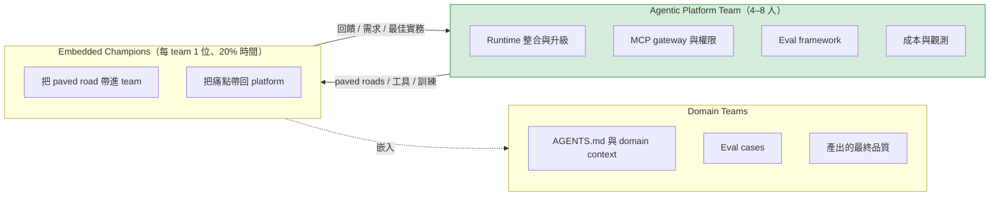
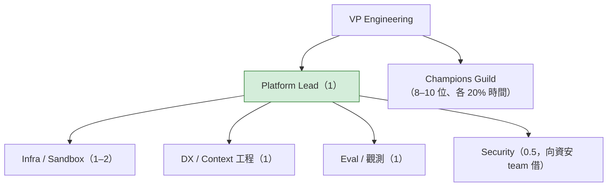
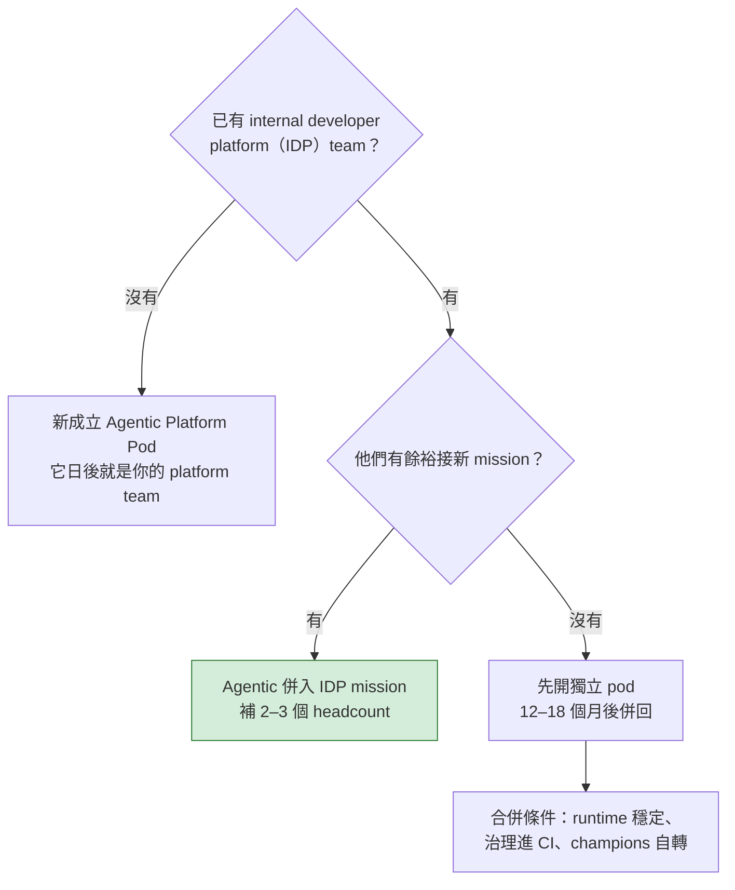

# Agentic Engineering 三部曲（一）：誰來做？Platform + Federation 的組織設計實務

> **TL;DR** — 這是[《別急著打造你的 Devin》](https://fantasybz.medium.com/%E5%88%A5%E6%80%A5%E8%91%97%E6%89%93%E9%80%A0%E4%BD%A0%E7%9A%84-devin-agentic-engineering-%E7%9A%84%E7%B5%84%E7%B9%94%E7%AD%96%E7%95%A5%E8%88%87-90-%E5%A4%A9%E8%A1%8C%E5%8B%95%E8%97%8D%E5%9C%96-7342ababc417)的第一篇深掘。總論的結論是：不要成立中央 Agent Team，要成立小型的 Agentic Platform Team。這一篇把「怎麼組」講到可以直接拿去開編制會議的程度：三種規模的實際編制、champion 制度的選拔與考核、與現有 DevEx / SRE 的整併決策，以及向 CFO 提案時的預算敘事。

> 系列導覽：[總論](https://fantasybz.medium.com/%E5%88%A5%E6%80%A5%E8%91%97%E6%89%93%E9%80%A0%E4%BD%A0%E7%9A%84-devin-agentic-engineering-%E7%9A%84%E7%B5%84%E7%B9%94%E7%AD%96%E7%95%A5%E8%88%87-90-%E5%A4%A9%E8%A1%8C%E5%8B%95%E8%97%8D%E5%9C%96-7342ababc417) → **一、組織篇（本篇）** → [二、技術篇](https://fantasybz.medium.com/agentic-engineering-%E4%B8%89%E9%83%A8%E6%9B%B2-%E4%BA%8C-harness-%E8%97%8D%E5%9C%96-%E6%8A%8A%E7%B3%BB%E7%B5%B1%E8%AE%8A%E6%88%90-agent-%E8%AE%80%E5%BE%97%E6%87%82%E7%9A%84%E5%9C%B0%E6%96%B9-f2a139f5b561) → [三、營運篇](https://fantasybz.medium.com/agentic-engineering-%E4%B8%89%E9%83%A8%E6%9B%B2-%E4%B8%89-eval-%E5%96%AE%E4%BD%8D%E7%B6%93%E6%BF%9F%E8%88%87%E8%A6%8F%E6%A8%A1%E5%8C%96-%E6%8A%8A-agent-%E7%95%B6%E7%94%A2%E5%93%81%E7%87%9F%E9%81%8B-d6d9623c2dc6)

---

## 一、為什麼組織會自然滑向錯誤設計

總論點名了四種失敗模式，這一篇先把其中的「中央 Agent Team」拉出來談。挑它的原因不是它最荒謬，剛好相反：它往往是會議室裡最容易被接受的那個選項。它不是愚蠢的決定，而是組織重力的自然結果。

三股力量會把你推向那裡：

- **預算重力**：AI 預算通常是一筆新錢，新錢需要一個新的 cost center 來掛，於是「先成立一個 team 再說」。
- **稀缺性重力**：初期懂 agent 的人很少，把他們集中起來「看起來」是最有效率的配置。
- **控制重力**：法務與資安希望有單一窗口可管，中央 team 給了他們一個好抓的把手。

這三股力量都真實存在，也都不是出於惡意。但它們追求的是「好管理」，不是「好產出」。

Conway's law 說的是：組織怎麼溝通，做出來的系統就長成什麼形狀。在這裡要反著用：你最後得到的交付系統，會長得跟你的組織圖一樣—中央 team 的組織圖，產出的就是 ticket queue 型的交付系統。所謂 ticket queue，就是 domain team 從 owner 退成需求提出者：想做的事寫成單子丟進中央 team 的排程，然後等。

> 想要 self-service 的系統，就要先畫出 self-service 的組織圖。

---

## 二、Platform + Federation 的完整設計

總論給了概念圖，這裡把三個角色的分工落到 RACI 的精度。RACI 是責任分派的四種標記：R 是誰動手做，A 是誰最後扛結果，C 是誰要被諮詢，I 是誰只要被告知。先看這三個角色之間傳遞的是什麼：

圖裡唯一要記住的是 champion 的位置：他是嵌在 domain team 裡面的人，不是 platform team 派駐的窗口—所以他帶回來的痛點是自己踩到的，不是轉述的。paved road 就是一條鋪好的路：runtime、sandbox、AGENTS.md template、eval framework 這些共用能力都先做好，工程師照著走就不必自己開路。

把這三個角色逐項放進 RACI，分工是這樣：

| 事項 | Platform Team | Champion | Domain Team |
|---|---|---|---|
| Runtime 選型與升級 | **R / A** | C | I |
| Sandbox 與權限基礎設施 | **R / A** | C | I |
| AGENTS.md template 與規範 | **A** | R（推動） | **R**（內容） |
| Domain MCP tools | C | C | **R / A** |
| Eval framework | **R / A** | C | I |
| Eval cases（domain） | C | R（推動） | **R / A** |
| 成本與 quota 政策 | **R / A** | I | C |
| 產出品質與 production ownership | I | I | **R / A** |

表裡最重要的一格是最後一列：**production ownership 永遠在 domain team**。任何把「agent 寫的 code 出事了」歸給 platform team 的設計，都會在第一次 incident 之後崩潰成互相指責。

---

## 三、三種規模的實際編制

RACI 講的是誰負責什麼，但它不會告訴你要幾個人。編制要看規模，而規模之間的差別不是等比例放大，是做法整個換掉。

### 50 人：不成立 team 的做法

- 專職 0 人。2 位 champions（各 20% 時間）+ 1 位 sponsor（VP 或資深 EM）。
- 直接採用 SaaS runtime 與 vendor 預設 sandbox，治理靠 checklist，不自建 gateway。
- **升級訊號**：當 champions 花超過 30% 時間在「幫別的 team 接工具」，就是該開 pod 的時候。

### 200 人：4–6 人的 Platform Pod

到這個規模，champions 已經撐不住，要開始有專職的人。下面這張圖是我的建議編制，不是標準答案。看的時候重點放在誰向誰報告，以及哪些角色是借來的：

這張圖裡難的不是框線怎麼畫，是 skill mix。Skill mix 的重點只有一句：這是 **product team，不是 research team**。它的產品是前面說的那條 paved road，客戶是內部工程師。所以要找的是做過 developer tooling、CI、test infra 的人，而不是模型研究背景的人。

Security 那 0.5 個人用借的：讓資安 team 有參與感，比之後被稽核打回來便宜得多。他仍然掛在資安 team、由資安 team 考核，只是固定把一部分時間放進 platform 的設計討論。

### 1,000 人：平台組 + 專業分工

- Platform 8–12 人，分三個 squad：**Runtime & Environment**、**Context & Tools**、**Eval & FinOps**。
- 加一個跨部門的 virtual security council（資安、法務、平台各出一人，月會即可）。
- 重點不變：即使到這個規模，也不設「替各 team 寫 code 的 agent 服務組」。

三種規模對照：

| 規模 | 專職 | Champions | 治理手段 | 下一步升級訊號 |
|---:|---|---|---|---|
| ~50 人 | 0 | 2 位（20%） | checklist + vendor 預設 | champions 過載 |
| ~200 人 | 4–6 | 每 team 1 位 | gateway + policy as code | eval 與成本需要專人 |
| ~1,000 人 | 8–12（三 squad） | guild 制度化 | 完整 platform + council | 吸收進 IDP，名字消失 |

這張表最該看的是最後一欄。三種規模不是三種身分，是三個階段。決定你該不該往下一格走的，是升級訊號有沒有出現，而不是公司人數到了沒有。

---

## 四、Champion 制度：最常被做壞的一環

編制排好之後，最容易垮掉的不是 platform team，是把 platform 與 domain 串起來的那條線。champion 就是那條線。

Champion 不是頭銜，是一份有 job description 的工作。做壞的方式千篇一律：找最資深的人掛名、不給時間、不列考核，半年後制度名存實亡。

做壞的過程通常還很漂亮：指派、開 channel、宣布 guild 成立，該有的儀式一天就做完了。但時間、產出與考核這三件要花掉一整季，所以多數組織只做了第一天的部分。

**選拔標準**（比資歷重要）：

| 找這種人 | 避開這種人 |
|---|---|
| 已經在日常用 agent 且有實際產出 | 只想研究新工具、不想碰別人 repo |
| 寫過 team 的 onboarding 文件或測試基礎設施 | 把 champion 當升遷跳板、不教人 |
| 願意花時間帶人、能把抱怨轉成需求 | 對「非確定性系統」沒有耐性 |

兩欄放在一起看，方向就很清楚：champion 要的是願意把自己的做法交出去的人，不是最會用工具的人。

**時間與考核**：

- 20% 時間寫進 OKR。這不是「下班後的熱情」，是排進季度目標、會被主管追進度的工作。沒有時間承諾的 champion 制度，等於沒有。
- 考核看 **team 的 adoption 指標**，不是個人產出：team 的 tasks delegated %、retry rate 的下降、AGENTS.md 的鮮度。champion 的成功定義是「team 變強」，不是「自己很會用」。
- **每季輪替一半**。輪替不是懲罰，是知識擴散機制—兩年後你要的不是十位超級 champion，而是一半工程師都當過 champion。

**Guild 運作**：雙週一次 guild meeting，內容只有三種。第一種是內部 demo，讓大家看見 paved road 實際上怎麼用。第二種是痛點清單，把 domain team 卡住的地方帶回 platform 的 backlog。第三種也是最有價值的，是**失敗案例分享**。

agent 在哪裡把事情做砸、為什麼，是整個組織最稀缺的學習材料。成功的用法每個 team 自己摸久了都會，但失敗的那一次如果沒有人講出來，下一個 team 只會用同樣的方式再撞一次。

---

## 五、與現有組織的整併決策

多數公司不是白紙一張，已經有 DevEx team、Platform team 或 SRE。agentic 歸誰？

這個問題很容易被當成政治問題來吵，所以要把它拉回組織能力的問題。要判斷的只有兩件事。第一，公司有沒有 internal developer platform（IDP，也就是公司內部給工程師自助使用的平台）team。第二，有的話，他們現在有沒有餘裕接這個 mission。用這棵決策樹：

原則一句話：**agentic platform 是 IDP 的下一章，不是平行宇宙**。長期一定合併。分開只是啟動速度的權宜，所以獨立 pod 從第一天就要跟 IDP 共用 backlog 工具與設計評審。等到合併那天，要搬的只有人，不是兩套流程與兩種文化。

SRE 的角色也一樣：agent observability 直接復用 SRE 的 o11y stack（trace、metrics、alerting），不要讓 platform team 重建一套。那套觀測系統已經在營運了，agent 只是多一種被觀測的對象。

差別只在多了幾個新的 signal：run id 用來串起一次完整的 agent 執行，tool call 用來看它碰過哪些外部能力，retry 用來看它有多不穩，token 用量則把成本拉進同一張圖裡。

---

## 六、預算與提案：向 CFO 說什麼

向 CFO 提案的難處不在金額大小，在於這筆錢有三種行為完全不同的成分，混在一起講一定被打回票。

預算分三個 bucket，第三個最常被漏列：

| Bucket | 內容 | 行為 |
|---|---|---|
| **Run** | Token、vendor 訂閱、sandbox 運算 | 隨 adoption 線性成長，需要 quota 管理 |
| **Build** | Platform team 人事 | 固定，4–6 人起 |
| **Enable** | Champions 的 20% 時間、訓練、guild | 隱形成本，不編列就會被日常工作吃掉 |

Enable 之所以最常被漏列，是因為它不會出現在任何一張報價單上。它花的是既有工程師的時間，而沒有編列在預算裡的東西，年底不會有人來對帳。

**ROI 敘事**：不要用「取代幾位工程師」。這個敘事第一會嚇到團隊，第二根本不準。我認為 agentic engineering 做的是把工程注意力重新分配，不是把人減掉。

要用的是 **attention 槓桿**：human review minutes / PR 的下降 × PR 總量 = 釋放出來的工程注意力。也就是說，你賣給 CFO 的不是省下來的薪水，是同一批人多出來的產能。再搭配 production escape rate（漏到 production 才被發現的問題比率）持平的證據，證明速度沒有用品質換來。

**時間預期管理**：第一年不要承諾成本下降，承諾「可量測的交付速度與品質曲線」。cost per successful task 到第二年才有比較意義：第一年還在付 retry tax（失敗重試燒掉的 token 與時間），它會隨著 harness 與 context 變好而降下來。第一年的 retry tax 是學費，不是浪費（詳見第三篇）。

最後一條紅線：如果提案裡出現「我們要自研 agent runtime」，把它刪掉。理由見總論的 buy vs build。簡單說，那是在跟整個產業的資本支出對賭，而你上面那三個 bucket，沒有一個撐得住那張賭桌。

---

## 七、人才：招募、轉型與 junior 路徑

錢談完了，剩下的是人。外面怎麼招、裡面怎麼轉、junior 怎麼養，三件事裡最常被跳過的是第三件。

**招募**：JD 的關鍵字不是 prompt engineering。要找的是做過 developer tooling、CI、test infra、文件系統的人。原因是這個角色每天在處理的，是工程師怎麼把 agent 接進既有的 workflow，而不是怎麼把 prompt 寫漂亮。

除此之外還要一個難量化但關鍵的特質：**能忍受非確定性系統的 debug 心性**。agent 的失敗不可完全重現，跟傳統軟體的除錯體驗完全不同。假設同一個任務跑兩次，一次過一次沒過，兩次的 diff 還不一樣，你要找的是看到這種狀況會去量分布的人，不是先發脾氣的人。

**內部轉型比外聘快**：platform team 的前兩三人，從內部 DevEx / infra 調任最順，因為他們已經懂公司的系統與政治。外聘留給真正的新技能：eval 工程與 FinOps。前者要能把 agent 的產出好壞量出來，後者要能把 token 花費當成雲端帳單來管。

**Junior 路徑**（把總論的主張落成階梯）：

1. **第 1 個月**：帶著 checklist review agent 的 PR。目標不是抓錯，是建立「什麼叫做對」的直覺。
2. **第 2–3 個月**：寫 eval cases—定義「正確」是什麼，是最好的技術判斷訓練。
3. **第 4–6 個月**：負責維護一條 golden workflow，開始對 team 的 adoption 指標有貢獻。

這條路徑產出的不是比較會用工具的人，是「會定義問題與驗收條件的工程師」—正好是 agent 時代最稀缺的能力。實作可以委派出去，但什麼叫做對、風險落在哪裡、哪些地方非得有人看，仍然要有人判斷得出來。

跳過這條路徑、把 review 全部留給 senior 的組織，三年後會發現自己沒有接班梯隊。

---

## 八、結語

組織設計的目標可以壓縮成一句話：

> **讓 domain team 保有 context 與 ownership，讓 platform team 保有 leverage 與 guardrails，champion 讓兩邊持續對話。**

回到第一節那三股組織重力：它們不會消失。預算、稀缺人才與控制需求每一季都會再推你一次，而每一次都會有人提議「乾脆成立一個 team」。這張組織圖真正的作用，是讓你每一次被推的時候都還答得出「ownership 在誰身上」。

下一篇（技術篇）講 platform team 實際要蓋的東西：AGENTS.md 的三層架構、MCP gateway 的最小可行設計、sandbox 選型，以及 brownfield 的改造 playbook。

---

### 系列文章

1. [總論：別急著打造你的 Devin](https://fantasybz.medium.com/%E5%88%A5%E6%80%A5%E8%91%97%E6%89%93%E9%80%A0%E4%BD%A0%E7%9A%84-devin-agentic-engineering-%E7%9A%84%E7%B5%84%E7%B9%94%E7%AD%96%E7%95%A5%E8%88%87-90-%E5%A4%A9%E8%A1%8C%E5%8B%95%E8%97%8D%E5%9C%96-7342ababc417)
2. **一、組織篇（本篇）**
3. [二、技術篇：Harness 藍圖—把系統變成 agent 讀得懂的地方](https://fantasybz.medium.com/agentic-engineering-%E4%B8%89%E9%83%A8%E6%9B%B2-%E4%BA%8C-harness-%E8%97%8D%E5%9C%96-%E6%8A%8A%E7%B3%BB%E7%B5%B1%E8%AE%8A%E6%88%90-agent-%E8%AE%80%E5%BE%97%E6%87%82%E7%9A%84%E5%9C%B0%E6%96%B9-f2a139f5b561)
4. [三、營運篇：Eval、單位經濟與規模化—把 agent 當產品營運](https://fantasybz.medium.com/agentic-engineering-%E4%B8%89%E9%83%A8%E6%9B%B2-%E4%B8%89-eval-%E5%96%AE%E4%BD%8D%E7%B6%93%E6%BF%9F%E8%88%87%E8%A6%8F%E6%A8%A1%E5%8C%96-%E6%8A%8A-agent-%E7%95%B6%E7%94%A2%E5%93%81%E7%87%9F%E9%81%8B-d6d9623c2dc6)

---

### AI 協作說明

本文由筆者提出初步構想與章節架構，文字撰寫由 AI（Claude）協作完成，再經筆者逐節校閱與修訂後定稿。文中觀點與判斷為筆者所持，文責亦由筆者自負。

---

*本文發表於 [Medium @fantasybz](https://medium.com/@fantasybz)。英文版：[English edition](https://fantasybz.medium.com/agentic-engineering-part-1-who-does-this-platform-plus-federation-in-practice-92343384d987)。若你正在設計組織的 Agentic Engineering 編制，歡迎交流。*
