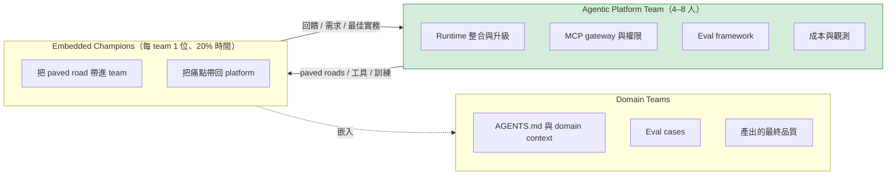
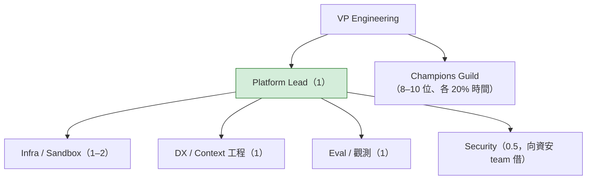
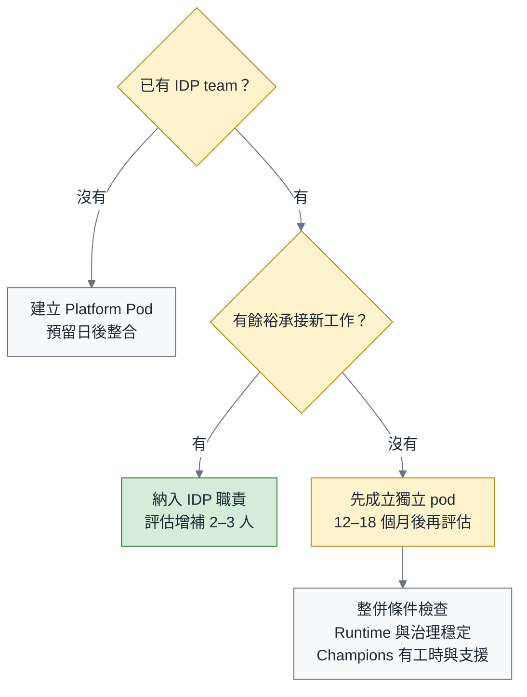

# Agentic Engineering 三部曲（一）：誰來做？Platform + Federation 的組織設計實務

> **TL;DR** — 這是[《別急著打造你的 Devin》](https://fantasybz.medium.com/%E5%88%A5%E6%80%A5%E8%91%97%E6%89%93%E9%80%A0%E4%BD%A0%E7%9A%84-devin-agentic-engineering-%E7%9A%84%E7%B5%84%E7%B9%94%E7%AD%96%E7%95%A5%E8%88%87-90-%E5%A4%A9%E8%A1%8C%E5%8B%95%E8%97%8D%E5%9C%96-7342ababc417)的第一篇深掘。總論主張依組織規模與實際工作量，安排 champions 或小型 Agentic Platform Team，讓產品團隊逐步具備自主使用與改善 agent 的能力。這一篇把「怎麼組」整理成編制會議可以討論的具體選項：三種規模的建議編制、champion 制度的選拔與考核、與現有 DevEx / SRE 的整併決策，以及向 CFO 提案時的預算敘事。

> 系列導覽：[總論](https://fantasybz.medium.com/%E5%88%A5%E6%80%A5%E8%91%97%E6%89%93%E9%80%A0%E4%BD%A0%E7%9A%84-devin-agentic-engineering-%E7%9A%84%E7%B5%84%E7%B9%94%E7%AD%96%E7%95%A5%E8%88%87-90-%E5%A4%A9%E8%A1%8C%E5%8B%95%E8%97%8D%E5%9C%96-7342ababc417) → **一、組織篇（本篇）** → [二、技術篇](https://fantasybz.medium.com/agentic-engineering-%E4%B8%89%E9%83%A8%E6%9B%B2-%E4%BA%8C-harness-%E8%97%8D%E5%9C%96-%E6%8A%8A%E7%B3%BB%E7%B5%B1%E8%AE%8A%E6%88%90-agent-%E8%AE%80%E5%BE%97%E6%87%82%E7%9A%84%E5%9C%B0%E6%96%B9-f2a139f5b561) → [三、營運篇](https://fantasybz.medium.com/agentic-engineering-%E4%B8%89%E9%83%A8%E6%9B%B2-%E4%B8%89-eval-%E5%96%AE%E4%BD%8D%E7%B6%93%E6%BF%9F%E8%88%87%E8%A6%8F%E6%A8%A1%E5%8C%96-%E6%8A%8A-agent-%E7%95%B6%E7%94%A2%E5%93%81%E7%87%9F%E9%81%8B-d6d9623c2dc6)

---

## 一、為什麼組織會自然滑向錯誤設計

總論〈別急著打造你的 Devin〉點名了四種失敗模式。這一篇先談「中央 Agent Team」，因為它往往是編制會議裡最容易被接受的選項：預算有人管理，稀缺的人才集中起來，資安也找得到窗口。這些需求都合理，真正要追問的是：成立團隊之後，產品團隊能不能更自主地完成工作？

我把這種傾向分成三股「組織重力」。先看清楚它們想解決的問題，才有機會設計出另一種分工：

- **預算重力**：AI 預算若是新編的一筆錢，財務需要知道由誰管理，於是成立新的 cost center 與 team 很容易成為第一個答案。
- **稀缺性重力**：初期熟悉 agent 的人不多，集中配置看起來能減少重複摸索，卻也可能讓其他 team 持續依賴這幾個人。
- **控制重力**：法務與資安需要明確的協作窗口。中央 team 可以承接這個需求，但單一窗口不等於所有工作都必須由它代做。

預算、人才與治理都需要有人照顧。問題出在：如果組織只回答「誰來管」，卻沒有回答「能力如何留在產品團隊」，管理上的方便就可能變成交付上的等待。

Conway's law 提醒我們，組織的溝通方式會反映在系統設計裡。放到這個問題上，我會先想清楚希望得到哪一種交付方式，再安排協作關係。如果每個 domain team 都必須透過中央 team 才能使用 agent，需求就容易排成 ticket queue；原本負責產品的工程師，也會逐漸從能動手解決問題的人，變成只能送出需求、等待排程的人。

> 想要 self-service 的系統，就要先畫出 self-service 的組織圖。

---

## 二、Platform + Federation 的完整設計

總論給了概念圖，這裡進一步把責任分到 RACI 的精度：R 負責執行，A 對結果負責，C 提供必要意見，I 接收相關資訊。圖中的人數是示意，實際配置留到下一節討論；這裡先看 platform team、champion 與 domain team 之間，分別需要交付什麼。

champion 的位置很重要。他仍在 domain team 裡參與產品工作，因此能把導入時遇到的困難連同背景帶回平台，也能協助同事理解平台的使用方式。圖中的 paved road，指的是事先整合好 runtime、sandbox、AGENTS.md template 與 eval framework 的預設路徑。共用的整合工作由平台承擔，產品團隊才不必每次導入都重新摸索。

把這三個角色逐項放進 RACI，分工是這樣：

| 事項 | Platform Team | Champion | Domain Team |
|---|---|---|---|
| Runtime 選型與升級 | **R / A** | C | I |
| Sandbox 與權限基礎設施 | **R / A** | C | I |
| AGENTS.md template 與規範 | **A** | R（推動） | **R**（內容） |
| Domain MCP tools | C | C | **R / A** |
| Eval framework | **R / A** | C | I |
| Eval cases（domain） | C | R（推動） | **R / A** |
| 成本與 quota 政策 | **R / A** | I | C |
| 產出品質與 production ownership | I | I | **R / A** |

最後一列把一件事說清楚：**產品的 production ownership 仍在 domain team**。使用 agent，不會把業務判斷與驗收責任轉交給平台。這也不表示平台可以置身事外；如果事故涉及 sandbox、權限或共用工具，platform team 仍要負責自己的部分。RACI 的用途是讓事故發生時找得到共同解決問題的人，而不是替任何一方預先卸責。

---

## 三、依規模規劃編制

RACI 說明責任，編制則要回答：這些工作需要多少時間、哪些能力必須專職維護？下面的 50、200、1,000 人是討論用的規模情境，編制與投入比例都是我的建議值，不是人數一到就應該照表成立團隊。實際決定仍要回到使用量、系統複雜度與既有平台能力。

### 50 人：不成立 team 的做法

- 可以先不編專職人力，由 2 位 champions 各投入 20% 工時，搭配 1 位 sponsor（VP 或資深 EM）協調資源。
- 優先評估 SaaS runtime 與 vendor 提供的 sandbox，確認權限、資料處理與稽核能力符合需要後再採用。這個階段可以用 checklist 整理檢查項目，先不自建 gateway。
- **升級訊號**：如果 champions 連續幾週把超過 30% 的總工時花在協助其他 team 整合工具，原本承諾的 20% 已經不夠，就該由 sponsor 評估增補人力或成立 pod。

### 200 人：4–6 人的 Platform Pod

當導入開始跨越多個 team，共用環境、權限與 eval 都需要持續維護，單靠兼任的 champions 就可能不夠。下面是約 200 人組織可以討論的編制：圖中合計 4–5 位專職成員，另借用 0.5 人的資安工時，落在本節建議的 4–6 人配置範圍內。看圖時，除了報告關係，也要確認借用的人力是否真的排得出時間。

編制圖畫完，真正困難的才開始：這幾個人的能力能不能組成一支服務內部工程師的 **product team**？平台的產品是 paved road，因此 developer tooling、CI、test infra 與使用者回饋的經驗，比單純追求模型研究能力更貼近這個團隊的日常工作。

圖中的 0.5 人不是要求某位資安同事額外兼差，而是明確借用一部分工作時間。這位成員仍由資安 team 管理與考核，固定參與平台設計、風險判斷與驗收。把協作排進正式工作，比等到完成後才請資安審查，更容易及早看見彼此的限制。

### 1,000 人：平台組 + 專業分工

- Platform 可以配置 8–12 人，依工作量分成 **Runtime & Environment**、**Context & Tools**、**Eval & FinOps** 三個 squad。
- 由資安、法務與平台各派一位代表組成 virtual security council，定期檢視政策與例外。月會可以是起點，緊急風險仍需另有即時決策窗口。
- 即使規模擴大，我也不建議另設「替各 team 用 agent 寫 code」的服務組。新增人力應用來改善共用能力與支援，而不是把產品工作集中排隊。

把三種情境放在一起，目的不是選一個看起來最完整的組織圖，而是找出眼前需要補上的能力：

| 規模 | 專職 | Champions | 治理手段 | 下一步升級訊號 |
|---:|---|---|---|---|
| ~50 人 | 0 | 2 位（各 20% 工時） | checklist + 已確認適用的 vendor 能力 | 協作需求持續超過分配工時 |
| ~200 人 | 4–6 | 每 team 1 位 | gateway + policy as code | eval 與成本需要專人 |
| ~1,000 人 | 8–12（三 squad） | guild 制度化 | platform + council | 與 IDP 的責任與服務逐步整合 |

我會先讀最後一欄，再回頭看編制。有些 50 人團隊的系統與治理需求已經很複雜，有些 200 人組織則能沿用成熟的 IDP。升級的依據是既有分工是否已經承擔不了工作，而不是公司人數跨過某條線。

---

## 四、Champion 制度：最常被做壞的一環

人力編好，只代表平台有能力提供服務；domain team 能不能真正用起來，還需要有人協助導入、整理困難、把回饋帶回平台。champion 承擔的就是這段容易被漏掉的工作。

Champion 應該是一份有明確職責與工時的工作。若只是替最資深的人加上頭銜，原有任務一件也沒減少，主管也沒有調整考核，他很難長期兼顧同事的導入需求。制度逐漸失去作用，未必是這個人不夠投入，而可能是一開始就沒有給他完成工作的條件。

指派人選、開 channel、宣布 guild 成立，都能很快完成；安排工時、協調產品交付與追蹤導入成效，才是接下來每一季都要做的事。這兩段工作若沒有接起來，熱鬧的啟動就很容易變成少數人的額外負擔。

**選拔標準**（比資歷重要）：

| 可以觀察的經驗 | 面談時再確認 |
|---|---|
| 日常使用 agent，能說明產出與限制 | 是否願意了解其他 team 的 repo 與工作方式 |
| 維護 onboarding 文件或測試基礎設施 | 能否把做法整理成同事能使用的指引 |
| 協助同事，將反覆問題整理成需求 | 面對不穩定結果時，如何保留證據並持續調查 |

這份選拔表看的是候選人是否願意把做法教給同事、把反覆出現的問題整理成可處理的需求。工具用得熟有幫助，但 champion 的主要成果，是讓其他人也能用得好。

**時間與考核**：

- **把 20% 工時寫進工作安排與 OKR**，並由主管相應調整原有交付目標。承諾工時卻不減少其他工作，只會把培訓與協作擠到下班後。
- **看 team 的使用成效**：適合委派的任務有多少開始採用、retry rate 是否改善、AGENTS.md 是否持續符合現況。這些指標要搭配任務組成與品質一起看，不能為了提高委派比例，把不適合的工作也交給 agent；模型或平台的變動也不應全算在 champion 個人身上。
- **可以每季輪替一半的人選**，前提是排好交接與帶領新人的時間。輪替是為了讓更多工程師理解導入與驗收工作，後續可追蹤參與人數、交接品質，以及其他同事是否更能自行處理常見問題。

**Guild 運作**可以從雙週一次開始。內部 demo 讓大家看見 paved road 如何解決實際工作；痛點清單則交給 platform team 排入 backlog，記下負責的人與後續結果。我會特別保留時間討論**失敗案例**：原本想完成什麼、在哪一步偏離、團隊怎麼發現，以及下一次能留下什麼檢查。

一份失敗紀錄的價值，不在於指出誰用錯了工具，而在於讓下一個 team 少走一次相同的彎路。分享時若能把症狀、context 與處理方式留下來，平台就有機會把這次困難轉成文件、工具修正或 eval case；同事也比較願意把尚未解決的問題帶進討論。

---

## 五、與現有組織的整併決策

多數公司不是白紙一張，已經有 DevEx team、Platform team 或 SRE。agentic 歸誰？

與其先爭論名字掛在哪個部門，我會先確認兩件事：公司是否已有 internal developer platform（IDP，也就是工程師可自助使用的內部平台），以及維護它的團隊是否有足夠人力承接新工作。下面的決策樹提供討論起點，其中增補人數與整併時間都是規劃值，仍需依現場條件調整。

我的方向是：**把 agentic 能力視為 IDP 的延伸，朝同一套服務與責任分工整合。** 若為了啟動速度先成立獨立 pod，也應從第一天就共用 backlog 工具與設計評審，並定期檢查整併條件。圖中的 12–18 個月是重新評估的時間窗；runtime 是否穩定、治理是否落實、champions 是否能持續協作，比日期到了沒有更重要。

SRE 可以提供既有的 observability stack，讓 agent 執行紀錄沿用公司已經維護的 traces、metrics 與 alerting。Platform team 則補上 agent 特有的資料與使用方式，和 SRE 一起確認保存、存取與告警責任。這樣既能利用既有經驗，也不會把新的維護工作默默交給另一個團隊。

需要補上的訊號包括：以 run id 串起一次完整執行、記錄每次 tool call 使用的能力與結果、統計 retry 的原因與次數，再把 token 用量連到成本。Retry 偏高是需要追查的訊號，不能只憑這個數字就判定 model、harness 或某個 team 做得不好。

---

## 六、預算與提案：向 CFO 說什麼

向 CFO 提案時，若把訂閱費、人事與導入時間混成一筆「AI 預算」，後續很難說明哪一部分隨使用量增加、哪一部分是固定投入，也很難看見團隊實際負擔了多少工作。把帳分清楚，才有共同討論成效與取捨的起點。

我會把預算分成三個 bucket。除了看得到的工具與人事費，第三項也需要正式編列：

| Bucket | 內容 | 行為 |
|---|---|---|
| **Run** | Token、vendor 訂閱、sandbox 運算 | 隨任務量、model、context 與 retry 改變；另列固定訂閱費 |
| **Build** | Platform team 人事 | 依編制安排固定投入；本篇 200 人情境以 4–6 人規劃 |
| **Enable** | Champions 的 20% 工時、訓練、guild | 需調整原有交付安排，並追蹤實際投入時間 |

Enable 很容易被漏列，因為它花的是既有工程師的時間，不一定會出現在新增的報價單上。但這些時間確實會影響原本的產品工作。把它記進預算與排程，既能讓主管看見取捨，也能避免 champion 被要求同時完成兩份工作。

**ROI 敘事**要從團隊能多完成什麼談起。我不會直接用「取代幾位工程師」估算回報，因為省下的操作時間不會自動變成可刪除的人事費。我在意的是：原本花在反覆準備環境、整理 context 與處理重試的注意力，能不能回到產品判斷與困難問題上。

**Attention 槓桿**可以先從可比較的工作量估算：在風險與規模相近的 PR 中，平均 review 時間減少多少，乘上同類 PR 的數量，得到這部分可能釋放的工時。它還不是淨產能；除錯、返工、培訓與 incident 處理的時間也要計入。再對照相同觀察期間與定義下的 production escape rate（交付後才發現缺陷的變更比例），才能判斷速度改善是否伴隨品質代價。比率持平是一項證據，並不單獨證明品質毫無變化。

**時間預期管理**：第一年先承諾建立可追蹤的交付速度、品質與成本基準，再用 pilot 結果決定後續投入。Cost per successful task 從試行期就該量測，並把失敗嘗試與 retry 的花費計入；比較時要控制任務組成與成本範圍，沒有必要等到第二年。初期探索可能帶來學習成本，但只有當失敗轉成可驗證的改善，這筆「學費」才值得繼續付。〈營運篇：Eval、單位經濟與規模化〉會進一步展開這筆帳。

最後，我不會把「自研通用 agent runtime」當成預設的預算項目。總論的 buy vs build 判斷，重點是把人力放在公司的 context、權限、驗收與工作流程。若既有產品確實無法滿足必要需求，提案應先交代缺口、替代方案與長期維護成本，才能判斷自建是否值得。

---

## 七、人才：招募、轉型與 junior 路徑

預算能支持多久，最後仍要回到誰有時間做、誰能持續成長。招募與內部轉任可以補上眼前的能力，junior 的培養則決定幾年後是否有人能接手這套工作。三件事需要一起規劃。

**招募**：JD 的關鍵字不是 prompt engineering。要找的是做過 developer tooling、CI、test infra、文件系統的人。原因是這個角色每天在處理的，是工程師怎麼把 agent 接進既有的 workflow，而不是怎麼把 prompt 寫漂亮。

我也會看候選人如何處理**非確定性系統的除錯**。假設同一個任務執行兩次，一次通過、一次失敗，產出的 diff 也不同，他是否會先保留版本、輸入與執行紀錄，再透過重複執行統計結果分布、比較失敗條件？這種有耐心整理證據的能力，比期待每個問題都能一次重現，更貼近 agent 系統的工作方式。

**先評估內部轉任，再補足缺少的專長**。前兩三位成員可以優先從熟悉公司系統的 DevEx / infra 人員中尋找，但轉任必須同時處理原有工作的交接。Eval 工程需要把任務、驗收條件與評分方式整理清楚；FinOps 則需要把 token、運算與人工作業的花費放進同一套成本討論。哪些能力適合培養、哪些需要外聘，應依現有團隊的經驗決定。

**Junior 路徑**可以安排成下面三個階段。月份是帶領與檢視進度的參考，不是到了日期就自動取得更多責任：

1. **第 1 個月**：由資深工程師帶著 checklist 一起審閱低風險的 agent PR，練習說明需求、檢查測試與追問證據。目標是逐步理解「為什麼這樣才算完成」，最終核准仍由有責任與權限的人承擔。
2. **第 2–3 個月**：參與撰寫與審閱 eval cases，親自執行測試、重現問題，練習把模糊的「正確」拆成可檢查的條件。
3. **第 4–6 個月**：在帶領下維護一條 golden workflow，追蹤使用者遇到的困難與檢查結果，再依表現逐步擴大負責範圍。

這條路徑要培養的是能定義問題、檢查證據並作出判斷的工程師。Review 是其中一種練習，仍需搭配親自實作、除錯與回饋。即使部分實作交給 agent，工程師也要理解程式如何運作，才知道哪些地方需要再查、什麼時候應該請更有經驗的人一起判斷。

如果所有判斷都留給 senior，junior 就少了練習與獲得回饋的機會。培養接班梯隊需要當下的時間投入，不能等到資深成員離開或工作量增加時，才期待有人已經準備好。

---

## 八、結語

回到開場：預算需要窗口，稀缺的人才需要妥善安排，資安也需要明確的協作對象。Platform + Federation 是我對這些需求的回答，分工可以用下面這句話記住：

> **讓 domain team 保有 context 與 ownership，讓 platform team 保有 leverage 與 guardrails，champion 讓兩邊持續對話。**

這張組織圖的價值，要在日常協作裡才看得出來。Domain team 遇到問題時，知道哪些能力可以自助使用、哪些困難能請平台協助；champion 有時間整理回饋；平台則知道共用服務該如何改善。預算與控制的壓力仍會出現，但團隊不必每次都回到「所有需求交給中央 team」這個答案。

〈技術篇：Harness 藍圖—把系統變成 agent 讀得懂的地方〉接著說明這套分工要維護哪些能力：AGENTS.md、MCP gateway、sandbox 與 brownfield 的改造方式。組織設計先把責任與工時安排好，這些技術投資才有持續維護的人。

---

### 系列文章

1. [總論：別急著打造你的 Devin](https://fantasybz.medium.com/%E5%88%A5%E6%80%A5%E8%91%97%E6%89%93%E9%80%A0%E4%BD%A0%E7%9A%84-devin-agentic-engineering-%E7%9A%84%E7%B5%84%E7%B9%94%E7%AD%96%E7%95%A5%E8%88%87-90-%E5%A4%A9%E8%A1%8C%E5%8B%95%E8%97%8D%E5%9C%96-7342ababc417)
2. **一、組織篇（本篇）**
3. [二、技術篇：Harness 藍圖—把系統變成 agent 讀得懂的地方](https://fantasybz.medium.com/agentic-engineering-%E4%B8%89%E9%83%A8%E6%9B%B2-%E4%BA%8C-harness-%E8%97%8D%E5%9C%96-%E6%8A%8A%E7%B3%BB%E7%B5%B1%E8%AE%8A%E6%88%90-agent-%E8%AE%80%E5%BE%97%E6%87%82%E7%9A%84%E5%9C%B0%E6%96%B9-f2a139f5b561)
4. [三、營運篇：Eval、單位經濟與規模化—把 agent 當產品營運](https://fantasybz.medium.com/agentic-engineering-%E4%B8%89%E9%83%A8%E6%9B%B2-%E4%B8%89-eval-%E5%96%AE%E4%BD%8D%E7%B6%93%E6%BF%9F%E8%88%87%E8%A6%8F%E6%A8%A1%E5%8C%96-%E6%8A%8A-agent-%E7%95%B6%E7%94%A2%E5%93%81%E7%87%9F%E9%81%8B-d6d9623c2dc6)

---

### AI 協作說明

本文由筆者提出初步構想與章節架構，文字撰寫由 AI（Claude）協作完成，再經筆者逐節校閱與修訂後定稿。文中觀點與判斷為筆者所持，文責亦由筆者自負。

---

*本文發表於 [Medium @fantasybz](https://medium.com/@fantasybz)。英文版：[English edition](https://fantasybz.medium.com/agentic-engineering-part-1-who-does-this-platform-plus-federation-in-practice-92343384d987)。若你正在設計組織的 Agentic Engineering 編制，歡迎交流。*
