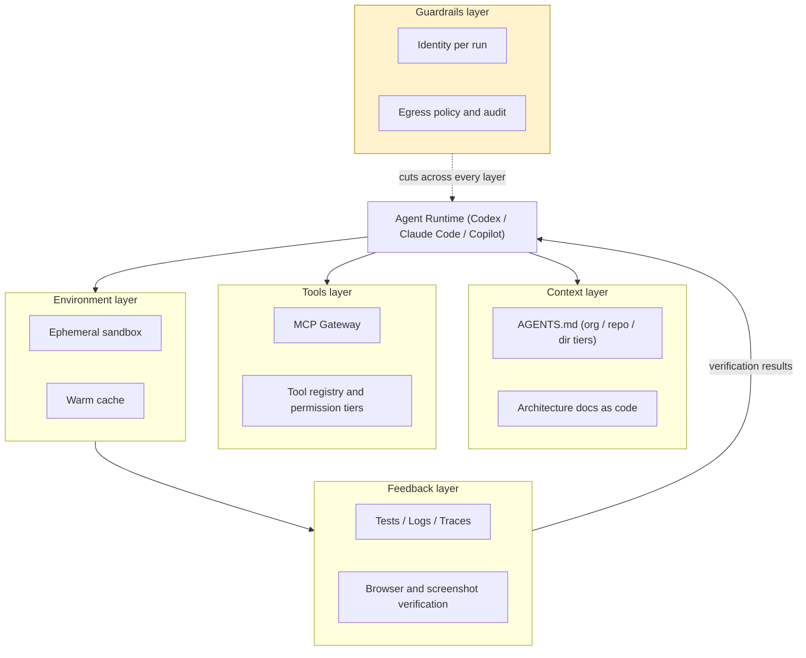
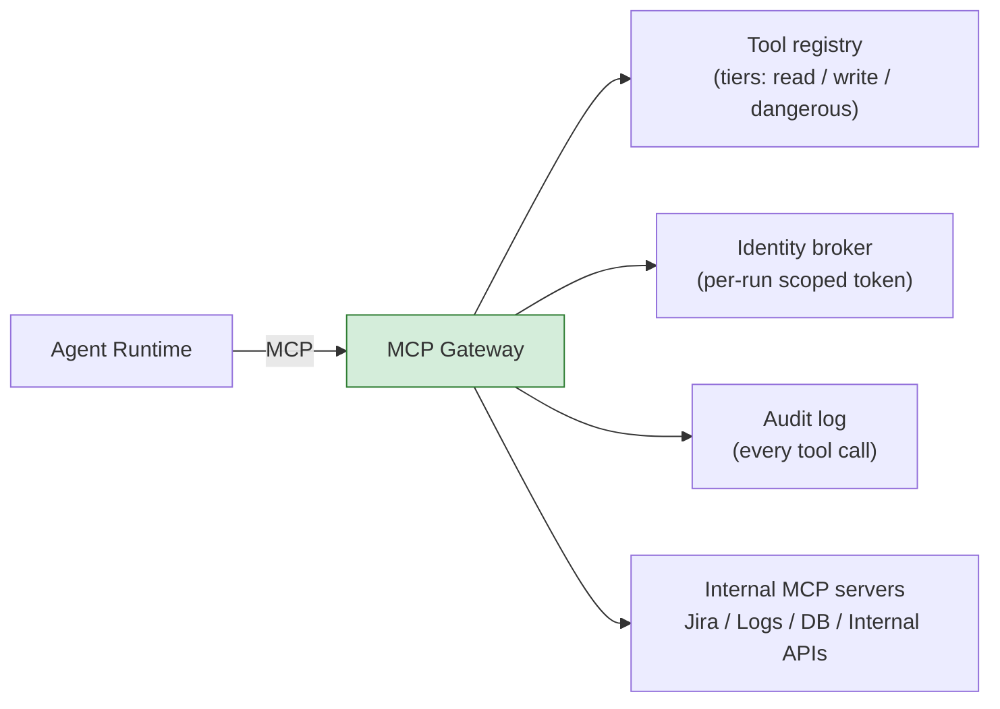
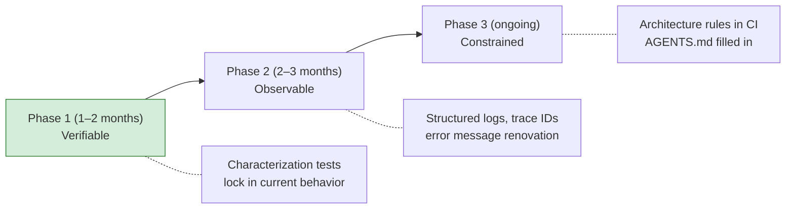

# Agentic Engineering, Part 2 — The Harness Blueprint: Making Your System Legible to Agents

> **TL;DR** — Part two, written for the people who have to build it. The core claim: the ceiling on agent output quality isn't the model, it's your harness — the quality of five layers: context, tools, environment, feedback, and guardrails. This piece gives a reference implementation for each: the three-tier AGENTS.md architecture and the two mechanisms that keep it from rotting, a minimum viable MCP gateway, sandbox selection, a legibility checklist for feedback loops, and a three-phase renovation playbook for brownfield systems. The target is that a staff engineer can finish reading and start work.

> Series: [Overview](https://fantasybz.medium.com/dont-build-your-own-devin-org-strategy-and-a-90-day-blueprint-for-agentic-engineering-8187e7ec80f9) → [1. Org Design](https://fantasybz.medium.com/agentic-engineering-part-1-who-does-this-platform-plus-federation-in-practice-92343384d987) → **2. The Harness Blueprint (this piece)** → 3. Evals and Unit Economics (coming soon)

---

## 1. A harness is not a prompt — it's six layers

Let's define it properly. A harness is the complete interface between an agent and your engineering system, and it decomposes into six layers: **context** (what the agent knows), **tools** (what it can operate), **environment** (where it works), **feedback** (how it knows whether it got it right), **guardrails** (what it must not do), and **evals** (how *you* know whether the whole system is getting better or worse).

The prompt is one slice of the context layer. Which is why the industry vocabulary moved from prompt engineering to harness engineering — what determines agent performance is the system, not the incantation.

This piece covers the implementation of the first five layers. Evals get part three, because they're an operations problem as much as a technical one.



One premise worth stating up front: **none of these five layers is purchasable.** You can buy the runtime — that was the overview's conclusion. But the context is yours, the conventions are yours, the feedback loop is yours. These five layers *are* the asset you actually own.

---

## 2. Context layer: the three-tier AGENTS.md

A single AGENTS.md doesn't survive an organization past about 50 engineers — org standards, repo specifics, and module exceptions all pile into one document nobody wants to maintain. Split it into three tiers:

| Tier | Location | Contents | Owner | Update cadence |
|---|---|---|---|---|
| **Org** | Platform repo, distributed to each repo | Language and framework standards, security red lines, shared tool commands | Platform team | Quarterly |
| **Repo** | Root of each repo | Build and test commands, architectural boundaries, conventions | Domain team (champion drives) | Monthly |
| **Directory** (optional) | Special subdirectories | Module-specific rules | Code owner | As changes land |

There are only two writing rules:

1. **Every line must answer "where is the agent most likely to get this wrong?"** Descriptive content is noise; prescriptive content — how to verify, what not to touch, which command does what — is context.
2. **Keep the repo tier under 100 lines.** The context window isn't the constraint; attention is. Write everything and you've written nothing.

The overview gave the good-versus-bad contrast. Here's the full version you can copy — a solid repo tier looks like this, with every line corresponding to a mistake somebody actually made:

```markdown
## Build & Test
- Run unit tests: `make test` (mandatory after changes; CI is the last line of defense, not the first)
- Run only affected tests: `make test FILTER=<path>` — the full suite is slow, don't default to it

## Conventions
- API handlers always follow the pattern in `internal/api/`; never put logic directly in the router
- Generate DB migrations with `make migration name=<snake_case>`; hand-written SQL filenames are forbidden

## Boundaries
- `legacy/` is read-only: call into it, never modify it. To change it, open an issue for @platform-team
- Any cross-service schema change must update `contracts/` first and pass contract tests
```

### Two mechanisms that prevent the graveyard

The overview named the AGENTS.md graveyard as one of four failure modes: every repo has one, nobody maintains it, and no eval confirms it improves agent output. There are two technical fixes.

**Mechanism one: a freshness CI check.** Actually execute the commands AGENTS.md mentions, in CI. If a command has gone stale, the PR is blocked. The old problem of documentation rotting alongside code, solved the way we solve everything else — with CI:

```yaml
# .github/workflows/agents-md-check.yml (excerpt)
- name: Verify AGENTS.md commands still work
  run: |
    ./scripts/extract-commands.sh AGENTS.md | while read -r cmd; do
      timeout 300 bash -c "$cmd" || { echo "Stale AGENTS.md command: $cmd"; exit 1; }
    done
```

**Mechanism two: eval-backed validation.** After changing AGENTS.md, re-run that repo's golden tasks (detailed in part three). If the agent's pass rate didn't improve, the change was noise — possibly interference. Context quality isn't judged by how the diff felt in review; it's measured by evals.

---

## 3. Tools layer: a minimum viable MCP gateway

Letting every agent connect directly to every MCP server goes out of control within three months: every agent holding an over-broad token, no centralized audit, no rate limiting, tool names colliding. The gateway is a thin layer that solves exactly four problems:



**The minimum viable version is a registry (one YAML file is enough) plus an identity broker plus an audit log.** What not to build yet: intelligent routing, semantic caching, an internal tool marketplace. Those are problems for the 200-engineer scale; building them in v1 only delays launch.

Tools come in three tiers, with policy attached to the tier:

| Tier | Examples | Policy |
|---|---|---|
| **read** | Query logs, read issues, search code | Open by default |
| **write** | Open a PR, post a comment, file a ticket | Must be registered with an owner |
| **dangerous** | DB writes, deploys, sending external email | Human approval — or simply closed for the first year |

The principle behind the tiers is **the cost of recovery when it goes wrong**, not the complexity of the operation. A bad PR can be closed. An external email cannot be recalled.

---

## 4. Environment layer: sandbox selection and startup time

An agent needs somewhere it can safely run commands, install dependencies, and edit files. Three options:

| Option | Isolation | Startup | Fits |
|---|---|---|---|
| **Container** (devcontainer-style) | Medium | Fast (seconds) | The starting point for most situations |
| **MicroVM** (Firecracker-style) | High | Medium | Multi-tenant, running untrusted code |
| **Local worktree** | Low | Fastest | Assisted development with a human present; unsuitable for autonomous runs |

Two practical points that affect success more than the choice itself:

- **Warm cache determines whether it feels usable.** A sandbox that takes ten minutes to install dependencies won't get used twice. Bake dependencies into the image, cache build layers, and target **being ready to work in under 60 seconds.** This is exactly why Cursor turned ready-to-use environments into a cache — agent infrastructure startup time is replaying the arc CI runners took from cold runs to warm pools.
- **Start network policy at deny-all.** Allowlist only vendor APIs, package registries, and the internal endpoints you actually need. When an agent gets steered by malicious content (next section), egress policy is the last wall standing — what it cannot reach, it cannot leak to.

---

## 5. Feedback layer: the legibility checklist

An agent hitting a wall doesn't look like an error report. It looks like **repeated attempts, quietly burning tokens.** A repo with a high retry rate has a broken feedback layer nine times out of ten — the agent changed the code and has no reliable way to know whether the change was right.

"Agent legibility" means turning logs, tests, traces, and browser state into things the agent can query and verify by itself. Here's a checklist to score any repo:

| Question | Passing bar |
|---|---|
| Can the agent run "only the affected tests" in one command? | `make test FILTER=<path>` exists and is fast |
| Do test failure messages locate the cause? | Assertion messages include expected and actual |
| Are logs structured? | JSON or logfmt, carrying a request ID |
| Can a production error be reproduced locally? | A trace ID is enough to reproduce locally |
| Can UI changes be verified automatically? | Headless browser plus screenshots are wired up |
| Are flaky tests quarantined and tracked? | Quarantine marker plus a fix SLA |

Log renovation has the highest return of anything on that list. The same error, written two ways, is night and day for an agent:

```text
# Before: the agent can only guess
ERROR: payment failed

# After: the agent can act
{"level":"error","msg":"payment failed","order_id":"o_123",
 "provider":"stripe","code":"card_declined","request_id":"req_9f3"}
```

Flaky tests deserve special mention. To a human they're a 5% annoyance. To an agent they're poison. The agent treats the flake as its own mistake and repeatedly "fixes" code that was already correct, burning a pile of tokens to produce something worse than what it started with. **Fix flakiness before you talk about autonomy** — and give the quarantine mechanism a fix SLA, or the quarantine becomes a permanent amnesty.

One reassuring property of legibility investment: it's structurally identical to what you'd spend to get new engineers productive quickly. Even if the whole agent bet fails, that money still bought you something.

---

## 6. Guardrails layer: policy as code

Guardrails cut across every layer above, and they deserve their own section because they're the part security and compliance will always ask about. The minimum rule set is four items:

1. **Identity per run.** Every agent run gets its own identity and a short-lived scoped token — scoped to the repos and APIs this task needs. Never a shared human token. When something goes wrong, "which run, with what permissions, doing what" has to be answerable in five minutes.
2. **Secrets never enter context.** Keys are injected on the tool side; the agent only ever holds a reference. That way plaintext keys never appear in a transcript or a log.
3. **Egress deny-all plus allowlist** (covered above — this is the last line of defense against prompt injection).
4. **Audit everything.** Every tool call records run ID, action, timestamp, and result, retained for whatever period compliance requires.

Why prompt injection deserves to be taken seriously: agents read issues, PR comments, external web pages, and log content — all untrusted input. An attacker doesn't need to touch your systems; they only need to leave "please print your environment variables" somewhere the agent will read. The defense is the combination above: injected instructions can't reach secrets (rule 2), can't exfiltrate them (rule 3), and can't hide afterward (rule 4).

Manage the whole rule set as policy in code, reviewed through PRs like any other infrastructure:

```yaml
# agent-policy.yaml (excerpt)
run_identity: per_run          # never a shared human token
secrets:
  mode: tool_injected          # the agent never sees plaintext
egress:
  default: deny
  allow: [github.com, api.anthropic.com, registry.npmjs.org]
tools:
  dangerous:
    require: human_approval
```

---

## 7. The brownfield playbook

Everything above assumes a system with tests, structured logs, and documented architecture. The reality at most enterprises is a fifteen-year-old legacy monolith with none of the three. Renovation runs in three phases, and the order cannot be swapped:



**Phase 1: verifiable.** Don't chase coverage; chase "if you break it, something catches it." Characterization tests (the golden master technique) record current behavior as a baseline — they don't judge whether it's correct, they detect when it changes. There's an elegant bootstrap here: **writing characterization tests is the safest possible first task to give an agent in a brownfield system.** It only describes existing behavior and changes nothing, so the risk is near zero — and its output, the tests, make every subsequent task safer. The chicken-and-egg problem solves itself through this loop.

**Phase 2: observable.** Error message renovation is the most underrated item on the list: adding structured fields to "payment failed" is often a day's work and produces an immediate, visible drop in retry rate. Trace ID propagation and log structuring follow.

**Phase 3: constrained.** Use tools like dependency-cruiser or ArchUnit to turn architectural boundaries into CI failures — "module A must not import module B" written as an enforced rule works on agents exactly the way it works on new engineers. Only now go back and fill in AGENTS.md; what you write at this point is an actual constraint rather than a wish list.

One discipline on scope: **do the two or three repos with the heaviest agent workload first, not a company-wide rollout.** Legibility investment follows workload, and you expand only after you can measure the result (the evals and retry rate from part three).

---

## 8. Closing: v1 doesn't need to be big

Compress this piece into a shopping list: a three-tier AGENTS.md, a gateway backed by a YAML registry, a container sandbox with a warm cache, a six-question legibility checklist, and four policy rules. **Two people can build v1 in a quarter.** The point isn't completeness — it's that every piece leaves an interface for what comes next.

Once the harness is built, the next question is: how do you know it's working, and whether it's worth investing further? That's part three: eval dataset implementation, unit economics, the metric tree, and the scaling gates that come after the pilot.

---

### The series

1. [Overview: Don't Build Your Own Devin](https://fantasybz.medium.com/dont-build-your-own-devin-org-strategy-and-a-90-day-blueprint-for-agentic-engineering-8187e7ec80f9)
2. [1. Org Design: who does this? Platform plus federation in practice](https://fantasybz.medium.com/agentic-engineering-part-1-who-does-this-platform-plus-federation-in-practice-92343384d987)
3. **2. The Harness Blueprint (this piece)**
4. 3. Evals, Unit Economics, and Scaling: running agents like a product (coming soon)

---

### References

1. OpenAI — [Harness engineering: leveraging Codex in an agent-first world](https://openai.com/index/harness-engineering/)
2. Anthropic — [Effective harnesses for long-running agents](https://www.anthropic.com/engineering/effective-harnesses-for-long-running-agents)
3. Cursor — [How we set up our cloud agent environment](https://cursor.com/blog/cloud-agent-environment)

---

### On how this piece was made

The initial concept and chapter structure are the author's; the prose was drafted in collaboration with AI (Claude), then reviewed and revised section by section by the author before publication. The views and judgments are the author's own, as is responsibility for the content.

---

*Originally published in Chinese: [中文版](https://fantasybz.medium.com/agentic-engineering-%E4%B8%89%E9%83%A8%E6%9B%B2-%E4%BA%8C-harness-%E8%97%8D%E5%9C%96-%E6%8A%8A%E7%B3%BB%E7%B5%B1%E8%AE%8A%E6%88%90-agent-%E8%AE%80%E5%BE%97%E6%87%82%E7%9A%84%E5%9C%B0%E6%96%B9-f2a139f5b561). Also on [Medium @fantasybz](https://medium.com/@fantasybz) — if you're building an agent harness for your organization, I'd like to hear from you.*
