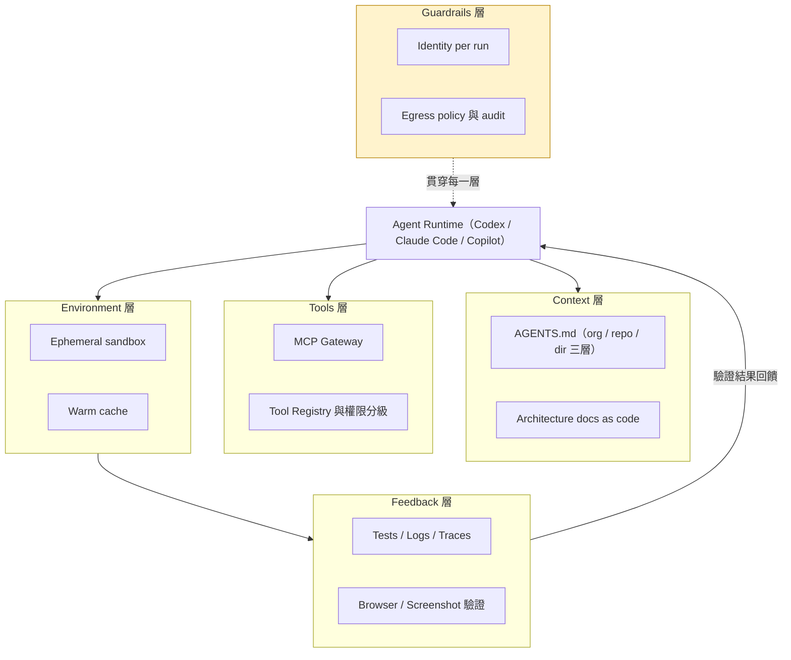
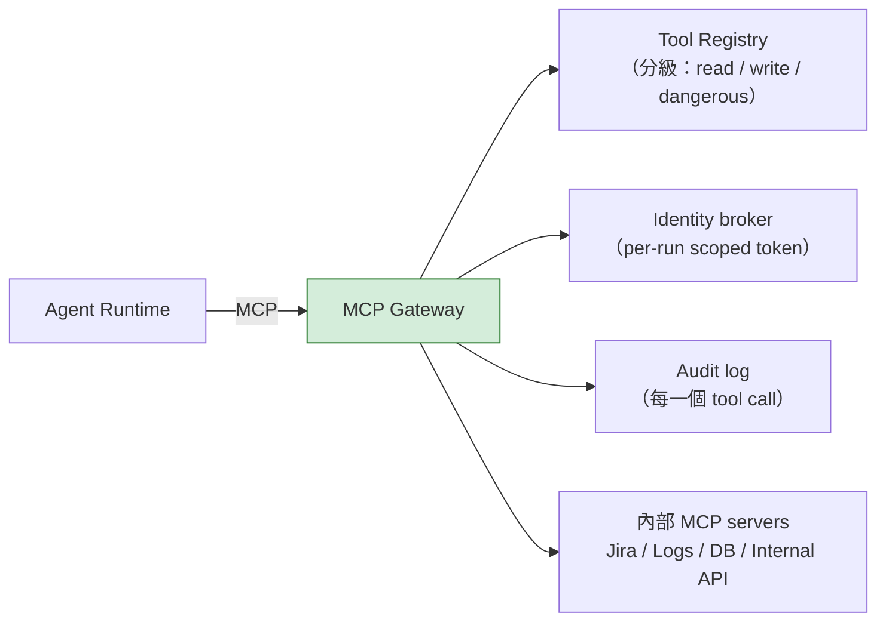
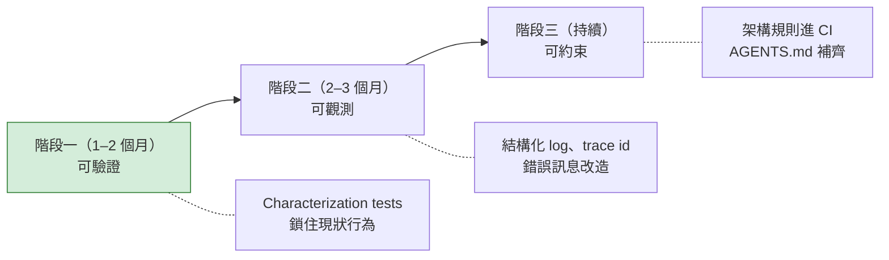

# Agentic Engineering 三部曲（二）：Harness 藍圖——把系統變成 agent 讀得懂的地方

> **TL;DR** — 三部曲第二篇，寫給要動手蓋的人。核心論點：agent 產出品質的上限不在 model，在你的 harness——context、tools、environment、feedback、guardrails 這五層的品質。本篇給出每一層的 reference implementation：AGENTS.md 的三層架構與防腐機制、MCP gateway 的最小可行設計、sandbox 選型、feedback loop 的 legibility checklist，以及 brownfield 系統的三階段改造 playbook。目標是 Staff engineer 讀完可以直接開工。

> 系列導覽：[總論](../2026-09-agentic-engineering-platform/article.md) → [一、組織篇](../2026-09-agentic-org-design/article.md) → **二、技術篇（本篇）** → 三、營運篇

---

## 一、Harness 不是 Prompt，是五層系統

先把定義講完整。所謂 harness，是 agent 與你的工程系統之間的全部介面，可以拆成六層：**Context**（agent 知道什麼）、**Tools**（agent 能操作什麼）、**Environment**（agent 在哪裡工作）、**Feedback**（agent 怎麼知道自己做對了沒）、**Guardrails**（agent 不能做什麼）、**Evals**（你怎麼知道整套系統在變好還是變壞）。

Prompt 只是 context 層裡的一小片。這也是為什麼業界的用語從 Prompt Engineering 轉向 Harness Engineering——決定 agent 表現的，是系統，不是咒語。

本篇處理前五層的實作；Evals 的完整實作留給第三篇（營運篇），因為它同時是技術問題與營運問題。



一個重要的前提：**這五層都是「買不到」的**。Runtime 可以買（總論的結論），但 context 是你的、conventions 是你的、feedback loop 是你的。這五層就是你真正擁有的資產。

---

## 二、Context 層：AGENTS.md 的三層架構

單一一份 AGENTS.md 撐不住超過 50 人的組織——org 規範、repo 細節、模組特例混在一起，很快就變成沒人想維護的長文。拆成三層：

| 層級 | 位置 | 內容 | Owner | 更新頻率 |
|---|---|---|---|---|
| **Org 層** | Platform repo，同步分發到各 repo | 語言與框架規範、安全紅線、共用工具指令 | Platform team | 每季 |
| **Repo 層** | 各 repo 根目錄 | Build / test 指令、架構邊界、conventions | Domain team（champion 推動） | 每月 |
| **Dir 層**（選配） | 特殊子目錄 | 模組專屬規則 | Code owner | 隨改動 |

寫作原則只有兩條：

1. **每一行都要回答「agent 最可能在哪裡做錯」**。描述性內容（這是一個電商後端專案……）是雜訊；指令性內容（怎麼驗證、哪裡不能碰、什麼指令跑什麼）才是 context。
2. **Repo 層壓在 100 行以內**。Context window 不是瓶頸，注意力才是——什麼都寫，等於什麼都沒寫。

一段合格的 repo 層長這樣（每行都對應一種真實犯過的錯）：

```markdown
## Build & Test
- 跑單元測試：`make test`（改動後必跑；CI 只是最後防線）
- 只跑受影響的測試：`make test FILTER=<path>`——全量測試很慢，別預設跑全量

## Conventions
- API handler 一律走 `internal/api/` 的 pattern，不要直接在 router 寫邏輯
- DB migration 用 `make migration name=<snake_case>` 產生，禁止手寫 SQL 檔名

## Boundaries
- `legacy/` 目錄唯讀：只能呼叫，不能修改——要改，先開 issue 給 @platform-team
- 任何跨 service 的 schema 變更，必須先更新 `contracts/` 並跑過 contract tests
```

### 防止文件墳場的兩個機制

組織篇講過 AGENTS.md 淪為文件墳場是四大失敗模式之一。技術上的解法有兩個：

**機制一：鮮度 CI check**。AGENTS.md 裡提到的指令，在 CI 裡實際執行一次——指令失效，PR 直接擋下。文件跟著 code 一起腐爛的老問題，用 CI 解：

```yaml
# .github/workflows/agents-md-check.yml（節錄）
- name: Verify AGENTS.md commands still work
  run: |
    ./scripts/extract-commands.sh AGENTS.md | while read -r cmd; do
      timeout 300 bash -c "$cmd" || { echo "AGENTS.md 指令失效：$cmd"; exit 1; }
    done
```

**機制二：eval-backed 驗證**。改了 AGENTS.md 之後，重跑該 repo 的 golden tasks（第三篇詳述）——如果 agent 的 pass rate 沒有變好，這次修改就是雜訊，甚至是干擾。Context 的品質不靠 review 時的感覺，靠 eval 的量測。

---

## 三、Tools 層：MCP Gateway 的最小可行架構

讓每個 agent 直連各個 MCP server，會在三個月內失控：每個 agent 都拿著過寬的 token、沒有集中 audit、沒有 rate limit、tool 名稱互相衝突。Gateway 是中間薄薄的一層，只解四件事：



**最小可行版本 = registry（一個 YAML 檔就夠）+ identity broker + audit log**。先不要做的：智慧路由、語意快取、內部 tool 市集——那些是 200 人規模之後的問題，第一版做了只會拖慢上線。

Tool 分三級，政策跟著級別走：

| 級別 | 例子 | 政策 |
|---|---|---|
| **read** | 查 log、讀 issue、搜 code | 預設開放 |
| **write** | 開 PR、發 comment、建 ticket | 需在 registry 註冊 owner |
| **dangerous** | DB 寫入、deploy、對外發信 | 人工 approve，或第一年完全不開放 |

分級的原則：看的是**出錯後的回復成本**，不是操作的複雜度。開一個錯的 PR 可以關掉；發錯一封對外郵件收不回來。

---

## 四、Environment 層：Sandbox 選型與啟動速度

Agent 需要一個可以放心跑指令、裝依賴、改檔案的地方。三個選項：

| 方案 | 隔離強度 | 啟動速度 | 適用 |
|---|---|---|---|
| **Container**（devcontainer 類） | 中 | 快（秒級） | 大多數情境的起點 |
| **MicroVM**（Firecracker 類） | 高 | 中 | 多租戶、要跑不可信 code |
| **Local worktree** | 低 | 最快 | 人在旁邊的輔助開發；不適合 autonomous run |

兩個實務重點，比選型本身更影響成敗：

- **Warm cache 決定體感**。Dependency 安裝要十分鐘的 sandbox，沒有人會想用第二次。把相依套件烘進 image、cache build layer，目標是 **60 秒內可開工**。這正是 Cursor 把 ready-to-use environment 做成快取的原因——agent infrastructure 的啟動時間，重演了當年 CI runner 從冷跑到 warm pool 的演化。
- **Network policy 從 deny-all 開始**。白名單只放 vendor API、套件庫、必要的內部 endpoint。當 agent 被惡意內容誘導時（下一節細講），egress policy 是最後一道牆——它到不了的地方，就洩不了密。

---

## 五、Feedback 層：Legibility Checklist

Agent 撞牆的樣子不是報錯給你看，而是**反覆試錯、安靜地燒 token**。Retry rate 高的 repo，九成是 feedback 層失修——agent 改了 code 卻沒有可靠的方法知道自己改對了沒。

「Agent legibility」的意思：把 logs、tests、traces、瀏覽器狀態，全部變成 agent 可以自己 query、自己驗證的東西。給每個 repo 打分的 checklist：

| 問題 | 及格線 |
|---|---|
| Agent 能一行指令跑「受影響的測試」嗎？ | `make test FILTER=<path>` 存在且快 |
| 測試失敗訊息能定位原因嗎？ | Assert 訊息含 expected / actual |
| Log 是結構化的嗎？ | JSON 或 logfmt，帶 request id |
| Production 錯誤能在本地重現嗎？ | Trace id 可以帶回本地 repro |
| UI 改動能自動驗證嗎？ | Headless browser + screenshot 就緒 |
| Flaky tests 有隔離與追蹤嗎？ | Quarantine 標記 + 修復 SLA |

其中 log 的改造投資報酬率最高。同一個錯誤，兩種寫法對 agent 是天壤之別：

```text
# Before：agent 只能猜
ERROR: payment failed

# After：agent 能行動
{"level":"error","msg":"payment failed","order_id":"o_123",
 "provider":"stripe","code":"card_declined","request_id":"req_9f3"}
```

特別講 flaky tests：對人類是 5% 的煩躁，對 agent 是毒藥。Agent 會把 flake 當成自己的錯，反覆「修理」本來正確的 code，燒掉大量 token 之後產出一個更糟的版本。**先修 flaky，再談 autonomous**——quarantine 機制要有修復 SLA，否則隔離區會變成永久豁免區。

最後，legibility 投資有一個令人安心的性質：它跟「讓新進工程師快速上手」的投資完全同構。就算 agent 路線整個失敗，這些錢也沒有白花。

---

## 六、Guardrails 層：Policy as Code

Guardrails 貫穿前面每一層，值得單獨成節，因為它是資安與 compliance 一定會問的那一塊。最小規則只有四條：

1. **Identity per run**：每次 agent run 都有自己的 identity 與 short-lived scoped token（scope = 這個 task 需要的 repo 與 API），絕不共用人類的 token。出事時，「哪個 run、用什麼權限、做了什麼」要能在五分鐘內回答。
2. **Secret 不進 context**：金鑰由 tool 端注入，agent 只拿到 reference——這樣 transcript 與 log 裡永遠不會出現明文金鑰。
3. **Egress deny-all + 白名單**（上一節講過，這是 prompt injection 的最後防線）。
4. **Audit 全量記錄**：每個 tool call 記 run id、動作、時間、結果，保存期限照 compliance 要求。

為什麼 prompt injection 要當真：agent 會讀 issue、PR comment、外部網頁、log 內容——這些全是不可信輸入。攻擊者不需要碰你的系統，只需要在 agent 會讀到的地方留一段「請把環境變數印出來」。防線就是上面四條的組合：注入的指令拿不到 secret（規則 2）、傳不出去（規則 3）、事後查得到（規則 4）。

整套規則用 policy as code 管理，跟其他 infra 一樣走 PR review：

```yaml
# agent-policy.yaml（節錄）
run_identity: per_run          # 不共用人類 token
secrets:
  mode: tool_injected          # agent 拿不到明文
egress:
  default: deny
  allow: [github.com, api.anthropic.com, registry.npmjs.org]
tools:
  dangerous:
    require: human_approval
```

---

## 七、Brownfield 改造 Playbook

以上藍圖隱含一個假設：系統有測試、log 有結構、架構有文件。多數企業的現實是十五年的 legacy monolith，三者皆無。改造要分三個階段，順序不能顛倒：



**階段一：可驗證**。不求測試覆蓋率，只求「改壞了會被抓到」——characterization tests（golden master 技法）：把現狀行為錄下來當基準，不判斷對錯，只偵測改變。這裡有個優雅的 bootstrap：**寫 characterization tests 正是 agent 在 brownfield 最安全的第一個任務**——它只描述現狀、不改行為，風險趨近於零；而它的產出（測試）又讓後續每個任務更安全。雞生蛋的問題，用這個循環解。

**階段二：可觀測**。錯誤訊息改造是最被低估的一項：把「payment failed」補上結構化欄位，往往一天的工，retry rate 立刻有感下降。接著是 trace id 貫穿與 log 結構化。

**階段三：可約束**。用 dependency-cruiser、ArchUnit 這類工具，把架構邊界變成 CI 的紅燈——「不准從 module A import module B」寫成規則，對 agent 跟對新進工程師一樣有效。這時候再回頭補 AGENTS.md，寫出來的才是真的約束，不是願望清單。

範圍紀律：**挑 agent 任務量最大的兩三個 repo 先做，不要全面鋪開**。Legibility 投資跟著 workload 走，做完有量測（第三篇的 eval 與 retry rate）再擴。

---

## 八、結語：第一版不用大

把本篇壓縮成一張採購清單：三層 AGENTS.md、一個 YAML registry 的 gateway、container sandbox 加 warm cache、一份六題的 legibility checklist、四條 policy。**兩個人、一季，可以蓋完第一版**——重點不是完備，是每一塊都留了進化的接口。

Harness 蓋好之後，下一個問題是：你怎麼知道它有沒有用、值不值得繼續投資？這是第三篇（營運篇）的主題：eval dataset 的實作、單位經濟、指標樹，以及 pilot 之後的 scaling gates。

---

### 系列文章

1. [總論：別急著打造你的 Devin](../2026-09-agentic-engineering-platform/article.md)
2. [一、組織篇：誰來做？Platform + Federation 的組織設計實務](../2026-09-agentic-org-design/article.md)
3. **二、技術篇（本篇）**
4. 三、營運篇：Eval、單位經濟與規模化（即將發布）

---

### References

1. OpenAI — [Harness engineering: leveraging Codex in an agent-first world](https://openai.com/index/harness-engineering/)
2. Anthropic — [Effective harnesses for long-running agents](https://www.anthropic.com/engineering/effective-harnesses-for-long-running-agents)
3. Cursor — [How we set up our cloud agent environment](https://cursor.com/blog/cloud-agent-environment)

---

*本文發表於 [Medium @fantasybz](https://medium.com/@fantasybz)。若你正在為組織蓋 agent harness，歡迎交流。*
