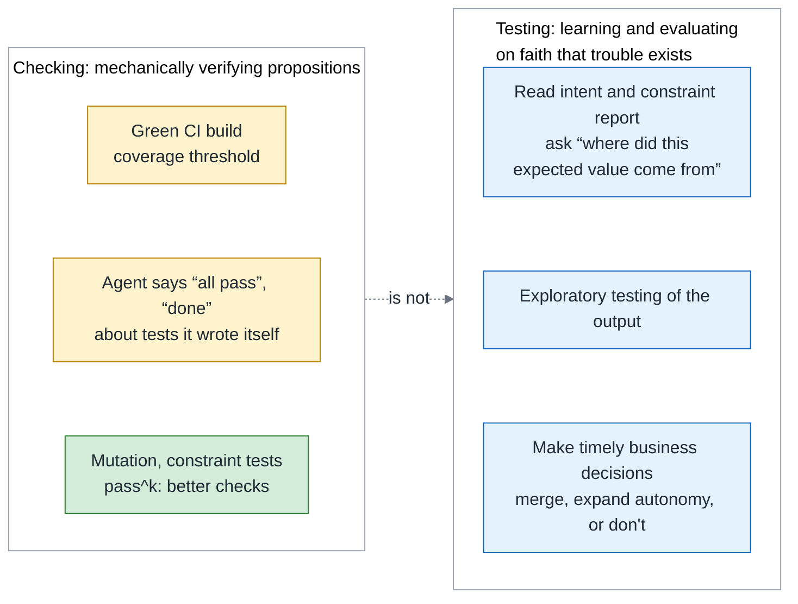
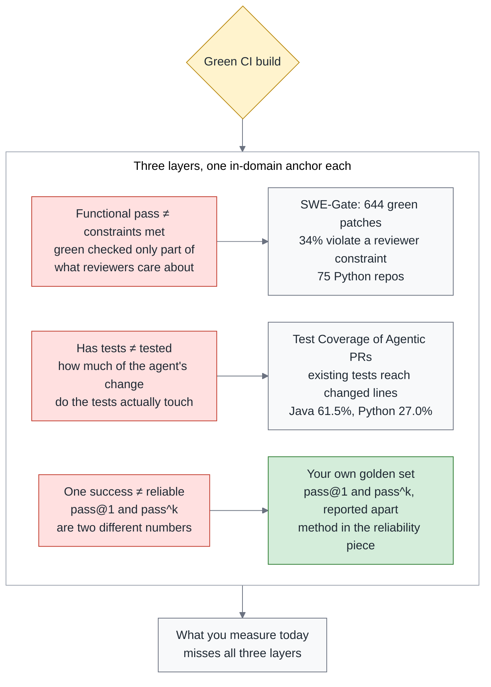
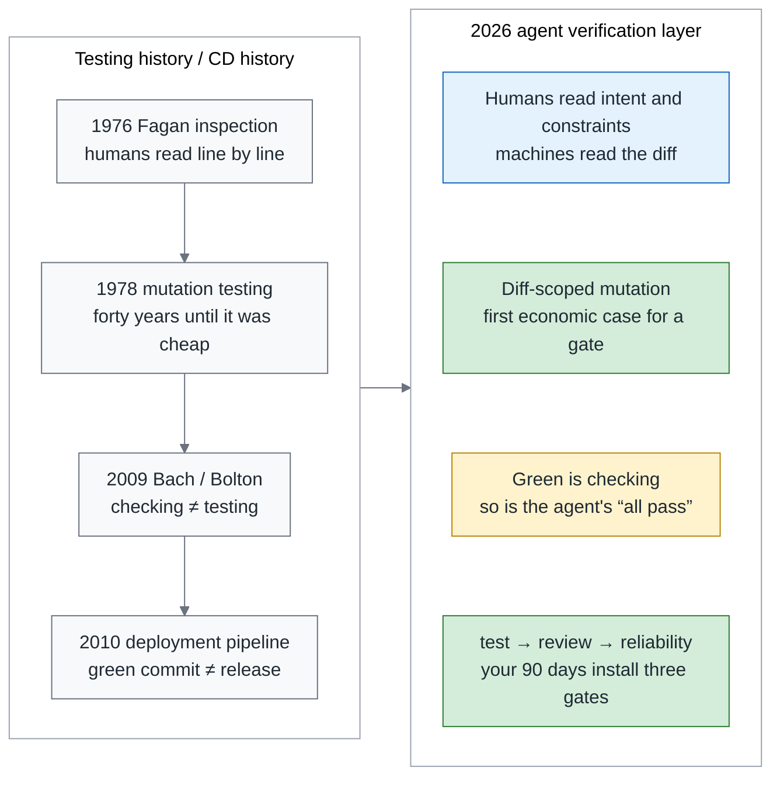
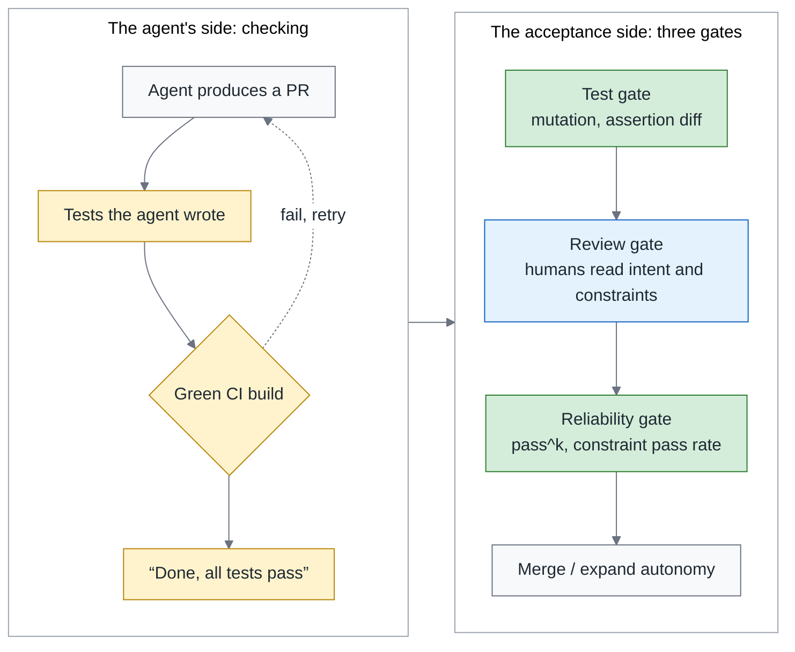
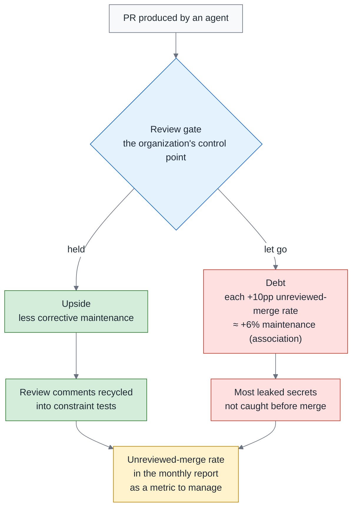
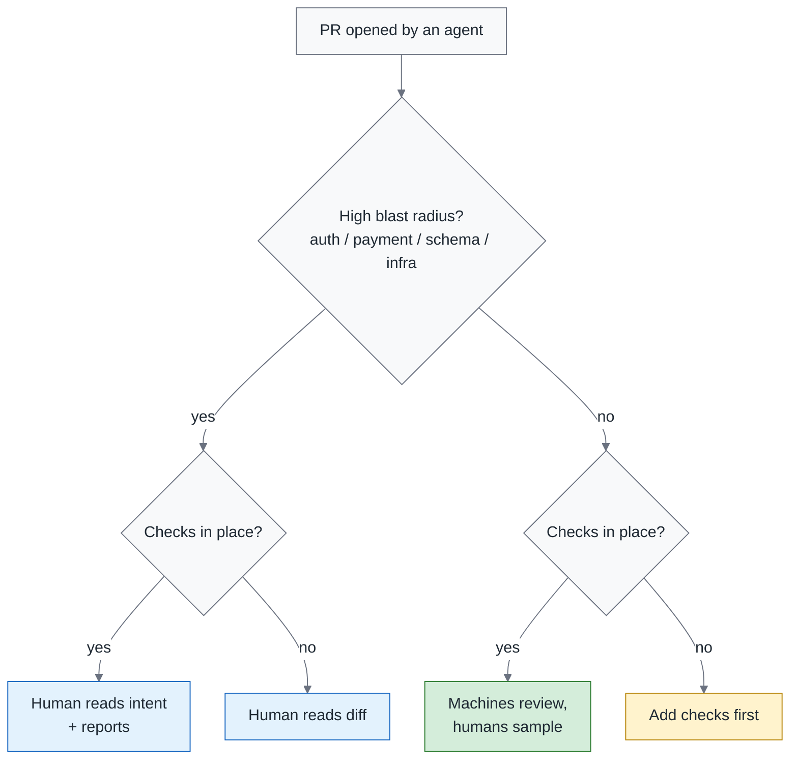
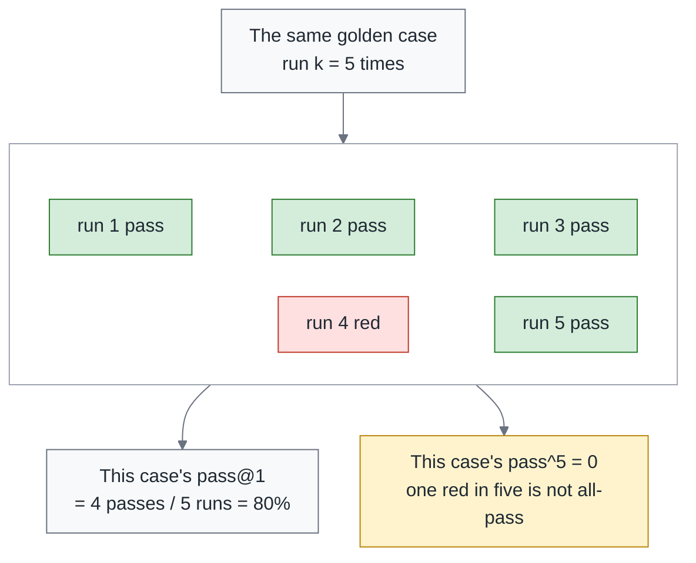
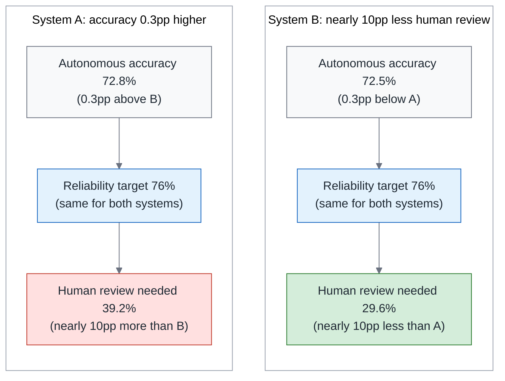
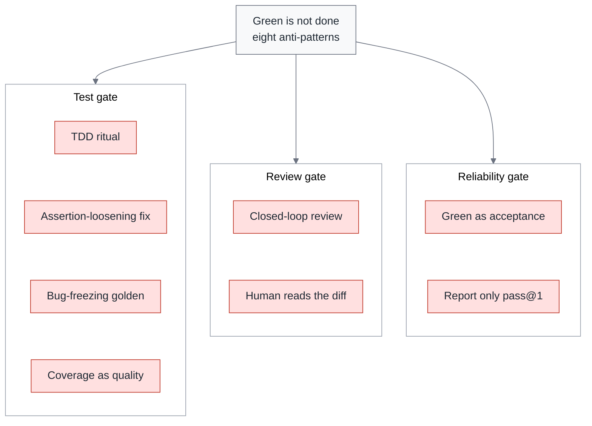

# Green Is Not Done: Testing, Review and Reliability for Agent Output

> **TL;DR** — Six months after adopting coding agents, most teams run into the same set of symptoms: CI is green, review is queued, production breaks. The three are one problem — when the agent also wrote the tests, a green build only proves it passed the questions it set for itself; in James Bach's words, that is *checking*, not *testing*. The verification layer has three gates: the test gate measures what the tests leave behind (mutation score), the review gate decides what deserves a human's reading and who reviews whom, and the reliability gate uses constraint tests and pass^k to decide whether autonomy can expand. Three claims you may disagree with — what a human reads on a payment PR, whether an AI approve counts, whether TDD can be a gate — are written out in one sentence at the end of section 1. Every number carries its domain: "34% of green patches violate a reviewer constraint" is what SWE-Gate measured on 75 Python repos. A 90-day blueprint is at the end.

> Series: **Overview (this piece)** → 1. Testing (coming soon) → 2. Review (coming soon) → 3. Reliability (coming soon). Last season: [Don't Build Your Own Devin](https://fantasybz.medium.com/dont-build-your-own-devin-org-strategy-and-a-90-day-blueprint-for-agentic-engineering-8187e7ec80f9) → [1. Org Design](https://fantasybz.medium.com/agentic-engineering-part-1-who-does-this-platform-plus-federation-in-practice-92343384d987) → [2. The Harness Blueprint](https://fantasybz.medium.com/agentic-engineering-part-2-the-harness-blueprint-making-your-system-legible-to-agents-3facc281f633) → [3. Evals and Unit Economics](https://fantasybz.medium.com/agentic-engineering-part-3-evals-unit-economics-and-scaling-running-agents-like-a-product-1cb1855a2046)

---

## 1. The question every engineering VP is asking: after "the AI said it's fine," what should I trust?

Before we get to gates, think back over the last six months of running coding agents for real. Most teams are stuck in roughly the same place.

Three scenarios follow. Not every repo has seen all of them, but most teams have lived through at least one.

The first one shows up in an ordinary status check. You ask an engineer whether this PR was tested, and the answer is "the AI said it's fine." A post in the Scrum Community in Taiwan group was about exactly this. The person answering isn't lazy. They genuinely do not know what else there is to look at besides trusting what the agent said.

The second one shows up while fixing a bug. You ask an agent to fix a failing test, and it does; CI goes green too. Then you look at the diff: `assertEqual` became `assertIn`, `== 3` became `>= 1`. The test is green; the bug is still there. What it fixed was not the code. It was the assertion that had been complaining.

The third one shows up afterwards. Production breaks, you go back to the PR, and the approve came from a reviewer agent. No human ever read it. Suppose this had to be written up as a postmortem: the hardest field to fill in would be "who looked at this change," and no name would go in it.

The three share exactly one thing: **the only evidence came from the agent itself**. The tests it wrote, the things it said, the approve it gave are all its checking of questions it set for itself, and the organization took them as acceptance.

The premise first, because the eleven sections after this one all rest on it.

A green CI build is by itself a measurement of the environment, not a statement by the agent. There is exactly one situation in which it turns into self-report: the tests were written or modified by the agent itself. Then examiner and examinee are the same.

There is a hole here I cannot fill. None of the research I have read measured what share of agent PRs contain agent-written tests, so "**most of the tests are agent-written**" is a premise in this series, not a fact. Repos where the condition doesn't hold are out of scope. To find out whether you are inside the premise, the number to look for is the share of new or modified test files the agent wrote: measure it in month 1.

Here is the answer to all three scenarios compressed into one sentence, written deliberately in a shape you can disagree with. Disagreeing is fine; you can still take it back and hold it against your own branch protection settings, review policy and agent workflow.

Two of the terms in it deserve a plain-language gloss first. Constraint tests turn something a reviewer once said into a check that CI runs. A mutation report is the result of deliberately breaking the code and seeing whether the tests go red. Each of the two gets a section of its own later:

> **Green is checking. Acceptance is testing.** So on a PR that touches payment, once constraint tests and a mutation report are in place, a human no longer reads the diff line by line — they read the intent, the constraint report and the mutation report, and only the hunks flagged red; until then, every comment a human leaves while reading the diff gets recycled into a constraint test. An AI approve does not count toward branch protection, whichever vendor it comes from. Writing TDD into AGENTS.md is fine; using the shape of TDD as a gate is not.

The vocabulary in all three claims is borrowed from one person. The next section lays that language out first, so the ten sections after it have shared terms to work with.

---

## 2. The book anchor: Bach's testing and checking

Who he is, first, because all three gates take their names from his definitions. James Bach is the author of context-driven testing and of the Rapid Software Testing (RST) methodology, and the work of his career has been to keep "testing" separate from "ticking boxes off a list."

The limitation first: I have not finished the book; the quotations come from the chapter that defines testing and checking, and from one interview.

There is a line in his *Taking Testing Seriously* that I quoted on my Facebook page: "Testing is the opposite of faith in the product. Testing begins with faith in the existence of trouble." The weight of it is in the second half. Testing does not start from believing the product is fine. It starts from believing that trouble is waiting somewhere.

A reader replied that testers now use vibe coding to build throwaway test tools. Throwaway means written and then discarded, built only to answer the one question in front of you. That is exactly this series' position: the agent is the tester's tool, not the tester's replacement.

So what is checking? Bach's definition reads: "Checking is the mechanistic process of verifying propositions… testing cannot be automated, but checking can."

In plain language, checking takes a set of propositions someone has already written down and marks them against the answer key: matching is green, not matching is red, and a machine does that faster and more consistently than a person. Testing is a person going in with judgment to ask whether the thing actually works, and Bach says that cannot be automated.

So CI is checking, automated, and there is nothing wrong with that. The problem sits elsewhere: an agent saying "all tests pass" is also checking, and it wrote the propositions being verified.

If both what the agent says and what the agent writes count as checking, the next question is what does count as evidence. This series splits it three ways, and the three deep dives use the same labels:

- a) **The agent's statements**: "done," "all tests pass," "LGTM."
- b) **Tests the agent wrote or modified**: green only proves it passed the questions it set for itself.
- c) **Team-owned tests and constraint tests**: a measurement of the environment the agent cannot alter.

Of the three, only c) counts as evidence. The gap between a) and b) is smaller than it looks: the only difference is that b) has CI pressing enter for it.

A natural objection comes up here. The agent has write access to the repo, so what makes c) something it cannot alter? Answering that takes two mechanisms — one that decides how a test gets promoted, and one that decides who can touch it afterwards.

**The promotion rule**: a test the agent wrote passes the test gate (no weakened assertions, real mutation kill power) **and is approved into main by a human** — only then does it move from b) to c). The classification looks at who has taken responsibility for it, not who typed it.

Mutation here means what it meant in the opening section: the code is deliberately broken, the tests stay green, and that tells you the changed line was not held down by any assertion. It measures not where the tests ran, but what the tests hold.

**Cannot alter**: CODEOWNERS for `tests/constraints/` and the golden set directory lists humans only, and any weakening of a c) test blocks outright. A golden set is a fixed set of representative tasks you run the same agent against over and over; CODEOWNERS is GitHub's file for "who is responsible for reviewing these files." Point both of those at humans and the agent can no longer approve its own changes to them. The implementation is in the reliability piece.

The vocabulary gets fixed here too. Mutation score, constraint tests and pass^k each get a section of their own later, and all three are **better checks**, not substitutes for testing. Testing is looking at the system with the belief that there must be trouble in it, and that remains human work.

Laying checking and testing out in two columns makes the line clearer than prose does. The left column is what a machine can do; the right column is what only a person can do:

The cell worth noticing is the bottom one on the left: mutation, constraint tests and pass^k all sit on the checking side too. Making a check better never turns it into testing by itself. It only leaves fewer things a human has to look at in person.

So what do today's checks actually miss? The next section answers with three numbers.

---

## 3. What the data says in 2026: the three layers a green build cannot measure

What a green build cannot measure splits into three layers: functional tests passing is not constraints met, having tests is not being tested, and one success is not reliability. Each layer has its own question and its own number.

Every number here deliberately carries its domain, sample size and date, because research in the agent field moves fast and a number that leaves its context is easy to misuse. The first two layers each get one in-domain anchor paper — measured in the code domain itself, not borrowed from somewhere else. The third layer has no ready-made number in the code domain that I can cite, so the approach is a plain one: go back to your own golden set and measure it.

SWE-Gate, in the table below, is a benchmark. What it does is hand an agent's patches to the functional tests and to the reviewer constraints at the same time, and look at how far the two results diverge. The three layers and their anchors:

| Layer | Claim | Anchor (in-domain) | More evidence |
|---|---|---|---|
| Functional tests pass ≠ constraints met | Green checked only part of what the reviewer cares about | SWE-Gate: of 644 patches that passed functional tests, 221 (34%) violated a constraint derived from real PR comments (75 Python repos, 303 tasks, September 2026) | Reliability piece |
| Has tests ≠ tested | How much of the agent-changed code the existing tests actually touch | Test Coverage of Agentic PRs: 4,882 agent PRs; the repo's existing tests touch only 61.5% (Java) and 27.0% (Python) of agent-changed lines (July 2026) | Testing piece |
| One success ≠ reliable | pass@1 and pass^k are two different numbers | Run your own golden set k times (defined in section 8) | Reliability piece |

The same three layers as a figure, this time set against the green build. What to look at is the distance between each layer and the green:

The arrow at the end is what the figure is for: all three layers sit downstream of the green build, and nothing in your CI today is measuring any of them.

Human eyes are not the safety net either, which is where I had assumed a fallback still existed. One experiment measured this directly, and its sample is worth stating first: 86 developers, each judging whether an LLM-written assertion was correct. When the assertion was correct, they recognized it 74% of the time. When it was wrong, they caught it only 49% of the time — and their confidence did not drop (Poor and Overconfident Judges, July 2026).

Put another way, a wrong assertion placed in front of a person has roughly a coin flip's chance of being taken as correct, and that person will not feel any need to look again. Section 7 uses this number when it asks what deserves a human's reading.

One first-hand case on top. It is much smaller than the studies above, but it happened in my own hands. The exercise at a pattern-language workshop came out like this: 5 tests all green, and the event-sourcing replay path never executed.

Event sourcing stores every state change as an event and replays them when the state is needed. Replay is that path, and it is where this design most often goes wrong. All tests green says only that nothing went wrong along the few paths they walked. About the path nobody walked, the green build said not one word. Details are in the testing piece.

The conclusion is not "agents can't be trusted." It is that **what you measure today cannot measure these three layers**.

This sounds like a new problem agents brought with them, and it isn't. The next section widens the time axis, and you will see that the same play has already run once.

---

## 4. Testing history has already run this experiment

A new verification problem is usually an old one in different clothes. Last season's historical through-line was DevOps 2014–2016; this season it is the history of testing.

The reason for the switch is this: every gate agents are now forcing on us was already argued out in the testing field decades ago, back when it simply wasn't cheap enough to run every day. The figure below puts testing history on the left and today's verification layer on the right — two versions of the same thing:

Two points in that figure are worth going into.

The first is at the end of the timeline on the left. Humble and Farley (the two authors of *Continuous Delivery*) said long ago that a green commit stage is not a release. The agent era did not overturn that; it merely reinvents the later stages as three gates.

The second is on the right. The economic case that mutation testing waited forty years for, agents supplied. Once "writing tests" is free, "do the tests do anything" becomes the only question still worth money.

In one line: **history taught us nothing new; it just mailed the bill for the stages we skipped.**

The first item on that bill is what the next section handles. If the tests can be agent-written too, what should we be telling the agent to do — or should we be telling it anything at all?

---

## 5. Don't teach the agent how to test; measure what it leaves behind

Uncle Bob (Robert C. Martin) is about the last person in this industry you would expect to give up on TDD, given that he is its main promoter. That is what makes it worth reading how he settled his position on X this summer: TDD is a human discipline and he does not expect agents to follow it (July 30). He also said you can't tell an agent to "stay clean," you can only measure how clean it is and then tell it to fix that (July 29).

When TDD's own promoter hands the agent's discipline problem over to measurement, that is where this section's title starts.

Another angle comes from Birgitta Böckeler, who leads AI-assisted software delivery at Thoughtworks. Böckeler (reposted by Fowler on August 11) framed "TDD inside the agent loop — theater or actual value?" as an empirical question: is that a ritual performed for an audience, or does it do something real?

This piece's answer is the last of the three claims from the opening section. The ritual's value is not zero — it changes the agent's exploration path — so writing "please use TDD" in AGENTS.md is fine. AGENTS.md is the project file that lives in the repo and is written for agents to read. But **the shape of TDD cannot be the gate**; the gate measures output only, not what the process looked like.

Uncle Bob ran a small experiment on August 17: 8 runs, four test disciplines, with and without a CRAP threshold, one round each — this piece calls it the negative test experiment, after that post. CRAP is Change Risk Anti-Patterns, a risk score that combines cyclomatic complexity with coverage; the higher it goes, the more that code is both complicated and untested.

The result: **all passed the same 25 acceptance cases, and the programs that came out were different**. Acceptance tests all green cannot tell quality apart — SWE-Gate, personal edition. One side is a large-scale statistic, the other is one person's hand-run experiment on his own machine, and the conclusion is the same.

The Taiwanese discussion has landed in the same place. A post in the Scrum Community in Taiwan group argued that demanding human "values" of an AI is right, and forcing human "work habits" onto it is wrong. I agree with where that line is drawn, with one thing to add: what's missing is not the agreement, it's that nobody has written the gate yet.

The table below puts the instruction approach and the measurement approach side by side. The left column is the outcome you want, the middle is what most teams do today, and the right is what can actually serve as a gate:

| What you want | Instruction (not a gate) | Measurement (the gate) |
|---|---|---|
| Effective tests | AGENTS.md: "please use TDD" | Mutation score ≥ threshold (agent-changed lines only) |
| Existing tests not broken | "Do not modify existing assertions" | CI check: existing assertion weakened → block; bug fix PRs also run red-then-green |
| Reviewer constraints respected | "Please follow team conventions" | Constraint tests (review comment → rule → executable check) |
| Honest reporting | "Tell me if a test is broken" | Structured escalation tool (`report_broken_test`) |
| Reliable | "Please check carefully" | pass^k on the golden set ≥ threshold |

A prompt can influence how an agent behaves, but only a check leaves the organization something usable at the moment the agent gets it wrong, cuts a corner, or misunderstands.

Every cell in the right column is a check, not a prompt.

The parts of the three gates have all appeared by now, scattered. The next section puts them into one figure and settles the order at the same time.

---

## 6. The three gates of the verification layer

The first five sections collapse into one figure. On the left is the agent's side, where every item is checking. On the right is the acceptance side with its three gates, and merge and expanded autonomy exit only from the right:

The figure is about the line down the middle: however well the left side does its job, it never crosses to the right on its own. The three gates on the right are ordered, and if the previous one hasn't passed, there is nothing to discuss about the next.

One question, one measurement and one owner per gate:

| Gate | Question | What it measures | Owner | Deep dive |
|---|---|---|---|---|
| Test gate | Can these tests catch a bug? | Mutation score, assertion-change diff, red-then-green | QA / test lead + platform | Testing piece |
| Review gate | Who should read this PR, and what should they read? | Triage matrix, reviewer heterogeneity, approval artifact | EM + seniors | Review piece |
| Reliability gate | How much autonomy can this kind of task get? | Constraint pass rate, pass^k, oversight budget | Platform + VP | Reliability piece |

One part in that table is shared by all three gates: constraint tests. Take a hypothetical. A reviewer once left "don't open a new HTTP client every time here" on some PR, and that sentence gets written up as a rule CI runs on every PR. It has just turned from a comment into a check.

Constraint tests are installed and maintained by the test gate's owner, and the reliability gate only consumes their constraint pass rate.

The design philosophy behind all three gates is one sentence: **designing the environment beats writing rules**.

One study put a number on that sentence. It gave the agent a formal way out — a channel for saying "this test is itself broken" — and the agent's rate of reward hacking dropped to roughly a quarter. Reward hacking here means going off to make the test pass instead of fixing the bug (escalation channels, August 2026; the baseline, the full numbers and that tool's schema are in the testing piece).

The agent isn't trying to deceive you; you gave it only one road.

Of the three gates, the test gate and the reliability gate can both be handed to machines. The middle one cannot, because what it decides is where human time goes.

---

## 7. Review is the control point, not the bottleneck

On September 2 Martin Fowler reposted "Maybe we shouldn't be reviewing all this code": the problem isn't that AI broke code review, it's that we've been using review to solve the wrong problem. This piece's version: **redesigning review is not about making humans read faster; it is about deciding what deserves a human's reading.** The "review becomes the new bottleneck" point in [last season's overview](https://fantasybz.medium.com/dont-build-your-own-devin-org-strategy-and-a-90-day-blueprint-for-agentic-engineering-8187e7ec80f9), section 4, needs a correction: the bottleneck is a symptom; the disease is putting humans at the wrong gate, reading the wrong thing.

This section uses two numbers, one about scale and one about association.

Scale first. A longitudinal study across three generations and a million PRs (From Human-Centric to Agentic Code Review, July 2026) found that agent-initiated and multi-agent review made decisions faster **under some adoption patterns**, but not better. That "under some adoption patterns" qualifier is the paper's own, not mine.

Association next. Another longitudinal study tracking 182 repos (Post-merge fate of agentic code, July 2026) found that agentic code needs significantly more corrective maintenance. The association it reports runs like this: every 10 percentage points more in unreviewed-merge rate goes with roughly 6% more maintenance burden.

That number has to be read carefully. The original wording is "is associated with," correlation not causation, so it cannot carry a claim like "skip review and things will rot." But it is enough to make the unreviewed-merge rate a metric that belongs in the monthly report. Unreviewed here includes merges with only an AI approve — that is what claim 2's "does not count" means.

Another July 2026 study also found that most real leaked secrets were not caught before merge. That number is in the review piece.

Draw the upside and the debt as one figure, and the diamond in the middle is the control point this section's title is about:

The difference between the two paths on the right is not how conscientiously the review was done. It is whether the review's output got recycled. On the path that holds, comments become constraint tests; on the path that lets go, the debt gets paid off slowly, after merge.

So why isn't a human reading the payment diff line by line the safety net? I have two reasons.

The first is section 3's 49%. Put a wrong assertion in front of people and only half of them catch it. It measured judging assertions, not reviewing PRs, so it doesn't transfer directly, but the direction is the same: humans read slowly, and not necessarily accurately.

The second is compounding. A comment a human leaves while reading a diff reviews this one PR, and it is over once that PR merges. The same comment recycled into a constraint test checks every PR that follows.

So in the cells where blast radius is high, what a human catches reading the diff gets recycled into constraint tests. Blast radius is how far a change reaches when it goes wrong: auth, payment, schema and infra are high, internal tooling is low.

The day constraint tests and the mutation report are in place, the human switches to reading intent and reports, and only the hunks flagged red. A hunk is one of the blocks a diff is cut into, and the ones flagged red are where the machine thinks a person is needed. The sampling rule for regulated systems is in the review piece.

The triage figure below has four exits, and humans read in only two of them:

The exit to take away is the one at the bottom right: for a PR with low blast radius and no constraint tests or mutation report, the answer is not "find someone to read it," it is to add the checks first. Putting people where there is no evidence only buys a more expensive rubber stamp.

The four exits are the four cells of the review piece's triage matrix. The full table, the reviewer fleet, the closed-loop ban and the approval artifact are all in that piece.

Review decides who reads what. The next section changes the question: how much autonomy can this kind of task actually be given?

---

## 8. Reliability is not capability: pass@1, pass^k and the oversight budget

Reliability is not capability, and that is this section's whole position. How strong an agent is and whether you dare hand it a whole class of tasks are two different things. Separating them takes two definitions:

- **pass@1**: the per-attempt success rate of each case, estimated from k reruns.
- **pass^k**: the share of cases that succeed on all k runs.
- Both are computed per case first, then aggregated over the golden set. "Succeeds at least once" is pass@k; this series does not use it.

Walking the two definitions through a single case makes them clearer. Suppose the same golden case runs a few times in a row and one of those runs goes red:

The gap between the two boxes on the right is what to take from the figure: same case, same set of runs, and the two numbers reach completely different conclusions. One red is enough for "right every time" to be false.

The two can differ a lot. Run the operations piece's 20–50 golden cases at k = 5 to 10 and measure your own. Don't extrapolate your own autonomy from somebody else's benchmark; let your own system lay its variance out in front of you first.

The third number is human effort. Here I borrow **a corroborating case outside code** — the concept transfers, the numbers do not.

READY is a qualification framework for enterprise agent deployment (September 2026). It asks, before an agent system is cleared to run, how many people it takes to reach the reliability you want. Its case is a clinical audit workflow, 16 agent systems, 750 cases. The domain is not code.

Two of those systems had autonomous accuracy of 72.8% and 72.5%, only 0.3 percentage points apart. With the reliability target set at the same 76% for both, their human review shares came out at 39.2% and 29.6% — the more accurate one needed more human eyes.

**A ranking by accuracy is not a ranking by human effort.**

My reading is this. What sets the human effort is not how often the system is right, it is how recognizable its errors are when it is wrong. A system whose errors cluster and are easy to spot lets people watch just that area; a system whose errors scatter, each one looking as confident as the next, leaves people no choice but to check more of them. That is my explanation working backwards from the result; the paper does not put it that way.

The human review share is derived backwards from the reliability target; this series calls it the oversight budget — the headcount you have to budget for in advance in order to reach the reliability you promised. The algorithm is in the reliability piece:

The two systems in the figure start out almost identical and end up far apart, and the only thing they share in between is that reliability target. An autonomy decision cannot be made on an accuracy number alone, and this figure is the reason.

So in the leadership monthly report, three numbers replace the single "pass rate":

| Number | What it answers | What it must not be used for |
|---|---|---|
| pass@1 (golden set) | Is capability improving | Deciding autonomy |
| pass^k (golden set, k = 5–10) | How much autonomy this kind of task can get | Comparing against someone else's benchmark |
| Constraint pass rate (SWE-Gate style) | What was violated beyond the green build | Replacing review |

The column that matters most in that table is the last one. "What it must not be used for" is not filler; it blocks the three most common misuses — deciding autonomy on a capability number, comparing your own numbers against someone else's benchmark, and treating a constraint pass rate as a reason to skip review.

These three numbers connect back to the operations piece's G2: autonomy expansion looks at pass^k and escape rate, not pass@1; whether capability is improving and whether you can let go were always two different questions. Escape rate is the share of defects that slip past these gates and are only found in production afterwards.

G2 is last season's operations-piece gate for "should autonomy be opened wider," and the conditions it came with then were still qualitative. This season adds four measurable ones — pass^k, constraint violation rate, mutation score floor and oversight budget — and the full table is in the reliability piece.

The question, the measurement and the owner for each of the three gates are now in place. The next section walks it backwards: what you see on the ground when none of this is installed.

---

## 9. Eight anti-patterns

Everything so far has been about what to do. This section turns it around into eight anti-patterns, because on the ground the thing recognized first is usually not the correct practice, it's the symptom. Every line in the right column below is something you can match yourself against directly:

| # | Anti-pattern | Where you see it |
|---|---|---|
| 1 | **Green as acceptance** | "CI passed, coverage 90%, ship it" |
| 2 | **TDD ritual** | AGENTS.md says "write the tests first"; a TDD-shaped commit history is taken as reassurance |
| 3 | **Loosened-assertion fix** | Fixing a failing test by turning `assertEqual` into `assertIn`, adding `@skip`, deleting `assertRaises` |
| 4 | **Golden that freezes a bug** | Recording the current output as a snapshot / golden file; the bug is now protected by a test |
| 5 | **Coverage as quality** | Letting agent PRs through on a coverage threshold; exclude patterns and empty assertions can both produce the number |
| 6 | **Closed-loop review** | The same model, the same session reviewing its own PR; or an AI approve counts as passing |
| 7 | **The human who reads the diff** | Seniors read agent diffs line by line, PRs queue up, and the end state is a rubber stamp |
| 8 | **Reporting only pass@1** | Telling leadership "eval pass rate 85%" and expanding autonomy on it |

One figure assigns each of the eight to the gate it belongs to:

The assignment itself is the takeaway: not one of the eight is "the agent's problem." Every one of them maps to a gate that hasn't been installed yet.

Closed-loop review comes with a scale number first. Cross-product AI-reviews-AI — a reviewer from a different vendor reviewing agent PRs — is only about 1.6% of the total, but grew more than 100x from Q1 to Q3 2025 (AI-to-AI Code Reviews, 248,641 PRs, August 2026).

Note what that number measures: the different-vendor case, which is the open loop and was always allowed. What should worry you is how large the same-model, same-session loop is. The paper did not measure it; you will have to measure it yourself.

Of the eight, in Taiwanese communities I see 5 and 6 most often — an observation, not a statistic. Those two are "coverage as quality" and "closed-loop review," and the reasons are practical in both cases: coverage is the threshold easiest to bolt onto existing CI, with the number already there and no process to change, and seat-based subscriptions make "review yourself on the same subscription" the cheapest option.

Once the symptoms are recognizable, what's left is the decision. In the next section I put myself in the engineering VP's or QA lead's seat and write down what I would and would not approve.

---

## 10. If I were the engineering VP or QA lead, how I would decide

The previous nine sections turn into a decision list here. The three lines below are written as realistic proposals, because that is usually how they get said out loud. I would **not** approve:

> "Turn the QA team into a prompt team."
> "Use AI review to clear the review backlog; an AI approve is enough to merge."
> "On the strength of an 85% eval pass rate, open write tools to every team in Q4."

All three are blocked for the same reason: each of them wants an unmeasured number or process to stand in for a gate that isn't installed yet.

I **would** approve four things:

1. **Turn review comments into constraint tests first.** Pull 50 review comments from the agent PRs sent back in the last 90 days, classify them, pick out the executable ones, and write the first 10 constraint tests. For a repo with no comment history, derive the first 5 from the last 5 incident postmortems instead. This is the main route, not a fallback, because every "this must never happen again" was a constraint to begin with.
2. **Install a mutation gate on one pilot repo**, counting only the lines the agent changed. There are two conditions for turning it on: 200+ engineers or a QA lead who will read the report, and the affected test subset finishing within 10 minutes — at 50 people, don't turn it on, and the reason is in the table below. The threshold is **my suggested value (not an industry standard)**: mutation score ≥ 70%. Below the threshold, the PR goes back to the agent for more tests, not to a human to read. The rollout order is report only for a month, then block.
3. **The reviewer agent must be an instance from a different vendor, or at least a different session**, and an AI approve never counts toward required approvals. Required approvals is GitHub's setting for how many approves a PR needs before it can merge. A merge with only an AI approve counts as unreviewed in section 7's unreviewed-merge rate. GitHub offers two candidate mechanisms: CODEOWNERS listing humans only plus Require review from Code Owners, or a required status check that counts human approves. I have not tested either on a production repo, so I will validate first with a GitHub App's approve on my own repo, to see whether either route holds up. A design draft is in the review piece.
4. **The approval artifact binds a human identity to the hash of what was reviewed.** An approval artifact records who pressed approve on exactly what content; change the content and the record is void. On high-blast-radius PRs, whoever assigned the task cannot approve. Vendor terms contradict one another on "who may approve an agent's PR" (Where Accountability Lives, August 2026); the details go to December's accountability piece.

**How to think about the verification budget.** A study of 1,116 web apps, 6 models and 8 tool configurations (The reach of a verification tool decides its value, August 2026) gave me one principle: a verification tool's value is set by its reach — a boot probe that only checks whether the app starts, at about 35% of a shell's token cost, removed almost all startup failures; a full shell costs 2.35x. So buy the check with the widest reach first (constraint tests, assertion-change diff), then the ones that have to execute tests (red-then-green, mutation), and only last the expensive ones (k reruns, step-rubric judges).

**The ratio is my provisional heuristic, to be calibrated by the pilot** — that paper supports the principle, not the ratio: for every $1 of agent tokens plus generation-side CI (the denominator: the machine cost of what the agent produces), budget $0.30 to $0.50 of verification-side compute (the numerator: the machine cost of verifying it). **Human review time is not in this ratio**; it goes through the reliability piece's oversight budget, and the two are reported to the CFO separately.

**Installing at 50 / 200 / 1,000 engineers.** G2 is about expanding autonomy, not about rolling a gate from one repo to forty:

| Scale | How to install the verification layer | Who owns it |
|---|---|---|
| 50 engineers (5–10 repos) | Constraint tests + assertion-change diff only; no mutation — nobody would read the report | Platform, part-time; with no QA lead, the most senior reviewer |
| 200 engineers (30–50 repos) | All four checks in the paved-road CI template; on by default for new repos, brownfield order for old ones; the reviewer fleet defined once in a central config file | QA lead owns the test gate; EMs own the review gate's triage matrix |
| 1,000 engineers | Platform runs the test gate as a product (versions, SLA, dashboard); the reviewer fleet is managed centrally and each BU picks its configuration; each BU computes its own oversight sampling rate | Platform product owner + each BU's QA lead |

Ownership is the column to look at here. The set of checks only shrinks at the smallest scale, but who owns the gate changes on every row: at a scale where nobody would read the report, mutation stays off.

**Brownfield: which gate first.** The reality for most teams in Taiwan is a 15-year-old legacy monolith: a 40-minute test suite, 30% coverage, no review-comment history to mine. Below is the installation order for the verification layer; each step depends only on the precondition in its own row. It does not replace the legibility order from last season's overview, section 7 (characterization tests → logs / traces → architecture rules); a repo with no tests at all adds characterization tests first, as step 0:

| Order | Gate | Why this position | Precondition |
|---|---|---|---|
| 1 | **constraint tests** | Needs no existing tests; the raw material starts from team conventions and incident postmortems (item 1 above) | None |
| 2 | **assertion-change diff** | Pure diff analysis, zero execution cost; the 40-minute suite never runs | None |
| 3 | **red-then-green (bug fix PRs)** | Runs only the affected test subset — whichever module changed, run that module's tests | Can compute the affected subset: test selection or a directory mapping |
| 4 | **diff-scoped mutation** | The most expensive, installed last; report first, block later | Affected subset runs within 10 minutes |

These four checks are just as useful on human-written PRs — loosened assertions, frozen bugs and violated team constraints were not invented by agents. **Even if the agent bet fails, none of these gates is wasted.**

---

## 11. A 90-day action blueprint for the verification layer

The previous section listed what I would and would not approve, but a list on its own has no order. This section lays it out on a timeline: which gate goes in which month, and what has to be visible at the end of each month before it is reasonable to move on.

The starting point first. Once the gates are in, someone will ask whether things actually got better, and that question is only answerable if you measured before installing anything. So the main work of month 1 is not installing everything, it is measuring the baseline — where things stood before any intervention.

There are six to measure. The first two were already being measured last season: escape rate, defined in section eight, and review minutes per PR, the average human review minutes each PR consumes. The other four are new this season:

- The share of PRs that weaken an existing assertion
- The share of snapshot or golden-file updates with no stated reason
- The share of agent-changed lines that existing tests cover
- The share of new or modified test files written by the agent

The last one deserves its own note. What it measures is not quality but whether the opening section's premise holds at all. If most of the new tests in your repo are still written by humans, "examiner and examinee are the same" does not hold, and you can slow the pace down. The line from the previous section still stands, though: these checks are just as useful on human-written PRs. Measuring first tells you how fast to go, not whether to go.

With the six numbers in hand, what's left is the schedule. Each row of the table below is one phase: the middle column is that month's work, and the right column is the exit criteria — the bar for moving on to the next month.

| Phase | Goal | Exit criteria |
|---|---|---|
| **Month 1** | Measure the six baselines (above); the pilot repo gets the first two gates of the brownfield order — constraint tests derived from team conventions and incidents, and assertion-change diff; mutation reports only, and only on repos whose affected subset runs within 10 minutes; pull and classify 50 review comments (section 10, item 1) | The four new numbers have a baseline; the first two checks run on every PR; if mutation is on, its report appears on the PR without blocking |
| **Month 2** | The first 10 constraint tests derived from review comments enter CI; red-then-green on for bug fix PRs; the reviewer agent swapped for a heterogeneous instance; the PR template gains intent and constraint fields; **AI approve does not count toward required approvals** (validate the mechanism first, section 10, item 3); the agent gets an escalation tool | At least one constraint test has blocked a green PR; the assertion-weakening share is falling |
| **Month 3** | Golden set run at k = 5 to compute pass^k; mutation moves from report to gate (on the repos where it is on); one autonomy keep-or-expand decision made against the new G2 conditions; three numbers enter the leadership monthly report | The monthly report has pass@1 / pass^k / constraint pass rate columns, **and someone has made one autonomy decision on them with the reasons stated publicly** — expanding or not both count |
| **Months 4–6** | Repeat repo by repo: start with the repos with the highest share of agent PRs, in brownfield order; at 200+ engineers, put all four checks into the paved-road CI template | At least one new repo completes months 1–2 each month; the unreviewed-merge rate enters the monthly report |

The right-hand column is the one most likely to get skipped. Exit criteria are not a sign-off, they are the ticket into the next month: if the criteria aren't met, don't install anything further, rather than pushing ahead because the calendar says so. Suppose constraint tests go into CI and a whole month passes without one of them blocking a single PR. My first guess would not be that the team suddenly got well behaved. It would be that the rules were picked too safe, and what to do then is go back and change the rules, not open the mutation gate on schedule.

The table answers what to do each month. The figure below takes only the first three months and lines up each month's exit criteria, to show how they converge on one decision:

The main line runs straight down and lands on the node at the bottom right. The end of three months is not "all four checks are installed," it is that someone has taken these numbers and made one keep-or-expand call on autonomy, with the reasons said out loud. Expanding and holding both count; nobody deciding is the failure.

Two reminders to close on, both about the places I think this most easily goes wrong:

1. **Mutation goes in last, report first, block later.** Month 1 reports only, month 3 blocks. A gate that blocks from day one gets ripped out: a new gate that is blocking people in its first week will soon have someone asking for it to be turned off, and the whole mutation gate goes with it. Red-then-green works the same way, but its trap is scope. It is on only for PRs that change existing behavior; turn it on for feature PRs too and every one of them goes red on "class does not exist," and it gets ripped out the same way. The new tests on feature PRs are not red-then-green's job, they are mutation's.
2. **Start constraint tests from the rules that are executable and least contested.** What do those look like? No new dependencies, no new public API, a consistent log format. What they have in common is that right and wrong are obvious, and writing them as a CI check starts no arguments. Do not start with architecture rules. Suppose the first rule you write is "no calls across layers": that rule sets off an architecture debate inside review, and the whole constraint-tests effort stalls before it has run once.

Whether three months is enough has less to do with how good the tools are than with whether anyone is willing to stop when the exit criteria haven't been met.

---

## 12. Closing

Back to the three scenarios from the opening section. With all three gates installed, how do they end?

The next time the engineer is asked whether the PR was tested, there are a few more things to point at: whether the constraint report passed, where the mutation report went red, which cell of the triage matrix this PR landed in. The PR that turned `assertEqual` into `assertIn` gets caught by the assertion-change diff before merge — equality swapped for containment is a drop in strength, and it blocks outright. The tests are still green; the PR still doesn't get through. As for the one that broke production and turned out to have only a reviewer agent's approve, the "who looked at this change" field in the postmortem will have a name in it, because an AI approve never counted in the first place.

Not one of the three came from the agent getting better. All they did was move the source of evidence out of the agent's own hands and into measurements the organization owns.

Back to Bach. Checking can be automated, testing cannot. Agents have pushed the cost of checking close to zero, and in doing so made testing the scarcest thing in the organization. What is scarce is not the labor to write tests; it is the judgment that starts by assuming there is trouble here and then goes looking for it.

One last prediction with a date on it, so that it can be checked and so that it can be wrong. By 2027, a reliability gate will be standard in G2, and "reporting only pass@1" will draw the same frown that "only looking at coverage" does today. That is my judgment, not the conclusion of any trend report.

> **When the agent wrote the tests, green only means it passed the questions it set for itself. Don't teach it how to test; measure what it left behind — then put humans where they should be reading.**

The hard part of that sentence is not the first half, it's the second. Measuring what it left behind is an engineering problem: you can write the check and get it into CI. Putting humans where they should be reading is an organizational problem, and it starts with someone admitting that reviewer time is finite and being willing to decide which places go unread.

November's theme, "the same spec, run ten times," pushes pass^k one step further, into the harness's variance. How many of the runs come out the same is mostly treated today as a question about the model. What I want to talk about is how much of it the harness decides.

---

### The series

Three deep dives, one gate each:

1. **Overview (this piece)**
2. Part 1 — Reviewing the Tests an Agent Wrote: Loosened Assertions, Frozen Bugs and Mutation Score (coming soon)
3. Part 2 — Review Is the Control Point, Not the Bottleneck: Triage, Reviewer Fleets and the Closed-Loop Ban (coming soon)
4. Part 3 — The 34% SWE-Gate Found Behind a Green Build: Constraint Tests, pass^k and the Gate for Expanding Autonomy (coming soon)

Last season's Agentic Engineering series: [Overview](https://fantasybz.medium.com/dont-build-your-own-devin-org-strategy-and-a-90-day-blueprint-for-agentic-engineering-8187e7ec80f9), [1. Org Design](https://fantasybz.medium.com/agentic-engineering-part-1-who-does-this-platform-plus-federation-in-practice-92343384d987), [2. The Harness Blueprint](https://fantasybz.medium.com/agentic-engineering-part-2-the-harness-blueprint-making-your-system-legible-to-agents-3facc281f633), [3. Evals and Unit Economics](https://fantasybz.medium.com/agentic-engineering-part-3-evals-unit-economics-and-scaling-running-agents-like-a-product-1cb1855a2046).

---

### References

1. James Bach — *Taking Testing Seriously* (book); Bach / Bolton — Testing and Checking (satisfice.com)
2. SWE-Gate — [Passing Functional Tests Is Not Enough for Software Engineering Agents](https://arxiv.org/abs/2609.04167) (2026-09-03)
3. arXiv — [Test Coverage Analysis of Agentic Pull Requests](https://arxiv.org/abs/2607.18057) (2026-07-20)
4. arXiv — [Programmers Are Poor and Overconfident Judges of LLM-Generated Assertions](https://arxiv.org/abs/2607.08885) (2026-07-09)
5. arXiv — [Can escalation channels redirect reward hacking toward defect disclosure?](https://arxiv.org/abs/2608.29460) (2026-08-29)
6. arXiv — [READY or Not: Reliable Enterprise Agent Deployment](https://arxiv.org/abs/2609.02095) (2026-09-02)
7. arXiv — [From Human-Centric to Agentic Code Review: three generations of GenAI and review quality](https://arxiv.org/abs/2607.13196) (2026-07-14)
8. arXiv — [Do These Violent Delights Have Violent Ends? Post-merge fate of agentic code](https://arxiv.org/abs/2607.09902) (2026-07-10)
9. arXiv — [Trust but Verify? Security debt of autonomous coding agents](https://arxiv.org/abs/2607.12428) (2026-07-14)
10. arXiv — [AI-to-AI Code Reviews of GitHub Pull Requests](https://arxiv.org/abs/2608.21311) (2026-08-21)
11. arXiv — [Where Accountability Lives: mapping human responsibility to workflow artifacts](https://arxiv.org/abs/2608.15678) (2026-08-16)
12. arXiv — [The reach of a verification tool decides its value](https://arxiv.org/abs/2608.28795) (2026-08-28)
13. Robert C. Martin (@unclebobmartin) — [2026-07-26 kinds of tests](https://x.com/unclebobmartin/status/2081332683582427641), [2026-07-29 measure cleanliness](https://x.com/unclebobmartin/status/2082497764223492161), [2026-07-30 TDD is a human discipline](https://x.com/unclebobmartin/status/2082850576832905657), [2026-08-05 deterministic tools](https://x.com/unclebobmartin/status/2085104553746190372), [2026-08-17 negative test experiment](https://x.com/unclebobmartin/status/2089449442089025936)
14. Martin Fowler (@martinfowler) — [2026-08-11 TDD inside the agent loop (Birgitta Böckeler)](https://x.com/martinfowler/status/2087173563144912985), [2026-09-02 Maybe we shouldn't be reviewing all this code](https://x.com/martinfowler/status/2095147242986373485)
15. Community discussion: public posts in the Scrum Community in Taiwan group ("the AI said it's fine"; "demanding human values of an AI is right")

---

### On how this piece was made

The initial concept and chapter structure are the author's; the prose was drafted in collaboration with AI (Claude), then reviewed and revised section by section by the author before publication. The views and judgments are the author's own, as is responsibility for the content.

---

*Originally published in Chinese: [中文版](https://medium.com/p/582f24223eea). Also on [Medium @fantasybz](https://medium.com/@fantasybz) — if you're designing the verification layer for agent output in your organization, I'd like to hear from you.*
