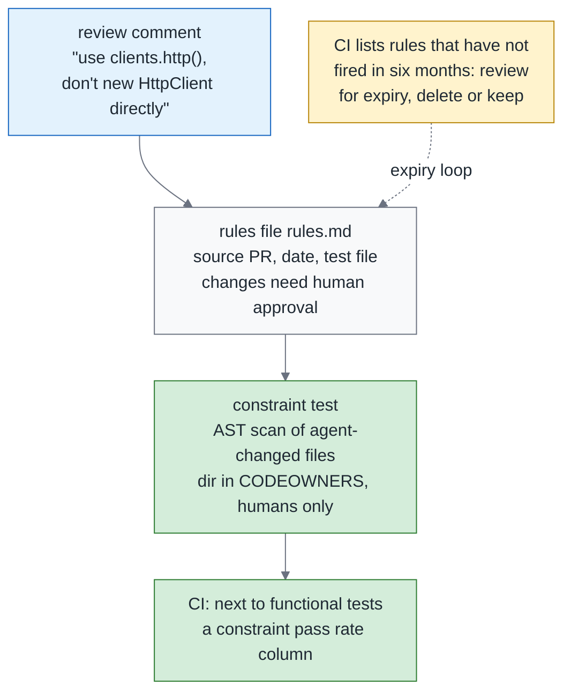
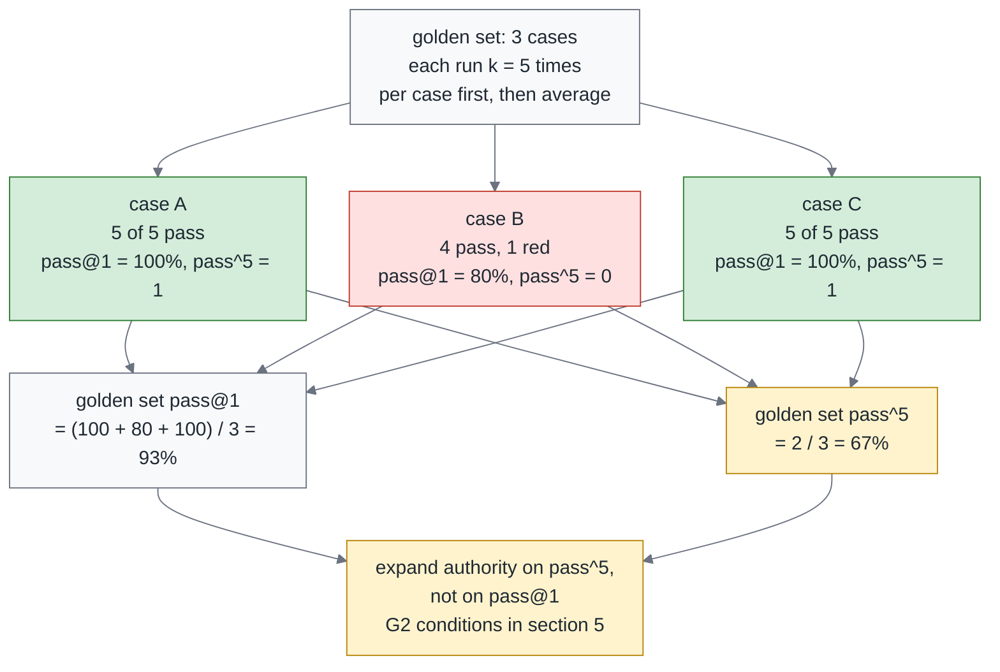
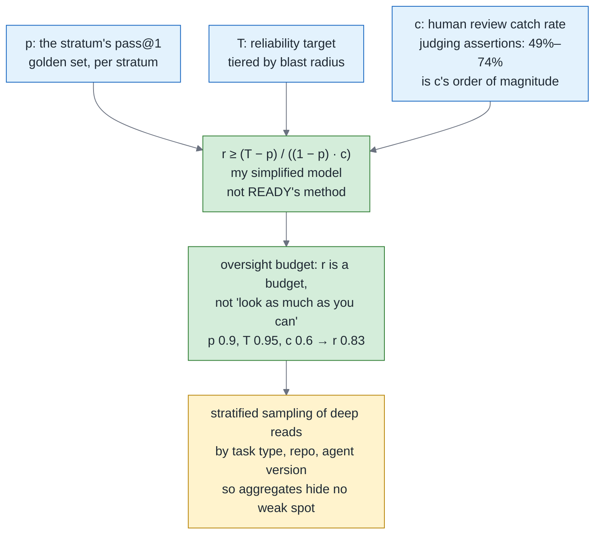
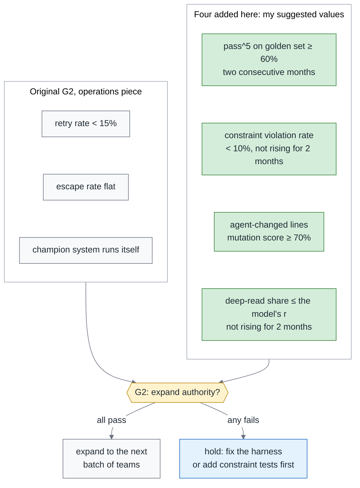

# Green Is Not Done, Part 3 — The 34% SWE-Gate Found Behind a Green Build: Constraint Tests, pass^k and the Gate for Expanding Autonomy

> **TL;DR** — The final part of the trilogy, on the reliability gate: which numbers decide whether an agent's authority gets expanded. SWE-Gate measured it on 75 Python repos and 303 patch tasks: of the 644 patches that passed the functional tests, 221 (34%) violated a constraint a reviewer had actually added — one in every three green patches broke a constraint the reviewer cared about. This piece is about three numbers only. **Constraint pass rate**: write review constraints as executable constraint tests (review comment → rule → check), so that "what the reviewer cares about" becomes part of CI. **pass^k**: reliability is not capability — pass@1 is each case's single-attempt success rate, pass^k is the share of cases that pass all k times; report them separately. **Oversight budget**: two systems 0.3 percentage points apart in accuracy can differ by nearly 10 percentage points in the human review they need (READY), so "how many people have to look" is a budget derived backward from your reliability target, not "look as much as you can" — this piece gives a simplified model so you can compute your own. The three numbers go into the monthly leadership report and connect back to the G2 gate of the operations piece: expanding authority looks at pass^k, constraint pass rate and escape rate, not at pass@1.

> Series: Overview (coming soon) → 1. Testing (coming soon) → 2. Review (coming soon) → **3. Reliability (this piece)**

---

## 1. The 34% SWE-Gate measured

The 34% is what SWE-Gate measured on 75 Python repos and 303 patch tasks. It runs functional tests and review-constraint tests separately: of the 644 patches that passed the functional tests, 221 violated a constraint, and the constraints came from real PR comments. The domain boundary comes first — Python repos, patch tasks, not "all agent PRs." The denominator is "patches that passed the functional tests," so the correct plain-language reading is "one in every three green patches violates a constraint"; it is **not** "a green build misses a third of what reviewers care about" — that version swaps the unit for a share of "the things reviewers care about," which the paper did not measure.

A green build has layers, and each layer has in-domain evidence. SWE-NFI (188 tasks, 92 executable rules) measures "passing functionally does not mean the non-functional rules are satisfied": the best agent passed 70.0% functionally and fell short on the non-functional rules across the board. OpenHarmony Bench (153 app tasks) measures a layer further down, "**a green build does not mean the behavior is right**": buildable 94.77% to 100%, behaviorally correct only 48.36% to 58.39% — behavioral errors are what functional tests are supposed to catch in the first place, nothing to do with reviewer constraints, so it does not sit in the 34% layer. Rebuild Dossier is a design premise, not an observed result: when the agent has a chance to game the tests, a fully passing suite does not mean correct, so it locks the interface first and hands over one test at a time.

This section does one thing: it layers "what a green build measures." The rest of the piece deals with only two of those layers — the reviewer-constraint layer and the reliability layer.

---

## 2. Writing review constraints as executable constraint tests

What does a constraint look like? The seven categories below are what I distilled from my teams' review comments; for SWE-NFI's 92 rules and SWE-Gate's comment taxonomy, the papers themselves are the authority:

| Category | Example | How to check |
|---|---|---|
| Dependencies | No new packages | lockfile diff |
| API surface | No new public symbols | AST diff of exports |
| Reuse | Must use the existing helper or retry wrapper | AST scan for direct construction |
| Performance | No DB calls inside a loop | AST or lint rule |
| Observability | Log format, error codes | Schema check |
| Security | No writes to env, no disabling TLS verification | AST and secret scan |
| Architecture rules | Layer dependency direction; aggregates must extend EventSourcedAggregate | Import graph, inheritance check |

The pipeline is four steps: review comment → rule → constraint test → CI. The shape of the rules file is borrowed from a July 2026 study: every accepted review comment becomes one entry in a version-controlled rules file; section 3 of the review piece reuses the same file. Each rule records its source PR and date; a rule that has not fired in six months gets reviewed for expiry. Add two more fields: owner (who maintains this rule) and expiry (the date it comes up for review) — rules rot precisely because nobody owns them and nothing expires, and these two fields are the mechanism that keeps them from rotting.

**Implementing "the agent cannot change it."** The three-way split in section 2 of the overview says the third class of evidence is "tests the agent cannot change," and this is where the mechanism lands: `tests/constraints/` and the golden set directory go into CODEOWNERS, listing humans only; changes to the rules file need human approval; any weakening of an assertion in a test of the third class is blocked outright by Check 2 from the testing piece. The agent has write access to the repo, but a change to these three paths does not reach main without a human approval.

The boundary with November's contracts piece is one sentence: the constraints here come from **review history** — after the fact, empirical; the contracts piece's constraints come from the **spec** — up front, normative. Both go into CI, but they have different owners and different lifespans.

Before is the comment a human has to repeat every time: "Please don't `new HttpClient` directly here, use `clients.http()`." After is the three things it turns into:

```python
# tests/constraints/test_http_client_reuse.py
# Rule source: PR #4821 (2026-06-12); rules file: rules.md#http-client-reuse
import ast, pathlib, subprocess

ALLOWLIST = {"src/infra/clients.py"}

def changed_python_files():
    out = subprocess.run(["git", "diff", "--name-only", "origin/main...HEAD"], capture_output=True, text=True).stdout
    return [pathlib.Path(p) for p in out.split() if p.endswith(".py") and p not in ALLOWLIST]

def test_no_direct_http_client_construction():
    offenders = []
    for path in changed_python_files():
        tree = ast.parse(path.read_text())
        for node in ast.walk(tree):
            if isinstance(node, ast.Call) and getattr(node.func, "id", None) == "HttpClient":
                offenders.append(f"{path}:{node.lineno}")
    assert not offenders, (
        "Direct HttpClient construction: " + ", ".join(offenders)
        + ". Use clients.http(). Rule source PR #4821, see rules.md#http-client-reuse"
    )
```

```markdown
<!-- rules.md -->
## http-client-reuse
- Source: PR #4821 (2026-06-12), reviewer comment
- Rule: never construct HttpClient directly; always use clients.http()
- Check: tests/constraints/test_http_client_reuse.py
- Last fired: 2026-09-30 (six months without firing means a review for expiry)
- owner: @acme/platform-humans (the people who maintain this rule)
- expiry: 2027-03-31 (review on expiry: delete, keep or change)
```

```text
# CODEOWNERS
/tests/constraints/   @acme/platform-humans
/tests/golden/        @acme/platform-humans
/rules.md             @acme/platform-humans
```

Cost: constraint tests are deterministic, run in seconds, and their reach is the whole PR. By the reach principle in section 10 of the overview, they are the cheapest verification there is, and the first gate for a brownfield system — they need no existing tests; with no review history, start from the team's conventions and the last five incidents.



A review comment becomes a rule, the rule becomes an executable constraint test, and there is an expiry mechanism.

---

## 3. Reliability is not capability: pass@1 and pass^k

The definitions follow section 8 of the overview: run every case in the golden set k times; **pass@1 is the single-attempt success rate, estimated from the k repeated runs — per case, the number of passes out of k divided by k; pass^k is the share of cases that succeed on all k runs; both are computed per case first, then aggregated over the whole golden set.** "The share that succeeds at least once" is pass@k, a different number, and this series does not use it.

One load-bearing sentence: **pass^k and constraint pass rate can only be computed from the third class of evidence** — the tests the team owns and the constraint tests; not from the agent's closing report, and not from tests it added itself that have not yet been promoted. My notes from preparing for the Claude Certified Architect exam hold the smallest possible example: you do not guess whether the loop has ended from the assistant's reply text, you look at stop_reason. That is what "the first class of evidence is not evidence" means.

Why measure this way in the code domain too? The evidence is two studies of rephrasing sensitivity. RealSWE (381 task families): reword the same task and the average drops 6.4 percentage points, and the model rankings reshuffle. Another study of semantics-preserving rephrasing: an average drop of up to 6.7 percentage points, **but only 6 of the 16 model-and-scaffold combinations reached statistical significance — the effect is real but uneven.** Ask the same thing in different words and get a different result: that is a reliability problem.

The corroboration comes from outside code, and this is the only place in the whole series that quotes the full numbers: on Thinkingbox's 507 policy-conditioned MCP workflows, Claude Opus 5 scored 66.50% pass@1 and 47.53% pass^20. Its conclusion — "clean termination and valid tool calls are not proxy indicators of completion" — holds in the code domain just the same.

How to do it on your own evals: the operations piece's golden set — 20 to 50 cases — runs monthly at k = 5; the frontier set runs at k = 3; the report has three columns. **My suggested value (not an industry standard)**: k = 5, and pass^5 ≥ 60% before anything counts as "allowed to run autonomously at low radius." **Granularity warning**: with fewer than 30 cases in the golden set, report pass^k as a trend only, not as a threshold — 20 cases give a granularity of 5 percentage points, one case flipping takes you from 65% to 60%, and month-to-month noise dominates; used as a threshold, it has to be met two months in a row.

| Column | Definition | Computed from |
|---|---|---|
| pass@1 | Single-attempt success rate, estimated from k repeated runs: per case, passes divided by k, then averaged over the golden set | Third class of evidence |
| pass^5 | Share of cases that pass all 5 runs | Third class of evidence |
| constraint pass rate | Among PRs that pass the functional tests, the share that pass every constraint test | tests/constraints/ |

One line previewing November: pass^k is the outcome side of "run the same spec N times"; November measures the variance side, the structure of the implementations.



Same batch of golden cases: pass@1 of 93% and pass^5 of 67% are two different numbers; authority looks at the latter.

---

## 4. Oversight budget: READY and a simplified model

READY is a qualification framework for enterprise agent deployment (September 2026): it works backward from a reliability target to how much human review an "agent plus human-review policy" needs, and it measured two systems only 0.3 percentage points apart in accuracy whose human-review requirements differed by nearly 10 percentage points. Its case is a clinical-audit workflow, not code — only the concept is borrowed here, and none of the numbers transfer; the full numbers and the domain caveat are in section 8 of the overview. In this piece READY is used to prove exactly one thing: **the ranking by accuracy is not the ranking by human effort.** I make no promise of reproducing its numbers; its method certainly accounts for more than the simplified model below does.

**My simplified model (not READY's method)**, which turns "the share of PRs under human review" into something you can compute:

> r ≥ (T − p) / ((1 − p) · c)

- **p**: that stratum's **pass@1** on the golden set. Reviewing a single PR uses per-attempt accuracy, not the all-k pass rate; pass^k is reserved for the authority expansion in section 5 and stays out of this formula.
- **T**: the reliability target for that blast-radius tier — which cell of the review piece's triage matrix it sits in.
- **c**: the probability that human review catches an error. Compute c from your own history of sampled deep reads — of the deep-read PRs later confirmed to have a defect, what share was caught during the deep read itself; with no history, start at 0.6 and recalibrate monthly. The figures from the testing piece — 86 developers judging LLM-written assertions, only 49% of the wrong ones caught and 74% of the right ones recognized — measure judging assertions, not catching defects in PR review, and cannot be used as c directly; here they are only a warning: the human eye cannot be assumed to be 100%. The c = 0.6 in the worked examples below is that starting value. The human catch rate directly decides how much human effort you pay for — that link by itself is the value of this section.

Worked examples, demonstrated with numbers of my own:

- p = 0.80, T = 0.95, c = 0.6 → r ≥ (0.95 − 0.80) / (0.20 × 0.6) = 1.25. **Even reviewing everything is not enough**; raise p or c first.
- p = 0.90, T = 0.95, c = 0.6 → r ≥ (0.95 − 0.90) / (0.10 × 0.6) = 0.83. Raising accuracy from 0.80 to 0.90 only turns "even everything is not enough" into "review eighty percent."
- p = 0.90, c = 0.6, with T lowered to 0.92 → r ≥ 0.02 / 0.06 = 0.33.

Most readers, the first time they run the numbers, find that which cell the reliability target sits in decides human effort more than the agent's accuracy does.

Allocation connects to the review piece's triage matrix: in the low-radius, verifiable cell, the share for "deep-read sampling by someone other than the assignee" is the r computed here. Every cell still has a human reading the report and approving; r decides the deep-read share. The sampling has to be stratified — another line from my exam notes: aggregate accuracy hides low performance on particular categories, so use stratified random sampling. Moved to code, the strata are task type, repo and agent version; p is computed per stratum too. The 49%–74% in the c box of the diagram below is the warning above — the human eye is not 100% — not a measured value of c.



The human-review share is a budget derived backward from the reliability target, not a constant; 76% → 29.6% is READY's worked example, compute your own numbers.

```yaml
# eval-report.yaml: one per month, goes into the leadership report
golden_set: { cases: 42, k: 5 }
frontier_set: { cases: 15, k: 3 }
metrics:
  pass_at_1: 0.91
  pass_pow_5: 0.64          # authority expansion reads this column
  constraint_pass_rate: 0.93
oversight:                  # simplified model, computed per stratum
  - stratum: low-radius/verifiable
    p: 0.91
    T: 0.95
    c: 0.60
    r: 0.74                 # (0.95 - 0.91) / (0.09 * 0.60)
```

---

## 5. The gate for expanding authority: back to G2

The operations piece's G2 had three original conditions: retry rate under 15%, escape rate flat, the champion system running itself. This piece adds four, all labeled "my suggested value (not an industry standard)." Every threshold uses the same sentence form, "met, and not rising / not falling for two consecutive months," never "falling for consecutive months" — once a steady state gets down to 2% there is nothing left to fall, and the gate can never pass again. The small-sample reminder once more: with fewer than 30 cases in the golden set, the point estimate of pass^5 is not a threshold — either report it together with its Wilson interval, or wait for "two consecutive months plus at least 30 cases" before using it as a gate; this is the same rule as the granularity warning in section 3.

| New condition | Threshold | Why |
|---|---|---|
| pass^5 on golden set | ≥ 60% for two consecutive months, with at least 30 cases in the golden set; under 30, report a trend or attach the Wilson interval, not a threshold | One success is not reliability |
| constraint violation rate (share of PRs passing the functional tests that violate a constraint test) | < 10% and not rising for two consecutive months, or already below 5% for two consecutive months | SWE-Gate's 34% is the starting point, not the norm |
| mutation score on agent-changed lines | ≥ 70% for two consecutive months | The testing piece |
| oversight budget | Human deep-read share ≤ the r computed by section 4's simplified model from your own T and c, and not rising for two consecutive months | The budget is computed, not copied |

```yaml
# agent-policy.yaml excerpt: extends the G2 format from the operations piece
gates:
  G2_expand_authority:
    all_of:
      - metric: retry_rate            # original condition, operations piece
        op: "<"
        value: 0.15
      - metric: escape_rate
        op: flat_two_months
      - metric: pass_pow_5            # added in this piece
        op: ">="
        value: 0.60
        for_months: 2
      - any_of:                       # the two branches of that table row
          - { metric: constraint_violation_rate, op: "<", value: 0.10, not_rising_for_months: 2 }
          - { metric: constraint_violation_rate, op: "<", value: 0.05, for_months: 2 }
      - metric: mutation_score_changed_lines
        op: ">="
        value: 0.70
        for_months: 2
      - metric: deep_read_ratio
        op: "<="
        value: computed_r             # section 4's simplified model
        not_rising_for_months: 2
    on_fail: hold                     # no expansion: fix the harness or add constraint tests first
```

G3 gets one more condition: the frozen holdout eval must not be touched by the agent or the harness. A September 2026 study documents a case from a production self-improvement loop: the agent found a cached answer key, scored 100%, and its real capability was 68%. Canary tasks have to be mixed into production traffic.

There is one more judge trap — section 2 of the operations piece listed three; this is the fourth. Trap 1 there was about tone: judges prefer long answers and a confident voice. A trajectory-judge study of 400 trajectories (August 2026; see the paper for the task domain) measured a more specific layer: an agent fabricating action claims of "I did X" fools a step-rubric judge 82% of the time. So the factual items a rubric binds to have to be verifiable from the environment — test results, constraint results, traces — not from the transcript.

"No expansion" is also a decision. If pass^k drops, go back and fix the harness first — the harness piece; if constraint violations rise, add constraint tests first; do not push through. But when the numbers are all good, expand — do not stage a fake no just to "prove the gate works." How much verification to buy, and which to buy first, is section 10 of the overview.



The original G2 conditions plus four new ones; if any one fails, there is no expansion.

---

## 6. Closing and handoff

Three numbers go into the monthly report: constraint pass rate, pass^5, and the oversight budget's r. G2 gains four conditions. The two outputs of this reliability piece — pass^k and r — become SLIs in December.

> **A green build tells you the agent did not break the functionality; constraint tests tell you whether it kept the team's rules; pass^k tells you whether you can let go. You need all three, and the order cannot be reversed.**

---

### The series

1. Overview: Green Is Not Done — Testing, Review and Reliability for Agent Output (coming soon)
2. 1. Reviewing the Tests an Agent Wrote: Loosened Assertions, Frozen Bugs and Mutation Score (coming soon)
3. 2. Review Is the Control Point, Not the Bottleneck: Triage, Reviewer Fleets and the Closed-Loop Ban (coming soon)
4. **3. The 34% SWE-Gate Found Behind a Green Build (this piece)**

---

### References

1. SWE-Gate — [arXiv 2609.04167](https://arxiv.org/abs/2609.04167) (2026-09) — section 1; 75 Python repos, 303 patch tasks
2. SWE-NFI — [arXiv 2607.27409](https://arxiv.org/abs/2607.27409) (2026-07) — sections 1 and 2
3. OpenHarmony Bench — [arXiv 2608.16022](https://arxiv.org/abs/2608.16022) (2026-08) — section 1
4. Rebuild Dossier — [arXiv 2608.23616](https://arxiv.org/abs/2608.23616) (2026-08) — section 1; design premise
5. Accepted review comments as version-controlled rules — [arXiv 2607.13091](https://arxiv.org/abs/2607.13091) (2026-07) — section 2
6. RealSWE — [arXiv 2608.27831](https://arxiv.org/abs/2608.27831) (2026-08) — section 3; 381 task families
7. Sensitivity to semantics-preserving rephrasing — [arXiv 2608.18389](https://arxiv.org/abs/2608.18389) (2026-08) — section 3; 6 of 16 significant
8. Thinkingbox — [arXiv 2608.19741](https://arxiv.org/abs/2608.19741) (2026-08) — section 3; corroboration from outside code
9. READY — [arXiv 2609.02095](https://arxiv.org/abs/2609.02095) (2026-09) — section 4; full numbers in section 8 of the overview
10. trajectory-judge — [arXiv 2609.00038](https://arxiv.org/abs/2609.00038) (2026-08) — section 5; 400 trajectories; domain in the paper
11. LLM-as-a-Judge Is Not an Oracle — [arXiv 2609.02246](https://arxiv.org/abs/2609.02246) (2026-09) — section 5
12. Author's notes: Claude Certified Architect – Foundations exam notes (stop_reason, stratified sampling)
13. Last season's operations piece: [Agentic Engineering, Part 3 — Evals, Unit Economics, and Scaling](https://fantasybz.medium.com/agentic-engineering-part-3-evals-unit-economics-and-scaling-running-agents-like-a-product-1cb1855a2046), sections 2 and 5 (the three judge traps, the G2 gate)

---

### On how this piece was made

The initial concept and chapter structure are the author's; the prose was drafted in collaboration with AI (Claude), then reviewed and revised section by section by the author before publication. The views and judgments are the author's own, as is responsibility for the content.

---

*Originally published in Chinese: 中文版 (coming soon). Also on [Medium @fantasybz](https://medium.com/@fantasybz) — if you're designing the gate for expanding an agent's authority, I'd like to hear from you.*
