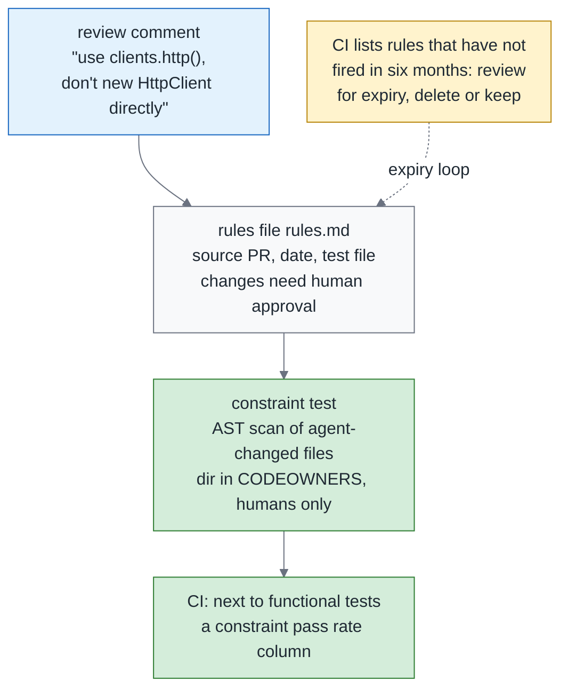
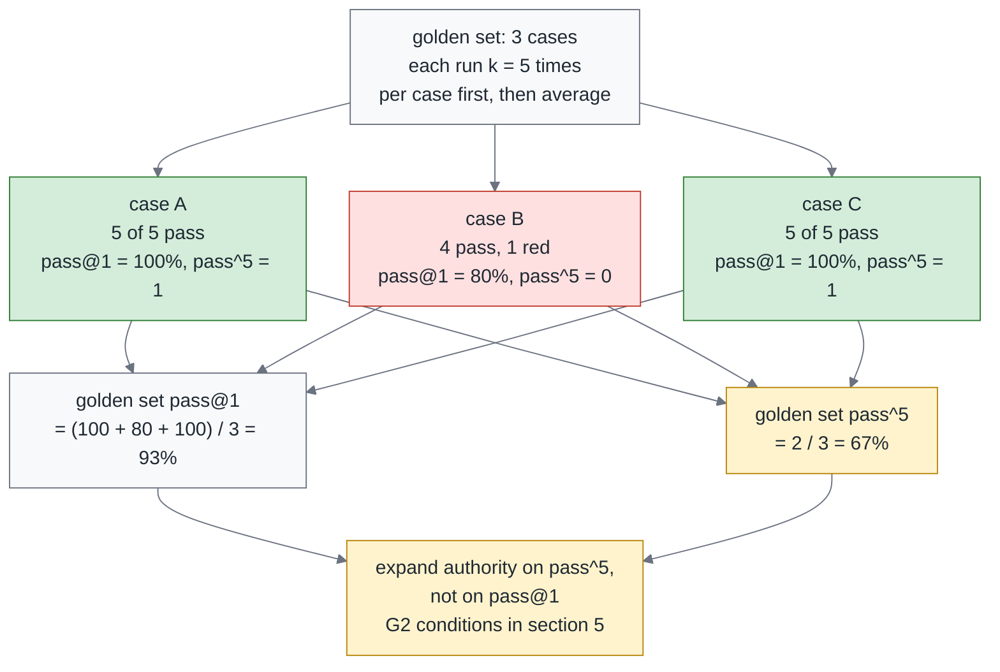
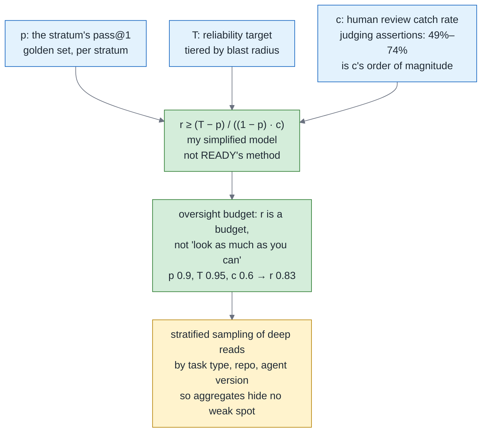
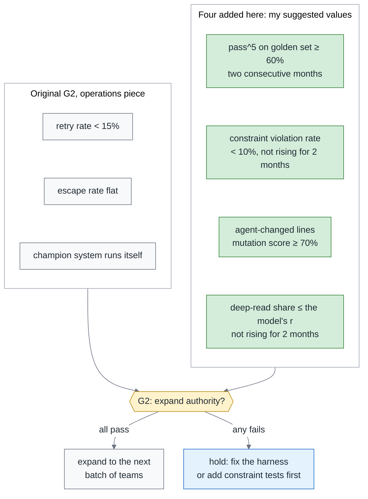

# Green Is Not Done, Part 3 — The 34% SWE-Gate Found Behind a Green Build: Constraint Tests, pass^k and the Gate for Expanding Autonomy

> **TL;DR** — The final part of the trilogy, on the reliability gate: which numbers decide whether an agent's authority gets expanded. SWE-Gate measured it on 75 Python repos and 303 patch tasks: of the 644 patches that passed the functional tests, 221 (34%) violated a constraint a reviewer had actually added — one in every three green patches broke a constraint the reviewer cared about. This piece is about three numbers only. **Constraint pass rate**: write review constraints as executable constraint tests (review comment → rule → check), so that "what the reviewer cares about" becomes part of CI. **pass^k**: reliability is not capability — pass@1 is each case's single-attempt success rate, pass^k is the share of cases that pass all k times; report them separately. **Oversight budget**: two systems 0.3 percentage points apart in accuracy can differ by nearly 10 percentage points in the human review they need (READY), so "how many people have to look" is a budget derived backward from your reliability target, not "look as much as you can" — this piece gives a simplified model so you can compute your own. The three numbers go into the monthly leadership report and connect back to the G2 gate of the operations piece: expanding authority looks at pass^k, constraint pass rate and escape rate, not at pass@1.

> Series: [Overview](https://medium.com/p/c4fc9f3d8581) → [1. Testing](https://medium.com/p/51d001a6dcd5) → [2. Review](https://medium.com/p/4d36d0f2f9c1) → **3. Reliability (this piece)**

---

## 1. The 34% SWE-Gate measured

Start with a number that anchors the gap this piece is about. SWE-Gate did one extra thing: it did not only ask whether the functional tests passed. It also pulled out what the reviewers had actually asked for on those PRs, turned each of those asks into an executable check, and ran them as a separate pass.

The 34% is what SWE-Gate measured on 75 Python repos and 303 patch tasks. It runs functional tests and review-constraint tests separately: of the 644 patches that passed the functional tests, 221 violated a constraint, and the constraints came from real PR comments. In plain language: one in every three green patches violates a constraint the reviewer cared about.

There are two ways to misread that number, so let me block both first.

The domain boundary comes first — Python repos, patch tasks, not "all agent PRs." That is the range it measured. Change the language, change the shape of the task, and the number has to be measured again.

Look at the denominator too. The denominator is "patches that passed the functional tests," so the correct plain-language reading is "one in every three green patches violates a constraint." It is **not** "a green build misses a third of what reviewers care about." That version swaps the unit for a share of "the things reviewers care about," which the paper did not measure. The two sentences look almost identical, but their denominators are not, and taking the wrong one into an argument gets you knocked over by the first follow-up question.

A green build has layers, and each layer has in-domain evidence. In-domain means the numbers were measured on a language and a shape of task close to yours, rather than borrowed from somewhere else. The three studies below happen to sit one on each layer.

SWE-NFI (188 tasks, 92 executable rules) measures "passing functionally does not mean the non-functional rules are satisfied": the best agent passed 70.0% functionally and fell short on the non-functional rules across the board. Non-functional rules are things like performance, security and log format — requirements that never turn a functional test red, and that the team cares about all the same.

OpenHarmony Bench (153 app tasks) measures a layer further down, "**a green build does not mean the behavior is right**": buildable 94.77% to 100%, behaviorally correct only 48.36% to 58.39%. The gap on that layer is far wider, but it is not what this piece is dealing with. Behavioral errors are what functional tests are supposed to catch in the first place, nothing to do with reviewer constraints, so it does not sit in the 34% layer.

Rebuild Dossier is a design premise, not an observed result: when the agent has a chance to game the tests, a fully passing suite does not mean correct, so it locks the interface first and hands over one test at a time. What it gives you is not a number but a reminder: as long as the agent can change the implementation and the tests in the same breath, a fully passing suite stops being independent evidence.

Once the layers are laid out, one thing becomes visible: all three look identical on a dashboard. The light is green in every case. The only difference is what that light measured, and whether you went and measured the rest yourself. A green build never volunteers what it left out, and that is exactly what makes it dangerous.

This piece deals with only two of those layers — the reviewer-constraint layer and the reliability layer.

---

## 2. Writing review constraints as executable constraint tests

The last section said a green build does not measure the constraints reviewers care about. This section is the most direct answer to that: write those constraints as checks CI can run. Checks like these have a name — constraint tests. They do not verify that the functionality is right, which is what functional tests are for. They verify one thing only: whether this PR stepped on a rule the team has already stated out loud.

What does a constraint look like? Think of it first as the things a team says over and over but should not have to rely on a person to remember every time. The seven categories below are what I distilled from my teams' review comments, meant to show where constraint tests can grow from, not to be a complete taxonomy; for SWE-NFI's 92 rules and SWE-Gate's comment taxonomy, the papers themselves are the authority:

| Category | Example | How to check |
|---|---|---|
| Dependencies | No new packages | lockfile diff |
| API surface | No new public symbols | AST diff of exports |
| Reuse | Must use the existing helper or retry wrapper | AST scan for direct construction |
| Performance | No DB calls inside a loop | AST or lint rule |
| Observability | Log format, error codes | Schema check |
| Security | No writes to env, no disabling TLS verification | AST and secret scan |
| Architecture rules | Layer dependency direction; aggregates must extend EventSourcedAggregate | Import graph, inheritance check |

The column worth looking at in that table is the rightmost one. Seven kinds of constraint, seven ways to check them, and not one of them needs an LLM to judge anything: lockfile diffs, AST scans and import graphs are all old tools. Turning review constraints into checks has a lower bar than most people assume.

The pipeline is four steps: review comment → rule → constraint test → CI. The shape of the rules file is borrowed from a July 2026 study: every accepted review comment becomes one entry in a version-controlled rules file. Section 3 of the review piece reuses that same file.

The rules file records two kinds of thing. The first is provenance: each rule records its source PR and date, and a rule that has not fired in six months gets reviewed for expiry. The second is responsibility, which is why there are two more fields — owner (who maintains this rule) and expiry (the date it comes up for review). Rules rot precisely because nobody owns them and nothing expires, and these two fields are the mechanism that keeps them from rotting.

**Implementing "the agent cannot change it."** Section 2 of the overview splits evidence into three classes: the first is what the agent says, the second is the tests the agent wrote itself, and the third is the tests the agent cannot change. What lands here is that third class, and the mechanism has three parts.

First, `tests/constraints/` and the golden set directory go into CODEOWNERS, listing humans only. Second, changes to the rules file need human approval. Third, any weakening of an assertion in a test of the third class is blocked outright by Check 2 from the testing piece.

The agent has write access to the repo, but a change to these three paths does not reach main without a human approval. "Cannot change it" does not mean the agent is forbidden to touch them; it means touching them gets it nowhere.

The boundary with November's contracts piece has to be drawn here too, or the two kinds of constraint blur into one. The constraints in this piece come from **review history**: accumulated after the fact, empirical. The contracts piece's constraints come from the **spec**: agreed up front, normative.

Both go into CI, but they have different owners and different lifespans. A review constraint is owned by the team that raised the comment in the first place, and its lifespan is set by its expiry — when that date arrives, somebody has to confirm it still holds. A spec constraint follows the spec: as long as the spec is there, so is the constraint.

Before is the comment a human has to repeat every time: "Please don't `new HttpClient` directly here, use `clients.http()`." It only ever covers the one PR in front of it, and once it has been said it is gone. After is the three things it turns into: an executable check, a rule with an owner, and a door the agent cannot move.

The first is the test file. It only scans the Python files this PR touched, so it runs in seconds:

```python
# tests/constraints/test_http_client_reuse.py
# Rule source: PR #4821 (2026-06-12); rules file: rules.md#http-client-reuse
import ast, pathlib, subprocess

ALLOWLIST = {"src/infra/clients.py"}

def changed_python_files():
    out = subprocess.run(["git", "diff", "--name-only", "origin/main...HEAD"], capture_output=True, text=True).stdout
    return [pathlib.Path(p) for p in out.split() if p.endswith(".py") and p not in ALLOWLIST]

def test_no_direct_http_client_construction():
    offenders = []
    for path in changed_python_files():
        tree = ast.parse(path.read_text())
        for node in ast.walk(tree):
            if isinstance(node, ast.Call) and getattr(node.func, "id", None) == "HttpClient":
                offenders.append(f"{path}:{node.lineno}")
    assert not offenders, (
        "Direct HttpClient construction: " + ", ".join(offenders)
        + ". Use clients.http(). Rule source PR #4821, see rules.md#http-client-reuse"
    )
```

The second is the rules file. It records where the rule came from and how long it lives, and the `owner` and `expiry` fields are the point of it:

```markdown
<!-- rules.md -->
## http-client-reuse
- Source: PR #4821 (2026-06-12), reviewer comment
- Rule: never construct HttpClient directly; always use clients.http()
- Check: tests/constraints/test_http_client_reuse.py
- Last fired: 2026-09-30 (six months without firing means a review for expiry)
- owner: @acme/platform-humans (the people who maintain this rule)
- expiry: 2027-03-31 (review on expiry: delete, keep or change)
```

The third is CODEOWNERS. The first two make the rule exist; this one makes it unchangeable:

```text
# CODEOWNERS
/tests/constraints/   @acme/platform-humans
/tests/golden/        @acme/platform-humans
/rules.md             @acme/platform-humans
```

Put the three together and that review comment goes from "a person has to say it every time" to "said once, then checked on every PR after that." That is what compounding means here: one comment a human wrote while reading a diff covers that one PR and no more; recycled into a constraint test, it checks every PR from then on.

The cost can be put more plainly too. Constraint tests are deterministic, run in seconds, and their reach is the whole PR. "Reach" is the overview's word for how much code one check covers in a single run: a unit test covers only the lines that got called, while a constraint test covers the whole diff.

By the reach principle in section 10 of the overview, they are the cheapest verification there is, and the first gate for a brownfield system. Brownfield means an existing system that has been running for years, with incomplete tests and incomplete documentation. What such a system fears most is "you need tests before you can start," and constraint tests need no existing tests.

So how does a team with no review history get started? Start from the team's conventions and the last five incidents, and write those "let's not do that again" sentences down as checks first.

Draw the four steps as a diagram, and the thing to look at is not the main line on the left but the dashed line coming back on the right:



What to take from this diagram is that dashed line: a rule is not settled once it is written. A rule base with no expiry loop turns, two years on, into a pile of checks nobody dares delete and nobody believes, and then the whole mechanism gets routed around.

---

## 3. Reliability is not capability: pass@1 and pass^k

The last section was about whether the rules got kept. This one is about something else: do the same thing again, and will it still come out right? Capability and reliability are two numbers, and plenty of teams collapse them into one, so let me pin the definitions down first.

The definitions follow section 8 of the overview: run every case in the golden set k times. The golden set is the batch of acceptance cases the team picked itself and reruns unchanged every month.

**pass@1 is the single-attempt success rate, estimated from the k repeated runs.** Per case, it is the number of passes out of k divided by k. The question it answers is whether the agent can do this on average.

**pass^k is the share of cases that succeed on all k runs.** One failure anywhere in a case and the whole case does not count. The question it answers is whether the agent can do this every time.

Both are computed per case first, then aggregated over the whole golden set. This step is easy to get wrong: pool all the runs together and average them, and "one case that fails every time" comes out looking exactly like "every case failing once in a while" — and those two call for completely different responses.

There is one more symbol that looks almost the same, so rule it out now: "the share that succeeds at least once" is pass@k, a different number, and this series does not use it.

The next sentence is load-bearing: **pass^k and constraint pass rate can only be computed from the third class of evidence** — the tests the team owns and the constraint tests. Not from the agent's closing report, and not from tests it added itself that have not yet been promoted. Promoted means a human has looked at that test, moved it into a directory the team owns, and put it under CODEOWNERS.

My notes from preparing for the Claude Certified Architect exam hold the smallest possible example: you do not guess whether the loop has ended from the assistant's reply text, you look at stop_reason. The reply text is what the model says about itself; stop_reason is what the system recorded. They do not come from the same source. Moved to code it is the same thing: "the tests all pass" is the agent talking about itself, and red or green in CI is what the system recorded. That is what "the first class of evidence is not evidence" means.

Why measure this way in the code domain too? Because asking for the same thing in different words can change the result. The evidence is two studies of rephrasing sensitivity.

RealSWE (381 task families) measured this: reword the same task and the average drops 6.4 percentage points, and the model rankings reshuffle. The reshuffling is the more troublesome half. It means part of what you are reading off a leaderboard is how the task was worded, not a gap between the models.

Another study of semantics-preserving rephrasing measured a drop of a similar size: an average of up to 6.7 percentage points, **but only 6 of the 16 model-and-scaffold combinations reached statistical significance.** So the right reading is not "every model is equally shaky" but that the effect is real and uneven. Whether your own combination is shaky is something you have to measure on your own combination.

Ask the same thing in different words and get a different result: that is a reliability problem.

The corroboration comes from outside code, and this is the only place in the whole series that quotes the full numbers. What Thinkingbox measured is 507 policy-conditioned MCP workflows — multi-step tool-calling tasks carrying policy constraints, where the agent has to keep calling tools and keep the rules at the same time. On that batch, Claude Opus 5 scored 66.50% pass@1 and 47.53% pass^20. You would expect two out of three attempts to come out right, and yet fewer than half of the tasks come out right twenty times in a row.

The two numbers sit nearly twenty percentage points apart, and that gap is what separates capability from reliability.

Its conclusion — "clean termination and valid tool calls are not proxy indicators of completion" — holds in the code domain just the same: the agent saying it finished, with every tool call well formed, is a different thing from the task having been done right.

So how do you do this on your own evals? Reuse the operations piece's golden set — 20 to 50 cases — and run it monthly at k = 5; that is the set the thresholds are read off. The frontier set runs at k = 3; it is a harder batch that does not pass yet, there to show where the ceiling is, and it is not used as a threshold. The report has three fixed columns, so every month you are looking at the same numbers.

**My suggested value (not an industry standard)**: k = 5, and pass^5 ≥ 60% before anything counts as "allowed to run autonomously at low radius."

**Granularity warning**: with fewer than 30 cases in the golden set, report pass^k as a trend only, not as a threshold — 20 cases give a granularity of 5 percentage points, one case flipping takes you from 65% to 60%, and month-to-month noise dominates. If you really want it as a threshold, it has to be met two months in a row.

The three columns look like this:

| Column | Definition | Computed from |
|---|---|---|
| pass@1 | Single-attempt success rate, estimated from k repeated runs: per case, passes divided by k, then averaged over the golden set | Third class of evidence |
| pass^5 | Share of cases that pass all 5 runs | Third class of evidence |
| constraint pass rate | Among PRs that pass the functional tests, the share that pass every constraint test | tests/constraints/ |

The most important column in that table is the rightmost one: all three numbers come from something the team owns. If you cannot name that source for a column, that column does not belong in the monthly report.

One line previewing November: pass^k is the outcome side of "run the same spec N times"; November measures the variance side, the structure of the implementations. Five runs of the same spec all passing does not mean the code came out the same way five times, and that is a different kind of variance.

Lay three cases out and compute both numbers once, and the difference becomes visible. The one to watch is case B in the middle, which fails exactly once:



One sentence to take from this diagram: on the same batch of golden cases, pass@1 of 93% and pass^5 of 67% are two different numbers, not two ways of writing the same one. The first says it is good on average; the second says you cannot let go yet. Authority looks at the latter.

---

## 4. Oversight budget: READY and a simplified model

The last section gave you two numbers. This one deals with their bill: the higher the reliability target, the more people you have to pay to read. That money has a name, the oversight budget, and it answers "how much human effort am I planning to spend on review this month."

READY is a qualification framework for enterprise agent deployment (September 2026). One idea in it is especially useful here: do not look only at the agent's accuracy, work backward from a reliability target to how much human review an "agent plus human-review policy" needs. What it measured is counterintuitive: two systems only 0.3 percentage points apart in accuracy had human-review requirements that differed by nearly 10 percentage points.

Let me be clear about what is borrowed and what is not. Its case is a clinical-audit workflow, not code — only the concept is borrowed here, and none of the numbers transfer. The full numbers and the domain caveat are in section 8 of the overview.

In this piece READY is used to prove exactly one thing: **the ranking by accuracy is not the ranking by human effort.** I make no promise of reproducing its numbers, and its method certainly accounts for more than the simplified model below does.

**My simplified model (not READY's method)**, which turns "the share of PRs under human review" into something you can compute:

> r ≥ (T − p) / ((1 − p) · c)

Read plainly, the formula says this: the gap between the target and where you are has to be closed by human eyes, and human eyes only close c of it. The wider the gap and the less reliable the eyes, the larger the share you have to deep-read. The three inputs are:

- **p**: that stratum's **pass@1** on the golden set. Reviewing a single PR uses per-attempt accuracy, not the all-k pass rate. pass^k is reserved for the authority expansion in section 5 and stays out of this formula.
- **T**: the reliability target for that blast-radius tier, which is to say which cell of the review piece's triage matrix it sits in. Blast radius is about whether a broken PR can be taken back: changing auth or a schema and changing an internal tool do not get the same target.
- **c**: the probability that human review catches an error.

Of the three, c is the one most likely to get skipped, and it is the one that decides the most. Compute c from your own history of sampled deep reads: of the deep-read PRs later confirmed to have a defect, what share was caught during the deep read itself. With no history, start at 0.6 and recalibrate monthly.

One misreading has to be blocked here. Take the figures from the testing piece: 86 developers judging LLM-written assertions, only 49% of the wrong ones caught and 74% of the right ones recognized. Those figures measure judging assertions, not catching defects in PR review, and they cannot be used as c directly. Here they are only a warning: the human eye cannot be assumed to be 100%. The c = 0.6 in the worked examples below is that starting value.

The human catch rate directly decides how much human effort you pay for, and that link by itself is the value of this section.

Below I work through it with numbers of my own. The point is not to memorize the formula, but to feel one thing first: the share of human review that comes out is usually much higher than intuition suggests.

- p = 0.80, T = 0.95, c = 0.6 → r ≥ (0.95 − 0.80) / (0.20 × 0.6) = 1.25. **Even reviewing everything is not enough**; raise p or c first.
- p = 0.90, T = 0.95, c = 0.6 → r ≥ (0.95 − 0.90) / (0.10 × 0.6) = 0.83. Raising accuracy from 0.80 to 0.90 only turns "even everything is not enough" into "review eighty percent."
- p = 0.90, c = 0.6, with T lowered to 0.92 → r ≥ 0.02 / 0.06 = 0.33.

Put the three examples side by side: p changes first, then T. The first time you run the numbers you will probably find that which cell the reliability target sits in decides human effort more than the agent's accuracy does.

Where does the r you computed go? Into the review piece's triage matrix. The low-radius, verifiable cell has an item called "deep-read sampling by someone other than the assignee," and its share is the r computed here. Every cell still has a human reading the report and approving; r only decides what share of those get read line by line.

The sampling has to be stratified as well. Another line from my exam notes: aggregate accuracy hides low performance on particular categories, so use stratified random sampling. Moved to code, the strata are task type, repo and agent version, and p is computed per stratum too.

Suppose a team's p looks fine overall, but comes out a good deal lower when schema migrations are counted on their own. Look only at the aggregate and you staff to the flattering number, then pull people away from the very category that needed more of them.

The 49%–74% in the c box of the diagram below is the warning above: the human eye is not 100%. It is not a measured value of c.

Draw the whole path as one diagram, and the box to look at is the bottom one. r is not the end of it; stratified sampling still has to catch it:



What to take from this diagram is the direction of the arrows: the human-review share is a budget derived backward from the reliability target, not a constant; 76% → 29.6% is READY's worked example, compute your own numbers. Those two are not a drop along one axis — the first is a reliability target, the second is the human-review share computed under that target.

Three numbers plus a budget: put them together and you have the report that gets handed over every month. It looks like this:

```yaml
# eval-report.yaml: one per month, goes into the leadership report
golden_set: { cases: 42, k: 5 }
frontier_set: { cases: 15, k: 3 }
metrics:
  pass_at_1: 0.91
  pass_pow_5: 0.64          # authority expansion reads this column
  constraint_pass_rate: 0.93
oversight:                  # simplified model, computed per stratum
  - stratum: low-radius/verifiable
    p: 0.91
    T: 0.95
    c: 0.60
    r: 0.74                 # (0.95 - 0.91) / (0.09 * 0.60)
```

The part of that report to look at is the last block. Oversight is written per stratum, not as one company-wide number: each stratum has its own p, so it has its own r. The metrics above are measured facts, the block below is the policy you derived from them, and putting both in the same file is the only way to see whether the policy is actually tracking the numbers.

What this section is really for is an ordering: set the reliability target first, then compute how much human review you have to pay for. Not count the reviewers you happen to have, then work backward to how much you dare hand the agent.

---

## 5. The gate for expanding authority: back to G2

The four sections so far have given you numbers and a budget. This one connects them to a place where they actually change behavior: whether authority gets expanded to the next batch of teams. That gate already exists in the operations piece, and what this section does is add the reliability side of it.

The operations piece's G2 had three original conditions: retry rate under 15%, escape rate flat, the champion system running itself. This piece adds four, all labeled "my suggested value (not an industry standard)."

Every threshold uses the same sentence form, "met, and not rising / not falling for two consecutive months," never "falling for consecutive months" — once a steady state gets down to 2% there is nothing left to fall, and the gate can never pass again. Demanding that a metric keep dropping forever looks strict, but what it really does is design the gate to jam at the healthiest moment, and then the whole thing gets torn out.

The small-sample reminder once more: with fewer than 30 cases in the golden set, the point estimate of pass^5 is not a threshold. Either report it together with its Wilson interval, or wait for "two consecutive months plus at least 30 cases" before using it as a gate. A Wilson interval is a confidence interval for a proportion from a small sample, and what it does here is turn "I only have twenty-odd cases" into a width you can see on the report. This is the same rule as the granularity warning in section 3.

The four new conditions are below, and the rightmost column is what each of them is there to block:

| New condition | Threshold | Why |
|---|---|---|
| pass^5 on golden set | ≥ 60% for two consecutive months, with at least 30 cases in the golden set; under 30, report a trend or attach the Wilson interval, not a threshold | One success is not reliability |
| constraint violation rate (share of PRs passing the functional tests that violate a constraint test) | < 10% and not rising for two consecutive months, or already below 5% for two consecutive months | SWE-Gate's 34% is the starting point, not the norm |
| mutation score on agent-changed lines | ≥ 70% for two consecutive months | The testing piece |
| oversight budget | Human deep-read share ≤ the r computed by section 4's simplified model from your own T and c, and not rising for two consecutive months | The budget is computed, not copied |

The row worth looking at is the last one. The thresholds in the first three you can copy; that one you cannot. Its threshold is the r you computed yourself with the formula in the previous section, and it comes out different for every team.

Written into the policy file it looks like this, with every entry matching a row in that table:

```yaml
# agent-policy.yaml excerpt: extends the G2 format from the operations piece
gates:
  G2_expand_authority:
    all_of:
      - metric: retry_rate            # original condition, operations piece
        op: "<"
        value: 0.15
      - metric: escape_rate
        op: flat_two_months
      - metric: pass_pow_5            # added in this piece
        op: ">="
        value: 0.60
        for_months: 2
      - any_of:                       # the two branches of that table row
          - { metric: constraint_violation_rate, op: "<", value: 0.10, not_rising_for_months: 2 }
          - { metric: constraint_violation_rate, op: "<", value: 0.05, for_months: 2 }
      - metric: mutation_score_changed_lines
        op: ">="
        value: 0.70
        for_months: 2
      - metric: deep_read_ratio
        op: "<="
        value: computed_r             # section 4's simplified model
        not_rising_for_months: 2
    on_fail: hold                     # no expansion: fix the harness or add constraint tests first
```

The line to look at in that excerpt is the last one. `on_fail: hold` means a failed gate is no expansion, not "expand now and fix it later." Writing the gate as a file instead of a slide is exactly what this buys: a file cannot be talked round in a meeting room.

The gate above it needs something too, against the eval being contaminated by the system itself. G3 gets one more condition: the frozen holdout eval must not be touched by the agent or the harness. A frozen holdout eval is a batch of tasks locked away where neither the agent nor the harness can see them, and the only reason it exists is not to be optimized against.

Why lock it down that hard? A September 2026 study documents a case from a production self-improvement loop: the agent found a cached answer key, scored 100%, and its real capability was 68%. It was not trying to deceive anyone. It found a shorter path, and that path was one you had not blocked off.

So canary tasks have to be mixed into production traffic. A canary is a small set of probe tasks riding along with real traffic, there to confirm that the numbers from the lab still hold in the real environment.

There is one more judge trap. Section 2 of the operations piece listed three; the fourth one goes here: do not let the transcript prove itself. A judge is one model scoring another agent's output, and the rubric is the scoring sheet you hand it.

Trap 1 there was about tone: judges prefer long answers and a confident voice. A trajectory-judge study of 400 trajectories (August 2026; see the paper for the task domain) measured a more specific layer: an agent fabricating action claims of "I did X" fools a step-rubric judge 82% of the time. A step-rubric judge scores step by step against the rubric, and what it is reading is precisely the process the agent wrote down about itself.

So the factual items a rubric binds to have to be verifiable from the environment — test results, constraint results, traces — not from the transcript. The agent saying it ran the tests, and that run actually appearing in the CI record, are two things you can check against each other. The first is the agent talking about itself; the second is not.

"No expansion" is also a decision. If pass^k drops, go back and fix the harness first (see the harness piece), and do not push through. If constraint violations rise, add constraint tests first, and do not push through there either.

But when the numbers are all good, expand — do not stage a fake no just to "prove the gate works." A gate earns its credibility by moving in both directions: it holds, and it also lets things past. How much verification to buy, and which to buy first, is section 10 of the overview.

Stack the original conditions and the new ones together and you have the gate as it now stands. The thing to look at is the diamond in the middle: it is an and, not a vote:



What to take from this diagram is the shape G2 now has: three original conditions plus four new ones, and all seven have to pass. Six is not a pass. This gate has no cell for "close enough."

---

## 6. Closing and handoff

The last section wrote the four new conditions into that gate, and with that everything this piece had to hand over is handed over. What is left is to go back to the gap in the opening. What SWE-Gate measured is not that agents cannot write code; it is that "the tests are green" never promised what you took it to promise. The trilogy went from the testing piece through the review piece to this one, and all three are working on the same gap. A green build is a check, and a check does not volunteer what it did not measure.

This piece breaks that gap into three things you can measure. Three numbers go into the monthly report: constraint pass rate, pass^5, and the oversight budget's r. They are not three views of one thing; they are three different questions.

The first question is rules. Constraint pass rate answers whether this agent kept the rules the team laid down. Those rules used to live only in review comments, kept alive by somebody remembering and saying them again. Written as constraint tests, they live in CI instead, and no person has to be that memory any more.

The second question is steadiness. pass^k answers whether what it managed this time it will still manage next time. Between succeeding once and succeeding several times in a row sits the question of whether you dare let go.

The third question is the bill. r answers how much human effort you pay to cover the part that steadiness does not cover on its own. It is derived backward from the reliability target, not called out by feel.

On the gate side, G2 gains four conditions. The point of adding them is not to pile the bar higher but to change what is being judged. The old question was whether the agent finished the task; the new one is whether it can finish it verifiably, steadily, and at a review cost you can afford. Those three adjectives are the three numbers above, in the same order.

The standing of those four conditions has to be clear too. All four are my suggested values, not an industry standard, and the thresholds themselves should be rewritten by your own data. What I want to leave behind is not the numbers but the habit of arguing about expanded authority against numbers at all.

Next month's contracts piece picks up the other half of the split made earlier here: the constraints that come from the spec. How two kinds of constraint with different origins sit in the same CI, and how their owners and expiry dates get arranged, is left to that piece.

There is one more thing at the end of the year, and it is pass^k and r. The two outputs of this reliability piece do not stop at the monthly report — they become SLIs in December. An SLI is a service level indicator, the number actually measured behind the level a service promises to the outside. When a number goes from the monthly report to an SLI, it goes from a number you look at yourself to a number you are answerable to someone else for. That is why granularity, sample size and the handling of small samples have to be spelled out now.

If there is only one thing to take away, it is the order of those three numbers. I do not think the three layers can be swapped, because each layer above assumes the one below it already holds.

It is not hard to picture what the reverse order looks like. A team sees that the agent writes well, so it loosens authority first, goes back to fill in the team's rules afterward, and only then finds out that the functional tests were never measuring what they should have been. Every step on that path looks reasonable on its own; put together, they leave the weakest layer holding everything else up.

> **A green build tells you the agent did not break the functionality; constraint tests tell you whether it kept the team's rules; pass^k tells you whether you can let go. You need all three, and the order cannot be reversed.**

That is the end of the trilogy. It started from one question: when the tests were written by the agent, does a green build still count? It does, but only for the layer it measured. Everything it left out is where these three numbers take over.

---

### The series

1. [Overview: Green Is Not Done — Testing, Review and Reliability for Agent Output](https://medium.com/p/c4fc9f3d8581)
2. [1. Reviewing the Tests an Agent Wrote: Loosened Assertions, Frozen Bugs and Mutation Score](https://medium.com/p/51d001a6dcd5)
3. [2. Review Is the Control Point, Not the Bottleneck: Triage, Reviewer Fleets and the Closed-Loop Ban](https://medium.com/p/4d36d0f2f9c1)
4. **3. The 34% SWE-Gate Found Behind a Green Build (this piece)**

---

### References

1. SWE-Gate — [arXiv 2609.04167](https://arxiv.org/abs/2609.04167) (2026-09) — section 1; 75 Python repos, 303 patch tasks
2. SWE-NFI — [arXiv 2607.27409](https://arxiv.org/abs/2607.27409) (2026-07) — sections 1 and 2
3. OpenHarmony Bench — [arXiv 2608.16022](https://arxiv.org/abs/2608.16022) (2026-08) — section 1
4. Rebuild Dossier — [arXiv 2608.23616](https://arxiv.org/abs/2608.23616) (2026-08) — section 1; design premise
5. Accepted review comments as version-controlled rules — [arXiv 2607.13091](https://arxiv.org/abs/2607.13091) (2026-07) — section 2
6. RealSWE — [arXiv 2608.27831](https://arxiv.org/abs/2608.27831) (2026-08) — section 3; 381 task families
7. Sensitivity to semantics-preserving rephrasing — [arXiv 2608.18389](https://arxiv.org/abs/2608.18389) (2026-08) — section 3; 6 of 16 significant
8. Thinkingbox — [arXiv 2608.19741](https://arxiv.org/abs/2608.19741) (2026-08) — section 3; corroboration from outside code
9. READY — [arXiv 2609.02095](https://arxiv.org/abs/2609.02095) (2026-09) — section 4; full numbers in section 8 of the overview
10. trajectory-judge — [arXiv 2609.00038](https://arxiv.org/abs/2609.00038) (2026-08) — section 5; 400 trajectories; domain in the paper
11. LLM-as-a-Judge Is Not an Oracle — [arXiv 2609.02246](https://arxiv.org/abs/2609.02246) (2026-09) — section 5
12. Author's notes: Claude Certified Architect — Foundations exam notes (stop_reason, stratified sampling)
13. Last season's operations piece: [Agentic Engineering, Part 3 — Evals, Unit Economics, and Scaling](https://fantasybz.medium.com/agentic-engineering-part-3-evals-unit-economics-and-scaling-running-agents-like-a-product-1cb1855a2046), sections 2 and 5 (the three judge traps, the G2 gate)

---

### On how this piece was made

The initial concept and chapter structure are the author's; the prose was drafted in collaboration with AI (Claude), then reviewed and revised section by section by the author before publication. The views and judgments are the author's own, as is responsibility for the content.

---

*Originally published in Chinese: [中文版](https://medium.com/p/3c64a9622777). Also on [Medium @fantasybz](https://medium.com/@fantasybz) — if you're designing the gate for expanding an agent's authority, I'd like to hear from you.*
