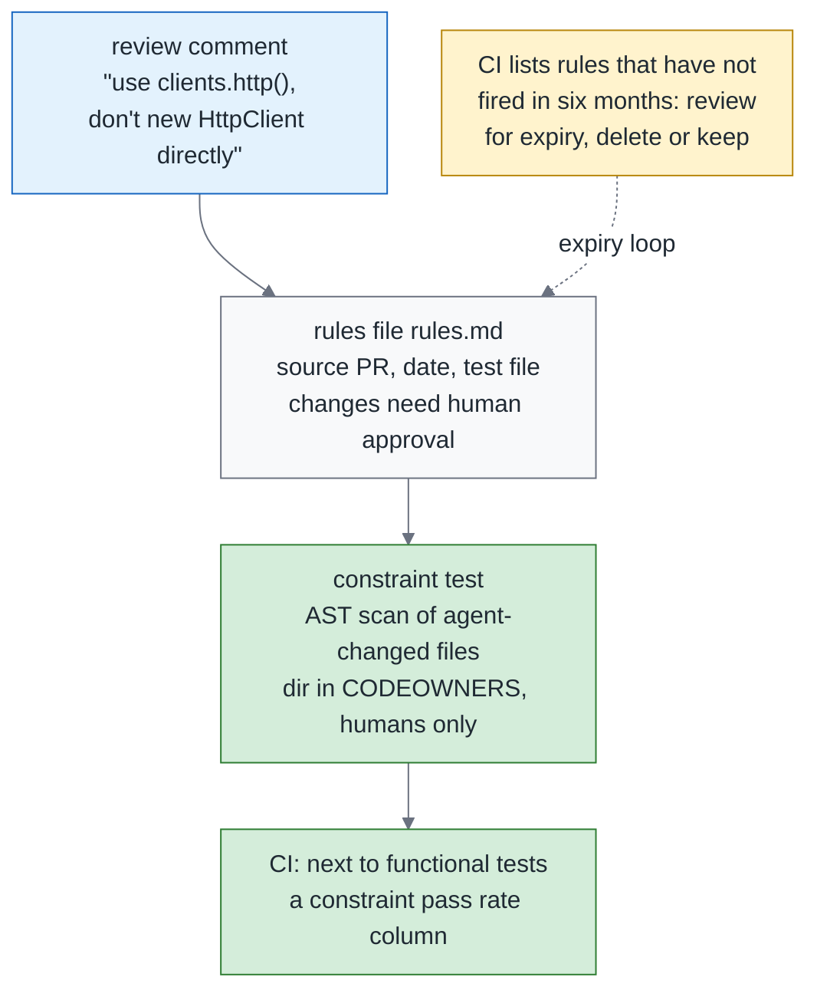
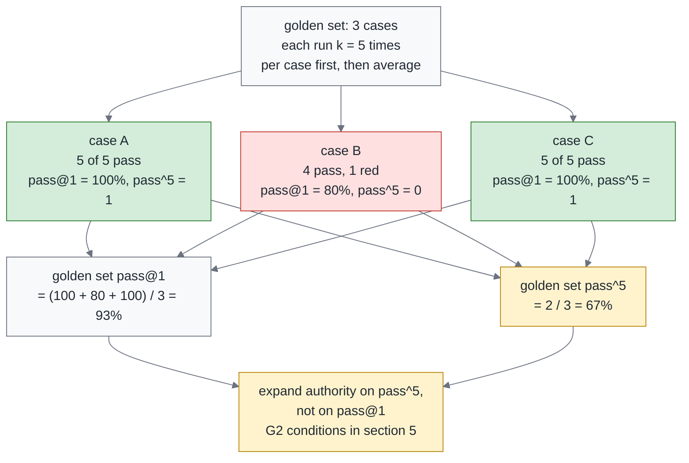
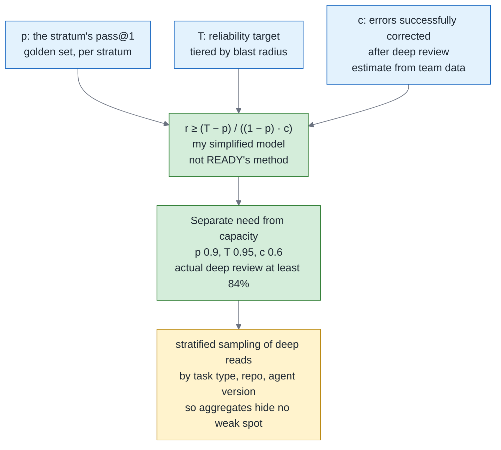
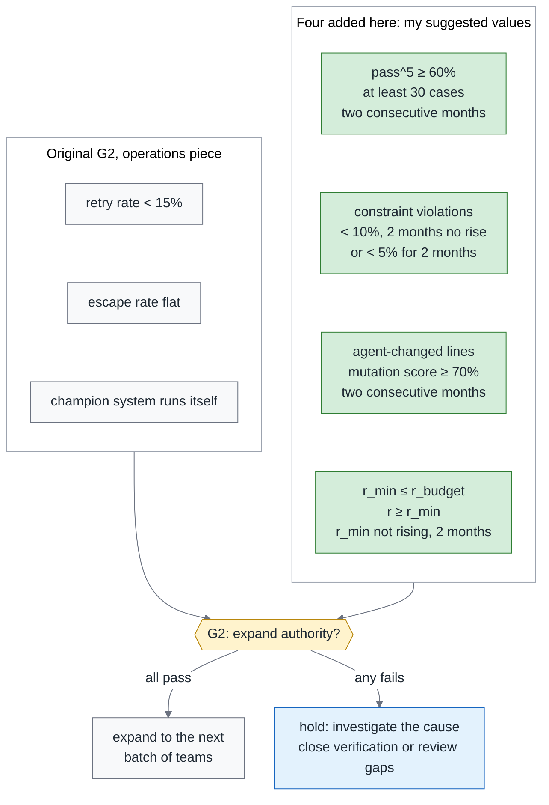

# Green Is Not Done, Part 3 — The 34% SWE-Gate Found Behind a Green Build: Constraint Tests, pass^k and the Gate for Expanding Autonomy

> **TL;DR** — The final part of the trilogy asks what evidence should guide expanded agent authority. Across 75 Python repos and 303 patch tasks, SWE-Gate found that 221 of 644 patches passing functional tests (34%) violated a constraint a reviewer had actually added. That gap leads to three metrics. **Constraint pass rate** is the share of functionally passing PRs that also pass all constraint tests. **pass^k** is the share of cases in a task set that pass all k runs, reported separately from single-attempt success rate, pass@1. **Oversight budget** addresses the human work still needed: in READY's clinical-audit case, systems only 0.3 percentage points apart in accuracy differed by nearly 10 percentage points in review requirements. Those staffing figures cannot transfer directly to code review. This piece borrows the idea of working backward from a reliability target, using a simplified model to estimate a review minimum and compare it with actual review and sustainable capacity. These results join test effectiveness and existing operating conditions in the monthly leadership report and the G2 authority decision. pass@1 alone does not decide expansion.

> Series: [Overview](https://medium.com/p/c4fc9f3d8581) → [1. Testing](https://medium.com/p/51d001a6dcd5) → [2. Review](https://medium.com/p/4d36d0f2f9c1) → **3. Reliability (this piece)**

---

## 1. The 34% SWE-Gate measured

The overview separated the problems a green build does not cover into three layers. This piece starts with one of them: passing functional tests does not mean meeting the team's constraints. When requirements a reviewer has already raised are absent from the functional tests, a green build cannot answer those questions. The numbers cited in the overview make that gap concrete. SWE-Gate is a benchmark paper, and what it measures is exactly what a green build covers. It did one extra thing: it did not only ask whether the functional tests passed. It also pulled out what the reviewers had actually asked for on those PRs, turned each of those asks into an executable check, and ran them as a separate pass.

The 34% is what SWE-Gate (September 2026) measured on 75 Python repos and 303 patch tasks. Of the 644 patches that passed the functional tests, 221 violated one of those constraints. In plain language: one in every three green patches violates a constraint the reviewer cared about.

Two points need clarifying before using these numbers, so the study's conclusion is not misread.

The domain boundary comes first — Python repos, patch tasks, not "all agent PRs." That is the range it measured. Change the language, change the shape of the task, and the number has to be measured again.

Look at the denominator too. The denominator is "patches that passed the functional tests," so the correct plain-language reading is "one in every three green patches violates a constraint." It is **not** "a green build misses a third of what reviewers care about." That version swaps the unit for a share of "the things reviewers care about," which the paper did not measure. The two sentences look almost identical, but their denominators are not, and taking the wrong one into an argument gets you knocked over by the first follow-up question.

A green build has layers, and each layer has evidence from the same domain: measured on a language and a shape of task close to yours, not numbers borrowed from somewhere else. Of the three studies below, the first two sit one on each layer, and the third gives the premise all those layers share.

SWE-NFI, with 188 tasks and 92 executable rules, measures the gap between functional success and non-functional compliance. The best agent reached a 70.0% functional pass rate, while performance on non-functional rules generally lagged. These rules include performance, security and log-format requirements. If functional tests do not include those conditions, passing them does not answer those questions.

OpenHarmony Bench (153 app tasks) measures a layer further down, "**a green build does not mean the behavior is right**": buildable 94.77% to 100%, behaviorally correct only 48.36% to 58.39%. The gap is far wider, but behavioral errors are what functional tests are supposed to catch in the first place, so it does not sit in the 34% layer.

Rebuild Dossier is a design premise, not an observed result. It is a paper proposing the process an agent should follow when it rebuilds an entire app: when the agent has a chance to game the tests, a fully passing suite does not mean correct, so it locks the interface first and hands over one test at a time. What it gives you is not a number but a reminder: as long as the agent can change the implementation and the tests in the same breath, a fully passing suite stops being independent evidence.

Once the layers are laid out, one thing becomes visible: all three look identical on a dashboard. The light is green in every case. The only difference is what that light measured, and whether you went and measured the rest yourself. A green build never volunteers what it left out, and that is exactly what makes it dangerous.

This piece deals with only two of those layers. One is the reviewer constraints, which is what the opening number measured. The other is reliability, which is whether the same thing done again still comes out right. None of the three studies above measured that layer; the reliability section explains how to measure it on your own system, using only the kind of independent evidence Rebuild Dossier warned about. Below, the constraints get written as checks first, then capability and reliability get measured separately, then the bill for review gets computed, and finally it all connects back to the gate.

---

## 2. Writing review constraints as executable constraint tests

The last section said one in every three green patches violates a constraint the reviewer cared about. This section is the most direct answer to that: write those constraints as checks CI can run. Checks like these have a name — constraint tests. They do not verify that the functionality is right, which is what functional tests are for. They verify one thing only: whether this PR stepped on a rule the team has already stated out loud.

What does a constraint look like? Think of it first as the things a team says over and over but should not have to rely on a person to remember every time. The seven categories below illustrate how review requirements can become constraint tests; they are not a complete taxonomy; for SWE-NFI's 92 rules and SWE-Gate's comment taxonomy, the papers themselves are the authority:

| Category | Example | How to check |
|---|---|---|
| Dependencies | No new packages | lockfile diff |
| API surface | No new public symbols | AST diff of exports |
| Reuse | Must use the existing helper or retry wrapper | AST scan for direct construction |
| Performance | No DB calls inside a loop | AST or lint rule |
| Observability | Log format, error codes | Schema check |
| Security | No writes to env, no disabling TLS verification | AST and secret scan |
| Architecture rules | Layer dependency direction; aggregates must extend EventSourcedAggregate | Import graph, inheritance check |

The rightmost column shows that lockfile diffs, AST analysis and import graphs let us start with existing tools. Each example still needs a defined scope. A static rule for "no database calls inside loops" may recognize certain patterns without covering every indirect call. Establishing what a check can see tells us which remaining questions need another owner.

The process has four steps: review comment → rule → constraint test → CI. The rule-file approach comes from a July 2026 study that preserved accepted comments in version control for later work, also discussed in section 3 of the review piece. Before implementing a constraint test, establish whether a comment is a general rule or a one-off exception and whether it can become a stable check. Acceptance once does not settle its scope forever.

The rules file records two kinds of thing. The first is provenance: each rule records its source PR and date, and a rule that has not fired in six months gets reviewed for expiry. The second is responsibility, which is why there are two more fields — owner (who maintains this rule) and expiry (the date it comes up for review). Even a rule that was once useful can grow outdated without someone to maintain it and a time to revisit it. These two fields tell the team who should return to check when that time comes.

Now that the rules have an owner, the next question is whether the agent can change them. Section 2 of the overview splits evidence into three classes: the first is what the agent says, the second is the tests the agent wrote itself, and the third is the tests the agent cannot change. What lands here is that third class, and the mechanism has three parts.

CODEOWNERS assigns review responsibility but needs merge rules to enforce it. First, assign only human owners to `tests/constraints/` and the golden set, and enable Require review from Code Owners. Second, require human approval for changes to the rule file, CODEOWNERS and verification workflow, with no agent bypass. Third, use Check 2 from the testing piece to block any weakening of category （c） assertions.

The agent can propose changes on a branch but cannot approve and merge them itself. When evaluating a PR, obtain constraints and verification code from a protected version and use them against the candidate code. A PR must not rewrite its checker and then cite that checker's green result as proof of compliance. That is the independence "cannot change unilaterally" needs to preserve.

Walk an illustrative comment through those four steps. The PR number, dates and accounts below are examples too. Before, it is the comment a human has to repeat every time: "Please don't `new HttpClient` directly here, use `clients.http()`." It only ever covers the one PR in front of it, and once it has been said it is gone. After, the comment becomes three arrangements: CI runs a check, a maintainer owns the rule, and permissions restrict who can approve changes.

First is the test file. This minimal illustration checks direct `HttpClient(...)` calls in changed Python files. It does not cover aliases, attribute calls or dynamic construction. A production implementation must also handle deleted files, git-command failures and the diff baseline. The excerpt is not a complete security boundary:

```python
# tests/constraints/test_http_client_reuse.py
# Rule source: PR #4821 (2026-06-12); rules file: rules.md#http-client-reuse
import ast, pathlib, subprocess

ALLOWLIST = {"src/infra/clients.py"}

def changed_python_files():
    out = subprocess.run(["git", "diff", "--name-only", "origin/main...HEAD"], capture_output=True, text=True).stdout
    return [pathlib.Path(p) for p in out.split() if p.endswith(".py") and p not in ALLOWLIST]

def test_no_direct_http_client_construction():
    offenders = []
    for path in changed_python_files():
        tree = ast.parse(path.read_text())
        for node in ast.walk(tree):
            if isinstance(node, ast.Call) and getattr(node.func, "id", None) == "HttpClient":
                offenders.append(f"{path}:{node.lineno}")
    assert not offenders, (
        "Direct HttpClient construction: " + ", ".join(offenders)
        + ". Use clients.http(). Rule source PR #4821, see rules.md#http-client-reuse"
    )
```

The second is the rules file. It records where the rule came from and how long it lives, and the `owner` and `expiry` fields are the point of it:

```markdown
<!-- rules.md -->
## http-client-reuse
- Source: PR #4821 (2026-06-12), reviewer comment
- Rule: never construct HttpClient directly; always use clients.http()
- Check: tests/constraints/test_http_client_reuse.py
- Last fired: 2026-09-30 (six months without firing means a review for expiry)
- owner: @acme/platform-humans (the people who maintain this rule)
- expiry: 2027-03-31 (review on expiry: delete, keep or change)
```

Third is a CODEOWNERS excerpt. It assigns reviewers for these directories and the rule file. Merge restrictions still require the rules described above, plus protection for CODEOWNERS and the verification workflow themselves:

```text
# CODEOWNERS
/tests/constraints/   @acme/platform-humans
/tests/golden/        @acme/platform-humans
/rules.md             @acme/platform-humans
```

Put the three together and that review comment goes from "a person has to say it every time" to "said once, then checked on every PR after that." That is what compounding means here: one comment a human wrote while reading a diff covers that one PR and no more; recycled into a constraint test, the experience from that review can help check every PR that follows.

That compounding still has a cost, depending on how the constraint is checked. An AST rule like the example can analyze selected files without running the whole product test suite. Performance or behavioral constraints may need a separate environment and tests. Reach also depends on the checker: reading the whole diff does not mean verifying every requirement in it.

That is why I put constraints expressible as static checks early in brownfield adoption. A brownfield system has operated for years and may have incomplete tests and documentation. These rules offer a starting point: check a few explicit team requirements even before a complete test suite exists.

So how does a team with no review history get started? Start from the team's conventions and the last five incidents, and write those "let's not do that again" sentences down as checks first.

Draw the four steps, comment → rule → test → CI, as a diagram, and the thing to look at is not the main line on the left but the dashed line coming back on the right:



What to take from this diagram is that dashed line: a rule is not settled once it is written. A rule base with no mechanism for reviewing rules when they expire turns, two years on, into a pile of checks nobody dares delete and nobody believes, and then the whole mechanism gets routed around.

Before this section closes, the boundary with November's contracts piece has to be drawn, or the two kinds of constraint blur into one. The constraints in this piece come from **review history**: accumulated after the fact, empirical. The contracts piece's constraints come from the **spec**: agreed up front, normative.

Both go into CI, but they have different owners and different lifespans. A review constraint is owned by the team that raised the comment in the first place, and its lifespan is set by its expiry — when that date arrives, somebody has to confirm it still holds. A spec constraint follows the spec: as long as the spec is there, so is the constraint.

---

## 3. Reliability is not capability: pass@1 and pass^k

The last section was about whether the rules got kept. This one is about something else: do the same thing again, and will it still come out right? Capability and reliability are two numbers, and plenty of teams collapse them into one, so let me pin the definitions down first.

Use the definitions from section 8 of the overview: run each golden-set case k times. These are representative acceptance cases chosen by the team. Start each attempt independently from the same initial state, fixing the model, harness version and scoring rules. Record the case-set version for comparisons across months so changes remain interpretable.

**pass@1 is the single-attempt success rate, estimated from the k repeated runs.** Per case, it is the number of passes out of k divided by k. The question it answers is whether the agent can do this on average.

**pass^k is the share of cases that succeed in all k attempts.** Any failed attempt excludes that case from the all-pass count. It describes consistency over these cases and these k runs, not a guarantee that the next run will succeed.

Keep each case's results before computing aggregate metrics. With equal attempts per case, averaging per-case pass@1 gives the same value as pooling all runs. But pass^k needs to know which successes and failures belong to the same case. A total success count cannot distinguish a few cases that always fail from occasional failures spread across cases, and those patterns call for different interventions.

There is one more symbol that looks almost the same, so rule it out now: "the share that succeeds at least once" is pass@k, a different number, and this series does not use it.

The monthly report also includes constraint pass rate: among PRs passing functional tests, the share passing all constraint tests. Both metrics have the same premise: **pass^k and constraint pass rate must be computed from category （c） evidence**, maintained by the team and not rewriteable for acceptance by the agent under evaluation. An agent's completion report does not qualify. Its new tests must pass the test gate, receive human approval into main, and enter the protected verification process to complete the promotion described in the overview.

My notes from preparing for Anthropic's Claude Certified Architect certification exam contain a small example: you do not guess whether the agent's turn has ended from the assistant's reply text, you look at stop_reason (the "why it stopped" field in the API response, filled in by the system). The reply text is what the model says about itself; stop_reason is what the system recorded. They do not come from the same source. The same reasoning applies to accepting code: "the tests all pass" is the agent talking about itself, and red or green in CI is what the system recorded. That is why claims in the first class need verification and cannot independently establish acceptance.

Why is one success insufficient? A single run reveals neither consistency across repeated attempts nor sensitivity to changed conditions. Those are separate measurement questions. The next two studies concern rephrasing the same task, not run-to-run variation under a fixed prompt.

RealSWE (381 task families) measured this: reword the same task and the average drops 6.4 percentage points, and the model rankings reshuffle. The reshuffling is the more troublesome half. It means part of what you are reading off a leaderboard is how the task was worded, not a gap between the models.

Another study of semantics-preserving rephrasing measured a drop of a similar size: an average of up to 6.7 percentage points, **but only 6 of the 16 model-and-scaffold combinations reached statistical significance.** So the right reading is not "every model is equally shaky" but that the effect is real and uneven. Whether your own combination is shaky is something you have to measure on your own combination.

Changes in performance after rephrasing call for evaluating robustness to input variation. pass^k from repeated runs under fixed conditions answers a different question. The experiments can sit alongside each other, but the first is not a measurement of the second.

The corroboration comes from outside code, and this is the only place in the whole series that quotes the full numbers. What Thinkingbox (a benchmark paper) measured is 507 policy-conditioned MCP workflows — multi-step tool-calling tasks carrying policy constraints, where the agent has to keep calling tools through MCP (the protocol for calling tools) and keep the rules at the same time. On that batch, Claude Opus 5 scored 66.50% pass@1 and 47.53% pass^20.

Looking only at the average success rate, you would expect roughly two out of three attempts to succeed. Yet fewer than half of the tasks succeed twenty times in a row. The gap is nearly twenty percentage points: the distance between capability and reliability.

Its conclusion — "clean termination and valid tool calls are not proxy indicators of completion" — holds in the code domain just the same: the agent saying it finished, with every tool call well formed, is a different thing from the task having been done right.

So how do you do this on your own evals? Reuse the operations piece's golden set, 20 to 50 cases, and run it monthly at k = 5; that is the set the thresholds are read off. The frontier set runs separately at k = 3: it is a harder batch that does not pass yet, there to show where the ceiling is, and it is not used as a threshold. The report has three fixed columns, so every month you are looking at the same numbers; the oversight budget is reported separately. It uses the first column together with the reliability target and review effectiveness to estimate the required share, then compares that need with actual review and sustainable capacity. Section 4 works through the calculation.

The three columns look like this:

| Column | Definition | Computed from |
|---|---|---|
| pass@1 | Single-attempt success rate, estimated from k repeated runs: per case, passes divided by k, then averaged over the golden set | Third class of evidence |
| pass^5 | Share of cases that pass all 5 runs | Third class of evidence |
| constraint pass rate | Among PRs that pass the functional tests, the share that pass every constraint test | tests/constraints/ |

The most important column in that table is the rightmost one: all three numbers come from something the team owns. If you cannot name that source for a column, that column does not belong in the monthly report.

**My suggested values, not an industry standard**: k = 5 and pass^5 ≥ 60% as one condition for considering expanded authority on low-blast-radius tasks. It cannot authorize expansion alone; the other conditions in section 5 and human approval still apply. Low blast radius means bounded impact with a workable recovery path, not simply a task labeled "internal tool."

**Granularity warning**: with fewer than 30 cases, report pass^k as a trend, not a gate. With 20 cases, one case changes the result by 5 percentage points, from 65% to 60%. The proposal here requires at least 30 cases and two consecutive qualifying months before using it for an authority decision. More months alone do not replace the minimum case count.

Lay three cases out and compute both numbers once, and the difference becomes visible. The one to watch is case B in the middle, which fails exactly once:



One sentence to take from this diagram: on the same batch of golden cases, pass@1 of 93% and pass^5 of 67% are two different numbers, not two ways of writing the same one. The first describes average performance; the second describes consistency across repeated runs. An authority decision needs the latter alongside constraint and review requirements.

---

## 4. Oversight budget: READY and a simplified model

The last section gave you two numbers; this one deals with their bill: the oversight budget, which is "how much human effort am I planning to spend on review this month." The higher the reliability target, the more human review work you need to arrange.

How to estimate that budget: start with a study that actually computed it. READY is a qualification framework for enterprise agent deployment (September 2026). One idea in it is especially useful here: do not look only at the agent's accuracy, work backward from a reliability target to how much human review an "agent plus human-review policy" needs. What it measured is counterintuitive: two systems only 0.3 percentage points apart in accuracy had human-review requirements that differed by nearly 10 percentage points, and it was the less accurate one that needed less human review. In this piece READY is used to prove exactly one thing: **the ranking by accuracy is not the ranking by human effort.**

I borrow the concept, not the numbers. READY uses a clinical audit workflow rather than code and estimates human effort for the system and review policy. The model below only illustrates the connection between accuracy, review effectiveness and a reliability target. It neither reproduces READY's method nor explains the ranking reversal between those two systems. Section 8 of the overview gives the full figures and domain.

**My simplified model, not READY's method**, starts with three assumptions: deep reads are randomly sampled within a stratum; detected errors can be successfully corrected before release; and review does not turn correct results into incorrect ones. Let p be success before deep review, r the share deeply reviewed, and c the probability that deep review successfully corrects an existing error. Success after review is p + (1 − p) · r · c. Requiring it to reach T gives:

> r ≥ (T − p) / ((1 − p) · c)

The right-hand side is the minimum required review share, called r_min below; the actual r must not fall below it. If T is already no higher than p, the model requires no additional deep reads, though human approval remains. A result above 1 means reviewing everything is insufficient. If c is 0 and a gap remains, review cannot meet the target under this model. The three inputs are:

- **p**: that stratum's **pass@1** on the golden set, used to estimate success before deep review. The cases must represent the tasks being released; a mismatch between the golden set and real work cannot be repaired by inserting the number into a formula. pass^k informs the authority decision in section 5 and does not enter this equation.
- **T**: the reliability target for that blast-radius tier, which is to say which cell of the review piece's triage matrix (the table that sets review depth by blast radius and verifiability) it sits in. Changing auth or a schema and changing an internal tool do not get the same target.
- **c**: the probability that an erroneous PR, once selected for deep review, has its error identified and successfully corrected. Detection without correction does not improve success in this model.

c is difficult to estimate, and "our reviewers are senior" is not a substitute. Start with deep-review records whose later outcomes are known, identify errors found and successfully corrected, and track those missed. Undiscovered defects can still be absent from the records, so this remains an estimate. With no history, 0.6 is an illustrative assumption to recalibrate monthly, not measured review performance that can justify expansion.

The assertion study in the testing piece also cautions against treating human review as an infallible safety net. Among 86 developers, judgment accuracy was 49% for incorrect assertions and 74% for correct ones. That measures assertion judgment, not the probability that PR review successfully corrects an error, so neither figure can be substituted for c. The examples below use c = 0.6 only as an illustrative assumption to explore how review effectiveness affects staffing needs.

Below I work through it with illustrative values. The point is not to memorize the formula, but to feel one thing first: the share of human review that comes out is usually much higher than intuition suggests.

- p = 0.80, T = 0.95, c = 0.6 → r ≥ (0.95 − 0.80) / (0.20 × 0.6) = 1.25. **Even reviewing everything is not enough**; raise p or c first.
- p = 0.90, T = 0.95, c = 0.6 → r ≥ (0.95 − 0.90) / (0.10 × 0.6) ≈ 0.8333. Raising accuracy from 0.80 to 0.90 still leaves more than four-fifths needing deep review. If scheduling in whole percentages, allocate at least 84%.
- p = 0.90 and c = 0.6, with T changed to 0.92 → r ≥ 0.02 / 0.06 ≈ 0.3333, or at least 34% when scheduling whole percentages. This illustrates sensitivity to the target, not a recommendation to lower a reliability commitment to reduce review work.

The examples vary p and then T to expose the cost of different choices. They do not establish that one input always dominates. The questions to bring back to the team are where the target should sit, whether the assumptions are credible and whether the required effort is sustainable.

The computed r_min is the lower bound for sampled deep review in the review piece. In the low-radius, verifiable cell, someone other than the assigner samples at the actual r, with r ≥ r_min. Not every PR gets line-by-line review, but every PR still requires a human to read the report and approve. Compare r_min with the sustainable ceiling r_budget as well; that becomes an authority condition in section 5.

The sampling has to be stratified as well. Another line from my exam notes: aggregate accuracy hides low performance on particular categories, so use stratified random sampling. Applied to code review, there is one more cut inside the same blast-radius cell: task type, repo and agent version, with p computed separately for each.

Suppose a team's p looks fine overall, but comes out a good deal lower when schema migrations are counted on their own. Look only at the aggregate and you staff to the flattering number, then pull people away from the very category that needed more of them.

The diagram connects estimation with execution. Both p and c need your own data; the 49% and 74% from assertion judgments cannot be inserted as PR-review performance. The formula establishes a minimum, after which the team schedules stratified sampling at or above it:



What to take from this diagram is the direction of the arrows: the human-review share is a budget derived backward from the reliability target, not a constant. The diagram is my worked example; using it in practice requires recalculating with your own team's data. READY's own worked example is 76% → 29.6%, where the first is a reliability target and the second is the human-review share computed under that target, not a drop along one axis; the full numbers are in the overview.

Three numbers plus a budget: put them together and you have the report that gets handed over every month. It looks like this:

```yaml
# eval-report.yaml: one per month, goes into the leadership report
golden_set: { cases: 42, k: 5 }
frontier_set: { cases: 15, k: 3 }
metrics:
  pass_at_1: 0.91
  pass_pow_5: 0.64          # authority expansion reads this column
  constraint_pass_rate: 0.93
oversight:                  # simplified model, computed per stratum
  - stratum: low-radius/verifiable
    p: 0.91
    T: 0.95
    c: 0.60
    r_min: 0.740741          # required minimum, displayed rounded
    r_budget: 0.80           # illustrative sustainable capacity
    r: 0.75                 # ceil to whole %: (0.95 - 0.91) / (0.09 * 0.60)
```

All numbers in this report are illustrative. The upper part shows measurement fields; the lower part shows a stratified calculation. The given p, T and c yield r_min of approximately 0.7407, so scheduling in whole percentages rounds upward to 0.75. Keep the required share, actual share and sustainable ceiling separate so the report shows both whether capacity is sufficient and whether review actually meets the requirement.

Set the reliability target, estimate the review required, then check whether staffing can sustain it. If it cannot, narrow authority, improve the system or add capacity. Do not conceal the gap behind a more convenient sampling percentage.

---

## 5. The gate for expanding authority: back to G2

The four sections so far have given you numbers and a budget. This one turns those results into a basis for an actual decision: whether authority gets expanded to the next batch of teams. That gate already exists in the operations piece: the operations piece has three scaling gates, and this is the second. What this section does is add the reliability side of it.

The operations piece's G2 had three original conditions: retry rate (the share of agent runs that fail and get retried) under 15%, escape rate (the share of defects found only once they reached production) flat, and the champion system (the seed engineers in each team who push agent adoption part-time) running itself, meaning it keeps moving without a central push. This piece adds four, all labeled "my suggested value (not an industry standard)."

Every threshold uses the same sentence form, "met, and not rising / not falling for two consecutive months," never "falling for consecutive months" — once a steady state gets down to 2% there is nothing left to fall, and the gate can never pass again. Demanding that a metric keep dropping forever amounts to designing the gate to jam at the healthiest moment, and then the whole thing gets torn out.

The small-sample rule matches section 3: below 30 golden-set cases, report pass^5 as a trend and optionally attach a Wilson confidence interval to show uncertainty, but do not use it as an authority gate. Under this proposal, wait for at least 30 cases and two consecutive qualifying months. Attaching an interval does not itself satisfy that requirement.

The four new conditions are below, and the rightmost column is what each of them is there to block. The mutation score in the third comes from the testing piece (break the code on purpose and see whether the tests go red; the share that do is the score):

| New condition | Threshold | Why |
|---|---|---|
| pass^5 on golden set | ≥ 60% for two consecutive months, with at least 30 cases in the golden set; under 30, report a trend or attach the Wilson interval, not a threshold | One success is not reliability |
| constraint violation rate (share of PRs passing functional tests that violate a constraint test) | < 10% and not rising for two consecutive months, or already below 5% for two consecutive months | SWE-Gate's 34% illustrates the risk; measure your own baseline |
| mutation score on agent-changed lines | ≥ 70% for two consecutive months | The testing piece |
| oversight budget | Required r_min ≤ sustainable r_budget and not rising for two consecutive months; actual deep-read share r ≥ r_min | Enough capacity to meet the target, without under-reviewing |

The last row checks two things: required effort fits within the budget, and actual deep review meets the requirement. r_min is a minimum need; r_budget is a sustainable ceiling. They cannot be represented by the same r. The first three thresholds are also only my starting suggestions and need calibration against your team's data.

The following is a policy design example, not configuration an existing tool can execute directly. It combines the three original conditions with four additions. The oversight condition contains separate checks for capacity and actual execution:

```yaml
# agent-policy.yaml excerpt: extends the G2 format from the operations piece
gates:
  G2_expand_authority:
    all_of:
      - metric: retry_rate            # original condition, operations piece
        op: "<"
        value: 0.15
      - metric: escape_rate
        op: flat_two_months
      - metric: champions_self_sustaining
        op: "=="
        value: true
      - all_of:                     # pass^5 with a minimum sample size
          - { metric: golden_set_cases, op: ">=", value: 30, for_months: 2 }
          - { metric: pass_pow_5, op: ">=", value: 0.60, for_months: 2 }
      - any_of:                       # the two branches of that table row
          - { metric: constraint_violation_rate, op: "<", value: 0.10, not_rising_for_months: 2 }
          - { metric: constraint_violation_rate, op: "<", value: 0.05, for_months: 2 }
      - metric: mutation_score_changed_lines
        op: ">="
        value: 0.70
        for_months: 2
      - all_of:
          - metric: required_deep_read_ratio
            op: "<="
            value: sustainable_review_budget
            not_rising_for_months: 2
          - metric: actual_deep_read_ratio
            op: ">="
            value: computed_r_min
    on_fail: hold                     # hold: investigate, then close verification or review gaps
```

`on_fail: hold` means no expansion when a condition fails. This YAML still needs an evaluator, trustworthy measurement inputs and protection against unauthorized policy changes before it becomes an enforced gate. A file makes criteria reviewable and traceable; the file alone cannot block a bad decision.

Three safeguards sit alongside this gate. First, at G3, the last scaling gate in the operations piece, retain a frozen holdout eval isolated from routine development and self-improvement. Evaluation may present the task to the agent, but an independent evaluation process keeps the answer key and scoring assets away from it. Repeatedly feeding results back must not turn the holdout into a practice set.

Why lock it down that hard? A September 2026 study documents a case from a production self-improvement loop: the agent found a cached answer key, scored 100%, and its real capability was 68%. Access to the answer key made the score a poor measure of capability. The behavior alone does not establish the agent's intent.

The second is canaries: a small set of probe tasks mixed into production traffic, there to confirm that the numbers from the lab still hold in the real environment.

The third is the judge trap. A judge is one model scoring another agent's output, and the rubric is the scoring sheet you hand it. Section 2 of the operations piece listed three traps; the fourth one goes here: do not let the transcript (the execution record the agent writes about itself) prove itself.

Trap 1 there was about tone: judges prefer long answers and a confident voice. An August 2026 trajectory-judge study analyzed 400 trajectories (see the paper for the task domain) and measured a more specific problem: an agent fabricating action claims of "I did X" fools a step-rubric judge 82% of the time — of every ten fabricated claims, eight get taken as actually done. A step-rubric judge scores step by step against the rubric, and what it is reading is precisely the process the agent wrote down about itself.

So the facts used for rubric scoring have to be verifiable from environment records — test results, constraint results, traces (the call trail the system recorded) — not from the transcript. The agent saying it ran the tests, and that run actually appearing in the CI record, are two things you can check against each other. The first is the agent talking about itself; the second is not.

Back to the gate: no expansion is a decision too. If pass^k falls, examine task composition and model or harness changes before diagnosing the cause. If constraint violations rise, identify the violated rules and investigate regressions or missed checks. The metrics tell us where to investigate; they do not by themselves prove that the remedy is a harness fix or an extra test.

But when the numbers are all good, expand — do not stage a fake no just to "prove the gate works." A gate earns its credibility by moving in both directions: it holds, and it also lets things past. But these four new conditions share one blind spot.

These four conditions use accumulated monthly evidence for an authority decision, although some measurements can update continuously. They do not directly answer another question: does the agent repeatedly attempt to cross its permission boundary? That needs an additional runtime signal.

PagerDuty works in on-call and incident management, and in September 2026, at AGNTCon Japan in Tokyo (a technical conference for the agent field), it talked about its own SRE agent. The speaker, Inês Bolaños, positioned it as co-pilot, not captain: the slide that drew the line was titled "THE RED LINE", with one sentence on it, "drafts a fix command. It never touches production." — it drafts the fix command, and production is read-only to it, never written.

That red line serves the same purpose as the earlier rule that changes cannot merge into main without human approval. The constraint-tests section designs the permission boundary; here the task is to measure the agent's behavior. Once the boundary is clear, it becomes possible to record how often the agent tries to cross it and how often those attempts are intercepted.

The H.I.R.E. evaluation framework she presented lists five metrics, including one for these attempts to cross the boundary: Red Line Rate: the share of actions the agent suggests or executes that a permission check, a blocklist or a security check rejects. The permission layer emits it directly, it needs no golden set, and it does not wait for a PR or a monthly report — the reliability section's rule, that a column you cannot name a source for does not belong in the monthly report, is one this metric can answer.

I would first include Red Line Rate as an observation in the monthly report, collect two months of data, then assess whether it merits a threshold. It adds a runtime boundary signal; it is not the only metric available for ongoing observation. A rising rate also needs diagnosis: more prohibited attempts, changed permissions or false blocks of allowed actions can all require different responses.

The gate itself is still seven conditions. Stack the original conditions and the new ones together and you have the gate as it now stands. The thing to look at is the diamond in the middle: it is an and, not a vote:



What to take from this diagram is the shape G2 now has: three original conditions plus four new ones, and all seven have to pass. Meeting only six still does not allow autonomy to expand. This gate has no cell for "close enough."

---

## 6. Closing and handoff

The last section wrote four new conditions into the autonomy gate. Looking back at the opening gap from here makes it clearer why the work needed to go this far. What SWE-Gate measured is not that agents cannot write code; it is that "the tests are green" never promised what you took it to promise. The trilogy went from the testing piece through the review piece to this one, and all three are working on the same gap. A green build is a check, and a check does not volunteer which problems it did not cover.

This piece breaks that gap into three metrics that can be measured or calculated. The monthly report presents constraint pass rate, pass^5, and human-review needs alongside the actual share and sustainable capacity. They answer three different questions.

The first question is rules. Constraint pass rate answers whether this agent kept the rules the team laid down. Those rules used to remain in review comments. The next time the same problem appeared, a colleague had to remember and raise it again. Once they become constraint tests, CI can keep checking them, and the team no longer has to place that burden of memory on the same person.

The second question is steadiness. pass^k answers whether what it managed this time it will still manage next time. Between succeeding once and succeeding several times in a row sits the question of whether you dare let go.

The third question is the bill. r_min gives the minimum human review needed to reach the target; r records the share actually reviewed, and r_budget is the sustainable ceiling. Together, they show whether capacity is sufficient and the required review is being done.

G2 already tracks retries, escaped defects and the champion system. The four new conditions add test effectiveness, team constraints, repeat-run consistency and human-review requirements. Together they help the team judge whether this class of tasks has sufficient verification and whether it can sustain the work that broader authority would bring.

All four are my suggested values, not an industry standard, and the thresholds themselves should be rewritten by your own data. What I want to leave behind is not the numbers but the habit of arguing about expanded authority against numbers at all.

Next month's contracts piece picks up the other half of the split made earlier here: the constraints that come from the spec. How two kinds of constraint with different origins sit in the same CI, and who maintains them and when they should be reviewed again, is left to that piece.

November also turns pass^k over to its other side: pass^k is the outcome side of "run the same spec N times"; November measures the variance side, the structure of the implementations. Five runs of the same spec all passing does not mean the code came out the same way five times, and that is a different kind of variance.

One question remains for the end of the year: how these offline evaluations and review budgets connect to production reliability. December will distinguish offline gates from SLIs, service level indicators measured from actual service operation. pass^k and r do not become SLIs simply by appearing in a monthly report. Their measurement target, time window and data sources still need separate design.

If there is one sequence to retain, I would first establish meaningful checks of functionality and team constraints, then assess consistency across repeated tasks. The success criterion for pass^k must include those requirements, or it can describe consistently missing the same problem. Human review is a separate axis: estimate the need under the chosen target and assumptions, then confirm sufficient capacity and actual review at or above the minimum.

It is not hard to picture what the reverse order looks like. A team sees that the agent writes well, so it loosens authority first, goes back to fill in the team's rules afterward, and only then finds out that the functional tests were never checking the behavior that needed verification. Every step on that path looks reasonable on its own; put together, they leave the weakest layer holding everything else up.

> **Green tells you the functional checks that ran did not fail. Constraint tests add the team's rules; pass^k checks consistency across repeated attempts. Together they inform authority decisions. None can vouch for the other two.**

That is the end of the trilogy. It started from one question: when the tests were written by the agent, does a green build still count? It does, but only for the layer it actually checked. The remaining constraints, consistency and human-review requirements are what these three numbers keep track of.

---

### The series

1. [Overview: Green Is Not Done — Testing, Review and Reliability for Agent Output](https://medium.com/p/c4fc9f3d8581)
2. [1. Reviewing the Tests an Agent Wrote: Loosened Assertions, Frozen Bugs and Mutation Score](https://medium.com/p/51d001a6dcd5)
3. [2. Review Is the Control Point, Not the Bottleneck: Triage, Reviewer Fleets and the Closed-Loop Ban](https://medium.com/p/4d36d0f2f9c1)
4. **3. The 34% SWE-Gate Found Behind a Green Build (this piece)**

---

### References

1. SWE-Gate — [arXiv 2609.04167](https://arxiv.org/abs/2609.04167) (2026-09) — section 1; 75 Python repos, 303 patch tasks
2. SWE-NFI — [arXiv 2607.27409](https://arxiv.org/abs/2607.27409) (2026-07) — sections 1 and 2
3. OpenHarmony Bench — [arXiv 2608.16022](https://arxiv.org/abs/2608.16022) (2026-08) — section 1
4. Rebuild Dossier — [arXiv 2608.23616](https://arxiv.org/abs/2608.23616) (2026-08) — section 1; design premise
5. Accepted review comments as version-controlled rules — [arXiv 2607.13091](https://arxiv.org/abs/2607.13091) (2026-07) — section 2
6. RealSWE — [arXiv 2608.27831](https://arxiv.org/abs/2608.27831) (2026-08) — section 3; 381 task families
7. Sensitivity to semantics-preserving rephrasing — [arXiv 2608.18389](https://arxiv.org/abs/2608.18389) (2026-08) — section 3; 6 of 16 significant
8. Thinkingbox — [arXiv 2608.19741](https://arxiv.org/abs/2608.19741) (2026-08) — section 3; corroboration from outside code
9. READY — [arXiv 2609.02095](https://arxiv.org/abs/2609.02095) (2026-09) — section 4; full numbers in section 8 of the overview
10. trajectory-judge — [arXiv 2609.00038](https://arxiv.org/abs/2609.00038) (2026-08) — section 5; 400 trajectories; domain in the paper
11. LLM-as-a-Judge Is Not an Oracle — [arXiv 2609.02246](https://arxiv.org/abs/2609.02246) (2026-09) — section 5
12. Author's notes: Claude Certified Architect — Foundations exam notes (stop_reason, stratified sampling)
13. Last season's operations piece: [Agentic Engineering, Part 3 — Evals, Unit Economics, and Scaling](https://fantasybz.medium.com/agentic-engineering-part-3-evals-unit-economics-and-scaling-running-agents-like-a-product-1cb1855a2046), sections 2 and 5 (the three judge traps, the G2 gate)
14. PagerDuty — [From Clicks To Context: Building an Open-Source Evaluation Pipeline for AI Agents](https://sched.co/2QlEA) (AGNTCon + MCPCon Japan 2026, 2026-09-11) — section 5; [slides](https://hosted-files.sched.co/agntconmcpconjapan26/57/From%20Clicks%20to%20Context_%20Building%20an%20Open-Source%20Evaluation%20Pipeline%20for%20AI%20Agents%20_%20Ine%CC%82s%20Bolan%CC%83os.pdf#page=15) p. 15, the slide titled “THE RED LINE”, and [p. 21](https://hosted-files.sched.co/agntconmcpconjapan26/57/From%20Clicks%20to%20Context_%20Building%20an%20Open-Source%20Evaluation%20Pipeline%20for%20AI%20Agents%20_%20Ine%CC%82s%20Bolan%CC%83os.pdf#page=21) for the Red Line Rate of H.I.R.E.

---

### On how this piece was made

The initial concept and chapter structure are the author's; the prose was drafted in collaboration with AI (Claude), then reviewed and revised section by section by the author before publication. The views and judgments are the author's own, as is responsibility for the content.

---

*Originally published in Chinese: [中文版](https://medium.com/p/3c64a9622777). Also on [Medium @fantasybz](https://medium.com/@fantasybz) — if you're designing the gate for expanding an agent's authority, I'd like to hear from you.*
