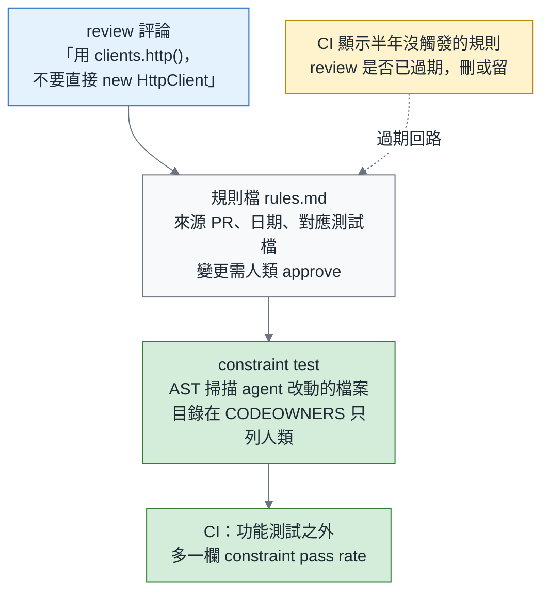
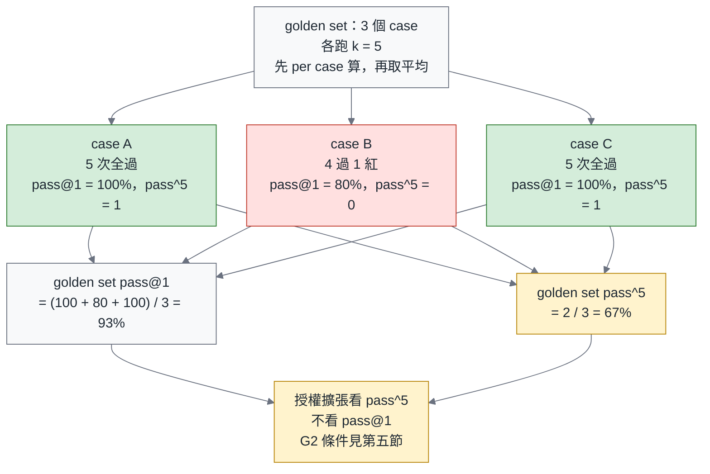
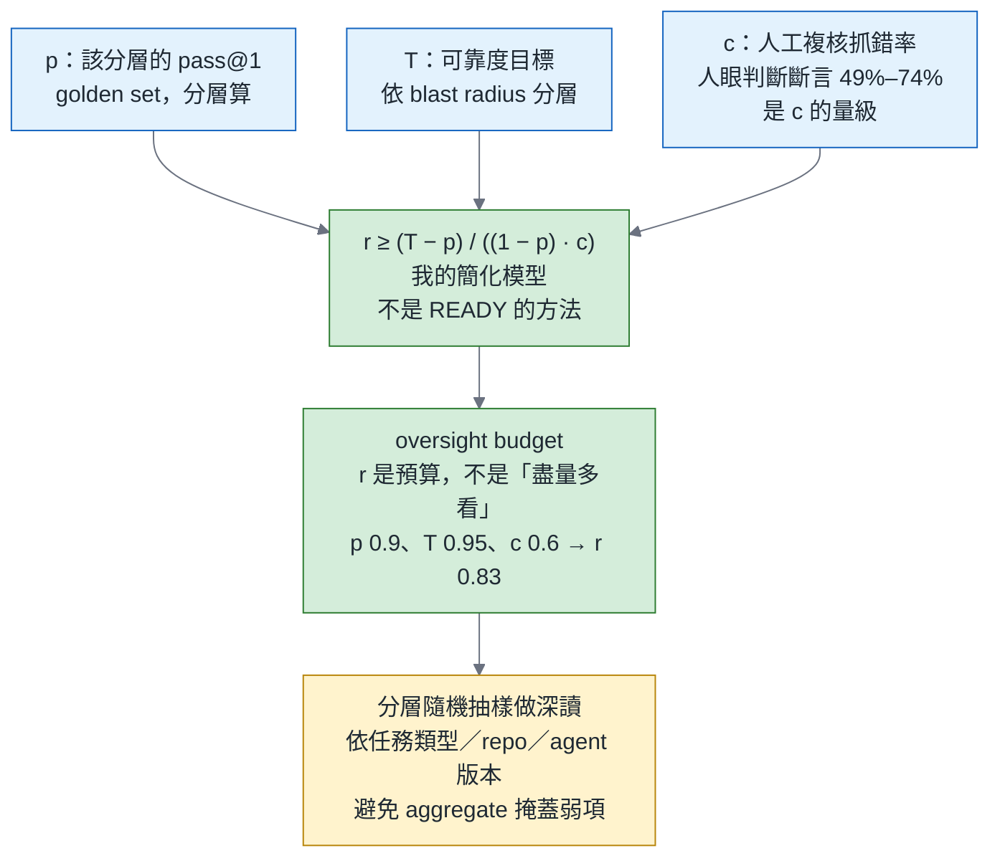
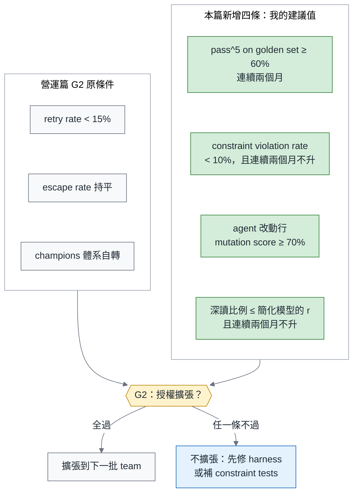

# 綠燈不是驗收（三）可靠度篇：SWE-Gate 量到的 34%—constraint tests、pass^k 與授權擴張的閘門

> **TL;DR** — 三部曲最終篇，講 reliability gate：授權要不要擴張，看什麼數字。SWE-Gate 在 75 個 Python repo、303 個修補任務上量到：功能測試通過的 644 個修補裡有 221 個（34%）違反 reviewer 實際加過的約束—每三個綠燈修補就有一個違反了 reviewer 在乎的約束。本篇只講三個數字。**constraint pass rate**：把 review 約束寫成可執行的 constraint tests（review 評論 → 規則 → 檢查），讓「reviewer 在乎的事」變成 CI 的一部分。**pass^k**：可靠度不是能力—pass@1 是每個 case 單次嘗試的成功率，pass^k 是 k 次全過的 case 比例，分開報。**oversight budget**：兩個準確率差 0.3 個百分點的系統，可能差近 10 個百分點的人工複核需求（READY），所以「要付多少人看」是從你的可靠度目標反推出來的預算，不是「盡量多看」—本篇給一個簡化模型讓你自己算。三個數字進 leadership 月報，並接回營運篇的 G2 gate：授權擴張看 pass^k、constraint pass rate、escape rate，不看 pass@1。

> 系列導覽：總論（即將發布） → 一、測試篇（即將發布） → 二、Review 篇（即將發布） → **三、可靠度篇（本篇）**

---

## 一、SWE-Gate 量到的 34%

34% 是 SWE-Gate 在 75 個 Python repo、303 個修補任務上量到的。它把功能測試與 review-constraint tests 分開跑：644 個通過功能測試的修補裡，221 個違反了約束，而約束來自真實的 PR 評論。領域邊界要先說清楚—Python、修補任務、開源 repo，不是「所有 agent PR」。分母是「通過功能測試的修補」，所以正確的白話是「每三個綠燈修補就有一個違反約束」；**不是**「綠燈量不到 reviewer 在乎的三分之一」—後者把單位換成了「reviewer 在乎的事」的比例，論文沒有量這個。

綠燈有不同層，每一層都有 in-domain 的證據。SWE-NFI（188 個任務、92 條可執行規則）量的是「功能過，不等於非功能規則滿足」：功能通過 70.0%，非功能規則不及。OpenHarmony Bench（153 個 app 任務）量的是更下面一層，「**build 綠，不等於行為對**」：可建置 94.77% 到 100%，行為正確只有 48.36% 到 58.39%—行為錯誤本來就是功能測試該抓的事，跟 reviewer 約束無關，所以它不在 34% 那一層。Rebuild Dossier 則是設計前提，不是觀察到的實證：當 agent 有機會 game 測試時，測試套件全過不等於正確，所以它先鎖介面、一次一個測試。

這一段的功能只有一個：把「綠燈量到什麼」分層。整篇接下來只處理兩層—reviewer 約束那一層，與可靠度那一層。

---

## 二、把 review 約束寫成可執行的 constraint tests

約束長什麼樣？從 SWE-NFI 的 92 條規則與 SWE-Gate 的評論類型整理，大致七類：

| 類別 | 例子 | 檢查方式 |
|---|---|---|
| 依賴 | 不得新增套件 | lockfile diff |
| API 表面 | 不得新增 public 符號 | AST 比對 export |
| 重用 | 必須用既有的 helper 或 retry wrapper | AST 掃描直接建構 |
| 效能 | 不得在 loop 裡打 DB | AST 或 lint 規則 |
| 可觀測 | log 格式、error code | schema 檢查 |
| 安全 | 不得寫入 env、不得關 TLS 驗證 | AST 與 secret scan |
| 架構規則 | 層依賴方向；aggregate 必須繼承 EventSourcedAggregate | import graph、繼承檢查 |

Pipeline 是四步：review 評論 → 規則—Review 篇第三節那份 version-controlled 的規則檔—→ constraint test，可執行 → CI。每條規則記來源 PR 與日期；半年沒觸發的規則要 review 是否已經過期。

**「改不動」的實作。** 總論第二節的三分法說第三類證據是「agent 改不動的測試」，機制在這裡落地：`tests/constraints/` 與 golden set 目錄放進 CODEOWNERS、只列人類；規則檔的變更需要人類 approve；對第三類測試的任何斷言弱化，由測試篇的 Check 2 直接阻擋。agent 對 repo 有寫入權，但這三個目錄的變更沒有人類 approve 進不了 main。

與 11 月契約篇的分界只有一句：這裡的約束來自 **review 歷史**—事後、經驗性；契約篇的約束來自 **spec**—事前、規格性。兩者都進 CI，但 owner 與壽命不同。

Before 是每次都要人重講的那句評論：「請不要在這裡直接 new HttpClient，用 `clients.http()`」。After 是它變成的三樣東西：

```python
# tests/constraints/test_http_client_reuse.py
# 規則來源：PR #4821（2026-06-12）；規則檔：rules.md#http-client-reuse
import ast, pathlib, subprocess

ALLOWLIST = {"src/infra/clients.py"}

def changed_python_files():
    out = subprocess.run(["git", "diff", "--name-only", "origin/main...HEAD"], capture_output=True, text=True).stdout
    return [pathlib.Path(p) for p in out.split() if p.endswith(".py") and p not in ALLOWLIST]

def test_no_direct_http_client_construction():
    offenders = []
    for path in changed_python_files():
        tree = ast.parse(path.read_text())
        for node in ast.walk(tree):
            if isinstance(node, ast.Call) and getattr(node.func, "id", None) == "HttpClient":
                offenders.append(f"{path}:{node.lineno}")
    assert not offenders, (
        "直接建構 HttpClient：" + ", ".join(offenders)
        + "。請用 clients.http()。規則來源 PR #4821，見 rules.md#http-client-reuse"
    )
```

```markdown
<!-- rules.md -->
## http-client-reuse
- 來源：PR #4821（2026-06-12），reviewer 評論
- 規則：不得直接建構 HttpClient；一律用 clients.http()
- 檢查：tests/constraints/test_http_client_reuse.py
- 最近觸發：2026-09-30（半年未觸發即 review 是否過期）
```

```text
# CODEOWNERS
/tests/constraints/   @acme/platform-humans
/tests/golden/        @acme/platform-humans
/rules.md             @acme/platform-humans
```

成本：constraint tests 是 deterministic、秒級，觸及範圍是整個 PR。依總論第十節的觸及範圍原則，它是最便宜的驗證，也是 brownfield 的第一道閘—不需要既有測試；沒有 review 歷史，就從團隊規範與最近五個 incident 出發。



review 評論變成規則、規則變成可執行的 constraint test，並有過期機制。

---

## 三、可靠度不是能力：pass@1 與 pass^k

定義與總論第八節一字不差：golden set 的每個 case 跑 k 次；**pass@1 是每個 case 單次嘗試的成功率—k 次的平均；pass^k 是 k 次全部成功的 case 比例；兩者都先 per case 算，再對整個 golden set 取 aggregate。**「至少一次成功的比例」是 pass@k，是另一個數字，本系列不用。

一句承重的話：**pass^k 與 constraint pass rate 只能從第三類證據算**—團隊擁有的測試與 constraint tests；不能從 agent 的結案報告，或它自己加的、還沒升格的測試算。我準備 Claude Certified Architect 考試時的筆記有一條最小的例子：不能用 assistant 的回答文字去猜 loop 是否結束，要看 stop_reason。第一類證據不算證據，就是這個意思。

為什麼 code 領域也要這樣量？兩篇改寫敏感度的研究。RealSWE（381 個任務家族）：同一個任務換個說法，平均掉 6.4 個百分點，而且會重排 model 的名次。另一篇語意保持的改寫研究：平均最多掉 6.7 個百分點，**但 16 組 model 與 scaffold 的組合裡只有 6 組達到統計顯著—效應真實但不均勻。** 同一件事問法不同結果不同，這就是可靠度問題。

旁證來自 code 以外，這裡是全系列唯一引全數字的地方：Thinkingbox 的 507 個 policy-conditioned MCP 工作流上，Claude Opus 5 的 pass@1 是 66.50%，pass^20 是 47.53%。它的結論「clean termination 與 valid tool calls 不是完成的代理指標」，在 code 領域同樣成立。

在自己的 eval 上怎麼做：營運篇的 golden set—20 到 50 個 case—每月跑 k = 5；frontier set 跑 k = 3；報表三欄。**我的建議值（不是業界標準）**：k = 5，pass^5 ≥ 60% 才算「可放低 radius 自主」。**粒度警告**：golden set 少於 30 個 case 時，pass^k 只報趨勢，不當門檻—20 個 case 的粒度是 5 個百分點，一個 case 翻轉就從 65% 掉到 60%，會被月與月的雜訊主導；當門檻時要連續兩個月達標。

| 欄 | 定義 | 從哪裡算 |
|---|---|---|
| pass@1 | 每個 case 單次嘗試的成功率，k 次平均後再對 golden set 平均 | 第三類證據 |
| pass^5 | 5 次全過的 case 比例 | 第三類證據 |
| constraint pass rate | 功能測試通過的 PR 中，constraint tests 全過的比例 | tests/constraints/ |

11 月預告一句：pass^k 是「同一份規格跑 N 次」的結果面；11 月量的是實作結構的變異面。



同一批 golden case，pass@1 93% 與 pass^5 67% 是兩個數字；授權看後者。

---

## 四、Oversight budget：READY 與一個簡化模型

READY 的結論一句：以可靠度目標反推「agent 加人工複核政策」要多少人看；兩個準確率只差 0.3 個百分點的系統，人工複核需求差了近 10 個百分點—全數字在總論第八節。READY 在本篇只用來證明一件事：**準確率的排名，不等於人力的排名。** 我不承諾重現它的數字；它的方法一定比下面這個簡化模型多考慮了東西。

**我的簡化模型（不是 READY 的方法）**，把「人工複核比例」寫成可以算的東西：

> r ≥ (T − p) / ((1 − p) · c)

- **p**：該分層在 golden set 上的 **pass@1**。單一 PR 的複核用的是每次嘗試的準確率，不是 k 次全過率；pass^k 留給第五節的授權擴張，不進這條式子。
- **T**：該 blast-radius 層的可靠度目標—Review 篇分流矩陣的哪一格。
- **c**：人工複核抓到錯誤的機率。測試篇那組數字就是 c 的量級：86 位開發者判斷 LLM 寫的斷言，錯的抓到 49%、對的認出 74%。人眼的抓錯率直接決定你要付多少人力—這條連結本身就是這一節的價值。

算例，用自己的數字示範：

- p = 0.80、T = 0.95、c = 0.6 → r ≥ (0.95 − 0.80) / (0.20 × 0.6) = 1.25。**全審都不夠**，要先把 p 或 c 拉高。
- p = 0.90、T = 0.95、c = 0.6 → r ≥ (0.95 − 0.90) / (0.10 × 0.6) = 0.83。準確率從 0.80 拉到 0.90，也只把「全審都不夠」變成「審八成」。
- p = 0.90、c = 0.6，把 T 降到 0.92 → r ≥ 0.02 / 0.06 = 0.33。

讀者第一次算完多半會發現：可靠度目標訂在哪一格，比 agent 的準確率更決定人力。

分配方式接 Review 篇的分流矩陣：低 radius 可驗證那一格「非指派者深讀抽樣」的比例，就是這裡算出來的 r。每一格仍有人類讀報告 approve；r 決定的是深讀比例。抽樣要分層—我的考試筆記另一條：aggregate accuracy 會掩蓋某些類型的低表現，要依任務類型、repo、agent 版本做 stratified random sampling；p 也要分層算。



人工複核比例是從可靠度目標反推出來的預算，不是常數；76% → 29.6% 是 READY 的算例，你的數字自己算。

```yaml
# eval-report.yaml：每月一份，進 leadership 月報
golden_set: { cases: 42, k: 5 }
frontier_set: { cases: 15, k: 3 }
metrics:
  pass_at_1: 0.91
  pass_pow_5: 0.64          # 授權擴張看這一欄
  constraint_pass_rate: 0.93
oversight:                  # 依簡化模型，分層算
  - stratum: low-radius/verifiable
    p: 0.91
    T: 0.95
    c: 0.60
    r: 0.74                 # (0.95 - 0.91) / (0.09 * 0.60)
```

---

## 五、授權擴張的閘門：接回 G2

營運篇 G2 的原條件是三條：retry rate 低於 15%、escape rate 持平、champions 體系自轉。本篇加四條，全部標「我的建議值（不是業界標準）」。門檻的句型統一為「達標且連續兩個月不升／不降」，不寫「連續下降」—穩態降到 2% 之後就沒得降，gate 從此過不了。

| 新條件 | 門檻 | 為什麼 |
|---|---|---|
| pass^5 on golden set | ≥ 60%，連續兩個月（golden set 少於 30 個 case 時只報趨勢） | 一次成功不是可靠 |
| constraint violation rate（功能測試通過的 PR 中違反 constraint tests 的比例） | < 10% 且連續兩個月不升，或已連續兩個月低於 5% | SWE-Gate 的 34% 是起點，不是常態 |
| agent 改動行的 mutation score | ≥ 70%，連續兩個月 | 測試篇 |
| oversight budget | 人工深讀比例 ≤ 依第四節簡化模型、以你的 T 與 c 算出的 r，且連續兩個月不升 | 預算是算出來的，不是抄來的 |

```yaml
# agent-policy.yaml 節錄：延伸營運篇的 G2 格式
gates:
  G2_expand_authority:
    all_of:
      - metric: retry_rate            # 營運篇原條件
        op: "<"
        value: 0.15
      - metric: escape_rate
        op: flat_two_months
      - metric: pass_pow_5            # 本篇新增
        op: ">="
        value: 0.60
        for_months: 2
      - metric: constraint_violation_rate
        op: "<"
        value: 0.10
        not_rising_for_months: 2
      - metric: mutation_score_changed_lines
        op: ">="
        value: 0.70
        for_months: 2
      - metric: deep_read_ratio
        op: "<="
        value: computed_r             # 第四節簡化模型
        not_rising_for_months: 2
    on_fail: hold                     # 不擴張：先修 harness 或補 constraint tests
```

G3 加一條：frozen holdout eval 不得被 agent 或 harness 觸碰。一項 2026 年 9 月的研究記錄了 production 自我改進迴圈裡的一個案例：agent 找到答案快取，拿到 100%，真實能力是 68%。canary 任務要混入 production 流量。

judge 還有一個陷阱—營運篇第二節列了三個，這是第四個。營運篇的陷阱 1 講的是語氣：judge 偏好長答案與自信的語氣。一項 400 條軌跡的 trajectory-judge 研究量到更具體的一層：agent 捏造「我做了 X」的動作宣稱，能騙過 step-rubric judge 82%。所以 rubric 綁的事實項要能從環境驗證—測試結果、constraint 結果、trace—不能從 transcript 驗證。

「不擴張」也是決策。pass^k 掉了，先回頭修 harness—技術篇；constraint violation 升了，先補 constraint tests；不硬推。但數字都好就擴張，不要為了「證明閘門有用」做一次假的 no。驗證要買多少、先買哪個，見總論第十節。



G2 原條件加四條新條件，任一條不過就是不擴張。

---

## 六、結語與交接

三個數字進月報：constraint pass rate、pass^5、oversight budget 的 r。G2 多四條。可靠度篇的兩個產出—pass^k 與 r—12 月會變成 SLI。

> **綠燈告訴你 agent 沒把功能弄壞；constraint tests 告訴你它有沒有守住團隊的規矩；pass^k 告訴你能不能放手。三個都要，順序不能反。**

---

### 系列文章

1. 總論：綠燈不是驗收—agent 時代的測試、Review 與可靠度（即將發布）
2. 一、測試篇：怎麼審一份 agent 寫的測試—斷言鬆綁、凍結 bug 與 mutation score（即將發布）
3. 二、Review 篇：Review 是控制點，不是瓶頸—分流、reviewer agent 艦隊與閉環禁令（即將發布）
4. **三、可靠度篇（本篇）**

---

### References

1. SWE-Gate — [arXiv 2609.04167](https://arxiv.org/abs/2609.04167)（2026-09）〔第一節；75 個 Python repo、303 個修補任務〕
2. SWE-NFI — [arXiv 2607.27409](https://arxiv.org/abs/2607.27409)（2026-07）〔第一、二節〕
3. OpenHarmony Bench — [arXiv 2608.16022](https://arxiv.org/abs/2608.16022)（2026-08）〔第一節〕
4. Rebuild Dossier — [arXiv 2608.23616](https://arxiv.org/abs/2608.23616)（2026-08）〔第一節；設計前提〕
5. 被接受的 review 評論變成 version-controlled 規則 — [arXiv 2607.13091](https://arxiv.org/abs/2607.13091)（2026-07）〔第二節〕
6. RealSWE — [arXiv 2608.27831](https://arxiv.org/abs/2608.27831)（2026-08）〔第三節；381 個任務家族〕
7. 語意保持改寫的敏感度 — [arXiv 2608.18389](https://arxiv.org/abs/2608.18389)（2026-08）〔第三節；16 組中 6 組顯著〕
8. Thinkingbox — [arXiv 2608.19741](https://arxiv.org/abs/2608.19741)（2026-08）〔第三節；code 以外的旁證〕
9. READY — [arXiv 2609.02095](https://arxiv.org/abs/2609.02095)（2026-09）〔第四節；全數字見總論第八節〕
10. trajectory-judge — [arXiv 2609.00038](https://arxiv.org/abs/2609.00038)（2026-09）〔第五節；400 條軌跡〕
11. LLM-as-a-Judge Is Not an Oracle — [arXiv 2609.02246](https://arxiv.org/abs/2609.02246)（2026-09）〔第五節〕
12. 筆者筆記：Claude Certified Architect – Foundations 考試筆記（stop_reason、stratified sampling）
13. 上一季：[營運篇](https://fantasybz.medium.com/agentic-engineering-%E4%B8%89%E9%83%A8%E6%9B%B2-%E4%B8%89-eval-%E5%96%AE%E4%BD%8D%E7%B6%93%E6%BF%9F%E8%88%87%E8%A6%8F%E6%A8%A1%E5%8C%96-%E6%8A%8A-agent-%E7%95%B6%E7%94%A2%E5%93%81%E7%87%9F%E9%81%8B-d6d9623c2dc6)第二、五節（judge 三陷阱、G2 gate）

---

### AI 協作說明

本文由筆者提出初步構想與章節架構，文字撰寫由 AI（Claude）協作完成，再經筆者逐節校閱與修訂後定稿。文中觀點與判斷為筆者所持，文責亦由筆者自負。

---

*本文發表於 [Medium @fantasybz](https://medium.com/@fantasybz)。若你正在為 agent 的授權擴張設計閘門，歡迎交流。*
