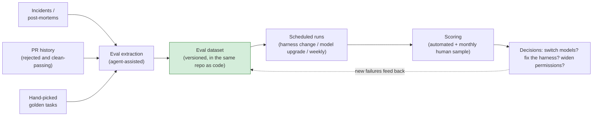
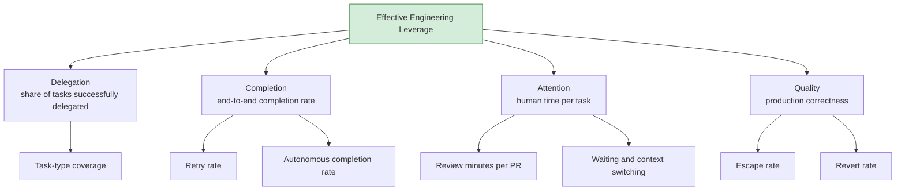
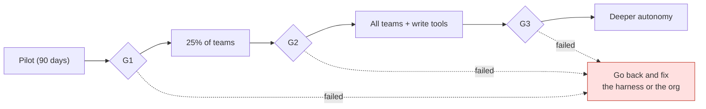

# Agentic Engineering, Part 3 — Evals, Unit Economics, and Scaling: Running Agents Like a Product

> **TL;DR** — The final part. You bought the runtime, organized the way part one describes, built the harness from part two. Then what? Most adoptions die on "then what": no evals, so the model-switch decision comes down to a hunch; no cost model, so the CFO shows up six months later with a knife; no gaming-resistant metrics, so the numbers look great while nobody actually gets faster. This piece covers the full operations layer: the eval dataset pipeline and its tiers, unit economics and model routing, the metric tree with an anti-gaming counter for each metric, the scaling gates that come after the pilot, and how to manage vendors.

> Series: [Overview](https://fantasybz.medium.com/dont-build-your-own-devin-org-strategy-and-a-90-day-blueprint-for-agentic-engineering-8187e7ec80f9) → [1. Org Design](https://fantasybz.medium.com/agentic-engineering-part-1-who-does-this-platform-plus-federation-in-practice-92343384d987) → 2. The Harness Blueprint (coming soon) → **3. Evals and Unit Economics (this piece)**

---

## 1. Run agentic capability as an internal product

Start with a shift in perspective. Your *product* is the paved road. Your *customers* are the domain teams. Your *revenue* is tasks successfully delegated. Your *churn* is an engineer who tried twice, failed, and quietly went back to writing it by hand.

That framing dictates everything else in operations: a product needs measurement (evals and metrics), unit economics (cost per successful task), a growth strategy (scaling gates), and supply chain management (vendor strategy). This piece takes those four in order.

Why evals come first: the overview's judgment was that **the eval dataset is the only asset that compounds.** Models turn over every six months and harness assumptions keep expiring, but "what counts as correct on my workload" only accumulates. Every model upgrade and every vendor price war increases its value, because you're the only one who can validate a new option against your own evals in a day. Everyone else reads benchmarks and guesses.

---

## 2. Building the eval framework

### Where the dataset comes from

Most teams stall on the first step: where do evals come from? The answer is that they're already in your engineering history — what's missing is the harvesting pipeline:



Each source has its own character:

- **Incident harvesting.** Every post-mortem is a ready-made case: give the agent the context and symptoms from that day and see whether it finds the root cause. These are the most expensive cases to build and the most authentic.
- **PR history harvesting.** An agent PR a reviewer sent back, together with the review comment, is the most realistic negative example available. The ones that passed cleanly are your golden paths.
- **Hand-picked golden tasks.** Take 10–20 representative completed tasks — a few bug fixes, a few small features, a few refactors — and freeze their context and acceptance criteria.

### What an eval case looks like

Write cases declaratively, versioned and reviewed alongside code:

```yaml
# evals/cases/payment-timeout-fix.yaml (excerpt)
id: payment-timeout-fix
source: incident-2026-04-18        # provenance stays traceable
context:
  repo: shop-backend
  entry: "Intermittent 504s at checkout, trace ID attached"
expected:
  root_cause: "connection pool ceiling"
  fix_touches: ["internal/db/pool.go"]
  tests_added: true
scoring: rubric                    # rubric / exact / llm_judge
```

### Three tiers, each with a job

| Tier | Count | When it runs | The question it answers |
|---|---|---|---|
| **Smoke** | 5–10 | Every harness change | Did we break the basics? |
| **Golden** | 20–50 | Weekly, plus every model upgrade | Did core capability regress? |
| **Frontier** | 10–20 | Monthly | Where is the capability boundary now? Should we widen permissions? |

The frontier tier is the one most often skipped, and it answers the most valuable question: **what couldn't the agent do before that the latest model can now?** That directly determines whether to widen the permission scope (see the gates in section 5).

### Three traps in LLM-as-judge

Once volume grows you'll use an LLM as the judge. Three pitfalls, stated up front:

1. **Judges prefer long answers and confident tone.** Bind the rubric to factual items — did the tests pass, are the changed files right, is the root cause correct — rather than "overall quality, 1 to 10."
2. **Same-family favoritism.** A judge from the same model family as the subject shows bias. Use a different family as judge, or run two judges and take the intersection.
3. **Judge drift.** The judge's own model gets upgraded too, and yesterday's 85 may not be today's 85. Pin the judge's model version and record every change to it.

There's only one anchor for calibration: **a monthly human scoring pass over a sample of 10 cases**, compared against the judge's scores. Fully automated evals are the destination, not the starting point — and an automated score with no human anchor can drift without you ever noticing.

---

## 3. Unit economics: the cost model and model routing

### Anatomy of a single run

One autonomous run costs model tokens (typically 60–80%), plus sandbox compute (10–25%), plus peripherals like observability and storage. The total ranges from tens of cents to tens of dollars — and the driver isn't task difficulty. It's two sources of waste:

- **Retry tax.** The cost of failed attempts. Bringing retry rate from 30% down to 10% cuts total cost by more than a fifth on its own — and the root cause of a high retry rate lives in the harness's context and feedback layers (part two), not in the model. **Money burned on retries is a tax on harness quality.**
- **Context bloat.** The lazy habit of stuffing the whole repo into context. The three-tier AGENTS.md and the "100 lines for the repo tier" discipline from part two are the diet plan.

### The model routing matrix

Different work goes to different model tiers, with the routing logic living in the platform (the gateway from part two) so teams don't each decide for themselves:

| Task type | Recommended tier | Why |
|---|---|---|
| Planning, architectural judgment | Strongest model | Highest cost of error; get it right once |
| Bulk code generation | Mid-tier model | Tests catch problems; volume is high |
| Eval runs, lint-class work | Cheap model | High frequency, low risk |
| Review, security judgment | Strongest model | Don't economize on the last line of defense |

### Budget guardrails

- **Per-team quota with an overage alert.** Observe before you enforce — early on, knowing the shape of usage is worth more than the money you'd save.
- **A run-level kill switch.** A single run that exceeds a cost ceiling — say $20 — pauses for human confirmation. This is the fuse against a runaway retry loop.
- **Read cost per successful task as a trend, not an absolute.** Year one is tuition (see the budget narrative in part one); year two is when you compare it against headcount cost.

---

## 4. The metric tree and how each metric gets gamed

The overview gave the North Star formula. Here it is expanded into a measurable tree:



Every one of these gets gamed — not out of malice, but because Goodhart's law operates daily. So design the antidote at the same time you design the metric:

| Metric | How it gets gamed | Counter |
|---|---|---|
| % tasks delegated | Splitting big tasks to inflate the count | Pair it with task-type coverage; measure breadth, not volume |
| Review minutes per PR | Rubber-stamping approvals | Always read it alongside escape and revert rate |
| Completion rate | Delegating only easy tasks | Frontier evals track whether the capability boundary is moving |
| Escape rate | Not filing incidents when things break | Tie the incident definition to SLOs, not to human judgment |

The principle in one line: **metrics come in pairs — every speed metric needs a quality metric beside it.** Grade any single number in isolation and you will get that number, along with everything that was sacrificed to produce it. This is the 2.0 version of the vanity metrics lesson from the DevOps era.

---

## 5. After day 90: scaling gates

The overview gave the first 90 days: pick pilots, measure a baseline, build evals. The most common mistake once the pilot ends is declaring victory and rolling out everywhere. Scale through gates instead — each with explicit quantitative conditions that unlock the next step:

| Gate | Conditions to pass | Unlocks |
|---|---|---|
| **G1: pilot complete** | Two teams using it steadily; evals in place; measurable improvement against baseline | Expand to 25% of teams |
| **G2: scale validated** | Retry rate under 15%; escape rate flat; the champion system runs itself | All teams, plus write-tier tools |
| **G3: deeper autonomy** | Frontier evals consistently stable; six months of audit with no serious incidents | Allowlisted dangerous tools, multi-step autonomous runs |



Two disciplines. **When you're stuck, go back and fix it — don't push through.** Failing G2 usually means a harness problem (part two); failing G3 usually means guardrails and eval coverage. And: **expansion speed is set by evals and escape rate, not by the roadmap.** "Q3 says company-wide rollout" is not a reason G2 passes automatically.

---

## 6. Managing vendors

- **Two vendors is the steady state**: one primary, one challenger. This isn't distrust, it's negotiating structure — your eval dataset turns "let's see what the challenger can do" into a one-day exercise, which is the compounding from section 1 paying out.
- **The model-switch decision process.** New model ships → run golden and frontier evals → look at three things: change in pass rate, change in cost per task, and **new failure modes that didn't exist before** (the one people skip) → canary on 20% of workload for two weeks → full rollout. Never switch models because of a benchmark score or a demo.
- **Four things to watch in the contract**: whether your code and transcripts are used for training; where logs are stored and for how long; rate limits and SLA; and price protection — token pricing moves a lot, so lock a year where you can.

---

## 7. Closing the series

The trilogy ends where the overview started:

> **Buy the intelligence. Build the environment. Own the feedback loop.**

Organization (part one) decides who does the work. The harness (part two) decides whether agents can do it well. Operations (this piece) decides whether you know how well it's going and whether to keep investing. None of the three is a project you finish; all three are internal products you run.

If you can only start three things: **measure a baseline, pick a pilot, and build your first ten eval cases.** Ninety days later you'll be entitled to make the next decision on evidence instead of vibes.

---

### The series

1. [Overview: Don't Build Your Own Devin](https://fantasybz.medium.com/dont-build-your-own-devin-org-strategy-and-a-90-day-blueprint-for-agentic-engineering-8187e7ec80f9)
2. [1. Org Design: who does this? Platform plus federation in practice](https://fantasybz.medium.com/agentic-engineering-part-1-who-does-this-platform-plus-federation-in-practice-92343384d987)
3. 2. The Harness Blueprint: making your system legible to agents (coming soon)
4. **3. Evals, Unit Economics, and Scaling (this piece)**

---

### References

1. Anthropic — [Effective harnesses for long-running agents](https://www.anthropic.com/engineering/effective-harnesses-for-long-running-agents)
2. Google — [2025 DORA report: How are developers using AI?](https://blog.google/innovation-and-ai/technology/developers-tools/dora-report-2025/)
3. Stack Overflow — [Agents on a leash: Agentic AI remains mostly monitored at work](https://stackoverflow.blog/2026/05/27/agents-on-a-leash-agentic-ai-remains-mostly-monitored-at-work/)

---

### On how this piece was made

The initial concept and chapter structure are the author's; the prose was drafted in collaboration with AI (Claude), then reviewed and revised section by section by the author before publication. The views and judgments are the author's own, as is responsibility for the content.

---

*Originally published in Chinese: [中文版](https://fantasybz.medium.com/agentic-engineering-%E4%B8%89%E9%83%A8%E6%9B%B2-%E4%B8%89-eval-%E5%96%AE%E4%BD%8D%E7%B6%93%E6%BF%9F%E8%88%87%E8%A6%8F%E6%A8%A1%E5%8C%96-%E6%8A%8A-agent-%E7%95%B6%E7%94%A2%E5%93%81%E7%87%9F%E9%81%8B-d6d9623c2dc6). Also on [Medium @fantasybz](https://medium.com/@fantasybz) — if you're taking Agentic Engineering from pilot to scale, I'd like to hear from you.*
