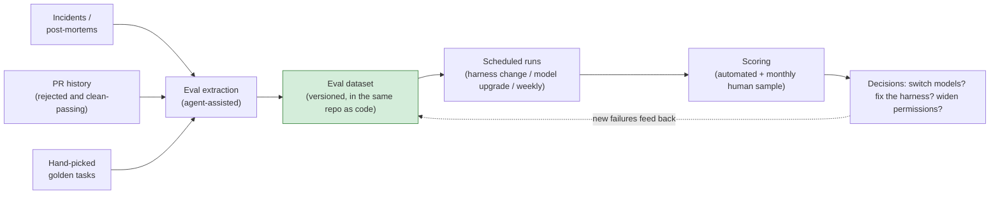
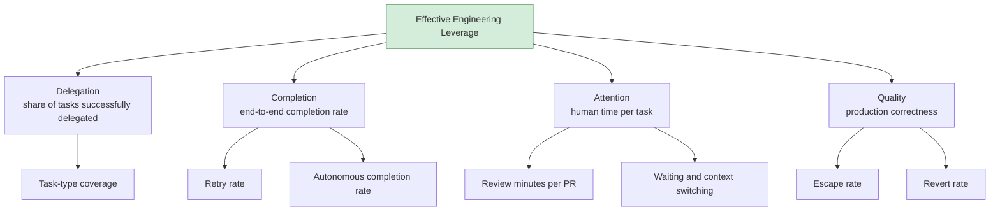
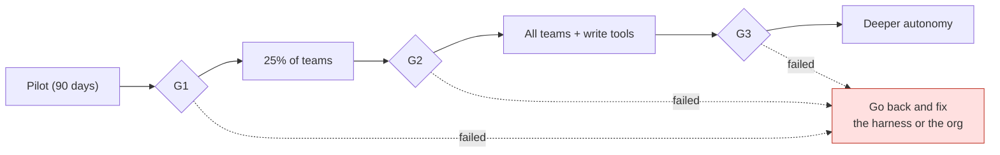

# Agentic Engineering, Part 3 — Evals, Unit Economics, and Scaling: Running Agents Like a Product

> **TL;DR** — The final part. You bought the runtime, organized the way part one describes, built the harness from part two. Then what? Most adoptions die on "then what": no evals, so the model-switch decision comes down to a hunch; no cost model, so the CFO shows up six months later with a knife; no gaming-resistant metrics, so the numbers look great while nobody actually gets faster. This piece covers the full operations layer: the eval dataset pipeline and its tiers, unit economics and model routing, the metric tree with an anti-gaming counter for each metric, the scaling gates that come after the pilot, and how to manage vendors.

> Series: [Overview](https://fantasybz.medium.com/dont-build-your-own-devin-org-strategy-and-a-90-day-blueprint-for-agentic-engineering-8187e7ec80f9) → [1. Org Design](https://fantasybz.medium.com/agentic-engineering-part-1-who-does-this-platform-plus-federation-in-practice-92343384d987) → [2. The Harness Blueprint](https://fantasybz.medium.com/agentic-engineering-part-2-the-harness-blueprint-making-your-system-legible-to-agents-3facc281f633) → **3. Evals and Unit Economics (this piece)**

---

## 1. Run agentic capability as an internal product

Start with a shift in perspective. Your *product* is the paved road. Your *customers* are the domain teams. Your *revenue* is tasks successfully delegated. Your *churn* is an engineer who tried twice, failed, and quietly went back to writing it by hand.

The paved road is the default path the platform has already laid down: follow it and your environment, permissions and verification come wired up. You can leave it, but then you carry the weight yourself.

Once the framing shifts, so does the work. This stops being a tooling purchase and becomes product management, and there are four jobs in it:

- **Measurement.** Which tasks are actually being delegated successfully? That is what evals and metrics are for.
- **Unit economics.** What does one successful delegation cost? Call that number cost per successful task.
- **Growth strategy.** When do you widen permissions, and when do you stop and fix the platform instead? Those are the scaling gates.
- **Supply chain management.** When your primary vendor changes its price or its policy, you have to be able to move — hence a vendor strategy.

This piece takes those four in order.

Start with why evals come first. An eval dataset is a bank of tasks you maintain yourself, each one packaged with its context and its acceptance criteria, so that you can measure different models and different versions of the harness against the same questions.

The overview's judgment was that **the eval dataset is the only asset that compounds.** That sentence has two halves. One half expires: models turn over every six months and harness assumptions keep going stale. The other half doesn't: "what counts as correct on my workload" only accumulates, and that accumulation is your moat.

So every model upgrade and every vendor price war increases its value, because you're the only one who can validate a new option against your own evals in a day. Everyone else reads benchmarks and guesses.

---

## 2. Building the eval framework

### Where the dataset comes from

Most teams stall on the first step: where do evals come from? My answer is to stop treating it as a research project that starts from nothing. Your engineering history already holds plenty of raw material. What's missing is a pipeline that harvests it into cases.

What to look for in the diagram is how the material comes in, and how it circles back to feed the dataset again:



Follow the dashed line at the end — that is the one most people skip. Without it the eval set is just a past exam paper that slowly goes stale: however diligently you run it, all you are doing is re-confirming problems you fixed long ago.

Each source has its own character:

- **Incident harvesting.** Every post-mortem is a ready-made case: give the agent the context and symptoms from that day and see whether it finds the root cause. These are the most expensive cases to build and the most authentic.
- **PR history harvesting.** An agent PR a reviewer sent back, together with the review comment, is the most realistic negative example available. The ones that passed cleanly are your golden paths, and they tell you whether the basics have regressed.
- **Hand-picked golden tasks.** Take 10–20 representative completed tasks — a few bug fixes, a few small features, a few refactors — and freeze their context and acceptance criteria. This is the one batch you control completely, so it is worth taking your time over the picks.

### What an eval case looks like

I write cases declaratively, rather than leaving a loose natural-language prompt for everyone to read their own way. Declarative here means splitting provenance, context, the expected result and the scoring method into fixed fields, each spelled out. That is what lets a case live under the same rules as code: versioned alongside it, reviewed alongside it.

```yaml
# evals/cases/payment-timeout-fix.yaml (excerpt)
id: payment-timeout-fix
source: incident-2026-04-18        # provenance stays traceable
context:
  repo: shop-backend
  entry: "Intermittent 504s at checkout, trace ID attached"
expected:
  root_cause: "connection pool ceiling"
  fix_touches: ["internal/db/pool.go"]
  tests_added: true
scoring: rubric                    # rubric / exact / llm_judge
```

In that file, defend the `source` field above all. Every case points back at something that really happened — an incident, a PR, a task somebody finished. Otherwise the eval set drifts into a mock exam you wrote for yourself.

### Three tiers, each with a job

You don't need evals to be one single set, and they shouldn't be. The three tiers answer different questions, and each one runs on its own rhythm:

| Tier | Count | When it runs | The question it answers |
|---|---|---|---|
| **Smoke** | 5–10 | Every harness change | Did we break the basics? |
| **Golden** | 20–50 | Weekly, plus every model upgrade | Did core capability regress? |
| **Frontier** | 10–20 | Monthly | Where is the capability boundary now? Should we widen permissions? |

The frontier tier is the one most often skipped, and the reason is easy to see: it protects nothing about today's workflow, so a month without running it hurts nobody. But it answers the most valuable question: **what couldn't the agent do before that the latest model can now?** That question directly determines whether the permission scope widens — it is the input the gates run on (see section 5).

### Three traps in LLM-as-judge

Once you have enough cases, human scoring can't keep up, so at volume you will end up using an LLM as the judge: a second model scores against the rubric, which is what LLM-as-judge means. It's usable, but three pitfalls first:

1. **Judges prefer long answers and confident tone.** Bind the rubric to factual items — did the tests pass, are the changed files right, is the root cause correct — rather than "overall quality, 1 to 10."
2. **Same-family favoritism.** A judge from the same model family as the subject shows bias. The fix is to use a different family as judge, or to run two judges and take the intersection.
3. **Judge drift.** The judge's own model gets upgraded too, and yesterday's 85 may not be today's 85. Pin the judge's model version and record every change to it.

There's only one anchor for calibration: **a monthly human scoring pass over a sample of 10 cases**, held up against the judge's scores. The judge is moving too, so you need one reference point that doesn't move with it.

Fully automated evals are the destination, not the starting point. An automated score with no human anchor can drift without you ever noticing.

---

## 3. Unit economics: the cost model and model routing

### Anatomy of a single run

Before arguing about cost, take one bill apart, or the discussion never gets past the impression that agents are expensive. One autonomous run costs model tokens (typically 60–80%), plus sandbox compute (10–25%), plus peripherals like observability and storage.

The total ranges from tens of cents to tens of dollars — and the driver isn't task difficulty. It's two sources of waste:

- **Retry tax.** The cost of failed attempts. Bringing retry rate from 30% down to 10% cuts total cost by more than a fifth on its own — and nine times out of ten the root cause of a high retry rate lives in the harness's context and feedback layers (part two), not in the model. **Money burned on retries is a tax on harness quality.**
- **Context bloat.** The lazy habit of stuffing the whole repo into context. Say a task only touches one handler, and the agent reads the entire repo first: most of the budget is gone before any work starts, and the part that actually needs attention gets whatever is left. The three-tier AGENTS.md and the "100 lines for the repo tier" discipline from part two are the diet plan.

### The model routing matrix

Model routing means assigning a model tier to each class of work in advance, instead of pointing the whole company at the strongest model available. The criteria are the cost of an error and how verifiable the output is, and keeping that judgment in the platform (the gateway from part two) means it gets made once, not by every team separately.

The task types and the tiers will move with each model generation. The reasoning won't:

| Task type | Recommended tier | Why |
|---|---|---|
| Planning, architectural judgment | Strongest model | Highest cost of error; get it right once |
| Bulk code generation | Mid-tier model | Tests catch problems; volume is high |
| Eval runs, lint-class work | Cheap model | High frequency, low risk |
| Review, security judgment | Strongest model | Don't economize on the last line of defense |

Planning and review both get the strongest model, and those two rows carry the point. One is the decision at the very front, the other is the last line of defense, and money saved at either end tends to come back later as a retry or an escape.

### Budget guardrails

Budget guardrails are limits you agree on in advance. The first two are there for the hours when nobody is watching and one accident burns a quarter's budget. The third is there so you don't read the number wrong:

- **Per-team quota with an overage alert.** Observe before you enforce — early on, knowing the shape of usage is worth more than the money you'd save.
- **A run-level kill switch.** A single run that exceeds a cost ceiling — say $20 — pauses for human confirmation. This is the fuse against a runaway retry loop: an agent stuck on the same error all night shouldn't first surface on the bill at the end of the month.
- **Read cost per successful task as a trend, not an absolute.** Year one is tuition (see the budget narrative in part one); year two is when you compare it against headcount cost.

A cost line that gets pulled out and graded on its own will always be pushed down until it looks good.

---

## 4. The metric tree and how each metric gets gamed

The overview gave the North Star formula. Here it is expanded into a measurable tree. Read past the names of the four branches; what matters is that every branch has something measurable hanging under it:



The shape of the tree is its discipline. Drop one branch and the remaining three start lying to you: watch only Delegation and Completion, and you get a report that looks excellent while nobody's day has actually gotten easier.

Every one of these gets gamed — not out of malice, but because Goodhart's law operates daily: once a measure becomes a target, it stops being a good measure. So design the antidote at the same time you design the metric:

| Metric | How it gets gamed | Counter |
|---|---|---|
| % tasks delegated | Splitting big tasks to inflate the count | Pair it with task-type coverage; measure breadth, not volume |
| Review minutes per PR | Rubber-stamping approvals | Always read it alongside escape and revert rate |
| Completion rate | Delegating only easy tasks | Frontier evals track whether the capability boundary is moving |
| Escape rate | Not filing incidents when things break | Tie the incident definition to SLOs, not to human judgment |

The principle in one line: **metrics come in pairs — every speed metric needs a quality metric beside it.** Grade any single number in isolation and you will get that number, along with everything that was sacrificed to produce it. This is the 2.0 version of the vanity metrics lesson from the DevOps era.

---

## 5. After day 90: scaling gates

The overview gave the first 90 days: pick pilots, measure a baseline, build evals. The most common mistake once the pilot ends is declaring victory and rolling out everywhere.

Scale through gates instead. Each gate fixes its quantitative conditions in advance, and only passing it unlocks the next step. The further along the gates you go, the more dangerous the things an agent is allowed to touch:

| Gate | Conditions to pass | Unlocks |
|---|---|---|
| **G1: pilot complete** | Two teams using it steadily; evals in place; measurable improvement against baseline | Expand to 25% of teams |
| **G2: scale validated** | Retry rate under 15%; escape rate flat; the champion system runs itself | All teams, plus write-tier tools |
| **G3: deeper autonomy** | Frontier evals consistently stable; six months of audit with no serious incidents | Allowlisted dangerous tools, multi-step autonomous runs |

Every condition on all three gates has to be written as something you can check. Retry rate and escape rate are already numbers. "Using it steadily" and "the champion system runs itself" need an agreed definition up front, and cannot be left at "people seem happy with it." The dangerous tools in that last cell are the ones that reach production and the outside world. A mistake with them can't be taken back, which is why they come last.

Drawn as a flow, the gates look like this:



All three dashed lines end up in the same box, and that is deliberate.

The first discipline: **when you're stuck, go back and fix it — don't push through.** Failing G2 usually means a harness problem (part two), and failing G3 usually means guardrails and eval coverage. Neither is the kind of problem that resolves itself if you push for one more quarter.

The second: **expansion speed is set by evals and escape rate, not by the roadmap.** "Q3 says company-wide rollout" is not a reason G2 passes automatically.

Both disciplines assume the same thing: that you can put eval results on the table as evidence at any moment. That same evidence is what decides how you negotiate with vendors.

---

## 6. Managing vendors

There isn't much to watch on the vendor side. Three things:

- **Two vendors is the steady state**: one primary, one challenger. This isn't distrust, it's negotiating structure — your eval dataset turns "let's see what the challenger can do" into a one-day exercise, which is the compounding from section 1 paying out.
- **The model-switch decision process.** New model ships → run golden and frontier evals → look at three things: change in pass rate, change in cost per task, and **new failure modes that didn't exist before** (the one people skip) → canary on 20% of workload for two weeks → full rollout. That process does exactly one thing: it drags "should we switch" back from a matter of feel to a matter of evidence. Never switch models because of a benchmark score or a demo.
- **Four things to watch in the contract**: whether your code and transcripts are used for training; where logs are stored and for how long; rate limits and SLA; and price protection — token pricing moves a lot, so lock a year where you can.

Taken together, those three exist so that dropping any one vendor stays an option you can afford.

---

## 7. Closing the series

The trilogy ends where the overview started:

> **Buy the intelligence. Build the environment. Own the feedback loop.**

Organization (part one) decides who does the work. The harness (part two) decides whether agents can do it well. Operations (this piece) decides whether you know how well it's going and whether to keep investing. None of the three is a project you finish; all three are internal products you run.

If you can only start three things: **measure a baseline, pick a pilot, and build your first ten eval cases.** Ninety days later you'll be entitled to make the next decision on evidence instead of vibes.

---

### The series

1. [Overview: Don't Build Your Own Devin](https://fantasybz.medium.com/dont-build-your-own-devin-org-strategy-and-a-90-day-blueprint-for-agentic-engineering-8187e7ec80f9)
2. [1. Org Design: who does this? Platform plus federation in practice](https://fantasybz.medium.com/agentic-engineering-part-1-who-does-this-platform-plus-federation-in-practice-92343384d987)
3. [2. The Harness Blueprint: making your system legible to agents](https://fantasybz.medium.com/agentic-engineering-part-2-the-harness-blueprint-making-your-system-legible-to-agents-3facc281f633)
4. **3. Evals, Unit Economics, and Scaling (this piece)**

---

### References

1. Anthropic — [Effective harnesses for long-running agents](https://www.anthropic.com/engineering/effective-harnesses-for-long-running-agents)
2. Google — [2025 DORA report: How are developers using AI?](https://blog.google/innovation-and-ai/technology/developers-tools/dora-report-2025/)
3. Stack Overflow — [Agents on a leash: Agentic AI remains mostly monitored at work](https://stackoverflow.blog/2026/05/27/agents-on-a-leash-agentic-ai-remains-mostly-monitored-at-work/)

---

### On how this piece was made

The initial concept and chapter structure are the author's; the prose was drafted in collaboration with AI (Claude), then reviewed and revised section by section by the author before publication. The views and judgments are the author's own, as is responsibility for the content.

---

*Originally published in Chinese: [中文版](https://fantasybz.medium.com/agentic-engineering-%E4%B8%89%E9%83%A8%E6%9B%B2-%E4%B8%89-eval-%E5%96%AE%E4%BD%8D%E7%B6%93%E6%BF%9F%E8%88%87%E8%A6%8F%E6%A8%A1%E5%8C%96-%E6%8A%8A-agent-%E7%95%B6%E7%94%A2%E5%93%81%E7%87%9F%E9%81%8B-d6d9623c2dc6). Also on [Medium @fantasybz](https://medium.com/@fantasybz) — if you're taking Agentic Engineering from pilot to scale, I'd like to hear from you.*
