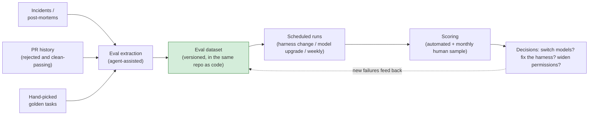
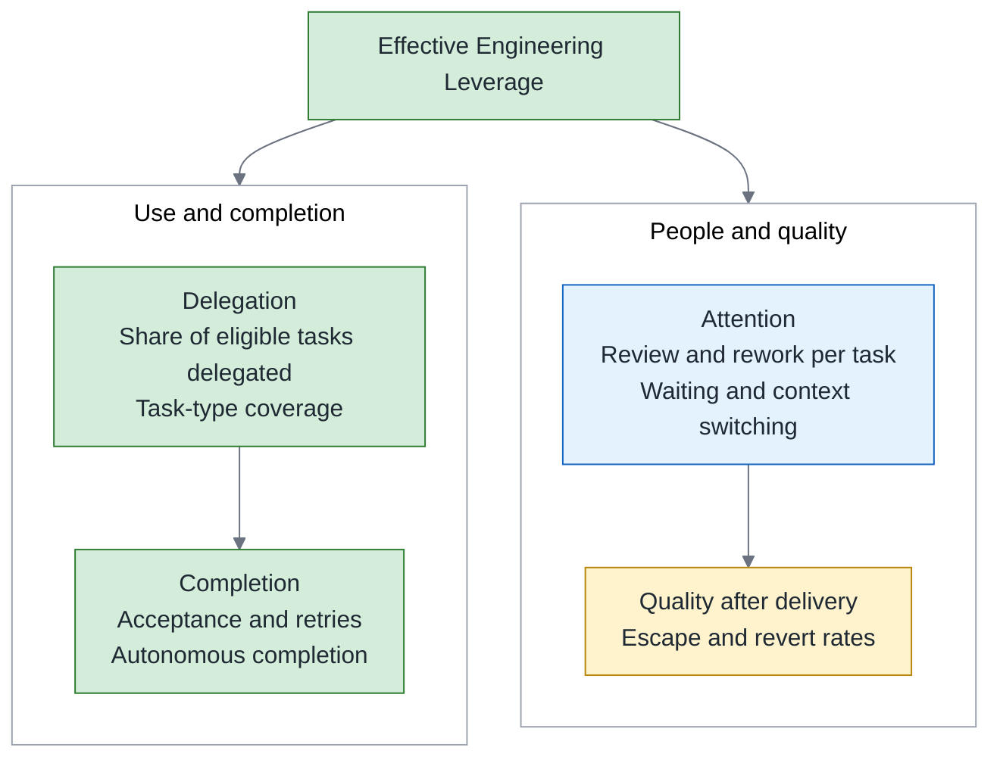
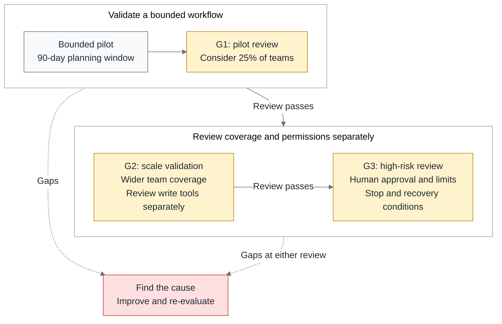

# Agentic Engineering, Part 3 — Evals, Unit Economics, and Scaling: Running Agents Like a Product

> **TL;DR** — The final part covers the decisions that follow a working environment: how to assess agent performance, what completing a task costs, and when to expand use. It develops eval dataset maintenance, cost models and model routing, metrics that need to be read together, post-pilot scaling gates, and vendor management. Counts and thresholds are starting suggestions. Teams need to adjust them to task risk, sample size, and observed results to turn an adoption effort into an internal product with continuing ownership.

> Series: [Overview](https://fantasybz.medium.com/dont-build-your-own-devin-org-strategy-and-a-90-day-blueprint-for-agentic-engineering-8187e7ec80f9) → [1. Org Design](https://fantasybz.medium.com/agentic-engineering-part-1-who-does-this-platform-plus-federation-in-practice-92343384d987) → [2. The Harness Blueprint](https://fantasybz.medium.com/agentic-engineering-part-2-the-harness-blueprint-making-your-system-legible-to-agents-3facc281f633) → **3. Evals and Unit Economics (this piece)**

---

## 1. Run agentic capability as an internal product

Treat the platform’s paved road as an internal product used by domain teams. Its value depends on whether engineers can delegate suitable tasks, receive acceptable results, and find reason to keep using it. If trying the agent creates substantial cleanup work, returning to a manual workflow may be reasonable. The platform team needs to understand that choice.

The paved road is the platform’s maintained default path, integrating environments, permissions, and verification. Teams with special requirements can propose exceptions, with explicit maintenance ownership, risk assessment, and a way to preserve necessary checks.

From this perspective, procurement is the starting point. Ongoing operations need to answer at least four questions:

- **Effectiveness.** Which tasks were delegated, which passed acceptance, and how much human help did they need? Evals and usage records need to answer together.
- **Unit economics.** Including failures and retries, what did each accepted task cost?
- **Expansion.** Which new tasks or teams does the evidence support, and which gaps need attention first?
- **Vendor choice.** When prices, capabilities, or policies change, is there a verified alternative the organization can afford?

The sections below connect these questions to one decision: whether the next investment should expand use or improve the current workflow.

Evals come first because later comparisons need a shared basis. An eval dataset is a maintained set of tasks, each with the required context, acceptance criteria, and scoring method. It allows models and harness versions to be assessed under comparable conditions.

The overview treats the eval dataset as an asset that can accumulate value. That value comes from clarifying what counts as acceptable work and turning failures into repeatable checks. Requirements, systems, and risks change, however. The dataset needs maintenance too; an old answer cannot remain authoritative indefinitely.

When a new model or pricing plan appears, this basis lets the team compare options against its own workload. Evaluation still takes time and money, but the team does not have to start again with a vendor demonstration and a guess.

---

## 2. Building the eval framework

### Where the dataset comes from

“Where do evals come from?” is a practical first question. I would begin with engineering history: incidents worth reproducing, PRs that exposed judgment gaps, and everyday tasks that represent the team’s work. These are raw materials that still need preparation and verification before becoming useful cases.

The diagram connects case preparation, version control, execution, scoring, and decisions, with a path for adding newly discovered failures back to the dataset:



That feedback path lets everyday use expose gaps in the evals. Existing cases can protect known behavior; new ones reflect changes in work and risk. Both require maintenance. Running the same cases more often does not keep them representative on its own.

For each source, I would check different conditions:

- **Incidents.** Reconstruct the symptoms, version, and necessary data available at the time, and confirm that the environment can reproduce the problem. Keep the root cause and repair answer on the scoring side, outside the evaluated agent’s context.
- **PR history.** Rejected PRs and review comments can reveal failure patterns, but the review itself needs verification. Approved PRs also need independent outcome checks; having been merged does not make a patch a correct answer.
- **Hand-picked tasks.** Start with perhaps 10–20 representative bug fixes, small features, and refactors, fixing inputs and acceptance criteria. That is a suggestion for establishing the process; expand the sample to reflect actual work.

### What an eval case looks like

I would record provenance, context, expected results, and scoring in structured fields so cases can be versioned and reviewed. The payment timeout below is fictional and illustrates the format. Its date, repo, and root cause do not refer to an incident cited in this article, and the schema is not an executable eval framework:

```yaml
# evals/cases/payment-timeout-fix.yaml (fictional example)
id: payment-timeout-fix
source: example-incident-2026-04-18 # illustrative ID, not a real incident
context:
  repo: shop-backend
  entry: "Intermittent 504s at checkout, trace ID attached"
expected:
  root_cause: "connection pool ceiling"
  candidate_files: ["internal/db/pool.go"] # clues, not the only valid edit location
  tests_added: true
scoring: rubric                    # rubric / exact / llm_judge
```

`source` should explain where a case came from. Deliberately constructed cases are also useful when labeled as such. Keep `expected` on the scoring side to avoid leaking answers. The candidate file is an investigation clue, not a rule that a correct fix must touch it. Likewise, `tests_added: true` establishes only that tests were added; review must still establish whether they detect the original defect.

### Three tiers, each with a job

I would organize evals into three tiers by purpose. These counts and cadences are starting suggestions, not industry standards; adjust samples to task types, risk, and execution cost:

| Tier | Count | When it runs | The question it answers |
|---|---|---|---|
| **Smoke** | 5–10 | Every harness change | Did we break the basics? |
| **Golden** | 20–50 | Weekly, plus every model upgrade | Did core capability regress? |
| **Frontier** | 10–20 | Monthly | Where is the capability boundary now? Should we widen permissions? |

Frontier cases explore valuable tasks that are not yet reliable, helping the team observe whether a new version extends capability. Results can inform a permissions discussion, but cannot authorize high-risk operations by themselves. Environmental restrictions, incident handling, and recovery capability need examination too.

### Three traps in LLM-as-judge

Start scoring with directly checkable methods such as tests, output comparisons, and policy checks. For explanations or tasks with several valid solutions, another model can help score against a rubric: LLM-as-judge. Before adopting it, I would address three risks:

1. **Presentation can influence scores.** Length and confidence may conceal factual errors. Require checkable evidence in the rubric, such as test results, support for the root cause, and corrected behavior, rather than a vague overall score.
2. **The judge and evaluated model may share blind spots.** Models can have different biases. A different family or a second judge adds a comparison signal without guaranteeing independence or correctness. Resolve disagreements against the evidence.
3. **Judge drift.** Changes to the scoring model, prompt, or rubric can change what a score means. Record versions and settings, and reassess a human-labeled set whenever they change.

Human sampling is an essential calibration source, with an explicit rubric and a process for disagreements. I would begin with 10 cases each month, covering successes, failures, and judge disagreements, then expand according to risk. Ten is a starting sample, not assurance that rare errors are covered. Human ratings also need periodic comparison and discussion.

Automation reduces repetitive scoring work; human checks help expose gaps between the scoring standard and actual needs. The objective is an assessment that supports decisions, rather than the elimination of human involvement.

---

## 3. Unit economics: the cost model and model routing

### Anatomy of a single run

Define the accounting scope first. Direct run costs may include model usage, sandbox compute, observability, and storage. Their shares depend on tasks, caching, pricing, and duration, so calculate them from your own bills and execution records.

Then connect all attempts for each task. Here, **cost per successful task** means the direct costs included in the reporting period divided by the number of accepted tasks. The numerator includes failures, retries, and abandoned tasks. If no task passes, report total spend and zero completions rather than a zero unit cost. For an overall economic comparison, report human review, rework, and platform maintenance separately.

- **Retry cost depends on actual attempts.** Suppose every attempt costs `c`, a task can have at most one additional attempt, and final acceptance rate and task mix remain unchanged. Reducing the share of tasks needing a retry from 30% to 10% lowers average cost from `1.3c` to `1.1c`, a reduction of about 15.4%. This is only an illustration. Real retries can differ in duration and occur several times, so retry rate alone cannot establish savings.
- **Match context to task needs.** Reading a large amount of irrelevant material for a one-handler change can increase both cost and the burden of interpretation. The technical piece’s layered instructions and explicit links help supply relevant information. Do not remove background needed for verification merely to reduce token count.

### The model routing matrix

Model routing selects an appropriate model or execution tool for a task. The platform team can maintain shared routing and records while domain teams supply risk and acceptance criteria. Together, they use evals to decide which combinations are suitable. This judgment needs revisiting as workloads and versions change.

The table lists conditions I would examine first. Price or model tier can identify options; performance on the relevant work must support the choice:

| Task type | Selection principle | Checks to retain |
|---|---|---|
| Planning, architecture analysis | Compare reasoning and constraint understanding on representative evals | Human decisions on material architecture and risk |
| Bulk code generation | Choose a model meeting acceptance requirements at suitable cost | Tests, review, and edit-scope limits |
| Tests, lint, other deterministic checks | Execute the tool directly; an LLM is usually unnecessary | Verify execution status and result completeness |
| Review, security analysis | Select for detection performance and error patterns | Dedicated checks, high-risk human review, and runtime restrictions |

Planning and review deserve substantial validation: one shapes the work, while the other can influence acceptance. Using the strongest model still does not guarantee a correct judgment or give it final approval authority.

### Budget guardrails

Budget guardrails should leave room for learning while exposing uncontrolled consumption early. I would set both team-level and per-run limits:

- **Team quotas and staged alerts.** Allocate enough budget to conduct the pilot, notify owners as limits approach, and adjust based on task needs and evidence already collected. Early flexibility still needs an overall ceiling.
- **A run-level kill switch.** Pause when a run exceeds its cost or attempt limit. For example, $20 might be an initial review point for one pilot task class. Set limits by workload and account for delayed charges and requests still in flight. An owner should decide whether continuing is justified.
- **Track unit cost from the pilot onward.** Compare similar tasks on human effort, quality, and completion as well. Explain first-year learning costs separately, including what improvement they produced, rather than postponing accounting until year two.

A cost-only target can encourage removing necessary verification or excluding human cleanup from the accounting. Read cost together with quality, completion, and human effort to establish whether the workflow improved.

---

## 4. The metric tree and how each metric gets gamed

The overview describes engineering value through four dimensions; here they become measurable indicators. Delegation is the share of eligible tasks assigned to an agent to attempt. Completion uses those delegated tasks as its denominator and counts those that pass acceptance. Keeping them separate distinguishes the scope of use from the ability to finish.



Read these four dimensions together rather than multiplying them into a score. Human effort includes review, correction, investigation, and the burden of waiting; quality also requires observation after delivery. Here, escape rate means the share of delivered changes in which defects are discovered after delivery. Comparisons need the same observation window and defect definition. A short period with no discovered defect does not establish that none exists.

Metrics also change behavior. When a single number becomes a performance target, people may prioritize work that improves it without intending any harm. Preserve task mix and quality signals in the report so that a change in selection is not mistaken for a capability gain:

| Metric | Possible distortion | Companion check |
|---|---|---|
| Task delegation rate | Splitting tasks or changing eligibility to improve the count | Fix task units and denominator; segment by type and difficulty |
| Review minutes per PR | Shorter review followed by more rework | Read alongside escapes, reverts, and rework time |
| Completion rate | Delegating easier tasks | Preserve task mix; use golden and frontier evals |
| Escape rate | Missing defect reports or too short an observation window | Define defect categories and observation windows, include SLO, security, and business correctness, and audit reporting completeness |

My principle is to **read speed and cost alongside quality and human effort**. If review time falls while more colleagues handle rework after delivery, the improvement may exist mainly in the report. Bringing that burden into the same discussion keeps it connected to the work people actually experience.

---

## 5. After day 90: scaling gates

The overview proposes a bounded pilot with selected teams, a measured baseline, and an initial eval set. At the scheduled review, a company-wide rollout is only one possible next step. Addressing identified problems and observing for longer may be the better decision.

I would use gates to organize evidence for expansion, while approving team coverage and operating permissions separately. The 25%, 15%, and six-month observation period below are discussion starting points to adjust for risk, sample size, and task mix. Meeting them makes a proposal ready for review; it does not grant permission automatically:

| Gate | Evidence to examine | Possible next step |
|---|---|---|
| **G1: pilot review** | Two teams continue using it; evals execute; quality and human burden are acceptable against a comparable baseline | Expand in stages, perhaps initially to 25% of teams |
| **G2: scale validation** | Retry causes are traceable, with < 15% as an initial discussion threshold; escapes have not worsened; champions have time and support | Increase team coverage; review individual write tools separately |
| **G3: deeper authorization** | Target-task evals, attack scenarios, and recovery drills pass; review audit history, perhaps over six months, beyond the absence of major incidents | Review specific high-risk operations, retaining human approval, limits, and stop mechanisms |

Before review, define how continuing use and adequate support will be established, and record each metric’s denominator and observation period. Six incident-free months may reflect low volume or an unencountered failure mode. They do not prove safety. Dangerous tools reach production or the outside world, so each operation needs its own scope, approver, and recovery assessment.

The diagram shows successive reviews. At every stage the team can reduce scope or return to improvement work; the calendar does not automatically open the next gate:



The return paths lead to improvement work. Pausing expansion is a valid decision; the next task is to turn the reason for that pause into a concrete correction and verification plan.

The first principle is **diagnose before scheduling a fix**. A failed gate may involve the harness, model, task selection, or organizational support. Use execution records and cases to identify the gap, assign an owner, and choose which checks to repeat. Moving the date by another quarter does not resolve the cause.

The second is **expand at a pace supported by evidence and operational capacity**. A roadmap can schedule a review without supplying its approval rationale. Each new stage still needs stop, recovery, and reassessment conditions, with continuing observation of new teams and tasks.

These decisions need traceable evals, usage records, and incident evidence. The same basis also helps compare vendors, so a change need not become another adoption effort starting from nothing.

---

## 6. Managing vendors

Vendor management should preserve choices while making the cost of maintaining them visible. I would divide the work into three parts:

- **Prepare a verifiable alternative.** When resources allow, retain a primary vendor and a candidate. Run comparable evals and record authentication, tool compatibility, data policy, and migration costs. A second account alone does not make switching practical.
- **Evaluate model changes in stages.** Run golden and frontier evals first, comparing acceptance, full costs, and new failure modes. If results are acceptable, use a low-risk, comparable workload for a canary. Twenty percent for two weeks may suit one experiment, but event counts and risk should determine scope and duration. Expand only when predefined conditions pass and recovery has been verified.
- **Check both contracts and actual settings.** Establish whether code and transcripts are used for training; data and log locations, retention, and deletion; rate limits, SLA, and pricing. Evaluate long-term price commitments alongside minimum usage, termination, and migration restrictions.

An alternative may not be cheap, and it need not continuously serve production traffic. What matters is knowing the work a switch requires, who can perform it, and whether the organization will fund it. That makes decisions about price or policy changes actionable.

---

## 7. Closing the series

Returning to the overview, the series argues for preserving the organization’s ability to understand and improve its own engineering workflow:

> **Buy the intelligence. Build the environment. Own the feedback loop.**

“Who Does This?” establishes responsibilities and support. “The Harness Blueprint” develops an environment where work can be performed and verified. This operations piece makes results and costs subject to continuing review. Maintaining all three helps users find support when something goes wrong and helps the platform team decide what to improve next.

If I could begin with only three things, I would choose a pilot with an owner, measure a comparable baseline, and establish ten verified eval cases. At review time, bring usage, human burden, and quality results together to decide whether to improve, expand, or stop an unsuitable workflow. Elapsed time is not the outcome. What the team can explain about what it learned is the basis for its next decision.

---

### The series

1. [Overview: Don't Build Your Own Devin](https://fantasybz.medium.com/dont-build-your-own-devin-org-strategy-and-a-90-day-blueprint-for-agentic-engineering-8187e7ec80f9)
2. [1. Org Design: who does this? Platform plus federation in practice](https://fantasybz.medium.com/agentic-engineering-part-1-who-does-this-platform-plus-federation-in-practice-92343384d987)
3. [2. The Harness Blueprint: making your system legible to agents](https://fantasybz.medium.com/agentic-engineering-part-2-the-harness-blueprint-making-your-system-legible-to-agents-3facc281f633)
4. **3. Evals, Unit Economics, and Scaling (this piece)**

---

### References

1. Anthropic — [Effective harnesses for long-running agents](https://www.anthropic.com/engineering/effective-harnesses-for-long-running-agents)
2. Google — [2025 DORA report: How are developers using AI?](https://blog.google/innovation-and-ai/technology/developers-tools/dora-report-2025/)
3. Stack Overflow — [Agents on a leash: Agentic AI remains mostly monitored at work](https://stackoverflow.blog/2026/05/27/agents-on-a-leash-agentic-ai-remains-mostly-monitored-at-work/)
4. Anthropic — [Demystifying evals for AI agents](https://www.anthropic.com/engineering/demystifying-evals-for-ai-agents)

---

### On how this piece was made

The initial concept and chapter structure are the author's; the prose was drafted in collaboration with AI (Claude), then reviewed and revised section by section by the author before publication. The views and judgments are the author's own, as is responsibility for the content.

---

*Originally published in Chinese: [中文版](https://fantasybz.medium.com/agentic-engineering-%E4%B8%89%E9%83%A8%E6%9B%B2-%E4%B8%89-eval-%E5%96%AE%E4%BD%8D%E7%B6%93%E6%BF%9F%E8%88%87%E8%A6%8F%E6%A8%A1%E5%8C%96-%E6%8A%8A-agent-%E7%95%B6%E7%94%A2%E5%93%81%E7%87%9F%E9%81%8B-d6d9623c2dc6). Also on [Medium @fantasybz](https://medium.com/@fantasybz) — if you're taking Agentic Engineering from pilot to scale, I'd like to hear from you.*
