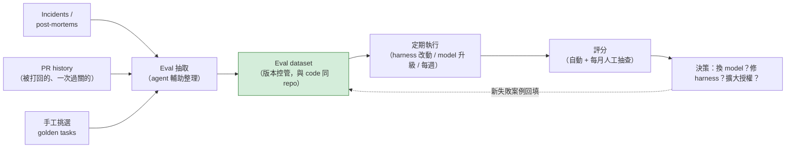
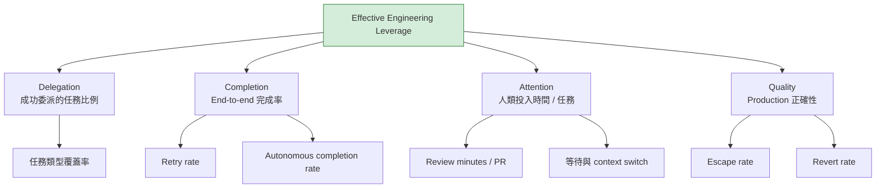
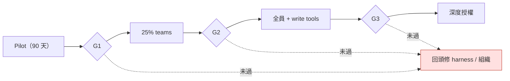

# Agentic Engineering 三部曲（三）：Eval、單位經濟與規模化—把 agent 當產品營運

> **TL;DR** — 三部曲最終篇。Runtime 用買的、組織照第一篇組、harness 照第二篇蓋，然後呢？多數導入死在「然後」：沒有 eval 所以換不換 model 靠感覺、沒有成本模型所以 CFO 半年後來砍預算、沒有反作弊的指標所以數字漂亮但沒人變快。本篇給出完整的營運層：eval dataset 的實作 pipeline 與分級、單位經濟與 model routing、指標樹與每個指標的反作弊設計、pilot 之後的 scaling gates，以及 vendor 管理的決策流程。

> 系列導覽：[總論](https://fantasybz.medium.com/%E5%88%A5%E6%80%A5%E8%91%97%E6%89%93%E9%80%A0%E4%BD%A0%E7%9A%84-devin-agentic-engineering-%E7%9A%84%E7%B5%84%E7%B9%94%E7%AD%96%E7%95%A5%E8%88%87-90-%E5%A4%A9%E8%A1%8C%E5%8B%95%E8%97%8D%E5%9C%96-7342ababc417) → [一、組織篇](https://fantasybz.medium.com/agentic-engineering-%E4%B8%89%E9%83%A8%E6%9B%B2-%E4%B8%80-%E8%AA%B0%E4%BE%86%E5%81%9A-platform-federation-%E7%9A%84%E7%B5%84%E7%B9%94%E8%A8%AD%E8%A8%88%E5%AF%A6%E5%8B%99-9d9353ef7f3a) → [二、技術篇](https://fantasybz.medium.com/agentic-engineering-%E4%B8%89%E9%83%A8%E6%9B%B2-%E4%BA%8C-harness-%E8%97%8D%E5%9C%96-%E6%8A%8A%E7%B3%BB%E7%B5%B1%E8%AE%8A%E6%88%90-agent-%E8%AE%80%E5%BE%97%E6%87%82%E7%9A%84%E5%9C%B0%E6%96%B9-f2a139f5b561) → **三、營運篇（本篇）**

---

## 一、把 agentic capability 當內部產品營運

先做一個視角轉換：你的「產品」是 paved road，「客戶」是 domain teams，「營收」是被成功委派的任務，「流失」是工程師試了兩次失敗之後，悄悄回去手寫。

paved road 是平台鋪好的那條預設路徑，照著走，環境、權限與驗證都已經接好。不走也可以，只是要自己扛。

視角一換，要處理的事情就跟著換了：它不再是工具採購，而是產品管理。四件事：

- **量測**：哪些任務真的被委派成功了？這是 eval 與指標的工作。
- **單位經濟**：一次成功委派花掉多少錢？這就是 cost per successful task。
- **成長策略**：什麼時候該擴大授權、什麼時候該停下來修平台？這是 scaling gates。
- **供應鏈管理**：主力 vendor 的價格或政策一變，你得換得掉。這是 vendor 策略。

本篇依序處理這四件事。

先講為什麼 eval 排第一。所謂 eval dataset，是一組你自己維護的任務題庫，每一題都附好 context 與驗收條件，讓你用同一份題目去量不同的 model、不同版本的 harness。

總論的判斷是：**eval dataset 是唯一會複利的資產**。這句話要拆成兩半讀。一半是會過期的東西：model 每半年一代，harness 的假設不斷過時。另一半不會過期：「你的工作負載上什麼叫做對」這件事，累積下來就是你的護城河。

所以市場每次 model 升級、每場 vendor 價格戰，都讓它增值一次：因為只有你能在一天內用自己的 eval 驗證新選項，別人只能讀 benchmark 用猜的。

---

## 二、Eval Framework 的完整實作

### Dataset 從哪裡來

多數團隊卡在第一步：「eval 要從哪來？」我的答案是：先不要把它想成一個從零開始的研究專案。你的工程歷史裡已經有大量現成材料，缺的只是一條把它們回收成 case 的 pipeline。

這張圖要看的是材料怎麼進來、又怎麼流回自己：



圖上最容易被略過的，是最後那條回填的虛線。少了它，eval 就只是一份會慢慢過期的考古題：跑得再勤，也只是在重複驗證你早就修好的問題。

三個來源各有特性：

- **Incident 回收**：每份 post-mortem 都是現成的 case。把當時的 context 與症狀交給 agent，它找不找得到 root cause？這類 case 最貴也最真實。
- **PR history 回收**：被 reviewer 打回的 agent PR，連同那則 review comment，是最真實的 negative example。一次過關的則是 golden path，用來確認基本盤有沒有退步。
- **手工 golden tasks**：挑 10–20 個有代表性的已完成任務（bug fix、小 feature、refactor 各幾個），固定 context 與驗收條件。這一批是你唯一完全可控的樣本，值得花時間慢慢挑。

### Eval case 的形狀

Case 我會用宣告式格式寫，而不是留一段自然語言 prompt 讓每個人各自解讀。宣告式的意思是把出處、context、期望結果與評分方式拆成固定欄位、各自寫清楚，這樣它才能跟 code 被同樣對待：一起版本控管、一起 review。

```yaml
# evals/cases/payment-timeout-fix.yaml（節錄）
id: payment-timeout-fix
source: incident-2026-04-18        # 出處可追溯
context:
  repo: shop-backend
  entry: "使用者結帳偶發 504，附 trace id"
expected:
  root_cause: "connection pool 上限"
  fix_touches: ["internal/db/pool.go"]
  tests_added: true
scoring: rubric                    # rubric / exact / llm_judge
```

這份 case 裡最該守住的是 source 那一欄。每個 case 都指得回一件真的發生過的事：一次 incident、一個 PR、一個做完的任務。這樣 eval 才不會慢慢變成一份自己出給自己的模擬考。

### 三級 eval，各司其職

Eval 不必也不該只有一組，三級各自回答不同的問題，也各有自己的節奏：

| 級別 | 數量 | 執行時機 | 回答的問題 |
|---|---|---|---|
| **Smoke** | 5–10 | 每次 harness 改動 | 有沒有把基本盤弄壞？ |
| **Golden** | 20–50 | 每週 + 每次 model 升級 | 核心能力有沒有回歸？ |
| **Frontier** | 10–20 | 每月 | 能力邊界推進到哪？該不該擴大授權？ |

三級裡最容易被省略的是 Frontier，原因很好懂：它不保護今天的流程，一個月不跑也不會有人痛。但它回答的是最值錢的問題：**agent 現在做不到的事，下一版 model 做到了沒**。這個問題直接決定授權範圍要不要放寬，也就是第五節那組 gates 的輸入。

### LLM-as-judge 的三個陷阱

Case 一多，人工評分就跟不上了，所以量大之後一定會用 LLM 當評審：讓另一個 model 照著 rubric 給分，這就是 LLM-as-judge。它可以用，但三個坑先講：

1. **Judge 偏好長答案與自信語氣**。Rubric 要綁事實項：測試過了嗎、改的檔案對嗎、root cause 對嗎，而不是「整體品質 1–10 分」。
2. **同家族偏袒**。Judge 與被評的 model 同一家族時會偏心。解法是用不同家族的 model 當 judge，或雙 judge 取交集。
3. **Judge drift**。Judge 用的 model 也會升級，昨天的 85 分和今天的 85 分可能不是同一件事。Judge 的 model 版本也要 pin 住，每次變更都要記錄。

校準的錨只有一個：**每月一次、抽 10 個 case 的人工評分**，拿它跟 judge 的分數對照。Judge 自己也在變，你需要一個不會跟著漂的參考點。

全自動 eval 是目標，不是起點。沒有人工錨的自動評分，飄掉了你也不會知道。

---

## 三、單位經濟：成本模型與 Model Routing

### 一次 run 的成本解剖

談成本之前先把一筆帳拆開，不然討論很容易停在「agent 好貴」這種印象上。一次 autonomous run 的成本 = model tokens（通常佔 60–80%）+ sandbox 運算（10–25%）+ 週邊（觀測、儲存）。

花費從幾十美分到幾十美元不等，而決定因素不是任務難度，是兩個浪費源：

- **Retry tax**：失敗重試的成本。Retry rate 從 30% 降到 10%，總成本直接砍兩成以上—而 retry rate 高的根因，九成在 harness 的 context 與 feedback 層（第二篇），不在 model。**Retry 燒掉的錢，是 harness 品質的稅。**
- **Context 肥大**：把整個 repo 塞進 context 的懶惰做法。假設一個只改一支 handler 的小任務，agent 卻先把整包 repo 讀過一遍，光讀完就吃掉大半預算，真正要動手的地方反而分不到注意力。第二篇的三層 AGENTS.md 與「repo 層 100 行」紀律，就是 context 的減肥方案。

### Model routing 矩陣

Model routing 就是替每一類工作事先指定 model 等級，而不是全公司一律用最強的那一顆。判斷依據是錯誤成本與可驗證性，這種判斷放在 platform 層（第二篇的 gateway）只需要做一次，各 team 不用自己決定。

任務類型與層級都會隨著 model 世代改變，理由不會：

| 任務類型 | 建議層級 | 理由 |
|---|---|---|
| Planning、架構判斷 | 最強 model | 錯誤成本最高，一次做對 |
| 大量 code 生成 | 中階 model | 有 tests 兜底，量大 |
| Eval 執行、lint 類 | 便宜 model | 高頻、低風險 |
| Review、安全判斷 | 最強 model | 最後防線不省錢 |

表裡最重要的是頭尾兩列：planning 與 review 都指定最強的 model。一個是最前面的決策、一個是最後一道防線，在這兩處省下來的錢，多半會在後面以 retry 或 escape 的形式還回來。

### Budget guardrails

Budget guardrails 是花錢的護欄。前兩條防的是沒有人看著的時候，一次意外燒掉整季的預算，第三條防的是看錯數字：

- **Per-team quota + 超額 alert**：先觀察，不硬斷—初期的用量分布資訊，比省下的錢更值錢。
- **Run-level kill switch**：單次 run 超過成本上限（例如 20 美元）自動暫停、要求人工確認。它是對付 runaway retry loop 的保險絲：agent 卡在同一個錯誤上重試一整夜，帳單不該等到月底才被看見。
- **Cost per successful task 看趨勢，不看絕對值**：第一年是學費期（組織篇的預算敘事），第二年才拿它跟人力成本做比較。

成本這條線只要單獨拉出來考核，就一定會被壓到好看為止。

---

## 四、指標樹與反作弊

總論給了 North Star 的公式，這裡展開成可以量測的 metric tree。看這張圖的時候，重點不是四個分支各叫什麼名字，而是每個分支底下都掛著可以量的東西：



這棵樹的形狀就是它的紀律：四個分支缺一個，剩下三個就會開始說謊。只盯 Delegation 與 Completion，你會拿到一份很好看、但沒有人變輕鬆的報表。

每個指標都會被 game—不是因為有人惡意，而是 Goodhart's law 的日常運作：一個指標一旦變成考核目標，它就不再是好指標。設計指標的時候就要同時配好解藥：

| 指標 | 會被怎麼 game | 對策 |
|---|---|---|
| % tasks delegated | 把大任務拆小灌件數 | 搭配「任務類型覆蓋率」，看廣度不看件數 |
| Review minutes / PR | Rubber stamp 快速放行 | 與 escape / revert rate 成對讀 |
| Completion rate | 只委派簡單任務 | Frontier evals 追蹤能力邊界有沒有前進 |
| Escape rate | 出事不開 incident | Incident 定義綁 SLO，不綁人的判斷 |

原則一句話：**指標成對出現—速度指標必配品質指標**。單獨考核任何一個數字，你就會得到那個數字，以及它背後被犧牲的一切。這是 DevOps 時代 vanity metrics 的 2.0 版教訓。

---

## 五、90 天之後：Scaling Gates

總論給了前 90 天的行動藍圖（選 pilot、量 baseline、建 eval）。Pilot 結束後，最常見的錯誤是宣布成功、全面推廣。

規模化要用 gate 制，意思是每道門檻先把量化條件寫死，過了才解鎖下一步。門檻愈往後，agent 能碰的東西愈危險：

| Gate | 過關條件 | 解鎖 |
|---|---|---|
| **G1：Pilot 結業** | 2 個 teams 穩定使用；eval 就緒；對照 baseline 有感改善 | 擴大到 25% teams |
| **G2：規模驗證** | Retry rate < 15%；escape rate 持平；champions 體系自轉 | 全部 teams + 開放 write 級 tools |
| **G3：深度授權** | Frontier evals 連續穩定；audit 半年無重大事件 | Dangerous tools 白名單、多步 autonomous run |

三道門的條件都要寫成可以驗的東西。Retry rate、escape rate 這類直接是數字，「穩定使用」「體系自轉」則要事先講好怎麼算，不能停在「大家覺得還不錯」。最後那格寫的 Dangerous tools，指的是動得到 production、也動得到外部世界的那些 tool。做錯了收不回來，所以排在最後。

把三道門畫成流程：



三條虛線最後都通往同一個地方，這是刻意的。

第一條：**卡住就回頭修，不硬推**。G2 過不了，通常是 harness 問題（第二篇），G3 過不了，通常是 guardrails 與 eval 覆蓋問題，這兩種都不是再推一季就會自己好的東西。

第二條：**擴張速度由 eval 與 escape rate 決定，不由 roadmap 決定**。Roadmap 上寫著 Q3 全面導入，不構成 G2 自動過關的理由。

這兩條紀律都預設了同一件事：你隨時拿得出 eval 的結果當證據。同一份證據，也決定了你跟 vendor 怎麼談。

---

## 六、Vendor 管理

Vendor 這一節要盯的東西不多，三件而已：

- **雙 vendor 是常態**：一個主力、一個挑戰者。這不是不信任，是議價結構—你的 eval dataset 讓「讓挑戰者試試」變成一天的事，這正是第一節說的複利在兌現。
- **換 model 的決策流程**：新 model 發布 → 跑 golden + frontier evals → 看三件事：pass rate 變化、cost per task 變化、**新出現的失敗模式**（最容易被忽略）→ 用 20% workload 做兩週 canary → 全量。這條流程只做一件事，就是把「換不換」從感覺題拉回證據題。永遠不要因為 benchmark 分數或 demo 換 model。
- **合約要盯的四件事**：你的 code 與 transcript 是否被用於訓練、log 的保存位置與期限、rate limit 與 SLA、以及價格保護：token 單價波動大，能鎖一年就鎖一年。

這三件事合起來，是為了讓「換掉任何一家」永遠是你付得起的選項。

---

## 七、系列收尾

三部曲收在總論的同一句話：

> **Buy the intelligence. Build the environment. Own the feedback loop.**

組織（第一篇）決定誰來做；harness（第二篇）決定 agent 能不能做好；營運（本篇）決定你知不知道它做得好不好、值不值得繼續加碼。三者都不是一次到位的工程，是持續經營的內部產品。

如果只能從三件事開始：**量 baseline、挑 pilot、建前 10 個 eval cases**。九十天後，你就有資格用證據而不是 vibes，做下一個決策。

---

### 系列文章

1. [總論：別急著打造你的 Devin](https://fantasybz.medium.com/%E5%88%A5%E6%80%A5%E8%91%97%E6%89%93%E9%80%A0%E4%BD%A0%E7%9A%84-devin-agentic-engineering-%E7%9A%84%E7%B5%84%E7%B9%94%E7%AD%96%E7%95%A5%E8%88%87-90-%E5%A4%A9%E8%A1%8C%E5%8B%95%E8%97%8D%E5%9C%96-7342ababc417)
2. [一、組織篇：誰來做？Platform + Federation 的組織設計實務](https://fantasybz.medium.com/agentic-engineering-%E4%B8%89%E9%83%A8%E6%9B%B2-%E4%B8%80-%E8%AA%B0%E4%BE%86%E5%81%9A-platform-federation-%E7%9A%84%E7%B5%84%E7%B9%94%E8%A8%AD%E8%A8%88%E5%AF%A6%E5%8B%99-9d9353ef7f3a)
3. [二、技術篇：Harness 藍圖—把系統變成 agent 讀得懂的地方](https://fantasybz.medium.com/agentic-engineering-%E4%B8%89%E9%83%A8%E6%9B%B2-%E4%BA%8C-harness-%E8%97%8D%E5%9C%96-%E6%8A%8A%E7%B3%BB%E7%B5%B1%E8%AE%8A%E6%88%90-agent-%E8%AE%80%E5%BE%97%E6%87%82%E7%9A%84%E5%9C%B0%E6%96%B9-f2a139f5b561)
4. **三、營運篇（本篇）**

---

### References

1. Anthropic — [Effective harnesses for long-running agents](https://www.anthropic.com/engineering/effective-harnesses-for-long-running-agents)
2. Google — [2025 DORA report: How are developers using AI?](https://blog.google/innovation-and-ai/technology/developers-tools/dora-report-2025/)
3. Stack Overflow — [Agents on a leash: Agentic AI remains mostly monitored at work](https://stackoverflow.blog/2026/05/27/agents-on-a-leash-agentic-ai-remains-mostly-monitored-at-work/)

---

### AI 協作說明

本文由筆者提出初步構想與章節架構，文字撰寫由 AI（Claude）協作完成，再經筆者逐節校閱與修訂後定稿。文中觀點與判斷為筆者所持，文責亦由筆者自負。

---

*本文發表於 [Medium @fantasybz](https://medium.com/@fantasybz)。英文版：[English edition](https://fantasybz.medium.com/agentic-engineering-part-3-evals-unit-economics-and-scaling-running-agents-like-a-product-1cb1855a2046)。若你正在把 Agentic Engineering 從 pilot 帶到規模化，歡迎交流。*
