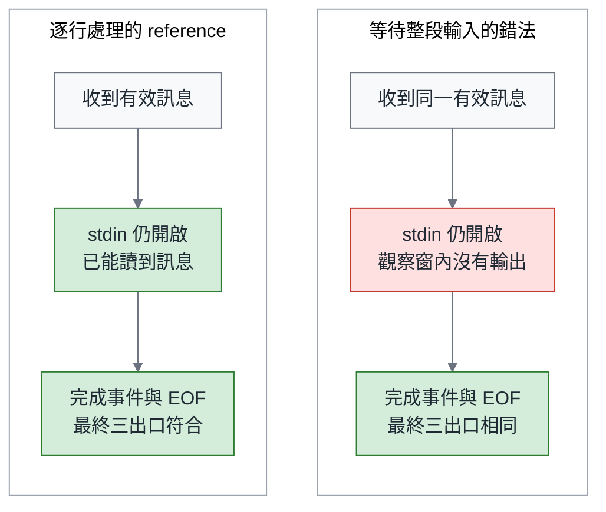

# 同一份規格，跑十次（二）：契約篇—把要求變成驗收，中間還缺哪些判斷？

> **TL;DR** — 一支工具把數字 `123` 當成審查文字，最後還回報成功。修補後，四十份程式全部通過檢查；但這次的綠燈，又看得見哪些錯誤？本篇寫給 QA、驗收工具作者與程式審查者，處理從一句要求到一個檢查之間的判斷。先用三行輸入，逐步算出應有的正常輸出、診斷與結束狀態；再放進幾份刻意改錯的程式，看量尺會不會漏掉錯誤，也會不會錯怪合法的寫法。讀者會看到：只查最後結果，可能漏掉「過程中就該送出」的訊息；只要求格式相同，也可能錯拒內容正確的 CSV。最後將要求、推導與尚未涵蓋的部分寫成義務表，讓下一位接手者知道，眼前的紅燈該修檢查、拒絕程式，還是請負責人補上一項尚未決定的要求。文中用來教學的刻意錯法與 CSV 重播，都在研究結束後才建立，不增加正式研究的模型樣本。

> 系列導覽：[總論](https://medium.com/p/6986ee29219e) → [規格篇](https://medium.com/p/fc5ed5fce443) → **契約篇（本篇）** → 變異篇（即將發布）

## 一、兩盞綠燈，各自省略了什麼

本系列研究的任務，取自我 `medium-articles` repo 裡的一支小工具：`research/scripts/codex_jsonl.py`。它讀的是 agent 的工作紀錄，格式叫 JSONL，每一行放一筆 JSON 資料。有的行帶著審查文字，有的行表示工作完成。這支解析工具（parser）要一行一行辨認，再把結果交給下一個程式，也就是呼叫端。

呼叫端會收到三種資訊：stdout 是正常的審查內容，stderr 是哪裡出了問題的診斷，exit code 則用一個數字回報整次處理的結果。本文將它們稱為三個「出口」。研究固定了一份起始版本（seed commit），從那裡重現問題：某則訊息的 `text` 是數字 `123`，後面再接一個有效完成事件。程式會把 `123` 印成審查內容，並以代表成功的 exit 0 結束。

從呼叫端看，這是一盞綠燈：程式正常結束，stdout 也有內容。但研究後來固定的行為約定，也就是本文所說的契約，要求非字串、非 null 的 `text` 視為格式錯誤，後文稱為 malformed。依這份約定，stderr 要留下一則診斷，exit 應該是 6。程式確實回傳了 0，卻沒有守住一條關鍵要求：數字不是合法的訊息。

第二盞綠燈來自研究本身。四種交代各生成十份修補程式，本文把每份待驗收的程式稱為候選。四十份候選全部通過 102 個批次案例：送完輸入，等程式結束後檢查結果。另有 1 項檢查刻意不送出輸入結束訊號 EOF，觀察程式會不會先把訊息傳出來；這就是後文的 EOF 前 streaming probe。合計 103 項檢查。

這個結果能說明多少，取決於檢查看得見什麼：輸入有沒有碰到邊界、看了哪一個出口，又在什麼時候看。本系列總論已說明，這批結果無法替四份文件排序。本篇再往下追一層：即使只談這四十份候選，「全部通過」能保證到哪裡？例如正式評分程式（grader）沒有全面檢查額外的命令列選項，也沒有完整檢查名為 `main` 的啟動介面。103 項是一組有限的檢查，仍有它沒問到的事。

我在 2026 年 8 月的模式語言驅動開發工作坊裡，也留下過同一種落差的紀錄。Method A 的 5 個測試全部通過，十六項合規清單卻只通過十項。那是一次觀察（N=1），不是本系列研究的資料。它在《綠燈不是驗收》系列裡提醒過我：測試全綠，說明的是測試問到的事；那五個測試沒有涵蓋的六項，仍要靠清單查出來。

這篇寫給 QA、驗收工具作者與程式審查者（reviewer）。你們通常拿到一句要求，例如「修正 text 型別處理」或「日期欄改成指定格式」。要把它變成一個會亮紅燈或綠燈的檢查，中間至少有六個判斷：

1. 這條要求在外部要觀察什麼？
2. 預期值怎麼推出來？
3. 用什麼依據與方法比對？
4. 這把量尺能不能拒絕已知錯法，同時接受合法差異？
5. 哪些情況它還沒涵蓋？
6. 誰負責接手這些缺口？

省略其中任何一步，綠燈就可能代表別的意思；紅燈也可能錯怪合法的候選。全文沿這六個判斷往下走：先推一題答案，再查量尺的盲點，最後把推導與缺口交給下一位接手者。

為了讓這些判斷可以重做，研究完成後另外建立了[教學 workbench](https://github.com/fantasybz/medium-articles/blob/774759192ab0e0b2da3d8b163eb3f07f3d12f4c3/research/2026-10/same-spec-ten-runs/rebuild-2026-09-28/workbench/README.md)，也就是一組可重播的程式、輸入與檢查。裡面有一份在指定案例上已核對答案的參考實作（reference），六份刻意改錯的版本，以及一份只改診斷用字的合法版本。這八份固定供測試使用的程式，後文稱為 fixture。它們沒有呼叫模型，也不替正式研究增加樣本。

## 二、oracle：誰依什麼判斷對錯，又會在哪裡看錯

假設正常輸出多印了一個 `123`，我們憑什麼說它錯？因為契約要求非字串、非 null 的訊息只能留下診斷，不能當成審查文字。這條要求和由它推出的預期，就是判斷對錯的依據；測試領域把這種依據稱為 oracle。grader 是執行判分的程式，oracle 則決定它該拿什麼當答案、容許哪些差異。

《綠燈不是驗收》總論借用 James Bach 的區分，把 checking 看成拿寫好的命題對答案、可以交給機器執行的流程。我想在這個區分上補一句：命題從哪裡來、用什麼方式比對，仍需要人的判斷。比對程式再穩定，也只會忠實套用我們交給它的標準。

總論引用過 Leslie Lamport 在 2013 年寫的短文〈Why We Should Build Software Like We Build Houses〉。他主張寫程式之前先寫規格，也認為描述可以有不同的精密程度：簡單的東西用一般文字就能說清楚，只有微妙或關鍵的部分，才值得用更精密的方法與工具。他也說明，規格不能保證程式沒有錯；要消除 coding bug，仍需要其他方法（[Lamport, 2013](https://lamport.azurewebsites.net/pubs/wired.pdf)）。

驗收需要這種精密程度的選擇。每項義務都要先推導預期，再選觀察方法。固定的診斷文字可以直接比對；exit 要先解開多項狀態的優先序；EOF 前的輸出則還需要另外安排觀察時點。這是我從他的短文延伸出的安排，不是他對測試提出的主張。

答案可以怎麼取得？有人照規格逐步算，有人找一份參考程式來算，也有人先錄下舊版輸出，當作下次不可改變的快照（snapshot）。下表比較這些來源；重點是它為什麼值得信任，又可能連哪一種錯誤一起保留下來。

| Oracle 來源 | 用途 | 盲點 |
|---|---|---|
| 依規格推導預期值 | 每個預期都說得出依據 | 未決行為推不出預期；推導本身也可能算錯 |
| reference implementation | 能快速產生大量預期輸出 | 它的偶然選擇會被當成要求，它的 bug 也會變成標準 |
| 舊版輸出（snapshot） | 保護既有的相容行為 | 連舊 bug 也一起鎖住；只保存一種合法表示 |
| 人工判斷 | 能處理規格留白與語境 | 慢、難以重複；依據沒記下來，下次就無法核對 |

若在起始版本錄下 snapshot，`123` 被印成審查內容、exit 0 的錯誤行為就會被保護下來，真正修好的候選反而變紅。reference 也有類似風險：它寫 `text must be a string or null` 說明錯誤，oracle 若要求逐字相同，一種用字便被升格成了要求。

所以本篇優先從契約獨立推導預期，讓每個答案都能追到依據，再請人複核推導。有些答案則根本還不存在。例如總論的假設 CSV 工具遇到空日期，要輸出空欄還是拒絕整筆資料？先查既有要求；若真的沒決定，就交給有權決定需求的人，也就是規格 owner。這是一項責任，不一定是另一個職稱。決定的人與理由都要記下來，測試才有依據。

oracle 可能以三種方式失準。太鬆的量尺，只要 exit 0 且 stdout 有內容就接受，會放過 `123`。太嚴的量尺，要求診斷原因逐字等於 reference，會拒絕契約允許的改寫。第三種更難發現：實作與檢查共用同一個誤解，例如兩者都把 `false` 當成沒有訊息，一起漏掉應有的診斷。

Kiro 的 Correctness 文件也指出，從需求生成測試仍可能遇到這個問題：要檢查的性質（property）太弱或寫錯，有問題的行為就可能通過；外部系統與非確定性的情況也需要其他方法（[Kiro Correctness](https://kiro.dev/docs/specs/correctness/)）。這類 property-based tests 並不等於形式驗證，第六節會用具體輸入說明。我在這裡延伸的推論是：從同一段被誤讀的需求生成實作與檢查，可能得到一致的錯誤。

EvalPlus 從另一個方向說明，量尺的保護力會改變判斷。研究者在 164 個 HumanEval Python 函式任務、26 個模型上擴充測試，找出原有測試沒辨識出的錯誤，甚至改變了模型之間的排序。同一批程式，交給保護力不同的驗收，得到了不同的結論。他們也先用前提檢查（precondition assertions）界定允許拿來測的輸入範圍，稱為輸入域，避免拿未定義輸入，處罰不同但合理的實作（[EvalPlus, arXiv 2305.01210v3](https://arxiv.org/html/2305.01210v3)，§2.3、§3）。

HumanEval 以小函式為主，與 repo 裡的工作相距很遠，測試多了也不等於完整正確；我借用的是它劃出的那條界線。放到 parser 上，`false`、`0` 與陣列這些看起來「不合法」的 `text`，正好落在契約指定的拒絕路徑上，屬於要驗收的內容。一個輸入在契約內還是契約外，要先讀要求才知道。

最後，所有測試都有前提：假設輸入落在某個範圍，在某個時間點觀察，在某種環境下執行。前提相同的測試，會一起看不見同一件事。正式研究的 102 個批次案例，都是送完輸入、關閉標準輸入 stdin，再讀取結果；只靠它們，無法得知候選會不會在輸入結束前就輸出。那 1 個 EOF 前 probe 正是為了補這個缺口，第五節再回來談。先暫時放下方法名稱，親手算一題預期值，才看得出量尺究竟該問什麼。

## 三、先讀規則，再推一次：`false` 之後還有 `after`

這一節請你自己推導一次預期值。先讀幾條規則；R02、R03 等是要求編號，讓每一步都有原文可查。讀下面這張清單時，先記住兩件事：壞資料要留下診斷，後面的好資料仍要處理。其中「實體行號」從實際輸入逐行數，空行也占一號；flush 則是立即把已寫出的資料送給呼叫端，不留在程式緩衝區。以下是本節要用的六條規則；凍結的原文見 [R01–R13](https://github.com/fantasybz/medium-articles/blob/774759192ab0e0b2da3d8b163eb3f07f3d12f4c3/research/experiments/same-spec-ten-runs/results/formal-2026-09-25/source/requirements.json)。

- **R02**：每行先解碼成 JSON。空行與無法解碼的文字會直接略過，但仍計入實體行號。解碼後若不是物件（例如 `[]`），就算 malformed。
- **R03**：每個 malformed 行都要在 stderr 留下恰好一則診斷，格式為 `[codex malformed event] line N: REASON`。N 是實體行號，REASON 是非空的單行原因。之後程式繼續讀下一行，這一行不產生其他效果（`turn.failed` 另有例外，本文用不到）。
- **R05**：agent message 的 `text` 缺值、為 null 或空字串時，不輸出，也不算發言。非空字串要原樣印出並立即 flush，只有空白的字串也算。其他非字串值，包括 `false`、`0`、陣列與物件，都算 malformed。
- **R08**：有效的 `turn.completed` 算一次完成。完成事件的 usage 欄位記錄用量；兩個 token 值都是非負整數（不含布林值 bool）時，先印一個空行，再印 `<!-- tokens: in X out Y -->`。
- **R11**：EOF 時依序判定：有明確失敗回傳 3；否則有 malformed 回傳 6；否則沒有有效完成回傳 4；否則有完成但沒有發言回傳 5；都不符合才回傳 0。這是判定順序，與數值大小和事件先後無關。
- **R12**：只有 exit 3、4、5 附上舊有的結尾摘要，0 與 6 不附。

先用最簡單的兩行輸入示範如何套用規則。第一行是 `text` 為 `"ok"` 的 agent message，第二行是 usage 為 10 與 5 的有效完成事件。第一行是非空字串，stdout 印出 `ok` 與換行，並記為發言。第二行印出一個空行與 token 註記。到了 EOF，沒有明確失敗、沒有 malformed、有有效完成，也有發言，R11 一路判定到最後一步，回傳 0；依 R12，0 不附摘要。用看得見換行的字串表示：

```text
stdout = "ok\n\n<!-- tokens: in 10 out 5 -->\n"
stderr = ""
exit   = 0
```

現在換成下面三行。請先別往下讀，替 stdout、stderr 與 exit 各寫一個預測。

```jsonl
{"type": "item.completed", "item": {"type": "agent_message", "text": false}}
{"type": "item.completed", "item": {"type": "agent_message", "text": "after"}}
{"type": "turn.completed", "usage": {"input_tokens": 10, "output_tokens": 5}}
```

逐行推導如下：

1. 第一行能解碼成物件，事件型別是字串，`item` 也是物件，所以進入 R05 的判斷。`false` 不是字串，也不是 null，因此是 malformed。依 R03，stderr 留下一則 `line 1` 的診斷；這一行不輸出、不算發言，程式繼續讀下一行。
2. 第二行的 `text` 是非空字串，stdout 印出 `after` 與換行，並記為發言。
3. 第三行是有效完成，usage 的兩個值都是非負整數，stdout 再印出一個空行與 token 註記。
4. 到 EOF 時，四個狀態分別是：沒有明確失敗、有 malformed、有有效完成、有發言。R11 先問有沒有明確失敗，答案是否；再問有沒有 malformed，答案是有，於是停在 6。依 R12，exit 6 不附摘要。

```text
stdout = "after\n\n<!-- tokens: in 10 out 5 -->\n"
stderr = "[codex malformed event] line 1: REASON\n"
exit   = 6
```

這一題有兩個容易推錯的地方。第一，JSON 的 `false` 讀進 Python 後是布林值 `False`；用 `if text:` 判斷時會走到「假」的分支，很容易被當成「沒有訊息」。R05 卻把它列為 malformed，所以 stderr 必須有一則診斷，exit 也不能是 0。第二，stdout 有正常內容，不會讓 exit 回到 0；exit 6 也不要求收回已經印出的 `after`。我的理解是，這符合串流工具的性質：已經送出的輸出收不回來，問題只能靠 stderr 與 exit 標示。

`REASON` 只要是非空的單行原因即可，契約沒有規定用字。reference 實際寫的是 `text must be a string or null`。workbench 另外做了一份合法改寫，只把原因換成 `invalid optional text: text`。它對這一題的實際輸出是：

```json
{
  "stdout": "after\n\n<!-- tokens: in 10 out 5 -->\n",
  "stderr": "[codex malformed event] line 1: invalid optional text: text\n",
  "returncode": 6
}
```

這份改寫的 stderr 與 reference 不同，卻通過了全部四個教學批次案例。這就是正對照：準備一份應該被接受的輸出，檢查量尺會不會錯拒。只要 oracle 私下把 reference 的用字當成要求，這份合法改寫就會被拒絕，問題也就浮現了。

RFC 2119 §6 提醒，規範用語應該審慎使用，不應拿來強加與互通無關的做法；RFC 8174 則補充，沒有使用大寫關鍵字的文字，仍可能具有規範效力（[RFC 2119](https://www.rfc-editor.org/rfc/rfc2119.html)；[RFC 8174](https://www.rfc-editor.org/rfc/rfc8174.html)）。這些說法屬於 IETF 的語境。我借它們說明一件事：oracle 比對的每一個細節，都等於在替契約發言。reference 的用字一旦成為比對條件，就多了一條沒有人決定過的要求。

驗收工具作者可以把這條自由寫進比對程式。下面是依 workbench 整理的比對示意，不是它的原始程式碼。初稿使用正規表示式（regex）辨認格式，卻誤收了含 CR 字元的原因文字。CR 會讓游標回到行首，本例要求的單行原因不接受它；審稿時發現後已修正，並用固定的正反字串查核，範圍見本節末尾。stdout 與 exit 要精確比對；stderr 逐行比對，契約固定的診斷字串必須逐字相同，malformed 診斷則只核對格式、行號，以及原因是否為非空的單行文字。

```python
# 比對示意（非 workbench 原始程式碼；修訂後以固定字串有限查核）
# expected 的每一項：int 代表一則 malformed 診斷及其實體行號；
# str 代表契約固定的診斷字串，必須逐字相同。
import re

MALFORMED = re.compile(r"\[codex malformed event\] line (\d+): ([^\r\n]+)")

def stderr_matches(actual: str, expected: list[int | str]) -> bool:
    if actual == "":
        return expected == []
    if not actual.endswith("\n"):
        return False
    lines = actual[:-1].split("\n")
    if len(lines) != len(expected):          # 缺行或多行都拒絕
        return False
    for line, want in zip(lines, expected):
        if isinstance(want, str):            # 固定的 legacy 診斷
            if line != want:
                return False
            continue
        match = MALFORMED.fullmatch(line)    # REASON 只要求非空、單行
        if match is None or int(match.group(1)) != want:
            return False
    return True
```

寫比對程式時，會逼出契約沒說清楚的地方。只含空白的 REASON 算不算「非空」？`line 01` 算不算第 1 行？這段示意暫採字面解讀：`[^\r\n]+` 接受只含空白的原因，`int()` 也會把 `01` 讀成 1。這兩個選擇都不該由比對程式默默決定。如果凍結的條文沒有交代，就把它們記成待決問題，交給規格 owner，並在 oracle 版本說明裡記下這項暫定解讀。

修訂後的有限查核涵蓋合法原因、固定診斷、空 stderr、缺行、多行、CR、錯行號、空原因及缺少結尾換行；這只檢查上述函式的指定輸入，沒有證明所有格式都已涵蓋，也不加入 workbench 或正式實驗的計數。

最後換你推一題。這一題不在 workbench 的案例裡；下面的答案是我依規則推出來的，沒有經過重播。

```text
第 1 行：（空行）
第 2 行：{"type": "item.completed", "item": {"type": "agent_message", "text": " "}}
第 3 行：{"type": "item.completed", "item": {"type": "agent_message", "text": 0}}
第 4 行：{"type": "turn.completed", "usage": {"input_tokens": 10, "output_tokens": 5}}
```

第 1 行是空行，依 R02 略過，但它占用了實體行號 1。第 2 行的 `" "` 只有空白，仍然是非空字串，所以 stdout 印出一個空白與換行，並記為發言。第 3 行的 `0` 不是字串，也不是 null，屬於 malformed，stderr 留下 `line 3` 的診斷。第 4 行印出空行與 token 註記。EOF 時有 malformed，所以回傳 6，不附摘要：

```text
stdout = " \n\n<!-- tokens: in 10 out 5 -->\n"
stderr = "[codex malformed event] line 3: REASON\n"
exit   = 6
```

這一題能分辨兩種常見寫法。若實作先刪掉前後空白（trim），再判斷是不是空字串，stdout 會少掉開頭那個空白與換行；但第 3 行的 malformed 還在，exit 仍是 6，所以這個錯只會出現在 stdout。若實作用真假值判斷，把 `0` 當成沒有訊息，stderr 會少掉 `line 3` 的診斷，exit 也會變成 0，stdout 反而完全正確。同一題裡，兩種錯誤寫法落在不同的出口。下一節要談的，正是這件事。

## 四、只看一個出口，會放過哪一種錯

workbench 的 8 份 fixture 分成三類，用途不同。reference 在這組已核對案例上符合預期，仍可能有尚未發現的錯。6 份刻意錯法則是反對照：準備應該被拒絕的行為，看量尺能不能攔下。它們各以一種違約行為為目標，用來確認觀察能不能把它們分辨出來；一次小改動也可能同時影響別的行為。1 份合法改寫只換掉診斷用字，用來確認 oracle 不會多加要求。

這些錯法都是事先挑定的測試裝置，不是在正式四十份候選裡發現的錯誤。因此，它們只能說明某個觀察的辨識能力，不能用來估計這些錯誤在實際工作中出現的頻率。

先只執行 `happy`：`text` 為 `"ok"`，後面接一個有效完成。8 份 fixture 全部通過，儘管這一題已經精確比對三個出口。可見把比對寫得精確還不夠。正常輸入沒有碰到那些錯法改動的地方，差異自然不會浮現。

要讓差異浮現，需要碰到邊界的輸入。workbench 另外準備了三題。第一題是第三節推過的 `false-text`。第二題是 `continue-after-malformed`，依序是 `[]`、`text: "after"` 與有效完成。第三題是 `explicit-failure-priority`，依序是 `[]`、一個訊息為 `refused` 的直接宣告錯誤的根層 error 事件、`text: "after"` 與有效完成。

後兩題也能照第三節的方法推導 exit。在第二題，`[]` 解碼後不是物件，所以第 1 行是 malformed，但程式要繼續讀；`after` 與 token 註記照常印出，EOF 時停在 6。第三題同樣從 malformed 開始，但第 2 行依 R09 記下明確失敗。到了 EOF，R11 先問有沒有明確失敗，於是停在 3，並依 R12 附上結尾摘要。malformed 雖然先出現，出現順序不影響判定。

下表是 workbench 實際記錄的三個例子。每一份錯法只在一個出口與 reference 不同。讀的時候，請假設手上的 oracle 只看另外兩個出口。

| 刻意錯法／案例 | 不同的出口 | reference | 刻意錯法 |
|---|---|---|---|
| malformed 後提早結束／`continue-after-malformed` | stdout | `"after\n\n<!-- tokens: in 10 out 5 -->\n"` | `""` |
| 漏印 malformed 診斷／`false-text` | stderr | `"[codex malformed event] line 1: text must be a string or null\n"` | `""` |
| 優先序錯誤／`explicit-failure-priority` | exit | `3` | `6` |

第一列的錯法一遇到 malformed 就回傳 6。它在 stderr 留下正確的 `line 1` 診斷，exit 也正確，只有 stdout 少了 `after` 與 token 註記。若自動執行檢查的 CI 流程裡，grader 只核對「實際 exit 是否等於本例預期的 6」，就會判它符合，下游卻拿不到應有的審查內容。

第二列的 stdout 正確，exit 也沒有回報成功，只有 R03 要求的診斷消失了。只看 stdout 的 reviewer，以及只核對預期 exit 6 的 grader，都不會察覺，之後要追查哪一行出錯的人卻少了線索。

第三列要多說一句：這份錯法刻意保留所有預期的診斷，讓錯誤只出現在 exit。實際寫錯優先序的程式，可能連 R12 的結尾摘要也一起弄錯，在其他出口留下痕跡；workbench 刻意把錯誤隔離在 exit，是為了看清 exit 單獨承載的資訊。如果呼叫端依 exit 區分「明確失敗」與「輸入有壞資料」，並採取不同的處理方式，3 與 6 的差別就是它唯一的依據。

把六種錯法依「會在哪些出口露出差異」整理後，可以反過來問：如果 oracle 只比對一個出口，哪些錯法會被放行？下表由 workbench 中各錯法的結果推得。

| 比對出口 | 能辨識哪些刻意錯法 | 仍會放行哪些錯法 |
|---|---|---|
| stdout | 非字串轉成字串、malformed 後提早結束 | 真假值誤判、優先序錯誤、漏印診斷、整段緩衝 |
| stderr | 非字串轉成字串、真假值誤判、漏印診斷 | 提早結束、優先序錯誤、整段緩衝 |
| exit | 非字串轉成字串、真假值誤判、優先序錯誤 | 提早結束、漏印診斷、整段緩衝 |
| 三個出口的批次終態 | 前五種 | 整段緩衝 |

「非字串轉成字串」是唯一在三個出口都露出差異的錯法：`false` 變成 stdout 裡的一行 `False`，stderr 沒有診斷，exit 也不再是 6。其餘錯法都只在一兩個出口留下痕跡，所以任何單一出口的比對，都會放過至少三種錯法。問題不在於比對寫得不夠細；三個出口原本就各自承擔不同的義務。stdout 是下游要讀的內容，stderr 是追查哪一行出錯的線索，exit 則是呼叫端作決定的依據。一條要求若同時規定這三件事，oracle 就要分別觀察這三件事。回到開場，seed 的 `123` bug 能同時通過「只看 exit」與「只看 stdout 有沒有內容」兩種檢查，也是這個緣故。

表中最後一列，還留下一個在這四個批次案例中，三個出口終態都分辨不了的錯法。下一節專門處理它。

## 五、批次終態都對，EOF 前的輸出卻不見了

第六份錯法只改了一行，把逐行讀取改成先讀完整段輸入：

```python
# reference：一行一行讀取與處理
for line_number, line in enumerate(sys.stdin, 1):

# 教學錯法：等 stdin 到 EOF 才開始處理
for line_number, line in enumerate(sys.stdin.read().splitlines(True), 1):
```

在四個批次案例上，這份錯法的三個出口全部符合預期。原因很單純：批次執行會先送完輸入、關閉 stdin，之後才讀取結果。到了讀取的時點，兩種程式都已拿到整段事件，在這四題留下相同內容。這個具體改法也換了分行方式：`splitlines()` 會把 U+2028 等 Unicode 分隔符視為行界，不能宣稱所有輸入的終態都相同。審稿另以記憶體字串，確認分行方式與 JSON 解碼結果確實不同，沒有把它加成新的模型樣本。這裡要問的仍是時間義務：最後內容正確，能不能證明它在 EOF 前就已送出？

R01 要求有效輸出在 EOF 之前就能讀到。要觀察這條義務，就得換一種負責送入資料、收集結果的測試驅動程式（driver）。workbench 使用下面兩行輸入：

```jsonl
{"type": "item.completed", "item": {"type": "agent_message", "text": "stream-before-eof"}}
{"type": "turn.completed", "usage": {"input_tokens": 10, "output_tokens": 5}}
```

觀察程序分成五步：

1. 啟動 fixture，stdin、stdout、stderr 都使用 pipe。
2. 只送出第一行並 flush stdin，保持 stdin 開啟。
3. 在 1 秒的觀察窗內，嘗試從 stdout 讀到 `stream-before-eof\n`。
4. 完成觀察之後，才送出第二行，再關閉 stdin。
5. 等程式結束，照常比對三個出口。

reference 在觀察窗內印出了這一行，整段緩衝的版本則沒有。送完輸入之後，兩者的完整結果又完全相同：

```json
{
  "stdout": "stream-before-eof\n\n<!-- tokens: in 10 out 5 -->\n",
  "stderr": "",
  "returncode": 0
}
```

下圖把兩次獨立執行的 probe 並排，方便比較它們在同一個觀察時點上的差別。這是一張概念圖：兩份 fixture 各自執行一次，不是同時賽跑的效能實驗；圖中的觀察窗也不是任何 production 延遲門檻。



讀圖時先看中間那一格。兩邊都收到了同一則有效訊息，stdin 也都還開著；差別只在這個時點，stdout 有沒有讀到東西。在圖示與目前四個批次案例中，最下面一格相同；單看這個終態，無法得知內容何時送出。若要直接驗證 EOF 前就能讀到輸出，必須增加觀察時點；即使其他批次案例找得到分行錯誤，也不能拿它代替時間義務的證據。反過來說，一項測試名稱叫 streaming，不表示它真的驗證了串流。要確認的，是 driver 有沒有在 EOF 之前讀過輸出。

這個 probe 本身也有前提，結果要連同前提一起保存。1 秒是本機的等待預算，不是契約規定的延遲。若連已核對的 reference 都沒能在觀察窗內輸出，要先確認 fixture、環境與 driver 時序，不能直接算成候選失敗。只有確認觀察前提無效，才把這次記為不能判定；也不能因為它叫 reference，就排除程式本身有錯。

workbench 允許用 `--stream-window-seconds 3` 重新確認本機時序；每次使用的觀察窗，都要和結果一起保存。

它只檢查第一則有效訊息，沒有驗證後續訊息、command、token 註記或 stderr 是否即時輸出；stdout 與 stderr 也是分開比對，沒有量測兩者之間的交錯順序。正式研究的 103 項檢查裡，只有 1 項是 EOF 前的 probe。四十份候選都通過它，只能說明它們在那個 probe 的條件下，於 EOF 前送出了受檢的輸出；probe 沒有檢查的部分，這個結果也無法說明。

把這個例子往外推，它揭露的是一類問題：終態相同，過程仍可能違約。除了時間，資源與權限也可能需要執行期間的紀錄。資源用量要在執行期間量測；權限要觀察程式實際嘗試做了什麼，也要確認攔截機制真的涵蓋那條通道，第十節會談到一個沒涵蓋到的例子。

相容性是另一個面向：本例既有的診斷字串與 exit 對應，仍可用終態檢查，只是預期值必須依已定契約保存。Kiro 的 bugfix 文件把修補拆成 current、expected 與 unchanged behavior 三部分。我覺得這個分法很實用：哪些行為必須照舊，本來就是修補的一部分，也需要對應的回歸驗收（[Kiro Bugfix Specs](https://kiro.dev/docs/specs/bugfix-specs/)）。這些義務各需要不同的觀察方式，不一定都能用同一種測試處理，有些只能靠 review 或執行期監控。本文不承諾有一套方法能涵蓋全部義務。

τ-bench 的作者也承認，最後的資料庫狀態相符只是必要條件，仍可能漏掉「應先取得使用者同意」這類過程約束（[τ-bench, arXiv 2406.12045v1](https://arxiv.org/pdf/2406.12045v1)）。那是模擬客服情境的研究，與 parser 無關；可以共用的是判斷順序：先確定要觀察什麼、在什麼時點觀察，再選擇 probe。

反例同樣重要。總論的 CSV 假設案例只要求交出完整的 CSV 檔案，沒有要求逐筆即時輸出。在那裡，批次輸出完全合法。照抄 parser 的 EOF 前 probe，等於替 owner 新增一條沒有人要求的串流義務。測試不該默默變成政策。如果呼叫端真的需要逐筆讀取，那是一條新的要求，要交回 owner 決定，再訂出可以觀察的條件。

## 六、從一題變出更多題：哪些結果該一樣，哪些必須改變

第三節已經算出一題答案。如果在它前面多放兩個空行，還需要從頭寫一份答案嗎？有些結果可以沿用，有些卻必須跟著變。先改造輸入，再檢查新舊輸出之間應有的關係，這種方法稱為變形測試（metamorphic testing）。它能減少逐題寫死預期值的工作，前提是那條關係本身正確。

T. Y. Chen、S. C. Cheung 與 S. M. Yiu 在 1998 年的技術報告中指出，即使成功案例沒有揭露錯誤，仍可依領域知識衍生後續案例，找出原案例沒暴露的問題。報告以動機與例子為主，作者也說完整的方法論仍待發展（[Chen et al., 1998](https://www.cse.ust.hk/~scc/publ/CS98-01-metamorphictesting.pdf)，§1–§4）。

使用時，我會先寫清楚來源輸入、怎麼改造、哪些觀察不變、哪些必須改變，以及關係成立的前提。下面先試兩條看似直覺的關係，看看問題在哪裡。


第一條是「在輸入裡插入空行，三個出口全部不變」。拿 `false-text` 來試，在開頭插入兩個空行。依 R02，空行會被略過，三個事件照樣處理，所以 stdout 不變；EOF 的狀態也相同，exit 仍是 6。但 R02 同時要求空行計入實體行號：原本位在第 1 行的 `false`，現在移到第 3 行，依 R03，診斷也必須寫成 `line 3`。這條關係會讓正確的 reference 失敗。

```text
錯誤關係：插入空行之後，三個出口全部不變。
正確關係：stdout 與 exit 不變；每一則 malformed 診斷的行號，
          增加「插在它前面的空行數」。
```

修正後的關係，把「必須改變的觀察」也寫了進去。若空行插在中間，只有插入點之後的診斷會位移。例如在 `false-text` 的第 1、2 行之間插入一個空行，診斷仍是 `line 1`，因為它前面沒有新增空行。這個多處插入的推導是我依規則補上的，不在 workbench 的案例裡。當這條錯誤關係拒絕 reference 時，要修的是關係本身，不是 parser 的行號計算。

第二條是「重複的事件不影響結果」。workbench 以 `text: "same"` 接一個有效完成作為片段，整段送兩次；下面的結果同時可由 R13 推導，也已由附件重播。R13 接受重複的訊息、重複的完成，也接受完成之後的其他事件，而且不得新增唯一性或終止狀態的限制。所以兩則 `same` 都要印出，兩次完成也都要印出 token 註記：

```text
stdout = "same\n\n<!-- tokens: in 10 out 5 -->\nsame\n\n<!-- tokens: in 10 out 5 -->\n"
stderr = ""
exit   = 0
```

同一個片段送一次和送兩次，stdout 不同。因此這個操作不是冪等的；冪等指重複做同一個操作，結果仍與做一次相同。在這裡要求輸出不變，等於要求刪除重複事件，會排除契約明文保留的行為。這個片段的正確關係是：stdout 等於單次結果重複兩次，stderr 仍為空，exit 不變。

這條關係有前提：片段裡沒有 malformed 行。若有，第二份片段的診斷行號還要加上片段長度；若有明確失敗，EOF 摘要也不能照整段 stderr 複製兩次，仍須依 R11／R12 重算。這些延伸是依契約的推導，並非已重播結果。

也不能把 R13 搬到所有協定上。有些協定確實要求去重，要由那份契約決定。後面的 CSV 案例也保留重複列，但它有自己的要求依據，不是因為 parser 這樣做，它就得照辦。

兩條錯誤關係犯了同一個毛病：看到字面上的「略過」或「相同事件」，就推出「輸出不變」，卻沒有回到條文，確認哪些觀察應該跟著改變。

還可以再往前一步。第三節只試了 `false`，但 R05 也要拒絕數字、陣列與物件。與其逐一手填輸入，可以請工具持續產生這些值，每次檢查「不得印成訊息、必須診斷、後面事件繼續處理」這組要求。這就是 property-based testing：讓很多不同輸入共同檢查一項性質。

Hypothesis 將這件事拆成兩部分：property 是要檢查的關係，strategy 是產生輸入的規則。例如「只產生字串」和「也產生布林值」就是兩種涵蓋範圍不同的 strategy。文件說明，輸入範圍由使用者選擇，生成分布則以找 bug 為目的，不模擬真實流量，也不是均勻抽樣（[Hypothesis, Domain and distribution](https://hypothesis.readthedocs.io/en/latest/explanation/domain.html)）。

下面把 R05 寫成示意，本文沒有執行。`run_parser` 假設由測試執行工具提供，負責跑程式並收回三個出口；這類安排輸入、執行與觀察的整套工具稱為 harness。`stderr_matches` 則沿用第三節的示意。

```python
# 設計示意（本文未執行）：run_parser 送入整段輸入、關閉 stdin，
# 回傳 (stdout, stderr, exit)；stderr_matches 見第三節。
import json
from hypothesis import given, strategies as st

# 輸入域：標準 JSON 能表示的值；NaN 與 Infinity 刻意排除
numbers = st.integers() | st.floats(allow_nan=False, allow_infinity=False)
json_values = st.recursive(
    st.none() | st.booleans() | numbers | st.text(),
    lambda children: st.lists(children) | st.dictionaries(st.text(), children),
    max_leaves=10,
)
# 非字串、非 null 的 text：布林值必須明確列入
bad_text = (
    st.booleans()
    | numbers
    | st.lists(json_values)
    | st.dictionaries(st.text(), json_values)
)

def message(text):
    return json.dumps({"type": "item.completed",
                       "item": {"type": "agent_message", "text": text}})

DONE = json.dumps({"type": "turn.completed",
                   "usage": {"input_tokens": 10, "output_tokens": 5}})

@given(bad_text)
def test_non_string_text_is_malformed(value):
    stdout, stderr, code = run_parser([message(value), message("after"), DONE])
    assert stdout == "after\n\n<!-- tokens: in 10 out 5 -->\n"
    assert stderr_matches(stderr, [1])
    assert code == 6
```

這段程式最需要審查的是 strategy。假如 strategy 只生成字串，就永遠碰不到 `false`。假如為了「避免無效輸入」加上 `assume(value)`，就會排除 `false`、`0`、`[]` 與 `{}`，而第三、四節的真假值錯法，正是在這些值上出錯。

同樣的審查也適用於 R08。Python 的 `bool` 是 `int` 的子類別，`isinstance(True, int)` 會回傳 True；只用 `st.integers(min_value=0)` 生成 token 值，永遠測不到「bool 不算整數」這條界線，所以負面輸入域必須明確加入布林值。R08 也已明說：浮點數即使數值等於整數，仍不合法。因此 `10.0` 應列入負面輸入域，不能重新當成待決政策。

只有查過既有要求後仍沒有答案，才交給規格 owner；strategy 不該漏掉已定規則，也不該替未決問題作主。

這一節的例子還提醒兩件事。第一，property 通過一萬個生成輸入，不等於一萬次生產環境的成功：生成分布不是實際流量，這些輸入也不是模型樣本。

第二，Kiro 的 Correctness 文件把從需求生成 property 列為選用功能，也明說 property 太弱或寫錯，可能放過有問題的行為。從需求自動產生驗收，能代寫部分轉換工作；但需求一旦被讀錯，實作與 property 就可能錯在同一個地方。前面兩條錯誤的變形關係，正是草率閱讀條文時最容易寫出的 property。審查 property 時，要問它保護的是哪一條要求、輸入域排除了什麼，以及失敗時能不能留下最小的重現案例。

## 七、先驗證量尺：正反對照、存活的變化與不能判定

oracle 本身也是程式，也可能寫錯。拿它判斷候選之前，我會先用四種輸入檢查它：已知合法的輸出，確認它會接受；已知錯誤的輸出，確認它會拒絕；邊界與例外情況，確認它的比對真的涵蓋那些地方；觀察本身無效的情況，確認它會回報「不能判定」，不把環境問題算成候選的錯。

前一節擴大的是「拿什麼輸入來問」。這一節回頭檢查「問的人會不會判錯」；兩者要一起做，新增案例才有意義。

workbench 的演進，正好說明第一種輸入為什麼不能省略。初版只有 reference 與六種錯法，共 7 份 fixture、23 項自我檢查。它能檢查 oracle 是否拒絕這些錯法，卻缺少一份用字不同的合法實作，無法確認 oracle 會不會誤拒。後來的版本加入合法的 REASON 改寫，重新執行後共有 26 項檢查。這份正對照能用來檢查 oracle 是否太嚴。兩版紀錄都[保留在附件](https://github.com/fantasybz/medium-articles/blob/774759192ab0e0b2da3d8b163eb3f07f3d12f4c3/research/2026-10/same-spec-ten-runs/rebuild-2026-09-28/workbench/runs/initial-results.json)裡，但不相加成新的研究樣本。

workbench 另外有 3 項 oracle 單元測試，直接檢查比對規則本身。它們確認 oracle 會接受合法的診斷用字差異，也會拒絕缺行、多行、空原因、錯行號，以及任何一個出口的錯誤。

執行案例之前，腳本會先解析並編譯每一份 fixture。解析與編譯先排除語法壞掉的情況，卻不能排除執行時找不到名稱的 NameError，或型別用錯的 TypeError。接著還要看指定案例的實際三出口，確認呈現的是預定錯法，而非意外崩潰；否則可能只測到程式跑不起來，卻高估了 oracle 辨識行為的能力。8 份 fixture 通過解析與編譯，加上前面已重播案例的輸出，才構成這次有限的查核；不能據此保證其他輸入也不會崩潰。

前面刻意把程式改錯，再看原有檢查會不會亮紅燈，借用了 mutation testing（變異測試）的概念。PIT 的官方文件用小幅改動說明它：例如把 `>=` 改成 `>`，原本恰好等於界線的值，就可能走錯分支。測試執行過那一行，不代表檢查條件（assertion）真的察覺這個差別。

PIT 也把結果分成變化未被測試攔下的 Survived、沒被執行到的 No coverage，以及無法正常執行、逾時、記憶體或執行錯誤等類別（[PIT, Basic Concepts](https://pitest.org/quickstart/basic_concepts/)）。PIT 針對 Java bytecode 運作，本文的 parser 則是 Python；workbench 沒有使用 PIT。我借用的是它的定義與分類，尤其是：一個變化沒被攔下，未必就是量尺漏掉了錯誤。

當一個變化沒有被判為違約時，我會先追查原因，分清以下四種情況。

第一類是真的破壞了要求，只是觀察沒有看到。整段緩衝的錯法在本次四個批次案例中存活，就屬於這一類；要補的是 EOF 前的觀察。

第二類是合法差異。REASON 改寫就是例子；它本來就應該通過，也值得保留下來當正對照。

第三類是在契約的觀察範圍內，沒有可見的後果。假設只把 `false` 錯記成「曾經發言」，malformed 標記、輸出與其他狀態都保持正確。R11 一旦看到 malformed，就會停在 3 或 6，輪不到由「是否發言」決定 exit；R12 的固定摘要也沒有發言數，exit 6 更沒有摘要。因此，依這些條文推導，這項孤立狀態變化，在契約出口上看不出差異，稱為觀察等價。這是推導例子，沒有另寫一份帶有這項變化的程式（mutant）。不要為了讓它失敗，就要求實作暴露內部狀態；那等於替契約多加一條要求。

第四類是工具或環境的問題。例如已確認 fixture 正確，但主機或 driver 無法提供有效觀察，這時只能記為不能判定。reference 失敗只是調查訊號，尚不能單獨證明是環境問題。

三種常見方法補的是不同的疑點，也各有前提。mutation 回答的是：「這組測試察覺得到這種行為改變嗎？」它仍需要人先判斷哪些變化真的違約。變形關係回答的是：「精確預期值難以寫死時，相關輸入之間的關係是否成立？」前提是關係能從條文推出來。property 回答的是：「手寫例子之外，更大的輸入域是否仍滿足要求？」前提是選對該生成的輸入範圍。三者都能加強 oracle，卻都不能取代第三節那種逐行推導。

最後，請不要把「26 項全過」當成結論。這 26 項與 3 項單元測試確認的只是：這 8 份 fixture 在這幾個案例上，得到了我們事先寫下的判斷。它們不能證明 R01–R13 已完整涵蓋，也不是衡量測試攔下多少變化的 mutation score，也不是任何模型的通過率。正式研究有 103 項檢查，對其他條文有多少辨識力，要替那些條文另外建立正反對照，才能回答。

這份對照記錄「要求 × 應拒絕錯法 × 應接受改寫」，最好和 oracle 放在一起維護。第十節會說明，更換 grader 版本時，它就是用來檢查量尺有沒有退步的回歸資產。

## 八、換一個任務：CSV 匯出的語義 oracle

沿著同一套判斷換個任務，較容易看出哪些步驟能沿用、哪些要重做。下面沿用總論的 CSV 假設案例，照前面的六個判斷走一次。這是教學假設，不是作者 repo 裡的第二個正式研究任務。[教學重播](https://github.com/fantasybz/medium-articles/blob/774759192ab0e0b2da3d8b163eb3f07f3d12f4c3/research/2026-10/same-spec-ten-runs/rebuild-2026-09-28/workbench/csv-transfer.md)只使用固定資料與 Python 標準函式庫，沒有發出模型請求。

**要求與決定。** CSV 匯出工具新增了日期欄格式化，呼叫端要求保留輸入列的順序與重複列。先查既有契約，若 null 日期的處理政策確實尚未決定，就交給 owner，測試作者不能替它選答案。假設 owner 決定 null 日期輸出空欄，並與負責驗收的人（QA owner）確認三個格式條件：標題列（header）固定為 `name,date,note`；每筆資料紀錄（record）可以用 LF 或 CRLF 結束；前者是一個換行字元，後者先用 CR 將游標移回行首，再加上 LF 換行字元；欄位內容中的逗號與換行都要保留。

**可觀察義務。** 解析後的 header 要與預期相同；records 的內容、順序與筆數也要與預期相同，包括重複的兩筆；欄位內容不能被切開或改寫。這份契約沒有逐筆即時輸出的要求，因此不需要 EOF 前的觀察。

**預期值。** 輸入是三筆資料：第一筆是 `王,小明`，日期為 null，備註含換行；後面兩筆是完全相同的 `李`。依契約，預期結果是三筆依序排列的 records：第一筆的日期是空欄，後兩筆都要保留。這些預期值直接依契約寫成常數，不呼叫匯出函式取得答案，也不拿匯出結果回填。

**選擇 oracle。** 下面將 csv-transfer 的判斷方式整理成程式示意，不是教學重播的原始程式碼，本文也沒有執行它。這種先理解欄位內容再比對的方式，稱為語義比對。它先解碼並解析 CSV，再核對 header，以及完整且有序的 records；過程中不把資料轉成集合，也不重新排序。

```python
# 設計示意（依 csv-transfer 教學的判斷方式整理，非其原始程式碼，本文未執行）
import csv
import io

EXPECTED_HEADER = ["name", "date", "note"]
EXPECTED_RECORDS = [                      # 依契約直接寫下，不呼叫匯出程式取得
    ["王,小明", "", "第一行\n第二行"],      # 空日期輸出空欄；欄內換行保留
    ["李", "2026-09-28", ""],
    ["李", "2026-09-28", ""],             # 重複列要保留
]

def semantic_ok(data: bytes) -> bool:
    try:
        text = data.decode("utf-8")
        rows = list(csv.reader(io.StringIO(text, newline=""), strict=True))
    except (UnicodeDecodeError, csv.Error):
        return False                      # 無效 UTF-8 或未閉合引號：拒絕
    return rows[:1] == [EXPECTED_HEADER] and rows[1:] == EXPECTED_RECORDS
```

**正反對照。** 教學重播用 `csv.writer` 產生兩份合法輸出，分別以 CRLF 與 LF 結束每筆 record。另外建立四份刻意錯誤的輸出：刪除重複列、交換 header 欄名、改變資料列順序、改錯一個日期值。每一份輸出都交給三把量尺判斷。其中逐 byte 比對，是要求每個位元組都和範本一樣；LF 與 CRLF 即使都合法，也會被判成不同。下表依實際重播結果整理，請橫向比較每一把量尺的判斷。

| 量尺 | 合法 CRLF | 合法 LF | 四種刻意錯法 | 這把量尺的問題 |
|---|---|---|---|---|
| 只要能解析 | 接受 | 接受 | 全部接受 | 太鬆 |
| 與 CRLF 範本逐 byte 相同 | 接受 | 拒絕 | 全部拒絕 | 太嚴 |
| 解析後核對 header 與有序 records | 接受 | 接受 | 全部拒絕 | 在這六份資料上符合預期 |

只要能解析就接受的量尺，放行了全部四種錯法，因為它們都是語法正確的 CSV。解析只是理解輸出的第一步，內容仍要依契約判斷。逐 byte 比對則把合法的 LF 拒絕了，因為範本只保存了契約允許的其中一種表示方式。

第三把量尺在這六份固定資料上作出預期的判斷，但它並沒有證明所有 CSV 格式或整套匯出行為都已受到保護。附件的 11 項自測另外確認，教學重播的語義判斷接受兩種合法表示、拒絕四種錯法、保留逗號、欄內換行、空日期與重複資料，也會拒絕無效 UTF-8，以及引號未閉合的資料。這 11 項在 CPython 3.14.5 上全數通過。它們與 parser workbench 的 26 項分開計算，也不屬於正式研究。

**缺口與 owner。** record 的結尾與欄位內容要分開判斷。若程式連 note 裡原有的 LF 也改成 CRLF，解析後的備註就變成 `第一行\r\n第二行`；本例已要求保留欄位內容，拒絕有依據，不是新的未決問題。檔尾多出的空行若被解析為空 record，也違反三筆有序 records 的預期。另一個產品若想忽略空 record 或正規化欄內換行，可以另訂政策，不能默默改動本例的量尺。

真正的範圍限制是：本例只決定 null 日期如何輸出，沒有替缺欄、空字串等其他輸入定義行為；非空日期也只有 `2026-09-28`，直接保留，未驗證一般日期格式轉換。其他 CSV 格式慣例（dialect）與整套工具同樣還沒涵蓋。

走完這六步，三種情況的處理方式就清楚了。

第一種情況是現有驗收採用逐 byte 比對，LF 候選因此被拒絕。這時錯的是量尺：修正 oracle，保留舊範本與原本的判分紀錄，標上新版本，再用新版一致重評同一批已存在的輸出。這一步不需要重新生成模型輸出。修完之後，還要用四種錯法再確認一次，避免為了接受合法的換行方式，連內容要求也一起放寬。

第二種情況是候選真的刪除了重複列，就拒絕這份候選，回到保留重複列的要求。從輸出差異本身，看不出模型是漏讀、誤解，還是選錯了 helper；也不能據此證明補一段自查就會改善結果。

第三種情況是有人想把 parser 的 streaming probe 加進來。這時先問呼叫端有沒有這個需求；沒有的話，就不要讓測試替 owner 決定政策。

## 九、義務表：把推導、缺口與 owner 交給下一位接手者

前面的推導如果只留在寫測試的人腦中，下一位接手者只看得到一排通過的案例名稱。義務表的用途，就是把這些判斷寫下來。下表節錄自附件的[已填範例](https://github.com/fantasybz/medium-articles/blob/774759192ab0e0b2da3d8b163eb3f07f3d12f4c3/research/2026-10/same-spec-ten-runs/rebuild-2026-09-28/workbench/obligations.md)。閱讀時，請沿同一列往右看：先由要求推出可觀察的結果，再看 oracle 保留了哪些自由、能分辨哪些已知錯法。最右欄最重要，它記下這一列通過之後，仍然沒有被證明的事。

| 要求 | 可觀察義務 | Oracle 保留哪些自由 | 能分辨哪些已知錯法 | 仍未證明 |
|---|---|---|---|---|
| R05＋R03：非字串、非 null 的 `text` | `false` 不印出；stderr 恰有一則 line 1 診斷；後續事件照常處理 | REASON 用字不限 | 轉成 `False` 印出；把假值當成缺值；漏印診斷 | 沒有窮舉 JSON 型別、欄位與 Unicode 情況 |
| R02＋R03：解碼後不是物件 | `[]` 之後的 `after` 與 token 註記仍會出現 | 主迴圈與 helper 結構不限 | 遇到 malformed 就結束 | 較長的事件串與多重 malformed 尚未全面覆蓋 |
| R09＋R11＋R12：明確失敗優先 | 先出現 malformed、後出現根層 error，EOF 回傳 3 | 依判定順序，不依事件先後 | 診斷都正確，exit 卻回傳 6 | 只觀察了一種組合 |
| R01：EOF 前輸出 | stdin 未關閉時，讀到第一則有效訊息 | 不限函式名稱與程式結構 | 先讀完整段輸入再處理 | 只測第一則；一秒不是延遲門檻 |
| R02＋R03：空行計入行號 | 開頭插入兩個空行，stdout 與 exit 不變，行號由 1 變 3。 | 只約束指定觀察。 | 錯把關係寫成三個出口全不變 | 多處插入時，要逐一計算位移 |
| R13：重複事件各自處理 | 片段送兩次，stdout 重複兩次，exit 為 0。 | 不得新增去重。 | 錯把關係寫成冪等。 | 不外推到需要去重的協定 |

最後兩列的「已知錯法」不是程式的錯，而是測試的錯。我刻意保留這兩列，因為義務表保護的對象也包括 oracle。把要求寫成錯誤的關係，和實作寫錯一樣，會產生錯誤的判斷。

這張表也讓接手責任變得具體。規格 owner 負責意義：`false` 為什麼算 malformed、優先序怎麼排、重複事件是否保留。只含空白的 REASON 算不算符合要求，是前面留下的待決問題；`10.0` 則已由 R08 決定拒絕，QA 應補案例，不必重新等待政策。

QA owner 負責讓案例碰到邊界，確實比對三個出口，並維護正反對照與 oracle 版本。harness owner 則負責送入資料與觀察的工具：driver 的時序是否正確、觀察窗是否有效、EOF 前 probe 有哪些前提。這些責任可以由同一人承擔，但不能互相省略。

reviewer 用這張表判斷綠燈的範圍。若候選改動落在「仍未證明」那一欄，就需要針對性的閱讀或新增案例，不能只看通過數。

附件的空白範本還有幾個欄位，我建議至少保留四個。第一，要求的來源與版本：這項行為是誰決定的？第二，適用前提：缺值、邊界，或多個條件同時出現時，要怎麼處理？第三，不能判定的情況：時間不足、環境不足或規格有歧義時，如何和產品違約區分？第四，變更處理：oracle 修正後要重評哪些既有產物，新舊版本如何保存？

範本填完之後，請另一位接手者只看要求與輸入，獨立推導預期值。如果兩個人需要補上一段口頭假設，才能得到相同答案，就把那個假設交回規格 owner。不要讓它悄悄寫進測試程式，變成一份沒有人確認過的契約。

## 十、理解量尺之後，再談隔離、凍結與 grader 版本

前面九節都在處理同一件事：oracle 要看見什麼，才能判斷一份候選。隔離、凍結與版本管理放在這之後談，是因為它們要防止候選取得答案，也要讓每次判定能追溯到所用的量尺。先知道量尺要守住什麼，才知道哪些東西必須隔開。

第一件事是來源隔離。產生候選的一方若讀得到預期值或 grader，通過驗收就可能只是抄到答案。可以使用工具的 agent 工作階段（session），甚至可能修改測試本身；《綠燈不是驗收》的〈[測試篇](https://medium.com/p/b01055139451)〉處理的就是這類情況。正式研究的模型沒有工具，只能一次交付單一檔案。這界定生成階段能取得的資訊，仍要配合封存的輸入與操作紀錄核對。

外部驗收時，候選程式另受 macOS Seatbelt 的權限限制。研究實際嘗試了三件越界操作：讀取受保護的測試檔、寫入檔案、在本機開啟網路監聽，三項都遭拒絕。那個測試讀取限制的檔案叫 oracle canary，不是真正的 grader。這三項探測只能說明測過的通道；也不能用執行時的限制，反推生成端從未看過答案。

正式研究把 CLI、操作紀錄（trace）、指定模型與工具使用等操作條件，和產物驗收分開判定；兩者都成立才算 accepted。在可以使用工具的流程裡，我認為更要保存這些紀錄，配合權限與各通道的實際探測。trace 沒寫到讀取答案，只能說沒觀察到，不能直接說讀不到。

SaltBench 報告記下一個通道未被隔離的反例。作者後來發現，他們用來讀取檔案的工具，並不受子程序沙盒中「禁止讀取特定路徑」的規則保護；沒有觀察到讀取事件，不代表那條路真的被擋住（[SaltBench, arXiv 2609.11076v1](https://arxiv.org/html/2609.11076v1)，§3.2）。作者在 §8 也說明，價格矩陣中，每一格都缺少個別建立與執行的來源紀錄（build provenance）。所以我不會把這份研究當成隔離完美的範例；它的價值在於誠實記下了哪些地方沒有做到。對驗收工具作者來說，這個反例的用處很直接：probe 要走候選實際會用的那條通道，也要記錄測了哪些通道、沒測哪些。

workbench 的隔離程度也要照實說明。它用 Python 的 `-I -B` 選項與標準函式庫的 subprocess，只執行固定、可信的 fixture。`-I` 是 Python 的隔離模式，不是 OS 沙盒。workbench 沒有提供執行任意候選的介面，不能替代或繞過正式研究的 Seatbelt，也不宣稱與它等效。它會先核對四個凍結來源的 SHA 雜湊值，用這些內容指紋確認版本，而且以唯讀方式存取這些來源，不匯入、也不改寫正式 evaluator。如果有人想改寫 workbench，拿它執行 agent 產生的候選，必須先加上真正的隔離，不能沿用這個教學環境。

要重播 workbench，請從 repo 根目錄執行下列指令；環境需要 Python 3.10 以上，只使用標準函式庫。已實際執行的環境是 CPython 3.14.5、Darwin 25.6.0、arm64，其他環境尚未驗證。

```sh
python3 research/2026-10/same-spec-ten-runs/rebuild-2026-09-28/workbench/workbench.py --output research/2026-10/same-spec-ten-runs/rebuild-2026-09-28/workbench/my-results.json
python3 -B -m unittest discover -s research/2026-10/same-spec-ten-runs/rebuild-2026-09-28/workbench -p 'test_workbench.py' -v
```

第二件事是凍結與時間安排。正式研究在執行前做了本機封存，但這不是交由第三方事前保存研究計畫的預註冊，部分作業系統資訊也是開始後才補上的。全部生成完成後，才進入共同的外部驗收。這樣安排，是為了讓「通過」的定義在看到候選之前就固定下來；如果看過候選之後才調整 grader，標準很容易往候選的方向移動。

SaltBench 採用只能追加的修訂紀錄（append-only amendments），我認為很適合用在驗收工具上：新版 grader 以追加方式記錄修改理由與生效範圍，舊版本與舊判定都保留。

第三件事，也是最容易混淆的一件：grader 改版之後，到底要重做什麼？這裡有三種不同的動作。

第一種是用新版 grader 重評既有產物。把 CSV 的逐 byte 比對改成語義比對，就是一個例子；假如正式研究的 grader 追加一項檢查，確認候選沒有新增 CLI 選項，也屬於這一種。重評只更新對那批舊產物的判斷，不會增加任何模型樣本。改版之前，要先用已核對的正反 fixture 確認新版量尺沒有誤拒合法行為，也沒有漏掉已知錯法；workbench 那 8 份 fixture 就是這類資產。這一步是 grader 自己的回歸檢查：改了量尺，重新確認原本該接受與該拒絕的例子，沒有跟著判錯。

第二種是拿新交來的候選，執行同一份契約的案例，確認它仍滿足已涵蓋的要求。重評舊候選，不能代替這一步。

第三種是重新生成。如果要評估新的需求、完整交代（packet）、模型或執行工具之下的交付方法，就需要新的生成結果；若只問舊產物是否符合新版契約，仍可先用新 oracle 重評舊產物。

本系列研究正好有一個例子。對於新增的 CLI 參數，A0 只說「不需要」，A 則在 R13 進一步說明這些參數「不在範圍內」，B 與 C 沿用 A 的文字。正式 grader 沒有全面檢查額外的 CLI 選項，所以這處差異的影響目前仍不清楚。假設 owner 決定禁止額外選項，並在 grader 追加這項檢查，重評 A0 的候選可以告訴我們那些檔案是否符合新規則。但 A0 的 packet 從未要求禁止額外選項，所以這個判定不能解讀成 A0 交代方式的失敗。

本輪尚未針對額外 CLI 選項，全面檢查保存的候選。要公平比較不同的交代方式，必須先對齊要求、寫成新的 packet，再重新生成；已凍結的 packet 不能事後修改。

最後，這批題目與評分資料已供研究與成稿代理讀取，repo 也保存了可供查核的附件。它們可以繼續作為回歸資產，但另存一份副本，不會讓它們重新變成設計方法時從未接觸、留到最後才用的保留題。Anthropic 談 agent eval 時，也把能力評估與回歸評估區分為兩種用途（[Demystifying evals for AI agents](https://www.anthropic.com/engineering/demystifying-evals-for-ai-agents)）；這批資料適合用於後者。

## 十一、修 oracle、拒絕候選，還是回到需求 owner

走到這裡，無論亮起的是紅燈還是綠燈，第一個問題都不再是「過了沒」，而是「這是誰的問題」：量尺、候選、需求，還是觀察本身？下表把前面各節的例子整理成判斷順序。請由左往右讀：先看訊號，再確認最關鍵的前提，最後才決定動作與接手的人。

| 觀察到的訊號 | 先確認什麼 | 動作 | 由誰接手 |
|---|---|---|---|
| 合法差異被拒絕（LF、REASON 改寫） | 契約是否允許這個差異 | 修 oracle、標版本、一致重評受影響的既有產物 | QA owner |
| 關係或 property 拒絕了 reference | 核對條文、輸入域、reference 及環境 | 關係錯才修關係；reference 違約則修它，撤銷正對照身分 | QA owner 與實作者；歧義交規格 owner |
| 可推導的預期值被違反（印出 `False`、刪除重複列、提早結束） | 推導是否不需要新假設 | 拒絕這份候選，不以其他測項抵銷。 | Reviewer 依既有核准流程處理。 |
| 查過既有要求仍推不出預期值（例如 owner 決定前的 null 日期） | 缺哪項決定，是否真的未決 | 標為尚不能判定，提出問題 | 需求或規格 owner |
| reference 自己也沒通過觀察 | 先核對 reference／fixture 版本與行為，再查環境、時序及工具 | 前提無效才記不能判定；依查明的原因修復後重測 | QA 與 harness owner；程式錯誤交實作者 |

第一列的關鍵是正對照。沒有一份已知合法的改寫，oracle 太嚴通常要等到某份合法候選被拒絕、有人追問之後，才會被發現。修 oracle 時要同時守住兩邊：接受合法差異，也用原有的反例確認內容要求沒有跟著放寬。修完之後，新舊版本與判定都要保留，受影響的既有產物則用新版一致重評。

第二列看起來和第一列很像，處理方向卻更容易走錯。reference 失敗時，關係、輸入域、reference 與環境都有可能出錯，名稱本身不給它免責。本篇插入空行的例子已核對 R02，確定行號本來就該改變，所以要修的是「三出口全不變」這條關係。反過來，若關係確實成立，reference 卻違反要求，就要修 reference，並撤銷它在該案例上的正對照身分。

第三列才是真正的拒絕。預期值不必依靠任何新假設就能推出，候選卻違反了它，這份候選就不能通過，其他測項全過也不能抵銷。拒絕時要記下違反的是哪一條義務，

但不要替它補上成因：從輸出差異看不出模型是漏讀、誤解，還是選錯了寫法。這個結果也無法證明多加一段自查就會改善；那是方法比較要回答的問題，本系列另規劃了 P／Q 比較：P 只有共同要求，Q 額外加上自查；這項比較仍未執行。最後的核准，照團隊原本的 review 規則，由人負責。

第四列最需要耐心。如果預期值必須依靠一個沒有人決定過的假設才推得出來，oracle 對這條義務就應該回報「尚不能判定」，不能隨便給出通過或失敗。Matt Wynne 介紹 Example Mapping 時，將要求、例子與未決問題分開記錄，並建議：遇到無人能當場回答的問題，就另寫一張問題卡（[Wynne, 2015](https://cucumber.io/blog/bdd/example-mapping-introduction/)）。我建議驗收也這樣做：寫下問題、負責回答的人與檢視時間，並標出哪些測試暫時依賴某個假設。

owner 回答之後，才推導預期值、更新 oracle 版本並重評。如果這個決定改變了交代裡該寫的內容，而團隊又要比較不同的交代方式，就需要重新生成，道理和第十節的 CLI 參數相同。

第五列提醒一件常被忽略的事：觀察無效要和候選失敗分開記錄。SaltBench 把不同的終止原因分開分類。我從這個分類延伸出的做法是：預算用盡而停止，在交付分析裡可以算「未完成」，但不能當成已完成的語義測試失敗。計算整體交付率時，要保留所有分派的工作；計算已完成檢查的結果時，也要另列實際完成觀察的筆數。兩種分母都要保留，讀者才能分辨是候選做錯了，還是我們沒有觀察成功。

還有一種情況不在表裡，就是第七節那個被優先序遮住的變化。在第七節限定的孤立狀態變化下，依 R11／R12 推不出出口差異，就把它記成觀察上等價，不必寫測試逼它現形。義務表的最右欄也要因此補一行說明，讓下一位接手者知道，這是依哪些條文與前提作出的決定；前提改變時仍要重查。

對 reviewer 來說，這張表可以濃縮成三個問題。一份候選標示「全部通過」時，先問：這次改動落在義務表的哪幾列？這些列的「仍未證明」有沒有被碰到？如果碰到了，該補案例、做針對性的閱讀，還是先交回 owner？回答這三個問題不需要新的工具，只要義務表確實存在，而且有人持續維護。

## 十二、結語：綠燈亮起之前，先說清楚它看得見什麼

回到開場的兩盞綠燈。seed 版本把 `123` 印成審查內容，並回傳 0。只要 oracle 由 R05 推導，並分別比對三個出口，這盞綠燈就會變紅：stderr 應該有一則 malformed 診斷，exit 應該是 6。四十份候選全部通過這件事，現在也能說得更精確：它們通過了 102 個批次案例與 1 個 EOF 前的 streaming probe。這些檢查沒有全面涵蓋額外的 CLI 選項與 `main` 介面，也無法替四份交代排序，更不能證明整份規格都已滿足。綠燈仍然是真的；差別在於，我們終於說得出它看見了什麼，又沒看見什麼。

工作坊那筆紀錄也可以這樣重讀。5 個測試全部通過，十六項清單卻只通過十項。在那次觀察裡，涵蓋範圍較完整的是那份清單，測試問到的只是其中一部分。本篇想交給 QA 與驗收工具作者的，是一套讓測試多問該問的事、同時不多問契約沒有要求的做法：從要求推出可觀察的義務，逐步推導預期值，依義務選擇 oracle，用已知錯法與合法改寫檢查量尺，再把尚未證明的部分，交給有權回答的人。

這些建議有明確的範圍。workbench 的 8 份 fixture、26 項自我檢查與 3 項單元測試，以及 CSV 重播的 11 項自測，都是研究完成後建立的教學裝置。它們不會增加正式研究的 40 個生成名額或 103 項檢查，也不代表任何模型的成功率。

文中已用固定字串，對 stderr 比對示意做有限查核；property 與 CSV 語義 oracle 示意本身尚未執行，不可與附件已重播的工具混為一談。

義務表、oracle 的四種來源，以及第十一節的五種判斷出口，都是我的做法建議，還沒有在其他團隊的工作裡量測過效果。

契約篇處理的是一份候選如何驗收。等到一組候選全部通過之後，下一筆證據該從哪裡找？要增加重複次數、增加具代表性的任務、改善 oracle，還是重新設計介入方式？這些是〈變異篇〉要回答的問題。在那之前，下一次看到「全部通過」時，我會先請寫測試的人拿出義務表，指著最右欄說明：這盞綠燈還有哪些事沒有問。

> **一盞綠燈的價值，取決於背後的 oracle 問了什麼。把問題、預期值與缺口寫清楚，下一位接手的人才能延續這個判斷。**

### 系列文章

本系列《同一份規格，跑十次》：

- [同一份規格，跑十次：我們憑什麼把一種交代變成團隊預設？](https://medium.com/p/6986ee29219e)
- [同一份規格，跑十次（一）：規格篇—先決定要什麼，再決定怎麼交代](https://medium.com/p/fc5ed5fce443)
- **契約篇（本篇）**：同一份規格，跑十次（二）：契約篇—把要求變成驗收，中間還缺哪些判斷？
- 同一份規格，跑十次（三）：變異篇—十次都通過，下一筆證據該怎麼找？（即將發布）

前一個系列《綠燈不是驗收》：[總論](https://medium.com/p/582f24223eea)、[測試篇](https://medium.com/p/b01055139451)、[Review 篇](https://medium.com/p/ccbf0cbe2691)、[可靠度篇](https://medium.com/p/3c64a9622777)、[付款實作篇](https://medium.com/p/46377fd460fe)。

### References

1. Leslie Lamport — [Why We Should Build Software Like We Build Houses](https://lamport.azurewebsites.net/pubs/wired.pdf)，作者存檔版本，標示日期 2013-01-24，PDF pp. 1–3。〔第二節〕
2. Liu et al. — [EvalPlus（arXiv 2305.01210v3）](https://arxiv.org/html/2305.01210v3)，2023-10-30；參照 §2.3 Program Input Contracts 與 §3 Setup／Table 3。〔第二節〕
3. Kiro — [Correctness](https://kiro.dev/docs/specs/correctness/)，頁面標示 2026-08-04 更新，2026-09-28 存取；本文引用其對 PBT 並非形式驗證的說明、弱或錯誤 property 的限制，以及選用性質的說明。〔第二、六節〕
4. Scott Bradner — [RFC 2119](https://www.rfc-editor.org/rfc/rfc2119.html)，March 1997，§6；Barry Leiba — [RFC 8174](https://www.rfc-editor.org/rfc/rfc8174.html)，May 2017，§2。〔第三節〕
5. Kiro — [Bugfix Specs](https://kiro.dev/docs/specs/bugfix-specs/)，頁面標示 2026-08-04 更新，2026-09-28 存取；參照 current、expected 與 unchanged behavior 的區分。〔第五節〕
6. Yao et al. — [τ-bench（arXiv 2406.12045v1）](https://arxiv.org/pdf/2406.12045v1)，2024-06-17；參照 §3 的評估定義，以及 §5 的設計與限制討論。〔第五節〕
7. T. Y. Chen, S. C. Cheung, S. M. Yiu — [Metamorphic Testing: A New Approach for Generating Next Test Cases](https://www.cse.ust.hk/~scc/publ/CS98-01-metamorphictesting.pdf)，Technical Report HKUST-CS98-01，1998；參照 §1–§4（pp. 2–11）。〔第六節〕
8. Hypothesis team — [Quickstart](https://hypothesis.readthedocs.io/en/latest/quickstart.html) 與 [Domain and distribution](https://hypothesis.readthedocs.io/en/latest/explanation/domain.html)，文件版本 6.168.2，2026-09-28 擷取。〔第六節〕
9. PIT maintainers — [Basic Concepts](https://pitest.org/quickstart/basic_concepts/)，2026-09-28 存取；參照 Mutation Operators、Mutants、Equivalent Mutations 與 Running the tests。〔第七節〕
10. arXiv 2609.11076v1 — [SaltBench](https://arxiv.org/html/2609.11076v1)；參照 §2.1、§3.1–3.6 與 §8。〔第十、十一節〕
11. Anthropic — [Demystifying evals for AI agents](https://www.anthropic.com/engineering/demystifying-evals-for-ai-agents)，2026-01-09；參照 Capability vs. regression evals。〔第十節〕
12. Matt Wynne, Cucumber — [Introducing Example Mapping](https://cucumber.io/blog/bdd/example-mapping-introduction/)，2015-12-08；參照 Known unknowns。〔第十一節〕
13. 本系列研究附件（以下連結均指向公開 repo 的固定版本）：[R01–R13 凍結原文](https://github.com/fantasybz/medium-articles/blob/774759192ab0e0b2da3d8b163eb3f07f3d12f4c3/research/experiments/same-spec-ten-runs/results/formal-2026-09-25/source/requirements.json)〔第三節〕；[契約教學 workbench 說明](https://github.com/fantasybz/medium-articles/blob/774759192ab0e0b2da3d8b163eb3f07f3d12f4c3/research/2026-10/same-spec-ten-runs/rebuild-2026-09-28/workbench/README.md)、[實際輸出紀錄](https://github.com/fantasybz/medium-articles/blob/774759192ab0e0b2da3d8b163eb3f07f3d12f4c3/research/2026-10/same-spec-ten-runs/rebuild-2026-09-28/workbench/observed-results.json)與[結果摘要](https://github.com/fantasybz/medium-articles/blob/774759192ab0e0b2da3d8b163eb3f07f3d12f4c3/research/2026-10/same-spec-ten-runs/rebuild-2026-09-28/workbench/RESULTS.md)〔第三至七、十節〕；[初版 workbench 紀錄](https://github.com/fantasybz/medium-articles/blob/774759192ab0e0b2da3d8b163eb3f07f3d12f4c3/research/2026-10/same-spec-ten-runs/rebuild-2026-09-28/workbench/runs/initial-results.json)〔第七節〕；[CSV 教學重播說明](https://github.com/fantasybz/medium-articles/blob/774759192ab0e0b2da3d8b163eb3f07f3d12f4c3/research/2026-10/same-spec-ten-runs/rebuild-2026-09-28/workbench/csv-transfer.md)、[結果檔](https://github.com/fantasybz/medium-articles/blob/774759192ab0e0b2da3d8b163eb3f07f3d12f4c3/research/2026-10/same-spec-ten-runs/rebuild-2026-09-28/workbench/csv-transfer-results.json)與[自測](https://github.com/fantasybz/medium-articles/blob/774759192ab0e0b2da3d8b163eb3f07f3d12f4c3/research/2026-10/same-spec-ten-runs/rebuild-2026-09-28/workbench/test_csv_transfer.py)〔第八節〕；[驗收義務表與空白範本](https://github.com/fantasybz/medium-articles/blob/774759192ab0e0b2da3d8b163eb3f07f3d12f4c3/research/2026-10/same-spec-ten-runs/rebuild-2026-09-28/workbench/obligations.md)〔第九節〕；[正式執行 manifest](https://github.com/fantasybz/medium-articles/blob/774759192ab0e0b2da3d8b163eb3f07f3d12f4c3/research/experiments/same-spec-ten-runs/results/formal-2026-09-25/manifest.json)與[凍結結果摘要](https://github.com/fantasybz/medium-articles/blob/774759192ab0e0b2da3d8b163eb3f07f3d12f4c3/research/experiments/same-spec-ten-runs/results/formal-2026-09-25/summary.json)〔第一、五、十節〕。

### AI 協作說明

- 正式研究的 40 份候選由 `claude-opus-5-5` 產生，使用 high effort 與 CLI 2.1.282；生成時不提供工具，每份候選都是一次生成完成。每份候選接受 102 個批次案例與 1 個 EOF 前 probe 的檢查。研究由 AI 代理協作設計與執行；我提出研究方向，並閱讀設計與報告。AI 協作不等於外部人員已獨立重現結果。
- 契約教學 workbench（8 份 fixture、26 項自我檢查、3 項 oracle 單元測試）與 CSV 教學重播（11 項自測），都是 2026-09-28 研究完成後新增的後設教學，由 AI 代理協作建立並重播。它們沒有呼叫模型，不計入正式研究的 40 個生成名額、103 項檢查，也不計入約 USD 5.69 的 CLI 牌價生成費用估計。stderr 比對示意經審稿發現 CR 誤收後修訂，並另做有限的固定字串查核；property 與 CSV 示意本身未執行，查核均不加入原實驗或 workbench 的計數。
- 本稿由 Claude Code（Opus 5.5，max effort）主寫，後續由 Codex 主代理逐段潤飾並核對事實。以 max effort 主寫本稿，與正式研究以 high effort 生成候選，屬於不同流程；寫作、審稿與事後重評都不計入正式樣本或生成費用。
- 本輪寫作、逐段修訂、語言與發布包檢查紀錄見 [STATUS.md](https://github.com/fantasybz/medium-articles/blob/main/research/2026-10/same-spec-ten-runs/manuscripts/STATUS.md)。

*Kochi Chuang（莊軻齊）｜Medium @fantasybz*
