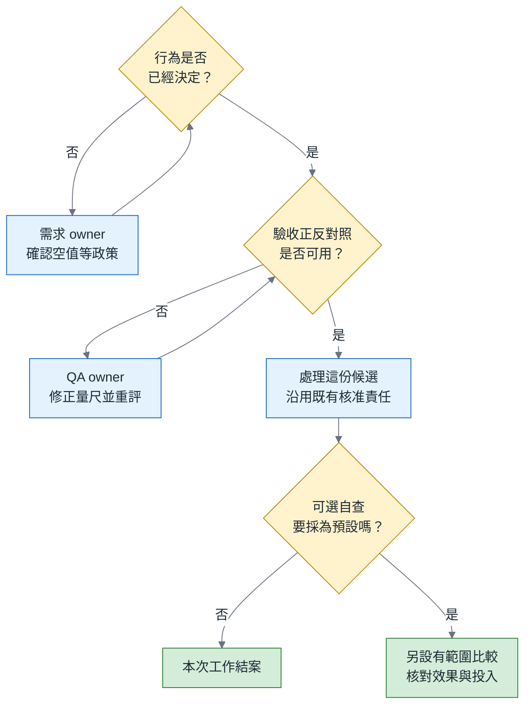

# 同一份規格，跑十次：我們憑什麼把一種交代變成團隊預設？

> **TL;DR** — 團隊替 agent 補了一段交稿前自查，下一次修補就通過驗收。這段自查值得放進所有同類工作的預設範本嗎？本篇先拆開三個問題：該怎麼做是否已經決定、這份程式是否做到，以及新增自查能否讓之後的交付更好。每個問題需要不同的證據。需求沒決定，先找有權決定的人；檢查方式有錯，先修正判斷依據。這兩種工作都不必等待方法比較。真正需要比較的，是要求不變時，額外自查能否改善交付，以及改善是否足以抵銷新增費用與人工投入。本系列使用自己 repo 裡的一支事件處理工具作研究：四種交代各生成十份程式，四十份都通過 103 項檢查；這批結果仍不足以判定哪種交代較好。本文會先說明研究為何值得做，再用 CSV 匯出的例子，帶你判斷眼前該補需求、修驗收，還是另設比較。最後把一段自查整理成可審閱的提案，說清楚何時只能小範圍試行、何時才有理由採為預設，以及誰負責維護和重新檢視。

> 系列導覽：**總論（本篇）** → [規格篇](../2026-11-same-spec-spec/article.md) → [契約篇](../2026-11-same-spec-contract/article.md) → [變異篇](../2026-11-same-spec-variance/article.md)（全系列尚未發布）

## 一、工作坊那次落差之後，問題換了對象

2026 年 8 月的模式語言驅動開發工作坊裡，我留下一筆後來反覆回頭看的紀錄。Method A 產出 25 個檔案，5 個測試全部通過；可是拿十六項合規清單逐項對照，只通過十項，另外六項沒有做到。其中缺少 `EventSourcedAggregate` 這個要求中的核心物件，也沒有執行從事件重建狀態的路徑。

「從事件重建狀態」聽起來抽象，可以用帳戶作說明：保存存入 100 元、再取出 30 元的紀錄之後，應該能重新計算出 70 元餘額。這只是解釋概念的例子，不是工作坊的實際題目；工作坊的缺口是，需求要求的重建動作根本沒有被執行。那次觀察只有一個案例（N=1），也不屬於本系列的正式研究。它在《綠燈不是驗收》系列裡提醒我的，是測試全綠與符合需求之間，可能隔著整整六項要求。

《綠燈不是驗收》從產物的驗收談起，也往後追到 review 的責任，以及一類任務要累積哪些可靠度證據，才能擴大授權。agent 交出一份修補之後，團隊要確認測試有沒有放寬本來該守住的要求、核准紀錄能不能對應到負責的人，也要把反覆出現的問題帶回規則與驗收。這些工作最後都會碰到同一個入口：下一次派工時，我們準備怎麼交代？

從那次落差出發，一個自然的下一步是回頭改交代：把漏掉的核心物件寫進規格，把重建路徑列成必做項目，再加一段交稿前自查。假如下一次產物真的通過了，這次改動看起來就成功了；接著便可能有人提議，既然有效，就把這段文字放進所有同類任務的預設範本。

這個系列沿著前一系列的問題，仔細檢查「修改交代」這一步。那段話記錄了哪些選擇？它真的改善了交付，還是只補上一條本來沒說清楚的需求？一旦進入預設範本，它就會跟著每一次派工，也會成為某個人得長期維護的文字。本文的題目就從這裡來：一次改指令成功之後，我們憑什麼把它變成團隊預設？

為了回答這個問題，本文先區分「作需求決定」「驗收這份程式」「比較交代方法」三件事，再用正式研究與 CSV 例子檢查這個區分是否有用。最後才談提案與採用條件：我們要知道的不只是研究得到什麼數字，還包括這些數字能不能支持團隊接下來的選擇。

## 二、一次成功之後，預設的代價由誰承擔

下面是為了說明而設的假設情境，不是某次真實會議。某個團隊請 agent 修一支 Python 小工具的輸入處理，負責審閱的人發現：程式收到某種格式錯誤，卻把它當成正常資料。團隊在任務說明裡補了一段交稿前自查，列出幾種必須逐一確認的輸入。第二次交付通過驗收後，有人提議把這段自查放進所有 Python 工具修補的預設交代。

後文把每一份待驗收的程式稱為「候選」：它是可能採用的解法，還不代表已經合格。審閱候選的人是 reviewer；有權決定需求、也要為這項決定負責的人，則稱為需求 owner。兩個角色有時是同一個人，但「程式有沒有做到」與「原本就該怎麼做」仍是不同的問題。

這個提議很合理，因為它把一次學到的教訓保存下來。問題在於，「預設」會改變這段文字的用途。原本它只屬於一次任務，任務結束後就可以放下；成為預設之後，它會常駐在 repo 或範本裡，每次派工都會帶上，每位 reviewer 也得判斷候選有沒有照做。

Birgitta Böckeler 分析幾種由規格引導開發的工具時，區分了兩種安排：有些規格只在一項工作開始前撰寫，有些則會隨後續修改持續維護；她也區分單次任務規格與跨次工作使用的背景文件（[Böckeler, 2025](https://martinfowler.com/articles/exploring-gen-ai/sdd-3-tools.html)）。放到本文的情境，我擔心的是：常駐文件若沒說清楚適用範圍與維護責任，一次修補的選擇就可能變成之後所有工作的限制。把一段自查搬進預設範本，也就需要重新回答這兩個問題。

身分轉換之後，代價會落在三個地方。第一是注意力。Anthropic 的 Claude Code 官方實務建議提醒，過長的 CLAUDE.md 可能讓重要指令被雜訊淹沒，並建議觀察改動是否真的改變了行為（[Best practices for Claude Code](https://code.claude.com/docs/en/best-practices)）。這是廠商的實務建議，不是效果研究，但它點出一件事：預設文字越多，每一段越需要說得出自己的用途。第二是 review。reviewer 必須多核對一組項目；如果自查與某項任務的要求衝突，還要有人裁決以哪一邊為準。第三是維護。需求改了，這段文字未必會同步更新，過期的指引仍會持續影響每一次產出。

更根本的問題是，第二次交付通過至少有三種解釋，而它們指向不同的下一步。

第一種解釋是，那段文字其實替團隊作了一個原本沒作的決定。假如自查裡寫著「某種輸入必須拒絕」，原本的需求卻沒有說明，真正發揮作用的就是這個決定。它應該回到需求本身，由有權決定的人確認，不一定要以自查的形式存在。確認後的必要行為與相容規則，可以直接記入團隊的交代與驗收；採用它們的理由，是團隊已承擔的義務，不必等一場效果比較才成立。

第二種解釋是，這一份候選剛好做到了，或者驗收剛好沒看見它的其他問題。只看一次交付，無法區分方法變好了，還是這次剛好成功；驗收如果只看得見少數錯法，通過也只代表那些錯法沒有出現。

第三種才是這份自查提案想主張的效果：要求不變，只改交代方式，就能讓之後的交付穩定變好。若團隊要以這個理由把可選自查設為預設，就需要事先設計比較，再看結果是否支持這項投入。後文的效果門檻只適用於這種主張，不用來決定已成立的必要規則是否還要遵守。

我在 Agentic Engineering 技術篇〈[Harness 藍圖—把系統變成 agent 讀得懂的地方](https://fantasybz.medium.com/f2a139f5b561)〉提過兩項建議：修改 agent 收到的背景資訊與指令之前，先指出想改善的具體結果；修改之後，再重新執行一組具代表性的任務。那篇把後者稱為 golden tasks，作用是讓團隊有一組能反覆核對的工作。這篇要再往前補一步：重新執行之前，先分辨眼前的成功屬於哪一種解釋。

如果團隊擔心，要回答「值不值得設為預設」，就得先做一場昂貴的研究，可以先檢查前兩種情況。有時候只需要找對負責的人，或修正判斷對錯的方法，就能處理眼前的工作。接下來先從規格本身談起：一份文件能替團隊完成哪些決定，又有哪些事情仍得另外查驗？

## 三、書錨：Lamport 的藍圖，把選擇保存下來

要說明一份規格到底在做什麼，我想先借用一篇短文。Leslie Lamport 是分散式系統研究者，也設計了規格語言 TLA+。他在 2013 年寫了〈Why We Should Build Software Like We Build Houses〉，主張寫程式之前要先畫藍圖。這裡讀的是作者網站保存、標示日期為 2013 年 1 月 24 日的三頁版本。版本與取得範圍列在文末 References。

這篇短文有三個論點，和本文要處理的問題直接相關。第一，寫下規格，會迫使作者在修改程式之前先說清楚程式應該做什麼；很多沒想清楚的地方，要試著寫下來時才會浮現。第二，規格把使用介面所需的知識從實作中抽出來，寫成一份可以維護的說明，讓使用者不必讀懂程式碼也能正確呼叫。第三，描述需要多精密，取決於問題：簡單行為可以用一般文字說清楚，微妙或關鍵的部分，才值得採用更精密的方法與工具。

他也交代了自己的界線：寫規格不能保證程式不會崩潰，要消除 coding bug，仍需要其他方法。這篇文章表達的是他的工程立場與經驗，不是比較試驗；文中提到修改程式花了多少時間，也不能換算成撰寫規格的投資報酬率。

我把這三個論點與那條界線，對應到本文的三層問題。規格最直接的工作，是保存團隊已作出的選擇，並讓尚未作出的選擇浮現出來，這對應第一層：「需求是否已經決定」。Lamport 明說，規格不能保證程式沒有錯，仍需要其他方法，所以第二層「這一份候選有沒有做到」需要另外驗收。至於某一種寫規格的方式值不值得成為團隊預設，他的短文沒有處理，也沒有打算回答；這是第三層，需要比較。

從第二個論點，我整理出一個可以直接拿來用的問題。這是我的推論，不是 Lamport 的原文範本：**如果不看實作，只靠這份說明，呼叫這支工具的程式能不能知道怎麼使用它，也知道什麼時候不該相信它的輸出？** 答不出來的地方，先記成未決問題，交給能決定的人，不必急著把文件寫長。

以「把輸入解析工具改得更穩健」為例。解析工具（parser）負責把收到的文字辨認成程式能處理的資料；像是讀到一行訊息後，取出裡面的內容。「更穩健」可以理解成跳過損壞的行、遇到錯誤就明確失敗，或把異常值當成沒有訊息。這三種做法會讓使用工具的人看到不同結果。規格選定並要求實作遵守的這些行為，本文稱為「契約」；它是工程上的行為約定。下一位維護者只看到「型別修補」幾個字，仍無法知道團隊當初選了哪一種。

## 四、三層問題：先確定自己缺的是哪一種證據

回到第二節那段自查。要判斷它該不該成為預設，我會依序問三個問題。

第一層是需求決定：在某個輸入下，什麼行為才算對，這件事有沒有人決定過？第二層是特定候選的驗收：這一份產物有沒有做到已決定的行為，我們的量尺又能不能看出它做錯的地方？第三層是交付方法的比較：這種交代方式放到一批具代表性的工作上反覆使用時，效果、成本與人力是否都值得？

第二層需要一個判斷依據。例如，需求已決定日期是 `null` 時輸出空欄，檢查工具就可以據此核對結果；如果需求還沒決定，檢查工具本身沒有權力選答案。這種判斷結果對錯的依據，稱為 **oracle**。它可能是從規格推導的預期值、參考程式、舊版輸出，或人工判斷，每一種都有盲點。

先把 oracle 和自動驗收程式分開，也比較容易理解後文。oracle 說明「怎樣算對」；執行檢查並給出判定的程式，本文稱為 grader。好比答案與批改步驟：答案正確，仍可能批改錯誤；批改忠實，也可能照著一份錯誤答案判分。下表把三層並排，請橫向對照判斷依據與常見錯位，確認是哪一步需要補證據。

| 層次 | 問題 | 主要負責 | 判斷依據 | 常見錯位 |
|---|---|---|---|---|
| 需求決定 | 這個輸入下，什麼行為才算對？ | 需求 owner、領域負責人 | 已記錄的決定與例子；未決問題及其負責人 | 讓 agent 輸出或測試作者猜測充當決定 |
| 候選驗收 | 這一份產物做到了嗎？ | QA owner、reviewer | 已用正反對照檢查的 oracle、該候選版本的實際驗收結果，以及操作條件紀錄 | 把 exit 0、「測試全過」或與範本逐 byte 相同當成符合契約 |
| 方法比較 | 這種交代值得反覆使用嗎？ | EM／Staff 與維護者 | 依事前範圍與單位取得比較結果，核對效果、成本、人力及限制 | 用一次成功或一組全過推論成團隊預設 |

這張表最重要的用法，是看清每一層的證據都不能替另一層作答。一份排版完整的規格，不會自動決定空日期該輸出空欄還是拒絕；一份通過驗收的候選，也不能證明產生它的交代方式比較好；即使方法比較設計得很嚴謹，也無法補上一條沒人決定過的需求。更糟的是順序顛倒：第一層還有空缺，團隊就開始比較文件。這時比較結果反映的，只是哪一份文件剛好猜中了 owner 沒有說出口的偏好。

第二層還有一個容易被忽略的面向：契約常常刻意保留實作自由。例如，同樣要拒絕錯誤型別，一份程式把判斷集中在共用小函式（helper），另一份直接寫在處理各種輸入的分支裡。只要外部行為符合要求，兩份都可能合格。要求每次產出的程式長得一樣，不等於提升品質。

如果團隊真的需要某種架構限制，這條限制要有來歷，也要有對應的驗收，不能事後拿「和上次長得不一樣」當作退件理由。所以，一把好的量尺要同時做到兩件事：拒絕已知錯法，也接受不同但合法的寫法。後文說的「正反對照」，就是事先準備已核對的合法版本與錯誤版本，確認檢查不會把這兩類弄反。

下面這張圖讓讀者找出目前該做的工作。前兩個「否」各指向一種待補的缺口，箭頭把讀者帶回原問題重新確認；回答「是」之後，才繼續往下。最後一個菱形才問，要不要以改善交付為理由，把那段可選自查推成預設；若不需要，本次工作就可以結案。



這張圖的前兩個出口，都不需要比較任何文件。需求 owner 確認空值政策；QA owner 修正量尺，再用新版量尺重評已存在的產物。之後，這份候選照舊經過團隊原本的 review 與核准，核准責任不會因為中間補過缺口而轉移。第三個菱形才問：「還要把可選自查採為團隊預設嗎？」如果答案是否，本次工作到此結案，不必為了一次修補發起研究。這張圖只負責分流，沒有說明比較該如何設計，也不能取代既有的核准規則；那些問題留到第九、十節處理。

## 五、Example Mapping：還沒決定的政策，模型補不出來

第一層的空缺最容易被跳過，因為一句「把格式處理好」看起來已經交代了工作，卻可能沒有回答空值該怎麼辦。Matt Wynne 在 2015 年介紹的 Example Mapping，正是用具體例子把這類缺口找出來。Wynne 當時擔任 Cucumber 專案的負責人；這個方法把討論分成四種卡片：想完成的工作、已知規則、具體例子，以及沒有人能當場回答的問題。

例如，「匯出日期」是工作，「有日期就依指定格式輸出」是規則，某一筆帶日期的資料是例子；「沒有日期時怎麼辦」則可能仍是問題。例子讓大家檢查自己理解的規則是否相同，問題卡則留下還缺的知識或決定。Wynne 也說明，這場討論是為了共同理解何謂完成，不必當場寫成完整的 Gherkin，也就是以 Given／When／Then 描述情境的格式（[Wynne, 2015](https://cucumber.io/blog/bdd/example-mapping-introduction/)）。

我最看重的是問題卡。它把「還沒決定」標出來，讓團隊知道應該找誰回答，不會由某個人默默補上。

現在把這個方法用到本系列的 parser。這支工具讀取 agent 送出的事件；每個事件是一筆 JSON 資料，一行放一筆，這種格式稱為 JSONL。你可以把它看成陸續送來的工作紀錄：這一行說「agent 說了什麼」，下一行說「這次工作完成了」。工具要一邊收到、一邊處理，這就是這裡所說的串流。

其中，訊息事件的 `text` 欄位保存 agent 說的文字。假如需求只寫「修正 text 的型別處理」，缺少欄位、`null`、空字串、只有空白的 `" "`、`false`、`0`、陣列、物件，以及數字 `123`，就都需要有答案：各算沒有訊息、格式錯誤，還是照樣印出？如果要印出，又算不算 agent 已經發言？

本系列研究事先固定的契約 R05 已經回答這些問題。R05 是第 5 條要求的編號，方便讓規格、例子與檢查指向同一條規則。它規定：缺值、`null` 與空字串都不輸出，也不記為發言；非空字串要原樣印出，立刻把暫存的內容送到輸出端（flush），不能等整批工作結束才讓下一個程式讀到。只有空白的字串也算有效；其餘非字串值，包括 `false`、`0`、陣列與物件，都屬於格式錯誤，後文稱為 malformed。

每一條答案都是一次選擇。把只有空白的字串算成有效發言，是一個決定；把 `false` 當成格式錯誤，而不是沒有訊息，也是一個決定。另一支工具可以選擇不同的契約；但在這個 repo 裡，既有呼叫端依賴的行為已構成相容責任，不能因為換了維護者就任意改掉。

這裡要交代一個限制：正式研究的四份文件都已事先寫好這些答案，所以研究沒有量測需求探索帶來的收益。本文談 Example Mapping，是延伸到工程實務的做法，不是研究觀測的結果。

為什麼未決政策不能交給模型補完？換到匯出表格的工作更容易看清楚。CSV 是以逗號分隔欄位的文字格式，例如一筆資料可以依序放姓名、日期與備註。假設某個 CSV 匯出工具要新增日期欄格式化，呼叫端已要求保留輸入列的順序與重複列，但還沒決定空日期要輸出空欄還是拒絕。把它攤成卡片，大致如下。請先看第三欄尚缺什麼答案，再看第四欄由誰回答。表中的 record 指一整筆資料；LF／CRLF 則是兩種用來表示換行的字元組合，細節會在第八節的實際輸出中說明。

| 規則 | 例子 | 問題 | 誰決定 |
|---|---|---|---|
| 日期欄依指定格式輸出 | 有日期的列正常轉換 | 缺日期時，輸出空欄還是拒絕整份輸入？ | 匯出功能 owner（未決） |
| 保留輸入列序與重複列 | 兩筆完全相同也要留下 | 無 | 呼叫端已要求（已決） |
| 欄位內容保持原樣 | 姓名含逗號、備註含換行 | 每筆 record 可以用 LF 或 CRLF 結束嗎？ | 需求 owner 與 QA owner 共同確認 |

第一列的問題卡即使沒人回答，agent 仍可能交出程式，因為兩種政策都符合目前已知的文字；它也可能停下來提問。它可能選擇輸出空欄，也可能選擇拒絕。麻煩就從這裡開始：如果測試作者拿這次產出的結果當作預期值，一個猜測就會被寫成基準。之後每逢修改就重新檢查舊行為的「回歸測試」，會忠實保護這個猜測；等 owner 真的作出相反的決定，修正它反而會看起來像退步。這個決定本來就應該由需要為結果負責的人作出，模型寫得再好，也不能代替團隊作這個決定。

問題卡也有邊界。大家早已理解的規則，不必硬造例子。如果 owner 一時無法決定，我的建議是把暫行假設限制在明確範圍的探索或原型中，寫明誰負責回答、何時重新檢視，並標出哪些測試依賴這個假設。行為尚未決定，就不能列入正式契約並宣稱已驗收。重點是讓暫行假設維持暫行的身分，不要讓一份排版完整的 SPEC.md 看起來像是已經替人作出決定。

## 六、窄案例：四份交代、四十份候選，103 項檢查全部通過

前面把「需求已決定」和「程式有做到」分開了。系列名稱「同一份規格，跑十次」來自一輪把這兩層先固定、再觀察不同交代的研究。研究由 AI 代理協作設計與執行，我提出方向，並閱讀研究設計與報告。它想回答的是：同一組要求，用不同方式交代給模型，產出的修補會不會不同？

任務取自我的 `medium-articles` repo。`research/scripts/codex_jsonl.py` 是一支單檔 Python 串流工具，負責讀取剛才介紹的 JSONL 事件。它有三種對外結果：stdout 傳出要交給下一個程式的正常內容，stderr 傳出錯誤或診斷訊息，exit code 則是結束時交回的一個數字，讓呼叫端決定後續怎麼做。exit 0 通常被當成成功，但它只是程式自己的回報，仍要看內容是否真的正確。

研究固定了一個起始版本，稱為 seed commit；每次都從這份相同的舊程式開始修。在這個版本上，可以重現兩個問題：第一，收到合法 JSON `[]` 或 `null` 時，程式卻把它當成物件來呼叫 `.get()`，因此崩潰；第二，訊息的 `text` 若是數字 `123`，後面再接一個有效的完成事件，程式會把 `123` 當成審查內容印出，並以 exit 0 結束。這支工具有實際的呼叫介面與相容責任，但研究沒有宣稱它對應某次生產事故。

研究準備了四份交代，共用同一個 seed，以及十三條要求 R01–R13。A0 有 936 個英文字詞，內容精簡，但已經包含 R01–R13 的完整目標，不是只有一句概述想完成工作的 user story。A 有 1,655 詞，逐項展開要求，附上固定輸出與表格，部分條文也說明了理由。B 有 1,923 詞，由 A 全文加上集中說明的理由與六組交稿前自查組成。C 有 2,223 詞，由 B 全文加上一段可選的實作安排建議，稱為 pattern 組成。詞數依空白切分，包含標題與程式區塊，不含起始程式碼。它也不是 token 數；token 是模型處理文字時使用的切分單位，和按空白計算英文字詞是兩種計數。

四份實際使用的英文 spec 全文可直接閱讀：[A0 精簡版](https://github.com/fantasybz/medium-articles/blob/774759192ab0e0b2da3d8b163eb3f07f3d12f4c3/research/experiments/same-spec-ten-runs/results/formal-2026-09-25/source/specs/A0.md)、[A 展開版](https://github.com/fantasybz/medium-articles/blob/774759192ab0e0b2da3d8b163eb3f07f3d12f4c3/research/experiments/same-spec-ten-runs/results/formal-2026-09-25/source/specs/A.md)、[B 加理由與自查](https://github.com/fantasybz/medium-articles/blob/774759192ab0e0b2da3d8b163eb3f07f3d12f4c3/research/experiments/same-spec-ten-runs/results/formal-2026-09-25/source/specs/B.md)、[C 加可選實作建議](https://github.com/fantasybz/medium-articles/blob/774759192ab0e0b2da3d8b163eb3f07f3d12f4c3/research/experiments/same-spec-ten-runs/results/formal-2026-09-25/source/specs/C.md)。[全文與逐行差異導讀](https://github.com/fantasybz/medium-articles/blob/774759192ab0e0b2da3d8b163eb3f07f3d12f4c3/research/experiments/same-spec-ten-runs/SPECS.md)整理了閱讀順序，也指出 A0 與 A 另有一處 CLI 選項的範圍差異；篇幅之外，仍要核對措辭是否改了要求。

研究把一次送給模型的任務說明與起始程式碼合稱為 packet，也就是整包輸入。四份 spec 分別放進各組 packet，作為其中的規格部分。每組有十份候選，組內十次收到的整包文字完全相同；四組之間則各不相同。所以研究並不是把同一份 prompt 執行四十次。四十個名額事先排定，沒有重試、修復、替補或事後追加樣本；全部生成完成後，才進入共同的外部驗收。

生成使用 `claude-opus-5-5`，推理投入設定（effort）為 high。模型沒有工具，只能一次交付單一檔案，不能查 repo、提問，也不能執行測試。驗收包含 102 個批次案例，也就是把整份輸入送完再比對結果；另有 1 個串流探測（streaming probe），在輸入尚未結束時，就檢查前面那則訊息是否已經讀得到。輸入結束的訊號稱為 EOF，因此後者也稱 EOF 前檢查。兩類合計 103 項。

除了程式行為，研究也另外核對命令列工具（CLI）的版本、執行紀錄、模型是否符合設定，以及有沒有使用工具。行為驗收與這些操作條件都成立，才記為 accepted，也就是該名額通過研究事先訂好的接受條件。

結果是：四十份全部 accepted。

解讀這個結果之前，先看這 103 項檢查到底在驗什麼。下表假設輸入只有兩行：第一行是一則 agent message，第二行是一個有效的完成事件。表中只改變第一行 `text` 的值。除了前面已讀過的 R05，還需要兩條規則：R11 在 EOF 時依序檢查明確失敗（3）、malformed（6）、沒有有效完成（4）、已完成但沒有發言（5），都不符合才是 0；R12 則只為 exit 3、4、5 附上舊有的結尾摘要。

先用 `null` 示範。它不算發言，後面的完成事件有效，整份輸入也沒有失敗或 malformed，所以輪到「已完成但沒有發言」時成立，exit 是 5，並附摘要。有了這個推導，便可以比較 `false` 與空白字串在哪一步走向不同結果。

| 第一行的 `text` | R05 判定 | 算不算發言 | EOF 的 exit | 附舊有結尾摘要 |
|---|---|---|---|---|
| `" "`（只有空白） | 有效，原樣印出並 flush | 算 | 0 | 否 |
| `null` | 不輸出 | 不算 | 5（已完成但沒有發言） | 是 |
| `false` | malformed，輸出一則診斷 | 不算 | 6（有 malformed） | 否 |
| `123` | malformed，輸出一則診斷 | 不算 | 6（有 malformed） | 否 |

`false` 那一列雖然也屬於「已完成但沒有發言」，卻先滿足 malformed，所以結果是 6，也不附舊摘要。這裡依的是判定優先序，不是比較 exit code 的數值大小，也不看哪個事件先到。空白字串則是有效發言；完成之後沒有其他失敗條件，結果就是 0。

最後一列最值得多看一眼。seed 版本把 `123` 印成審查內容，並回傳 exit 0；契約要求的卻是一則診斷，加上 exit 6。光看「修正型別處理」這幾個字，看不出 `false` 必須算 malformed、`null` 卻不算，也看不出 malformed 的判定要優先於「沒有發言」。這些行為先在第一層由需求決定，再由第二層的檢查逐項驗證。

全數通過很容易讓人放心，但十次仍可能太少。先用一個純假設情況想像：若某種交代每次成功的機率是七成，而且各次互不影響，十次剛好全過的機率仍約為 2.8%。因此，看到十次全過，還不能斷定這個方法幾乎不會失敗。

統計區間就是用來表達這種估計的不確定性。本研究採用雙側 95% Clopper–Pearson 區間：假設各次觀測彼此獨立、分布相同，並共享同一個成功機率，每組 10/10 對應的區間約為 69.15% 到 100%。下界可以驗算：它是讓「十次全過」的機率剛好等於 2.5% 的成功機率，也就是解 p¹⁰ = 0.025，得到 p ≈ 0.6915。這不是保證下一次成功，也不是說真實成功率已經確定落在裡面；它描述這種統計程序與假設下，資料仍容許多大的估計範圍。

四組全過，無法僅據此替文件排序。「等效」更是另一個需要事先定義的主張：差異要小到什麼程度，團隊才願意把兩種方法視為實務上相當？本輪沒有完成這種比較，也不能由全過推出長文字沒有用、已達高可靠度，或可以全面採用。

費用的限制也一樣。依 CLI 的牌價估計，A0、A、B、C 每組十次生成的費用合計，依序約為 USD 1.25、1.38、1.51、1.55，全部約為 5.69。這不是帳單，也不包含研究、pilot、寫作或人工成本。費用隨文件變長而上升，但這個排序無法拆出理由、自查與 pattern 各自造成的效果。EM 真正需要知道的那部分成本，也就是讀程式、修正、核准與維護文件所花的人力，本輪都沒有量測，所以這裡算不出投資報酬（ROI）：我們只知道模型生成的費用估計，還不知道為了得到可交付成果，團隊總共付出多少。

另一項研究提供了對照，提醒我們別把「資料少」直接當成「比較便宜」。研究者在 SWE-bench Verified 的 5 個程式修補任務上，以單一模型 Kimi K3 搭配 mini-swe-agent，組合 12 種規格寫法、3 種 effort，每種組合各重複 15 次，形成 2,700 個最終執行紀錄。排除直接提供解答的那種提示（論文稱為 oracle prompt）後，只給概略任務描述的 bare user story，成本比完整規格高約 29.7%。這裡稱為 oracle prompt，是因為該條件直接提供解答，和本文用來判斷輸出對錯的 oracle 不同。

這個成本差異是分層模型的估計，90% 貝氏可信區間（credible interval）為 +5.1% 到 +58.7%；改看較寬的 95% 區間，則為 −0.3% 到 +66.8%，包含零。它是在該研究模型與先驗假設下表示參數不確定性的區間，不是前段二項式比例所用的 Clopper–Pearson 區間（[Can your AI agent be cheaper?, arXiv 2608.25399v1](https://arxiv.org/html/2608.25399v1)，§4.1、Appendix C）。

研究也記錄，原先設為 60 回合時，簡略規格較常因達上限而中止；改為 120 回合後，重跑了 112 筆。這表示何時停止工作，本身就會影響比較。我從這項研究保留的提醒是：它比較移除具體資訊之後的結果，不能直接拿來替文件厚度排名。本輪 A0 已含完整目標，也不是 bare user story；在完整規格上加一段自查是否值得，仍要另外回答。

這輪研究本身也碰到了第一層的問題。A0 與 A 之間有一處已知的語義差異：對於新增的命令列選項，A0 說「不需要」，A 則在 R13 進一步說明它們「不在範圍內」；B 與 C 沿用 A 的文字。正式驗收程式沒有全面檢查額外的 CLI 選項與 `main` 介面，所以這處差異造成什麼影響，目前仍不知道。因此，我不能宣稱四份文件在語義上完全相等；已凍結的 packet 也不能事後修改。下一輪若要消除這處差異，必須先對齊要求，再重新生成。

還有些條件無法完全固定。供應商內部帶給模型的上下文、控制輸出抽樣的 temperature 與 random seed，以及完整的作業系統狀態，都不在本研究可鎖定的範圍。計畫在執行前已於本機封存，但未向第三方預先登記；不能把本機紀錄當成第三方預註冊。

隔離機制另用三項越界探測，確認嘗試讀取 oracle 檔案、寫入檔案與綁定本機網路位址 localhost 會遭拒絕，仍不能證明所有通道都已封住。正式執行前用來試走流程的兩次先導試行（pilot），以及檢查停止路徑的探測，也不計入正式資料。細節可在[正式研究結果](https://github.com/fantasybz/medium-articles/blob/774759192ab0e0b2da3d8b163eb3f07f3d12f4c3/research/experiments/same-spec-ten-runs/RESULTS.md)核對。這些限制共同劃出結論的範圍：本輪提供這四份交代所產生的候選，滿足既定 103 項檢查的結果；它沒有替「哪種交代值得成為預設」作出答案。接下來要看的，是全數通過之後，這批程式還能提供什麼資訊。

## 七、全部通過之後：合法差異、上限與回歸資產

四十份候選都通過了，但它們的程式並不相同。要描述這種不同，研究使用兩種結構指標。第一種先把程式讀成抽象語法樹（AST）：文字中的函式、判斷與呼叫，會變成有關聯的語法節點。可以把它想成先拆開句子的文法結構，再比較組成方式。研究統一其中部分名稱，再為得到的表示計算一個摘要值（hash）；四十個摘要值全部不同。

這個差異仍要小心解讀。研究只統一部分識別字，保留了屬性、匯入路徑、常數與程式順序，也沒有辨識變數所屬的作用範圍與綁定關係。因此 hash 不同，只表示這種表示法沒有把兩份程式視為相同，不能直接推出控制流程不同或品質較低。

第二種指標只統計每類語法節點有幾個，再用 cosine 比較數量分布。假如兩份程式的判斷與呼叫次數很接近，分數就可能接近，即使它們執行的順序不同。這不是行為驗收，更不是品質分數。每組十份候選可以兩兩配成 45 對，但同一份程式會出現在多對裡；四組合計 180 個配對，仍不等於 180 份獨立資料。

外部研究也看到類似現象。一篇描述性研究從同一份凍結的 web-app 規格取得 90 次 agent run，其中在 Opus 4.7 xHigh 的基本條件下，6 次重複都拿到滿分 42 分；但 source files 從 15 到 22 個，CSS 從 174 到 468 行不等（[arXiv 2607.02436v2](https://arxiv.org/pdf/2607.02436v2)，Table 9）。這 90 次 run 橫跨多種 model、執行框架、推理投入與工具條件，不是同一組設定重複 90 次，條件也沒有隨機分派。檔案數與行數只是用來間接描述程式規模的指標，不是可維護性的量測。至少在這兩個案例裡，功能全部通過和結構不同同時出現。

長得不一樣，會不會造成維護負擔？這仍是尚未量測的假說。為了看清差異落在哪裡，研究完成後，先選定 A0 在凍結執行順序中最前面的兩份候選，`formal-01-A0` 與 `formal-02-A0`，再閱讀程式碼。配對沒有依分數挑選，但也不是研究前預定的分析，更不是代表性抽樣。兩份程式都通過 103 項檢查。`formal-01-A0` 用一個函式內的字典（dict）保存 malformed 狀態，再用幾個區域變數記錄是否完成、是否發言與是否失敗；`formal-02-A0` 則把狀態放進 `_State` 類別，由各個事件處理函式（handlers）處理不同事件。

不急著判定哪份比較好，先沿三個問題閱讀：`text` 在哪裡驗證、合法事件何時改變狀態、EOF 優先序在哪裡決定。在前一份程式中，這三個問題要從區域變數與分支之間找答案；在後一份程式中，則要到類別與 handlers 裡找。

這組配對的 cosine 約為 0.994，同樣不帶任何品質意義。這只是靜態閱讀，不是維護工作的實測。

這次閱讀帶出第二層的一個判準：驗收要接受契約允許的實作自由。C 的 pattern 甚至明白列出兩種合法做法：可以由 handler 回傳一份小結果，也可以保留 if 分支，在各分支中就地驗證。它建議的 text helper 也不能套用到根層的 error 事件，因為 R09 要求 error message 保留原來轉成字串的 `str` 行為。如果團隊真的重視程式結構，就要把結構寫成有來歷、有驗收的架構要求；在那之前，「每次產出都一樣」不能當作品質目標。

接著是比較結果碰到上限的問題。四組都拿到 10/10，比較就沒有區分力。Anthropic 在一篇討論 agent evals 的工程文章中說得很直接：「An eval at 100% tracks regressions but provides no signal for improvement.」（[Demystifying evals for AI agents](https://www.anthropic.com/engineering/demystifying-evals-for-ai-agents)，Step 7: Monitor for capability eval saturation）這是廠商的工程實務建議，不是對照實驗，但它替 40/40 指出一個有用的用途：這批檢查不能用來替文件排序，卻可以保留下來作為回歸資產。

「回歸資產」在這裡不是把研究再跑一遍，而是留下日後能重查的材料。例如，保留一份已知錯法，以後修改驗收程式時，就能確認它仍會拒絕這份錯誤程式。這類事先準備、行為已核對的固定測試材料，稱為 fixture。

但同一批材料不能回答所有退步問題。下表分成三種用途；第三列提到 harness，也就是安排模型如何工作的執行框架，包括可用工具、提示、停止方式與紀錄安排。框架或模型換了，舊程式檔不會替新方法產生一次交付，所以那一列必須取得新的生成結果。

| 回歸對象 | 固定什麼、變動什麼 | 可以判斷什麼 |
|---|---|---|
| Grader | 固定已核對行為的正反 fixtures，換 grader 版本 | 新量尺有沒有誤拒合法行為，或漏掉已知錯法？ |
| 新候選實作 | 固定同一份契約 cases，檢查新候選 | 這份候選是否仍符合檢查所涵蓋的要求？ |
| Model／harness 交付方法 | 取得新的生成結果，保存 task／trial 分布與 policy 版本 | 新版方法在這批工作上有沒有退步？ |

重評舊的四十份候選，只能確認這批舊產物在指定 grader 下的結果。它們全是原本的通過者，也不能單獨取代檢查 grader 所需的正反對照。新候選仍須實際接受契約檢查；model 或 harness 的交付方法則需要新生成，不能用舊檔重播代替。另一個限制也容易被忽略：這批題目、答案與評分資料已在研究與成稿過程中揭露。它們仍可繼續作為回歸資產，但另存一份副本，不會讓它們重新變成未見過的保留題，也就是沒有拿來調整方法、專門留到最後評估的題目。若要比較文件或評估新能力，需要另設正式任務與評分資產，而且這些資料不能事先用來調整文件。

## 八、CSV 分流：修好 oracle，就能恢復既有驗收

窄案例說明了研究能回答到哪裡。接下來，我用另一個任務，讓第四節那張分流圖實際走一遍。這是教學假設，不是作者 repo 的第二個正式研究任務；它沒有發出模型請求，也沒有模型成功率或真人工時資料。

情境延續第五節：CSV 匯出工具新增日期欄格式化，呼叫端要求保留列序與重複列，空日期的政策尚未決定。第一個菱形在這裡的答案是「否」，所以第一步是請需求 owner 決定政策。假設 owner 決定 null 日期輸出空欄，並和 QA owner 確認三個格式條件：欄位標題（header）的名稱與順序固定為 `name,date,note`；每筆完整資料（record）可以用 LF 或 CRLF 這兩種換行表示結束；欄位內容裡的逗號與換行都要保留。這些條件是為了檢查 oracle 而設的假設，不代表所有 CSV 工具都該這樣處理。

政策決定之後，才能推導預期值。下面是三筆輸入：

```json
[
  {"name":"王,小明","date":null,"note":"第一行\n第二行"},
  {"name":"李","date":"2026-09-28","note":""},
  {"name":"李","date":"2026-09-28","note":""}
]
```

依契約，輸出應依原順序保留三筆 records。第一筆的姓名仍含逗號，日期是空欄，備註仍保留欄位內的換行；後面兩筆完全相同的「李」都要保留。依 Python `csv.writer` 的預設引號規則，一份合法輸出如下。這裡以 LF 結尾顯示；CRLF 版本只在每筆 record 的結尾不同。

```text
name,date,note
"王,小明",,"第一行
第二行"
李,2026-09-28,
李,2026-09-28,
```

這份文字有五個實體行，卻只有三筆資料 records（另有 header），因為第一筆 record 的備註跨了兩行。這個差別會影響後面的比對。

教學重播用 Python 標準函式庫建立六份輸出。其中兩份是合法表示，分別以 CRLF 和 LF 結束每筆 record；另外四份刻意做錯，分別是刪除重複列、交換 header 欄名、改變資料列順序，以及改錯一個日期值。這些錯法是事先安排的測試資料，不是 agent 曾經犯過的錯。每份輸出都交給三種驗收方式判斷。下表記錄實際重播結果；請逐欄往下看，比較每一種量尺接受了哪些輸出、拒絕了哪些輸出。

| 輸出 | 實體行數／records | 只要能解析 | 與 CRLF 範本逐 byte 相同 | 核對 header 與有序 records |
|---|---|---|---|---|
| 合法，CRLF | 5／3 | 接受 | 接受 | 接受 |
| 合法，LF | 5／3 | 接受 | 拒絕 | 接受 |
| 擅自去重 | 4／2 | 接受 | 拒絕 | 拒絕 |
| header 欄名次序錯 | 5／3 | 接受 | 拒絕 | 拒絕 |
| 資料列順序錯 | 5／3 | 接受 | 拒絕 | 拒絕 |
| 一個日期值錯 | 5／3 | 接受 | 拒絕 | 拒絕 |

前兩種量尺各有缺陷。逐 byte 比對，就是連檔案每一個位元組都要求相同；LF 用一個換行字元，CRLF 用兩個字元組合，因此這種比對把合法的 LF 版本拒絕了。問題是範本只保存契約允許的其中一種表示。

只要能解析就接受則太鬆：四種錯法都還是語法正確的 CSV，所以全數被放行，卻早已違反欄序、列序、欄位值或保留重複列的要求。第三種量尺先把 CSV 讀回資料，再依契約核對 header，以及完整且有序的 records。它不先去重或重新排序，因此仍能發現某一筆資料被刪掉。在這六份固定資料上，只有第三種作出了預期的判斷。這就是按資料意義比較，和按檔案表示逐字比較的差別。

從這張表，可以直接作出三個不同的決定。

第一，如果團隊目前的驗收，是把整份輸出字串與一份 CRLF 範本逐 byte 比對，那麼 LF 候選被拒絕，問題出在量尺，不在 agent。這時應先修 oracle：保留舊範本與原本的判分紀錄，替新版 oracle 標上版本，再用它一致重評同一批已存在的輸出。這一步不需要新的模型生成，也沒有理由先把規格寫長。修完之後，還要用刪除重複列、header 錯誤、列序錯誤與日期值錯誤這四份對照再確認一次，避免為了接受合法的換行方式，連內容要求也一起放寬。

第二，如果某一份候選真的刪除了重複列，就拒絕這份候選，並回到「保留重複列」的要求。從這個輸出差異本身，無法判斷模型是漏讀了要求、理解錯了，還是選錯了 helper；它更不能證明補一段自查就會改善。parser 的案例也是同樣道理：R13 要求接受重複訊息與重複完成，並不代表可以去重，也不代表重播同一批事件時只能產生第一次的效果；後者才是這裡說的冪等處理。CSV 呼叫端要求的保序與保留重複列，以及 parser 對重複事件的處理，各有自己的契約依據；不能因為資料看起來重複就順手清掉。反過來說，用不同的 helper、類別或行內寫法，只要行為符合契約，都屬於合法的實作自由。

第三，這個工具只要求交出完整的 CSV 檔案，沒有要求逐筆即時輸出，所以不該照搬 parser 的 EOF 前 streaming probe；批次輸出同樣可能合格。如果要新增串流要求，應回到呼叫端的需求與可觀察條件，由 owner 決定。

這不只是 CSV 會遇到的問題。EvalPlus 在 164 個 HumanEval Python 函式任務、26 個模型上擴充測試，找出了原有測試沒有辨識出的錯誤，甚至改變了模型之間的排序。同一批程式放在保護力不同的驗收下，得到了不同的判斷。這項研究也用前置條件檢查（precondition assertions）界定哪些輸入在題目承諾處理的範圍內，因為測試輸入同樣必須遵守契約，不能拿契約未定義的輸入，處罰不同但合理的實作（[EvalPlus, arXiv 2305.01210v3](https://arxiv.org/html/2305.01210v3)，§2.3、§3）。HumanEval 的小函式不等於 repo 裡的 agent 工作，增加測試也不能證明程式完整正確。這項研究提醒的是順序：比較任何交代方式之前，先確認量尺能拒絕已知錯法，也不會誤拒合法差異。

這次重播可以自行核對。[csv_transfer.py](https://github.com/fantasybz/medium-articles/blob/774759192ab0e0b2da3d8b163eb3f07f3d12f4c3/research/2026-10/same-spec-ten-runs/rebuild-2026-09-28/workbench/csv_transfer.py) 會產生六份輸出，並執行三種判斷；[結果檔](https://github.com/fantasybz/medium-articles/blob/774759192ab0e0b2da3d8b163eb3f07f3d12f4c3/research/2026-10/same-spec-ten-runs/rebuild-2026-09-28/workbench/csv-transfer-results.json) 保存每份輸出的 bytes 與 SHA-256；[自測](https://github.com/fantasybz/medium-articles/blob/774759192ab0e0b2da3d8b163eb3f07f3d12f4c3/research/2026-10/same-spec-ten-runs/rebuild-2026-09-28/workbench/test_csv_transfer.py) 共 11 項，在 CPython 3.14.5 上全數通過。這次重播沒有驗證日期格式轉換、其他 CSV dialect 或整套匯出工具；這 11 項也不屬於正式研究的 40 個名額或 103 項檢查。

走完這一遍，CSV 案例先補好了前兩層缺口：owner 決定政策，QA 修好 oracle，再回到候選的驗收與原本的核准流程。團隊只要處理這次匯出工具的修補，沒有要把額外自查推成預設，就不必走向方法比較。圖中最後一個「否」，因此成為有理由的結案。

## 九、一頁提案：讓「寫清楚一點」變成可以被審的主張

如果前兩層都沒有問題，團隊真的要決定「是否把某段交代設為預設」，我會請提議的人先寫一頁提案。這份提案讓主張可以被審查，也可以被拒絕。提議者要說清楚：想改善哪一種可觀察的錯誤、適用於哪些工作、現有證據能支持到哪裡，以及什麼結果會讓團隊改變決定。「提高品質」這種目標不足以填進任何一欄；「減少 `text: false` 被當成沒有訊息」才是可以驗收的目標。填完之後，還要再問一次：這個問題出在規格尚未決定、候選沒有做到，還是驗收沒有看出來？

下面以 parser 為背景示範。先用白話說這份提案：P 組照完整規格工作；Q 組收到同一份規格，另加事前核定的自查。我們想知道，多這一段自查，是否讓合格交付增加，又增加多少人的工作。

這裡要把歷史事實和下一輪設計分開：原本四十次，是無工具的一次生成；下一輪則規劃讓 agent 在固定預算內使用工具、自行檢查與修正。從領到任務到這次交付結束的整段工作，稱為一個 session；中途改了幾次程式，仍是同一次工作。這個比較**目前尚未執行**。下面的 YAML 只是把提案寫成欄位紀錄，不是貼上就能啟動實驗的設定檔；先看為何比較、改了什麼，再看如何記錄與決定。完整版本與可填寫範本見[文件改動評估提案](https://github.com/fantasybz/medium-articles/blob/774759192ab0e0b2da3d8b163eb3f07f3d12f4c3/research/2026-10/same-spec-ten-runs/rebuild-2026-09-28/document-change-proposal.md)。

```yaml
# 文件改動評估提案（設計範例，尚未執行；欄位節錄，全文見附件）
decision: 在限定的 Python 工具行為修補中，是否把依固定政策改寫的自查列為預設交代
why_now: 自查需要有人維護；想知道它是否減少不合格交付，以及增加多少撰寫、驗收與 review 投入
target_work: 固定期間內進來的全部合格修補工作；保留未完成、尚無法驗收與排除的理由
existing_evidence: 原四組 tool-free 生成各 10/10 通過 103 項檢查，無法排序；B 同時加入理由與自查，效果拆不開
intervention: 每題 P＝展開規格；Q＝P 加核定自查；同題其他要求、起始程式碼、工具、預算與驗收都相同
policy: 每個排定名額從 fresh repo／session 開始，可執行公開 check 並自修；session 結束後才跑外部隱藏驗收，不另開 session 替補
prerequisites: 會改變預期值的政策已由 owner 決定；oracle 通過正反對照；各題自查映射及 P／Q 已核定封存
primary_outcome: 每個排定名額的原始最終候選通過外部驗收，且操作條件成立；人工救援另列，不回填
human_effort: 全量記錄實際接手時間；事前定好分層深讀規則；記錄 reviewer 分派、閱讀順序與同題熟悉程度
decision_rule: Q−P 的效果區間下界高於 +5 個百分點，且每份合格交付新增人工時間的區間上界不超過 2 分鐘，才支持預設
owners: 規格 owner 決定行為；QA 維護 oracle；平台 owner 保存執行環境；reviewer 記錄接手工作；EM／Staff 與實際承擔者共同決定
next_decision: 達預定名額或成本／日期界線時依事前規則檢視；需求、grader、model／harness 變更時分層重評
```

其中 5 個百分點與 2 分鐘，是我為了示範而假設的門檻，不是業界標準。幾個欄位還需要交代推導過程。

介入條件只保留一個新增成分。原研究的 B 同時加入集中理由與六組自查；即使 B 表現較好，也無法判斷是哪一段發揮了作用。所以 Q 只在 P 上加入六點自查，不帶 B 的集中理由，也不帶 C 的 pattern。

不過，parser 的六題含有 EOF、token 與錯誤事件規則，不能直接貼到其他工具。跨任務比較前，還要固定[自查改寫政策](https://github.com/fantasybz/medium-articles/blob/774759192ab0e0b2da3d8b163eb3f07f3d12f4c3/research/2026-10/same-spec-ten-runs/rebuild-2026-09-28/self-check-transfer-policy.md)：每道自查只對應該任務 P 已揭露的要求，沒有對應就依事前規則標成不適用，不用 Q 偷偷新增義務。各 task 都要先核對 P、Q 的差異並封存，同題同條件的重複使用相同文字。這樣比較的是改寫政策的整體效果，把每條自查對應到各題要求的人工整理工作，以及後續維護，也須計入成本。全體任務的映射與輸入文件尚未完成，所以提案仍不能直接交給執行器。

交付政策改成可以使用工具的 session，是為了貼近團隊打算採用的工作流程；原研究只量測無工具的一次生成，不能替這個流程背書。這裡的「相同工具」，指相同的可用工具、權限與預算，不是要求 P 與 Q 必須做出完全相同的工具呼叫序列。自查如果讓 agent 多執行幾次公開檢查，這很可能就是它發揮作用的途徑，應該記錄下來，不必事先排除。但即使保留了工具呼叫與執行過程的紀錄（trace），也不能從中讀出模型的心理成因。

主要結果要先說清楚在數什麼。以同一道修補題交給 P 和 Q 各做三次為例：題目只有一道，但事先排定的工作有六次。`task_id` 記錄是哪個原始需求與起始 repo；`work_id` 則替這六次工作各編一個號碼。每個 work_id 對應一個 session，以及交付時程式檔的 hash，才能知道這次判定針對哪個版本。

如果某個 session 中途改了三版程式，仍只算一個名額；外部驗收失敗就算失敗，不另開 session 替補。人工 review 與有限修補可以讓工作最後完成交付，但修補後的新 hash 要另外記錄，不能把人的補救回填成 agent 原本就成功。

任務來源也會決定結論能適用的範圍。提案要保留固定期間內進來的全部合格工作清單，同時記錄未完成、無法驗收與排除的理由。若手上只有已經合併的歷史修補，就把它們當成回溯測試（backtest）：把已知的歷史問題交給方法重做，從修補前的版本開始，結論也只適用於這批回溯題目。已看過答案的同題改寫，不能當成新的保留題。

人工投入需要另外安排觀測，不能從生成費用推算。METR 在 2025 年 7 月發表的隨機對照研究，讓 16 位熟悉自己 repo 的開發者處理 246 個真實 issue，並把「完成」定義為開發者相信這項工作能通過 review，包括風格、測試與文件（[METR, 2025](https://metr.org/blog/2025-07-10-early-2025-ai-experienced-os-dev-study/)）。那份結果屬於 2025 年初的工具情境，頁面現在已標示為過時；本文參考它如何界定完成點，不採用該研究的效果數字。

2026 年 2 月的更新擴大到 57 位開發者、143 個 repo 與 800 多個任務，但作者主動說明，開發者與任務的選擇、報酬變動，以及 agent 並行時的工時歸屬，使他們無法可靠估計當前的效果（[METR, 2026](https://metr.org/blog/2026-02-24-uplift-update/)）。這兩份研究量的是生產力，不是長期可維護性。

這正好回到我們的提案：也需要說清完成點，卻不沿用 METR 的終點：session 結案先保存原候選，人工接手後則繼續記錄 review、有限修補、核准與最終交付。不能到「可以交給 review」就停表，漏掉後續工作；每個階段也要分開記錄主動投入幾分鐘，以及總共經過多久。

所以，提案要記錄所有工作實際花掉的接手時間；若另外安排 reviewer 深讀，則先訂好抽樣規則，例如從通過與失敗的工作各抽一部分，而不是結果出來後只挑漂亮案例。這是分層抽樣：先按已定類別分組，再按已定方式取樣。誰讀哪份、閱讀順序、是否能隱藏 P／Q 標籤，以及是否重讀同一題，都要記錄。同一個人第二次讀同一題變快，不代表文件改善了什麼。

成本的分子與分母也要對應。假設兩次排定工作最後只交付一份合格成果，兩次工作已花的人力都應計入，再除以一份成果；不能把失敗那次的人力拿掉。若沒有合格交付，就不計每份交付的比值，而另列全部投入。這是算帳方式的例子，不是本輪量測值。沒有安排真人觀測，人力門檻就只能留在計畫中，不能被當成已經通過。

記錄清楚之後，才有辦法判斷改善是否值得。下表的數字全是假設：owner 事前決定，Q 的主要結果至少要比 P 高 5 個百分點，才值得維護這段自查。百分點指兩個比例直接相減；例如 80% 提高到 85%，就是增加 5 個百分點。

比較不會只給一個完全確定的差值，還會得到表達不確定性的區間。把 Q−P 的區間記為 [L, U]，L 是下界，U 是上界。接著問：整段區間都超過門檻、都低於門檻，還是跨在門檻兩邊？這三種位置，才決定目前能說到哪裡。

| 效果判斷 | 事前條件 | 假設區間（百分點） | 可以說到哪裡 |
|---|---|---|---|
| 支持超過實務門檻 | L > +5 | [+6, +9] | 在指定方法與假設下，支持改善超過 5 個百分點；成本與人力也達標，才支持採用 |
| 排除達到門檻的改善 | U < +5 | [+1, +4] 或 [−2, +3] | 排除了至少 5 個百分點的改善；前者仍支持較小的正向改善，兩者都不等於等效 |
| 仍未定 | L ≤ +5 且 U ≥ +5 | [+2, +8] 或 [−1, +7] | 既不能支持採用，也不能排除達到門檻的改善 |

這張表是為了示範判讀而編製的例子，不是任何研究的估計。它要防止兩種常見的過度解讀。第一種是把「方向正確」讀成「值得採用」：[+2, +8] 的下界高於 0，支持有正向改善，卻還不能確定改善幅度大到值得多維護一段文字。第二種是把「排除達到門檻的改善」讀成「沒有效果」：[+1, +4] 排除了至少 5 個百分點的改善，卻仍支持較小的正向效果。

人力是另一項必須另外成立的條件。假設提案要求，每份最終合格交付新增的人工時間，區間上界不能超過 2 分鐘。如果效果區間是 [+6, +9]，人工時間上界是 1.8 分鐘，其他事前設定的成本條件也成立，才支持採用。如果人工時間上界是 2.4 分鐘，就還不能確認人力符合上限。如果人工時間下界已經超過 2 分鐘，表示人力負擔超出上限，目前不採用；但這不能用來說明文件沒有改善效果。這些人工時間數字同樣只是示例。

還有一條界線要分清。單份候選若違反保序、保留重複列這類已約定的要求，就拒絕那一份，不能用其他項目的得分抵銷。方法比較則要如實保存每次試行的通過與失敗，不能在事後另外加上「觀測必須零失敗」的門檻。至於越權、驗收被改動、補救負擔超出可承擔範圍等方法層級的必要條件與暫停規則，owner 要在看到結果之前另外定好，而且不能被平均改善抵銷。分派細節、停止規則與空白範本，請見[比較計畫範例](https://github.com/fantasybz/medium-articles/blob/774759192ab0e0b2da3d8b163eb3f07f3d12f4c3/research/2026-10/same-spec-ten-runs/rebuild-2026-09-28/comparison-plan-example.md)。

## 十、三種出口：先試走流程、小範圍試行，或採為預設

讀到這裡，有些讀者可能會覺得，一段自查要成為預設的門檻實在太高。這個感覺是對的；我也認為門檻應該高，因為預設會影響之後所有工作。這裡討論可選自查，採用理由是改善交付；必要行為仍依需求決定與驗收，不受這個門檻支配。對可選自查而言，團隊也不必在「做完整比較」和「什麼都不做」之間二選一。我會把起步分成三種用途不同的安排。它們需要的證據不同，完成後能支持的說法也不同。

**先試走流程，也就是診斷 pilot** 用來確認要求、正反對照、grader 與紀錄流程是否能正常運作。一個真實任務就可能揭露量尺缺陷，例如 CSV 案例裡只接受逐 byte 相同的比對方式。pilot 中也可以刻意製造錯法，檢查量尺能不能攔住。它不估計整批工作的收益，刻意錯法出現多少次，也不代表實際工作中有多常出錯；它也不改變任何授權。

**小範圍試行，也就是有限部署 trial** 維持原本的人工核准，事先限定工作範圍、責任人、停止條件與回復方式，觀察實際接手時要做的工作。舉例來說，可以只在一個 repo 的 Python 工具修補中附上那段自查，核准規則完全不變；同時記錄 reviewer 實際多做了什麼，以及自查是否與任務要求衝突。只要出現 owner 事先定下的停止條件，就移除這段文字，並記錄移除時的版本。這是可以撤回的學習安排，需要基本驗收與風險邊界，但不能據此宣稱文件效果已經成立。

**預設採用或擴大適用範圍**，才使用上一節那種事前定好的效果、成本與人力條件，決定是否把做法推廣到整個目標工作集合。試走流程回答「查驗與紀錄能不能正常運作」，小範圍試行回答「實際接手會遇到什麼」，預設採用則需要回答「整體改善是否值得」。三者各有要回答的問題，完成前一步，還不能替後一步作決定。

預算不夠做比較的團隊，仍然有不少事可以做；每一件都維持原本的人工核准，也都限定範圍、可以撤回。問題卡上還沒人回答的政策，可以交給 owner 決定，並把決定記錄下來。會誤拒合法差異或放過已知錯法的量尺，可以用正反對照修好，再對既有產物一致重評。想嘗試的那段交代，可以先作為有限部署 trial，附在少數工作上，並寫明 owner、停止條件與檢視日期。這些改善不能證明自查有效，但每一件都補好了一層，也讓團隊之後若真的要比較，能把問題問得更準確。這是我的做法建議，不是已驗證的收益。

角色不同，起步的地方也不同。EM 最直接的動作，是要求所有「把規格寫詳細」的提案，先寫清楚要作的決定、目標工作，以及什麼結果會改變決定。說不清楚要改善什麼的提案，可以先退回，不必急著評估成本。

Staff engineer 適合負責第一層與架構：確認新增的文字是在記錄已作出的決定，還是在默默替 owner 作決定，並替每一條架構限制記錄由來與驗收方式。

QA lead 負責第二層：建立能拒絕已知錯法、也接受合法差異的正反對照，為 oracle 加上版本，並決定哪一種變動需要重跑哪一層回歸。

這三個角色都不必等比較研究完成，就可以先從自己負責的那一層開始。

資料不完整時，也要誠實說明結果。效果達標但人力超限，結論是「目前不採用」。效果還不能確定時，就說清楚缺的是哪一種證據：任務代表性、同條件下的重複、量尺的保護力，還是人的投入。維持現狀也是一種有理由的決定，前提是能把理由寫下來。

## 十一、結語：那段話由誰維護，何時撤回

回到工作坊那筆紀錄：25 個檔案、5 個測試全部通過，十六項合規清單卻只通過十項。那次落差讓我在《綠燈不是驗收》裡追問：綠燈之外，還要看什麼，才能接手一份產物？這個系列接著追問下一步：看過落差之後，我們會回頭修改交代；修改後的那一次成功，能說明的其實比表面上少。

要回答本文題目，必須依序處理三個問題。第一，那段新增的文字，是在記錄 owner 已作出的決定，還是在替沒人決定的政策作主？第二，驗收它的量尺，能不能拒絕已知錯法，同時接受合法的不同寫法？第三，若主張可選自查能改善交付，是否已依事前計畫取得比較結果，並同時符合效果、成本與人力條件？寫好提案只是讓這項主張可以被檢查；還沒有結果時，就停在待執行計畫或保留原核准的有限試行，不宣稱採用理由已經成立。依序回答時，若前兩層還有缺口，就先處理眼前的需求與驗收。就像 CSV 案例那樣，修好量尺就能恢復判斷力，不必比較任何文件。

一段文字真的成為預設之後，維護工作才開始。我會要求它有一位 owner，能說明它服務哪一條要求，以及想減少哪一種可觀察的錯誤。它也要有版本、檢視日期與撤回條件。需求已經補齊，或驗收已經涵蓋某種錯法，都可以觸發檢視，卻不自動構成撤回理由：驗收能攔錯，仍可能需要人重做；自查也可能減少這筆投入。owner 要確認資訊是否只是重複、是否仍有作用，以及移除後的失敗與接手負擔是否可以接受。若它與任務要求衝突、比較結果已排除值得投入的改善，或人力超出事前上限，才依相應理由撤回或縮小適用範圍。

維護時還要分清變更的對象。需求改版，要重新推導預期值與正反對照；grader 改版，要用已核對的固定 fixtures 檢查量尺；新候選要接受契約檢查；model 或 harness 更換，則要取得新的生成結果，檢查交付方法有沒有退步。重評舊候選只更新對那批產物的判斷，不能代替後兩種工作。

本系列的正式研究，範圍仍然很窄：一支 parser、四份交代，以及四十份無工具的一次生成，全部通過 103 項檢查。這個案例能示範如何閱讀一份交代、推導預期值，也能讓人看出比較已經碰到上限；但它不能替任何一份文件排名，也不能替可使用工具的工作流程背書。P 與 Q 的比較尚未執行，CSV 案例則是教學重播。

接下來三篇會各補上一種判斷能力。〈規格篇〉先問「這次究竟改了哪種交代」，把文件修改整理成可審查的修改卡。〈契約篇〉接著問「怎麼知道這份程式做對了」，從要求推導預期結果，檢查量尺是否太鬆或太嚴。〈變異篇〉最後問「還缺哪筆證據，才足以採用這種方法」，把任務、每次工作與人工投入放回同一份比較計畫。

> **如果要以「能改善交付」為理由，把一段自查變成團隊預設，就要讓比較結果支持這項投入。問題、量尺與維護者讓比較有可能成立；它們不能代替結果。證據還不夠時，可以先補需求、修驗收，或在原核准下有限試行。**

### 系列文章

本系列《同一份規格，跑十次》（全系列尚未發布）：

- **總論（本篇）**：同一份規格，跑十次：我們憑什麼把一種交代變成團隊預設？
- [同一份規格，跑十次（一）：規格篇—先決定要什麼，再決定怎麼交代](../2026-11-same-spec-spec/article.md)
- [同一份規格，跑十次（二）：契約篇—把要求變成驗收，中間還缺哪些判斷？](../2026-11-same-spec-contract/article.md)
- [同一份規格，跑十次（三）：變異篇—十次都通過，下一筆證據該怎麼找？](../2026-11-same-spec-variance/article.md)

前一個系列《綠燈不是驗收》（四篇已完成，尚未發布）：[總論](../2026-10-green-overview/article.md)、[測試篇](../2026-10-green-testing/article.md)、[Review 篇](../2026-10-green-review/article.md)、[可靠度篇](../2026-10-green-reliability/article.md)。

Agentic Engineering 技術篇（已發布）：〈[Harness 藍圖—把系統變成 agent 讀得懂的地方](https://fantasybz.medium.com/f2a139f5b561)〉。

### References

1. Leslie Lamport — [Why We Should Build Software Like We Build Houses](https://lamport.azurewebsites.net/pubs/wired.pdf)，作者存檔版本，標示日期 2013-01-24，PDF pp. 1–3。本文未核對出版社版，也未引用未取得全文的後續擴寫版；版本說明見[作者書目](https://lamport.azurewebsites.net/pubs/pubs.html#wired)。〔第三節〕
2. Matt Wynne, Cucumber — [Introducing Example Mapping](https://cucumber.io/blog/bdd/example-mapping-introduction/)，2015-12-08；參照 How it works、Known unknowns 與 `So when do we write Gherkin?`〔第五節〕
3. Birgitta Böckeler, martinfowler.com — [Understanding Spec-Driven-Development: Kiro, spec-kit, and Tessl](https://martinfowler.com/articles/exploring-gen-ai/sdd-3-tools.html)，2025-10-15；本文引用 spec-first 與 spec-anchored 的區分，以及任務規格與跨 session 背景文件的作用域差異。〔第二節〕
4. Anthropic — [Best practices for Claude Code](https://code.claude.com/docs/en/best-practices)，動態官方文件，2026-09-28 擷取；參照 Write an effective CLAUDE.md 與 Avoid common failure patterns。〔第二節〕
5. Anthropic — [Demystifying evals for AI agents](https://www.anthropic.com/engineering/demystifying-evals-for-ai-agents)，2026-01-09；參照 Capability vs. regression evals 與 Step 7: Monitor for capability eval saturation。〔第七節〕
6. Liu et al. — [EvalPlus（arXiv 2305.01210v3）](https://arxiv.org/html/2305.01210v3)，2023-10-30；參照 §2.3 Program Input Contracts 與 §3 Setup／Table 3。〔第八節〕
7. arXiv 2608.25399v1 — [Can your AI agent be cheaper?](https://arxiv.org/html/2608.25399v1)；參照 §4.1、Appendix A 與 Appendix C。〔第六節〕
8. arXiv 2607.02436v2 — [PDF 版本](https://arxiv.org/pdf/2607.02436v2)；參照 Table 9 與 Limitations。摘要頁的題名與頁數標示與 PDF 不同，本文只依 PDF。〔第七節〕
9. METR — [2025 年 7 月的開發者隨機對照研究](https://metr.org/blog/2025-07-10-early-2025-ai-experienced-os-dev-study/)，2025-07-10；頁面已標示結果過時，本文參考其如何界定完成點。〔第九節〕
10. METR — [2026 年 2 月的 uplift 研究更新](https://metr.org/blog/2026-02-24-uplift-update/)，2026-02-24；本文引用作者對選擇效應與工時歸屬問題的說明。〔第九節〕
11. Kochi Chuang — [Harness 藍圖—把系統變成 agent 讀得懂的地方](https://fantasybz.medium.com/f2a139f5b561)，Agentic Engineering 技術篇。〔第二節〕
12. 本系列研究附件（本機 repo 相對路徑；正式發文前會換成固定版本的公開入口）：[正式研究結果與封存入口](https://github.com/fantasybz/medium-articles/blob/774759192ab0e0b2da3d8b163eb3f07f3d12f4c3/research/experiments/same-spec-ten-runs/RESULTS.md)〔第六、七節〕；[文件改動評估提案](https://github.com/fantasybz/medium-articles/blob/774759192ab0e0b2da3d8b163eb3f07f3d12f4c3/research/2026-10/same-spec-ten-runs/rebuild-2026-09-28/document-change-proposal.md)〔第九節〕；[比較計畫範例](https://github.com/fantasybz/medium-articles/blob/774759192ab0e0b2da3d8b163eb3f07f3d12f4c3/research/2026-10/same-spec-ten-runs/rebuild-2026-09-28/comparison-plan-example.md)〔第九、十節〕；CSV 教學重播的[程式](https://github.com/fantasybz/medium-articles/blob/774759192ab0e0b2da3d8b163eb3f07f3d12f4c3/research/2026-10/same-spec-ten-runs/rebuild-2026-09-28/workbench/csv_transfer.py)、[結果檔](https://github.com/fantasybz/medium-articles/blob/774759192ab0e0b2da3d8b163eb3f07f3d12f4c3/research/2026-10/same-spec-ten-runs/rebuild-2026-09-28/workbench/csv-transfer-results.json)與[自測](https://github.com/fantasybz/medium-articles/blob/774759192ab0e0b2da3d8b163eb3f07f3d12f4c3/research/2026-10/same-spec-ten-runs/rebuild-2026-09-28/workbench/test_csv_transfer.py)〔第八節〕。

### AI 協作說明

- 正式研究的 40 份候選由 `claude-opus-5-5` 產生，設定為 high effort、CLI 2.1.282、無工具、一次生成。研究由 AI 代理協作設計與執行；我提出方向，並閱讀設計與報告。AI 協作不等於外部人員已獨立重現結果。
- 本稿由 Claude Code（Opus 5.5，max effort）主寫，後續由 Codex 主代理逐段潤飾並核對事實。本稿的 max effort 主寫，與正式研究的 high effort 生成屬於不同流程。
- CSV 教學重播、A0 兩份候選的靜態閱讀、事後重評，以及寫作與審稿過程，都不計入正式研究的 40 個生成名額、103 項檢查，也不計入 USD 5.69 的生成費用估計。文中提案與比較計畫均尚未執行。
- 本稿的主寫、代理審稿、逐段潤飾與語言檢查紀錄，見 [STATUS.md](https://github.com/fantasybz/medium-articles/blob/organize-research-topics/research/2026-10/same-spec-ten-runs/manuscripts/STATUS.md)。

*Kochi Chuang（莊軻齊）｜Medium @fantasybz*
