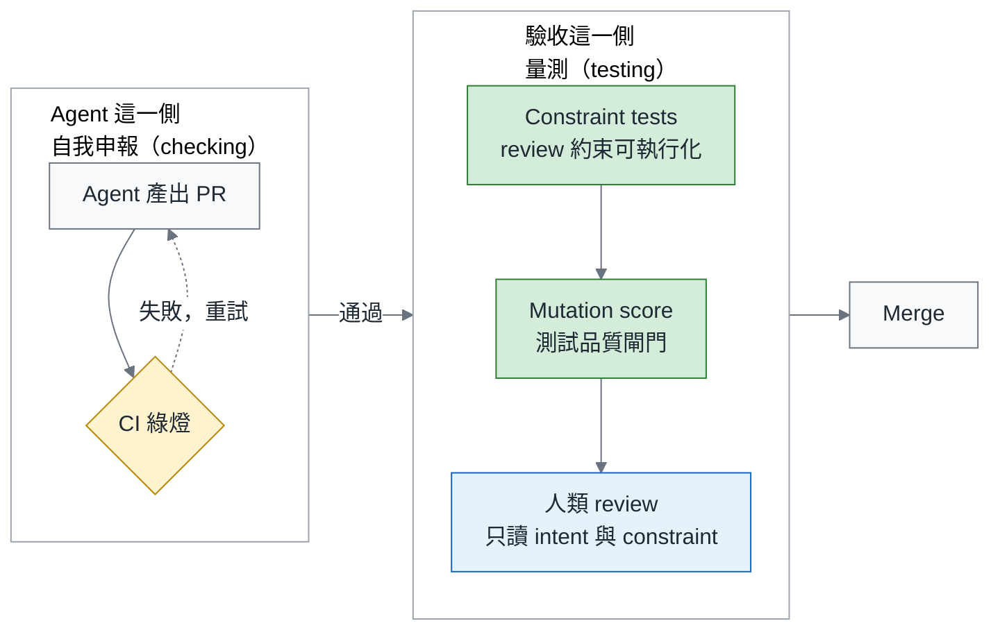

# Mermaid 圖表規範

所有文章與大綱裡的圖一律用 Mermaid 畫，原則只有一條：**在 Medium 700px 的欄寬下，
用手機也讀得清楚**。版型、配色、字型都從這條推出來。過去踩過的坑是這份規範存在的理由：
`1568×136` 的橫條在 680px 欄寬下字只剩 6px、`612×3960` 的直條要捲三頁才看得完
（見 [2026-09 總論的 PUBLISHED.md](2026-09-agentic-engineering-platform/publish/PUBLISHED.md) 第 9 項），
兩張後來都重畫了。

## 一、版型

| 規則 | 數字 | 為什麼 |
|---|---|---|
| 版面寬度 | **500 – 900 CSS px**（svg 的 viewBox 寬，不是 bounding rect） | 超過 900：顯示時縮成 700px，16px 的字會小於 12.4px；1568px 寬的圖縮到 700px，字只剩 7px。低於 500：Medium 會放大到欄寬，線條與字都變粗糙 |
| 長寬比 | **0.5 – 1.5**（高／寬） | 低於 0.5 是橫條、字會太小；高於 1.5 要捲頁，讀者會跳過 |
| 節點數 | 一張圖 **≤ 12 個節點**，超過就拆成兩張 | 12 個以上在手機上一定糊 |
| 節點文字 | **≤ 3 行、每行 ≤ 14 個中文字**，用 `<br/>` 手動換行 | Mermaid 不會幫中文斷行，長句會把節點撐成橫條 |
| 邊的文字 | ≤ 6 個字，能省就省 | 邊上的字最先糊掉 |
| 方向 | 節點 > 5 個或文字 > 1 行，用 `flowchart TB`；`LR` 只給 ≤ 5 步的流程，而且每步 ≤ 6 個字 | LR 一多就變橫條 |
| 排列 | 同一層的節點 ≤ 4 個；再多就用 `subgraph` 分組或換 TB | 五個以上並排一定超過 900px |
| 兩欄 | 直排太窄太高時（寬 < 500、高／寬 > 1.5），改成 `flowchart LR` 包兩個 `direction TB` 的 `subgraph`，**邊要連 subgraph 本身，不要連裡面的節點**（`gen --> ver`） | Mermaid 的規則：subgraph 裡的節點一旦連到外面，`direction` 就被忽略，整張圖會被拉成橫條（2026-09-05 實測 1352×171） |
| 圖的種類 | `flowchart`、`timeline`、`mindmap`、`sequenceDiagram`、`quadrantChart`；不用 `gantt`、`pie`、`xychart`（表格或文字更清楚） | 這幾種在 700px 下撐得住 |
| 表格 | 表格不是圖，直接用 markdown 表格；貼 Medium 時才轉 PNG | 表格截圖縮到卡片尺寸會糊，也不該當封面 |

**寬的東西直著畫，窄的東西排兩欄。** `timeline` 是橫排的（每個時間點一欄、事件往下疊；2026-09 總論 diagram-02 十個時間點實測 1568×400、高／寬 0.26），超過四個時間點改用兩欄 `flowchart`（左右各一個 `direction TB` 的 subgraph），五層架構用 TB 疊起來，
Before／After 用上下兩張卡片而不是左右並排；五步以內的線性流程如果直排，會變成 245×595 的細長條；
這時把「產生」與「驗收」各包成一個 `direction TB` 的 subgraph，再左右排。

## 二、配色

顏色只表達四種語意，全篇一致，不為好看多加色：

| 語意 | class | fill | stroke | 用在 |
|---|---|---|---|---|
| 推薦、你該擁有的、正確做法 | `own` | `#d4edda` | `#2e7d32` | Platform team、harness layer、build 那一側 |
| 買、採用、注意、過渡 | `buy` | `#fff3cd` | `#b8860b` | vendor runtime、caution、gate |
| 反模式、風險、失敗 | `bad` | `#ffe0e0` | `#c0392b` | 中央 Agent Team、retry loop、未通過 |
| 人類保留的工作、判斷 | `human` | `#e3f2fd` | `#1565c0` | intent、review、acceptance |
| 中性（預設） | 不設 | `#f8f9fa` | `#6b7280` | 其餘節點 |

文字一律深色 `#1f2933`，不在深底上放白字（縮小後對比不夠）。線條 `#6b7280`，
強調的邊用 `stroke-width:2px`，不用虛線以外的線型變化表達語意。

設定用 Mermaid 的 YAML frontmatter（`---\nconfig: ...\n---`）放在圖的最前面，不用 `%%{init}%%`：
多行的 `%%{init}%%` 在 Mermaid 11 會解析失敗（2026-09-05 實測「No diagram type detected」），frontmatter 沒這個問題，GitHub 也吃。

用 `classDef` 統一定義、`class` 套用，不要一個節點一行 `style`：



上面這張實測（mermaid 11，2026-09-05）：viewBox 734×459、高／寬 0.63、6 個節點、字 16px，合規，字沒有被裁。
同一張如果直排成單欄會變成 245×595（高／寬 2.4）；如果把 subgraph 裡的節點直接連到外面，
`direction TB` 會被忽略而拉成 1352×171 的橫條。

## 三、字型

- 字型固定為 `Noto Sans TC, PingFang TC, Helvetica Neue, Arial, sans-serif`，**由算繪腳本用
  `mermaid.initialize({ themeVariables: { fontFamily } })` 注入，不寫在圖的 frontmatter 裡**。
  實測 mermaid 11 會忽略 frontmatter 的 `themeVariables.fontFamily`（CSS 仍是 trebuchet ms），
  結果是量測用一種字型、算繪用容器繼承的另一種字型，「Agent 產出 PR」會被裁成「Agent 產出 PF」。
  走 initialize 兩邊才一致。中英混排時中文走 Noto Sans TC／PingFang TC，英文與數字走同一套的拉丁字形。
  這台 Mac 上沒有 Noto Sans TC，實際算繪用的是 PingFang TC；換機器算繪前先確認有其中一套，
  否則中文會退回系統預設字型、字寬改變、節點大小跟著變。
- subgraph 的標題要留邊距：`flowchart.subGraphTitleMargin: { top: 8, bottom: 12 }`，否則標題會壓到第一個節點。
- `fontSize` **16px**，不因為塞不下而調小；塞不下就拆圖。
- 不用 emoji 當圖示（算繪機器沒有彩色 emoji 字型時會變成方框）。
- 標題不放在圖裡，放在圖下方的說明文字；圖裡只有節點與邊。

## 四、每張圖的交付格式

在 `article.md`（與大綱）裡，每張圖都要有：

1. 一行說明它要讓讀者看懂什麼（一句話，這句就是圖說）。
2. 完整的 Mermaid 原始碼，開頭帶上面那段 frontmatter `config`（theme、themeVariables 的顏色、flowchart 的間距；
   **不含 fontFamily**，字型由算繪腳本注入）。文章裡可以只放一次、由算繪腳本統一注入；大綱階段每張都寫完整。
3. 預期尺寸：`TB`／`LR`、節點數、預估長寬比。

## 五、算繪與檢查

用 repo 裡的腳本，不必安裝 mermaid-cli（它借 gstack browse 的 headless Chromium，從 jsdelivr 載 mermaid；
版本釘在腳本的 `MERMAID_VERSION`，目前 11.17.2。版面尺寸來自 mermaid 的排版演算法，PASS／FAIL 會跟著版本漂，
升版要把全部的圖重跑一遍，不要只改數字）：

```bash
research/scripts/mermaid_check.sh fig.mmd            # 印出 viewBox 尺寸、高／寬、節點數，PASS／FAIL；並在 fig.mmd 旁寫出 fig.png（2x）與 fig.svg
research/scripts/mermaid_check.sh fig.mmd out/fig    # 同上，只是 PNG／SVG 改寫到 out/fig.png 與 out/fig.svg
```

它檢查的就是第一節的數字：寬 500–900、高／寬 0.5–1.5、節點 ≤ 12，並且要求檔案以 frontmatter `config` 開頭。
量的是 svg 的 `viewBox`，不是畫面上的寬度（mermaid 會用 `max-width` 把 svg 縮進容器，那個數字不可信）。
一次只能跑一張（browse 是單一 daemon）；一份 markdown 裡的所有 mermaid 區塊用 `research/scripts/mermaid_check_all.sh <file.md>` 逐張跑，結果列成一張表，FAIL 的行帶原因。

如果改用 mermaid-cli，字型要用 `--configFile`（`{"themeVariables":{"fontFamily":"..."}}`）給，
理由同第三節：frontmatter 的 fontFamily 會被忽略。

不合規的圖不進 `publish/images/`：`research/scripts/render_images.sh` 每張圖都走同一個檢查，FAIL 的不寫檔。這條放在最前面擋，比上線後用 `medium_patch.py` 換圖便宜得多
（換圖要兩步、還要等上傳完成，見 [PUBLISHING.md](PUBLISHING.md)）。
