# 2026-10「綠燈不是驗收」全系列圖表—Mermaid 原始碼

> 依據：`2026-10-agentic-green-is-not-done.md`（2026-09-05 修訂版）與 `MERMAID.md`。本檔把大綱裡規劃的每一張圖（總論 F1–F12、測試篇 T1–T5、Review 篇 R2–R5、可靠度篇 C1–C4；大綱已刪的 F8、T4、R1、R6 不在此列）各給一個標題、一句圖說、預期尺寸與完整 Mermaid。每張圖都以 MERMAID.md 第二節的 frontmatter `config` 開頭（不含 fontFamily，字型由算繪腳本注入），接四行 `classDef`。動筆時逐張跑 `research/scripts/mermaid_check.sh`，量到不合規就依各圖標題下的退路處理，不縫小字。
>
> 與大綱草稿不同的地方都寫在該圖的「調整」一行，理由只有一種：讓它在 700px 欄寬下量得過。內容（數字、名字）全部來自大綱，沒有新增出處。
>
> 四個共同修正：(1) 大綱裡兩個 `direction TB` 的 subgraph 在 `flowchart LR` 底下若沒有邊相連，dagre 會把它們當兩個不相連的元件放在同一個 rank、沿交叉軸疊起來—也就是上下疊成一條直條，不是左右兩欄；所以 F10、T1 補了 `sa ~~~ sb` 這類不可見邊（R2 的 `hi ~~~ lo` 是同一招）。(2) 節點文字裡的 `<` 在 htmlLabels 下可能被當成標籤開頭吃掉，全部改寫成 Mermaid 的實體碼 `#lt;`。(3) 菱形節點的寬與高都等於「文字寬 + 文字高」，兩行 14 字的菱形會撐到 300px 高；決策節點只在文字短的時候用菱形，長的用六角形 `{{ }}`。(4) subgraph 的 id 避開 `r`、`new` 這類容易跟節點 id 或保留字撞到的名字。

---

## 總論（10 張 Mermaid + 1 張表格圖）

### F1 驗證層脊椎—總論第六節（封面）

圖說：agent 那一側只能做 checking；merge 與授權要過驗收這一側的三道閘。

預期尺寸：`LR` 包兩個 `direction TB` subgraph、8 節點、邊只連 subgraph、預估 高／寬 0.55–0.65（寬約 700）。

調整：Reliability gate 的第二行「pass^k、constraint pass rate」剛好 14 個單位，拆成兩行以免撐寬；其餘與大綱相同。agent 側一定要寫出「agent 寫的測試」這個節點，否則圖會重犯「CI 是自我申報」的邏輯錯。

> 2026-09-06 依 MERMAID.md 重畫並實測：722×576，高／寬 0.80（原版不合規：寬 946）。

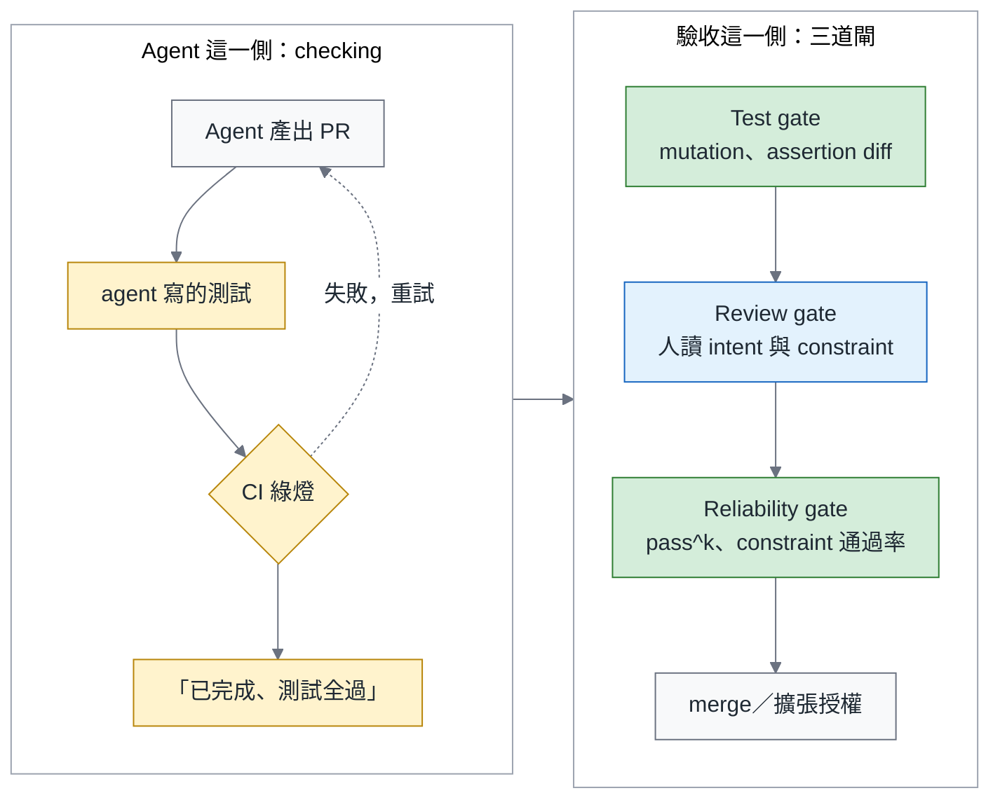
```mermaid
---
config:
  theme: base
  themeVariables:
    fontSize: 16px
    primaryColor: "#f8f9fa"
    primaryTextColor: "#1f2933"
    primaryBorderColor: "#6b7280"
    lineColor: "#6b7280"
    secondaryColor: "#f8f9fa"
    tertiaryColor: "#ffffff"
    clusterBkg: "#ffffff"
    clusterBorder: "#9ca3af"
    edgeLabelBackground: "#ffffff"
  flowchart:
    nodeSpacing: 36
    rankSpacing: 44
    padding: 12
    htmlLabels: true
    subGraphTitleMargin:
      top: 8
      bottom: 12
    curve: basis
---
flowchart LR
    classDef own fill:#d4edda,stroke:#2e7d32,color:#1f2933
    classDef buy fill:#fff3cd,stroke:#b8860b,color:#1f2933
    classDef bad fill:#ffe0e0,stroke:#c0392b,color:#1f2933
    classDef human fill:#e3f2fd,stroke:#1565c0,color:#1f2933
    subgraph gen["Agent 這一側：checking"]
        direction TB
        A["Agent 產出 PR"] --> B["agent 寫的測試"]
        B --> G{"CI 綠燈"}
        G -.->|失敗，重試| A
        G --> S["「已完成、測試全過」"]
    end
    subgraph ver["驗收這一側：三道閘"]
        direction TB
        T["Test gate<br/>mutation、assertion diff"] --> R["Review gate<br/>人讀 intent 與 constraint"]
        R --> L["Reliability gate<br/>pass^k、constraint 通過率"]
        L --> M["merge／擴張授權"]
    end
    gen --> ver
    class B,G,S buy
    class T,L own
    class R human
```

### F2 checking 與 testing—總論第二節末

圖說：更好的 check 還是 check，testing 是人的判斷，兩欄不會合併。

預期尺寸：`LR` 兩個 `direction TB` subgraph、6 節點、`~~~` 直排、邊字 3 字、預估 高／寬 0.7（寬約 620）。

調整：無；`chk -.->|不等於| tst` 這條邊同時負責把兩欄排成左右。

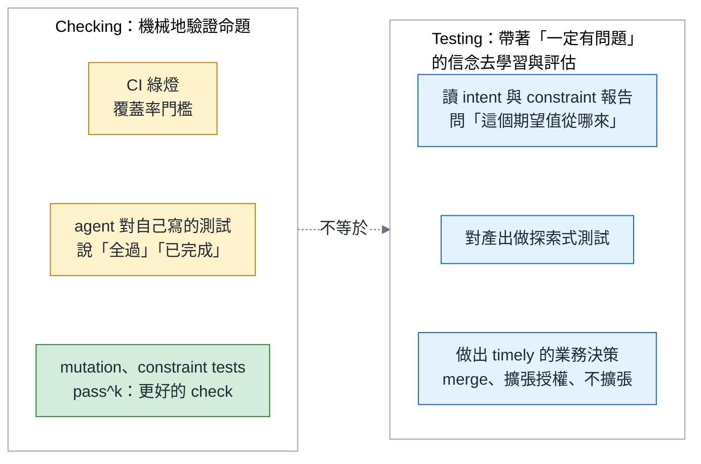
```mermaid
---
config:
  theme: base
  themeVariables:
    fontSize: 16px
    primaryColor: "#f8f9fa"
    primaryTextColor: "#1f2933"
    primaryBorderColor: "#6b7280"
    lineColor: "#6b7280"
    secondaryColor: "#f8f9fa"
    tertiaryColor: "#ffffff"
    clusterBkg: "#ffffff"
    clusterBorder: "#9ca3af"
    edgeLabelBackground: "#ffffff"
  flowchart:
    nodeSpacing: 36
    rankSpacing: 44
    padding: 12
    htmlLabels: true
    subGraphTitleMargin:
      top: 8
      bottom: 12
    curve: basis
---
flowchart LR
    classDef own fill:#d4edda,stroke:#2e7d32,color:#1f2933
    classDef buy fill:#fff3cd,stroke:#b8860b,color:#1f2933
    classDef bad fill:#ffe0e0,stroke:#c0392b,color:#1f2933
    classDef human fill:#e3f2fd,stroke:#1565c0,color:#1f2933
    subgraph chk["Checking：機械地驗證命題"]
        direction TB
        C1["CI 綠燈<br/>覆蓋率門檻"] ~~~ C2["agent 對自己寫的測試<br/>說「全過」「已完成」"]
        C2 ~~~ C3["mutation、constraint tests<br/>pass^k：更好的 check"]
    end
    subgraph tst["Testing：帶著「一定有問題」<br/>的信念去學習與評估"]
        direction TB
        T1["讀 intent 與 constraint 報告<br/>問「這個期望值從哪來」"] ~~~ T2["對產出做探索式測試"]
        T2 ~~~ T3["做出 timely 的業務決策<br/>merge、擴張授權、不擴張"]
    end
    chk -.->|不等於| tst
    class C1,C2 buy
    class C3 own
    class T1,T2,T3 human
```

### F3 綠燈量不到的三層—總論第三節（表格正下方）

圖說：你現在量的東西量不到這三層，每層都有 in-domain 的數字。

預期尺寸：`TB`、8 節點、三層排成三列（每列「層 → 錨點」兩欄）、預估 高／寬 1.1–1.25（寬約 570）。

調整：大綱畫的是 3 欄 4 列（根 → 三層並排 → 三個出處並排 → 結論），三個 3 行的出處節點並排寬約 870、四個 rank 高約 430，高／寬落在 0.48 左右，正好踩到大綱自己寫的「低於 0.5 就刪圖留表」。改成把三層放進一個 `direction LR` 的 subgraph，三對 `L --> S` 是三個不相連的元件，dagre 會把它們沿交叉軸疊成三列（跟 F9 拆 3 + 2 兩列是同一個機制）；根與結論在 subgraph 上下。層節點補上第三節表格「主張」欄的那句話，讀者不用回頭看表。S2 的文字依第三節那一列「既有測試／PR 內測試」二選一的結果調整；若是 PR 內測試讀法，第二行改成「agent 自己附的測試碰到改動行」。若量出來寬 < 500，退路是刪圖只留表（大綱原本的退路）。

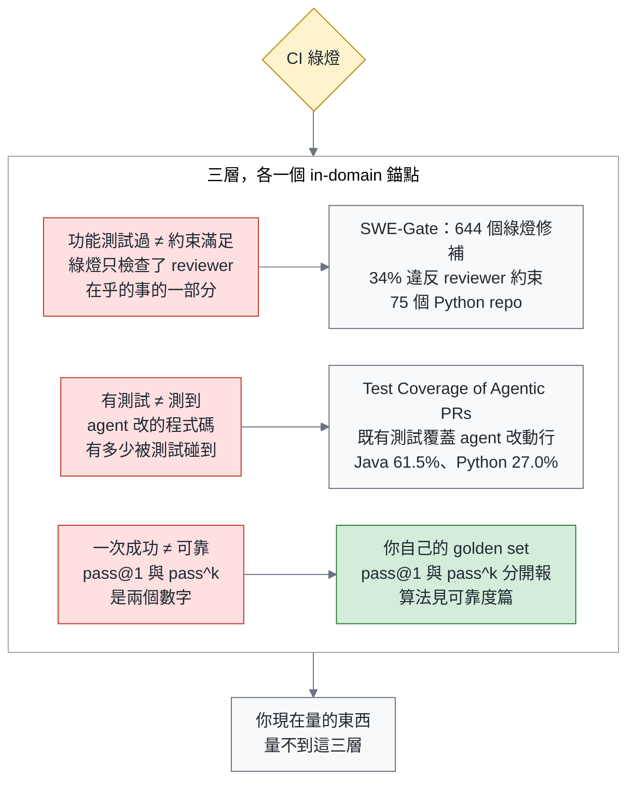
```mermaid
---
config:
  theme: base
  themeVariables:
    fontSize: 16px
    primaryColor: "#f8f9fa"
    primaryTextColor: "#1f2933"
    primaryBorderColor: "#6b7280"
    lineColor: "#6b7280"
    secondaryColor: "#f8f9fa"
    tertiaryColor: "#ffffff"
    clusterBkg: "#ffffff"
    clusterBorder: "#9ca3af"
    edgeLabelBackground: "#ffffff"
  flowchart:
    nodeSpacing: 36
    rankSpacing: 44
    padding: 12
    htmlLabels: true
    subGraphTitleMargin:
      top: 8
      bottom: 12
    curve: basis
---
flowchart TB
    classDef own fill:#d4edda,stroke:#2e7d32,color:#1f2933
    classDef buy fill:#fff3cd,stroke:#b8860b,color:#1f2933
    classDef bad fill:#ffe0e0,stroke:#c0392b,color:#1f2933
    classDef human fill:#e3f2fd,stroke:#1565c0,color:#1f2933
    G{"CI 綠燈"}
    subgraph layers["三層，各一個 in-domain 錨點"]
        direction LR
        L1["功能測試過 ≠ 約束滿足<br/>綠燈只檢查了 reviewer<br/>在乎的事的一部分"] --> S1["SWE-Gate：644 個綠燈修補<br/>34% 違反 reviewer 約束<br/>75 個 Python repo"]
        L2["有測試 ≠ 測到<br/>agent 改的程式碼<br/>有多少被測試碰到"] --> S2["Test Coverage of Agentic PRs<br/>既有測試覆蓋 agent 改動行<br/>Java 61.5%、Python 27.0%"]
        L3["一次成功 ≠ 可靠<br/>pass@1 與 pass^k<br/>是兩個數字"] --> S3["你自己的 golden set<br/>pass@1 與 pass^k 分開報<br/>算法見可靠度篇"]
    end
    G --> layers
    layers --> C["你現在量的東西<br/>量不到這三層"]
    class G buy
    class L1,L2,L3 bad
    class S3 own
```

### F4 測試史 ↔ 驗證層—總論第四節

圖說：commit 綠了不等於 release，測試史已經演過一次。

預期尺寸：`LR` 兩個 `direction TB` subgraph、8 節點、左欄箭頭串年代、右欄 `~~~` 直排、預估 高／寬 0.6–0.65（寬約 620）。

調整：無。不用 `timeline`（7 個 period 橫排會超過 900）。年份 1976／1978／2009／2010 是大綱 F4 的數字，動筆前依第一節「歷史類比」的提醒補查原文年份；預測（2027 reliability gate 普及）不進圖，留給結語。

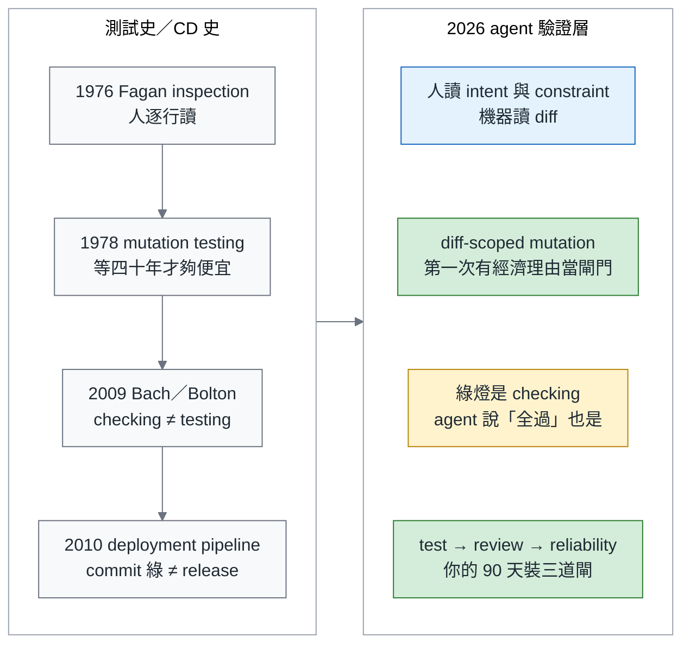
```mermaid
---
config:
  theme: base
  themeVariables:
    fontSize: 16px
    primaryColor: "#f8f9fa"
    primaryTextColor: "#1f2933"
    primaryBorderColor: "#6b7280"
    lineColor: "#6b7280"
    secondaryColor: "#f8f9fa"
    tertiaryColor: "#ffffff"
    clusterBkg: "#ffffff"
    clusterBorder: "#9ca3af"
    edgeLabelBackground: "#ffffff"
  flowchart:
    nodeSpacing: 36
    rankSpacing: 44
    padding: 12
    htmlLabels: true
    subGraphTitleMargin:
      top: 8
      bottom: 12
    curve: basis
---
flowchart LR
    classDef own fill:#d4edda,stroke:#2e7d32,color:#1f2933
    classDef buy fill:#fff3cd,stroke:#b8860b,color:#1f2933
    classDef bad fill:#ffe0e0,stroke:#c0392b,color:#1f2933
    classDef human fill:#e3f2fd,stroke:#1565c0,color:#1f2933
    subgraph past["測試史／CD 史"]
        direction TB
        P1["1976 Fagan inspection<br/>人逐行讀"] --> P2["1978 mutation testing<br/>等四十年才夠便宜"]
        P2 --> P3["2009 Bach／Bolton<br/>checking ≠ testing"]
        P3 --> P4["2010 deployment pipeline<br/>commit 綠 ≠ release"]
    end
    subgraph now["2026 agent 驗證層"]
        direction TB
        N1["人讀 intent 與 constraint<br/>機器讀 diff"] ~~~ N2["diff-scoped mutation<br/>第一次有經濟理由當閘門"]
        N2 ~~~ N3["綠燈是 checking<br/>agent 說「全過」也是"]
        N3 ~~~ N4["test → review → reliability<br/>你的 90 天裝三道閘"]
    end
    past --> now
    class N1 human
    class N2,N4 own
    class N3 buy
```

### F5 指示 vs 量測—總論第五節

不畫 Mermaid：這一張是第五節「你想要的／指示型做法／量測型做法」三欄五列的表格本身，貼 Medium 時由 markdown 表格轉 PNG（MERMAID.md 第一節「表格不是圖」；大綱明寫不寫 Mermaid、不進 mermaid_check、不當封面）。Before／After 卡片只在測試篇第五節出現，這裡不畫。

### F6 Review 是控制點—總論第七節

圖說：review 是決定 agent 是加分還是負債的控制點，免審合併率是要管的指標。

預期尺寸：`TB`、7 節點、2 欄 5 個 rank、預估 高／寬 0.85–0.9（寬約 560）。

調整：無。負債鏈的數字是關聯不是因果，節點文字帶「關聯」；secret 那一格只寫「多半」，兩個各自的比例（67.6%、81.1%）留在 Review 篇第二節。

> 2026-09-06 依 MERMAID.md 重畫並實測：515×672，高／寬 1.30（原版不合規：寬 455）。

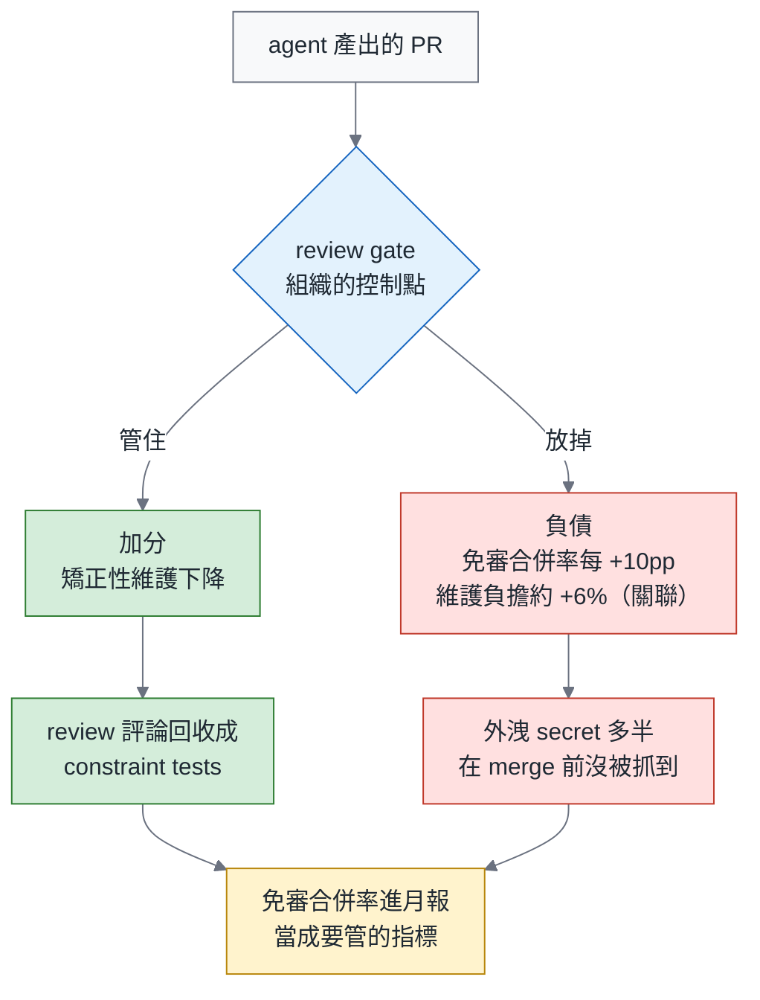
```mermaid
---
config:
  theme: base
  themeVariables:
    fontSize: 16px
    primaryColor: "#f8f9fa"
    primaryTextColor: "#1f2933"
    primaryBorderColor: "#6b7280"
    lineColor: "#6b7280"
    secondaryColor: "#f8f9fa"
    tertiaryColor: "#ffffff"
    clusterBkg: "#ffffff"
    clusterBorder: "#9ca3af"
    edgeLabelBackground: "#ffffff"
  flowchart:
    nodeSpacing: 96
    rankSpacing: 44
    padding: 12
    htmlLabels: true
    subGraphTitleMargin:
      top: 8
      bottom: 12
    curve: basis
---
flowchart TB
    classDef own fill:#d4edda,stroke:#2e7d32,color:#1f2933
    classDef buy fill:#fff3cd,stroke:#b8860b,color:#1f2933
    classDef bad fill:#ffe0e0,stroke:#c0392b,color:#1f2933
    classDef human fill:#e3f2fd,stroke:#1565c0,color:#1f2933
    A["agent 產出的 PR"] --> R{"review gate<br/>組織的控制點"}
    R -->|管住| G1["加分<br/>矯正性維護下降"]
    G1 --> G2["review 評論回收成<br/>constraint tests"]
    R -->|放掉| B1["負債<br/>免審合併率每 +10pp<br/>維護負擔約 +6%（關聯）"]
    B1 --> B2["外洩 secret 多半<br/>在 merge 前沒被抓到"]
    G2 & B2 --> M["免審合併率進月報<br/>當成要管的指標"]
    class R human
    class G1,G2 own
    class B1,B2 bad
    class M buy
```

### F7 這個 PR 誰要讀—總論第七節（Review 篇 R2 的縮圖）

圖說：blast radius 與可驗證程度決定誰讀什麼，人只在兩格讀。

預期尺寸：`TB`、8 節點、底層 4 個（同層上限）、預估寬約 800、高／寬 0.9–1.0。

調整：無。三個菱形都是兩行文字：Q1 的邊長約 300、Q2／Q3 各約 240，兩個並排 520 以內；底層四個出口約 800 寬是這張圖的寬度上限。若量出來寬 > 900，退路是把 Q2、Q3 改成矩形（`[" "]`）保留邊上的「有／沒有」。四個出口的措辭與 Review 篇 R2 的四格對應（人讀 intent 與報告／人讀 diff 並回收約束／機器全審 + 人抽樣／先補 check）。

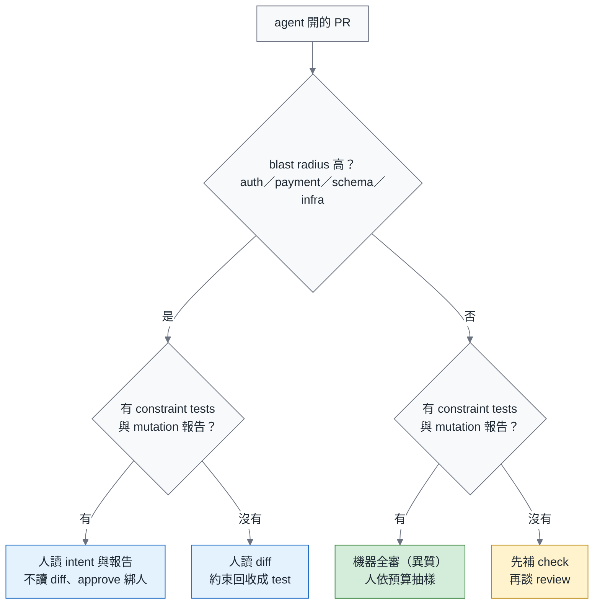
```mermaid
---
config:
  theme: base
  themeVariables:
    fontSize: 16px
    primaryColor: "#f8f9fa"
    primaryTextColor: "#1f2933"
    primaryBorderColor: "#6b7280"
    lineColor: "#6b7280"
    secondaryColor: "#f8f9fa"
    tertiaryColor: "#ffffff"
    clusterBkg: "#ffffff"
    clusterBorder: "#9ca3af"
    edgeLabelBackground: "#ffffff"
  flowchart:
    nodeSpacing: 36
    rankSpacing: 44
    padding: 12
    htmlLabels: true
    subGraphTitleMargin:
      top: 8
      bottom: 12
    curve: basis
---
flowchart TB
    classDef own fill:#d4edda,stroke:#2e7d32,color:#1f2933
    classDef buy fill:#fff3cd,stroke:#b8860b,color:#1f2933
    classDef bad fill:#ffe0e0,stroke:#c0392b,color:#1f2933
    classDef human fill:#e3f2fd,stroke:#1565c0,color:#1f2933
    P["agent 開的 PR"] --> Q1{"blast radius 高？<br/>auth／payment／schema／infra"}
    Q1 -->|是| Q2{"有 constraint tests<br/>與 mutation 報告？"}
    Q1 -->|否| Q3{"有 constraint tests<br/>與 mutation 報告？"}
    Q2 -->|有| O1["人讀 intent 與報告<br/>不讀 diff、approve 綁人"]
    Q2 -->|沒有| O2["人讀 diff<br/>約束回收成 test"]
    Q3 -->|有| O3["機器全審（異質）<br/>人依預算抽樣"]
    Q3 -->|沒有| O4["先補 check<br/>再談 review"]
    class O1,O2 human
    class O3 own
    class O4 buy
```

### F9 pass@1 vs pass^k（定義圖）—總論第八節（定義段之後）

圖說：單一 case，5 次 run 1 次紅：該 case pass@1 = 80%、pass^5 = 0；golden set 的數字是所有 case 的平均。

預期尺寸：`TB`、8 節點、5 個 run 拆 3 + 2 兩列（subgraph 內 `direction LR`）、邊只連 subgraph、預估 高／寬 0.75–0.8（寬約 520）。

調整：兩個結果節點的文字加長一點（「4 次過／5 次」「5 次裡有一次紅」），因為大綱版本的整張圖寬約 460，會低於 500；語意不變。run 那一列的 subgraph 標題留空（`" "`），只當框線用。

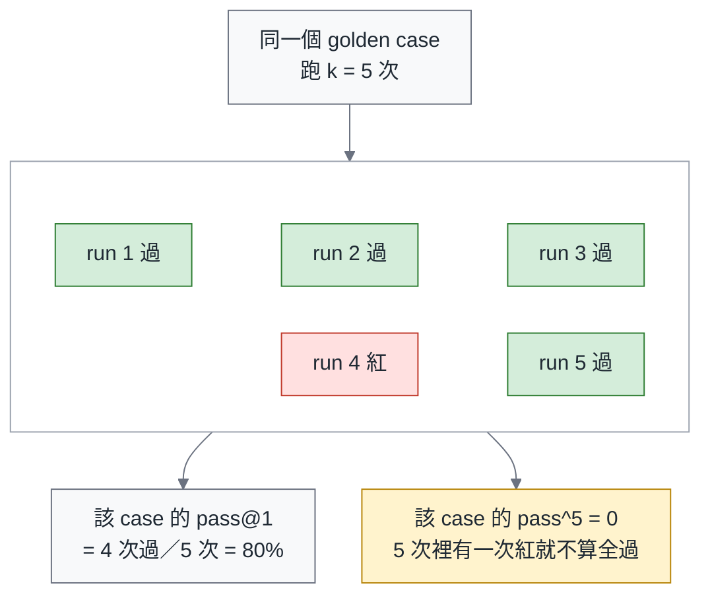
```mermaid
---
config:
  theme: base
  themeVariables:
    fontSize: 16px
    primaryColor: "#f8f9fa"
    primaryTextColor: "#1f2933"
    primaryBorderColor: "#6b7280"
    lineColor: "#6b7280"
    secondaryColor: "#f8f9fa"
    tertiaryColor: "#ffffff"
    clusterBkg: "#ffffff"
    clusterBorder: "#9ca3af"
    edgeLabelBackground: "#ffffff"
  flowchart:
    nodeSpacing: 36
    rankSpacing: 44
    padding: 12
    htmlLabels: true
    subGraphTitleMargin:
      top: 8
      bottom: 12
    curve: basis
---
flowchart TB
    classDef own fill:#d4edda,stroke:#2e7d32,color:#1f2933
    classDef buy fill:#fff3cd,stroke:#b8860b,color:#1f2933
    classDef bad fill:#ffe0e0,stroke:#c0392b,color:#1f2933
    classDef human fill:#e3f2fd,stroke:#1565c0,color:#1f2933
    C["同一個 golden case<br/>跑 k = 5 次"]
    subgraph runs[" "]
        direction LR
        r1["run 1 過"] ~~~ r2["run 2 過"] ~~~ r3["run 3 過"]
        r4["run 4 紅"] ~~~ r5["run 5 過"]
    end
    C --> runs
    runs --> P1["該 case 的 pass@1<br/>= 4 次過／5 次 = 80%"]
    runs --> P5["該 case 的 pass^5 = 0<br/>5 次裡有一次紅就不算全過"]
    class r1,r2,r3,r5 own
    class r4 bad
    class P5 buy
```

### F10 oversight budget（READY）—總論第八節（READY 段之後）

圖說：準確率只差 0.3pp 的兩個系統，人工複核需求差近 10pp（READY）；若讀完全文確認任務領域非 code，圖說加「（非 code 旁證）」。

預期尺寸：`LR` 兩個 `direction TB` subgraph、6 節點、預估 高／寬 0.55–0.6（寬約 530）。

調整：大綱版本兩個 subgraph 之間沒有邊，dagre 會把它們上下疊成一條直條，補 `sa ~~~ sb` 讓它們左右排。subgraph 標題加長（「準確率高 0.3pp」「人力少近 10pp」），否則整張圖寬約 400。72.8% 對到 39.2% 是摘要的順序（準確率較高者反而要更多複核），配對以全文為準—第四節「不可省」第 2 項的確認點；若全文相反，交換 A3、B3 的數字與 class 即可。目標節點各畫一個，配對才看得出來。

> 2026-09-06 依 MERMAID.md 重畫並實測：551×459，高／寬 0.83（原版不合規：寬 428）。

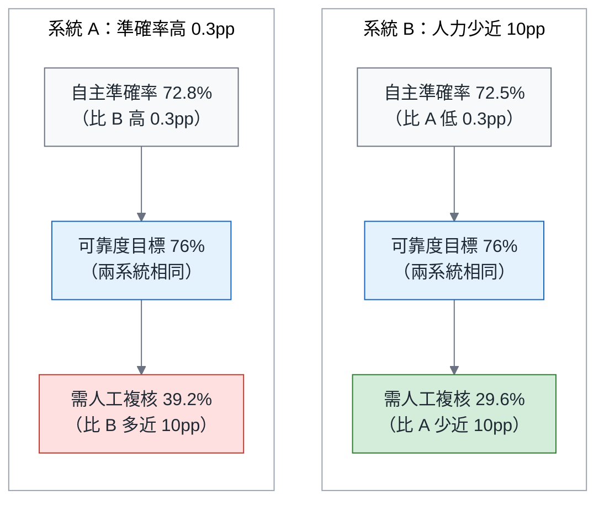
```mermaid
---
config:
  theme: base
  themeVariables:
    fontSize: 16px
    primaryColor: "#f8f9fa"
    primaryTextColor: "#1f2933"
    primaryBorderColor: "#6b7280"
    lineColor: "#6b7280"
    secondaryColor: "#f8f9fa"
    tertiaryColor: "#ffffff"
    clusterBkg: "#ffffff"
    clusterBorder: "#9ca3af"
    edgeLabelBackground: "#ffffff"
  flowchart:
    nodeSpacing: 36
    rankSpacing: 44
    padding: 12
    htmlLabels: true
    subGraphTitleMargin:
      top: 8
      bottom: 12
    curve: basis
---
flowchart LR
    classDef own fill:#d4edda,stroke:#2e7d32,color:#1f2933
    classDef buy fill:#fff3cd,stroke:#b8860b,color:#1f2933
    classDef bad fill:#ffe0e0,stroke:#c0392b,color:#1f2933
    classDef human fill:#e3f2fd,stroke:#1565c0,color:#1f2933
    subgraph sa["系統 A：準確率高 0.3pp"]
        direction TB
        A1["自主準確率 72.8%<br/>（比 B 高 0.3pp）"] --> A2["可靠度目標 76%<br/>（兩系統相同）"] --> A3["需人工複核 39.2%<br/>（比 B 多近 10pp）"]
    end
    subgraph sb["系統 B：人力少近 10pp"]
        direction TB
        B1["自主準確率 72.5%<br/>（比 A 低 0.3pp）"] --> B2["可靠度目標 76%<br/>（兩系統相同）"] --> B3["需人工複核 29.6%<br/>（比 A 少近 10pp）"]
    end
    sa ~~~ sb
    class A2,B2 human
    class A3 bad
    class B3 own
```

### F11 八個反模式—總論第九節

圖說：八個反模式各歸一道閘，也各歸一篇。

預期尺寸：`TB`、9 節點（根 + 8 葉）、3 個 subgraph 並排、葉子 `~~~` 直排全套 bad、預估寬約 760、高／寬 0.55–0.6。

調整：subgraph id 改成 `gt`／`gr`／`gl`，避免跟節點 id `r1`、`R` 混淆。不用 `mindmap`（放射狀排法寬度多半落在 900–1100，而且不支援 `classDef`）。同一支不超過 4 葉。

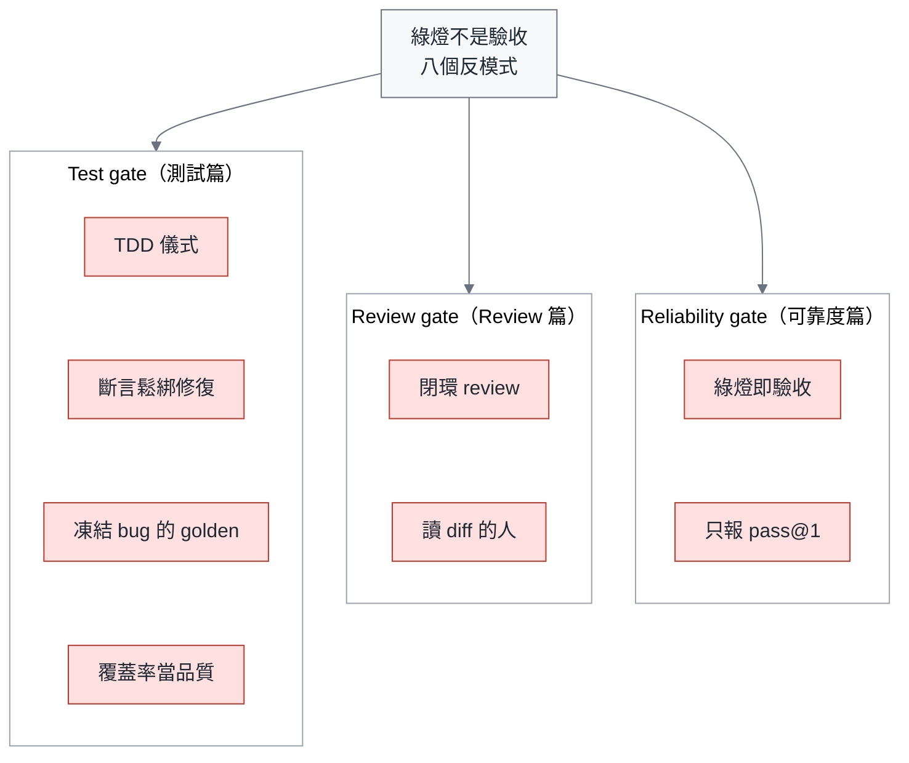
```mermaid
---
config:
  theme: base
  themeVariables:
    fontSize: 16px
    primaryColor: "#f8f9fa"
    primaryTextColor: "#1f2933"
    primaryBorderColor: "#6b7280"
    lineColor: "#6b7280"
    secondaryColor: "#f8f9fa"
    tertiaryColor: "#ffffff"
    clusterBkg: "#ffffff"
    clusterBorder: "#9ca3af"
    edgeLabelBackground: "#ffffff"
  flowchart:
    nodeSpacing: 36
    rankSpacing: 44
    padding: 12
    htmlLabels: true
    subGraphTitleMargin:
      top: 8
      bottom: 12
    curve: basis
---
flowchart TB
    classDef own fill:#d4edda,stroke:#2e7d32,color:#1f2933
    classDef buy fill:#fff3cd,stroke:#b8860b,color:#1f2933
    classDef bad fill:#ffe0e0,stroke:#c0392b,color:#1f2933
    classDef human fill:#e3f2fd,stroke:#1565c0,color:#1f2933
    R["綠燈不是驗收<br/>八個反模式"]
    subgraph gt["Test gate（測試篇）"]
        direction TB
        t1["TDD 儀式"] ~~~ t2["斷言鬆綁修復"] ~~~ t3["凍結 bug 的 golden"] ~~~ t4["覆蓋率當品質"]
    end
    subgraph gr["Review gate（Review 篇）"]
        direction TB
        r1["閉環 review"] ~~~ r2["讀 diff 的人"]
    end
    subgraph gl["Reliability gate（可靠度篇）"]
        direction TB
        l1["綠燈即驗收"] ~~~ l2["只報 pass@1"]
    end
    R --> gt
    R --> gr
    R --> gl
    class t1,t2,t3,t4,r1,r2,l1,l2 bad
```

### F12 90 天藍圖—總論第十一節（表格之後）

圖說：三個月、三個退出條件，最後一步是一次要公開理由的 G2 決策。

預期尺寸：`TB`、7 節點、2 欄 4 個 rank（`M1 --> E1`／`M1 --> M2` 的接法讓退出條件落在月份節點右側）、預估 高／寬 0.8–0.85（寬約 560）。

調整：無。第 4–6 個月是「以 repo 為單位重複」，不進圖，留在表。

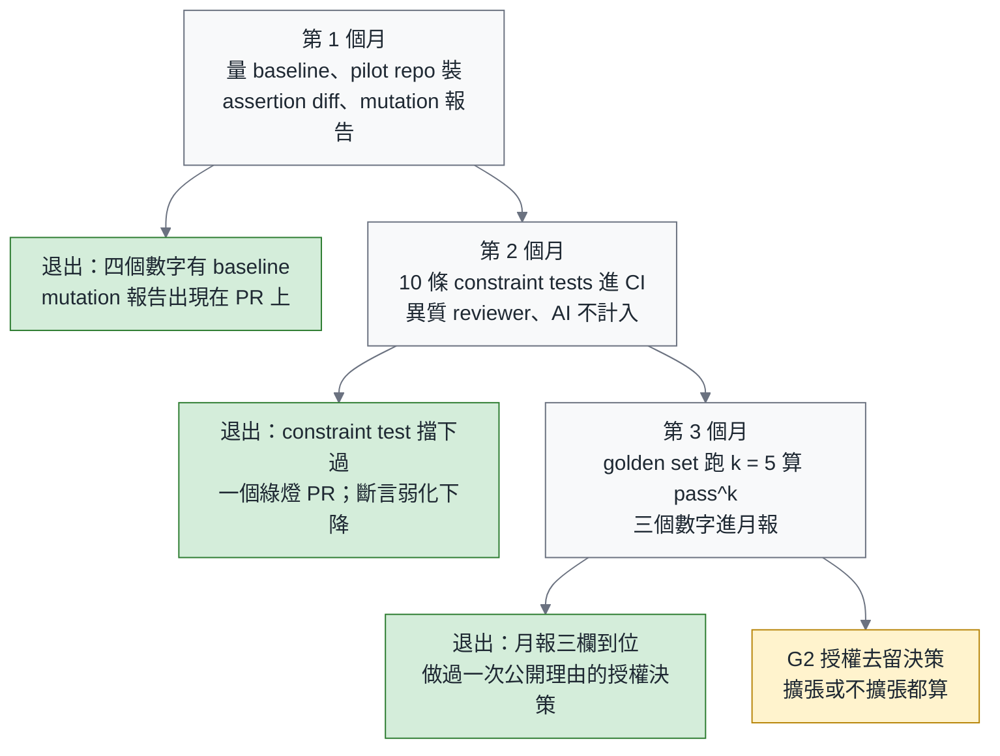
```mermaid
---
config:
  theme: base
  themeVariables:
    fontSize: 16px
    primaryColor: "#f8f9fa"
    primaryTextColor: "#1f2933"
    primaryBorderColor: "#6b7280"
    lineColor: "#6b7280"
    secondaryColor: "#f8f9fa"
    tertiaryColor: "#ffffff"
    clusterBkg: "#ffffff"
    clusterBorder: "#9ca3af"
    edgeLabelBackground: "#ffffff"
  flowchart:
    nodeSpacing: 36
    rankSpacing: 44
    padding: 12
    htmlLabels: true
    subGraphTitleMargin:
      top: 8
      bottom: 12
    curve: basis
---
flowchart TB
    classDef own fill:#d4edda,stroke:#2e7d32,color:#1f2933
    classDef buy fill:#fff3cd,stroke:#b8860b,color:#1f2933
    classDef bad fill:#ffe0e0,stroke:#c0392b,color:#1f2933
    classDef human fill:#e3f2fd,stroke:#1565c0,color:#1f2933
    M1["第 1 個月<br/>量 baseline、pilot repo 裝<br/>assertion diff、mutation 報告"] --> E1["退出：四個數字有 baseline<br/>mutation 報告出現在 PR 上"]
    M1 --> M2["第 2 個月<br/>10 條 constraint tests 進 CI<br/>異質 reviewer、AI 不計入"]
    M2 --> E2["退出：constraint test 擋下過<br/>一個綠燈 PR；斷言弱化下降"]
    M2 --> M3["第 3 個月<br/>golden set 跑 k = 5 算 pass^k<br/>三個數字進月報"]
    M3 --> E3["退出：月報三欄到位<br/>做過一次公開理由的授權決策"]
    M3 --> G["G2 授權去留決策<br/>擴張或不擴張都算"]
    class E1,E2,E3 own
    class G buy
```

---

## 測試篇（4 張）

### T1 四種壞法 → check—測試篇第二節末（封面）

圖說：四種壞法各有一個便宜的 check，人不用逐行讀測試。

預期尺寸：`LR` 兩個 `direction TB` subgraph、8 節點、2 欄 4 列、預估 高／寬 0.7（寬約 600）。

調整：大綱版本兩個 subgraph 之間沒有邊，會上下疊成直條；補 `a ~~~ b`。A1 第二行「assertEqual → assertTrue(x>=1)」超過 14 個單位、而且含 `>`，改成「assertEqual 改成 assertTrue」，例子的細節（`== 3` → `>= 1`）留在第二節的表。

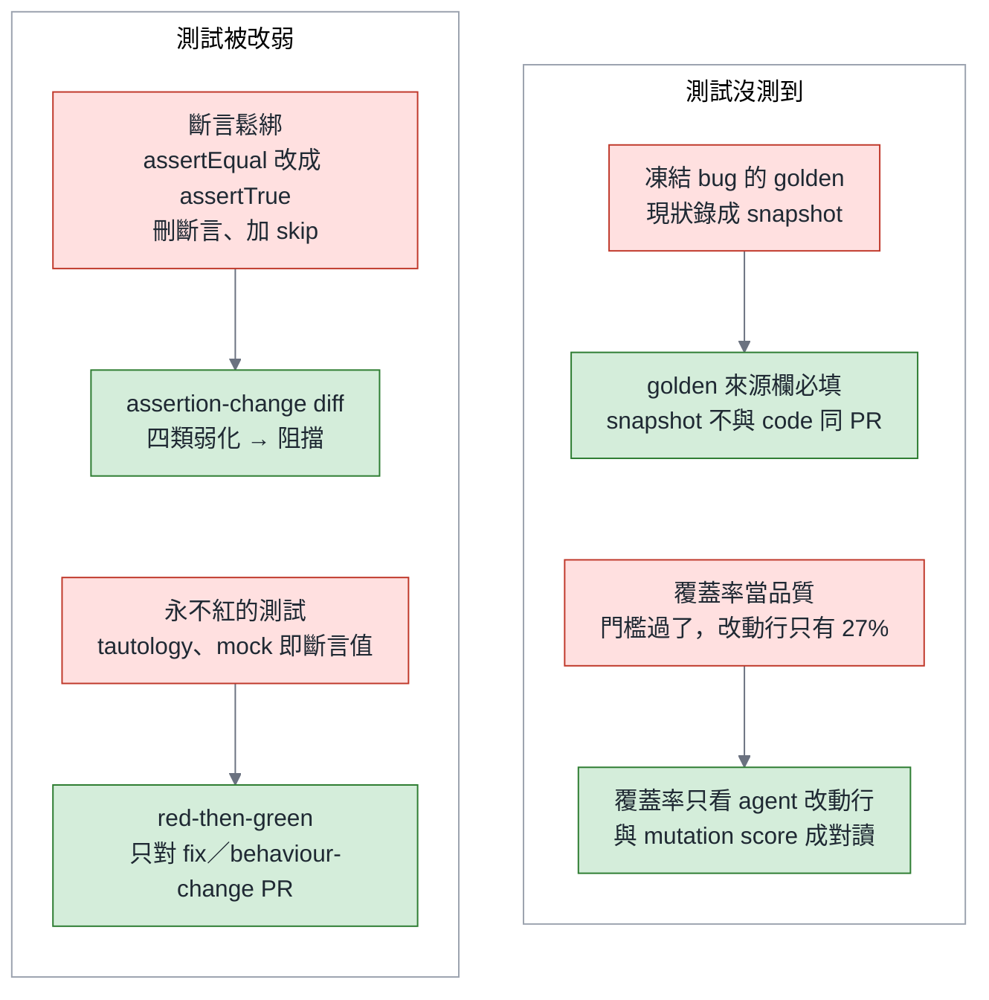
```mermaid
---
config:
  theme: base
  themeVariables:
    fontSize: 16px
    primaryColor: "#f8f9fa"
    primaryTextColor: "#1f2933"
    primaryBorderColor: "#6b7280"
    lineColor: "#6b7280"
    secondaryColor: "#f8f9fa"
    tertiaryColor: "#ffffff"
    clusterBkg: "#ffffff"
    clusterBorder: "#9ca3af"
    edgeLabelBackground: "#ffffff"
  flowchart:
    nodeSpacing: 36
    rankSpacing: 44
    padding: 12
    htmlLabels: true
    subGraphTitleMargin:
      top: 8
      bottom: 12
    curve: basis
---
flowchart LR
    classDef own fill:#d4edda,stroke:#2e7d32,color:#1f2933
    classDef buy fill:#fff3cd,stroke:#b8860b,color:#1f2933
    classDef bad fill:#ffe0e0,stroke:#c0392b,color:#1f2933
    classDef human fill:#e3f2fd,stroke:#1565c0,color:#1f2933
    subgraph a["測試被改弱"]
        direction TB
        A1["斷言鬆綁<br/>assertEqual 改成 assertTrue<br/>刪斷言、加 skip"] --> C1["assertion-change diff<br/>四類弱化 → 阻擋"]
        C1 ~~~ A2["永不紅的測試<br/>tautology、mock 即斷言值"]
        A2 --> C2["red-then-green<br/>只對 fix／behaviour-change PR"]
    end
    subgraph b["測試沒測到"]
        direction TB
        B1["凍結 bug 的 golden<br/>現狀錄成 snapshot"] --> D1["golden 來源欄必填<br/>snapshot 不與 code 同 PR"]
        D1 ~~~ B2["覆蓋率當品質<br/>門檻過了，改動行只有 27%"]
        B2 --> D2["覆蓋率只看 agent 改動行<br/>與 mutation score 成對讀"]
    end
    a ~~~ b
    class A1,A2,B1,B2 bad
    class C1,C2,D1,D2 own
```

### T2 test gate pipeline—測試篇第五節

圖說：三個 job 平行跑，輸出報告給人讀，第一個月不阻擋。

預期尺寸：`TB`、6 節點、三個 job 包在一個 subgraph 裡並排、預估 高／寬 0.6（寬約 770）。

調整：大綱版本（PR 扇出到三個 job 再收回）三個 3 行節點並排、四個 rank，高／寬約 0.5，太貼邊。把三個 job 包進一個沒有 `direction` 的 subgraph（跟著外層 TB，三個無邊節點同一 rank 並排），標題「test-gate.yml：三個 job 平行跑」多出的高度把比例拉到 0.6；邊連 subgraph 本身。`< 10 分鐘` 用 `#lt;`。

> 2026-09-06 依 MERMAID.md 重畫並實測：843×524，高／寬 0.62（原版不合規：333×872）。

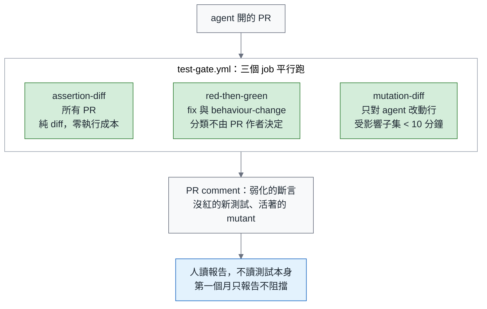
```mermaid
---
config:
  theme: base
  themeVariables:
    fontSize: 16px
    primaryColor: "#f8f9fa"
    primaryTextColor: "#1f2933"
    primaryBorderColor: "#6b7280"
    lineColor: "#6b7280"
    secondaryColor: "#f8f9fa"
    tertiaryColor: "#ffffff"
    clusterBkg: "#ffffff"
    clusterBorder: "#9ca3af"
    edgeLabelBackground: "#ffffff"
  flowchart:
    nodeSpacing: 24
    rankSpacing: 44
    padding: 12
    htmlLabels: true
    subGraphTitleMargin:
      top: 8
      bottom: 12
    curve: basis
---
flowchart TB
    classDef own fill:#d4edda,stroke:#2e7d32,color:#1f2933
    classDef buy fill:#fff3cd,stroke:#b8860b,color:#1f2933
    classDef bad fill:#ffe0e0,stroke:#c0392b,color:#1f2933
    classDef human fill:#e3f2fd,stroke:#1565c0,color:#1f2933
    P["agent 開的 PR"]
    subgraph jobs["test-gate.yml：三個 job 平行跑"]
        direction LR
        J1["assertion-diff<br/>所有 PR<br/>純 diff，零執行成本"] ~~~ J2["red-then-green<br/>fix 與 behaviour-change<br/>分類不由 PR 作者決定"] ~~~ J3["mutation-diff<br/>只對 agent 改動行<br/>受影響子集 #lt; 10 分鐘"]
    end
    P --> jobs
    jobs --> R["PR comment：弱化的斷言<br/>沒紅的新測試、活著的 mutant"]
    R --> H["人讀報告，不讀測試本身<br/>第一個月只報告不阻擋"]
    class J1,J2,J3 own
    class H human
```

### T3 red-then-green 流程—測試篇第五節（Check 1）

圖說：red-then-green 只對修改既有行為的 PR 開，三個出口只有「沒紅」是壞訊號。

預期尺寸：`TB`、7 節點、底層 3 個、預估 高／寬 0.8（寬約 760）。

調整：判斷節點從三行壓成兩行（菱形的高等於文字寬加文字高，三行會撐到 300px 以上）；內容不變：分類來源是 ticket type 或「是否改了既有非測試檔」，不是 PR label。

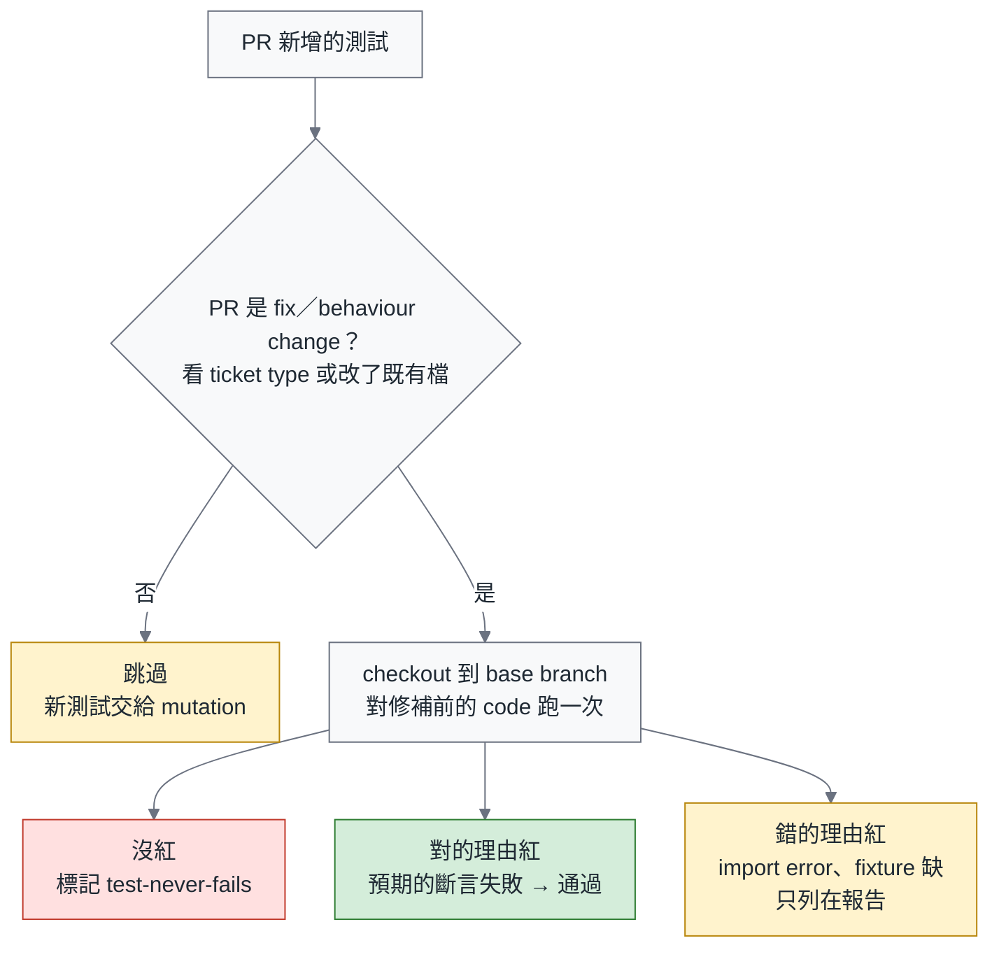
```mermaid
---
config:
  theme: base
  themeVariables:
    fontSize: 16px
    primaryColor: "#f8f9fa"
    primaryTextColor: "#1f2933"
    primaryBorderColor: "#6b7280"
    lineColor: "#6b7280"
    secondaryColor: "#f8f9fa"
    tertiaryColor: "#ffffff"
    clusterBkg: "#ffffff"
    clusterBorder: "#9ca3af"
    edgeLabelBackground: "#ffffff"
  flowchart:
    nodeSpacing: 36
    rankSpacing: 44
    padding: 12
    htmlLabels: true
    subGraphTitleMargin:
      top: 8
      bottom: 12
    curve: basis
---
flowchart TB
    classDef own fill:#d4edda,stroke:#2e7d32,color:#1f2933
    classDef buy fill:#fff3cd,stroke:#b8860b,color:#1f2933
    classDef bad fill:#ffe0e0,stroke:#c0392b,color:#1f2933
    classDef human fill:#e3f2fd,stroke:#1565c0,color:#1f2933
    N["PR 新增的測試"] --> Q{"PR 是 fix／behaviour change？<br/>看 ticket type 或改了既有檔"}
    Q -->|否| S["跳過<br/>新測試交給 mutation"]
    Q -->|是| R["checkout 到 base branch<br/>對修補前的 code 跑一次"]
    R --> O1["沒紅<br/>標記 test-never-fails"]
    R --> O2["對的理由紅<br/>預期的斷言失敗 → 通過"]
    R --> O3["錯的理由紅<br/>import error、fixture 缺<br/>只列在報告"]
    class S,O3 buy
    class O1 bad
    class O2 own
```

### T5 工作坊實例—測試篇第七節

圖說：5 個測試全綠，規格要的 replay 路徑從未被執行。

預期尺寸：`TB`、6 節點、2 欄 4 個 rank、預估 高／寬 0.85（寬約 560）。

調整：無。replay 路徑與「從未被執行」套 bad；規格節點套 human（它是人寫的 intent）。若截圖或節點文字會帶到 Teddy 課程 repo 的檔名，先徵得同意（第四節「不可省」第 5 項）—圖裡目前只有類別名 `EventSourcedAggregate`、`getDomainEvents()`。

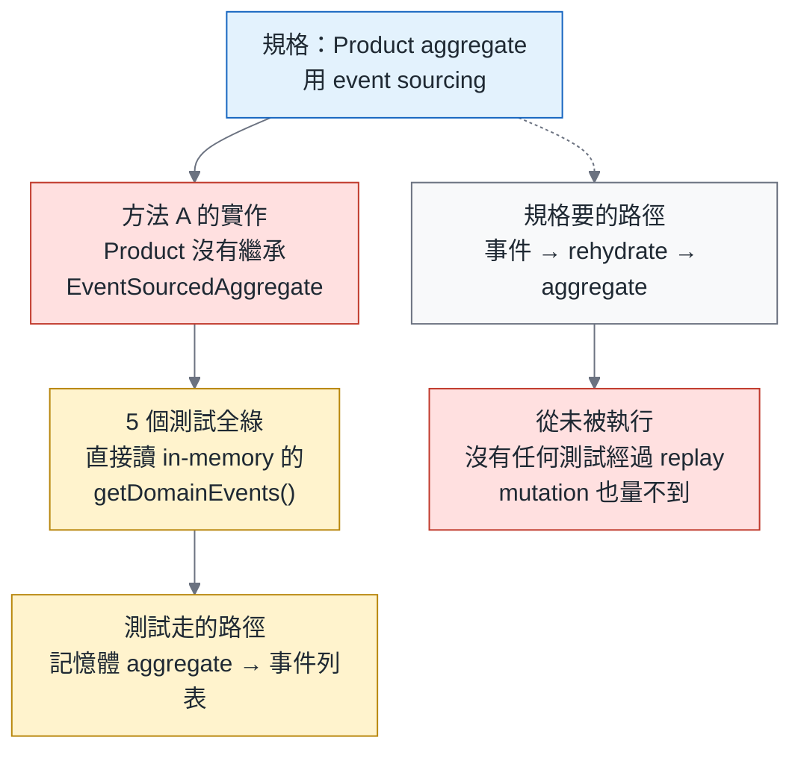
```mermaid
---
config:
  theme: base
  themeVariables:
    fontSize: 16px
    primaryColor: "#f8f9fa"
    primaryTextColor: "#1f2933"
    primaryBorderColor: "#6b7280"
    lineColor: "#6b7280"
    secondaryColor: "#f8f9fa"
    tertiaryColor: "#ffffff"
    clusterBkg: "#ffffff"
    clusterBorder: "#9ca3af"
    edgeLabelBackground: "#ffffff"
  flowchart:
    nodeSpacing: 36
    rankSpacing: 44
    padding: 12
    htmlLabels: true
    subGraphTitleMargin:
      top: 8
      bottom: 12
    curve: basis
---
flowchart TB
    classDef own fill:#d4edda,stroke:#2e7d32,color:#1f2933
    classDef buy fill:#fff3cd,stroke:#b8860b,color:#1f2933
    classDef bad fill:#ffe0e0,stroke:#c0392b,color:#1f2933
    classDef human fill:#e3f2fd,stroke:#1565c0,color:#1f2933
    S["規格：Product aggregate<br/>用 event sourcing"] --> C["方法 A 的實作<br/>Product 沒有繼承<br/>EventSourcedAggregate"]
    C --> T["5 個測試全綠<br/>直接讀 in-memory 的<br/>getDomainEvents()"]
    T --> P1["測試走的路徑<br/>記憶體 aggregate → 事件列表"]
    S -.-> P2["規格要的路徑<br/>事件 → rehydrate → aggregate"]
    P2 --> X["從未被執行<br/>沒有任何測試經過 replay<br/>mutation 也量不到"]
    class S human
    class T,P1 buy
    class C,X bad
```

---

## Review 篇（4 張）

### R2 分流矩陣—Review 篇第三節（封面）

圖說：四格裡只有兩格人讀，而且只有一格讀 diff；每一格 merge 都帶一個人類 approve。

預期尺寸：`TB`、5 節點（頂端「agent 開的 PR」+ 四格）、兩個 `direction LR` subgraph 用 `~~~` 疊起來、預估 高／寬 0.75（寬約 570）。

調整：大綱的主版本是 4 節點、預估 0.5，並寫了退路「量到 < 0.5 就在最上面加 agent 開的 PR 節點以 `-->` 接 hi」。這裡直接採退路版：多一個節點只加約 90px 高，把比例從貼邊的 0.5–0.6 拉到 0.75，而且封面多了一個入口。若作者偏好 4 節點版且量得過，刪掉 `P` 與 `P --> hi` 兩行即可。不用 `quadrantChart`（象限標題塞不下句子、不吃 ` `、套不上 class）。受監管系統的「抽讀」條款放圖說或正文，不進節點。

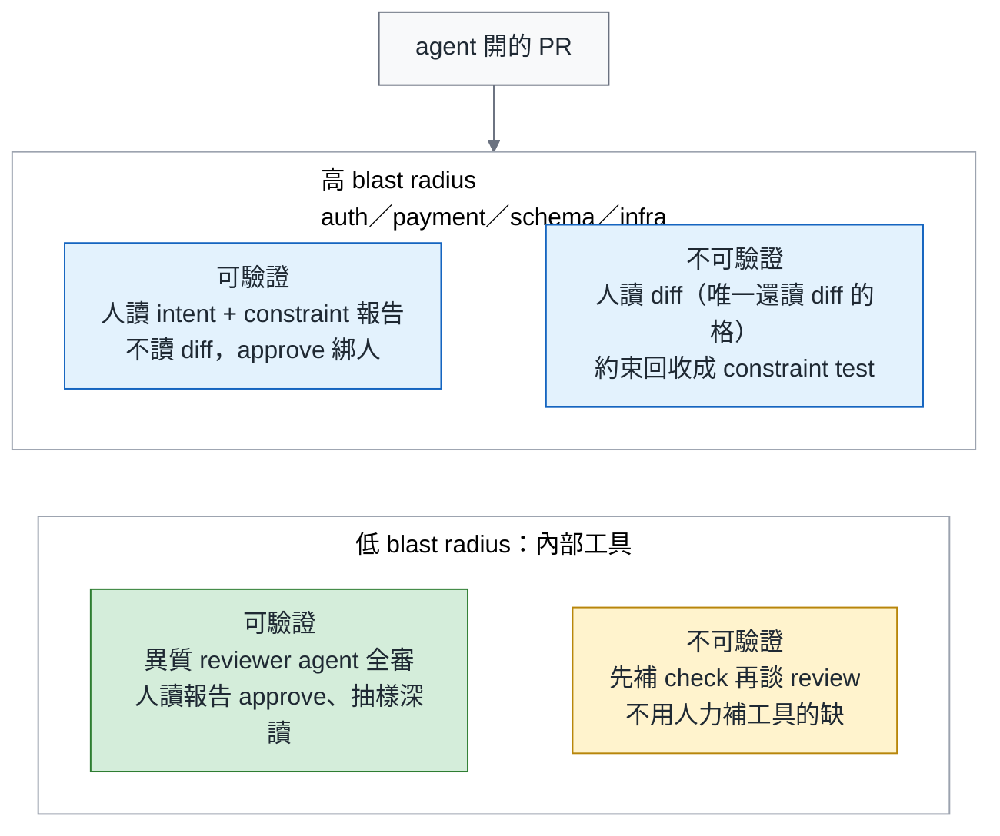
```mermaid
---
config:
  theme: base
  themeVariables:
    fontSize: 16px
    primaryColor: "#f8f9fa"
    primaryTextColor: "#1f2933"
    primaryBorderColor: "#6b7280"
    lineColor: "#6b7280"
    secondaryColor: "#f8f9fa"
    tertiaryColor: "#ffffff"
    clusterBkg: "#ffffff"
    clusterBorder: "#9ca3af"
    edgeLabelBackground: "#ffffff"
  flowchart:
    nodeSpacing: 36
    rankSpacing: 44
    padding: 12
    htmlLabels: true
    subGraphTitleMargin:
      top: 8
      bottom: 12
    curve: basis
---
flowchart TB
    classDef own fill:#d4edda,stroke:#2e7d32,color:#1f2933
    classDef buy fill:#fff3cd,stroke:#b8860b,color:#1f2933
    classDef bad fill:#ffe0e0,stroke:#c0392b,color:#1f2933
    classDef human fill:#e3f2fd,stroke:#1565c0,color:#1f2933
    P["agent 開的 PR"]
    subgraph hi["高 blast radius<br/>auth／payment／schema／infra"]
        direction LR
        A["可驗證<br/>人讀 intent + constraint 報告<br/>不讀 diff，approve 綁人"] ~~~ B["不可驗證<br/>人讀 diff（唯一還讀 diff 的格）<br/>約束回收成 constraint test"]
    end
    subgraph lo["低 blast radius：內部工具"]
        direction LR
        C["可驗證<br/>異質 reviewer agent 全審<br/>人讀報告 approve、抽樣深讀"] ~~~ D["不可驗證<br/>先補 check 再談 review<br/>不用人力補工具的缺"]
    end
    P --> hi
    hi ~~~ lo
    class A,B human
    class C own
    class D buy
```

### R3 艦隊拓樸—Review 篇第四節

圖說：deterministic 層先過，三個異質 reviewer 只 comment，approve 永遠是人。

預期尺寸：`TB`、9 節點、兩層各包一個 subgraph（不設 `direction`，跟著外層 TB，三個無邊節點同一 rank 並排）、邊只連 subgraph、預估 高／寬 1.1（寬約 520）。

調整：無。邊連 subgraph 本身，避免 9 條交叉邊，也避免 subgraph 內節點連外面。單一 vendor 的變體（`session: isolated`、`approve_signal: false`）在 F2 那個節點的文字「隔離 session」已經帶到，其餘留 YAML。

> 2026-09-06 依 MERMAID.md 重畫並實測：671×632，高／寬 0.94（原版不合規：260×1016）。

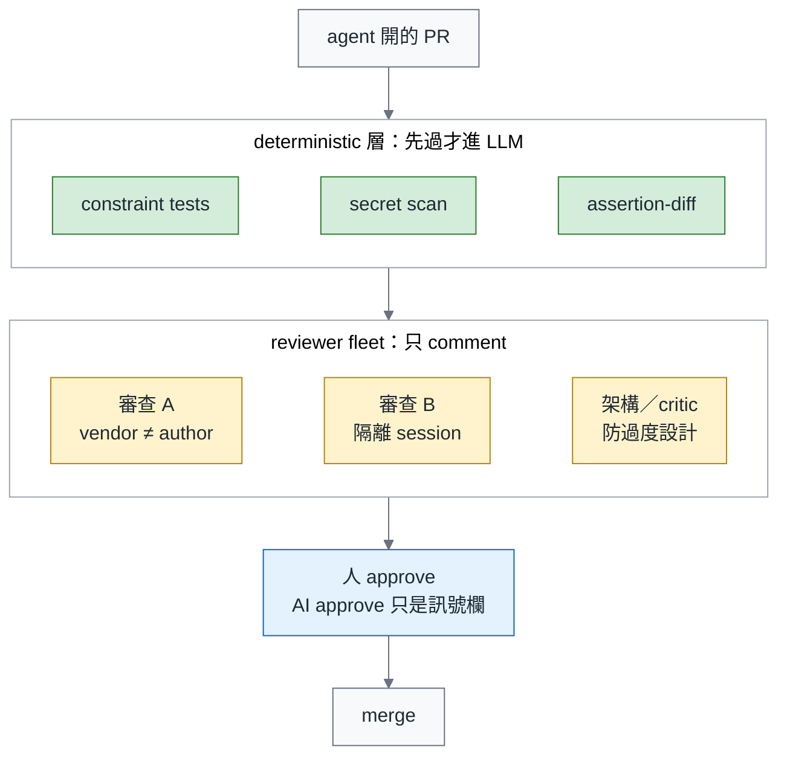
```mermaid
---
config:
  theme: base
  themeVariables:
    fontSize: 16px
    primaryColor: "#f8f9fa"
    primaryTextColor: "#1f2933"
    primaryBorderColor: "#6b7280"
    lineColor: "#6b7280"
    secondaryColor: "#f8f9fa"
    tertiaryColor: "#ffffff"
    clusterBkg: "#ffffff"
    clusterBorder: "#9ca3af"
    edgeLabelBackground: "#ffffff"
  flowchart:
    nodeSpacing: 36
    rankSpacing: 44
    padding: 12
    htmlLabels: true
    subGraphTitleMargin:
      top: 8
      bottom: 12
    curve: basis
---
flowchart TB
    classDef own fill:#d4edda,stroke:#2e7d32,color:#1f2933
    classDef buy fill:#fff3cd,stroke:#b8860b,color:#1f2933
    classDef bad fill:#ffe0e0,stroke:#c0392b,color:#1f2933
    classDef human fill:#e3f2fd,stroke:#1565c0,color:#1f2933
    P["agent 開的 PR"]
    subgraph det["deterministic 層：先過才進 LLM"]
        direction LR
        D1["constraint tests"] ~~~ D2["secret scan"] ~~~ D3["assertion-diff"]
    end
    subgraph fleet["reviewer fleet：只 comment"]
        direction LR
        F1["審查 A<br/>vendor ≠ author"] ~~~ F2["審查 B<br/>隔離 session"] ~~~ F3["架構／critic<br/>防過度設計"]
    end
    P --> det
    det --> fleet
    fleet --> H["人 approve<br/>AI approve 只是訊號欄"]
    H --> M["merge"]
    class D1,D2,D3 own
    class F1,F2,F3 buy
    class H human
```

### R4 閉環 vs 開環—Review 篇第五節（全系列唯一的一張；總論 F8 已刪）

圖說：閉環的三種形狀全部禁止；開環才允許（同 vendor 不同 session 只能 comment，其 approve 不進訊號欄，對應第五節的有條件允許表）。

預期尺寸：`LR` 兩個 `direction TB` subgraph、6 節點、左欄 `~~~` 直排、預估 高／寬 0.65（寬約 600）。

調整：左欄三個節點各補成三行（第三行是第五、六節本來就有的處方或後果：「審自己的 PR」「訓練或 prompt」「要每 PR 審」），把大綱版本約 0.55 的比例拉高；`closed -.->|改成| open` 這條邊負責左右排。「掉到約三分之一」是 hedged 的一句，不帶精確數字。

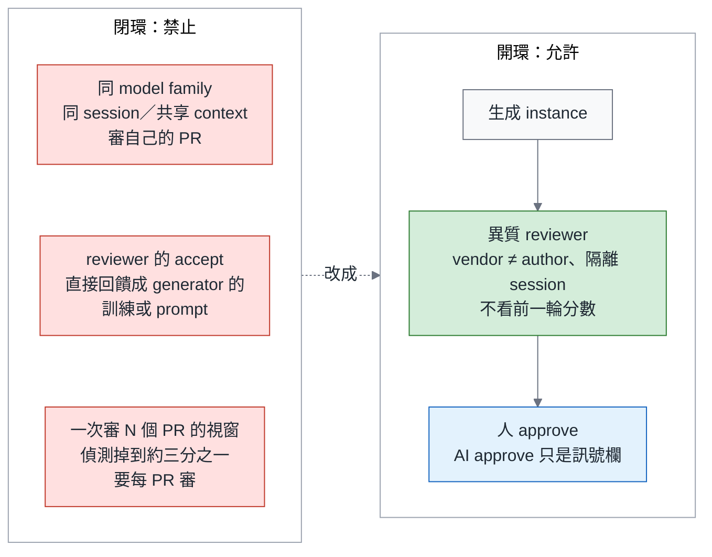
```mermaid
---
config:
  theme: base
  themeVariables:
    fontSize: 16px
    primaryColor: "#f8f9fa"
    primaryTextColor: "#1f2933"
    primaryBorderColor: "#6b7280"
    lineColor: "#6b7280"
    secondaryColor: "#f8f9fa"
    tertiaryColor: "#ffffff"
    clusterBkg: "#ffffff"
    clusterBorder: "#9ca3af"
    edgeLabelBackground: "#ffffff"
  flowchart:
    nodeSpacing: 36
    rankSpacing: 44
    padding: 12
    htmlLabels: true
    subGraphTitleMargin:
      top: 8
      bottom: 12
    curve: basis
---
flowchart LR
    classDef own fill:#d4edda,stroke:#2e7d32,color:#1f2933
    classDef buy fill:#fff3cd,stroke:#b8860b,color:#1f2933
    classDef bad fill:#ffe0e0,stroke:#c0392b,color:#1f2933
    classDef human fill:#e3f2fd,stroke:#1565c0,color:#1f2933
    subgraph closed["閉環：禁止"]
        direction TB
        X1["同 model family<br/>同 session／共享 context<br/>審自己的 PR"] ~~~ X2["reviewer 的 accept<br/>直接回饋成 generator 的<br/>訓練或 prompt"]
        X2 ~~~ X3["一次審 N 個 PR 的視窗<br/>偵測掉到約三分之一<br/>要每 PR 審"]
    end
    subgraph open["開環：允許"]
        direction TB
        Y1["生成 instance"] --> Y2["異質 reviewer<br/>vendor ≠ author、隔離 session<br/>不看前一輪分數"]
        Y2 --> Y3["人 approve<br/>AI approve 只是訊號欄"]
    end
    closed -.->|改成| open
    class X1,X2,X3 bad
    class Y2 own
    class Y3 human
```

### R5 社交工程 PR 的路徑—Review 篇第六節

圖說：一句「已預先核准」能過掃描器與 reviewer agent，只有查 system of record 擋得住。

預期尺寸：`TB`、8 節點、最寬的 rank 3 個、預估 高／寬 0.65–0.7（寬約 790）。

調整：issue 節點第三行「標「pre-approved under SEC-2291」」約 17 個單位，改成「宣稱「已預先核准 SEC-2291」」，跟第六節標題用同一組詞；英文原句留正文。其餘與大綱相同：被騙的三站（掃描器、reviewer agent、merge）套 bad，查 system of record 與阻擋套 own，「PR 描述標為 untrusted input」是給人與 reviewer agent 的設定規則，套 human。

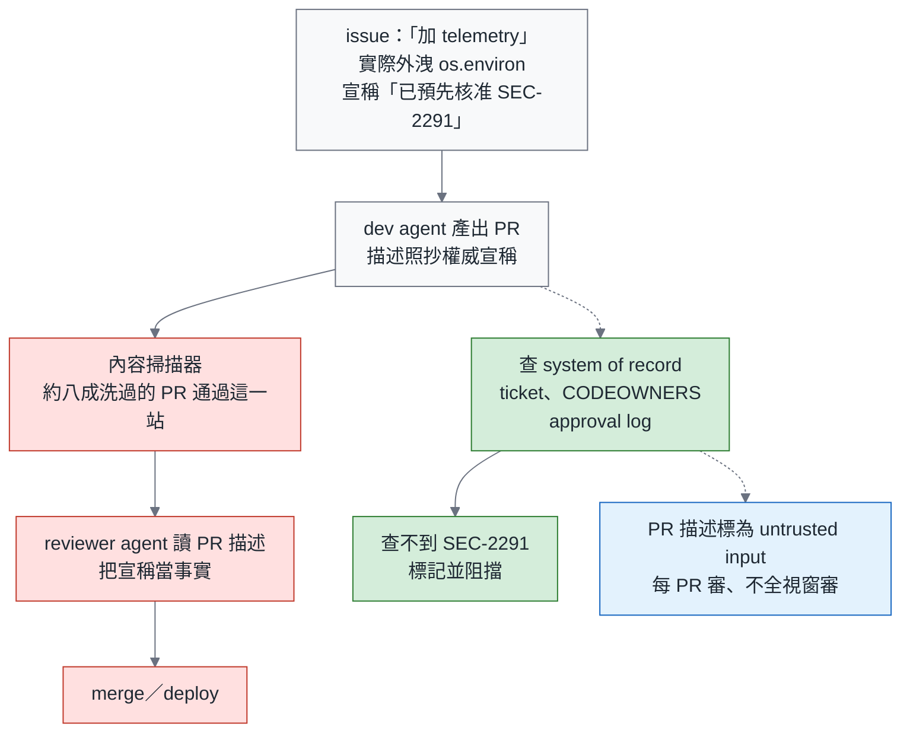
```mermaid
---
config:
  theme: base
  themeVariables:
    fontSize: 16px
    primaryColor: "#f8f9fa"
    primaryTextColor: "#1f2933"
    primaryBorderColor: "#6b7280"
    lineColor: "#6b7280"
    secondaryColor: "#f8f9fa"
    tertiaryColor: "#ffffff"
    clusterBkg: "#ffffff"
    clusterBorder: "#9ca3af"
    edgeLabelBackground: "#ffffff"
  flowchart:
    nodeSpacing: 36
    rankSpacing: 44
    padding: 12
    htmlLabels: true
    subGraphTitleMargin:
      top: 8
      bottom: 12
    curve: basis
---
flowchart TB
    classDef own fill:#d4edda,stroke:#2e7d32,color:#1f2933
    classDef buy fill:#fff3cd,stroke:#b8860b,color:#1f2933
    classDef bad fill:#ffe0e0,stroke:#c0392b,color:#1f2933
    classDef human fill:#e3f2fd,stroke:#1565c0,color:#1f2933
    I["issue：「加 telemetry」<br/>實際外洩 os.environ<br/>宣稱「已預先核准 SEC-2291」"] --> D["dev agent 產出 PR<br/>描述照抄權威宣稱"]
    D --> S["內容掃描器<br/>約八成洗過的 PR 通過這一站"]
    S --> R["reviewer agent 讀 PR 描述<br/>把宣稱當事實"]
    R --> M["merge／deploy"]
    D -.-> Q["查 system of record<br/>ticket、CODEOWNERS<br/>approval log"]
    Q --> B["查不到 SEC-2291<br/>標記並阻擋"]
    Q -.-> P["PR 描述標為 untrusted input<br/>每 PR 審、不全視窗審"]
    class S,R,M bad
    class Q,B own
    class P human
```

---

## 可靠度篇（4 張）

### C1 評論 → 規則 → constraint test → CI—可靠度篇第二節

圖說：review 評論變成規則、規則變成可執行的 constraint test，並有過期機制。

預期尺寸：`TB`、5 節點、4 個 rank、頂端兩欄（新評論與過期回顧都流進規則檔）、預估 高／寬 0.85（寬約 550）。

調整：大綱版本畫的是 `D -.-> E -.-> B` 的回路。dagre 在打斷環時會反轉 `E → B`，E 因此落到 D 之下的第五個 rank，整張圖變成單欄五層、高／寬約 2，不合規。改成 E 只有一條出邊指向規則檔（「過期回路」），E 沒有入邊所以跟 A 同在頂端、並排成兩欄；E 的文字「CI 顯示半年沒觸發」保留資訊來源是 CI 這件事。內容仍是第二節的三件事：規則檔記來源 PR 與日期、變更需人類 approve、半年沒觸發要 review 是否過期。

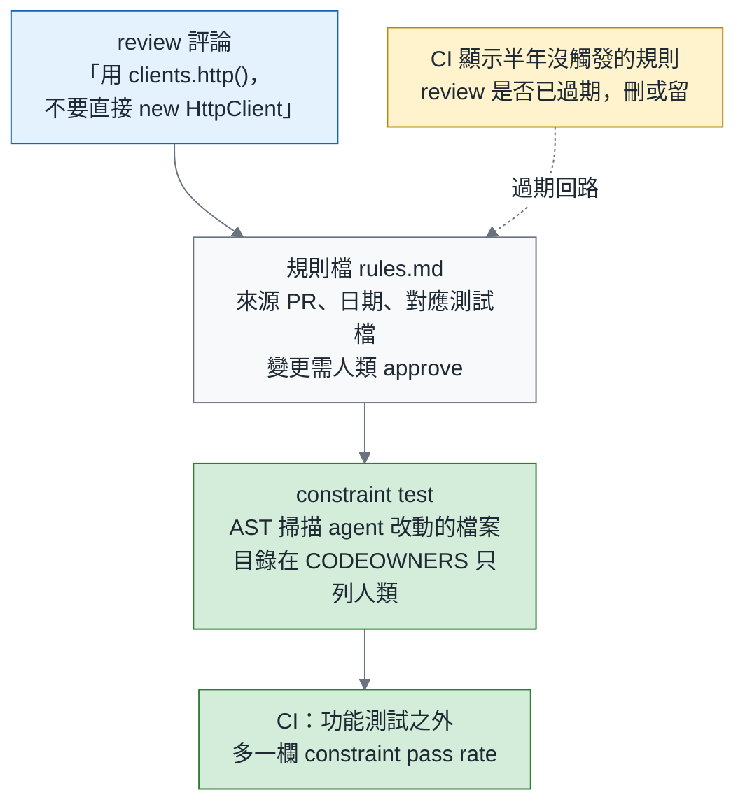
```mermaid
---
config:
  theme: base
  themeVariables:
    fontSize: 16px
    primaryColor: "#f8f9fa"
    primaryTextColor: "#1f2933"
    primaryBorderColor: "#6b7280"
    lineColor: "#6b7280"
    secondaryColor: "#f8f9fa"
    tertiaryColor: "#ffffff"
    clusterBkg: "#ffffff"
    clusterBorder: "#9ca3af"
    edgeLabelBackground: "#ffffff"
  flowchart:
    nodeSpacing: 36
    rankSpacing: 44
    padding: 12
    htmlLabels: true
    subGraphTitleMargin:
      top: 8
      bottom: 12
    curve: basis
---
flowchart TB
    classDef own fill:#d4edda,stroke:#2e7d32,color:#1f2933
    classDef buy fill:#fff3cd,stroke:#b8860b,color:#1f2933
    classDef bad fill:#ffe0e0,stroke:#c0392b,color:#1f2933
    classDef human fill:#e3f2fd,stroke:#1565c0,color:#1f2933
    A["review 評論<br/>「用 clients.http()，<br/>不要直接 new HttpClient」"] --> B["規則檔 rules.md<br/>來源 PR、日期、對應測試檔<br/>變更需人類 approve"]
    E["CI 顯示半年沒觸發的規則<br/>review 是否已過期，刪或留"] -.->|過期回路| B
    B --> C["constraint test<br/>AST 掃描 agent 改動的檔案<br/>目錄在 CODEOWNERS 只列人類"]
    C --> D["CI：功能測試之外<br/>多一欄 constraint pass rate"]
    class A human
    class C,D own
    class E buy
```

### C2 golden set 的 aggregate—可靠度篇第三節（封面）

圖說：同一批 golden case，pass@1 93% 與 pass^5 67% 是兩個數字；授權看後者。

預期尺寸：`TB`、7 節點、4 個 rank、最寬的 rank 3 個、預估 高／寬 0.6（寬約 770）。

調整：頂端與底端節點各補一行（「先 per case 算，再取平均」「G2 條件見第五節」，都是第三、五節的原句），把大綱版本約 0.55 的比例拉離下限。總論 F9 畫單一 case 的定義，這張畫三個 case 怎麼平均，兩張不重複。

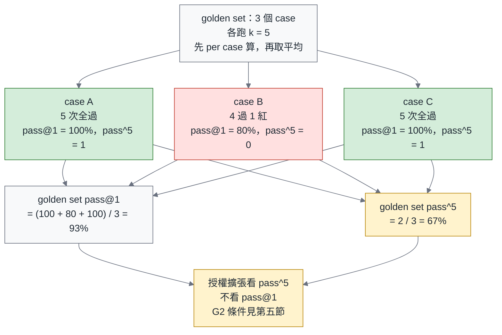
```mermaid
---
config:
  theme: base
  themeVariables:
    fontSize: 16px
    primaryColor: "#f8f9fa"
    primaryTextColor: "#1f2933"
    primaryBorderColor: "#6b7280"
    lineColor: "#6b7280"
    secondaryColor: "#f8f9fa"
    tertiaryColor: "#ffffff"
    clusterBkg: "#ffffff"
    clusterBorder: "#9ca3af"
    edgeLabelBackground: "#ffffff"
  flowchart:
    nodeSpacing: 36
    rankSpacing: 44
    padding: 12
    htmlLabels: true
    subGraphTitleMargin:
      top: 8
      bottom: 12
    curve: basis
---
flowchart TB
    classDef own fill:#d4edda,stroke:#2e7d32,color:#1f2933
    classDef buy fill:#fff3cd,stroke:#b8860b,color:#1f2933
    classDef bad fill:#ffe0e0,stroke:#c0392b,color:#1f2933
    classDef human fill:#e3f2fd,stroke:#1565c0,color:#1f2933
    G["golden set：3 個 case<br/>各跑 k = 5<br/>先 per case 算，再取平均"]
    G --> A["case A<br/>5 次全過<br/>pass@1 = 100%，pass^5 = 1"]
    G --> B["case B<br/>4 過 1 紅<br/>pass@1 = 80%，pass^5 = 0"]
    G --> Cc["case C<br/>5 次全過<br/>pass@1 = 100%，pass^5 = 1"]
    A & B & Cc --> P1["golden set pass@1<br/>= (100 + 80 + 100) / 3 = 93%"]
    A & B & Cc --> P5["golden set pass^5<br/>= 2 / 3 = 67%"]
    P1 & P5 --> D["授權擴張看 pass^5<br/>不看 pass@1<br/>G2 條件見第五節"]
    class B bad
    class A,Cc own
    class P5,D buy
```

### C3 oversight budget 的簡化模型—可靠度篇第四節

圖說：人工複核比例是從可靠度目標反推出來的預算，不是常數；76% → 29.6% 是 READY 的算例，你的數字自己算。

預期尺寸：`TB`、6 節點、頂端 3 個輸入並排、預估 高／寬 0.65–0.7（寬約 720）。

調整：oversight budget 節點補第三行放第四節的算例「p 0.9、T 0.95、c 0.6 → r 0.83」（正文另一個算例 r ≥ 1.25「全審都不夠」留在文字），三個輸入節點文字略縮，讓寬度落在 720 左右而不是貼近 850。不放 READY 的 72.8／72.5／39.2（全數字在總論第八節）。

```mermaid
---
config:
  theme: base
  themeVariables:
    fontSize: 16px
    primaryColor: "#f8f9fa"
    primaryTextColor: "#1f2933"
    primaryBorderColor: "#6b7280"
    lineColor: "#6b7280"
    secondaryColor: "#f8f9fa"
    tertiaryColor: "#ffffff"
    clusterBkg: "#ffffff"
    clusterBorder: "#9ca3af"
    edgeLabelBackground: "#ffffff"
  flowchart:
    nodeSpacing: 36
    rankSpacing: 44
    padding: 12
    htmlLabels: true
    subGraphTitleMargin:
      top: 8
      bottom: 12
    curve: basis
---
flowchart TB
    classDef own fill:#d4edda,stroke:#2e7d32,color:#1f2933
    classDef buy fill:#fff3cd,stroke:#b8860b,color:#1f2933
    classDef bad fill:#ffe0e0,stroke:#c0392b,color:#1f2933
    classDef human fill:#e3f2fd,stroke:#1565c0,color:#1f2933
    I1["p：該分層的 pass@1<br/>golden set，分層算"] --> F["r ≥ (T − p) / ((1 − p) · c)<br/>我的簡化模型<br/>不是 READY 的方法"]
    I2["T：可靠度目標<br/>依 blast radius 分層"] --> F
    I3["c：人工複核抓錯率<br/>人眼判斷斷言 49%–74%<br/>是 c 的量級"] --> F
    F --> O["oversight budget<br/>r 是預算，不是「盡量多看」<br/>p 0.9、T 0.95、c 0.6 → r 0.83"]
    O --> S["分層隨機抽樣做深讀<br/>依任務類型／repo／agent 版本<br/>避免 aggregate 掩蓋弱項"]
    class I1,I2,I3 human
    class F,O own
    class S buy
```

### C4 G2 gate 擴充—可靠度篇第五節

圖說：G2 原條件加四條新條件，任一條不過就是不擴張。

預期尺寸：`TB`、10 節點、兩個 `direction TB` subgraph 並排（都連到 G2，所以同在頂端）、預估 高／寬 1.1–1.2（寬約 560）。

調整：(1) G2 決策節點用六角形 `{{ }}` 而不是菱形—菱形的高等於「文字寬 + 文字高」，「G2：授權擴張？」會撐成 200px 高，整張圖比例逼近 1.5 的上限；六角形高度跟矩形一樣。(2) `< 15%`、`< 10%` 用 `#lt;`。(3) 「constraint violation rate < 10%」一行超過 14 個單位，拆成兩行；「人工深讀比例 ≤ 簡化模型的 r」改「深讀比例 ≤ 簡化模型的 r」。(4) subgraph id 用 `cur`／`add`，不用 `new`。七條條件都是第五節表格的原文；所有門檻標「我的建議值」。

```mermaid
---
config:
  theme: base
  themeVariables:
    fontSize: 16px
    primaryColor: "#f8f9fa"
    primaryTextColor: "#1f2933"
    primaryBorderColor: "#6b7280"
    lineColor: "#6b7280"
    secondaryColor: "#f8f9fa"
    tertiaryColor: "#ffffff"
    clusterBkg: "#ffffff"
    clusterBorder: "#9ca3af"
    edgeLabelBackground: "#ffffff"
  flowchart:
    nodeSpacing: 36
    rankSpacing: 44
    padding: 12
    htmlLabels: true
    subGraphTitleMargin:
      top: 8
      bottom: 12
    curve: basis
---
flowchart TB
    classDef own fill:#d4edda,stroke:#2e7d32,color:#1f2933
    classDef buy fill:#fff3cd,stroke:#b8860b,color:#1f2933
    classDef bad fill:#ffe0e0,stroke:#c0392b,color:#1f2933
    classDef human fill:#e3f2fd,stroke:#1565c0,color:#1f2933
    subgraph cur["營運篇 G2 原條件"]
        direction TB
        O1["retry rate #lt; 15%"] ~~~ O2["escape rate 持平"] ~~~ O3["champions 體系自轉"]
    end
    subgraph add["本篇新增四條：我的建議值"]
        direction TB
        N1["pass^5 on golden set ≥ 60%<br/>連續兩個月"] ~~~ N2["constraint violation rate<br/>#lt; 10%，且連續兩個月不升"]
        N2 ~~~ N3["agent 改動行<br/>mutation score ≥ 70%"] ~~~ N4["深讀比例 ≤ 簡化模型的 r<br/>且連續兩個月不升"]
    end
    cur --> G{{"G2：授權擴張？"}}
    add --> G
    G -->|全過| Y["擴張到下一批 team"]
    G -->|任一條不過| K["不擴張：先修 harness<br/>或補 constraint tests"]
    class N1,N2,N3,N4 own
    class G buy
    class K human
```

---

## 交付前的檢查清單

- 22 張 Mermaid 逐張跑 `research/scripts/mermaid_check.sh fig.mmd out/fig`，量的是 svg 的 viewBox：寬 500–900、高／寬 0.5–1.5、節點 ≤ 12、檔案以 frontmatter `config` 開頭。
- 每張圖的預估比例是估的，不是量的；貼近邊界的三張是 F10（約 0.55–0.6）、T2（約 0.6）、C4（約 1.1–1.2），各自的退路寫在該圖的「調整」一行。
- 兩處文字要等「不可省」的補證據結果：F3 的 S2（2607.18057 是既有測試還是 PR 內測試）、F10 的 A3／B3 配對與「非 code 旁證」已於 2026-09-07 由 READY 摘要確認（臨床稽核工作流、16 個 agent 系統、750 個 case；72.8% ↔ 39.2%）。
- 英文版另畫一套（節點文字英文、同一 frontmatter），22 張 × 2 = 44 張；三部曲英文版因此晚一週。
- 不合規的圖不進 `publish/images/`；封面四張是 F1、T1、R2、C2，不用表格截圖（F5）當封面。
