# 2026-11 同一份規格，跑十次：全部圖表的 Mermaid 原始碼

> 依 `research/2026-09/2026-11-same-spec-ten-runs.md`（第四版）的圖表清單，逐張給圖說、預期尺寸與完整 Mermaid 原始碼；每張都照 `MERMAID.md`：frontmatter `config`（theme base、themeVariables 顏色、flowchart 間距、subGraphTitleMargin；不含 fontFamily）、classDef 四色、節點 > 5 用 TB、≤ 12 節點、節點文字 ≤ 3 行、邊上文字 ≤ 6 字、不用 emoji、不寫逐節點 `style`。表格類（F2、F6、F10、P1-T1、P1-T2、P2-T1、P3-T2、P3-T3、P3-T5）不是圖，直接用 markdown 表格、貼 Medium 時轉 PNG—各條只留一行說明與圖說，不畫。
>
> 大綱已內嵌原始碼的圖（F1、F3、F4、F7、F8、F9、P1-1、P1-2、P1-3、P2-1、P2-2、P2-3a、P2-3b、P3-1、P3-2、P3-3）一律從大綱版起修，不重畫；改動處在各圖的「預期尺寸」行標明。決策節點的形狀規則：單行問句用菱形（與 `MERMAID.md` 範例一致），兩行以上用六角形（菱形會隨行數放大成正方形，撐高整張圖）。
>
> 檢查：`research/scripts/mermaid_check_all.sh research/2026-09/2026-11-same-spec-ten-runs.figures.md`（逐張算繪、印尺寸與 PASS／FAIL）。2026-09-06 實測：16 張全部 PASS，尺寸列在各圖的「預期尺寸」行與文末清單，PNG 也逐張看過，沒有被裁的字。

---

## 總論（9 張：F1、F2、F3、F4、F6、F7、F8、F9、F10）

### F1 — 總論 第一節：三個讀者問題 → 同一個答案 → 三部曲

**圖說**：讀者的三個問題共用同一個答案—你沒有量變異；量法是固定 spec、不介入跑 N 次，產出變異門檻接進 G2，三部曲各接一段。protocol 的細節在 F7。

**預期尺寸**：`flowchart TB`、9 節點、大綱實測 569×552、高／寬 0.97。沿用大綱版，未改。

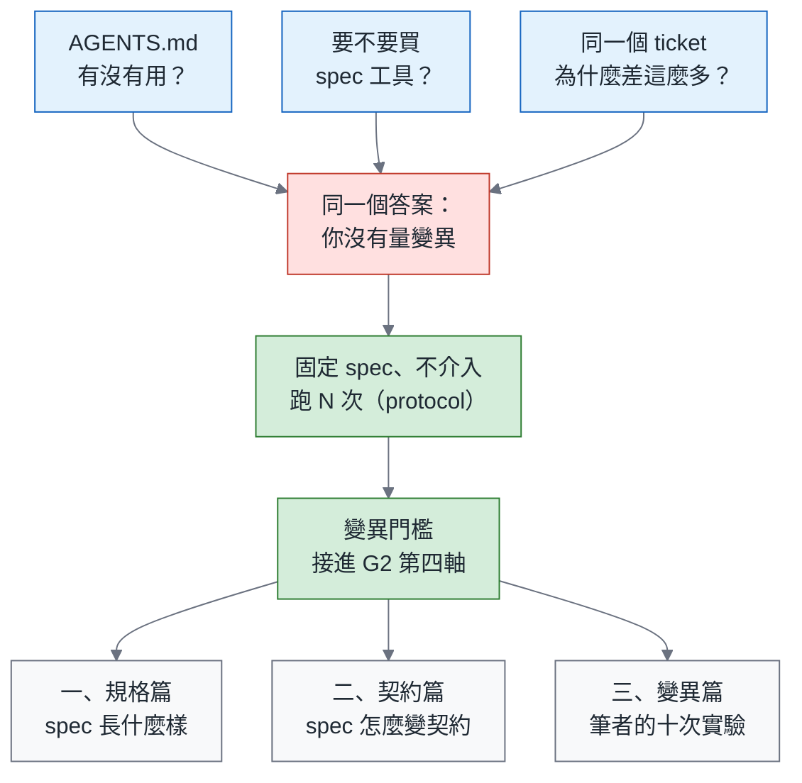
```mermaid
---
config:
  theme: base
  themeVariables:
    fontSize: 16px
    primaryColor: "#f8f9fa"
    primaryTextColor: "#1f2933"
    primaryBorderColor: "#6b7280"
    lineColor: "#6b7280"
    secondaryColor: "#f8f9fa"
    tertiaryColor: "#ffffff"
    clusterBkg: "#ffffff"
    clusterBorder: "#9ca3af"
    edgeLabelBackground: "#ffffff"
  flowchart:
    nodeSpacing: 36
    rankSpacing: 44
    padding: 12
    htmlLabels: true
    subGraphTitleMargin:
      top: 8
      bottom: 12
    curve: basis
---
flowchart TB
    classDef own fill:#d4edda,stroke:#2e7d32,color:#1f2933
    classDef buy fill:#fff3cd,stroke:#b8860b,color:#1f2933
    classDef bad fill:#ffe0e0,stroke:#c0392b,color:#1f2933
    classDef human fill:#e3f2fd,stroke:#1565c0,color:#1f2933
    Q1["AGENTS.md<br/>有沒有用？"] --> ANS["同一個答案：<br/>你沒有量變異"]
    Q2["要不要買<br/>spec 工具？"] --> ANS
    Q3["同一個 ticket<br/>為什麼差這麼多？"] --> ANS
    ANS --> P["固定 spec、不介入<br/>跑 N 次（protocol）"]
    P --> G["變異門檻<br/>接進 G2 第四軸"]
    G --> S1["一、規格篇<br/>spec 長什麼樣"]
    G --> S2["二、契約篇<br/>spec 怎麼變契約"]
    G --> S3["三、變異篇<br/>筆者的十次實驗"]
    class Q1,Q2,Q3 human
    class ANS bad
    class P,G own
```

### F2 — 總論 第二節：noise audit ↔ N-run 對照

**圖說**：Kahneman 的 noise audit 與 N-run 實驗逐項對映—法官是一套 harness 組態，一次判決是一次 run。

**預期尺寸**：表格轉 PNG、6 列 × 3 欄。

表格比圖清楚（六組一對一的名詞對映，沒有流向），不畫圖；內容用大綱第二節的 F2 表。

### F3 — 總論 第三節：需求 → 規格 → 契約

**圖說**：三個名詞各一層—左邊是本系列的定義、右邊對照 Teddy 的用法—本系列站在「規格」層（Spec-anchored），契約是它可執行的子集；把 How 切成規格與契約前後半是本系列的切分，不是 Teddy 的。

**預期尺寸**：`flowchart TB` 包三個 `direction LR` 子圖（三層直疊、每層兩欄）、6 節點、大綱實測 521×596、高／寬 1.14。邊只連子圖本身（`r --> s --> c`）。沿用大綱版，未改。

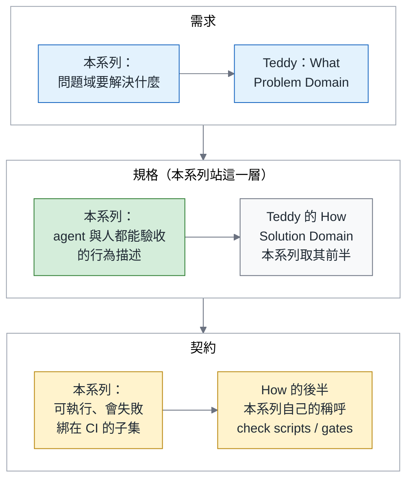
```mermaid
---
config:
  theme: base
  themeVariables:
    fontSize: 16px
    primaryColor: "#f8f9fa"
    primaryTextColor: "#1f2933"
    primaryBorderColor: "#6b7280"
    lineColor: "#6b7280"
    secondaryColor: "#f8f9fa"
    tertiaryColor: "#ffffff"
    clusterBkg: "#ffffff"
    clusterBorder: "#9ca3af"
    edgeLabelBackground: "#ffffff"
  flowchart:
    nodeSpacing: 36
    rankSpacing: 44
    padding: 12
    htmlLabels: true
    subGraphTitleMargin:
      top: 8
      bottom: 12
    curve: basis
---
flowchart TB
    classDef own fill:#d4edda,stroke:#2e7d32,color:#1f2933
    classDef buy fill:#fff3cd,stroke:#b8860b,color:#1f2933
    classDef bad fill:#ffe0e0,stroke:#c0392b,color:#1f2933
    classDef human fill:#e3f2fd,stroke:#1565c0,color:#1f2933
    subgraph r["需求"]
        direction LR
        R1["本系列：<br/>問題域要解決什麼"] --> R2["Teddy：What<br/>Problem Domain"]
    end
    subgraph s["規格（本系列站這一層）"]
        direction LR
        S1["本系列：<br/>agent 與人都能驗收<br/>的行為描述"] --> S2["Teddy 的 How<br/>Solution Domain<br/>本系列取其前半"]
    end
    subgraph c["契約"]
        direction LR
        C1["本系列：<br/>可執行、會失敗<br/>綁在 CI 的子集"] --> C2["How 的後半<br/>本系列自己的稱呼<br/>check scripts / gates"]
    end
    r --> s --> c
    class R1,R2 human
    class S1 own
    class C1,C2 buy
```

### F4 — 總論 第四節：變異來源地圖，兩層

**圖說**：run-to-run 變異只有一個源頭（sampling，Teddy 的 Form，改不了），loop 裡的三個機制放大或衰減它（Context，能改）；下層的組態敏感度是另一種差異，12 月才講。

**預期尺寸**：`flowchart TB` 兩個 `direction TB` 子圖（上下疊、以 `up ~~~ low` 定序）、9 節點、實測 657×805、高／寬 1.23（大綱估 620×640）。下層三個節點無邊相連，在 TB 子圖裡會並排成一列（≤ 4 個）。沿用大綱版，未改。

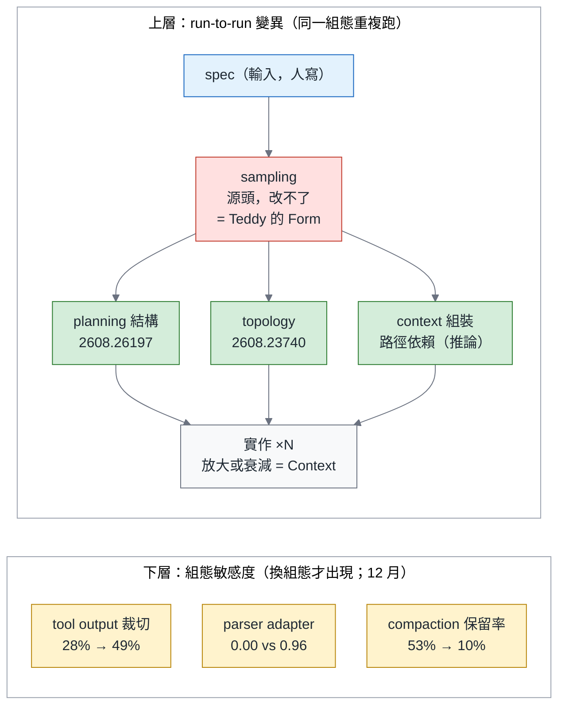
```mermaid
---
config:
  theme: base
  themeVariables:
    fontSize: 16px
    primaryColor: "#f8f9fa"
    primaryTextColor: "#1f2933"
    primaryBorderColor: "#6b7280"
    lineColor: "#6b7280"
    secondaryColor: "#f8f9fa"
    tertiaryColor: "#ffffff"
    clusterBkg: "#ffffff"
    clusterBorder: "#9ca3af"
    edgeLabelBackground: "#ffffff"
  flowchart:
    nodeSpacing: 36
    rankSpacing: 44
    padding: 12
    htmlLabels: true
    subGraphTitleMargin:
      top: 8
      bottom: 12
    curve: basis
---
flowchart TB
    classDef own fill:#d4edda,stroke:#2e7d32,color:#1f2933
    classDef buy fill:#fff3cd,stroke:#b8860b,color:#1f2933
    classDef bad fill:#ffe0e0,stroke:#c0392b,color:#1f2933
    classDef human fill:#e3f2fd,stroke:#1565c0,color:#1f2933
    subgraph up["上層：run-to-run 變異（同一組態重複跑）"]
        direction TB
        SP["spec（輸入，人寫）"] --> SA["sampling<br/>源頭，改不了<br/>= Teddy 的 Form"]
        SA --> P["planning 結構<br/>2608.26197"]
        SA --> T["topology<br/>2608.23740"]
        SA --> C["context 組裝<br/>路徑依賴（推論）"]
        P --> N["實作 ×N<br/>放大或衰減 = Context"]
        T --> N
        C --> N
    end
    subgraph low["下層：組態敏感度（換組態才出現；12 月）"]
        direction TB
        L1["tool output 裁切<br/>28% → 49%"]
        L2["parser adapter<br/>0.00 vs 0.96"]
        L3["compaction 保留率<br/>53% → 10%"]
    end
    up ~~~ low
    class SP human
    class SA bad
    class P,T,C own
    class L1,L2,L3 buy
```

### F6 — 總論 第五節：三支槓桿 × 作用軸（T1）

**圖說**：三支槓桿各動哪一軸—格內只有方向與一個短語，出處在表下註腳 [a]–[g]；實測格填 10 月的差值，沒有待填格。

**預期尺寸**：表格轉 PNG、3 列 × 5 欄 + 註腳 [a]–[g]。

表格比圖清楚（3 × 5 的矩陣，每格是方向與短語），不畫圖；內容用大綱第五節末的 T1 表與註腳。

### F7 — 總論 第六節：N-run protocol

**圖說**：N-run protocol 的兩側—左邊產生 N 個 branch，右邊依 run.sh 的順序量：測試通過率、約束違規、AST 相似度，最後盲審 review minutes 與門檻。

**預期尺寸**：`flowchart LR` 包兩個 `direction TB` 子圖（兩欄）、9 節點、大綱實測 536×693、高／寬 1.29。邊只連子圖本身（`gen --> ver`）。沿用大綱版，未改。

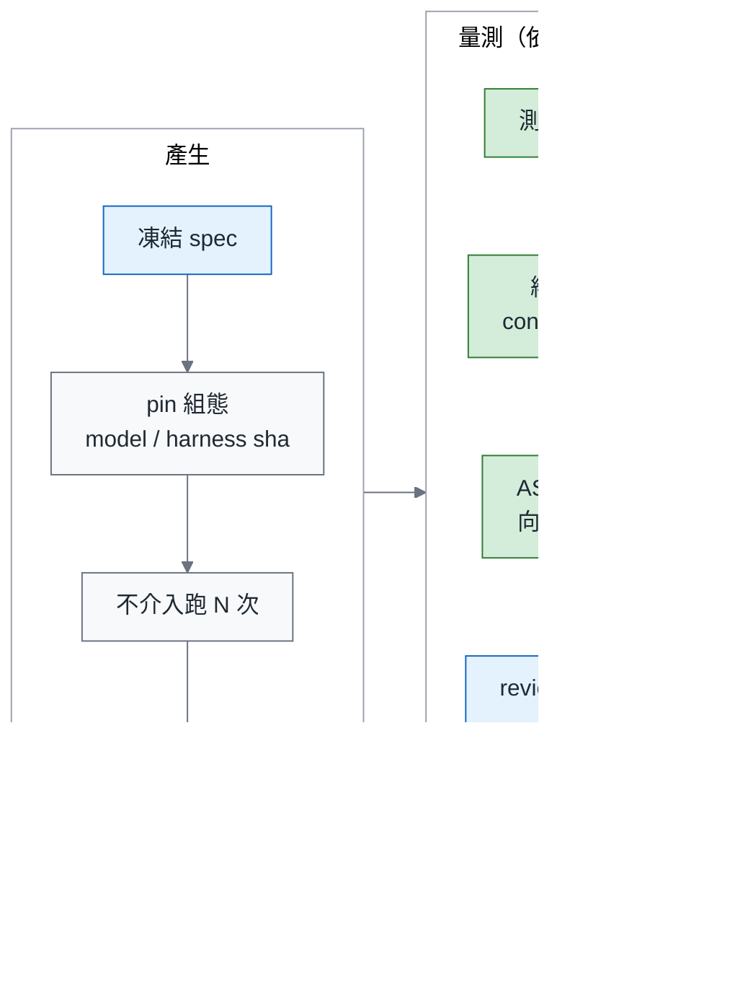
```mermaid
---
config:
  theme: base
  themeVariables:
    fontSize: 16px
    primaryColor: "#f8f9fa"
    primaryTextColor: "#1f2933"
    primaryBorderColor: "#6b7280"
    lineColor: "#6b7280"
    secondaryColor: "#f8f9fa"
    tertiaryColor: "#ffffff"
    clusterBkg: "#ffffff"
    clusterBorder: "#9ca3af"
    edgeLabelBackground: "#ffffff"
  flowchart:
    nodeSpacing: 36
    rankSpacing: 44
    padding: 12
    htmlLabels: true
    subGraphTitleMargin:
      top: 8
      bottom: 12
    curve: basis
---
flowchart LR
    classDef own fill:#d4edda,stroke:#2e7d32,color:#1f2933
    classDef buy fill:#fff3cd,stroke:#b8860b,color:#1f2933
    classDef bad fill:#ffe0e0,stroke:#c0392b,color:#1f2933
    classDef human fill:#e3f2fd,stroke:#1565c0,color:#1f2933
    subgraph gen["產生"]
        direction TB
        G1["凍結 spec"] --> G2["pin 組態<br/>model / harness sha"]
        G2 --> G3["不介入跑 N 次"]
        G3 --> G4["N 個 branch"]
    end
    subgraph ver["量測（依 run.sh 順序）"]
        direction TB
        M1["測試通過率"] --> M2["約束違規<br/>contract / style"]
        M2 --> M3["AST 相似度<br/>向心 + 成對"]
        M3 --> M4["review minutes<br/>盲審"]
        M4 --> M5["對門檻（T3）"]
    end
    gen --> ver
    class G1 human
    class M1,M2,M3 own
    class M4 human
    class M5 buy
```

### F8 — 總論 第七節：bias × noise 四象限（封面候選）

**圖說**：pass rate 與變異是兩個獨立的軸—左上才准擴權；左下「穩定地錯」最危險，因為看起來很專業。

**預期尺寸**：`quadrantChart`、chartWidth 700 × chartHeight 560、高／寬 0.8、四格 + 1 個點。quadrantChart 沒有節點與 flowchart 間距，frontmatter 只留 theme、themeVariables 顏色與 quadrantChart 尺寸。相對大綱版只改一處：點的標籤從 20 字縮成 15 字，否則以 x=0.22 置中的標籤會超出左邊界被裁。

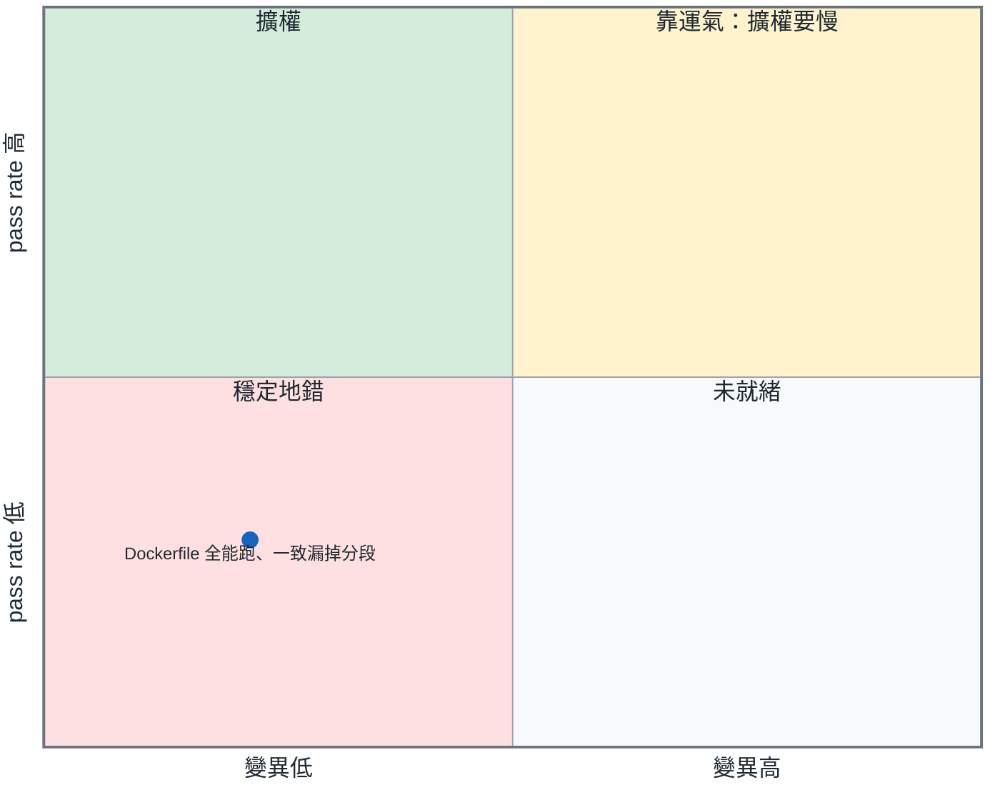
```mermaid
---
config:
  theme: base
  themeVariables:
    fontSize: 16px
    primaryTextColor: "#1f2933"
    quadrant1Fill: "#fff3cd"
    quadrant2Fill: "#d4edda"
    quadrant3Fill: "#ffe0e0"
    quadrant4Fill: "#f8f9fa"
    quadrant1TextFill: "#1f2933"
    quadrant2TextFill: "#1f2933"
    quadrant3TextFill: "#1f2933"
    quadrant4TextFill: "#1f2933"
    quadrantPointFill: "#1565c0"
    quadrantPointTextFill: "#1f2933"
    quadrantXAxisTextFill: "#1f2933"
    quadrantYAxisTextFill: "#1f2933"
    quadrantInternalBorderStrokeFill: "#9ca3af"
    quadrantExternalBorderStrokeFill: "#6b7280"
  quadrantChart:
    chartWidth: 700
    chartHeight: 560
    quadrantLabelFontSize: 16
    quadrantPointLabelFontSize: 16
    xAxisLabelFontSize: 16
    yAxisLabelFontSize: 16
    pointRadius: 6
---
quadrantChart
    x-axis "變異低" --> "變異高"
    y-axis "pass rate 低" --> "pass rate 高"
    quadrant-1 "靠運氣：擴權要慢"
    quadrant-2 "擴權"
    quadrant-3 "穩定地錯"
    quadrant-4 "未就緒"
    "Dockerfile 全能跑、一致漏掉分段": [0.22, 0.28]
```

### F9 — 總論 第七節：G2 的第四軸

**圖說**：G2 只多一條—四個條件全部在綠或黃才放行到全員 + write tools；紅燈加跑到 N=30 仍紅，就回頭修 harness。

**預期尺寸**：`flowchart TB`、8 節點（四個條件並排一列，≤ 4）、實測 732×530、高／寬 0.72。相對大綱版只改一處：虛線邊上的字從「N=30 仍紅」（7 字）縮成「仍紅」，「N=30」移進紅色節點第一行。

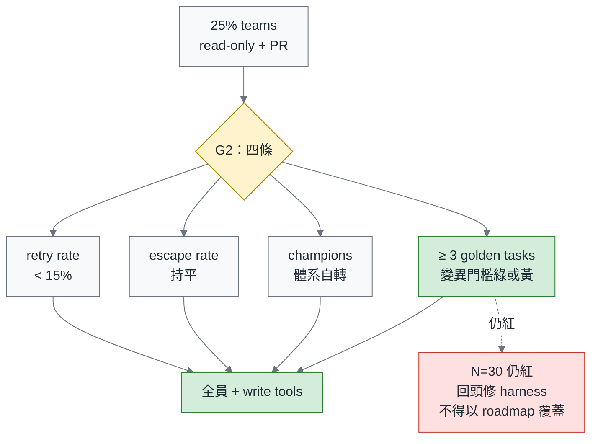
```mermaid
---
config:
  theme: base
  themeVariables:
    fontSize: 16px
    primaryColor: "#f8f9fa"
    primaryTextColor: "#1f2933"
    primaryBorderColor: "#6b7280"
    lineColor: "#6b7280"
    secondaryColor: "#f8f9fa"
    tertiaryColor: "#ffffff"
    clusterBkg: "#ffffff"
    clusterBorder: "#9ca3af"
    edgeLabelBackground: "#ffffff"
  flowchart:
    nodeSpacing: 36
    rankSpacing: 44
    padding: 12
    htmlLabels: true
    subGraphTitleMargin:
      top: 8
      bottom: 12
    curve: basis
---
flowchart TB
    classDef own fill:#d4edda,stroke:#2e7d32,color:#1f2933
    classDef buy fill:#fff3cd,stroke:#b8860b,color:#1f2933
    classDef bad fill:#ffe0e0,stroke:#c0392b,color:#1f2933
    classDef human fill:#e3f2fd,stroke:#1565c0,color:#1f2933
    S["25% teams<br/>read-only + PR"] --> G{"G2：四條"}
    G --> C1["retry rate<br/>< 15%"]
    G --> C2["escape rate<br/>持平"]
    G --> C3["champions<br/>體系自轉"]
    G --> C4["≥ 3 golden tasks<br/>變異門檻綠或黃"]
    C1 --> Y["全員 + write tools"]
    C2 --> Y
    C3 --> Y
    C4 --> Y
    C4 -.->|仍紅| R["N=30 仍紅<br/>回頭修 harness<br/>不得以 roadmap 覆蓋"]
    class G buy
    class C4 own
    class Y own
    class R bad
```

### F10 — 總論 第八節：三張地圖（T2）

**圖說**：三種文件各管一件事—這次要什麼、在這個 repo 怎麼做事、當初為什麼—owner、壽命與 enforcement 都不同。

**預期尺寸**：表格轉 PNG、3 列 × 7 欄（文件 / 管什麼 / owner / 讀者 / 壽命 / enforcement / drift 偵測）。

表格比圖清楚（三份文件 × 七個屬性的對照，沒有流向），不畫圖；內容用大綱第八節的 T2 欄位。

（T3 門檻表隨第六節轉 PNG、第十節的 90 天表為內文表，大綱不列入圖表清單，這裡不另計。）

---

## 一、規格篇（5 張：P1-1、P1-2、P1-3、P1-T1、P1-T2）

### P1-1 — 規格篇 第一節：Example Mapping 四色卡 → agent 輸入

**圖說**：Example Mapping 的四張卡裡，三張能餵給 agent 起草，紅卡（問題）只能由人回答—人答完再寫回 spec。（卡片不上色，只以文字標卡片類型，避免與四種語意色打架。）

**預期尺寸**：`flowchart LR` 包兩個 `direction TB` 子圖（兩欄）、8 節點、實測 525×645、高／寬 1.23（大綱估 560×520）。左欄五個節點直疊、右欄三個，邊只連子圖本身（`em -->|三張卡| ag`）。沿用大綱版，未改。

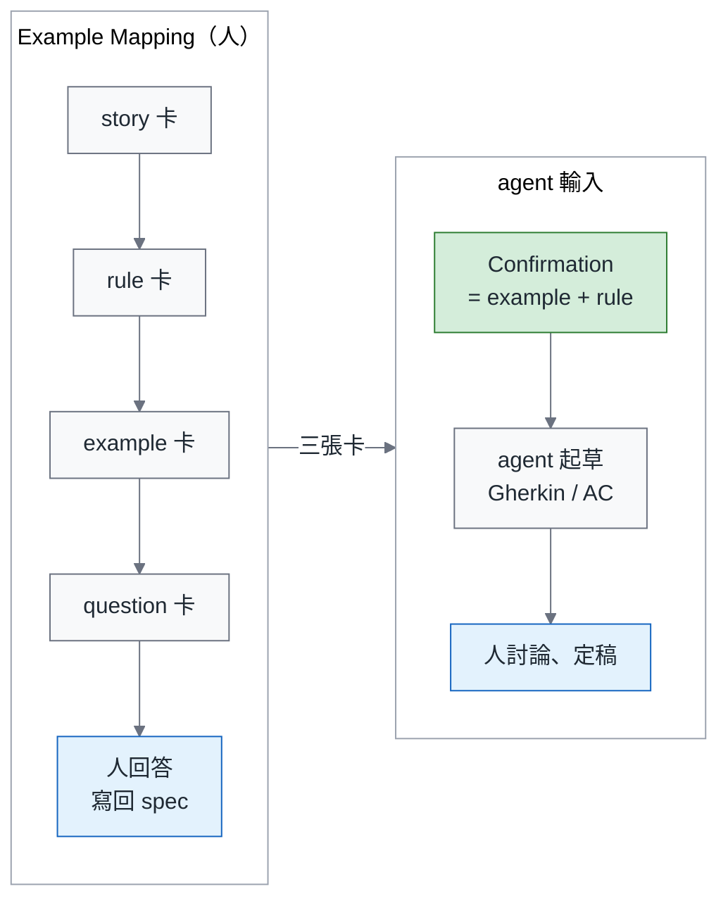
```mermaid
---
config:
  theme: base
  themeVariables:
    fontSize: 16px
    primaryColor: "#f8f9fa"
    primaryTextColor: "#1f2933"
    primaryBorderColor: "#6b7280"
    lineColor: "#6b7280"
    secondaryColor: "#f8f9fa"
    tertiaryColor: "#ffffff"
    clusterBkg: "#ffffff"
    clusterBorder: "#9ca3af"
    edgeLabelBackground: "#ffffff"
  flowchart:
    nodeSpacing: 36
    rankSpacing: 44
    padding: 12
    htmlLabels: true
    subGraphTitleMargin:
      top: 8
      bottom: 12
    curve: basis
---
flowchart LR
    classDef own fill:#d4edda,stroke:#2e7d32,color:#1f2933
    classDef buy fill:#fff3cd,stroke:#b8860b,color:#1f2933
    classDef bad fill:#ffe0e0,stroke:#c0392b,color:#1f2933
    classDef human fill:#e3f2fd,stroke:#1565c0,color:#1f2933
    subgraph em["Example Mapping（人）"]
        direction TB
        K1["story 卡"] --> K2["rule 卡"]
        K2 --> K3["example 卡"]
        K3 --> K4["question 卡"]
        K4 --> K5["人回答<br/>寫回 spec"]
    end
    subgraph ag["agent 輸入"]
        direction TB
        A1["Confirmation<br/>= example + rule"] --> A2["agent 起草<br/>Gherkin / AC"]
        A2 --> A3["人討論、定稿"]
    end
    em -->|三張卡| ag
    class K5,A3 human
    class A1 own
```

### P1-2 — 規格篇 第二節：spec 六段，人決定的 vs agent 驗收的（封面）

**圖說**：六段裡三段是人決定的、三段是 agent 驗收用的—右邊那三段就是契約篇的輸入；邊界併在約束裡，寫成帶 check 的禁區。（六段不是流程，不畫成一條線。）

**預期尺寸**：`flowchart LR` 包兩個 `direction TB` 子圖（兩欄）、6 節點、大綱實測 546×459、高／寬 0.84。子圖內用 `~~~` 隱形邊定序（六段不是流程），邊只連子圖本身（`h --> m`）。沿用大綱版，未改。

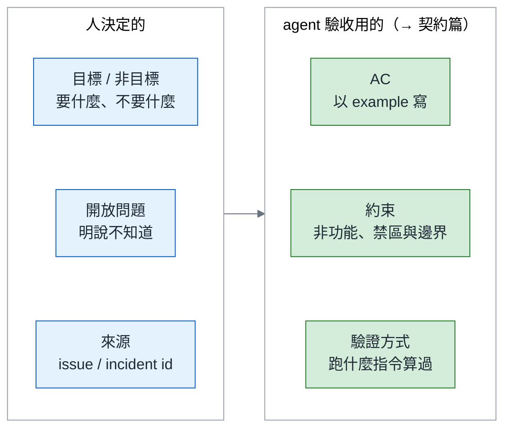
```mermaid
---
config:
  theme: base
  themeVariables:
    fontSize: 16px
    primaryColor: "#f8f9fa"
    primaryTextColor: "#1f2933"
    primaryBorderColor: "#6b7280"
    lineColor: "#6b7280"
    secondaryColor: "#f8f9fa"
    tertiaryColor: "#ffffff"
    clusterBkg: "#ffffff"
    clusterBorder: "#9ca3af"
    edgeLabelBackground: "#ffffff"
  flowchart:
    nodeSpacing: 36
    rankSpacing: 44
    padding: 12
    htmlLabels: true
    subGraphTitleMargin:
      top: 8
      bottom: 12
    curve: basis
---
flowchart LR
    classDef own fill:#d4edda,stroke:#2e7d32,color:#1f2933
    classDef buy fill:#fff3cd,stroke:#b8860b,color:#1f2933
    classDef bad fill:#ffe0e0,stroke:#c0392b,color:#1f2933
    classDef human fill:#e3f2fd,stroke:#1565c0,color:#1f2933
    subgraph h["人決定的"]
        direction TB
        H1["目標 / 非目標<br/>要什麼、不要什麼"] ~~~ H2["開放問題<br/>明說不知道"]
        H2 ~~~ H3["來源<br/>issue / incident id"]
    end
    subgraph m["agent 驗收用的（→ 契約篇）"]
        direction TB
        M1["AC<br/>以 example 寫"] ~~~ M2["約束<br/>非功能、禁區與邊界"]
        M2 ~~~ M3["驗證方式<br/>跑什麼指令算過"]
    end
    h --> m
    class H1,H2,H3 human
    class M1,M2,M3 own
```

### P1-3 — 規格篇 第四節：晚到需求的兩條路

**圖說**：晚到的需求有兩條路—在對話裡補一句（無紀錄、invalidation 兩倍）或改 spec 重跑（可 diff、可重現）；後者成立的前提是重跑便宜且低變異。

**預期尺寸**：`flowchart LR` 包兩個 `direction TB` 子圖（兩欄）、6 節點、實測 584×435、高／寬 0.74。邊只連子圖本身（`chat -.->|改走| spec`）。沿用大綱版，未改。

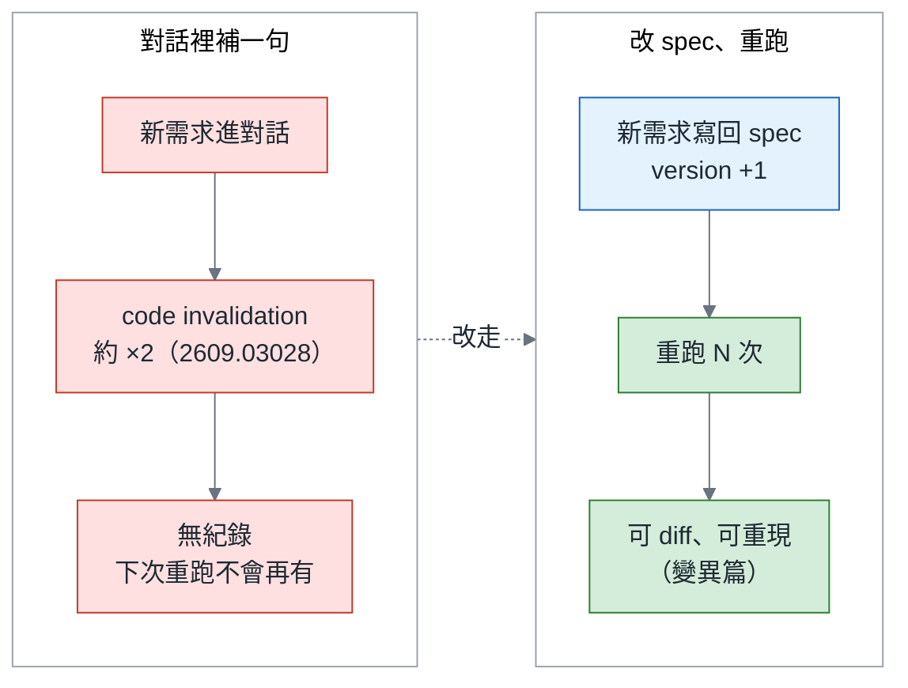
```mermaid
---
config:
  theme: base
  themeVariables:
    fontSize: 16px
    primaryColor: "#f8f9fa"
    primaryTextColor: "#1f2933"
    primaryBorderColor: "#6b7280"
    lineColor: "#6b7280"
    secondaryColor: "#f8f9fa"
    tertiaryColor: "#ffffff"
    clusterBkg: "#ffffff"
    clusterBorder: "#9ca3af"
    edgeLabelBackground: "#ffffff"
  flowchart:
    nodeSpacing: 36
    rankSpacing: 44
    padding: 12
    htmlLabels: true
    subGraphTitleMargin:
      top: 8
      bottom: 12
    curve: basis
---
flowchart LR
    classDef own fill:#d4edda,stroke:#2e7d32,color:#1f2933
    classDef buy fill:#fff3cd,stroke:#b8860b,color:#1f2933
    classDef bad fill:#ffe0e0,stroke:#c0392b,color:#1f2933
    classDef human fill:#e3f2fd,stroke:#1565c0,color:#1f2933
    subgraph chat["對話裡補一句"]
        direction TB
        B1["新需求進對話"] --> B2["code invalidation<br/>約 ×2（2609.03028）"]
        B2 --> B3["無紀錄<br/>下次重跑不會再有"]
    end
    subgraph spec["改 spec、重跑"]
        direction TB
        G1["新需求寫回 spec<br/>version +1"] --> G2["重跑 N 次"]
        G2 --> G3["可 diff、可重現<br/>（變異篇）"]
    end
    chat -.->|改走| spec
    class B1,B2,B3 bad
    class G1 human
    class G2,G3 own
```

### P1-T1 — 規格篇 第三節：厚 vs 薄，逐段

**圖說**：六段各自厚有效、厚無效、厚有害—成本欄寫人時。

**預期尺寸**：表格轉 PNG、6 列 × 4 欄。

表格比圖清楚（六段各一列的判定與理由），不畫圖。

### P1-T2 — 規格篇 第五節：spec review checklist

**圖說**：spec 人審 checklist：五個問題。

**預期尺寸**：表格轉 PNG、5 列 × 2 欄。

表格比圖清楚（五個是非問句的清單），不畫圖。

---

## 二、契約篇（5 張：P2-1、P2-2、P2-3a、P2-3b、P2-T1）

### P2-1 — 契約篇 第一節：SDD 三階梯與三種契約

**圖說**：本系列站在 Spec-anchored 這一階；一份 spec 拆出三種契約，全部綁在 CI gate 上。

**預期尺寸**：`flowchart TB` 包一個 `direction LR` 子圖（三階梯橫排、3 節點）與一個 `direction TB` 子圖（spec → 三種契約 → CI gate、5 節點）、8 節點、實測 718×603、高／寬 0.84。兩個子圖以 `ladder ~~~ kinds` 上下定序。沿用大綱版，未改。

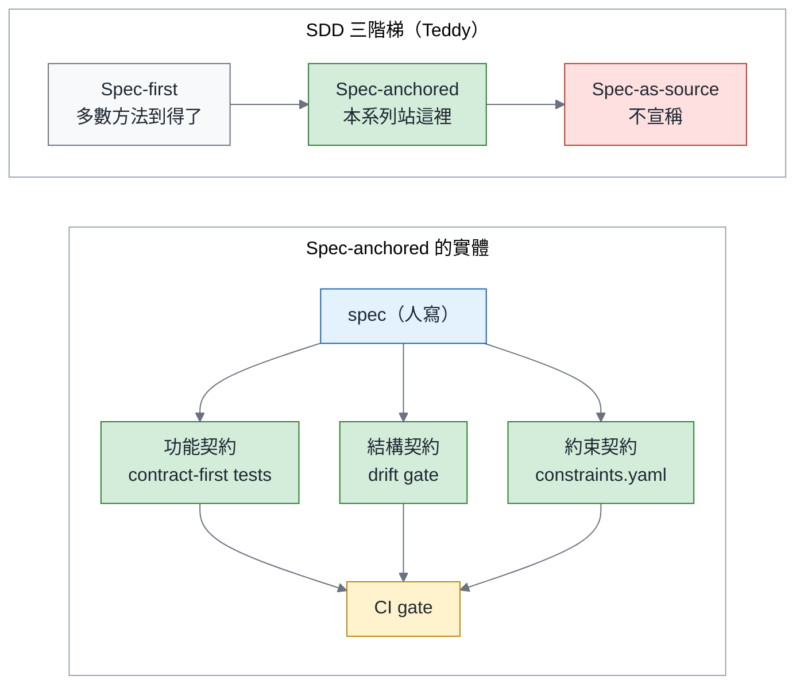
```mermaid
---
config:
  theme: base
  themeVariables:
    fontSize: 16px
    primaryColor: "#f8f9fa"
    primaryTextColor: "#1f2933"
    primaryBorderColor: "#6b7280"
    lineColor: "#6b7280"
    secondaryColor: "#f8f9fa"
    tertiaryColor: "#ffffff"
    clusterBkg: "#ffffff"
    clusterBorder: "#9ca3af"
    edgeLabelBackground: "#ffffff"
  flowchart:
    nodeSpacing: 36
    rankSpacing: 44
    padding: 12
    htmlLabels: true
    subGraphTitleMargin:
      top: 8
      bottom: 12
    curve: basis
---
flowchart TB
    classDef own fill:#d4edda,stroke:#2e7d32,color:#1f2933
    classDef buy fill:#fff3cd,stroke:#b8860b,color:#1f2933
    classDef bad fill:#ffe0e0,stroke:#c0392b,color:#1f2933
    classDef human fill:#e3f2fd,stroke:#1565c0,color:#1f2933
    subgraph ladder["SDD 三階梯（Teddy）"]
        direction LR
        L1["Spec-first<br/>多數方法到得了"] --> L2["Spec-anchored<br/>本系列站這裡"] --> L3["Spec-as-source<br/>不宣稱"]
    end
    subgraph kinds["Spec-anchored 的實體"]
        direction TB
        S["spec（人寫）"] --> K1["功能契約<br/>contract-first tests"]
        S --> K2["結構契約<br/>drift gate"]
        S --> K3["約束契約<br/>constraints.yaml"]
        K1 --> G["CI gate"]
        K2 --> G
        K3 --> G
    end
    ladder ~~~ kinds
    class L2 own
    class L3 bad
    class S human
    class K1,K2,K3 own
    class G buy
```

### P2-2 — 契約篇 第二節：code-first vs contract-first

**圖說**：先看 code 再補測試，測試只會錄下現狀；先給契約再生測試，測試紅了才准動 code。

**預期尺寸**：`flowchart LR` 包兩個 `direction TB` 子圖（兩欄）、6 節點、實測 580×435、高／寬 0.75。邊只連子圖本身（`cf -.->|改走| ct`）。沿用大綱版，未改。

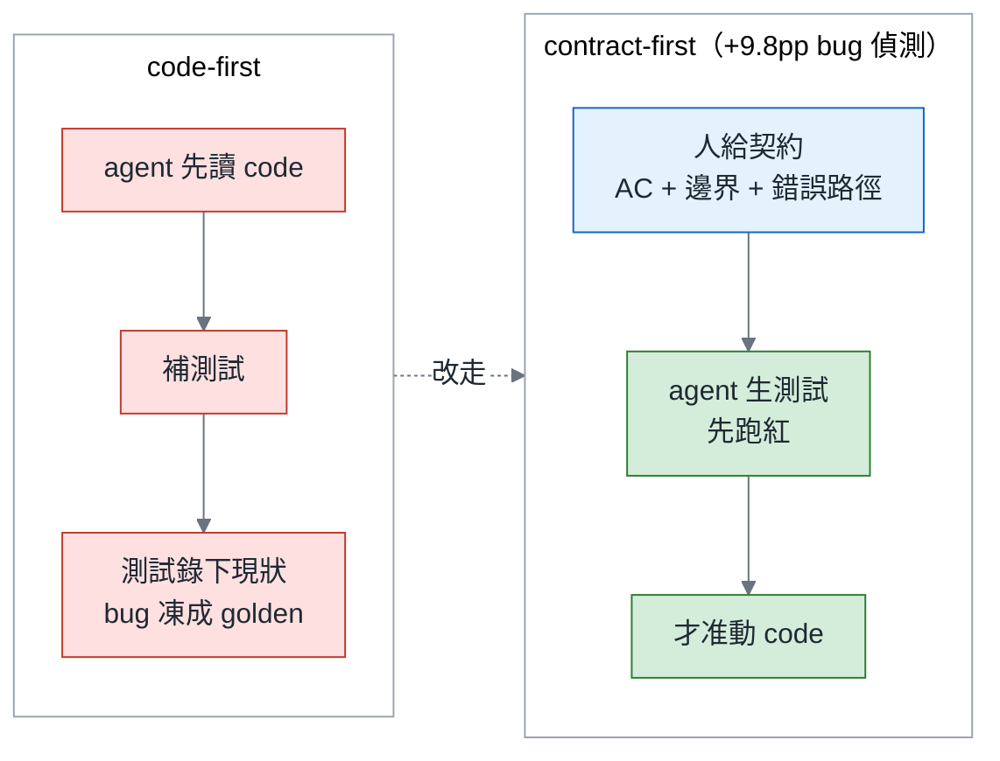
```mermaid
---
config:
  theme: base
  themeVariables:
    fontSize: 16px
    primaryColor: "#f8f9fa"
    primaryTextColor: "#1f2933"
    primaryBorderColor: "#6b7280"
    lineColor: "#6b7280"
    secondaryColor: "#f8f9fa"
    tertiaryColor: "#ffffff"
    clusterBkg: "#ffffff"
    clusterBorder: "#9ca3af"
    edgeLabelBackground: "#ffffff"
  flowchart:
    nodeSpacing: 36
    rankSpacing: 44
    padding: 12
    htmlLabels: true
    subGraphTitleMargin:
      top: 8
      bottom: 12
    curve: basis
---
flowchart LR
    classDef own fill:#d4edda,stroke:#2e7d32,color:#1f2933
    classDef buy fill:#fff3cd,stroke:#b8860b,color:#1f2933
    classDef bad fill:#ffe0e0,stroke:#c0392b,color:#1f2933
    classDef human fill:#e3f2fd,stroke:#1565c0,color:#1f2933
    subgraph cf["code-first"]
        direction TB
        B1["agent 先讀 code"] --> B2["補測試"]
        B2 --> B3["測試錄下現狀<br/>bug 凍成 golden"]
    end
    subgraph ct["contract-first（+9.8pp bug 偵測）"]
        direction TB
        G1["人給契約<br/>AC + 邊界 + 錯誤路徑"] --> G2["agent 生測試<br/>先跑紅"]
        G2 --> G3["才准動 code"]
    end
    cf -.->|改走| ct
    class B1,B2,B3 bad
    class G1 human
    class G2,G3 own
```

### P2-3a — 契約篇 第三節：drift gate，必須動 spec 的三類（封面）

**圖說**：行為、介面、約束三類變更必須動 spec—spec 動了放行，沒動就是 drift，擋。

**預期尺寸**：`flowchart TB`、8 節點、實測 527×632、高／寬 1.20。相對大綱版只改一處：兩行文字的決策節點「變更類型？」從菱形改成六角形（兩行文字的菱形會被放大成近正方形，把整張圖撐高）；單行的「spec.md 動了？」仍是菱形。

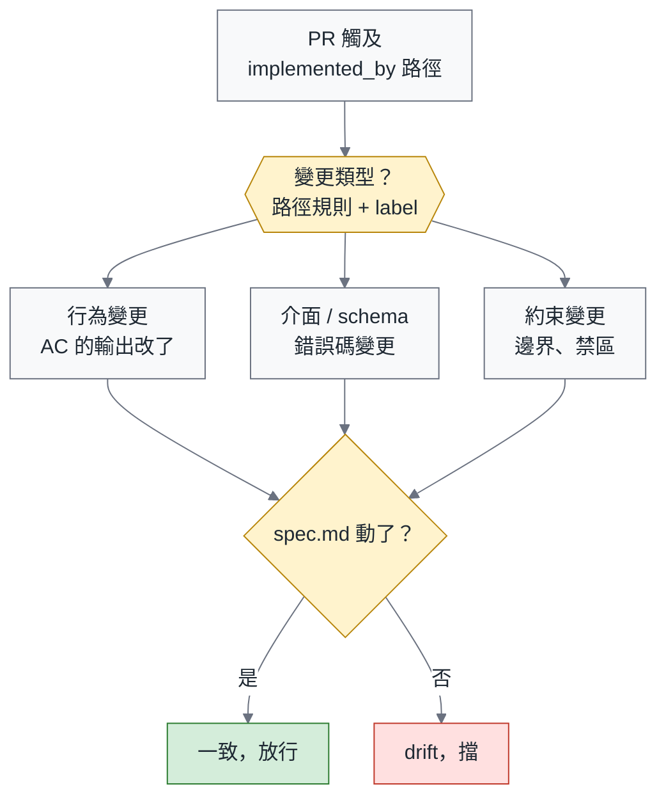
```mermaid
---
config:
  theme: base
  themeVariables:
    fontSize: 16px
    primaryColor: "#f8f9fa"
    primaryTextColor: "#1f2933"
    primaryBorderColor: "#6b7280"
    lineColor: "#6b7280"
    secondaryColor: "#f8f9fa"
    tertiaryColor: "#ffffff"
    clusterBkg: "#ffffff"
    clusterBorder: "#9ca3af"
    edgeLabelBackground: "#ffffff"
  flowchart:
    nodeSpacing: 36
    rankSpacing: 44
    padding: 12
    htmlLabels: true
    subGraphTitleMargin:
      top: 8
      bottom: 12
    curve: basis
---
flowchart TB
    classDef own fill:#d4edda,stroke:#2e7d32,color:#1f2933
    classDef buy fill:#fff3cd,stroke:#b8860b,color:#1f2933
    classDef bad fill:#ffe0e0,stroke:#c0392b,color:#1f2933
    classDef human fill:#e3f2fd,stroke:#1565c0,color:#1f2933
    PR["PR 觸及<br/>implemented_by 路徑"] --> T{{"變更類型？<br/>路徑規則 + label"}}
    T --> C1["行為變更<br/>AC 的輸出改了"]
    T --> C2["介面 / schema<br/>錯誤碼變更"]
    T --> C3["約束變更<br/>邊界、禁區"]
    C1 --> S{"spec.md 動了？"}
    C2 --> S
    C3 --> S
    S -->|是| OK["一致，放行"]
    S -->|否| NO["drift，擋"]
    class T,S buy
    class OK own
    class NO bad
```

### P2-3b — 契約篇 第三節：drift gate，refactor 與雜項

**圖說**：refactor 與雜項不必動 spec—但 `spec-impact: none` 若與 diff 矛盾（碰到測試檔、約束檔或公開介面），機器直接駁回，不等 reviewer。

**預期尺寸**：`flowchart TB`、8 節點、實測 585×620、高／寬 1.06。相對大綱版只改一處：三行文字的決策節點「diff 碰到 … ？」從菱形改成六角形（三行文字的菱形會撐成約 270×270 的正方形）；單行的「變更類型？」仍是菱形。

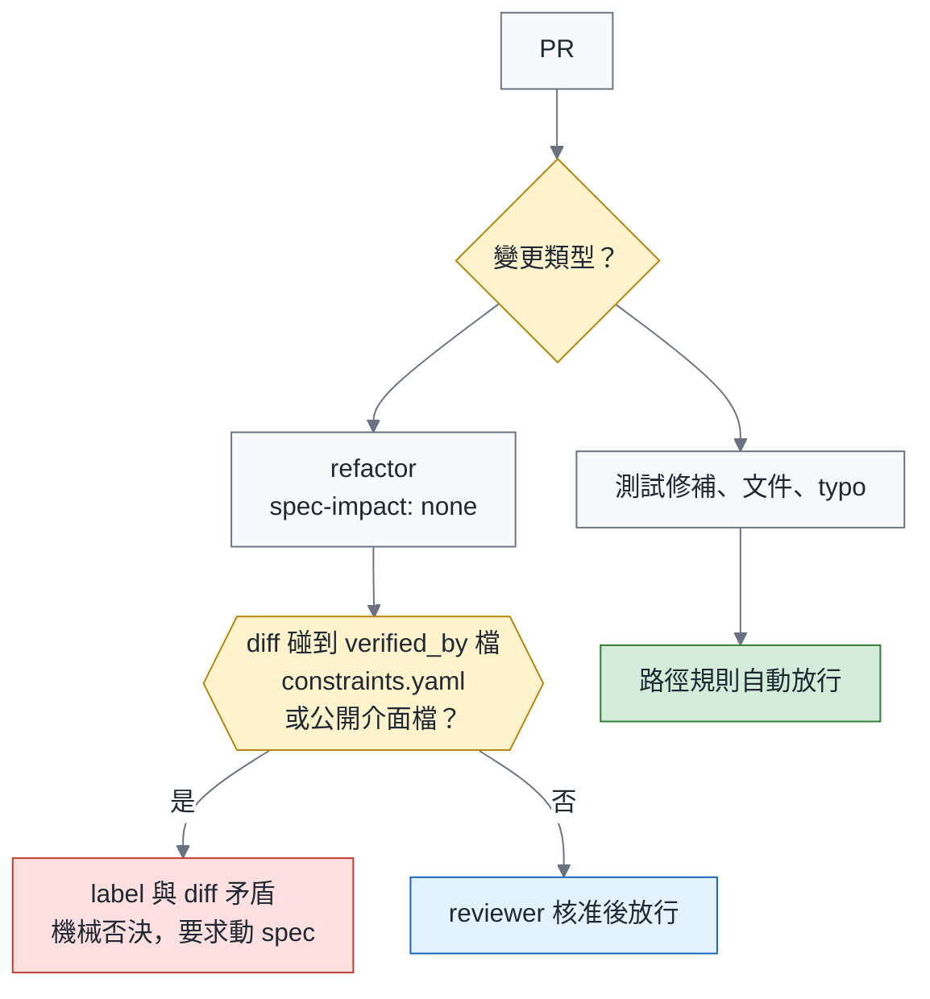
```mermaid
---
config:
  theme: base
  themeVariables:
    fontSize: 16px
    primaryColor: "#f8f9fa"
    primaryTextColor: "#1f2933"
    primaryBorderColor: "#6b7280"
    lineColor: "#6b7280"
    secondaryColor: "#f8f9fa"
    tertiaryColor: "#ffffff"
    clusterBkg: "#ffffff"
    clusterBorder: "#9ca3af"
    edgeLabelBackground: "#ffffff"
  flowchart:
    nodeSpacing: 36
    rankSpacing: 44
    padding: 12
    htmlLabels: true
    subGraphTitleMargin:
      top: 8
      bottom: 12
    curve: basis
---
flowchart TB
    classDef own fill:#d4edda,stroke:#2e7d32,color:#1f2933
    classDef buy fill:#fff3cd,stroke:#b8860b,color:#1f2933
    classDef bad fill:#ffe0e0,stroke:#c0392b,color:#1f2933
    classDef human fill:#e3f2fd,stroke:#1565c0,color:#1f2933
    PR["PR"] --> T{"變更類型？"}
    T --> R["refactor<br/>spec-impact: none"]
    T --> M["測試修補、文件、typo"]
    R --> X{{"diff 碰到 verified_by 檔<br/>constraints.yaml<br/>或公開介面檔？"}}
    X -->|是| NO["label 與 diff 矛盾<br/>機械否決，要求動 spec"]
    X -->|否| RV["reviewer 核准後放行"]
    M --> AUTO["路徑規則自動放行"]
    class T,X buy
    class NO bad
    class RV human
    class AUTO own
```

### P2-T1 — 契約篇 第四節：可攜 vs 不可攜（含證據等級）

**圖說**：五種產物的可攜性與證據等級—只有「散文 spec 不可攜」是文獻等級，其餘是推論。

**預期尺寸**：表格轉 PNG、5 列 × 4 欄（產物類型 / 可攜性 / 理由 / 證據等級）。

表格比圖清楚（五種產物逐列比較，重點是「證據等級」那一欄），不畫圖。

（P2-T0 變更類型決策表為第三節內文表，隨該節轉 PNG，大綱不列入圖表清單，這裡不另計。）

---

## 三、變異篇（6 張：P3-1、P3-2、P3-3、P3-T2、P3-T3、P3-T5）

### P3-1 — 變異篇 第二節：實驗設計

**圖說**：一份凍結的 spec、四套組態各跑十次、同一套尺量三軸，A / B / C 的 30 個 PR 再進盲審記 review minutes（A0 不進），最後對門檻；迷你第四組另跑前一代 model。四個 arm 不上色—實驗沒跑之前沒有哪一組是推薦或注意。

**預期尺寸**：`flowchart TB`、9 節點（四個 arm 並排一列，≤ 4）、實測 715×624、高／寬 0.87（與大綱版同尺寸）。相對大綱版改三處：虛線邊上的字從「A / C 各 N=5」（10 字）縮成「各 N=5」，「A / C 兩組」移進節點；節點裡的「（§七）」改成「見第七節」（§ 是計畫檔的內部代號，動筆時一律改成「第幾節」）；頂端節點「payment-timeout-fix 同格式」拆成三行，原本算繪時會把「式」單獨擠到第三行。

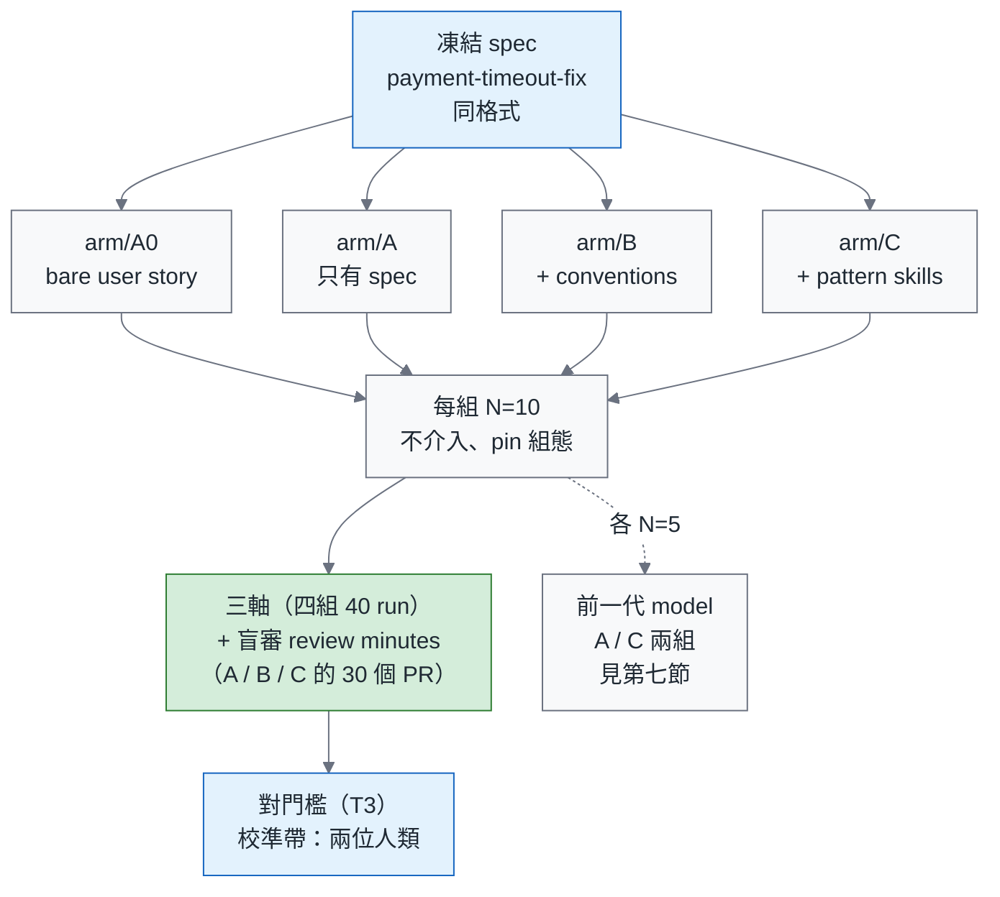
```mermaid
---
config:
  theme: base
  themeVariables:
    fontSize: 16px
    primaryColor: "#f8f9fa"
    primaryTextColor: "#1f2933"
    primaryBorderColor: "#6b7280"
    lineColor: "#6b7280"
    secondaryColor: "#f8f9fa"
    tertiaryColor: "#ffffff"
    clusterBkg: "#ffffff"
    clusterBorder: "#9ca3af"
    edgeLabelBackground: "#ffffff"
  flowchart:
    nodeSpacing: 36
    rankSpacing: 44
    padding: 12
    htmlLabels: true
    subGraphTitleMargin:
      top: 8
      bottom: 12
    curve: basis
---
flowchart TB
    classDef own fill:#d4edda,stroke:#2e7d32,color:#1f2933
    classDef buy fill:#fff3cd,stroke:#b8860b,color:#1f2933
    classDef bad fill:#ffe0e0,stroke:#c0392b,color:#1f2933
    classDef human fill:#e3f2fd,stroke:#1565c0,color:#1f2933
    S["凍結 spec<br/>payment-timeout-fix<br/>同格式"] --> A0["arm/A0<br/>bare user story"]
    S --> A["arm/A<br/>只有 spec"]
    S --> B["arm/B<br/>+ conventions"]
    S --> C["arm/C<br/>+ pattern skills"]
    A0 --> N["每組 N=10<br/>不介入、pin 組態"]
    A --> N
    B --> N
    C --> N
    N --> M["三軸（四組 40 run）<br/>+ 盲審 review minutes<br/>（A / B / C 的 30 個 PR）"]
    M --> T["對門檻（T3）<br/>校準帶：兩位人類"]
    N -.->|各 N=5| L["前一代 model<br/>A / C 兩組<br/>見第七節"]
    class S,T human
    class M own
```

### P3-2 — 變異篇 第三節：好變異 / 壞變異分類樹

**圖說**：兩個實作不同，先問契約過不過，再問設計層有沒有分歧—這兩層算壞變異，命名、順序與等價拆法不扣分。成本層（認知複雜度成長、review minutes）是跨 run 的彙總，不是逐對判斷，不在樹上，見第五節。

**預期尺寸**：`flowchart TB`、6 節點（兩個單行菱形）、大綱實測 585×612、高／寬 1.05。沿用大綱版，未改。

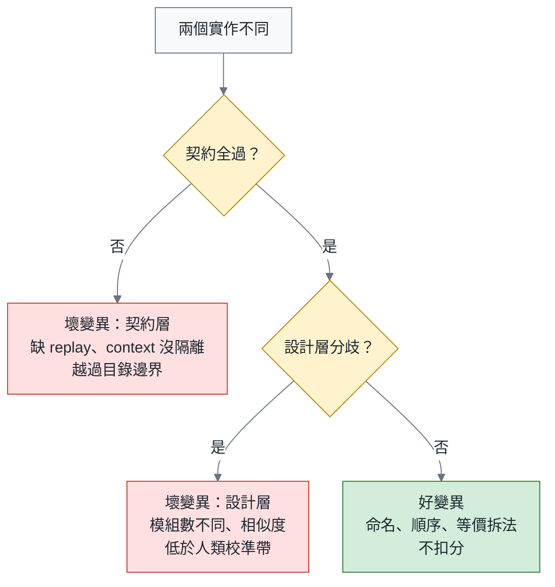
```mermaid
---
config:
  theme: base
  themeVariables:
    fontSize: 16px
    primaryColor: "#f8f9fa"
    primaryTextColor: "#1f2933"
    primaryBorderColor: "#6b7280"
    lineColor: "#6b7280"
    secondaryColor: "#f8f9fa"
    tertiaryColor: "#ffffff"
    clusterBkg: "#ffffff"
    clusterBorder: "#9ca3af"
    edgeLabelBackground: "#ffffff"
  flowchart:
    nodeSpacing: 36
    rankSpacing: 44
    padding: 12
    htmlLabels: true
    subGraphTitleMargin:
      top: 8
      bottom: 12
    curve: basis
---
flowchart TB
    classDef own fill:#d4edda,stroke:#2e7d32,color:#1f2933
    classDef buy fill:#fff3cd,stroke:#b8860b,color:#1f2933
    classDef bad fill:#ffe0e0,stroke:#c0392b,color:#1f2933
    classDef human fill:#e3f2fd,stroke:#1565c0,color:#1f2933
    D["兩個實作不同"] --> Q1{"契約全過？"}
    Q1 -->|否| B1["壞變異：契約層<br/>缺 replay、context 沒隔離<br/>越過目錄邊界"]
    Q1 -->|是| Q2{"設計層分歧？"}
    Q2 -->|是| B2["壞變異：設計層<br/>模組數不同、相似度<br/>低於人類校準帶"]
    Q2 -->|否| G["好變異<br/>命名、順序、等價拆法<br/>不扣分"]
    class Q1,Q2 buy
    class B1,B2 bad
    class G own
```

### P3-3 — 變異篇 第五節：三支槓桿 → 三步差值（封面）

**圖說**：三支槓桿各是一步—spec 厚度（A0 → A）、conventions（A → B）、skills（B → C）—每欄四格是同一套尺的前後值，數字為 10 月實測；A0 不進盲審，所以第一步沒有 review minutes。哪一支槓桿動哪一軸，看哪一格的數字動得多，不預先上色。

**預期尺寸**：`flowchart LR` 包三個 `direction TB` 子圖（三欄）、12 節點（上限）、大綱實測 759×600、高／寬 0.79。子圖內用 `~~~` 隱形邊定序，邊只連子圖本身（`s1 --> s2 --> s3`）；X₀ / V₀ / T₀ / R₁ 等占位在動筆時換成實測值。沿用大綱版，未改。

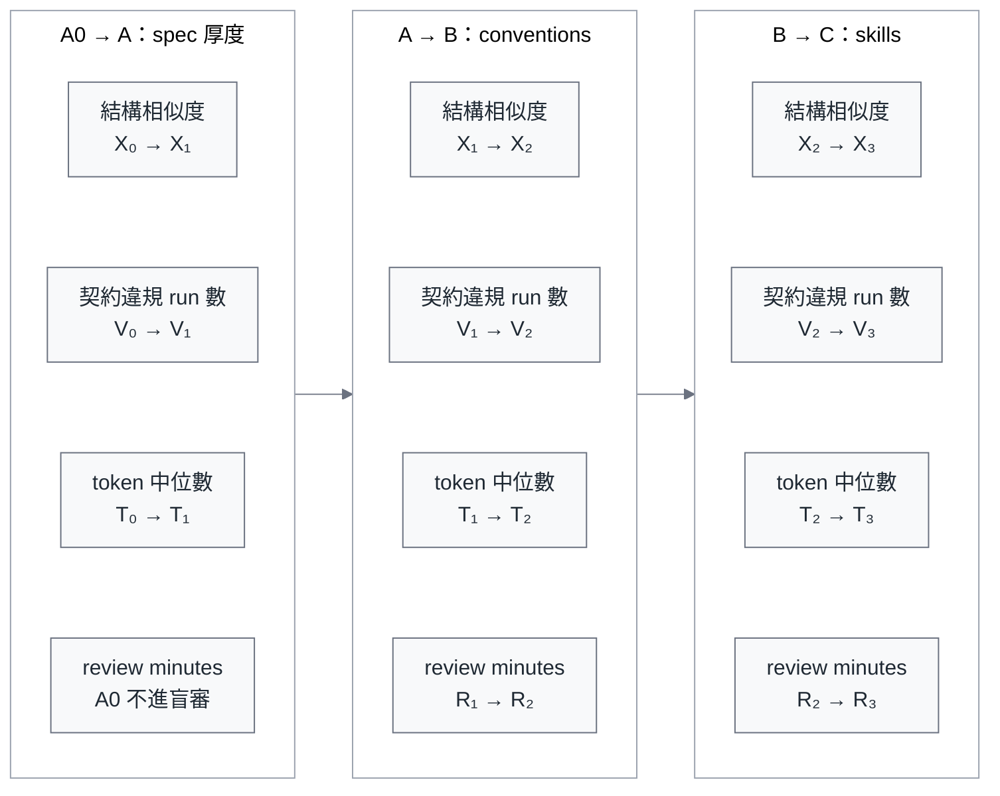
```mermaid
---
config:
  theme: base
  themeVariables:
    fontSize: 16px
    primaryColor: "#f8f9fa"
    primaryTextColor: "#1f2933"
    primaryBorderColor: "#6b7280"
    lineColor: "#6b7280"
    secondaryColor: "#f8f9fa"
    tertiaryColor: "#ffffff"
    clusterBkg: "#ffffff"
    clusterBorder: "#9ca3af"
    edgeLabelBackground: "#ffffff"
  flowchart:
    nodeSpacing: 36
    rankSpacing: 44
    padding: 12
    htmlLabels: true
    subGraphTitleMargin:
      top: 8
      bottom: 12
    curve: basis
---
flowchart LR
    classDef own fill:#d4edda,stroke:#2e7d32,color:#1f2933
    classDef buy fill:#fff3cd,stroke:#b8860b,color:#1f2933
    classDef bad fill:#ffe0e0,stroke:#c0392b,color:#1f2933
    classDef human fill:#e3f2fd,stroke:#1565c0,color:#1f2933
    subgraph s1["A0 → A：spec 厚度"]
        direction TB
        a1["結構相似度<br/>X₀ → X₁"] ~~~ a2["契約違規 run 數<br/>V₀ → V₁"]
        a2 ~~~ a3["token 中位數<br/>T₀ → T₁"]
        a3 ~~~ a4["review minutes<br/>A0 不進盲審"]
    end
    subgraph s2["A → B：conventions"]
        direction TB
        b1["結構相似度<br/>X₁ → X₂"] ~~~ b2["契約違規 run 數<br/>V₁ → V₂"]
        b2 ~~~ b3["token 中位數<br/>T₁ → T₂"]
        b3 ~~~ b4["review minutes<br/>R₁ → R₂"]
    end
    subgraph s3["B → C：skills"]
        direction TB
        c1["結構相似度<br/>X₂ → X₃"] ~~~ c2["契約違規 run 數<br/>V₂ → V₃"]
        c2 ~~~ c3["token 中位數<br/>T₂ → T₃"]
        c3 ~~~ c4["review minutes<br/>R₂ → R₃"]
    end
    s1 --> s2 --> s3
```

### P3-T2 — 變異篇 第三節：結果摘要表

**圖說**：結果摘要：四組 × 九量測，每組一列；逐 run 數據在 repo CSV。

**預期尺寸**：表格轉 PNG、4–6 列 × 9 欄。

表格比圖清楚（每組一列的摘要統計；逐 run 的 30–50 列不轉 PNG、放 repo 連結，xychart 不在允許的圖種內），不畫圖。

### P3-T3 — 變異篇 第四節：文獻 vs 本實驗

**圖說**：文獻量的是 run-to-run 還是組態間，對照本實驗。

**預期尺寸**：表格轉 PNG、7 列 × 3 欄（來源 / 量什麼 / 本實驗對應的觀察；數字欄一律寫「見總論第四節」）。

表格比圖清楚（七篇來源逐列標「run-to-run 或組態間」），不畫圖。

### P3-T5 — 變異篇 第七節：兩代 model × A / C

**圖說**：兩代 model × A / C：A–C 差距縮小了多少。

**預期尺寸**：表格轉 PNG、4 列 × 6 欄（model 世代 / 組 / 相似度中位數 / 契約違規 run 數 / token 中位數 / A–C 差距）。

表格比圖清楚（2 × 2 的數字對照，末欄是差距），不畫圖；重量流程（新 model → 重跑 → 差距縮小？→ 撤 prescriptive skill）依大綱用一段文字講，不另畫圖。

（P3-T1 設計表、P3-T4 eval case 欄位表、P3-T6 槓桿 × 軸 × 數字表為內文 markdown 表，大綱不列入圖表清單，這裡不另計。）

---

## 清單（25 條：16 張 Mermaid 圖 + 9 張表格）

| 編號 | 篇 / 節 | 種類 | 方向 | 節點 | 預期尺寸（高／寬） | 相對大綱版 |
|---|---|---|---|---|---|---|
| F1 | 總論 一 | flowchart | TB | 9 | 569×552（0.97，實測） | 未改 |
| F2 | 總論 二 | 表格 | — | 6 × 3 | — | 不畫圖 |
| F3 | 總論 三 | flowchart | TB，三個 LR 子圖 | 6 | 521×596（1.14，實測） | 未改 |
| F4 | 總論 四 | flowchart | TB，兩個 TB 子圖 | 9 | 657×805（1.23，實測） | 未改 |
| F6 | 總論 五 | 表格 | — | 3 × 5 + 註腳 | — | 不畫圖 |
| F7 | 總論 六 | flowchart | LR，兩個 TB 子圖 | 9 | 536×693（1.29，實測） | 未改 |
| F8 | 總論 七 | quadrantChart | — | 4 格 + 1 點 | 700×560（0.8，實測） | 點標籤縮短 |
| F9 | 總論 七 | flowchart | TB | 8 | 732×530（0.72，實測） | 邊字縮成「仍紅」 |
| F10 | 總論 八 | 表格 | — | 3 × 7 | — | 不畫圖 |
| P1-1 | 規格篇 一 | flowchart | LR，兩個 TB 子圖 | 8 | 525×645（1.23，實測） | 未改 |
| P1-2 | 規格篇 二 | flowchart | LR，兩個 TB 子圖 | 6 | 546×459（0.84，實測） | 未改 |
| P1-3 | 規格篇 四 | flowchart | LR，兩個 TB 子圖 | 6 | 584×435（0.74，實測） | 未改 |
| P1-T1 | 規格篇 三 | 表格 | — | 6 × 4 | — | 不畫圖 |
| P1-T2 | 規格篇 五 | 表格 | — | 5 × 2 | — | 不畫圖 |
| P2-1 | 契約篇 一 | flowchart | TB，LR + TB 子圖 | 8 | 718×603（0.84，實測） | 未改 |
| P2-2 | 契約篇 二 | flowchart | LR，兩個 TB 子圖 | 6 | 580×435（0.75，實測） | 未改 |
| P2-3a | 契約篇 三 | flowchart | TB | 8 | 527×632（1.20，實測） | 兩行決策節點改六角形 |
| P2-3b | 契約篇 三 | flowchart | TB | 8 | 585×620（1.06，實測） | 三行決策節點改六角形 |
| P2-T1 | 契約篇 四 | 表格 | — | 5 × 4 | — | 不畫圖 |
| P3-1 | 變異篇 二 | flowchart | TB | 9 | 715×624（0.87，實測） | 邊字縮短、§ 改「第七節」、頂端節點拆三行 |
| P3-2 | 變異篇 三 | flowchart | TB | 6 | 585×612（1.05，實測） | 未改 |
| P3-3 | 變異篇 五 | flowchart | LR，三個 TB 子圖 | 12 | 759×600（0.79，實測） | 未改 |
| P3-T2 | 變異篇 三 | 表格 | — | 4–6 × 9 | — | 不畫圖 |
| P3-T3 | 變異篇 四 | 表格 | — | 7 × 3 | — | 不畫圖 |
| P3-T5 | 變異篇 七 | 表格 | — | 4 × 6 | — | 不畫圖 |
