# 2026-11 文章計畫：同一份規格，跑十次

> 依據 `research/2026-09/selection.md`（2026-09-05 定案，含反方駁倒與 Notion 補充）、`.context/research/` 的五份摘要，以及已發布的四篇 Agentic Engineering 文章。本計畫是動筆前的施工圖：每一節都寫到「知道要說什麼、引什麼、畫什麼」的程度；空白處只剩 10 月實驗要填的數字。
>
> 修訂（2026-09-05 第二版）：依大綱評審意見修掉兩個 blocker（spec 厚度與變異的證據等級；變異源與組態敏感度的混用）與九個 major（Kahneman 對映、相似度定義與校準、N=10 鑑別力、run.sh 的 worktree bug、壞變異的定義與 review 成本、三個月共用來源的歸屬、重疊控管未落實、2606.20512 漏引），minor 一併處理。
>
> 修訂（2026-09-05 第三版）：依第二輪評審修掉兩個 blocker（2608.26197 被加上「同一 sampling」的限定詞；「槓桿不在 spec」沒有數據—A0 組升為必做）與三十餘個 major（2607.27877 歸回組態間、2608.25399 的 variance unchanged 不再寫成「沒人量過」、2608.11095 與 2608.16618 的角色接錯、BC-Bench 反證、人類校準帶取代 A 組 baseline、G2 終止條件與三個 task 的門票、向心相似度與 reviewer 學習效應、run.sh 的 `--model`、drift gate 的機械否決、what / how 名詞衝突、Go 單一 stack、`implemented_by:` / `verified_by:`、重疊控管、來源必須在 digest 內、10 月的工作量、每張圖補圖說與 Mermaid 原始碼），minor 一併處理。改動處在各節內文直接生效，不另加標記。所有圖依 `MERMAID.md`（frontmatter `config`、classDef 四色、TB 為主、≤ 12 節點）給完整原始碼。
>
> 修訂（2026-09-06 第四版）：依第三輪評審與 `research/scripts/mermaid_check.sh` 的實測重畫五張圖（F1 改成三問一答的 TB 地圖、F7 量測順序對齊 run.sh、F8 補 `quadrantChart` 尺寸、P3-2 只留兩層、P3-3 改成三步差值三欄），刪 F11（§十的表已含全部內容），六張表格補圖說，T1 回 5 欄並把出處移到註腳，P3-1 四個 arm 去色；文字面：+7.5pp 與 +14.5pp 分清、Teddy 的 How 與本系列的前後半切分分清、spec 七段併成六段（邊界併入約束）、A0 不進盲審在四處寫死、四篇 TL;DR 縮到約 350–400 字、References 1–3 改純引用格式。每張重畫的圖都經 mermaid_check.sh 實測 PASS，尺寸列在圖表清單。

---

## 0. 主題總覽

| 欄位 | 內容 |
|---|---|
| month | 2026-11 |
| slug | `same-spec-ten-runs` |
| title_zh | 同一份規格，跑十次：把實作變異數當成 harness 的驗收指標 |
| title_en | Same Spec, Ten Runs: Output Variance as the Acceptance Metric for Your Harness |
| 系列位置 | Agentic Engineering 第三個月。9 月三部曲蓋了組織、harness、營運；10 月回答「怎麼知道 agent 做對了」；11 月回答「怎麼知道 harness 做對了」；12 月把整套東西當 production 營運。 |
| 發布節奏（建議） | 總論 11/03（二）、規格篇 11/10、契約篇 11/17、變異篇 11/24。英文版：總論與變異篇各晚一天（這兩篇有 X 上的傳播價值，見第 4 節）；規格篇與契約篇的英文版可晚一週。理由見第 5 節。 |

### 標題規範（三部曲沿用已發布系列的前綴格式：一個冒號、一個破折號，Medium 卡片約 60 個中文字截斷）

| 篇 | title_zh | title_en |
|---|---|---|
| 總論 | 同一份規格，跑十次：把實作變異數當成 harness 的驗收指標 | Same Spec, Ten Runs: Output Variance as the Acceptance Metric for Your Harness |
| 一 | 同一份規格，跑十次（一）：規格篇—寫一份 agent 與人都能驗收的 spec | Same Spec, Ten Runs (1): The Spec—Writing a Spec Both Humans and Agents Can Accept |
| 二 | 同一份規格，跑十次（二）：契約篇—從 spec 到可執行的契約 | Same Spec, Ten Runs (2): The Contract—From Spec to Executable Contract |
| 三 | 同一份規格，跑十次（三）：變異篇—同一份規格的變異數，就是 harness 的驗收指標 | Same Spec, Ten Runs (3): The Variance—Run-to-Run Variance as Your Harness's Acceptance Metric |

- 「需求是 What、規格是 How」那句移到規格篇的 TL;DR；Teddy 的名字留在變異篇內文第一段，不進英文標題。
- 每篇固定尾段（與已發布四篇一致，tools/ 的 lockstep 測試會檢查連結清單）：**系列文章（本篇粗體）→ References → AI 協作說明（固定段）→ 簽名行**。
- 交叉引用寫法：本計畫檔用 § 當內部代號；**動筆時一律改成「總論第六節」「營運篇第二節的 eval case」「見第三篇」**，與已發布文章一致，Medium 上 § 也不好讀。

### 一句話論點

**生成越便宜，「同樣的輸入會不會長出同樣的東西」越值錢。** 固定一份規格、不介入、跑 N 次，實作的變異數就是 harness 的驗收指標—變異源自 model 的 sampling；已被證明會放大或衰減它的機制全在 loop 裡。spec 厚度已被證明動的是成本，能不能動變異，文獻沒量過，本系列的 A0 組會量；AGENTS.md conventions 與 Pattern Language skills 是另外兩支槓桿，各動不同的軸，沒有一支是上限。

### 目標讀者

- **主讀者**：台灣的 Engineering VP / EM / Staff engineer，已經讀過（或會被總論帶回去讀）9 月的技術篇與營運篇，手上有一個以上的 repo 在用 Claude Code / Codex / Copilot，正在被問「AGENTS.md 到底有沒有用」「要不要買規格工具」「為什麼同一個需求兩個人跑出來差那麼多」。
- **次讀者**：Teddy 工作坊的同學與搞笑談軟工、DDDesign Taiwan 的讀者—他們已經在問這個問題，缺的是一套量法與一組第一手數字。
- **不寫給誰**：想要 prompt 技巧的人；想要「spec 工具評比」的人。契約篇不做工具比較，只做 spec → 可執行契約的形狀。

### 為什麼是現在（有日期的證據）

1. **2026-08 下旬（Notion 頁面 created → last_edited 為 08-22 → 08-24；實際兩天日期向 Teddy 確認後再寫）**：Teddy Chen 的「馴服 AI 寫出可維護的系統：模式語言驅動開發工作坊」，筆者是學號 1 號。工作坊的 Context vs Form、SDD 三階梯、Four-Form Patterns、雙迴圈實作地圖，是本主題的機制骨架（`notion_digest.md` §2）。
2. **搞笑談軟工，2026 夏（日期待補）**：Teddy 的可重現性判準—「輸入相同的規格，不需要人為介入，既可重複產生幾乎相同的程式實作嗎？如果可以，我認為你的 Context Engineering / Loop Engineering 就算成功了」—298 反應 / 17 留言 / 74 分享，是筆者追蹤的 17 個 FB 社團裡分享數最高的技術訊號；同群學生量了 regeneration 的 LOC 變異（貼文 57 反應 / 3 留言 / 11 分享；**他們實際量到的數字與量法待補，見第 3 節—補不到就只寫「有人量過」**），留言問「更強的 model（Fable 5）是否需要更少約束」。四篇已發布文章完全沒回答這個問題（`community_digest.md` §1.1）。
3. **DDDesign Taiwan**：Kim Kao 用多 agent 從 legacy codebase 抽 bounded context，每次抽出的數量不同；鮑承佑的回覆「每次『骰』會有不一樣的結果」（16 / 3）。同一個現象、另一個社群、另一種 artefact—而且是**沒有任何契約寫得出來的那種變異**（見總論 §六「壞變異」的第二層）。
4. **2026-08-17**：Uncle Bob 公開 negative test experiment repo—Hunt the Wumpus、四種測試紀律、8 次 run，**每次都通過同樣 25 條 acceptance test，但程式不是同一個程式**（`x_digest.md` T5 原句「yet the programs were not the same」—是「不全相同」，不是「兩兩皆不同」）。本主題只用這一個事實；「量產出、不教流程」的讀法是 10 月測試篇的（見下方來源歸屬表）。英文版以它開場。
5. **2026-08-25**：arXiv 2608.26197 *Harness Engineering for Predictable Agentic Systems*—宣稱結構化 planning 約束讓 reproducibility 達 1.000（4 格裡 3 格），代價是 model-dependent latency。**它是否固定 sampling、是否為 coding 任務，一行摘要沒說**（arxiv.md 無星號，abstract 未讀）；讀全文前全系列只寫「loop 側的約束能把 run-to-run 變異壓到接近零」，不寫「同一 sampling」。若全文顯示 1.000 來自 decoding 決定性（temperature / seed），此篇改列為反模式 4 的反例而不是證據（第 3 節第 2 點）。
6. **2026-08-26**：arXiv 2608.25399 *Can your AI agent be cheaper?*—2,700 runs，完整 spec 縮成 bare user story 讓 token +29.7%。**同一篇說「run-to-run variance unchanged」；arxiv.md 把它歸在 unit economics 叢集、摘要全在講 token spend，讀完全文前預設它量的是 token 花費的離散度**（第 3 節第 2 點）。它證明的是 spec 厚度動成本軸；輸出結構的變異沒人直接量過。
7. **2026-09-01**：Claude Fable 5.1 / Mythos 5.1 發布；Anthropic 的 Thariq 在 07-24 就砍掉 ~80% 的 Claude Code system prompt（33k 書籤）；@AntonyMarcano 09-03 問「你是不是 over-specifying 你的 skills」；@wquguru 09-03 推測 Fable 5.1 已「內化」許多 skills。每一次 model 世代更替，「約束還需不需要」都要重量—而重量的方法就是本主題的 N-run；10 月當下前一代 model 仍可用，所以變異篇能直接量（§七的迷你第四組）。
8. **2026-09-03**：arXiv 2609.03966—同一個 model、同一份資料，只換 chat-template / parser adapter，分數從 0.00 到 0.96（摘要只說到這裡；是否為 coding-agent 情境待讀全文，這裡只借「組態敏感度」一義）。本主題只借它說一句：談變異不能只看 model；詳述留給 12 月的 harness pin。

### 與已發布三部曲的關係

**建立在什麼之上（可以直接引用，不重講）**

| 已發布 | 本主題怎麼接 |
|---|---|
| 總論 §六「Harness 不是 Prompt」、§九「Eval：唯一會複利的資產」 | 變異 eval 是 eval dataset 的新一軸；harness 五層在這裡只出現在「變異來源地圖」的座標軸上 |
| 技術篇 §二 AGENTS.md 三層架構、「機制二：eval-backed 驗證（pass rate 沒變好就是雜訊）」 | 本主題修正這句話：pass rate 不是量 AGENTS.md 的對的軸，結構與複雜度成長才是（2607.27250 / 2606.20512 vs 2608.25241） |
| 技術篇 §六 Guardrails / Policy as Code | 契約篇的 drift gate 與約束契約是它的 spec 側延伸 |
| 營運篇 §二 eval case YAML、三級 eval、LLM-judge 三陷阱 | 變異 eval 沿用同一種 case 格式，多兩個欄位（`runs: 10`、`variance:`）；不重講 judge |
| 營運篇 §四 指標成對（含 review minutes / PR）、§五 G2 gate（retry < 15%、escape 持平、champions 自轉） | 變異門檻進 G2 當第四軸；成對原則直接套用（變異低必配 pass 高）；**review minutes / PR 是本主題量「結構變異值多少錢」的接點** |
| 營運篇 §二 的 `payment-timeout-fix` eval case | 規格篇的 spec 模板、契約篇的 `contracts/` 目錄與 drift gate worked example **全部用這同一個案例、同一個 Go stack**（`internal/db/pool.go`），讀者三篇對照 |
| 10 月「綠燈不是驗收」的 constraint tests / SWE-Gate / pass^k | 11 月只「借用」約束違規數當一個量測欄位，SWE-Gate 的解說留給 10 月可靠度篇；筆者工作坊的 10/16 vs 16/16 A/B 是 10 月的展品（N=1 合規數據，**不是變異數據**），11 月只拿它的 16 條 checklist 當違規指標的原型 |

**不得重複**：harness 五層的定義、AGENTS.md 該怎麼寫（寫錯 vs 寫對）、MCP gateway、sandbox 選型、eval dataset 從哪來、成本模型與 model routing、組織編制與 champion。凡是 9 月寫過的，一句話加連結帶過。

**與 backlog 的關係**：本主題吸收 backlog「AGENTS.md 不會讓 agent 變聰明」的 **context 檔部分**（2607.27250、2606.20512、2608.25241、2608.11095、2608.21964—命題調弱成「pass rate 對 context 檔不敏感，要配 quality 側指標成對讀」，正是總論 §五的結論）；該主題的 **skills 供應鏈材料**（2608.21929、2608.26733、2609.02564、2608.25776、2607.02357）一律不碰，留給爆炸半徑主題。這樣 2027-02 不必重寫，也不會撞。

### 來源歸屬：三個月共用論文誰獨佔、誰帶過

讀者會連讀三個月；同一批數字出現三次就像一篇長文切三次。動筆前照這張表分配，各月計畫檔同步。**同一個月內也一樣：一個數字只在一節完整出現，其他節寫「數字見總論第四節」。**

| 來源 | 歸屬 | 其他月怎麼帶 |
|---|---|---|
| 2608.26197、2608.23740、2607.27877、2608.25399、2608.21208、2609.03028、2608.23067、Kahneman《雜訊》 | **11 月獨佔** | 10、12 月只連結，不重述數字 |
| 2608.26218（28% → 49%）、2609.03966（0.00 vs 0.96）、2608.22752（53% → 10%） | **12 月獨佔**（harness pin 與 change management） | 11 月 §四下層一句「組態敏感度，12 月可靠篇詳述」，不展開 |
| Uncle Bob 08-17 experiment repo | **10 月獨佔**「量產出、不教流程」「SWE-Gate 的個人版」讀法 | 11 月只用「25 條 acceptance 全過、程式不同」這一個事實（§五、變異篇 §四 各一句） |
| LeSS in Action A-TDD（因為對的理由紅、避免負向斷言、真資料勝過 mock） | **10 月測試篇** | 規格篇 §一、契約篇 §二 各壓成一行連到 10 月測試篇 |
| 2608.25241、2608.11095、2608.23550、@trq212 07-24 | **共用，分數字** | 11 月：+53% vs +27% 複雜度成長、rationale comment +211% → +1.4%（一句）、4.4–16% 只在反模式 7 一句、砍 80% 當「減法也是槓桿」；12 月：73.8% set-and-forget、+226% 一生成長、write-only channel、change management |
| 2607.27250、2606.20512、2608.21964 | 11 月吸收自 backlog 的 context 檔部分 | 見上段 |

### 反模式清單（系列會點名的 8 個）

| # | 反模式 | 一句話 | 主要出現在 |
|---|---|---|---|
| 1 | **一次過就叫成功** | demo 跑一次綠燈就上 roadmap；pass@1 不是驗收，N=1 沒有變異數可言 | 總論 §一、變異篇 |
| 2 | **把加厚規格當變異處方** | 一遇到「每次長得不一樣」就加厚 spec 模板、多寫 AC—但文獻只證明厚度動的是成本（user story 比完整 spec 多花 29.7% token，2608.25399）與誤讀；**輸出結構的變異：文獻未直接量（2608.25399 的 variance unchanged，待確認量的是什麼）**，本系列的 A0 組是第一次直接量。沒量就開處方，才是反模式。完整是必要條件（2608.16618），但需求總是在第一次實作後才到、事先警告無效（2609.03028），所以完整有天花板 | 總論 §五、規格篇 §三 |
| 3 | **Gherkin 工廠** | 「AI 幫你寫了四十條 Gherkin，然後呢」—把規格數量當品質，把 BDD 當工具不當溝通 | 規格篇 §一 |
| 4 | **temperature 0 迷思** | 把變異當 model 參數問題去調。sampling 是變異的源頭，但不是槓桿：loop 側的約束能把 run-to-run 變異壓到接近零（2608.26197，一行摘要；是否固定 sampling 待讀全文）、並行 topology 能降 run-to-run 變異（2608.23740）—槓桿在 loop | 總論 §四 |
| 5 | **把變異全滅當目標** | 追 reproducibility 1.000 而付 latency 與探索空間的代價；等價實作的「好變異」與違反契約、設計分歧、複雜度成長的「壞變異」要分開量 | 總論 §六、變異篇 §三 |
| 6 | **把散文 spec 當成可攜的東西** | 一份 spec 給 Kiro 寫、丟給 Gemini 讀，F1 0.035（2608.21208）；散文式 spec 是調給某一家 agent 的 prompt。「契約可攜」是本系列的推論，沒量—每季丟給挑戰者 vendor 跑一次才算 | 契約篇 §四 |
| 7 | **寫進 AGENTS.md 就算 enforced** | CLAUDE.md 裡只有 4.4–16% 的安全規則對得上任何可執行控制（2608.23550，一句帶過）；conventions 沒有 gate 就只是願望 | 總論 §八、契約篇 §三 |
| 8 | **借別人的變異數** | 拿課程 repo、benchmark 或 vendor 白皮書的 reproducibility 數字當自己的；變異是 repo-specific，要在自己的 repo 量 | 變異篇 §二、§六 |

### 本主題的歷史類比

**Flaky tests：CI 界花了十年才承認「同樣的輸入要長出同樣的結果」是有預算的工程目標，不是假設。**

- 2000 年代的 CI 只問「build 過了沒」；flaky test 在同一個十年從「重跑就好」變成有預算、有 quarantine、有 flake rate 指標的一級公民—門檻不是零，而是「flake rate 在預算內」；「綠燈重跑三次才綠」被承認是一個 bug，不是運氣。這是本主題的主軸：變異門檻、加跑再判、紅燈回頭修 harness，形狀完全一樣。
- Reproducible builds（Debian、Bazel 的 hermetic build、Nix 的 bit-for-bit）只當**極端端點**一句帶過：「2608.26197 的 1.000，就是 bit-for-bit 的樣子，它的代價是 latency 與 plan 的僵硬度—你要的是門檻內，不是那一端」（反模式 5）。
- Agentic 2026 的對照：**「十次裡三次違反契約」是 flaky test 的 agent 版；「同一份 spec、同一個 harness，跑十次長出幾乎相同的實作」是它的正向目標。** 我們現在的位置大約是 CI 的 2012 年：多數人還在「重跑就好」，少數人開始量。
- 書錨是 Kahneman《雜訊》（2022 讀書筆記，引句「人類只要做出判斷，就會有雜訊。這些雜訊比我們以為的還多」）：noise audit 的方法—同一個案件、多位法官、量離散度—就是「同一份規格、跑 N 次」；bias 與 noise 是兩個獨立的軸，對應 pass rate 與變異數。這給了總論書評型的脊椎（作者完讀率最高的格式）。對映細節在總論 §二，**法官是一套 harness 組態，不是一次 run**—讀過原書的人第一個會檢查這裡。
- 注意：flaky test / reproducible builds 的具體數字與出處不在五份摘要裡，動筆前要補（見第 3 節）；總論裡先用歷史敘事，不放沒查證的百分比。

---

## 1. 總論 outline

### 標題

同一份規格，跑十次：把實作變異數當成 harness 的驗收指標

### TL;DR（草稿，作者口吻，約 350–400 字）

> **TL;DR** — 這個夏天台灣技術社群分享數最高的一句話是 Teddy Chen 問的：「輸入相同的規格，不需要人為介入，能不能重複產生幾乎相同的程式實作？」我的回答是：可以量，而且應該把它當成 harness 的驗收指標—生成越便宜，「同樣的輸入會不會長出同樣的東西」越值錢。我用 Kahneman《雜訊》的 noise audit 當骨架，先拆開變異從哪裡來（源頭是 sampling，放大或衰減它的機制在 loop），再看 spec 厚度、AGENTS.md conventions、Pattern Language skills 三支槓桿各動哪一軸。最常被誤用的是 spec 厚度：2,700 次 run 的文獻只證明它動成本（bare user story 比完整 spec 多花 29.7% token）；輸出結構的變異沒人直接量過，所以我自己量了。決策工件是「固定 spec 跑 N 次」的變異門檻，接進營運篇 G2 當第四軸。

### 系列導覽

> 系列導覽：**總論（本篇）** → 一、規格篇 → 二、契約篇 → 三、變異篇

### 章節（11 節；決策工件在第六節，約全文 45% 處）

**一、Teddy 的問題：你的 harness 過關了嗎**
- 開場直接引 Teddy 的原句（298 / 74 分享）與 Kim Kao 的 bounded context「每次數量不同」；不引 DavidKo 轉貼與 2025 講題。
- 讀者正在問的三個問題：AGENTS.md 到底有沒有用？要不要買 spec 工具？為什麼同一個 ticket 兩位工程師用 agent 跑出來差這麼多？—三題共用同一個答案：你沒有量變異。
- 先講結論（粗體一行）：**變異源自 sampling；已證明會放大或衰減它的機制全在 loop。spec 厚度已被證明動的是成本，能不能動變異，文獻沒量過—本系列的 A0 組量了，數字在第五節與第三篇。量它，然後把它當 harness 的驗收指標。**（動筆時依 A0 結果決定最後一句要不要加「不在 spec 裡」；A0 沒跑成就照這句寫，不加。）
- 預告：本文的決策工件是「固定 spec 跑 N 次」的變異門檻，接進營運篇 G2；三部曲分別回答 spec 長什麼樣、spec 怎麼變成契約、以及筆者自己的十次實驗。
- 圖 F1（見圖表清單）。

**二、書錨：Kahneman《雜訊》與 noise audit**
- 《雜訊》的核心：判斷有兩種錯—bias（系統性偏移）與 noise（離散）；組織通常只看 bias，因為 noise 要「同一案件給多人判」才看得到，而沒人會這樣做。
- Noise audit 的方法：同一個案件、多位法官、量離散度—和「同一份規格、跑 N 次」是同一個形狀。引句「人類只要做出判斷，就會有雜訊」→ agent 的每一次 run 都是一連串判斷。
- **對映要對得上原書的三分法**：案件 ↔ spec；**法官 ↔ 一套 harness 組態**（model + harness 版本 + AGENTS.md / skills）；**一次判決 ↔ 一次 run**。於是：level noise ↔ 不同組態（A / B / C、不同 model）之間的平均差；pattern noise ↔ 同一組態對特定 task 類型的系統性偏好（例如某組態遇到 refactor 就偏好抽 interface）；occasion noise ↔ 同一組態的 run-to-run 差。**本主題量的是 occasion noise；變異篇 §七「更強的 model 需不需要更少約束」是 level noise；A / B / C 三組就是三位法官在審同一個案件。** 這樣的對映比「法官 = run」漂亮，也才不會被讀過原書的人在第一段抓到「同一位法官沒有第二次判決」的矛盾。
- Kahneman 的 decision hygiene（結構化判斷、獨立評分、延後整體直覺），對應 2608.26197 宣稱的 structured planning constraints—結構化的判斷流程降 noise，這是心理學已知、agent 剛重新發現的事（2608.26197 的細節與保留見 §四）。
- 圖 F2（表格轉 PNG，見圖表清單）。

**三、名詞先講清楚：需求、規格、契約**
- Teddy 的用法：需求 = What（Problem Domain on Real World）、規格 = How（Solution Domain on Machine Runtime），出自 Michael Jackson 的 Problem Frames 與 Daniel Jackson 的 Three Directions in Design。
- 本系列的用法（明說並對照）：**需求**是問題域的 what；**規格**是「agent 與人都能驗收的行為描述」—包含 AC、約束、驗證方式；**契約**是規格裡「可執行、會失敗、綁在 CI」的子集。對照 Teddy 的 How：本系列把它切成前後半—前半叫規格、後半叫契約—**這個切分是本系列的，不是 Teddy 的**，工作坊手冊只有「需求 = What、規格 = How」這一層，不要把「前半 / 後半」掛在 Teddy 名下。契約篇只做規格 → 契約的轉換，ADR 的 why 在第八節。
- 本系列站在 Teddy SDD 三階梯的 **Spec-anchored** 那一階，並用變異數當它的驗收；不宣稱 Spec-as-source—理由一句帶過（不可攜、需求晚到、spec-driven 任務最難），三階梯的展開與圖移到契約篇 §一。
- 圖 F3（見圖表清單）。

**四、變異從哪裡來：兩層，別混**
- **上層：run-to-run 變異的來源**（同一套組態、重複跑，為什麼不一樣）。源頭只有一個：**(0) model sampling—occasion noise 的本體**，在 loop 之外，Form 改不了（Teddy 的 Context vs Form）。loop 裡的機制不製造它，但會**放大或衰減**它：(1) planning 結構—2608.26197 宣稱結構化 planning 約束讓 reproducibility 達 1.000（4 格裡 3 格），代價是 model-dependent latency；它是否固定 sampling、是否為 coding 任務，摘要沒說—讀全文前只寫「loop 側的約束能把 run-to-run 變異壓到接近零」，不寫「同一 sampling」；(2) topology—並行兩個 agent 比序列的 run-to-run 變異更低（2608.23740，一行摘要）；(3) context 組裝的路徑依賴—每次 run 在不同時點 compaction、讀到的檔案順序不同，等於每次法官拿到的卷宗不完全一樣（這一項是推論，標明；量法在變異篇：記錄每次 run 讀了哪些檔）。
- **下層：組態敏感度**（換一套組態，結果差多少—這是 level noise，不是 run-to-run 變異；在 pin 住的組態下，tool output 裁切與 parser 是決定性的，對 run-to-run 變異貢獻為零）。四個數字一句帶過並標領域：同一 model 換 topology 分數差 >30 分、wall-clock 兩倍（2607.27877，10 種 topology、100 runs）—**這是組態敏感度，不是 run-to-run**；tool output 裁切 28% → 49%（2608.26218，coding agent、SWE-bench Verified tight-window）；chat-template / parser adapter 0.00 vs 0.96（2609.03966，摘要只說同一 model、同一資料、只換 adapter；是否為 coding-agent 情境待讀全文，這裡只借「組態敏感度」一義）；/compact 後安全規則 53% → 10%（2608.22752，Claude Code 生產組態）。**「這是換 harness 版本的差異，12 月可靠篇的 harness pin 詳述。」**（組態間）DEPBENCH 2608.30300：203 個真實升級任務、最佳組態只解 51.2%，harness、model、ecosystem 三者之間的差都大—所以第一步永遠是先量自己的 repo，不要假設哪一層主導。
- 論點：**變異源自 sampling，放大或衰減在 loop；你能動的槓桿在 loop。** 這正對得上 Teddy 的 Context vs Form：Form（model）改不了，能改的只有窮舉的 context 與流程。
- 誠實的反例：BC-Bench（2608.20851，一行摘要）在一個 niche ERP DSL 上發現 model 之間的差異大於 harness 之間的差異—所以「槓桿在 loop」是對主流語言與通用 repo 的主張，領域越窄、model 越不熟，Form 的權重越大；這也是為什麼第一步永遠是先量自己的 repo。
- 反模式 4「temperature 0 迷思」在這裡點名。
- 圖 F4（見圖表清單）。

**五、三支槓桿：spec 厚度、AGENTS.md conventions、Pattern Language skills**
- **槓桿一：spec 厚度—文獻證明它動成本與誤讀；動不動變異，本系列的 A0 組量。** 2608.25399 只留一句：bare user story 比完整 spec 多花 29.7% token（反過來說，完整 spec 省約 23%—這是從 +29.7% 反算的推導值，論文摘要只給 +29.7%），規格篇 §三細讀；**變異軸：文獻沒直接量，本系列 A0 組（bare user story 取代完整 spec，其餘同 A）是第一次量，差值填在 T1、詳見變異篇 §五**。2608.16618 Specification Paradox：生成越強越依賴正確且完整的人類 spec—完整是必要條件；但需求總是在第一次實作後才到、事先警告無效（2609.03028，一句，規格篇 §四細讀），所以完整有天花板。Uncle Bob 08-17 的事實：8 次 run 都過同樣 25 條 acceptance tests，程式卻不同—acceptance criteria 決定「做什麼」，決定不了「長成什麼」。維護成本：每 task 一份、壽命最短；便宜與否取決於寫它的人時，見規格篇第三節。反模式 2、3 在這裡點名。
- **槓桿二：AGENTS.md conventions—動的是結構與複雜度成長，不動 pass rate。** 重讀文獻的爭議：controlled ablation 說 context 檔不動 correctness（2607.27250，**Claude Code + Codex、17 個真實任務、288 runs**，bound ≤ 10–15pp）；probe-refined AGENTS.md 讓 resolve 從 25.5 / 28.3% 升到 33.0%（+7.5pp），**增幅來自 file coverage（+14.5pp），不是 patch 品質**（2606.20512）；觀察研究說沒 commit AI config 的 agent-first repo 認知複雜度成長率接近兩倍（+53% vs +27%）、靜態分析警告 1.7 倍（2608.25241）。**三篇沒有矛盾：context 檔對 pass rate 的效果小且來自幫 agent 找到檔案；對結構與複雜度成長的效果大。** 技術篇「pass rate 沒變好就是雜訊」要在這裡修正—量錯軸了。
- **槓桿三：Pattern Language skills—文獻只證明它貴（2608.23067），能不能收斂結構是本系列的假設 H1 / H3，變異篇實驗填。** 結構變異那一格在 T1 表是實測值，不是文獻值，理由如下：2608.23067 只量了 Pass@2（注入「正確的」公開 skill 讓 Pass@2 掉 1.3–4.2%）、token（+72–394%）與有幫助的組合比例（17–36%），沒量結構變異；anti-pattern rules 勝過範例堆疊是它唯一與「結構」有關的結論；2608.21964 講的是 skills 靜默過期。所以 skills 只該用在「通用訓練資料推不出來」的知識—Teddy 16 條 checklist 裡的那六條（event-sourcing replay、框架要求的三個 lifecycle 呼叫、測試 context 的隔離註解；識別字只在變異篇經 Teddy 確認後或用筆者自己 repo 的才寫）。
- Teddy 的 Four-Form Patterns（Pattern / Rules / Gates）：pattern 給結構、rules 給邊界、gates 給檢查—對映三支槓桿的 enforcement 強度。
- 減法也是槓桿：Thariq 砍 80% system prompt（07-24）、Vercel 60B tokens 後只剩 8 條 AGENTS.md（@AYi_AInotes 08-04，筆者書籤）、@AntonyMarcano 的 corrective 勝 prescriptive（09-03）。每一次 model 世代更替，三支槓桿都要重量。
- 表 T1「三支槓桿 × 作用軸」（圖 F6）：**5 欄—槓桿 / pass rate / 結構變異 / 約束違規 / token 成本。格內只留方向（↑↓=）與一個短語；出處一律放表下註腳 [a]–[g]，格內不放 arXiv id（轉 PNG 縮到 700px 會糊）。文獻格標註腳、實測格標「實測」並填 10 月量到的差值；沒有任何「待填」格。** 維護成本與壽命不進表、寫在正文：spec 每 task 一份、壽命最短、成本是人時（規格篇第三節）；conventions 沒有 rationale 就只會長不會刪 [g]；skills 靜默過期 [f]。（原 F5「spec 厚度調的是哪一軸」與 T1 的 spec 列重複，刪除，內容併入 T1。）

| 槓桿 | pass rate | 結構變異 | 約束違規 | token 成本 |
|---|---|---|---|---|
| spec 厚度（A0 → A） | = 文獻未報 [a]；A0 實測 | 文獻未量；A0 實測 | A0 實測 | ↓ 薄 spec 多花 29.7% [a] |
| AGENTS.md conventions（A → B） | = 在 10–15pp 內 [b]；↑ 只來自找到檔案 [c] | ↓ 複雜度成長 +27% vs +53% [d]；B 實測 | B 實測 | B 實測 |
| Pattern Language skills（B → C） | ↓ 1.3–4.2% [e] | C 實測（H1） | C 實測 | ↑ +72–394% [e]；C 實測 |

  註腳（表下小字）：[a] 2608.25399，2,700 runs、Kimi K3—bare user story 比完整 spec 多花 29.7% token，pass rate 未報。[b] 2607.27250，Claude Code + Codex、17 個真實任務、288 runs—context 檔對 correctness 的效果在 10–15pp 內。[c] 2606.20512，SWE-bench Verified—probe-refined AGENTS.md 讓 resolve 25.5 / 28.3% → 33.0%（+7.5pp），增幅來自 file coverage（+14.5pp），不是 patch 品質。[d] 2608.25241，觀察研究—沒 commit AI config 的 agent-first repo 認知複雜度成長 +53%，有的 +27%。[e] 2608.23067—注入公開 skill 讓 Pass@2 掉 1.3–4.2%、token +72–394%。[f] 2608.21964—repository skills 靜默過期。[g] 2608.11095—每條規則附 rationale comment，超額成長從 +211% 降到 +1.4%（數字在第八節）。

**六、決策工件：固定 spec 跑 N 次的變異門檻**
- Protocol 一句帶過（完整版在變異篇 §二）：一個 repo、一份凍結的 spec、組態 pin 住、不介入、N ≥ 10、每次 run 一個 branch，量三軸（結構相似 / 測試通過 / 約束違規）加一欄 review minutes。全文用「三軸 + review minutes」這個說法，不寫「量三件事」或「量四件事」。
- **主指標的定義（一句話，讓每個 platform team 量出同一個 0.7）**：「對每次 run 的變更檔案做 AST 正規化（identifier → 型別占位、去註解、排序 import）後，兩兩計算 normalised tree-edit similarity，取中位數」。檔案集合 Jaccard 只當第二欄；tree-edit、token 序列、Jaccard 在同一組 diff 上會給出完全不同的數字，跨語言也不可比，所以**門檻只在同一 repo、同一工具、同一語言內有意義**。**預先聲明的 fallback：若 10/06 前 AST tree-edit 工具未校準完成，主指標改為正規化後的 token 序列 difflib ratio，檔案集合 Jaccard 為第二欄；文中標明用的是哪一個。**
- **每次 run 的向心相似度**：該 run 對同組其他 N−1 次 run 的相似度中位數—這樣每個 PR 有一個相似度、一個 review minutes，才有 30 個成對點可以算相關（§九、變異篇 §二）。
- **校準帶 = 兩位人類工程師（或兩個歷史 PR）照同一 spec 實作的成對相似度**；綠 = 中位數落在人類帶內或以上；A 組（沒有任何 harness）只用來回答「沒 harness 時離人類帶多遠」，不當門檻—否則「不低於沒 harness 時」等於什麼都不做也過關。人類對照組因此是必做（兩份實作即可），不是加分。
- **好變異 vs 壞變異（三層）**：命名、順序、等價拆法是好變異，不扣分。壞變異有三層：(a) **契約抓得到的**—缺 replay 路徑、測試 context 沒隔離、越過目錄邊界（契約篇）；(b) **契約抓不到的設計層分歧**—Kim Kao 的 bounded context 每次數量不同，沒有任何契約寫得出來「應該是幾個」，只有結構相似度看得見；(c) **成本層**—認知複雜度成長（2608.25241 的 +53% vs +27%，就是「每次長得不一樣」累積出來的樣子）與 review 成本。VP 該在乎 (b)(c) 的理由是可以量的：**變異篇會讓 reviewer 盲審 A / B / C 每組的 10 個 PR 記 review minutes（A0 只回答厚度問題，不進盲審），報「向心相似度 vs review minutes」在 30 個 PR 上的 Spearman 相關**—這是 10 月沒有、11 月才有的東西，也是 12 月 SLI 的接點。反模式 5 在這裡點名。
- **N=10 的鑑別力（誠實段）**：10 次全部零契約違規，真實違規率的 95% 信賴上界仍約 26%（rule of three 的 N=10 版）；7/10 與 9/10 在統計上分不開。所以這張表**不是量尺，是 screening gate**：綠 = 「沒看到問題」；紅 = 「加跑到 N=30 再判；N=30 仍紅就是不過」；黃 = 看趨勢。任何把它當顯著性檢定的用法都是誤用。
- 門檻（我的建議值，不是業界標準；先量人類校準帶再定結構相似度那一列）：

| 軸 | 綠（沒看到問題） | 黃（看趨勢） | 紅（加跑到 N=30 再判；仍紅 → 不過） |
|---|---|---|---|
| 測試通過率（N=10） | ≥ 9/10 全綠 | 7–8/10 | ≤ 6/10 |
| 契約類約束違規 | 10/10 為 0 | 1–2 次 run 有違規 | ≥ 3 次 |
| 風格類約束違規（中位數 / run） | ≤ 1 | 2–3 | ≥ 4 |
| 結構相似度（向心相似度中位數） | 落在人類校準帶內或以上 | 低於人類帶下緣，差距 ≤ 0.1（尺度以校準時的工具為準） | 低於人類帶下緣 0.1 以上 |
| token 成本變異係數 | ≤ 0.3 | 0.3–0.5 | > 0.5 |

- 正文明說：**人類校準帶是筆者 repo 在 10 月量出的（兩份實作，見第 3 節第 2 點），不是可移植常數；讀者要自己量。** A 組相對校準帶的位置也照實報（例如「A 組中位數比人類帶下緣低 0.2」）。
- 判讀：紅在「契約類」→ 修契約與 gate；紅在「結構相似」但契約全綠 → 先問這個任務類型需不需要低變異（探索型任務不需要），再看 review minutes 有沒有跟著高，有才考慮 pattern skill；紅在 token → 看 spec 厚度（這是 2608.25399 說 spec 能管的那一軸）。
- 圖 F7（見圖表清單）；表 T3 = 上面的門檻表，表格轉 PNG 附在本節。

**七、接進營運篇：G2 gate 的第四軸與指標成對**
- 營運篇 G2 現有三條：retry rate < 15%、escape rate 持平、champions 體系自轉。加第四條（可直接貼進營運篇的 gate 表）：**「≥ 3 個代表性 golden tasks（bug fix / 小 feature / refactor 各一）在 N ≥ 10 下：契約違規 10/10 為 0、測試 ≥ 9/10 全綠、結構相似度中位數落在人類校準帶內；任一軸紅燈時加跑到 N=30 再判；N=30 仍紅 → G2 不過，回技術篇修 harness（conventions 沒 gate 或 skills 沒對到推不出來的知識）；不得以 roadmap 或 pass@1 覆蓋。」** 三個 task 是門票不是加分—單一 task 量不到 pattern noise（組態 × 任務類型的系統性偏好）；本系列自己的實驗只有一個 task，是這條 gate 的示範，不是達標（變異篇 §六明寫）。
- 成對原則套用：變異低 + pass 高 = 可以擴權；變異高 + pass 高 = 靠運氣，擴權要慢；變異低 + pass 低 = **穩定地錯**（最危險，因為看起來很專業）—最接近這一格的文獻例子是 2607.25141：LLM 產的 Dockerfile / Compose 全部能跑，卻報告「一致地漏掉」network segmentation、multi-stage build、dependency caching；run 次數與 model 數待全文確認，所以只寫「一致地漏」，不寫「低變異」（第 3 節第 14 點）。**10 月可靠度篇那個「25 個檔案零 warning、5 個測試全綠」的工作坊例子，就是這一格的 N=1 版本**（一句，不報數字、不放進象限—它沒量過變異）；變異高 + pass 低 = harness 還沒蓋好。
- Goodhart：變異可以被 game—把 spec 切到 trivially 小、或把約束鎖到 agent 只能抄範本。解藥是成對：變異門檻配 frontier evals（能力邊界有沒有前進）與 lead time。
- 何時該重跑 N-run：model 升級、harness 改版、AGENTS.md / skills 改動—取代技術篇「改了 AGENTS.md 就重跑 golden tasks 看 pass rate」那句。
- 圖 F8「bias × noise 四象限」（封面候選）與 F9「G2 的第四軸」（見圖表清單）。

**八、三張地圖：spec、AGENTS.md、ADR（一張表、三段）**
- 三種文件各管一件事：**這次要什麼（spec）/ 在這個 repo 怎麼做事（AGENTS.md）/ 當初為什麼（ADR）**。一句明說：**這是文件分工，不是 Teddy 問題域 / 解決域的 what / how。**
- 段一：2608.11095 量到的膨脹機制是「沒有 rationale 就不敢刪」—每 commit 淨增 4.9 條、一生 +226%（數字留 12 月）；每條規則旁加 rationale comment，超額成長從 +211% 降到 +1.4%，指令遵循最多 +23.1%。筆者的推論：spec 的「這次要什麼」、conventions 的「怎麼做事」、ADR 的「當初為什麼」混在同一份檔案，正是讓每一條都刪不掉的原因—**這一段是推論，不是論文結論**。
- 段二：「why」不必獨立成 ADR，但不能沒有；ADR 在本主題只到這裡。決策記憶的完整版留給 backlog 的「知識流失與維護債」。
- 段三：反模式 7 在這裡點名（2608.23550 一句）；drift 的引子（「Fb temp」的軟體腐化草稿）不放這裡，只在契約篇 §三出現一次。
- 表 T2「三張地圖」（圖 F10）：欄 = 文件 / 管什麼（這次要什麼、怎麼做事、當初為什麼）/ owner / 讀者（人、agent、兩者）/ 壽命（一個 task、一個 repo 世代、永久）/ enforcement（契約測試、hook 與 gate、無—唯讀）/ drift 偵測（drift gate、鮮度 CI、review 時翻）。

**九、如果我是 Engineering VP，我會怎麼決策**
- **不核准**「把 spec 模板再加厚」的提案，除非附上變異數據證明厚度動了哪一軸—文獻只證明它動成本；本系列的 A0 組是第一組數據，照實引。
- **不核准**任何以 N=1 demo 為依據的擴權；pass@1 是能力，不是可靠度（10 月已鋪）。
- **核准** N-run 的預算：用營運篇的成本模型算—**G2 的門票是 3 task × 3 組 × N=10 = 90 runs / 季**（量級 = 90 × 單次 run 中位成本；筆者 10 月的 50 runs 花了 X，動筆時填實測值，讀者可按比例估）。這是 eval 預算，不是開發預算。
- **分工**：變異 eval 由 platform team 擁有（跟 golden tasks 同 repo）；conventions 由 domain team 的 champion 擁有；pattern skills 只有在「六條推不出來的知識」存在時才由架構師寫。
- **哪些任務不量變異**：探索型 spike、設計比較、一次性腳本—變異在這裡是資訊，不是缺陷。
- **不買** vendor 的「reproducibility 1.000」承諾：那是用 latency 與 plan 的僵硬度換的（2608.26197 自己說，latency 是 model-dependent 的代價），你要的是門檻內，不是零。
- 一句給 CFO 的話，**寫成可證偽的主張**：變異數是 review 成本的先行指標—同一份 spec 的 N 個 PR，每個 PR 的向心相似度越低，reviewer 花的 review minutes 越多（30 個 PR 上的 Spearman 負相關，不宣稱顯著）。變異篇量這個相關；量出來不成立就照實寫，那時這句話改成「變異數是設計分歧的先行指標」。接 10 月 Review 篇的分流矩陣與營運篇的 review minutes / PR。

**十、90 天計畫**
- 表前兩句：「這是給你的 repo 的 90 天；筆者 10 月在自己的 repo 三週跑完最小設計（見變異篇），數字在第三篇。90 天是含 conventions 逐條加 rationale 與 check、skills 針對自己 repo 重做、盲審與人類校準帶的完整版。」

| 週 | 做什麼 | 產出 | 退出條件 |
|---|---|---|---|
| 1–2 | 挑 1 個代表性 golden task（再備 2 個候補：bug fix / 小 feature / refactor 各一），寫成規格篇的 spec 模板並凍結；兩位工程師（或兩個歷史 PR）照同一 spec 實作，算成對相似度 | 1 份 `frozen: true` 的 spec、**人類校準帶**、相似度工具跑通 | AC 無法寫成可執行檢查 → 換 task |
| 3–4 | 無約束組（A）與 bare user story 組（A0）：各 N=10；A 量三軸 + review minutes，A0 只量三軸 | **A 組相對校準帶的位置**、A0 − A 的差值 | A 組就落在人類帶內 → 這個 repo 不需要本主題，把預算移去 10 月的 constraint tests |
| 5–8 | AGENTS.md conventions 組（B）：conventions 每條附 rationale 與對應的 check；N=10 | 三軸的變化量、violation 分類 | B 組的契約違規沒降 → 檢查 gate 是否真的擋，而不是再加條文 |
| 9–12 | Pattern Language skills 組（C，只針對「推不出來的知識」）；定門檻；寫進 G2；補第二、三個 task 湊 G2 的門票 | T1 表填滿、G2 第四軸上線 | C 組 token 漲超過 2 倍而結構變異沒降 → 撤 skill，回 conventions |

- 本節只有這張表，不另配圖（原 F11 timeline 實測 1191×535、高／寬 0.45，不合規；表已含全部內容）。

**十一、結語**
- 回到 Teddy 的問題：可以，而且應該量—你的 harness 不是「有沒有 AGENTS.md」，是「同一份 spec 跑十次，差多少」。
- 預測（有日期）：到 2027 年底，主流 coding agent 的 eval 報表會把 run-to-run variance 當標配欄位，跟 pass@1 並列；不量它的團隊會把「agent 不穩」歸咎給 model，然後每一季換一次 vendor。
- 引言區（與已發布的一行模式一致；長版「spec 決定你要什麼；loop 決定你每次拿到的是不是同一個東西」放 FB hook 的結尾）：

> **生成越便宜，可重現越值錢。**

- 尾段：系列文章（本篇粗體）→ References → AI 協作說明（固定段）→ 簽名行。

### 圖表清單（總論 9 張，依 MERMAID.md；T3 門檻表隨第六節轉 PNG，不另計；F5 已刪、併入 F6；F11 已刪）

每張圖給：圖說（Medium 圖下方那一句）、預期尺寸、完整 Mermaid 原始碼（frontmatter `config` 依 MERMAID.md 第二節；字型由算繪腳本注入，不寫在圖裡）。表格類（F2、F6、F10）不是 Mermaid，直接用 markdown 表格、貼 Medium 時轉 PNG。

| 編號 | 名稱 | 種類 | 預期尺寸 |
|---|---|---|---|
| F1 | 三個讀者問題 → 同一個答案 → 三部曲 | flowchart TB | 9 節點、實測 569×552、高／寬 0.97 |
| F2 | noise audit ↔ N-run 對照 | 表格轉 PNG | 6 列 × 3 欄 |
| F3 | 需求 → 規格 → 契約 | flowchart TB 三個 direction LR 子圖（三層直疊、每層兩欄） | 6 節點、實測 521×596、高／寬 1.14 |
| F4 | 變異來源地圖：兩層 | flowchart TB 兩個 subgraph | 9 節點、約 620×640、高／寬 1.0 |
| F6 | 三支槓桿 × 作用軸（T1） | 表格轉 PNG | 3 列 × 5 欄 + 註腳 [a]–[g] |
| F7 | N-run protocol | flowchart LR 兩欄 subgraph | 9 節點、實測 536×693、高／寬 1.29 |
| F8 | bias × noise 四象限 | quadrantChart | 實測 700×560、高／寬 0.8—封面候選 |
| F9 | G2 的第四軸 | flowchart TB | 8 節點、約 720×520、高／寬 0.7 |
| F10 | 三張地圖（T2） | 表格轉 PNG | 3 列 × 7 欄 |

（原 F4「SDD 三階梯」移到契約篇 P2-1；原 F13「Context vs Form」併入 F4；原 F5 刪除；原 F11「90 天 timeline」刪除—實測寬 1191、高／寬 0.45，且四個時期各上一色違反四色語意，§十的表已含全部內容。）

**F1 圖說**：讀者的三個問題共用同一個答案—你沒有量變異；量法是固定 spec、不介入跑 N 次，產出變異門檻接進 G2，三部曲各接一段。protocol 的細節在 F7。

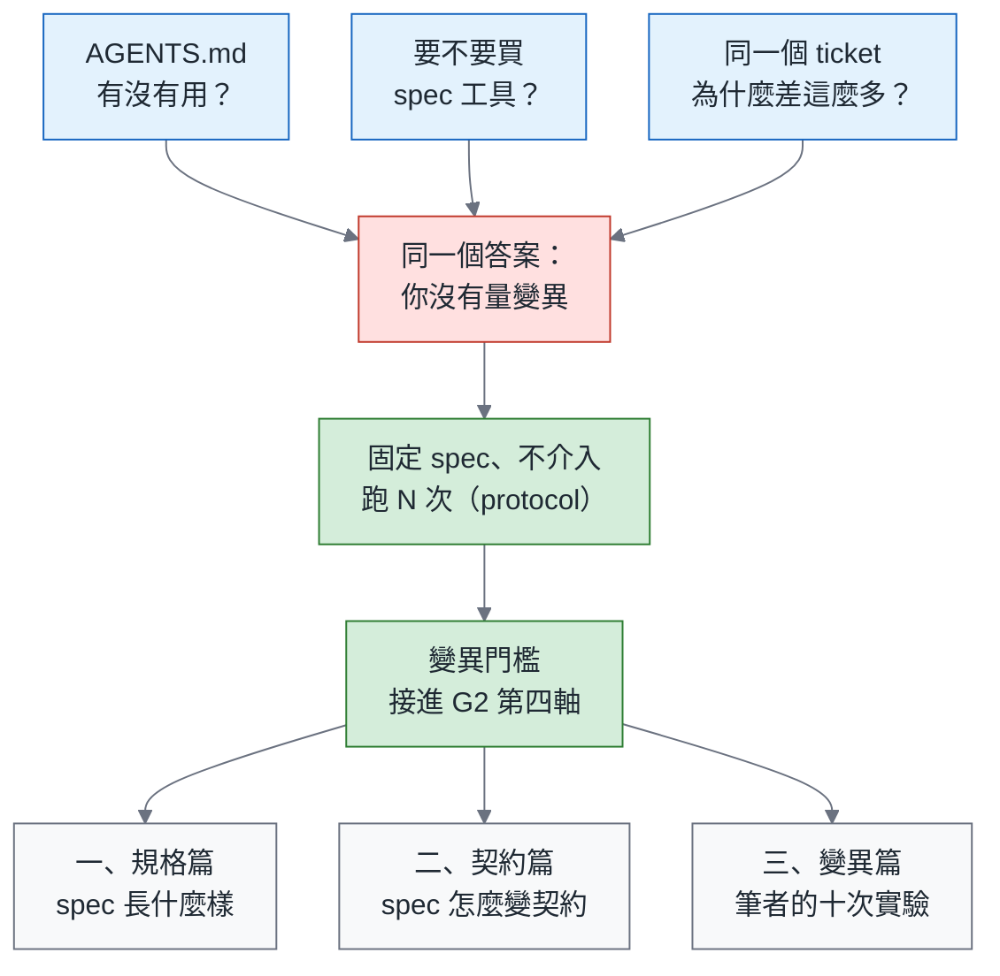
```mermaid
---
config:
  theme: base
  themeVariables:
    fontSize: 16px
    primaryColor: "#f8f9fa"
    primaryTextColor: "#1f2933"
    primaryBorderColor: "#6b7280"
    lineColor: "#6b7280"
    secondaryColor: "#f8f9fa"
    tertiaryColor: "#ffffff"
    clusterBkg: "#ffffff"
    clusterBorder: "#9ca3af"
    edgeLabelBackground: "#ffffff"
  flowchart:
    nodeSpacing: 36
    rankSpacing: 44
    padding: 12
    htmlLabels: true
    subGraphTitleMargin:
      top: 8
      bottom: 12
    curve: basis
---
flowchart TB
    classDef own fill:#d4edda,stroke:#2e7d32,color:#1f2933
    classDef buy fill:#fff3cd,stroke:#b8860b,color:#1f2933
    classDef bad fill:#ffe0e0,stroke:#c0392b,color:#1f2933
    classDef human fill:#e3f2fd,stroke:#1565c0,color:#1f2933
    Q1["AGENTS.md<br/>有沒有用？"] --> ANS["同一個答案：<br/>你沒有量變異"]
    Q2["要不要買<br/>spec 工具？"] --> ANS
    Q3["同一個 ticket<br/>為什麼差這麼多？"] --> ANS
    ANS --> P["固定 spec、不介入<br/>跑 N 次（protocol）"]
    P --> G["變異門檻<br/>接進 G2 第四軸"]
    G --> S1["一、規格篇<br/>spec 長什麼樣"]
    G --> S2["二、契約篇<br/>spec 怎麼變契約"]
    G --> S3["三、變異篇<br/>筆者的十次實驗"]
    class Q1,Q2,Q3 human
    class ANS bad
    class P,G own
```

**F2 圖說**：Kahneman 的 noise audit 與 N-run 實驗逐項對映—法官是一套 harness 組態，一次判決是一次 run。

| 《雜訊》 | N-run | 說明 |
|---|---|---|
| 案件 | spec | 同一份、凍結 |
| 法官 | harness 組態（model + harness 版本 + AGENTS.md / skills） | A / B / C 是三位法官 |
| 一次判決 | 一次 run | 每位法官判 N 次 |
| 離散度 | 結構相似度 | 主指標 |
| bias | pass rate | 對錯那一軸 |
| level / pattern / occasion noise | 組態間差 / 組態 × 任務類型 / run-to-run 差 | 本主題量 occasion noise |

**F3 圖說**：三個名詞各一層—左邊是本系列的定義、右邊對照 Teddy 的用法—本系列站在「規格」層（Spec-anchored），契約是它可執行的子集；把 How 切成規格與契約前後半是本系列的切分，不是 Teddy 的。

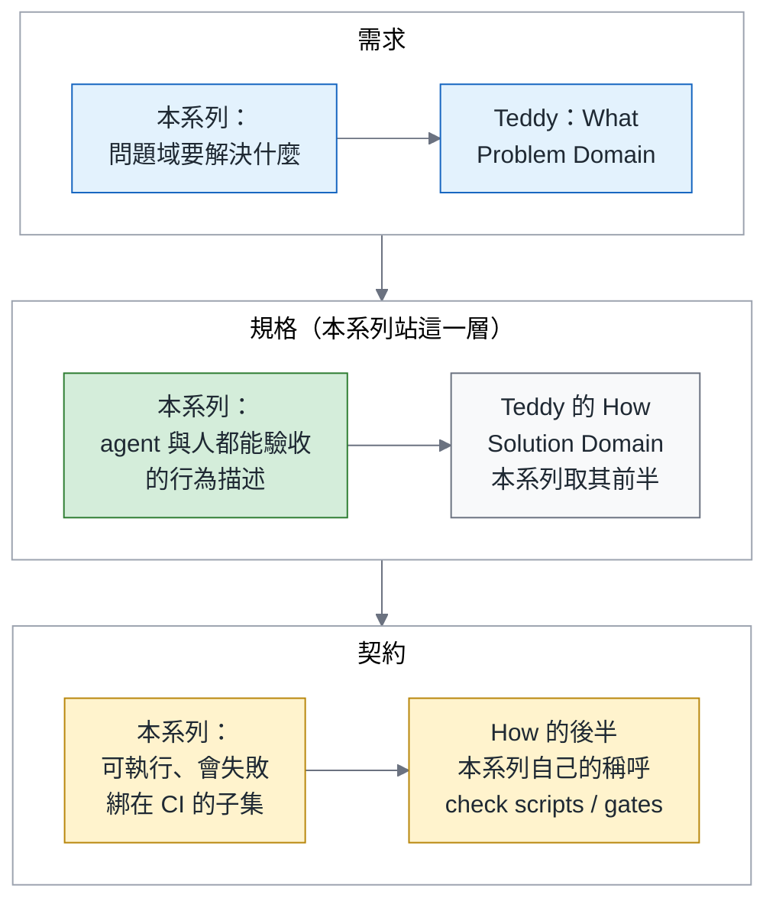
```mermaid
---
config:
  theme: base
  themeVariables:
    fontSize: 16px
    primaryColor: "#f8f9fa"
    primaryTextColor: "#1f2933"
    primaryBorderColor: "#6b7280"
    lineColor: "#6b7280"
    secondaryColor: "#f8f9fa"
    tertiaryColor: "#ffffff"
    clusterBkg: "#ffffff"
    clusterBorder: "#9ca3af"
    edgeLabelBackground: "#ffffff"
  flowchart:
    nodeSpacing: 36
    rankSpacing: 44
    padding: 12
    htmlLabels: true
    subGraphTitleMargin:
      top: 8
      bottom: 12
    curve: basis
---
flowchart TB
    classDef own fill:#d4edda,stroke:#2e7d32,color:#1f2933
    classDef buy fill:#fff3cd,stroke:#b8860b,color:#1f2933
    classDef bad fill:#ffe0e0,stroke:#c0392b,color:#1f2933
    classDef human fill:#e3f2fd,stroke:#1565c0,color:#1f2933
    subgraph r["需求"]
        direction LR
        R1["本系列：<br/>問題域要解決什麼"] --> R2["Teddy：What<br/>Problem Domain"]
    end
    subgraph s["規格（本系列站這一層）"]
        direction LR
        S1["本系列：<br/>agent 與人都能驗收<br/>的行為描述"] --> S2["Teddy 的 How<br/>Solution Domain<br/>本系列取其前半"]
    end
    subgraph c["契約"]
        direction LR
        C1["本系列：<br/>可執行、會失敗<br/>綁在 CI 的子集"] --> C2["How 的後半<br/>本系列自己的稱呼<br/>check scripts / gates"]
    end
    r --> s --> c
    class R1,R2 human
    class S1 own
    class C1,C2 buy
```

**F4 圖說**：run-to-run 變異只有一個源頭（sampling，Teddy 的 Form，改不了），loop 裡的三個機制放大或衰減它（Context，能改）；下層的組態敏感度是另一種差異，12 月才講。

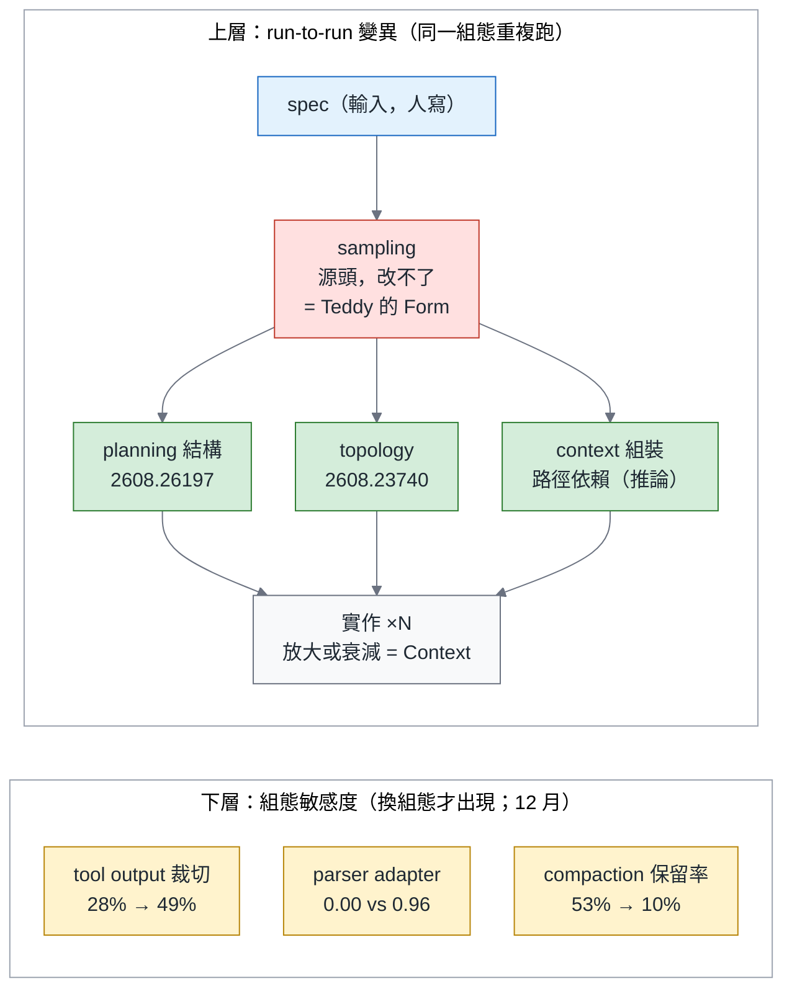
```mermaid
---
config:
  theme: base
  themeVariables:
    fontSize: 16px
    primaryColor: "#f8f9fa"
    primaryTextColor: "#1f2933"
    primaryBorderColor: "#6b7280"
    lineColor: "#6b7280"
    secondaryColor: "#f8f9fa"
    tertiaryColor: "#ffffff"
    clusterBkg: "#ffffff"
    clusterBorder: "#9ca3af"
    edgeLabelBackground: "#ffffff"
  flowchart:
    nodeSpacing: 36
    rankSpacing: 44
    padding: 12
    htmlLabels: true
    subGraphTitleMargin:
      top: 8
      bottom: 12
    curve: basis
---
flowchart TB
    classDef own fill:#d4edda,stroke:#2e7d32,color:#1f2933
    classDef buy fill:#fff3cd,stroke:#b8860b,color:#1f2933
    classDef bad fill:#ffe0e0,stroke:#c0392b,color:#1f2933
    classDef human fill:#e3f2fd,stroke:#1565c0,color:#1f2933
    subgraph up["上層：run-to-run 變異（同一組態重複跑）"]
        direction TB
        SP["spec（輸入，人寫）"] --> SA["sampling<br/>源頭，改不了<br/>= Teddy 的 Form"]
        SA --> P["planning 結構<br/>2608.26197"]
        SA --> T["topology<br/>2608.23740"]
        SA --> C["context 組裝<br/>路徑依賴（推論）"]
        P --> N["實作 ×N<br/>放大或衰減 = Context"]
        T --> N
        C --> N
    end
    subgraph low["下層：組態敏感度（換組態才出現；12 月）"]
        direction TB
        L1["tool output 裁切<br/>28% → 49%"]
        L2["parser adapter<br/>0.00 vs 0.96"]
        L3["compaction 保留率<br/>53% → 10%"]
    end
    up ~~~ low
    class SP human
    class SA bad
    class P,T,C own
    class L1,L2,L3 buy
```

**F6 圖說**：三支槓桿各動哪一軸—格內只有方向與一個短語，出處在表下註腳 [a]–[g]；實測格填 10 月的差值，沒有待填格。

（T1 表 5 欄與註腳見第五節末段。）

**F7 圖說**：N-run protocol 的兩側—左邊產生 N 個 branch，右邊依 run.sh 的順序量：測試通過率、約束違規、AST 相似度，最後盲審 review minutes 與門檻。

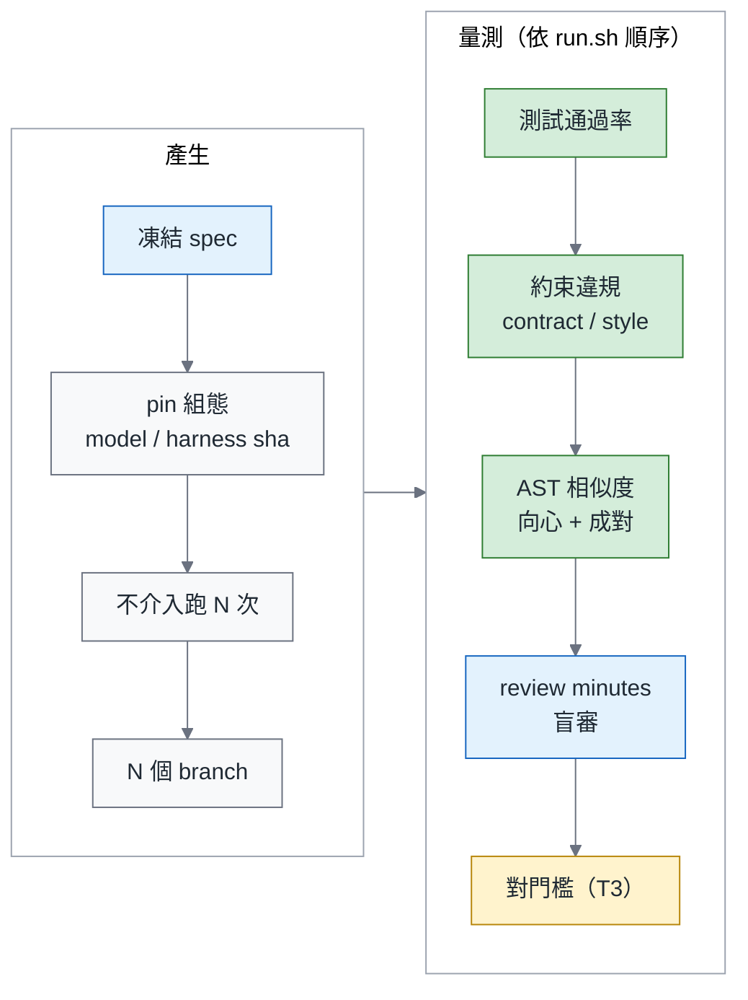
```mermaid
---
config:
  theme: base
  themeVariables:
    fontSize: 16px
    primaryColor: "#f8f9fa"
    primaryTextColor: "#1f2933"
    primaryBorderColor: "#6b7280"
    lineColor: "#6b7280"
    secondaryColor: "#f8f9fa"
    tertiaryColor: "#ffffff"
    clusterBkg: "#ffffff"
    clusterBorder: "#9ca3af"
    edgeLabelBackground: "#ffffff"
  flowchart:
    nodeSpacing: 36
    rankSpacing: 44
    padding: 12
    htmlLabels: true
    subGraphTitleMargin:
      top: 8
      bottom: 12
    curve: basis
---
flowchart LR
    classDef own fill:#d4edda,stroke:#2e7d32,color:#1f2933
    classDef buy fill:#fff3cd,stroke:#b8860b,color:#1f2933
    classDef bad fill:#ffe0e0,stroke:#c0392b,color:#1f2933
    classDef human fill:#e3f2fd,stroke:#1565c0,color:#1f2933
    subgraph gen["產生"]
        direction TB
        G1["凍結 spec"] --> G2["pin 組態<br/>model / harness sha"]
        G2 --> G3["不介入跑 N 次"]
        G3 --> G4["N 個 branch"]
    end
    subgraph ver["量測（依 run.sh 順序）"]
        direction TB
        M1["測試通過率"] --> M2["約束違規<br/>contract / style"]
        M2 --> M3["AST 相似度<br/>向心 + 成對"]
        M3 --> M4["review minutes<br/>盲審"]
        M4 --> M5["對門檻（T3）"]
    end
    gen --> ver
    class G1 human
    class M1,M2,M3 own
    class M4 human
    class M5 buy
```

**F8 圖說**：pass rate 與變異是兩個獨立的軸—左上才准擴權；左下「穩定地錯」最危險，因為看起來很專業。

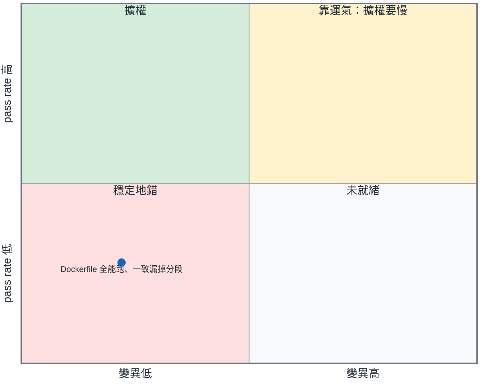
```mermaid
---
config:
  theme: base
  themeVariables:
    fontSize: 16px
    primaryTextColor: "#1f2933"
    quadrant1Fill: "#fff3cd"
    quadrant2Fill: "#d4edda"
    quadrant3Fill: "#ffe0e0"
    quadrant4Fill: "#f8f9fa"
    quadrant1TextFill: "#1f2933"
    quadrant2TextFill: "#1f2933"
    quadrant3TextFill: "#1f2933"
    quadrant4TextFill: "#1f2933"
    quadrantPointFill: "#1565c0"
    quadrantPointTextFill: "#1f2933"
    quadrantXAxisTextFill: "#1f2933"
    quadrantYAxisTextFill: "#1f2933"
    quadrantInternalBorderStrokeFill: "#9ca3af"
    quadrantExternalBorderStrokeFill: "#6b7280"
  quadrantChart:
    chartWidth: 700
    chartHeight: 560
    quadrantLabelFontSize: 16
    quadrantPointLabelFontSize: 16
    xAxisLabelFontSize: 16
    yAxisLabelFontSize: 16
    pointRadius: 6
---
quadrantChart
    x-axis "變異低" --> "變異高"
    y-axis "pass rate 低" --> "pass rate 高"
    quadrant-1 "靠運氣：擴權要慢"
    quadrant-2 "擴權"
    quadrant-3 "穩定地錯"
    quadrant-4 "未就緒"
    "Dockerfile 全能跑、一致漏掉分段": [0.22, 0.28]
```

**F9 圖說**：G2 只多一條—四個條件全部在綠或黃才放行到全員 + write tools；紅燈加跑到 N=30 仍紅，就回頭修 harness。

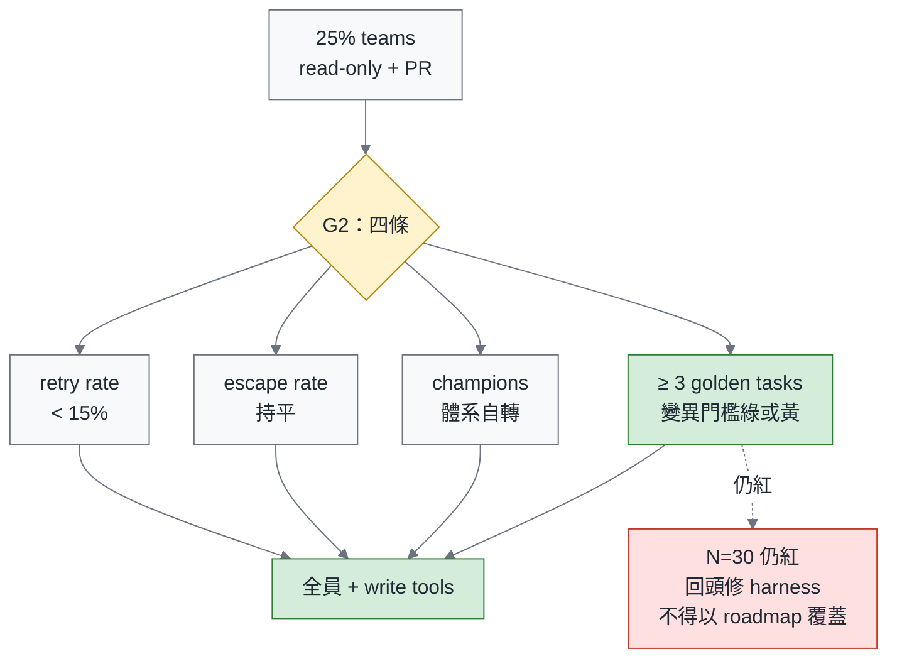
```mermaid
---
config:
  theme: base
  themeVariables:
    fontSize: 16px
    primaryColor: "#f8f9fa"
    primaryTextColor: "#1f2933"
    primaryBorderColor: "#6b7280"
    lineColor: "#6b7280"
    secondaryColor: "#f8f9fa"
    tertiaryColor: "#ffffff"
    clusterBkg: "#ffffff"
    clusterBorder: "#9ca3af"
    edgeLabelBackground: "#ffffff"
  flowchart:
    nodeSpacing: 36
    rankSpacing: 44
    padding: 12
    htmlLabels: true
    subGraphTitleMargin:
      top: 8
      bottom: 12
    curve: basis
---
flowchart TB
    classDef own fill:#d4edda,stroke:#2e7d32,color:#1f2933
    classDef buy fill:#fff3cd,stroke:#b8860b,color:#1f2933
    classDef bad fill:#ffe0e0,stroke:#c0392b,color:#1f2933
    classDef human fill:#e3f2fd,stroke:#1565c0,color:#1f2933
    S["25% teams<br/>read-only + PR"] --> G{"G2：四條"}
    G --> C1["retry rate<br/>< 15%"]
    G --> C2["escape rate<br/>持平"]
    G --> C3["champions<br/>體系自轉"]
    G --> C4["≥ 3 golden tasks<br/>變異門檻綠或黃"]
    C1 --> Y["全員 + write tools"]
    C2 --> Y
    C3 --> Y
    C4 --> Y
    C4 -.->|仍紅| R["N=30 仍紅<br/>回頭修 harness<br/>不得以 roadmap 覆蓋"]
    class G buy
    class C4 own
    class Y own
    class R bad
```

**F10 圖說**：三種文件各管一件事—這次要什麼、在這個 repo 怎麼做事、當初為什麼—owner、壽命與 enforcement 都不同。

（T2 表，欄見第八節。）

### References（只列摘要裡有的來源；格式同已發布文章 `N. 來源 — [標題](url)`；自己的文章放「系列文章」不放這裡。1–3 的 URL 與同意依第 3 節第 3、4 點取得後填入方括號後的 `(url)`，條目本身不再帶計畫註記）

1. 搞笑談軟工 — Teddy Chen，[「輸入相同的規格，不需要人為介入，既可重複產生幾乎相同的程式實作嗎？」]()（2026 夏）
2. Teddy Chen — [馴服 AI 寫出可維護的系統：模式語言驅動開發工作坊，學員手冊 v1.0]()（2026-08）
3. DDDesign Taiwan — Kim Kao，[用多 agent 從 legacy codebase 抽 bounded context，每次數量不同]()（2026）
4. 天下文化 — 《雜訊：人類判斷的缺陷》（Kahneman, Sibony, Sunstein）
5. arXiv — [Harness Engineering for Predictable Agentic Systems](https://arxiv.org/abs/2608.26197)
6. arXiv — [Can your AI agent be cheaper? Task specifications and token spend](https://arxiv.org/abs/2608.25399)
7. arXiv — [Coordination Mode as the First-Class Citizen (MSEval)](https://arxiv.org/abs/2607.27877)
8. arXiv — [AgentRoom: concurrent multi-agent coding in a CRDT-backed shared workspace](https://arxiv.org/abs/2608.23740)
9. arXiv — [Same Model, Different Harness: Different Coding-Agent Results](https://arxiv.org/abs/2608.26218)
10. arXiv — [Interface-Induced Trajectory Censoring](https://arxiv.org/abs/2609.03966)
11. arXiv — [The Compaction Cliff in Long-Running AI Agent Memory](https://arxiv.org/abs/2608.22752)
12. arXiv — [Update from Hell: can coding agents survive hidden breakage in dependency upgrades? (DEPBENCH)](https://arxiv.org/abs/2608.30300)
13. arXiv — [BC-Bench](https://arxiv.org/abs/2608.20851)
14. arXiv — [The Specification Paradox](https://arxiv.org/abs/2608.16618)
15. arXiv — [Requirements After the First Edit](https://arxiv.org/abs/2609.03028)
16. arXiv — [Specification Portability Across LLM Development Agents](https://arxiv.org/abs/2608.21208)
17. arXiv — [Do Context Files Help Coding Agents?](https://arxiv.org/abs/2607.27250)
18. arXiv — [Probe-and-Refine Tuning of Repository Guidance for Coding Agents](https://arxiv.org/abs/2606.20512)
19. arXiv — [A Few Pages of Markdown: committed AI configuration and quality cost (RAMP)](https://arxiv.org/abs/2608.25241)
20. arXiv — [Signal or Noise? A benchmark study of agent skills in web development](https://arxiv.org/abs/2608.23067)
21. arXiv — [Repo2Skill-Evo: repository skills go stale in silence](https://arxiv.org/abs/2608.21964)
22. arXiv — [Why Does CLAUDE.md Keep Growing?](https://arxiv.org/abs/2608.11095)
23. arXiv — [When "Do Not" Is Not Deny: security rules in CLAUDE.md vs built-in controls](https://arxiv.org/abs/2608.23550)
24. arXiv — [Specification-Driven DevOps for multi-service environments](https://arxiv.org/abs/2607.25141)
25. @unclebobmartin — [negative test experiment repo](https://x.com/unclebobmartin/status/2089449442089025936)
26. @trq212 — [We removed ~80% of the Claude Code system prompt](https://x.com/trq212/status/2080710971228918066)
27. @AYi_AInotes — [Vercel engineer's AGENTS.md after 60B tokens, 8 rules](https://x.com/AYi_AInotes/status/2084522269745820010)
28. @AntonyMarcano — [Are you over-specifying your agent skills?](https://x.com/AntonyMarcano/status/2095602199095058772)
29. @wquguru — [one-shot reference beats skills; has Fable 5.1 internalised them?](https://x.com/wquguru/status/2095448768263127123)

---

## 2. 三部曲 outlines

### 一、規格篇：寫一份 agent 與人都能驗收的 spec

**TL;DR（草稿，約 350–400 字）**

> **TL;DR** — 總論說 spec 這支槓桿調的是成本與誤讀—那它該怎麼寫才把這兩件事調到位？先用 Teddy 的「需求是 What、規格是 How」把名詞釘住，再看 agent 實際上讀什麼：instruction files 與 working notes 佔文件互動 60.5%，API 文件 1.3%—所以 spec 要放在 agent 會自己去讀的位置。spec 該厚在哪裡：2,700 次 run 說 bare user story 比完整 spec 多花 29.7% token，但厚度真正的成本是寫 spec 的人時，只有會被誤讀的段落值得厚。需求總是在第一次實作之後才到、事先警告無效（3,553 個 session），所以 spec 要為「晚到」設計。文末給 spec 模板（營運篇 `payment-timeout-fix` 同一個案例）與 `spec-lint` 的 CI 規則節錄。

**系列導覽**：總論 → **一、規格篇（本篇）** → 二、契約篇 → 三、變異篇

**章節（7 節；原 §一、§二合併，篇幅讓給 §二「agent 讀什麼」與 §四「需求晚到」）**

一、需求是 What、規格是 How—BDD 是溝通，不是工具（只留三件新東西）
- 一段 recap 總論 §三的名詞：需求 / 規格 / 契約，與 Teddy 的 What / How 對照；本篇寫的是「規格」這一層。Dan North、3C、四色卡對這群讀者是 2010 年代常識，不重講；只留三件新東西：
- **新東西一—Teddy 的 What / How 對照**：需求 = Problem Domain on Real World、規格 = Solution Domain on Machine Runtime（Michael Jackson Problem Frames）。
- **新東西二—3C 裡 Confirmation 是 agent 讀的那一段**：Card 與 Conversation 仍是人的；Confirmation（example）是 agent 能讀、能驗收的部分。Dan North 的「BDD 的本質是溝通，不是寫 Feature 檔」經 DavidKo 轉貼（Scrum Community，8 反應）—標「轉引」，不寫成原文引用。
- **新東西三—紅卡只能由人回答**：Example Mapping 的四色卡（經 Blazej Drobniuch 的 Autodesk 案例轉引—他把 Example Mapping 錄音餵給 Claude Code 起草 Gherkin，觀察是「沒人會對 AI 的初稿執著，團隊終於願意放手討論」，Scrum Community in Taiwan 轉貼，8 反應 / 2 分享，只當例子不當證據）：黃 story、藍 rule、綠 example 都能餵 agent，紅卡（問題）只能由人回答。初稿便宜，討論才是產出。
- 反模式 3「Gherkin 工廠」：規格數量不是品質；四十條 Gherkin 裡有幾條是 red card 變出來的，才是品質。社群那句「AI 幫你寫了四十條 Gherkin，然後呢—它不知道三年前為某大客戶開的例外規則」（Scrum Community，7 反應，作者待查）當一句話的例子；2605.18461 的結論正是「spec 品質與制度知識是綁定限制，不是 model 能力」。
- 筆者的第一手材料一句：2025 學習預算裡的「規格驅動開發實戰」課；LeSS in Action 的 A-TDD / SBE 訓練壓成一行—「設計 example 的重要性：避免負面導向的 assertion」—其餘連到 10 月測試篇。
- 圖 P1-1（見圖表）。

二、agent 讀得懂的 spec 長什麼樣
- 解剖六段：目標與非目標、AC（以 example 寫）、約束（非功能、禁區與邊界—「不能碰哪裡」寫成 C-1「不得修改 `legacy/`」那種帶 `check:` 的禁區，agent 可驗收，所以不另立一段）、驗證方式（跑什麼指令算過）、開放問題（明說不知道）、來源（issue / incident id，進 front-matter 的 `source:`）。與 §六 模板的五個標題 + front-matter 一一對應。
- agent 實際讀什麼：2608.20195—557 sessions / 33,097 PRs，instruction files 與 working notes 佔文件互動 60.5%，傳統文件 10.6%，API reference 1.3%，70.2% 是自發查閱—所以 spec 要放在 agent 會自己去讀的位置（task 檔、working notes），不是 wiki。**這是本篇的主鉤子與 FB hook。**
- Before/After：Before 是 Jira ticket 一句話「結帳偶發 504，請修」；After 是六段模板填好的版本（營運篇 `payment-timeout-fix` 同一個案例、同一個 Go repo，`internal/db/pool.go`，讀者可對照）。
- 圖 P1-2（見圖表）。

三、厚度的迷思：spec 該厚在哪裡（2608.25399 唯一完整講的地方）
- 2608.25399 細讀（總論只給了一句）：2,700 runs、Kimi K3、三種 effort；full spec vs bare user story，token +29.7%（反算完整 spec 省約 23%），per-task 敏感度 13–115%，cheap probe 預估成本在 36% 內。**「run-to-run variance unchanged」那句依全文判定：若量的是 token 花費的變異，就寫成「厚度不改變成本的離散度」；若量的是輸出變異，才寫「厚度不動變異」並回頭改總論 §五**（第 3 節第 2 點決定）。輸出結構的變異，本系列 A0 組直接量—結果在變異篇 §五，本節只給連結。
- **厚度的真正成本是寫 spec 的人時，不是 token**：省 23% token 在一次幾美元的 run 上是幾十美分，寫半小時 spec 是幾十美元。比較基準是誤讀之後重做的成本（2609.03028 的 invalidation ×2），不是 29.7%。判準：只有會被誤讀的段落值得厚—example 與約束（每一條都對應一種可能的誤讀）；背景敘述與架構介紹每多一段都是純成本（技術篇「寫錯了：描述現況」的同一個病）。
- 2608.16618 的 paradox 在這裡收：生成越強越依賴 spec 的正確與完整—完整是必要條件，但有天花板，所以下一節。
- 反模式 2「把加厚規格當變異處方」在這裡點名：沒量變異軸就開處方。
- 表 P1-T1「厚 vs 薄，逐段」：六段各一行，標「厚有效 / 厚無效 / 厚有害」與理由（成本與誤讀軸；成本欄寫人時，不寫 token）。

四、需求總是晚到：為「晚到」設計 spec
- 2609.03028：3,553 個 SWE-chat session，第一次實作之後才到的需求造成約 2 倍的 code invalidation，負擔在 session 內不會下降，事先警告無效。
- 設計含意三條：story 切更小（社群一句話例子：「AI 一次動二十個檔案，沒人說得出哪個決定壞了」，Scrum Community，14 反應，作者待查）；spec 有版本、有 `supersedes:`；晚到的需求走「改 spec、重跑」而不是「在對話裡補一句」—而重跑要便宜且低變異，這正是變異篇的動機。
- 2607.09900 AfterVibe：從 vibe session 反推出 spec（regeneration validation 5.06/6），spec 當主要 review artefact—晚到的需求至少要被寫回 spec。
- 圖 P1-3（見圖表）。

五、對人與對 agent 的雙重驗收（含去技能化一段）
- Spec review 是人保住理解的地方：一句話例子「RD 兩小時做完，PM 兩週後才發現做錯」（Scrum Community / Agile 內湖，13 反應，作者待查）—錯在 spec 沒人審，不在 agent。
- 一段（只一段）談去技能化：Teddy Day 1 的開場—spec 是人保住設計知識主權的地方；2608.30572 學生在 SDD 下產量上升、理解下降、講師驗證必要—雙重驗收就是讓「驗證」不靠講師（2608.30572 只在本篇出現，契約篇不再引）。
- Spec review checklist（表 P1-T2）：每條 AC 有 example 且 example 對應一種誤讀？每條約束有對應檢查或標 `unenforced`？開放問題是空的還是真的沒有？非目標寫了嗎？誰是這份 spec 的 owner？（「example 是否真的對應一種誤讀」是語意判斷，留在這張人審 checklist，不進 `spec-lint`。）
- 一句接契約篇：checklist 上「有對應檢查」那一欄，就是契約。

六、Reference implementation：spec 模板與 `spec-lint`（節錄）
- 模板（markdown + front-matter；`payment-timeout-fix`，Go repo）：

```markdown
---
id: payment-timeout-fix
source: incident-2026-04-18
owner: @payments-team
version: 2            # supersedes: 1
frozen: true          # N-run 期間不得修改
implemented_by:       # `make refs` 讀這兩欄產生 build/refs.json（契約篇）
  - internal/db/pool.go
verified_by:
  - contracts/payment-timeout-fix/pool_contract_test.go
---
## 目標 / 非目標
## 驗收條件（每條附 example）
- AC-1: Given 連線池滿載 When 結帳 Then 回 503 並附 retry-after（不是 504）
## 約束（非功能、禁區與邊界）
- C-1: 不得修改 `legacy/`                      → check: scripts/check-boundaries.sh
- C-2: 新增 handler 走 internal/api/ pattern   → check: scripts/check-handler-pattern.sh
## 驗證方式
- `go test ./internal/db/... ./contracts/payment-timeout-fix/...`
## 開放問題
- 池上限要不要可設定？（owner 決定，agent 不得自行決定）
```

- `spec-lint`（**節錄的 pseudo-config，與已發布文章的 snippet 同一個等級，不承諾可直接執行**；全部是語法可判的規則）：每條 AC 條目必須同時含 `Given` / `When` / `Then` 三個關鍵字，或含一個 `example:` 子區塊；每條約束必須有 `check:`，值是可執行路徑或字面 `unenforced`，`unenforced` 在 PR 上貼 label；`frozen: true` 的 spec 被修改時 PR 直接擋；`implemented_by:` / `verified_by:` 的路徑必須存在。語意層（這個 example 是否真的擋住一種誤讀）不 lint，留給 P1-T2 的人審。
- Before/After：Before 是沒有 `check:` 欄位的約束清單（願望）；After 是每條約束後面接一個腳本路徑（契約）。

七、結語
- spec 是契約的人類可讀版；下一篇把它變成機器可執行版。
- 引言區：

> **spec 是契約的人類可讀版；契約是 spec 的機器可執行版。**

- 尾段：系列文章（本篇粗體）→ References → AI 協作說明（固定段）→ 簽名行。

**圖表（5 張）**

| 編號 | 名稱 | 種類 | 預期尺寸 |
|---|---|---|---|
| P1-1 | Example Mapping 四色卡 → agent 輸入 | flowchart LR 兩欄 subgraph | 8 節點、約 560×520、高／寬 0.9 |
| P1-2 | spec 六段：人決定的 vs agent 驗收的 | flowchart LR 兩欄 subgraph | 6 節點、實測 546×459、高／寬 0.84 |
| P1-3 | 晚到需求的兩條路 | flowchart LR 兩欄 subgraph | 6 節點、約 560×360、高／寬 0.65 |
| P1-T1 | 厚 vs 薄，逐段 | 表格轉 PNG | 6 列 × 4 欄 |
| P1-T2 | spec review checklist | 表格轉 PNG | 5 列 × 2 欄 |

**P1-1 圖說**：Example Mapping 的四張卡裡，三張能餵給 agent 起草，紅卡（問題）只能由人回答—人答完再寫回 spec。（卡片不上色，只以文字標卡片類型，避免與四種語意色打架。）

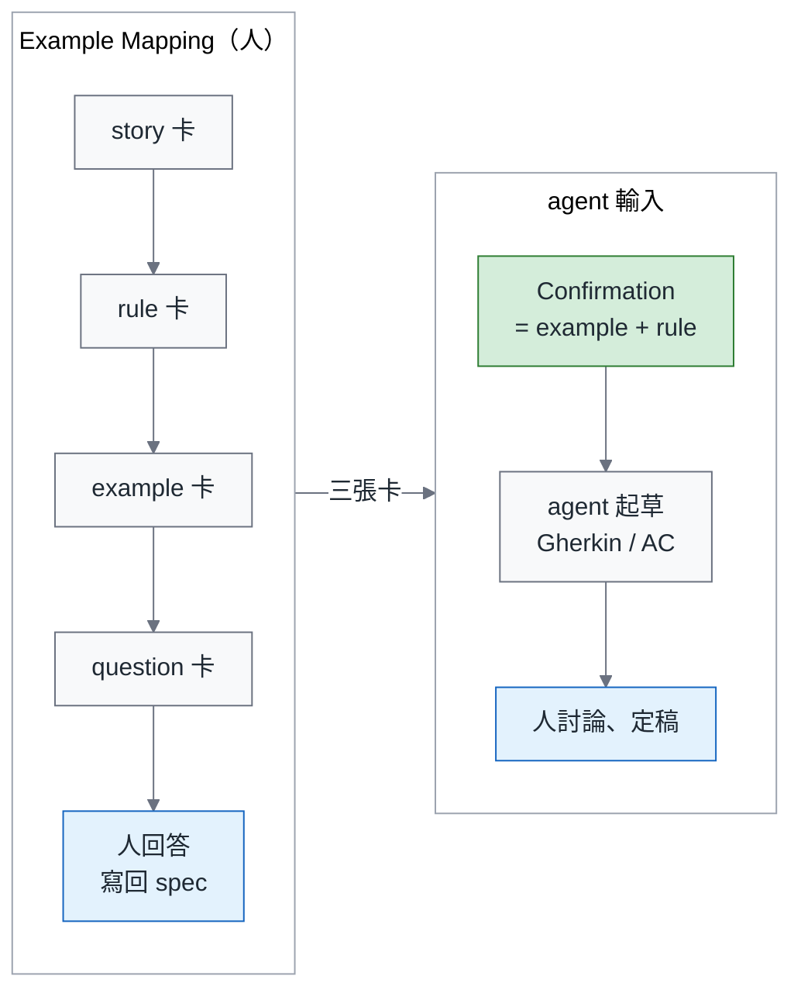
```mermaid
---
config:
  theme: base
  themeVariables:
    fontSize: 16px
    primaryColor: "#f8f9fa"
    primaryTextColor: "#1f2933"
    primaryBorderColor: "#6b7280"
    lineColor: "#6b7280"
    secondaryColor: "#f8f9fa"
    tertiaryColor: "#ffffff"
    clusterBkg: "#ffffff"
    clusterBorder: "#9ca3af"
    edgeLabelBackground: "#ffffff"
  flowchart:
    nodeSpacing: 36
    rankSpacing: 44
    padding: 12
    htmlLabels: true
    subGraphTitleMargin:
      top: 8
      bottom: 12
    curve: basis
---
flowchart LR
    classDef own fill:#d4edda,stroke:#2e7d32,color:#1f2933
    classDef buy fill:#fff3cd,stroke:#b8860b,color:#1f2933
    classDef bad fill:#ffe0e0,stroke:#c0392b,color:#1f2933
    classDef human fill:#e3f2fd,stroke:#1565c0,color:#1f2933
    subgraph em["Example Mapping（人）"]
        direction TB
        K1["story 卡"] --> K2["rule 卡"]
        K2 --> K3["example 卡"]
        K3 --> K4["question 卡"]
        K4 --> K5["人回答<br/>寫回 spec"]
    end
    subgraph ag["agent 輸入"]
        direction TB
        A1["Confirmation<br/>= example + rule"] --> A2["agent 起草<br/>Gherkin / AC"]
        A2 --> A3["人討論、定稿"]
    end
    em -->|三張卡| ag
    class K5,A3 human
    class A1 own
```

**P1-2 圖說**：六段裡三段是人決定的、三段是 agent 驗收用的—右邊那三段就是契約篇的輸入；邊界併在約束裡，寫成帶 check 的禁區。（六段不是流程，不畫成一條線。）

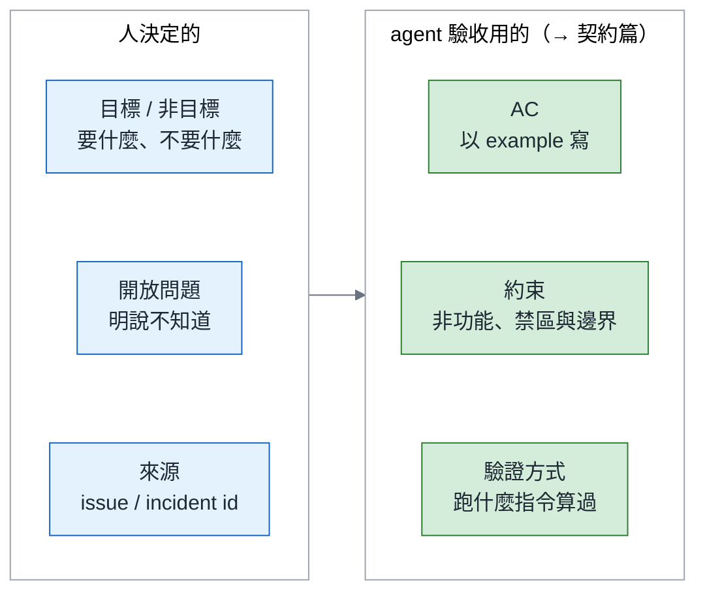
```mermaid
---
config:
  theme: base
  themeVariables:
    fontSize: 16px
    primaryColor: "#f8f9fa"
    primaryTextColor: "#1f2933"
    primaryBorderColor: "#6b7280"
    lineColor: "#6b7280"
    secondaryColor: "#f8f9fa"
    tertiaryColor: "#ffffff"
    clusterBkg: "#ffffff"
    clusterBorder: "#9ca3af"
    edgeLabelBackground: "#ffffff"
  flowchart:
    nodeSpacing: 36
    rankSpacing: 44
    padding: 12
    htmlLabels: true
    subGraphTitleMargin:
      top: 8
      bottom: 12
    curve: basis
---
flowchart LR
    classDef own fill:#d4edda,stroke:#2e7d32,color:#1f2933
    classDef buy fill:#fff3cd,stroke:#b8860b,color:#1f2933
    classDef bad fill:#ffe0e0,stroke:#c0392b,color:#1f2933
    classDef human fill:#e3f2fd,stroke:#1565c0,color:#1f2933
    subgraph h["人決定的"]
        direction TB
        H1["目標 / 非目標<br/>要什麼、不要什麼"] ~~~ H2["開放問題<br/>明說不知道"]
        H2 ~~~ H3["來源<br/>issue / incident id"]
    end
    subgraph m["agent 驗收用的（→ 契約篇）"]
        direction TB
        M1["AC<br/>以 example 寫"] ~~~ M2["約束<br/>非功能、禁區與邊界"]
        M2 ~~~ M3["驗證方式<br/>跑什麼指令算過"]
    end
    h --> m
    class H1,H2,H3 human
    class M1,M2,M3 own
```

**P1-3 圖說**：晚到的需求有兩條路—在對話裡補一句（無紀錄、invalidation 兩倍）或改 spec 重跑（可 diff、可重現）；後者成立的前提是重跑便宜且低變異。

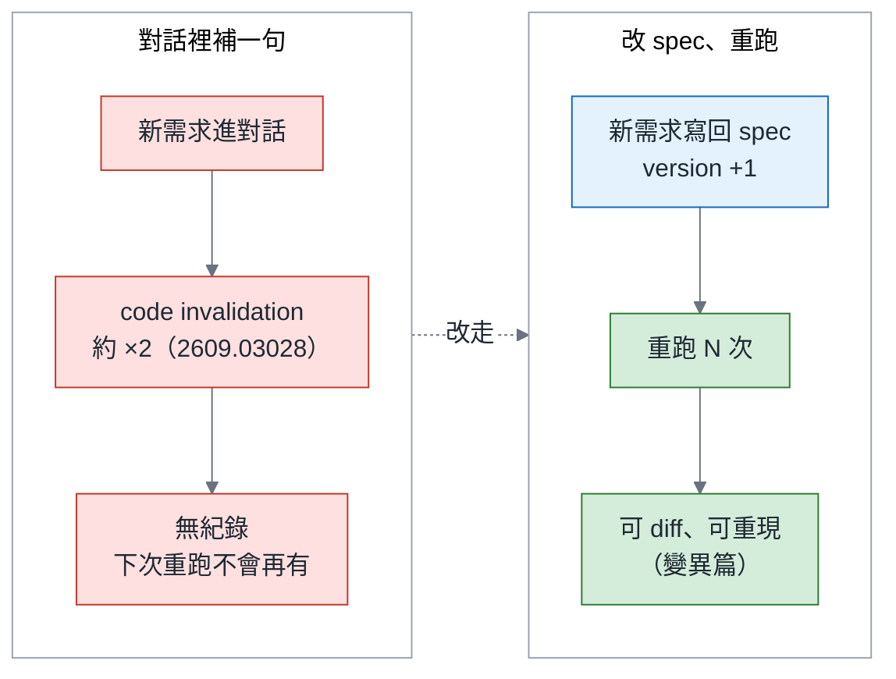
```mermaid
---
config:
  theme: base
  themeVariables:
    fontSize: 16px
    primaryColor: "#f8f9fa"
    primaryTextColor: "#1f2933"
    primaryBorderColor: "#6b7280"
    lineColor: "#6b7280"
    secondaryColor: "#f8f9fa"
    tertiaryColor: "#ffffff"
    clusterBkg: "#ffffff"
    clusterBorder: "#9ca3af"
    edgeLabelBackground: "#ffffff"
  flowchart:
    nodeSpacing: 36
    rankSpacing: 44
    padding: 12
    htmlLabels: true
    subGraphTitleMargin:
      top: 8
      bottom: 12
    curve: basis
---
flowchart LR
    classDef own fill:#d4edda,stroke:#2e7d32,color:#1f2933
    classDef buy fill:#fff3cd,stroke:#b8860b,color:#1f2933
    classDef bad fill:#ffe0e0,stroke:#c0392b,color:#1f2933
    classDef human fill:#e3f2fd,stroke:#1565c0,color:#1f2933
    subgraph chat["對話裡補一句"]
        direction TB
        B1["新需求進對話"] --> B2["code invalidation<br/>約 ×2（2609.03028）"]
        B2 --> B3["無紀錄<br/>下次重跑不會再有"]
    end
    subgraph spec["改 spec、重跑"]
        direction TB
        G1["新需求寫回 spec<br/>version +1"] --> G2["重跑 N 次"]
        G2 --> G3["可 diff、可重現<br/>（變異篇）"]
    end
    chat -.->|改走| spec
    class B1,B2,B3 bad
    class G1 human
    class G2,G3 own
```

**P1-T1 圖說**：六段各自厚有效、厚無效、厚有害—成本欄寫人時。

**P1-T2 圖說**：spec 人審 checklist：五個問題。

**References**（只列 digest 內有的來源；Dan North 與 Matt Wynne 的原文不在五份摘要裡，經轉貼引用並標「轉引」）：Dan North「BDD 的本質是溝通」（DavidKo 轉貼，Scrum Community in Taiwan，轉引）；Example Mapping（Blazej Drobniuch 的 Autodesk 案例貼文，Scrum Community in Taiwan 轉貼，URL 待補，只當案例不當需求證據）；「四十條 Gherkin」「story 切更小」「RD 兩小時做完」三則社群貼文（作者與 URL 待查，只當一句話例子）；2608.25399；2608.16618；2609.03028；2608.20195；2607.09900；2605.18461；2608.30572；Teddy 工作坊（需求 vs 規格、Context vs Form）；LeSS in Action: Developer Practices 課程筆記（Terry Yin / 91 / Joey Chen，2022-04，一行，其餘連 10 月測試篇）。

---

### 二、契約篇：從 spec 到可執行的契約

**TL;DR（草稿，約 350–400 字）**

> **TL;DR** — 規格篇的模板裡有一欄 `check:`，這一篇就是那一欄。先說清楚本系列站在 Teddy SDD 三階梯的哪一階（Spec-anchored，不宣稱 Spec-as-source），再定義契約：spec 裡「可執行、會失敗、綁在 CI」的子集，分功能、結構、約束三種，各自的形狀在第二、三節。然後是不舒服的事實：一家 agent 寫的 spec 給另一家讀，Token F1 只剩 0.035—散文式 spec 是調給某一家的 prompt；「契約才可攜」是本系列的推論，每季丟給挑戰者 vendor 跑一次才算量過。文末用 `payment-timeout-fix` 的一個 PR 走一遍 drift gate 怎麼發火，附 `contracts/` 目錄與 CI 規則節錄。ADR 與「為什麼」不在這裡—見總論第八節。

**系列導覽**：總論 → 一、規格篇 → **二、契約篇（本篇）** → 三、變異篇

**章節（7 節；原 §四「約束契約」併入 §三，原 §六「別人的契約」併入 §一並換成 worked example）**

一、SDD 三階梯、本系列站哪一階，以及「只做規格 → 契約，不做 why」
- SDD 三階梯（工作坊引用的 "Spec-Driven Development: From Code to Contract in the Age of AI"，出處待 Teddy 確認）：Spec-first（多數主流方法到得了）→ Spec-anchored → Spec-as-source。本系列站在 **Spec-anchored**，並用變異數當它的驗收；不宣稱 Spec-as-source，理由三個：spec 跨 agent 不可攜（F1 0.035，2608.21208，本篇 §四）、需求總是在第一次實作之後才到（2609.03028，規格篇 §四）、spec-driven tasks 是 app benchmark 裡最難的一類（≤ 35%，2608.16022）。**Spec-as-source 長什麼樣、要付什麼代價，兩句帶過**：2608.12440 在 717k 行 codebase 上用 14 輪 spec refinement + 17 輪驗證抓到 201 個缺陷、三天、2,430 美元、無人工 code review、宣稱 no test oracle—驗證全靠 spec 一致性檢查，31 輪迭代多數團隊付不起也不需要；SpecMine（2608.25202）的 470,795 個 spec 檔與 2.4M 筆 typed spec-to-code references 說明「spec 指向 code」在野外已是常態，只是沒人把它變成 gate—本篇就是把它變成 gate。
- 舊 SDD vs 新 SDD 的對照（Teddy）：RUP → CASE tool；AI → LLM。上一輪「spec 生 code」死在 CASE tool 的變異—它們沒變異但也沒彈性；這一輪的問題是反過來的。
- 定義：契約 = spec 裡可執行、會失敗、綁在 CI 的子集。用總論的名詞地圖對照 Teddy 的需求 / 規格（一段即止）；本篇只做規格 → 契約的轉換，ADR 的 why 在總論第八節。
- 三種契約，各一句定義、細節在 §二–§三：**功能契約**（行為對不對；contract-first tests）、**結構契約**（spec 與 code 有沒有分開走；drift gate—spec 與 code 的分歧是 blocking condition，但只擋行為、介面、約束三類變更，refactor 走有機械否決的逃生 label）、**約束契約**（review 會加的非功能要求當 spec 的附件；`contract | style` 分開計數）。
- 2606.04967 的六維度 taxonomy（specification / context / roles / execution / validation / portability）：沒有一個框架六維全強，「spec-code drift」與「over-trust in artifacts」是反覆出現的風險—契約就是針對這兩個風險。
- 圖 P2-1（見圖表）。

二、功能契約：contract-first tests
- 2608.17177：先寫 contract 文件再生成測試，bug 偵測 +9.8pp、branch coverage +2.5pp、77.8% 的案例測試套件更好。
- 為什麼有效：契約先於實作，測試就不會「錄下現狀」—這是 10 月「凍結 bug 成 golden」反模式的預防版，這裡只用一句帶過。
- LeSS in Action 的 A-TDD 一行：「失敗的測試要因為對的理由失敗」—展開在 10 月測試篇，這裡只連結。
- Before/After：Before 是「先給 agent 看 code，請它補測試」；After 是「先給 contract（AC + 邊界值 + 錯誤路徑），要它生測試，測試跑紅之後才准動 code」—用 `pool_contract_test.go` 的 AC-1（滿載回 503 + retry-after）當例子。
- 圖 P2-2（見圖表）。

三、結構契約與約束契約：drift gate（會被關掉的 gate 不是 gate）
- 2606.27045 Spec Growth Engine：spec-anchored、code-coupled、drift-enforced—機器可讀的 spec graph，spec 與 code 的 divergence 是 blocking condition。
- 「Fb temp」（2026-09-02）的軟體腐化草稿在這裡當引子（全系列只出現這一次）：code 沒動，但它捕捉的現實往前走了，差距就是腐爛—drift 不是 code 壞了，是 code 與它宣稱的 spec 之間出現了差距。
- **哪類變更必須動 spec（決策表 P2-T0）**—「動了 code 沒動 spec 就擋」會在每個 refactor、測試修補、typo PR 上發火，第一週就會被關掉；但變更類型若只靠作者貼 label + reviewer 核准，gate 就退化成 code review。所以加一條**機械否決**：

| 變更類型 | 必須動 spec？ | gate 行為 |
|---|---|---|
| 行為變更（AC 對應的輸出改變） | 必須 | spec 未動 → 擋 |
| 介面 / schema / 錯誤碼變更 | 必須 | spec 未動 → 擋 |
| 約束變更（邊界、非功能、禁區） | 必須 | spec 未動 → 擋 |
| refactor（行為不變） | 不必 | 需 `spec-impact: none` label，reviewer 核准後放行 |
| **label 與 diff 矛盾** | — | diff 若碰到 `verified_by:` 指到的測試檔、`constraints.yaml`、或路徑規則定義的公開介面檔（schema / API handler），`spec-impact: none` **自動駁回**、要求動 spec—機器判這一條，不靠人 |
| 測試修補、文件、typo | 不必 | 路徑規則自動放行 |

- **單一 source of truth**：spec front-matter 的 `implemented_by:` / `verified_by:` 是唯一人手維護的對照；`refs.json` 是 `make refs` 從 front-matter 產生的 build artefact，CI 重算並比對，不允許手改。正文只講一份 source of truth。
- **約束契約（原獨立一節，併入這裡；10 月可靠度篇的 SWE-Gate 已把 constraint tests 講完，本節只做銜接、不解說）**：`constraints.yaml` 的每條規則有 `class: contract | style`—contract 違規擋 PR，style 違規只計數不擋（變異篇兩類分開報，因為 style 違規多半是「好變異」的邊界，擋了會把探索空間鎖死）；`check: unenforced` 的規則帶 `since:`，進 drift budget。2607.25141 的例子（總論第七節那個 Dockerfile 例子）在這裡只補一句「怎麼寫成契約」：非功能要求不寫成 check script 就一定被漏。Teddy 的 Four-Form：約束契約就是 Rules 配 Gates；筆者工作坊的圖「輸入 spec、pattern language → (LLM ↔ Code) → 檢查腳本 → violation list」不另畫，用 §六的 `constraints.yaml` 加一句話說明。
- **drift budget 只算兩個數**：`unenforced` 約束的數量（例如 ≤ 5 條）與存活天數（例如 ≤ 30 天，從 `since:` 算）；超過任一即 fail。不把 spec / code 單邊變動算進 budget—那是上表的 gate 行為，不是預算。
- 反模式 7 在這裡點名。
- 圖 P2-3a、P2-3b（見圖表；P2-T0 為內文表，隨本節轉 PNG，不另計）。

四、Spec 不可攜：F1 0.035 的教訓
- 2608.21208：Oracle → PostgreSQL 遷移、1,802 個 script、Kiro / Gemini / Copilot；spec 大小不預測品質；Gemini 讀 Kiro 寫的 spec → Token F1 0.035、SQL validity 2.33%；retrieval-augmented ingestion 是唯一在每條 Pareto frontier 上的策略。
- 含意：散文式 spec 是「調給某一家 agent 的 prompt」—**這是文獻證明的（SQL 遷移這個領域）**。**「契約（測試、schema、check script）才是 agent-neutral 的部分」是推論，本系列沒量；每季把 golden tasks 的契約丟給挑戰者 vendor 跑一次，就是你自己的量法—過了才叫可攜。** 營運篇的雙 vendor 策略要成立，契約層必須能讓挑戰者 vendor 直接跑。
- 反模式 6「把散文 spec 當成可攜的東西」在這裡點名。
- 表 P2-T1「可攜 vs 不可攜」：欄 = 產物類型（散文 spec / Gherkin / contract tests / schema / check script）× 可攜性 × 理由 × **證據等級（文獻 / 推論）**—只有「散文 spec：不可攜」那一列是文獻等級。

五、Worked example：drift gate 在 `payment-timeout-fix` 的一個 PR 上發火
- 情境：agent 在 `arm/B` 的某次 run 把 `internal/db/pool.go` 的滿載回應從 503 改成 429（合理但不在 spec 裡），並同步改了 `pool_contract_test.go` 的斷言，PR 貼了 `spec-impact: none`。
- 走一遍：路徑規則判 `internal/db/pool.go` 在 `implemented_by:` 內 → 變更類型候選為行為 / 介面 → diff 碰到 `verified_by:` 的測試檔 → **label 與 diff 矛盾 → 機械否決**，PR 留言「AC-1 的錯誤碼是 503；要改就改 spec.md 並升 version」→ 作者二選一：回 503，或改 spec 成 429 並寫 `supersedes: 2`，reviewer 只審 spec 的變更。
- 對照沒有 gate 的世界：測試被改成綠、reviewer 看 diff 看不出 503 → 429 的業務意義，兩週後 PM 才發現（規格篇 §五那句）。
- 一句收：gate 判的是「diff 與 label 的矛盾」與「spec 動沒動」，不是 code 的對錯—後者是 review 的事。

六、Reference implementation：`contracts/` 與 drift gate CI（節錄）
- 目錄（Go repo，與規格篇同一個案例）：

```text
contracts/
  payment-timeout-fix/
    spec.md                  # 規格篇模板，frozen；front-matter 的 implemented_by / verified_by 是唯一 source of truth
    pool_contract_test.go    # 功能契約（contract-first 生成）
    constraints.yaml         # 約束契約：規則 → check script
build/
  refs.json                  # `make refs` 從所有 spec.md 的 front-matter 產生；CI 重算比對，不得手改
```

- `constraints.yaml`：

```yaml
- id: C-1
  rule: "不得修改 legacy/"
  check: scripts/check-boundaries.sh
  class: contract        # contract | style —變異篇分開計數
- id: C-2
  rule: "新增 handler 走 internal/api/ pattern"
  check: scripts/check-handler-pattern.sh
  class: contract
- id: S-1
  rule: "錯誤回應一律經 internal/api/errors 包裝"
  check: unenforced
  since: 2026-10-06      # drift budget 算存活天數用
  class: style
```

- `drift-gate.yml`（**節錄的 pseudo-config，不承諾可直接執行**）：PR 觸發 → 依 P2-T0 判定變更類型（路徑規則 + label）→ **PR 觸及任一 spec 的 `implemented_by:` 路徑，且變更類型為行為 / 介面 / 約束，而該 spec.md 未動 → fail** → 帶 `spec-impact: none` 但 diff 碰到 `verified_by:` 檔、`constraints.yaml` 或公開介面檔 → fail（機械否決）→ 帶 `spec-impact: none` 且 diff 沒碰到上述檔、有 reviewer approval → pass → `make refs` 重算 `build/refs.json` 與 commit 版不一致 → fail → `unenforced` 數量或最長存活天數超過 budget → fail。
- Before/After：Before 是 AGENTS.md 裡一行「handler 一律走 internal/api/ pattern」（願望）；After 是 `constraints.yaml` 一條 + `check-handler-pattern.sh`（契約）。

七、結語
- 契約是讓變異可量的前提。下一篇量。
- 引言區：

> **沒有契約，你只能量像不像；有了契約，你才能量有沒有違規。**

- 尾段：系列文章（本篇粗體）→ References → AI 協作說明（固定段）→ 簽名行。

**圖表（5 張）**

| 編號 | 名稱 | 種類 | 預期尺寸 |
|---|---|---|---|
| P2-1 | SDD 三階梯與三種契約 | flowchart TB | 8 節點、約 600×620、高／寬 1.0 |
| P2-2 | code-first vs contract-first | flowchart LR 兩欄 subgraph | 6 節點、約 560×380、高／寬 0.7 |
| P2-3a | drift gate：必須動 spec 的三類 | flowchart TB | 8 節點、約 640×560、高／寬 0.9 |
| P2-3b | drift gate：refactor 與雜項 | flowchart TB | 8 節點、約 680×560、高／寬 0.8 |
| P2-T1 | 可攜 vs 不可攜（含證據等級） | 表格轉 PNG | 5 列 × 4 欄 |

（原 P2-4 併入 §六 `constraints.yaml`；原 P2-T2 隨 §六合併刪除。封面用 P2-3a。）

**P2-1 圖說**：本系列站在 Spec-anchored 這一階；一份 spec 拆出三種契約，全部綁在 CI gate 上。

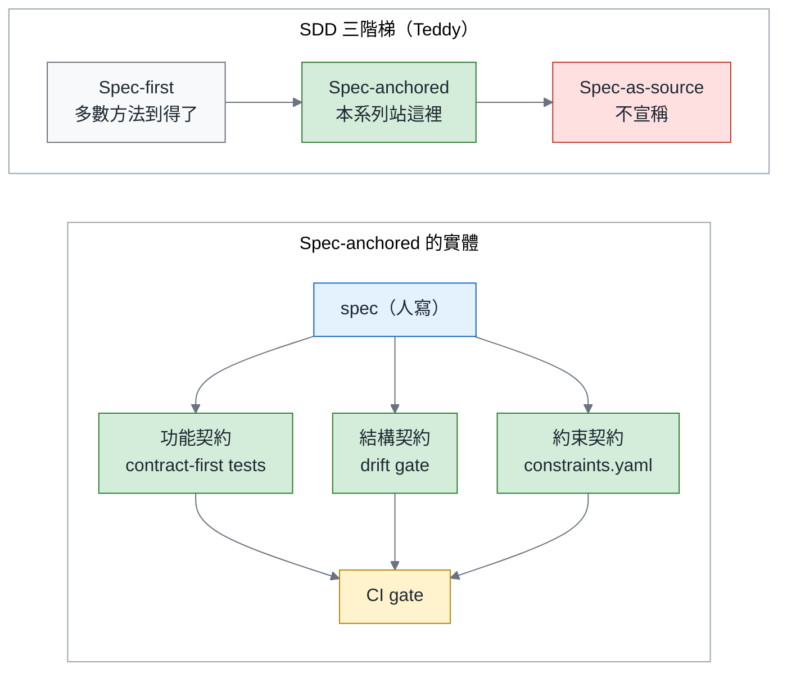
```mermaid
---
config:
  theme: base
  themeVariables:
    fontSize: 16px
    primaryColor: "#f8f9fa"
    primaryTextColor: "#1f2933"
    primaryBorderColor: "#6b7280"
    lineColor: "#6b7280"
    secondaryColor: "#f8f9fa"
    tertiaryColor: "#ffffff"
    clusterBkg: "#ffffff"
    clusterBorder: "#9ca3af"
    edgeLabelBackground: "#ffffff"
  flowchart:
    nodeSpacing: 36
    rankSpacing: 44
    padding: 12
    htmlLabels: true
    subGraphTitleMargin:
      top: 8
      bottom: 12
    curve: basis
---
flowchart TB
    classDef own fill:#d4edda,stroke:#2e7d32,color:#1f2933
    classDef buy fill:#fff3cd,stroke:#b8860b,color:#1f2933
    classDef bad fill:#ffe0e0,stroke:#c0392b,color:#1f2933
    classDef human fill:#e3f2fd,stroke:#1565c0,color:#1f2933
    subgraph ladder["SDD 三階梯（Teddy）"]
        direction LR
        L1["Spec-first<br/>多數方法到得了"] --> L2["Spec-anchored<br/>本系列站這裡"] --> L3["Spec-as-source<br/>不宣稱"]
    end
    subgraph kinds["Spec-anchored 的實體"]
        direction TB
        S["spec（人寫）"] --> K1["功能契約<br/>contract-first tests"]
        S --> K2["結構契約<br/>drift gate"]
        S --> K3["約束契約<br/>constraints.yaml"]
        K1 --> G["CI gate"]
        K2 --> G
        K3 --> G
    end
    ladder ~~~ kinds
    class L2 own
    class L3 bad
    class S human
    class K1,K2,K3 own
    class G buy
```

**P2-2 圖說**：先看 code 再補測試，測試只會錄下現狀；先給契約再生測試，測試紅了才准動 code。

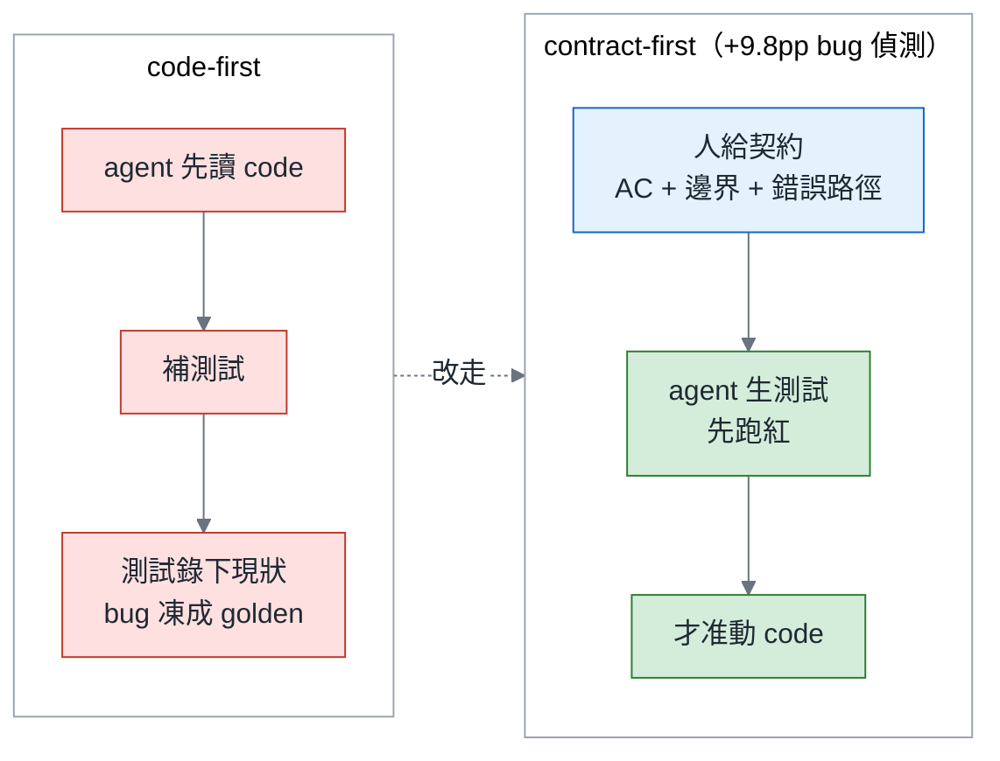
```mermaid
---
config:
  theme: base
  themeVariables:
    fontSize: 16px
    primaryColor: "#f8f9fa"
    primaryTextColor: "#1f2933"
    primaryBorderColor: "#6b7280"
    lineColor: "#6b7280"
    secondaryColor: "#f8f9fa"
    tertiaryColor: "#ffffff"
    clusterBkg: "#ffffff"
    clusterBorder: "#9ca3af"
    edgeLabelBackground: "#ffffff"
  flowchart:
    nodeSpacing: 36
    rankSpacing: 44
    padding: 12
    htmlLabels: true
    subGraphTitleMargin:
      top: 8
      bottom: 12
    curve: basis
---
flowchart LR
    classDef own fill:#d4edda,stroke:#2e7d32,color:#1f2933
    classDef buy fill:#fff3cd,stroke:#b8860b,color:#1f2933
    classDef bad fill:#ffe0e0,stroke:#c0392b,color:#1f2933
    classDef human fill:#e3f2fd,stroke:#1565c0,color:#1f2933
    subgraph cf["code-first"]
        direction TB
        B1["agent 先讀 code"] --> B2["補測試"]
        B2 --> B3["測試錄下現狀<br/>bug 凍成 golden"]
    end
    subgraph ct["contract-first（+9.8pp bug 偵測）"]
        direction TB
        G1["人給契約<br/>AC + 邊界 + 錯誤路徑"] --> G2["agent 生測試<br/>先跑紅"]
        G2 --> G3["才准動 code"]
    end
    cf -.->|改走| ct
    class B1,B2,B3 bad
    class G1 human
    class G2,G3 own
```

**P2-3a 圖說**：行為、介面、約束三類變更必須動 spec—spec 動了放行，沒動就是 drift，擋。

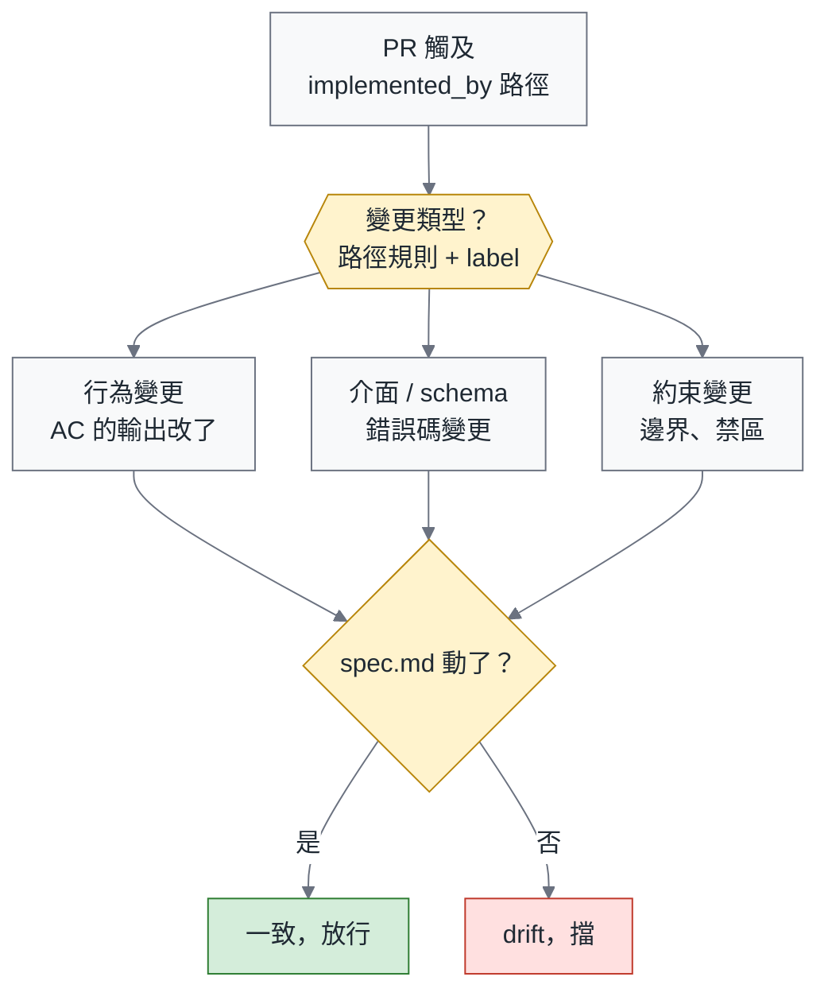
```mermaid
---
config:
  theme: base
  themeVariables:
    fontSize: 16px
    primaryColor: "#f8f9fa"
    primaryTextColor: "#1f2933"
    primaryBorderColor: "#6b7280"
    lineColor: "#6b7280"
    secondaryColor: "#f8f9fa"
    tertiaryColor: "#ffffff"
    clusterBkg: "#ffffff"
    clusterBorder: "#9ca3af"
    edgeLabelBackground: "#ffffff"
  flowchart:
    nodeSpacing: 36
    rankSpacing: 44
    padding: 12
    htmlLabels: true
    subGraphTitleMargin:
      top: 8
      bottom: 12
    curve: basis
---
flowchart TB
    classDef own fill:#d4edda,stroke:#2e7d32,color:#1f2933
    classDef buy fill:#fff3cd,stroke:#b8860b,color:#1f2933
    classDef bad fill:#ffe0e0,stroke:#c0392b,color:#1f2933
    classDef human fill:#e3f2fd,stroke:#1565c0,color:#1f2933
    PR["PR 觸及<br/>implemented_by 路徑"] --> T{{"變更類型？<br/>路徑規則 + label"}}
    T --> C1["行為變更<br/>AC 的輸出改了"]
    T --> C2["介面 / schema<br/>錯誤碼變更"]
    T --> C3["約束變更<br/>邊界、禁區"]
    C1 --> S{"spec.md 動了？"}
    C2 --> S
    C3 --> S
    S -->|是| OK["一致，放行"]
    S -->|否| NO["drift，擋"]
    class T,S buy
    class OK own
    class NO bad
```

**P2-3b 圖說**：refactor 與雜項不必動 spec—但 `spec-impact: none` 若與 diff 矛盾（碰到測試檔、約束檔或公開介面），機器直接駁回，不等 reviewer。

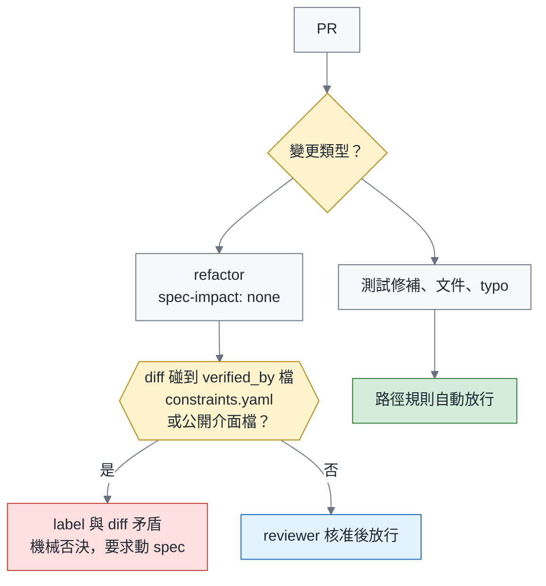
```mermaid
---
config:
  theme: base
  themeVariables:
    fontSize: 16px
    primaryColor: "#f8f9fa"
    primaryTextColor: "#1f2933"
    primaryBorderColor: "#6b7280"
    lineColor: "#6b7280"
    secondaryColor: "#f8f9fa"
    tertiaryColor: "#ffffff"
    clusterBkg: "#ffffff"
    clusterBorder: "#9ca3af"
    edgeLabelBackground: "#ffffff"
  flowchart:
    nodeSpacing: 36
    rankSpacing: 44
    padding: 12
    htmlLabels: true
    subGraphTitleMargin:
      top: 8
      bottom: 12
    curve: basis
---
flowchart TB
    classDef own fill:#d4edda,stroke:#2e7d32,color:#1f2933
    classDef buy fill:#fff3cd,stroke:#b8860b,color:#1f2933
    classDef bad fill:#ffe0e0,stroke:#c0392b,color:#1f2933
    classDef human fill:#e3f2fd,stroke:#1565c0,color:#1f2933
    PR["PR"] --> T{"變更類型？"}
    T --> R["refactor<br/>spec-impact: none"]
    T --> M["測試修補、文件、typo"]
    R --> X{{"diff 碰到 verified_by 檔<br/>constraints.yaml<br/>或公開介面檔？"}}
    X -->|是| NO["label 與 diff 矛盾<br/>機械否決，要求動 spec"]
    X -->|否| RV["reviewer 核准後放行"]
    M --> AUTO["路徑規則自動放行"]
    class T,X buy
    class NO bad
    class RV human
    class AUTO own
```

**P2-T1 圖說**：五種產物的可攜性與證據等級—只有「散文 spec 不可攜」是文獻等級，其餘是推論。

**References**：2608.17177；2606.27045；2608.25202（兩句）；2608.21208；2608.12440（兩句）；2607.25141（一句，指向總論第七節）；2606.04967；2608.16022；2609.04167（只指向 10 月）；Teddy 工作坊 SDD 三階梯與 Four-Form Patterns（需同意；SDD 論文出處待確認）；LeSS in Action 課程筆記（一行，連 10 月測試篇）；「Fb temp」軟體腐化草稿（筆者自己的 FB 貼文，10 月先發）。

---

### 三、變異篇：同一份規格的變異數，就是 harness 的驗收指標

**TL;DR（草稿，約 350–400 字）**

> **TL;DR** — 這一篇是整個系列唯一有第一手數字的地方。我在自己的 repo 上做了一次 noise audit：一份凍結的 spec，四位「法官」—bare user story（A0）/ 無約束（A）/ AGENTS.md conventions（B）/ Pattern Language skills（C）四套 harness 組態—每位判十次，不介入，量三軸 + review minutes（盲審只審 A / B / C 的 30 個 PR，A0 只量三軸）。結果回答總論的命題：spec 厚度動不動變異（A0 vs A）、conventions 與 skills 各能收斂多少、各花多少 token、省多少 review 時間。最後把變異門檻寫成 G2 gate 的第四軸，並用一組前一代 model 的迷你對照回答留言區的問題：更強的 model 是否需要更少約束。N=10 是 screening，不是檢定；看不到的，文中照實標。

**系列導覽**：總論 → 一、規格篇 → 二、契約篇 → **三、變異篇（本篇）**

**章節**

一、Teddy 的問題，再問一次（一段 recap）
- 引原句與 Kim Kao；說明本篇不重講理論，只報實驗；一句「這是一次 noise audit：案件是 spec，法官是四套組態，每次 run 是一次判決」。

二、實驗設計：一次 noise audit（protocol 的完整版，總論只給了一句）
- **Repo**：筆者自己的 repo（不用 Teddy 的課程 repo；skills 那一組自己重做）—**實驗 repo 是 Java / Spring 的 event-sourcing 模組，與前兩篇的 Go 範例不同 stack**；選它是因為它有「訓練資料推不出來的框架契約」（event replay、`@DirtiesContext` 這類測試 context 隔離），否則 skills 組沒東西可比。識別字只在 Teddy 確認「引工作坊不引課程 code」的界線後、或用筆者自己 repo 的才寫。
- **Spec**：規格篇模板、`frozen: true`。**最小可行設計 = 1 個代表性 task × 4 組（A0 / A / B / C）× N=10 = 40 runs，加迷你第四組（A 與 C 在前一代 model 上各 N=5）10 runs，共 50 runs；人類校準帶（兩位工程師照同一 spec 各做一次）必做。** A0 是唯一能讓「spec 厚度動不動變異」從「待測」變成數據的那一組（同一 pipeline、只換短 prompt，是四組裡最便宜的），沒有它，總論的標題副標站不住；迷你第四組是回答社群實際在問的那個問題的唯一方法。**加分項只剩第二、三個 task（bug fix / refactor）**；里程碑延誤時的砍法順序：先砍加分 task，再砍迷你第四組（§七有 fallback），A0 與人類校準帶不砍。
- **四組（四位法官），每組一個 branch，harness 全部 commit 進去**：`arm/A0` 只有 bare user story（一句話 ticket，其餘同 A）；`arm/A` 只有完整 spec；`arm/B` + AGENTS.md conventions（每條附 rationale 與 `check:`）；`arm/C` + Pattern Language skills、hooks、settings（只針對「推不出來的知識」，自己在自己的 repo 重做，引用工作坊不引用課程 code）。四組檔案樹**必須不同**—這就是實驗；`--settings` 載不了 AGENTS.md 也載不了 repo 內的 skills，所以不用它。
- **迷你第四組（level noise 對照，10 runs）**：A 與 C 各在前一代 model 上跑 N=5，其餘 pin 不變—報「A–C 差距在兩代 model 之間縮小了多少」（§七）。只量相似度、違規、token；不進盲審。
- **N ≥ 10 / 組**；model pin（`--model` 明確指定並記錄確切 model id；Fable 5.1 於 09-01 發布，實驗期間不得升級）；harness pin（每筆結果 JSON 寫入 `git rev-parse arm/$ARM` 與 `claude --version`—這才是「harness pin」的實體；similarity.py 從輸出 JSON 讀回實際 model id，與 pin.json 不一致的 run 作廢）；不介入—任何一次人為介入的 run 作廢重跑並記錄；記錄每次 run 是否撞到 `--max-turns 60`（撞到的 run 另列，因為它會截斷 wall-clock 與 token 分佈的尾巴）。
- **量測**：
  - 結構相似度（**主指標，一個定義**）：對每次 run 的變更檔案做 AST 正規化（identifier → 型別占位、去註解、排序 import）後，兩兩計算 normalised tree-edit similarity；報每組成對中位數（附最小值與矩陣），並為每次 run 算**向心相似度**（該 run 對同組其他 9 次 run 的相似度中位數）—這樣每個 PR 有一個相似度、一個 review minutes。檔案集合 Jaccard 當第二欄。**fallback（預先聲明）：若 10/06 前 AST tree-edit 工具未校準完成，主指標改為正規化後的 token 序列 difflib ratio，Jaccard 為第二欄，文中標明。** 動實驗前先用人類校準帶的兩份實作算一次（第 3 節第 2 點），決定 AST 工具（語言相依）。
  - 測試通過率（pass@1 與 10 次全過）。
  - 約束違規數（`constraints.yaml`，contract / style 分開）。
  - **review minutes / PR**：reviewer（不是筆者）盲審 A / B / C 的 30 個 PR—看不到 arm 標籤、順序打亂—每個 PR 記分鐘數與「需要打開幾個檔案才懂」。**A0 不進盲審**：它只回答 H0（相似度與 token），少審 10 份也省 reviewer 的時間；所以 30 個 PR、前 3 份 warm-up（A / B / C 各一）、H5 與總論第六、九節的「30 個 PR」全部指同一批。**學習效應的處理（預先聲明）**：同一位 reviewer 審到第三份就把題目背起來了，minutes 會隨順序單調下降；所以前 3 份（每組各一）為 warm-up 不計入；每份記 sequence index；結果表附「minutes vs 順序」一欄並報扣除順序趨勢後的組間差；可行的話拆成 2 位 reviewer 各審交錯的 15 份，或 3 位各 10 份（每位仍跨三組）。報每組中位數與**向心相似度 vs review minutes 在 30 個 PR 上的 Spearman 相關（不宣稱顯著）**。這一欄接營運篇既有指標，也是 12 月 SLI 的接點。
  - 每次 run 讀了哪些檔（從 trace 取），用來檢查總論 §四「context 組裝的路徑依賴」那條推論。
  - token 與 wall-clock 分佈。
- **Checklist 來源**：工作坊 16 條合規清單改寫成自己的 repo 版—1–4 條「看起來專業」類（分層、文件註解、編譯零 warning、測試全綠）預期全過，另外六條「只有 skill 能給」類是變異的主戰場。
- **預先註冊的假設（pre-registered，寫在跑之前，發文時附上；有方向與效果量，不宣稱顯著性—N=10 是 screening）**：
  - H0（A0 vs A）：bare user story 組的結構相似度中位數與完整 spec 組差距在 0.05 以內（AST 尺度，以校準值為準），token 中位數高 20% 以上—即厚度動成本、不動結構變異。若相似度差距 > 0.1，照實寫「厚度也動變異」並回頭改總論 §一的粗體結論。
  - H1：結構相似度中位數 A < B < C，且 C 比 A 高 0.15 以上。
  - H2：B 組有契約違規的 run 數比 A 組少一半以上；B → C 的結構相似度增幅大於 A → B。
  - H3：C 組 token 中位數比 A 組高 1.7 倍以上（2608.23067 的下界 +72%，是總論 T1 的預期值），且 C 的結構相似度最高。
  - H4：四組 pass@1 的差距在一次 run 之內（≤ 1/10），小於相似度差距—呼應 2607.27250 / 2606.20512 vs 2608.25241。
  - H5：向心相似度與 review minutes 在 30 個 PR 上負相關（報 Spearman，不宣稱顯著）；相似度中位數最高的組，review 中位數最低。
  - H6（迷你第四組）：前一代 model 上 A–C 的相似度差距比 Fable 5.1 上大—更強的 model 需要更少約束；差距若沒縮小，寫「這一代還沒吃掉這些 skills」。
- **人類校準帶（必做）**：兩位人類工程師照同一份 spec 各做一次—兩份實作的成對相似度，就是門檻表「結構相似度」列的校準帶；避免對 agent 用不存在的標準。
- 表 P3-T1「四組（+前代 model）× 六個量測」設計表；圖 P3-1（見圖表）。

三、結果：分佈，不是平均
- 報法：每組報摘要列（表 P3-T2）—相似度中位數 / 最小值 / IQR、pass 幾次、契約違規 run 數、風格違規中位數、token 中位數、review minutes 中位數（扣順序趨勢前後）、撞 max-turns 數；**每次 run 的 CSV 放 repo 連結，不轉成 PNG**（30–50 列的表格轉 PNG 違反 MERMAID.md，而且 xychart 不在允許的圖種內）；分佈的形狀用一段文字描述（例如「A 組相似度雙峰：三次 run 抽了 interface、七次沒有」）。
- 好變異 vs 壞變異三層分類（總論 §六）：等價實作（命名、順序、拆法）vs 契約抓得到的違規（缺 replay、測試 context 沒隔離、越界）vs 契約抓不到的設計層分歧（同一 spec 長出不同數量的 aggregate / module—Kim Kao 現象的 repo 版；用結構相似度與 reviewer 的「打開幾個檔案才懂」抓）vs 成本層（認知複雜度成長、review minutes）。只有後三層進門檻或成本欄。
- 預期會看到的形狀（發文時以實際數字取代）：A0 與 A「看起來都很專業但各做各的」、A0 token 較高；B 組契約違規降、結構仍散；C 組結構收斂、token 漲、review 分鐘降。若結果相反，照實寫—反方評審的話：沒有第一手數據就是學生作文，有了數據但只挑好看的，更糟。
- **N=10 的鑑別力在結果表旁重申**：零違規的 95% 上界約 26%；7/10 與 9/10 分不開；本表是 screening，不是檢定。
- 表 P3-T2「結果摘要表」；圖 P3-2（見圖表；樹只畫逐對可判的前兩層，成本層是跨 run 彙總，在 §五）。

四、對照文獻：槓桿在 loop 裡（兩句引言 + 一張表，數字一律不重述）
- 引言兩句：總論第四節已經把上層 / 下層的文獻與數字講完，這裡只做一件事—把每篇「量的是 run-to-run 還是組態間」標清楚，對上本實驗看到的東西。Uncle Bob 的事實（25 條 acceptance 全過、程式不同）與本實驗「pass@1 差距小於相似度差距」互相印證，讀法留給 10 月。
- 表 P3-T3「文獻 vs 本實驗」：欄 = 來源 / 量什麼（run-to-run 或組態間）/ 本實驗對應的觀察；數字欄一律寫「見總論第四節」。列：2608.26197（run-to-run；是否固定 sampling 待全文）；2608.23740（run-to-run）；**2607.27877（組態間）**；2608.30300（組態間）；2608.20851（組態間，反證）；Uncle Bob 08-17（run-to-run，N=8）；2608.19741（pass@1 vs pass^20，非 code，旁證）。

五、四支槓桿各降多少變異、各花多少 token、各省多少 review 時間
- 把總論 T1 表的實測格對上：A0 → A 差了多少結構相似度與 token（H0）、A → B 降了多少契約違規、B → C 提高多少結構相似度、C 比 A 多花幾倍 token、review minutes 中位數各是多少。**只報本實驗的差值**；2608.23067 的 +72–394% 與 17–36%，寫成「總論 T1 的預期值」一句，不重述數字。
- 判讀規則：C 組 token 漲幅落在預期值內而結構相似度有收斂、review 分鐘有降，是「買到了」；沒收斂，撤 skill。A0 與 A 相似度差距在 0.05 以內，是「厚度不動變異」的第一筆直接證據—一筆，N=10，screening 等級，照這個等級寫。
- 2608.11095 的 rationale comment：B 組每條 convention 附 rationale，是為了維護成本，不是為了本次結果—一句說明，數字在總論 §八。
- **每單位變異的價格**：用營運篇的成本模型算「降一個契約違規 / 提高 0.1 相似度要多少 token」，再對上「提高 0.1 相似度省多少 review 分鐘」—這是 VP 看得懂、CFO 看得懂的兩個數字。
- 表 P3-T6「槓桿 × 軸 × 實測數字」（內文 markdown 表，隨本節轉 PNG）；圖 P3-3（見圖表，三步差值、數字進節點）。

六、變異門檻接進 G2
- 變異 eval 的 case 格式：沿用營運篇 YAML，加 `runs: 10`、`frozen_spec:`、`harness_ref: arm/B`、`variance:`（三軸門檻）；放在 Golden 級，每季與 model / harness 改版時跑。
- G2 第四條的原文（與總論 §七同一句，可直接貼進營運篇的 gate 表）：「≥ 3 個代表性 golden tasks（bug fix / 小 feature / refactor 各一）在 N ≥ 10 下：契約違規 10/10 為 0、測試 ≥ 9/10 全綠、結構相似度中位數落在人類校準帶內；任一軸紅燈時加跑到 N=30 再判；N=30 仍紅 → G2 不過，回技術篇修 harness（conventions 沒 gate 或 skills 沒對到推不出來的知識）；不得以 roadmap 或 pass@1 覆蓋。」
- **明寫：本文的實驗只有一個 task，是這條 gate 的示範，不是達標；三個 task 是 gate 的門票，不是加分。** 單一 task 量不到 pattern noise（組態 × 任務類型），所以 refactor 的變異數不能用 bug fix 的代表。
- 何時重跑、誰 owns、Goodhart 解藥—總論已講，這裡只給 checklist。
- 反模式 1、8 在這裡收：N=1 不算；別人的 reproducibility 數字不算。
- 表 P3-T4「變異 eval case 欄位」（內文 markdown 表）。

七、更強的 model 是否需要更少約束（從意見變成數據）
- 搞笑談軟工留言區的問題，@wquguru 的猜測（Fable 5.1 內化了 skills），@trq212 砍 80% system prompt，@AntonyMarcano 的 corrective vs prescriptive。
- 這是 level noise 的問題—法官換一個世代再審一次。迷你第四組的結果表：A 與 C 在前一代 model 上各 N=5，對上 Fable 5.1 上的 A 與 C，報「A–C 的結構相似度差距、契約違規差距」在兩代之間縮小了多少。**這是本篇最容易被分享的一張表**；N=5 只能看方向，照實標。
- **fallback（一行）**：若前一代 model 在 10 月已不可用，或迷你第四組被里程碑砍掉，本節只剩三則意見，表 P3-T5 下一季補；TL;DR 的那一句對應改成「下一季補」。
- 判讀：差距縮小 → 這些 skill 在被 model 吃掉，改成 corrective rules 與 gates；沒縮小 → 留。
- 預測（有日期）：到 2027 年中，prescriptive 的 skill 多數會被 model 世代吃掉，corrective 的 rules 與可執行的 gates 不會—因為前者是知識、後者是你的 repo 的事實。
- 表 P3-T5「兩代 model × A / C」：欄 = model 世代 / 組 / 相似度中位數 / 契約違規 run 數 / token 中位數；末欄「A–C 差距」。重量流程（新 model → 重跑 A / B / C → 差距縮小？→ 撤 prescriptive skill / 保留 rules 與 gates）用一段文字講，不另畫圖。

八、結語：回答 Teddy
- 可以，而且要量—你的 harness 過關的證據不是「有 AGENTS.md、有 skills」，是「同一份 spec 跑十次，壞變異為零、好變異你不在乎」。
- 引言區：

> **Harness 的驗收不是它會不會做，是它每次做出來的是不是同一個東西。**

- 尾段：系列文章（本篇粗體）→ References → AI 協作說明（固定段）→ 簽名行。

**Reference implementation（片段；這兩支是全系列唯一必須真的跑起來的程式）**

```bash
# evals/variance/run.sh —一組 N 次、不介入
# 前置：四個 branch 各自 commit 自己的 harness—
#   arm/A0 只有 bare user story
#   arm/A  只有完整 spec
#   arm/B  + AGENTS.md（每條附 rationale 與 check:）
#   arm/C  + .claude/skills/、hooks、.claude/settings.json
# 一個 branch 只能被一個 worktree 檢出，所以每次 run 從 arm/$ARM 開一個新 branch。
ARM=$1; SPEC=$2; N=${3:-10}
MODEL_ID="${MODEL_ID:?set MODEL_ID}"                      # 明確指定，不吃 Claude Code 預設
HARNESS_SHA=$(git rev-parse "arm/$ARM")
CLAUDE_VER=$(claude --version)
mkdir -p ../results
for i in $(seq 1 "$N"); do
  WT="../run-$ARM-$i"
  git worktree add -b "run-$ARM-$i" "$WT" "arm/$ARM"
  ( cd "$WT" && \
    claude -p "$(cat contracts/$SPEC/spec.md)" --model "$MODEL_ID" \
      --max-turns 60 --output-format json > "../results/$ARM-$i.json" )   # settings / hooks / skills 由 branch 帶入
  ( cd "$WT" && ./gradlew test > "../results/$ARM-$i.test.log"; \
    scripts/check-constraints.sh contracts/$SPEC/constraints.yaml > "../results/$ARM-$i.violations.json"; \
    git add -A && git commit -qm "run $ARM-$i" )
  jq -n --arg arm "$ARM" --arg sha "$HARNESS_SHA" --arg cv "$CLAUDE_VER" \
        --arg model "$MODEL_ID" --arg spec "$SPEC" \
        '{arm:$arm, harness_sha:$sha, claude_version:$cv, model:$model, spec:$spec}' \
        > "../results/$ARM-$i.pin.json"                                    # harness pin 的實體
done
python3 evals/variance/similarity.py ../results/ --arm "$ARM"   # AST 正規化 → 成對 tree-edit 相似度
# 注意：--max-turns 60 會截斷 wall-clock 與 token 分佈的尾巴；similarity.py 從 $ARM-$i.json 的
# stop reason 判斷是否撞到上限，撞到的 run 在結果表另標，不混進分佈。
```

```python
# evals/variance/similarity.py（概念）
# 1. 對每個 run 的 branch 取相對 arm/$ARM 的 diff 受影響檔案，parse 成 AST（工具語言相依，校準時決定；
#    校準失敗則退回正規化 token 序列的 difflib ratio，並在輸出標 metric=difflib）
# 2. 正規化：identifier → 型別占位、去註解、排序 import
# 3. 兩兩計算 normalised tree-edit similarity，輸出成對中位數 / 最小值 / 矩陣，以及每次 run 的向心相似度；
#    檔案集合 Jaccard 當第二欄
# 4. 從 $ARM-$i.json 讀回實際 model id，與 pin.json 不一致的 run 標 invalid、不進分佈；
#    併入 violations.json、test.log、pin.json、review-minutes.csv（盲審表，含 sequence index），產出摘要表與 per-run CSV
```

**圖表（6 張）**

| 編號 | 名稱 | 種類 | 預期尺寸 |
|---|---|---|---|
| P3-1 | 實驗設計 | flowchart TB | 9 節點、實測 715×624、高／寬 0.87 |
| P3-2 | 好變異 / 壞變異分類樹（逐對兩層；成本層在圖說） | flowchart TB | 6 節點、實測 585×612、高／寬 1.05 |
| P3-3 | 三支槓桿 → 三步差值（A0 → A、A → B、B → C） | flowchart LR 三欄 subgraph | 12 節點、實測 759×600、高／寬 0.79（數字進節點） |
| P3-T2 | 結果摘要表（每組一列） | 表格轉 PNG | 4–6 列 × 9 欄 |
| P3-T3 | 文獻 vs 本實驗 | 表格轉 PNG | 7 列 × 3 欄 |
| P3-T5 | 兩代 model × A / C | 表格轉 PNG | 4 列 × 6 欄 |

（P3-T1 設計表、P3-T4 eval case 欄位表、P3-T6 槓桿 × 軸 × 數字表為內文 markdown 表。封面用 P3-3。）

**P3-1 圖說**：一份凍結的 spec、四套組態各跑十次、同一套尺量三軸，A / B / C 的 30 個 PR 再進盲審記 review minutes（A0 不進），最後對門檻；迷你第四組另跑前一代 model。四個 arm 不上色—實驗沒跑之前沒有哪一組是推薦或注意。

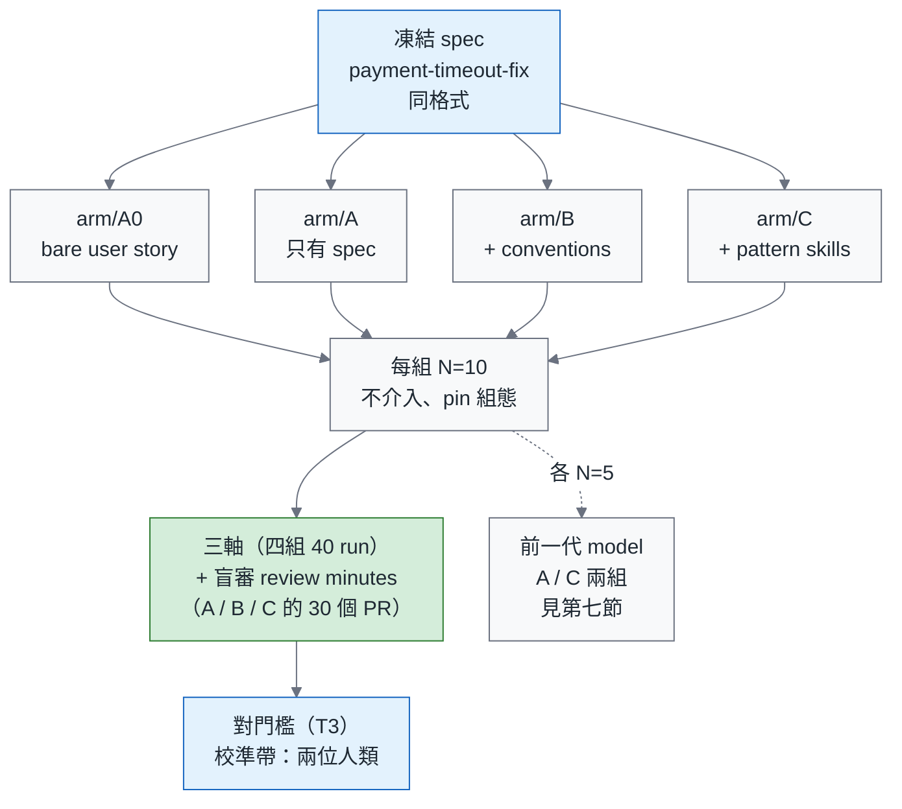
```mermaid
---
config:
  theme: base
  themeVariables:
    fontSize: 16px
    primaryColor: "#f8f9fa"
    primaryTextColor: "#1f2933"
    primaryBorderColor: "#6b7280"
    lineColor: "#6b7280"
    secondaryColor: "#f8f9fa"
    tertiaryColor: "#ffffff"
    clusterBkg: "#ffffff"
    clusterBorder: "#9ca3af"
    edgeLabelBackground: "#ffffff"
  flowchart:
    nodeSpacing: 36
    rankSpacing: 44
    padding: 12
    htmlLabels: true
    subGraphTitleMargin:
      top: 8
      bottom: 12
    curve: basis
---
flowchart TB
    classDef own fill:#d4edda,stroke:#2e7d32,color:#1f2933
    classDef buy fill:#fff3cd,stroke:#b8860b,color:#1f2933
    classDef bad fill:#ffe0e0,stroke:#c0392b,color:#1f2933
    classDef human fill:#e3f2fd,stroke:#1565c0,color:#1f2933
    S["凍結 spec<br/>payment-timeout-fix<br/>同格式"] --> A0["arm/A0<br/>bare user story"]
    S --> A["arm/A<br/>只有 spec"]
    S --> B["arm/B<br/>+ conventions"]
    S --> C["arm/C<br/>+ pattern skills"]
    A0 --> N["每組 N=10<br/>不介入、pin 組態"]
    A --> N
    B --> N
    C --> N
    N --> M["三軸（四組 40 run）<br/>+ 盲審 review minutes<br/>（A / B / C 的 30 個 PR）"]
    M --> T["對門檻（T3）<br/>校準帶：兩位人類"]
    N -.->|各 N=5| L["前一代 model<br/>A / C 兩組<br/>見第七節"]
    class S,T human
    class M own
```

**P3-2 圖說**：兩個實作不同，先問契約過不過，再問設計層有沒有分歧—這兩層算壞變異，命名、順序與等價拆法不扣分。成本層（認知複雜度成長、review minutes）是跨 run 的彙總，不是逐對判斷，不在樹上，見 §五。

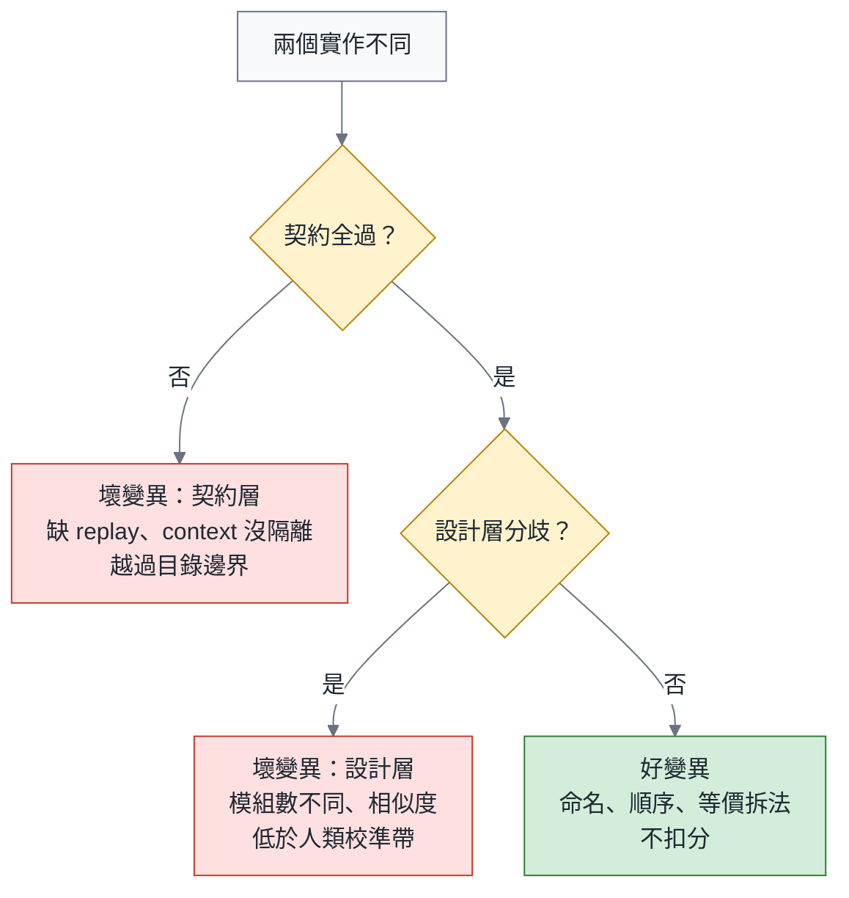
```mermaid
---
config:
  theme: base
  themeVariables:
    fontSize: 16px
    primaryColor: "#f8f9fa"
    primaryTextColor: "#1f2933"
    primaryBorderColor: "#6b7280"
    lineColor: "#6b7280"
    secondaryColor: "#f8f9fa"
    tertiaryColor: "#ffffff"
    clusterBkg: "#ffffff"
    clusterBorder: "#9ca3af"
    edgeLabelBackground: "#ffffff"
  flowchart:
    nodeSpacing: 36
    rankSpacing: 44
    padding: 12
    htmlLabels: true
    subGraphTitleMargin:
      top: 8
      bottom: 12
    curve: basis
---
flowchart TB
    classDef own fill:#d4edda,stroke:#2e7d32,color:#1f2933
    classDef buy fill:#fff3cd,stroke:#b8860b,color:#1f2933
    classDef bad fill:#ffe0e0,stroke:#c0392b,color:#1f2933
    classDef human fill:#e3f2fd,stroke:#1565c0,color:#1f2933
    D["兩個實作不同"] --> Q1{"契約全過？"}
    Q1 -->|否| B1["壞變異：契約層<br/>缺 replay、context 沒隔離<br/>越過目錄邊界"]
    Q1 -->|是| Q2{"設計層分歧？"}
    Q2 -->|是| B2["壞變異：設計層<br/>模組數不同、相似度<br/>低於人類校準帶"]
    Q2 -->|否| G["好變異<br/>命名、順序、等價拆法<br/>不扣分"]
    class Q1,Q2 buy
    class B1,B2 bad
    class G own
```

**P3-3 圖說**：三支槓桿各是一步—spec 厚度（A0 → A）、conventions（A → B）、skills（B → C）—每欄四格是同一套尺的前後值，數字為 10 月實測；A0 不進盲審，所以第一步沒有 review minutes。哪一支槓桿動哪一軸，看哪一格的數字動得多，不預先上色。

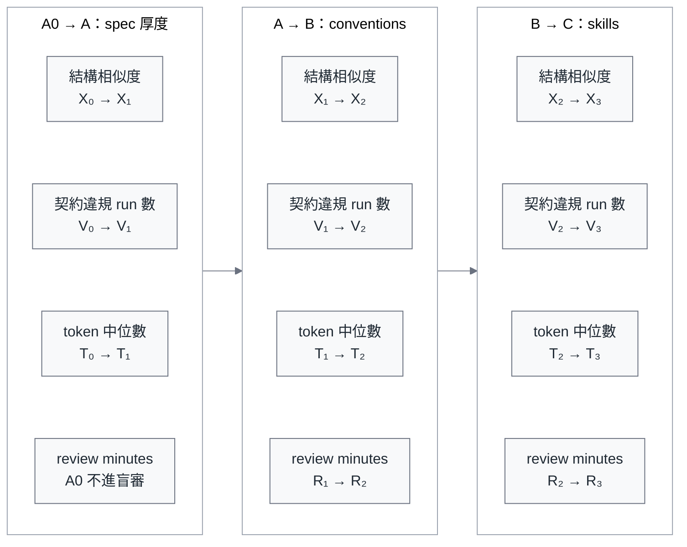
```mermaid
---
config:
  theme: base
  themeVariables:
    fontSize: 16px
    primaryColor: "#f8f9fa"
    primaryTextColor: "#1f2933"
    primaryBorderColor: "#6b7280"
    lineColor: "#6b7280"
    secondaryColor: "#f8f9fa"
    tertiaryColor: "#ffffff"
    clusterBkg: "#ffffff"
    clusterBorder: "#9ca3af"
    edgeLabelBackground: "#ffffff"
  flowchart:
    nodeSpacing: 36
    rankSpacing: 44
    padding: 12
    htmlLabels: true
    subGraphTitleMargin:
      top: 8
      bottom: 12
    curve: basis
---
flowchart LR
    classDef own fill:#d4edda,stroke:#2e7d32,color:#1f2933
    classDef buy fill:#fff3cd,stroke:#b8860b,color:#1f2933
    classDef bad fill:#ffe0e0,stroke:#c0392b,color:#1f2933
    classDef human fill:#e3f2fd,stroke:#1565c0,color:#1f2933
    subgraph s1["A0 → A：spec 厚度"]
        direction TB
        a1["結構相似度<br/>X₀ → X₁"] ~~~ a2["契約違規 run 數<br/>V₀ → V₁"]
        a2 ~~~ a3["token 中位數<br/>T₀ → T₁"]
        a3 ~~~ a4["review minutes<br/>A0 不進盲審"]
    end
    subgraph s2["A → B：conventions"]
        direction TB
        b1["結構相似度<br/>X₁ → X₂"] ~~~ b2["契約違規 run 數<br/>V₁ → V₂"]
        b2 ~~~ b3["token 中位數<br/>T₁ → T₂"]
        b3 ~~~ b4["review minutes<br/>R₁ → R₂"]
    end
    subgraph s3["B → C：skills"]
        direction TB
        c1["結構相似度<br/>X₂ → X₃"] ~~~ c2["契約違規 run 數<br/>V₂ → V₃"]
        c2 ~~~ c3["token 中位數<br/>T₂ → T₃"]
        c3 ~~~ c4["review minutes<br/>R₂ → R₃"]
    end
    s1 --> s2 --> s3
```

**P3-T2 圖說**：結果摘要：四組 × 九量測，每組一列；逐 run 數據在 repo CSV。

**P3-T3 圖說**：文獻量的是 run-to-run 還是組態間，對照本實驗。

**P3-T5 圖說**：兩代 model × A / C：A–C 差距縮小了多少。

**References**：2608.26197；2608.23740；2607.27877（組態間）；2608.30300；2608.20851；2608.19741；2608.23067（一句，預期值）；2608.11095（一句）；2607.27250；2606.20512；2608.25241；@unclebobmartin 2026-08-17（experiment repo，一事）；@trq212 07-24；@AntonyMarcano 09-03；@wquguru 09-03；Teddy 貼文與工作坊（需同意）；Kim Kao 貼文（需同意）；筆者營運篇（eval case、G2、review minutes / PR）。

---

### 三篇之間與總論的重疊控管（大綱本身已照表執行）

| 內容 | 只在哪裡完整講 | 其他地方怎麼帶 |
|---|---|---|
| Kahneman noise audit 與 level / pattern / occasion 對映 | 總論 §二 | 變異篇 §一 一句「案件是 spec、法官是組態、run 是判決」 |
| 需求 / 規格 / 契約 名詞 | 總論 §三 | 規格篇 §一、契約篇 §一 各一段 recap |
| SDD 三階梯與本系列位置 | 契約篇 §一（含 P2-1） | 總論 §三 一句「站在 Spec-anchored」 |
| 變異來源兩層（run-to-run vs 組態間）與全部數字（2608.26197 / 2608.23740 / 2607.27877 / 2608.30300 / 2608.20851） | 總論 §四 | 變異篇 §四 只有表 P3-T3（來源 / run-to-run 或組態間 / 本實驗對應觀察），數字欄寫「見總論第四節」；12 月詳述組態敏感度 |
| 2608.25399（厚度 vs 成本） | 規格篇 §三 細讀 | 總論 §五 一句「user story 多花 29.7% token；輸出結構的變異 A0 實測」 |
| 2609.03028（需求晚到） | 規格篇 §四 | 總論 §五 一句、契約篇 §一 一句 |
| 2608.30572（教室裡 SDD 產量升、理解降） | 規格篇 §五 | 契約篇不再引 |
| contract-first / drift gate / 不可攜 | 契約篇 | 總論 §八 一句 + 表 T2 的 enforcement 欄 |
| SWE-Gate constraint tests | 10 月可靠度篇 | 契約篇 §三 只做銜接 |
| 2607.25141「一致地漏」 | 總論 §七（穩定地錯最接近的例子；run 次數待全文） | 契約篇 §三 一句「總論第七節那個 Dockerfile 例子」+「怎麼寫成契約」，不重列三個漏項 |
| 2608.11095（rationale comment） | 總論 §八 一段（+4.9 條 / +211% → +1.4% / 最多 +23.1%） | 變異篇 §五 一句；「Fb temp」腐化引子只在契約篇 §三 |
| 工作坊 A/B（10/16 vs 16/16） | 10 月可靠度篇 | 變異篇 §二 只用它的 checklist 當違規指標原型；總論 §七 一句「那個 N=1 版本」，**不進象限、不報數字** |
| N-run protocol 全文（repo / spec / 四組 branch / N / pin / 量測 / 假設 / fallback） | 變異篇 §二 | 總論 §六 一句 + 主指標定義 + fallback 一句 + F7 |
| 結構相似度定義、向心相似度與人類校準帶 | 總論 §六（定義）、變異篇 §二（工具與校準） | T3 只寫「人類校準帶」 |
| N=10 鑑別力 | 總論 §六 一段 | 變異篇 §三 結果表旁重申一句 |
| 三支槓桿 × 作用軸 表 | 總論 §五（含 2608.23067 / 2606.20512 數字與 10 月實測差值） | 變異篇 §五 只報本實驗差值與每單位變異的價格 |
| review minutes / PR 與向心相似度的相關 | 變異篇 §二、§五 | 總論 §六 定義為壞變異第三層、§九 給 CFO 的可證偽主張 |
| G2 第四軸（含 ≥ 3 task、N=30 終止條件） | 總論 §七 | 變異篇 §六 同一句原文 + 「本實驗是示範不是達標」 |
| 更強 model 是否需要更少約束（level noise） | 變異篇 §七（迷你第四組 + fallback） | 總論 §二 一句歸類為 level noise |
| ADR / why | 總論 §八 三段一表 | 三篇都不展開 |
| harness pin 三篇（2608.26218 / 2609.03966 / 2608.22752） | 12 月可靠篇 | 總論 §四 下層一句 |
| Uncle Bob 08-17 | 10 月測試篇（讀法） | 總論 §五、變異篇 §四 各一句事實 |
| LeSS A-TDD | 10 月測試篇 | 規格篇 §一、契約篇 §二 各一行 |
| `payment-timeout-fix` 案例（Go） | 營運篇 §二 定義 | 規格篇 §二、§六 模板；契約篇 §五 worked example、§六 目錄—同一 id、同一 stack；變異篇的實驗 repo 是 Java / Spring，明寫不同 stack |

---

## 3. 寫作前要補的證據

1. **10 月第一週開跑實驗，硬性里程碑**：**10/06 spec 凍結（含人類校準帶兩份實作開工、相似度工具在兩份實作上跑通—跑不通就啟用 difflib fallback 並記錄）→ 10/13 A 組 N=10 完成 → 10/20 B 組完成 → 10/27 C 組完成（skills 自己重做）→ 10/29 A0 組完成 → 10/31 迷你第四組完成（A / C 在前一代 model 各 N=5）**。最小可行設計 = 1 個代表性 task × 4 組 × N=10 = 40 runs + 迷你第四組 10 runs = 50 runs + 人類校準帶 2 份實作；總論所有表格（T1、T3、§九預算、§十 90 天）以「一個代表性 task」為基準寫，T1 的實測格在 11/03 前填好，不留待填格。加分項只有第二、三個 task（bug fix / refactor）；**任一里程碑延誤：先砍加分 task，再砍迷你第四組（變異篇 §七 fallback 生效、TL;DR 那句改成「下一季補」），A0 與人類校準帶不砍**—少了 A0，總論的副標站不住；少了校準帶，T3 的結構相似度列沒有門檻。10 月同時有四篇發布與 CNPE 第二次考試，排程按此；工作量的其他減法見下方第 15 點。預算先用營運篇的成本模型估：50 次 run × 單次中位成本，實測值填進總論 §九。
2. **把七篇核心論文讀完全文，不只 abstract，並在 10/06 前完成相似度校準**：2608.25399（**「run-to-run variance unchanged」量的是 token 變異還是輸出變異—arxiv.md 把它歸在 unit economics 叢集、摘要全在講 token spend，預設當成本變異；讀完全文若確認是輸出變異，才把總論 §五、T1、規格篇 §三 的寫法從「文獻未直接量」改成「文獻量過、不動」**）、2608.26197（「3 of 4 cells」是哪四格、什麼 model、structured planning 具體是什麼、latency 代價多少；**確認 1.000 是否來自 decoding 決定性—temperature / seed—若是，此篇改列為反模式 4 的反例而不是證據，總論 §四 (1) 與 P3-T3 同步改**；是否為 coding 任務）、2608.21208、2608.17177、2606.27045、2608.25202、2609.03028。摘要裡多數只有 API 一行。相似度校準：用人類校準帶的兩份實作算一次 AST tree-edit similarity，確認尺度與工具（語言相依），總論 T3 才有校準帶可寫；校準不成就照 fallback 用 difflib ratio。
3. **取得 Teddy 的同意，並確認四件事**：引用 FB 貼文原句（並取 URL、日期、當日反應數—日期定了才決定 TL;DR 的季節用詞）、工作坊學員手冊的名詞（SDD 三階梯、Context vs Form、Four-Form Patterns、需求 vs 規格）、「引工作坊不引課程 code」的界線（六條「推不出來的知識」的識別字能不能寫）；**工作坊實際兩天的日期**（Notion 的 08-22 → 08-24 是頁面 created → last_edited）；SDD 論文 "Spec-Driven Development: From Code to Contract in the Age of AI" 的正確出處；**學生量 regeneration LOC 變異那則貼文（57 / 3 / 11）實際量到的數字與量法**—拿到才引數字，否則總論只寫「有人量過」。
4. **取得 Kim Kao 的同意**引用 bounded context 貼文與鮑承佑的留言；取 URL。
5. **讀 Uncle Bob 08-17 的 experiment repo**：確認「8 runs、四種紀律、25 條 acceptance、程式不同」的細節，看他有沒有量結構差異（有的話是現成的對照組）；與 10 月計畫協調—10 月用讀法，11 月只用事實。
6. **重讀《雜訊》**：noise audit 章、level / pattern / occasion noise 的定義章、decision hygiene 章；抓繁中版頁碼；確認「人類只要做出判斷，就會有雜訊」的完整引句與出處頁；**核對 F2 的對映（法官 = harness 組態、一次判決 = run）與原書三分法一致**。
7. **補歷史類比的來源**：flaky test 的業界指標與年代（flake rate、quarantine）、Reproducible Builds（Debian）一句；沒有可靠來源就只講敘事不放數字。
8. **確認組態 pin 的可行性**：Fable 5.1 有沒有 seed / 決定性參數（這也決定 2608.26197 的讀法）、Claude Code 版本能否鎖、`--model` 接受的 id 格式、輸出 JSON 有沒有回報實際 model id（similarity.py 第 4 步靠它）、前一代 model 在 10 月是否仍可用（迷你第四組的前提）；四個 arm branch 各自 commit settings、hooks、skills，`pin.json` 寫入 `git rev-parse` 與 `claude --version`，否則「harness pin」是空話。
9. **找盲審的 reviewer**：一位（最好兩三位）不是筆者、不知道 arm 標籤的同事，願意審 30 個 PR 並記分鐘數與「打開幾個檔案才懂」；**reviewer 需先知道會有學習效應、同意記錄審閱順序**，前 3 份是 warm-up；沒有人就用筆者自己盲審（打亂順序、隱藏 branch 名）並在文中標明限制。
10. **名詞用法先過一遍工作坊同學**：需求 / 規格 / 契約 的定義（總論 §三）與契約篇 §一 的標題「只做規格 → 契約，不做 why」發給兩三位同學看，確認不會被讀成「跟 Teddy 打架」。
11. **等 10 月三篇定稿再寫契約篇 §三與變異篇 §二**：constraint tests 的解說與工作坊 A/B 的用法必須跟 10 月一致，避免兩個月講兩套；同步核對第 0 節「來源歸屬」表與 10、12 月計畫檔。
12. **Dan North / Matt Wynne**：確認原文是否在 digest 內；不在就引轉貼（DavidKo 轉貼、Blazej Drobniuch 案例）並標「轉引」，不列 digest 外的 URL；規格篇引的三則 Scrum Community 小貼文（四十條 Gherkin、story 切更小、RD 兩小時）查作者與 URL，只當一句話例子。
13. **BC-Bench 2608.20851 與 DEPBENCH 2608.30300**：前者讀摘要確認 DSL 與 model 組合，確認總論 §四那一句反證的邊界（「領域越窄、model 越不熟，Form 的權重越大」）；後者已讀摘要，標為組態間。
14. **2607.25141 讀全文**：確認「一致地漏掉」的量測方式（幾次 run、幾個 model），總論 §七「穩定地錯」的例子才站得住；沒讀到前只寫「一致地漏；變異未量」。
15. **10 月工作量的減法（已在大綱落實，動筆時遵守）**：總論 §八 只剩一表三段；`spec-lint` 與 `drift-gate.yml` 是節錄的 pseudo-config，只有 `run.sh` / `similarity.py` 必須真的跑；相似度工具有 difflib fallback；英文版只有總論與變異篇跟 +1 天，規格篇 / 契約篇英文版可晚一週；圖從 28 張減到 25 張（F5、F11、P2-4、P2-T2 刪，P2-3 拆二）。

---

## 4. 英文版注意事項

- **title_en**：Same Spec, Ten Runs: Output Variance as the Acceptance Metric for Your Harness。三部曲：*Same Spec, Ten Runs (1): The Spec—Writing a Spec Both Humans and Agents Can Accept*；*(2): The Contract—From Spec to Executable Contract*；*(3): The Variance—Run-to-Run Variance as Your Harness's Acceptance Metric*。Teddy 留在內文第一段。
- **排程**：總論與變異篇英文版 +1 天（X 上有傳播價值）；規格篇與契約篇英文版可晚一週。
- **開場換順序**：英文讀者不認識搞笑談軟工。英文總論用 Uncle Bob 08-17 的 8-run 實驗與 Teddy 的問題並列開場，Teddy 介紹為 "Teddy Chen, who runs one of Taiwan's largest software-engineering communities (搞笑談軟工) and whose reproducibility criterion was the most-shared engineering post in the Taiwanese groups I follow this summer"。Kim Kao 同理，一句介紹 DDD Taiwan。
- **名詞**：英文讀者把 spec 用得很鬆。§三 的名詞地圖在英文版要更早、更硬：requirement（problem-domain what）/ specification（behaviour both parties can accept）/ contract（the executable, failing, CI-bound subset）；註明這是 Teddy 的 what / how 區分的延伸，並附 Michael Jackson Problem Frames。
- **書錨**：*Noise: A Flaw in Human Judgment*（Kahneman, Sibony, Sunstein, 2021）；引句用英文原文，noise audit / level / pattern / occasion noise 是原書用詞，不必解釋太多；**judge = harness configuration, judgment = run** 要在第一次出現就寫死。
- **Example Mapping / BDD**：在英文圈是常識，規格篇 §一 已合併壓短，英文版再壓 30%，把篇幅給 §二（agent 讀什麼）與 §四（需求晚到）。
- **數字標領域（中英文版都要）**：pass^20 47.5% 是非 code 工作流；F1 0.035 是 SQL 遷移；1.000 是特定 cell、是否固定 sampling 待全文；0.00 vs 0.96 是 chat-template / parser adapter，是否為 coding-agent 情境待全文；28% → 49% 是 SWE-bench Verified tight-window；**29.7% 是 Kimi K3 上的 token 花費，任務類型與是否為 coding agent 待全文確認**；>30 分是組態間（topology）差異，不是 run-to-run—每個數字後面標 domain。
- **統計誠實**：N=10 的鑑別力段在英文版更重要—X 上的 eval 圈會先算 rule of three；"screening gate, not a significance test" 要出現在 TL;DR。
- **圖**：9 + 5 + 5 + 6 張全部重畫英文版；quadrantChart 的四格英文：Expand autonomy / Lucky / Consistently wrong / Not ready。
- **工作坊引用**：英文版對 Teddy 的框架用 "as taught in his Pattern-Language-Driven Development workshop (Aug 2026)"，不翻譯手冊內容，只引名詞。
- **英文版的讀者現實**：2025 年英文版 reads 只有中文的 1/6、完讀 8%。英文版的價值是 X 上的傳播（Uncle Bob、Fowler、LangChain eval 圈都在追這條線）；TL;DR 與 §一要能被截圖。

---

## 5. 發布與推廣

**Medium topics（5 個）**：Software Engineering、AI Agents、Engineering Management、Software Testing、Specification（若不可用改 Behavior Driven Development）。英文版同。

**封面圖**：F8「bias × noise 四象限」（擴權 / 靠運氣 / 穩定地錯 / 未就緒）—一張圖講完 pass rate 與變異是兩個軸，也是 Kahneman 靶心圖的 agent 版；備選 F7「N-run protocol」。三部曲封面：規格篇 P1-2 spec 六段（人決定的 vs agent 驗收的）、契約篇 P2-3a drift gate、變異篇 P3-3 三步差值（節點帶數字的那張）。

**發布順序與時機**
- 10 月中：先在粉絲團貼「Fb temp」的軟體腐化短文當 teaser（Notion 草稿已成形），結尾一句「11 月會寫 spec 與 code 之間的腐爛怎麼量」。
- 11/03（二）總論中文 → 11/04 英文；之後每週二一篇三部曲；變異篇英文 11/25，規格篇 / 契約篇英文各晚一週。避開 11 月中 KubeCon NA 那週的 LinkedIn 噪音（那是 12 月主題的場）。
- 每篇發布當天粉絲團分享；總論另外分享到搞笑談軟工（先私訊 Teddy）與 DDDesign Taiwan（tag Kim Kao 的原貼）。2025 年 views 超過 presentations 的週，都是粉絲團分享的週；2026 系列到 09-05 粉絲團還沒貼過—這次不能漏。

**FB 粉絲團 hooks（榮民叔叔的藏書筆記）**
- 總論：「八月上完 Teddy 的工作坊（學號 1 號），腦中一直轉他那句話：同一份規格、不介入、能不能長出幾乎一樣的實作？我回家用 Kahneman《雜訊》的方法試了一次：一份 spec、四套 harness、每套跑十次。結果比我想的更有趣—把 spec 寫厚省的是 token，能不能治變異，文獻沒量過，我自己量了一次。spec 決定你要什麼；loop 決定你每次拿到的是不是同一個東西。」
- 規格篇：「agent 讀文件的時間，60.5% 花在 instruction files 與 working notes，1.3% 在 API 文件。你的 spec 放在哪裡？這篇講需求是 What、規格是 How，以及一份 agent 與人都能驗收的 spec 長什麼樣。」
- 契約篇：「一家 agent 寫的 spec，丟給另一家讀，F1 只剩 0.035。你的 spec 有多少是給人看的散文、多少是機器能執行的契約？」
- 變異篇：「同一份 spec、四種約束、每組跑十次，再請同事盲審每個 PR 記時間—這是我自己的 repo 的數字。AGENTS.md 有沒有用、skills 值不值那些 token、spec 寫厚到底動了什麼，終於不用靠感覺回答。」

**搞笑談軟工 / DDDesign Taiwan 分享文案**：直接回 Teddy 的問題—「Teddy 八月問的那個問題，我拿自己的 repo 量了一次：spec 固定、四套 harness 組態、每套跑十次。結論放在文章第三篇，第一篇先講 spec 到底調的是哪一軸。」DDDesign 版改成 Kim Kao 的 bounded context 數量問題開場：「每次抽出的 bounded context 數量不同—這種沒有契約寫得出來的變異，要怎麼量？」

**X hooks（英文）**
- 總論：「Uncle Bob ran the same spec 8 times: all 25 acceptance tests passed every time, and the programs were not the same. I ran mine 10 times under four harness configurations and measured the variance. Thesis: variance is born in sampling and amplified or damped in the loop; the levers we can prove are in the loop. Spec thickness moves cost—whether it moves variance, I measured for the first time. Conventions and pattern skills are levers, not ceilings.」tag @unclebobmartin、@martinfowler（TDD-in-the-loop 那條）。
- 變異篇：「Same spec, ten runs, four arms: bare user story / full spec / AGENTS.md conventions / pattern-language skills, plus a blind reviewer timing every PR. Numbers, not vibes. N=10 is a screening gate, not a significance test. Full table inside.」（數字在發文時填；沒有數字前不預先寫「conventions cut X」。）
- 契約篇：「A spec authored by one coding agent and consumed by another scored Token F1 0.035. Your prose spec is a prompt tuned to a vendor; whether the executable contract ports is something you measure by handing it to a challenger vendor every quarter.」

**LinkedIn**：只發總論與變異篇，開頭一句寫「as a Kubestronaut who spent ten years in QA」，接 Kahneman；LinkedIn 讀者是 12 月主題的觀眾，這裡先播種「variance → review minutes → SLI」的接點。
