# 2026-12 把 Agent 當 Production Workload：全部圖表的 Mermaid 原始碼

> 依 `research/2026-09/2026-12-sre-for-agents.md`（2026-09-05 兩輪評審後的修訂版）的圖表清單，逐張給圖說、預期尺寸與完整 Mermaid 原始碼；每張都照 `MERMAID.md`：frontmatter `config`（theme base、themeVariables 顏色、flowchart 間距、subGraphTitleMargin；不含 fontFamily，字型由算繪腳本注入）、classDef 四色（own / buy / bad / human 四行每張都寫齊，沒用到的不影響版面）、節點 > 5 用 TB 或兩欄、≤ 12 節點、節點文字 ≤ 3 行、邊上文字 ≤ 6 字、不用 emoji、不寫逐節點 `style`、subgraph 裡有 `direction TB` 時邊只連 subgraph 本身。表格類（F3、F6、F7、F11、F12、F13、G2a/b/c、G3、R1、R2a/b、R5、I1）不是圖，直接用 markdown 表格、貼 Medium 時轉 PNG—各條只留一行說明與圖說，不畫。
>
> 大綱已內嵌原始碼的 14 張（F1、F2、F4、F5、G1、G4、G5、G6、R3、R4、I2、I3、I4、I5）一律從大綱版起修，不重畫；本檔補齊四行 classDef，並把十張圖（F2、F5、G4、G6、R3、R4、I2、I3、I4、I5）裡超過 Mermaid 標籤寬度、算繪時會被自動折成第四行的節點文字改短—只改斷行與措辭，不改節點、邊、class 與語意，改動處在各圖的「預期尺寸」行標明。F8、F9、F10 在修訂時分別併入 R4、I2、I4，總論不再有這三張，編號保留只為對照修訂前的版本。
>
> 檢查：`research/scripts/mermaid_check_all.sh research/2026-09/2026-12-sre-for-agents.figures.md`（逐張算繪、印尺寸與 PASS／FAIL）。2026-09-06 實測（mermaid 11、gstack browse headless）：14 張全部 PASS，尺寸列在各圖的「預期尺寸」行與文末清單，PNG 也逐張看過，沒有被裁或被折成第四行的字。
>
> 給算繪腳本的提醒：`research/scripts/sync_figures.py` 的圖號正則是 `[FTRCP]\d{1,2}`，本月觀測篇（G）與應變篇（I）的圖號不在裡面；回寫大綱前要把 `G` 與 `I` 加進去，並留意 G1 前 600 字內提到「總論 F5」，靠「最後一個圖號」配對會配錯。

---

## 總論（10 張：F1、F2、F3、F4、F5、F6、F7、F11、F12、F13）

### F1 — 總論 第三節：Agent 是 production workload 的四個證據

**圖說**：會花錢、會出事、會被打、有規模—它已經是 production workload，卻沒有任何一個 production workload 該有的四樣東西。

**預期尺寸**：`flowchart LR` 包兩個 `direction TB` subgraph、8 節點、實測 651×600、高／寬 0.92（與大綱同）。左欄四個證據各只留一個數字（$1.2M/yr、52 起、12 個 harness、307,416 個 task），右欄缺的四樣用 bad class。

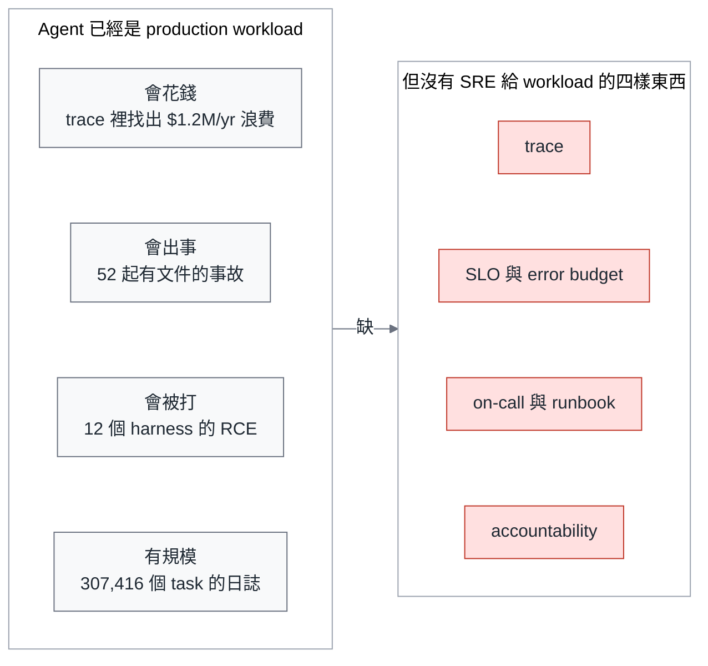
```mermaid
---
config:
  theme: base
  themeVariables:
    fontSize: 16px
    primaryColor: "#f8f9fa"
    primaryTextColor: "#1f2933"
    primaryBorderColor: "#6b7280"
    lineColor: "#6b7280"
    secondaryColor: "#f8f9fa"
    tertiaryColor: "#ffffff"
    clusterBkg: "#ffffff"
    clusterBorder: "#9ca3af"
    edgeLabelBackground: "#ffffff"
  flowchart:
    nodeSpacing: 36
    rankSpacing: 44
    padding: 12
    htmlLabels: true
    subGraphTitleMargin:
      top: 8
      bottom: 12
    curve: basis
---
flowchart LR
    classDef own fill:#d4edda,stroke:#2e7d32,color:#1f2933
    classDef buy fill:#fff3cd,stroke:#b8860b,color:#1f2933
    classDef bad fill:#ffe0e0,stroke:#c0392b,color:#1f2933
    classDef human fill:#e3f2fd,stroke:#1565c0,color:#1f2933
    subgraph ev["Agent 已經是 production workload"]
        direction TB
        E1["會花錢<br/>trace 裡找出 $1.2M/yr 浪費"] ~~~ E2["會出事<br/>52 起有文件的事故"]
        E2 ~~~ E3["會被打<br/>12 個 harness 的 RCE"]
        E3 ~~~ E4["有規模<br/>307,416 個 task 的日誌"]
    end
    subgraph gap["但沒有 SRE 給 workload 的四樣東西"]
        direction TB
        G1["trace"] ~~~ G2["SLO 與 error budget"]
        G2 ~~~ G3["on-call 與 runbook"]
        G3 ~~~ G4["accountability"]
    end
    ev -->|缺| gap
    class G1,G2,G3,G4 bad
```

### F2 — 總論 第四節：SRE 十六年 ↔ Agent 三年

**圖說**：SRE 花了十六年從「不要出事」走到 error budget 與 OpenTelemetry，agent 用三年重演同一條路—方法照搬，缺的只是 SLI。

**預期尺寸**：`flowchart LR` 包兩個 `direction TB` subgraph、7 節點、實測 662×600、高／寬 0.91（大綱版 731×600；右欄 2025 與 2026 兩個節點改成三行，原本 span 會被折到第四行）。不用 `timeline`（橫排，七個時間點會變成 1568×400 的橫條）。2027 是預測，用 buy class 與史實區分。

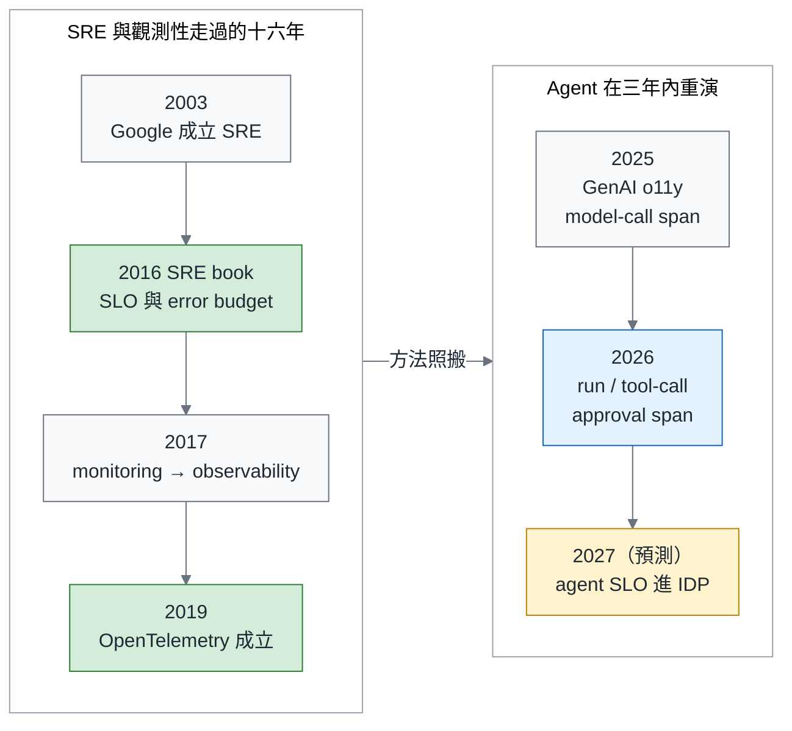
```mermaid
---
config:
  theme: base
  themeVariables:
    fontSize: 16px
    primaryColor: "#f8f9fa"
    primaryTextColor: "#1f2933"
    primaryBorderColor: "#6b7280"
    lineColor: "#6b7280"
    secondaryColor: "#f8f9fa"
    tertiaryColor: "#ffffff"
    clusterBkg: "#ffffff"
    clusterBorder: "#9ca3af"
    edgeLabelBackground: "#ffffff"
  flowchart:
    nodeSpacing: 36
    rankSpacing: 44
    padding: 12
    htmlLabels: true
    subGraphTitleMargin:
      top: 8
      bottom: 12
    curve: basis
---
flowchart LR
    classDef own fill:#d4edda,stroke:#2e7d32,color:#1f2933
    classDef buy fill:#fff3cd,stroke:#b8860b,color:#1f2933
    classDef bad fill:#ffe0e0,stroke:#c0392b,color:#1f2933
    classDef human fill:#e3f2fd,stroke:#1565c0,color:#1f2933
    subgraph sre["SRE 與觀測性走過的十六年"]
        direction TB
        S1["2003<br/>Google 成立 SRE"] --> S2["2016 SRE book<br/>SLO 與 error budget"]
        S2 --> S3["2017<br/>monitoring → observability"]
        S3 --> S4["2019<br/>OpenTelemetry 成立"]
    end
    subgraph ag["Agent 在三年內重演"]
        direction TB
        A1["2025<br/>GenAI o11y<br/>model-call span"] --> A2["2026<br/>run / tool-call<br/>approval span"]
        A2 --> A3["2027（預測）<br/>agent SLO 進 IDP"]
    end
    sre -->|方法照搬| ag
    class S2,S4 own
    class A2 human
    class A3 buy
```

### F3 — 總論 第四節：SRE 詞彙 ↔ Agent 詞彙（表格，不畫）

十一列兩欄的對照表（service ↔ golden workflow、request ↔ run、dependency ↔ model API + MCP server + harness 版本、deploy、SLI、error budget、on-call、postmortem、runbook、canary），表格比圖清楚；用 markdown 表格，貼 Medium 時轉 PNG。

**圖說**：SRE 的每個詞在 agent 這一側都有對應—service 是 golden workflow、request 是一次 run、一次 run 就是一條 trace、error budget 是授權額度。

### F4 — 總論 第五節：Claimed outcome vs verified outcome

**圖說**：兩邊 agent 都說了 done；左邊拿它當證據，右邊把它另存，只讓 hook、CI 與人的 approve 決定 outcome。

**預期尺寸**：`flowchart LR` 包兩個 `direction TB` subgraph、9 節點、實測 825×483、高／寬 0.59（與大綱同）。`cl ~~~ ve` 那條隱形邊不能拿掉，沒有它兩欄會上下疊成 514×890。三種訊號（tests exit 0、CI green、human.approval approve）在總論只在這張圖裡列一次。

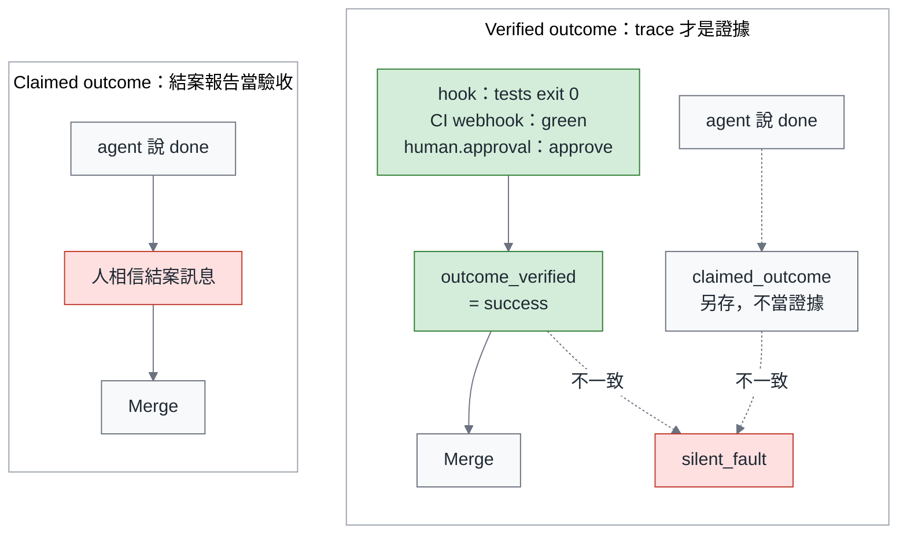
```mermaid
---
config:
  theme: base
  themeVariables:
    fontSize: 16px
    primaryColor: "#f8f9fa"
    primaryTextColor: "#1f2933"
    primaryBorderColor: "#6b7280"
    lineColor: "#6b7280"
    secondaryColor: "#f8f9fa"
    tertiaryColor: "#ffffff"
    clusterBkg: "#ffffff"
    clusterBorder: "#9ca3af"
    edgeLabelBackground: "#ffffff"
  flowchart:
    nodeSpacing: 36
    rankSpacing: 44
    padding: 12
    htmlLabels: true
    subGraphTitleMargin:
      top: 8
      bottom: 12
    curve: basis
---
flowchart LR
    classDef own fill:#d4edda,stroke:#2e7d32,color:#1f2933
    classDef buy fill:#fff3cd,stroke:#b8860b,color:#1f2933
    classDef bad fill:#ffe0e0,stroke:#c0392b,color:#1f2933
    classDef human fill:#e3f2fd,stroke:#1565c0,color:#1f2933
    subgraph cl["Claimed outcome：結案報告當驗收"]
        direction TB
        C1["agent 說 done"] --> C2["人相信結案訊息"]
        C2 --> C3["Merge"]
    end
    subgraph ve["Verified outcome：trace 才是證據"]
        direction TB
        V1["agent 說 done"] -.-> V2["claimed_outcome<br/>另存，不當證據"]
        V3["hook：tests exit 0<br/>CI webhook：green<br/>human.approval：approve"] --> V4["outcome_verified<br/>= success"]
        V4 --> V5["Merge"]
        V2 -.->|不一致| V6["silent_fault"]
        V4 -.->|不一致| V6
    end
    cl ~~~ ve
    class C2 bad
    class V3,V4 own
    class V6 bad
```

### F5 — 總論 第六節：一次 agent run 的 trace 樹（封面）

**圖說**：一次 run 是一條 trace：規格已有的 invoke_agent 與 execute_tool 照用原名，org.step 用 org namespace 補，human.approval 是本篇提出的擴充。

**預期尺寸**：`flowchart TB`、6 節點、實測 629×599、高／寬 0.95（大綱版 629×623；root 節點改成「invoke_agent（規格已有）／= 一次 run／trace id = run id」三行，原本第二行會把 run id 折斷）。只展開 `org.step #k` 一步（subgraph 內三個 leaf 直排），#1 與 #N 收合；attributes 全部在觀測篇 G2 表，圖上只寫 span 名 + 一行來源。

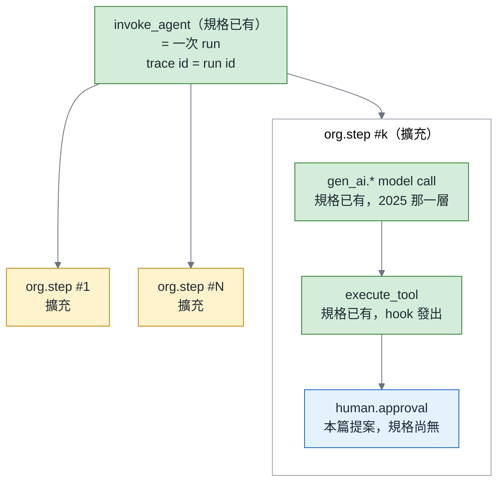
```mermaid
---
config:
  theme: base
  themeVariables:
    fontSize: 16px
    primaryColor: "#f8f9fa"
    primaryTextColor: "#1f2933"
    primaryBorderColor: "#6b7280"
    lineColor: "#6b7280"
    secondaryColor: "#f8f9fa"
    tertiaryColor: "#ffffff"
    clusterBkg: "#ffffff"
    clusterBorder: "#9ca3af"
    edgeLabelBackground: "#ffffff"
  flowchart:
    nodeSpacing: 36
    rankSpacing: 44
    padding: 12
    htmlLabels: true
    subGraphTitleMargin:
      top: 8
      bottom: 12
    curve: basis
---
flowchart TB
    classDef own fill:#d4edda,stroke:#2e7d32,color:#1f2933
    classDef buy fill:#fff3cd,stroke:#b8860b,color:#1f2933
    classDef bad fill:#ffe0e0,stroke:#c0392b,color:#1f2933
    classDef human fill:#e3f2fd,stroke:#1565c0,color:#1f2933
    R["invoke_agent（規格已有）<br/>= 一次 run<br/>trace id = run id"]
    S1["org.step #1<br/>擴充"]
    subgraph SK["org.step #k（擴充）"]
        direction TB
        M["gen_ai.* model call<br/>規格已有，2025 那一層"] --> T["execute_tool<br/>規格已有，hook 發出"]
        T --> H["human.approval<br/>本篇提案，規格尚無"]
    end
    SN["org.step #N<br/>擴充"]
    R --> S1
    R --> SK
    R --> SN
    class R,M,T own
    class S1,SN buy
    class H human
```

### F6 — 總論 第七節：Release gate vs Production SLI（表格，不畫）

兩欄清單（左：pass^k、mutation score、constraint-test 違規、變異數；右：六個 SLI 各標「進 budget / policy condition」），只列名字與「在哪裡量、決定什麼」，表格比圖清楚；定義與初值在可靠篇 R1 / R2。

**圖說**：release gate 在 offline 量、決定 harness 版本能不能升；production SLI 在真實流量下每分鐘量、決定升了之後要不要 rollback、授權能不能擴。

### F7 — 總論 第四節：SRE 借得動 / 要重做的四件事（表格，不畫）

四列（probe 的位置、非版號化的 model 變更、approval 作為一級訊號、事件量太小）× 「SRE 怎麼做 / agent 要怎麼重做」兩欄，表格比圖清楚。

**圖說**：SRE 的方法幾乎全部借得動；要重做的只有四件事—probe 的位置、非版號化的 model 變更、approval 作為一級訊號、事件量太小。

### F11 — 總論 第十節：規模分層 50 / 200 / 1,000 人（表格，不畫）

四列（sandbox、觀測、SLO、on-call）× 三欄（50 / 200 / 1,000 人）的矩陣，大綱 §十 已填好內容，表格比圖清楚。

**圖說**：50 人買 vendor sandbox、只有 cost cap 與 kill switch；200 人把三種 span 接進既有 Collector、為一條 golden workflow 定 SLO；1,000 人才自建 fleet、由 platform squad 自己輪值。

### F12 — 總論 第十一節：90 天儀表化計畫（表格，不畫）

三列（第 1、2、3 個月）× 兩欄（目標、退出條件），大綱 §十一 已填好內容，表格比圖清楚。

**圖說**：第 1 個月看得到、第 2 個月可以定目標、第 3 個月出事有人接—每個階段各有一個可以驗的退出條件。

### F13 — 總論 決策工件：八個反模式（表格，不畫）

八列（反模式、一句話、出現在哪一篇）的清單，大綱「反模式清單」已填好內容，表格比圖清楚。

**圖說**：八個反模式—結案報告當驗收、只觀測 model call、transcript 當 log、買一套 SaaS 就算有觀測、沒有 change management 的 harness、拿 pass@1 當 SLO、agent 自己當自己的 on-call、追責靠事後推測。

---

## 一、觀測篇（6 張：G1、G2a/b/c、G3、G4、G5、G6）

### G1 — 觀測篇 第一節：2025 的三個缺口

**圖說**：2025 看得到每一次 model call，看不到 run 邊界、tool call 與 approval；2026 補的就是這三個 signal。

**預期尺寸**：`flowchart LR` 包兩個 `direction TB` subgraph、7 節點、實測 657×576、高／寬 0.88（與大綱同）。畫的是三個缺口，不是那棵樹（樹在總論 F5）。

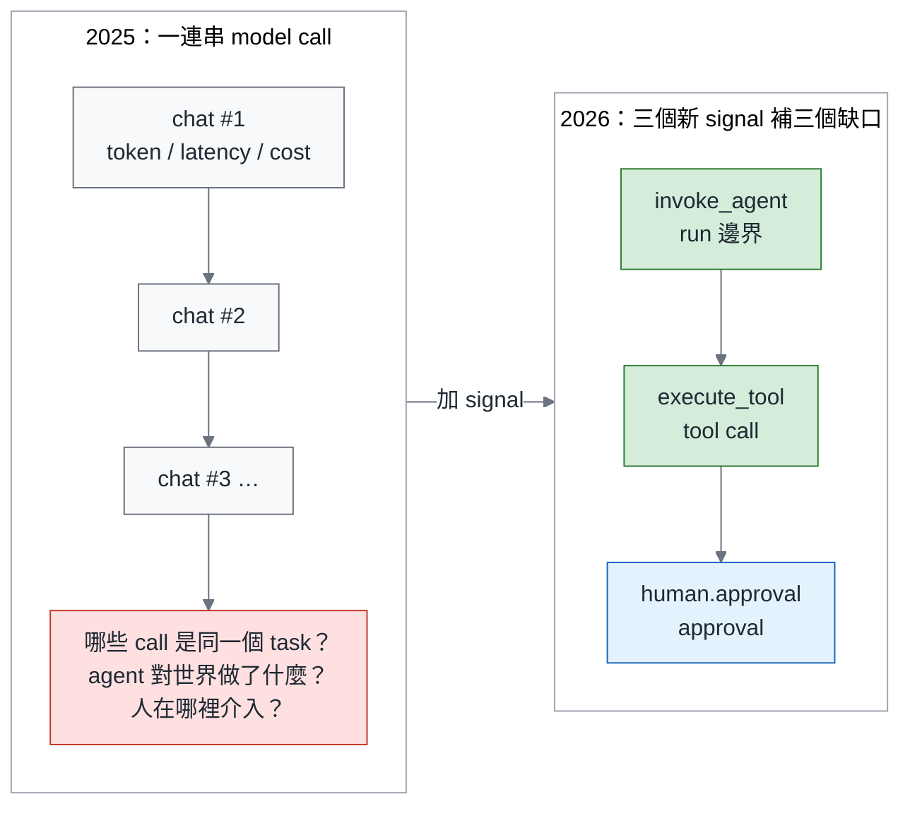
```mermaid
---
config:
  theme: base
  themeVariables:
    fontSize: 16px
    primaryColor: "#f8f9fa"
    primaryTextColor: "#1f2933"
    primaryBorderColor: "#6b7280"
    lineColor: "#6b7280"
    secondaryColor: "#f8f9fa"
    tertiaryColor: "#ffffff"
    clusterBkg: "#ffffff"
    clusterBorder: "#9ca3af"
    edgeLabelBackground: "#ffffff"
  flowchart:
    nodeSpacing: 36
    rankSpacing: 44
    padding: 12
    htmlLabels: true
    subGraphTitleMargin:
      top: 8
      bottom: 12
    curve: basis
---
flowchart LR
    classDef own fill:#d4edda,stroke:#2e7d32,color:#1f2933
    classDef buy fill:#fff3cd,stroke:#b8860b,color:#1f2933
    classDef bad fill:#ffe0e0,stroke:#c0392b,color:#1f2933
    classDef human fill:#e3f2fd,stroke:#1565c0,color:#1f2933
    subgraph old["2025：一連串 model call"]
        direction TB
        O1["chat #1<br/>token / latency / cost"] --> O2["chat #2"]
        O2 --> O3["chat #3 …"]
        O3 --> O4["哪些 call 是同一個 task？<br/>agent 對世界做了什麼？<br/>人在哪裡介入？"]
    end
    subgraph new["2026：三個新 signal 補三個缺口"]
        direction TB
        N1["invoke_agent<br/>run 邊界"] --> N2["execute_tool<br/>tool call"]
        N2 --> N3["human.approval<br/>approval"]
    end
    old -->|加 signal| new
    class O4 bad
    class N1,N2 own
    class N3 human
```

### G2a / G2b / G2c — 觀測篇 第二節：span attributes 表（表格，不畫）

三張各 ≤ 10 列、4 欄（attribute / 規格或擴充 / 來源 / 自由文字）的表：G2a `invoke_agent`（規格 attribute + `org.run.*`、`org.harness.*`、`org.model.*`、`org.skills.*`、`org.config.*`）、G2b `execute_tool`（規格 + `org.tool.*`）、G2c 擴充 span（`org.step`、`human.approval`）；「來源」只寫 hook、gateway、CI、run loop 之一，「自由文字」只寫是 / 否。attribute 清單是表格內容，畫成圖會超過 12 節點。

**圖說**：三張 attribute 表算一張圖—每一列標明是規格還是擴充、由 hook / gateway / CI / run loop 哪一個發出、是否含自由文字；span 全部由你自己的 harness 層發出。

### G3 — 觀測篇 第三節：cost 分解表（表格，不畫；視篇幅）

三列（model tokens、sandbox、週邊）× 兩欄（占比引營運篇 §三，不重講 / 從哪個 span 取），表格比圖清楚。

**圖說**：一次 run 的成本分成三塊，每一塊都能從 trace 上的某個 span 取到—用 `outcome_verified` 分母，不用 `claimed_outcome`。

### G4 — 觀測篇 第四節：事件帳本與 transcript 分家（消費者側）

**圖說**：事件帳本與對話紀錄分開存：人、dashboard、observer agent 都只吃帳本，transcript 是證物不是 telemetry。

**預期尺寸**：`flowchart TB`、6 節點、實測 659×368、高／寬 0.56（與大綱同；來源節點改成三行，原本「/ CI」會被折斷）。只畫消費者側；ledger 怎麼產生、hash chain、anchor 在應變篇 I3。

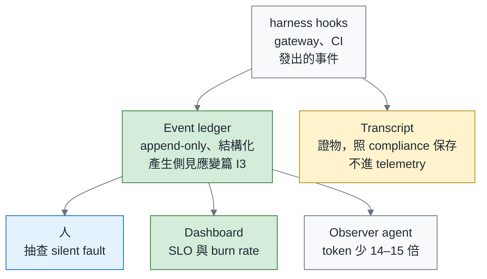
```mermaid
---
config:
  theme: base
  themeVariables:
    fontSize: 16px
    primaryColor: "#f8f9fa"
    primaryTextColor: "#1f2933"
    primaryBorderColor: "#6b7280"
    lineColor: "#6b7280"
    secondaryColor: "#f8f9fa"
    tertiaryColor: "#ffffff"
    clusterBkg: "#ffffff"
    clusterBorder: "#9ca3af"
    edgeLabelBackground: "#ffffff"
  flowchart:
    nodeSpacing: 36
    rankSpacing: 44
    padding: 12
    htmlLabels: true
    subGraphTitleMargin:
      top: 8
      bottom: 12
    curve: basis
---
flowchart TB
    classDef own fill:#d4edda,stroke:#2e7d32,color:#1f2933
    classDef buy fill:#fff3cd,stroke:#b8860b,color:#1f2933
    classDef bad fill:#ffe0e0,stroke:#c0392b,color:#1f2933
    classDef human fill:#e3f2fd,stroke:#1565c0,color:#1f2933
    S["harness hooks<br/>gateway、CI<br/>發出的事件"]
    L["Event ledger<br/>append-only、結構化<br/>產生側見應變篇 I3"]
    T["Transcript<br/>證物，照 compliance 保存<br/>不進 telemetry"]
    P["人<br/>抽查 silent fault"]
    D["Dashboard<br/>SLO 與 burn rate"]
    O["Observer agent<br/>token 少 14–15 倍"]
    S --> L
    S --> T
    L --> P
    L --> D
    L --> O
    class L,D own
    class T buy
    class P human
```

### G5 — 觀測篇 第五節：從 trace 長出 eval

**圖說**：四種可疑訊號自動把 run 標成 eval case，回填營運篇的 pipeline；應變篇 I5 的 postmortem 產出也從 eval case 這個節點進來。

**預期尺寸**：`flowchart TB`、7 節點、實測 777×436、高／寬 0.56（與大綱同）。四個篩選條件各一個 bad 節點並排在第二層（同層 4 個，是上限）。

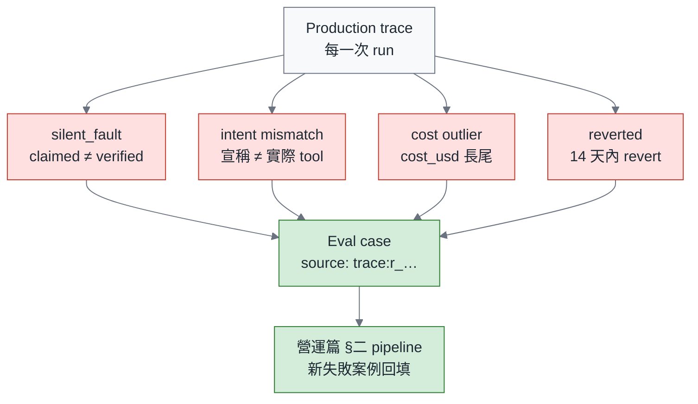
```mermaid
---
config:
  theme: base
  themeVariables:
    fontSize: 16px
    primaryColor: "#f8f9fa"
    primaryTextColor: "#1f2933"
    primaryBorderColor: "#6b7280"
    lineColor: "#6b7280"
    secondaryColor: "#f8f9fa"
    tertiaryColor: "#ffffff"
    clusterBkg: "#ffffff"
    clusterBorder: "#9ca3af"
    edgeLabelBackground: "#ffffff"
  flowchart:
    nodeSpacing: 36
    rankSpacing: 44
    padding: 12
    htmlLabels: true
    subGraphTitleMargin:
      top: 8
      bottom: 12
    curve: basis
---
flowchart TB
    classDef own fill:#d4edda,stroke:#2e7d32,color:#1f2933
    classDef buy fill:#fff3cd,stroke:#b8860b,color:#1f2933
    classDef bad fill:#ffe0e0,stroke:#c0392b,color:#1f2933
    classDef human fill:#e3f2fd,stroke:#1565c0,color:#1f2933
    P["Production trace<br/>每一次 run"]
    F1["silent_fault<br/>claimed ≠ verified"]
    F2["intent mismatch<br/>宣稱 ≠ 實際 tool"]
    F3["cost outlier<br/>cost_usd 長尾"]
    F4["reverted<br/>14 天內 revert"]
    E["Eval case<br/>source: trace:r_…"]
    Q["營運篇 §二 pipeline<br/>新失敗案例回填"]
    P --> F1 & F2 & F3 & F4
    F1 & F2 & F3 & F4 --> E
    E --> Q
    class F1,F2,F3,F4 bad
    class E,Q own
```

### G6 — 觀測篇 第六節：復用既有 Collector pipeline

**圖說**：三種來源進同一個既有 Collector，兩個 processor 加身分、剝文字，落到你已經有的 Tempo、Prometheus 與 Grafana—整條線上沒有一個新系統。

**預期尺寸**：`flowchart TB`、8 節點加一個 subgraph、實測 661×762、高／寬 1.15（大綱版 813×762；五個節點的第二行各拆成兩行，不再自動折行）。Collector subgraph 用 buy class（既有、不新建）；三個來源用 own class（你自己的 harness 層）。

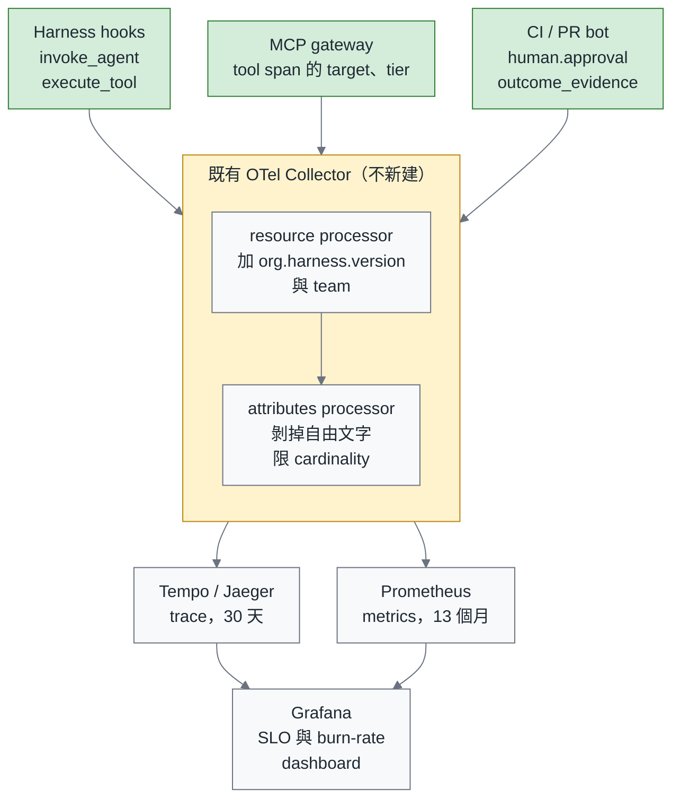
```mermaid
---
config:
  theme: base
  themeVariables:
    fontSize: 16px
    primaryColor: "#f8f9fa"
    primaryTextColor: "#1f2933"
    primaryBorderColor: "#6b7280"
    lineColor: "#6b7280"
    secondaryColor: "#f8f9fa"
    tertiaryColor: "#ffffff"
    clusterBkg: "#ffffff"
    clusterBorder: "#9ca3af"
    edgeLabelBackground: "#ffffff"
  flowchart:
    nodeSpacing: 36
    rankSpacing: 44
    padding: 12
    htmlLabels: true
    subGraphTitleMargin:
      top: 8
      bottom: 12
    curve: basis
---
flowchart TB
    classDef own fill:#d4edda,stroke:#2e7d32,color:#1f2933
    classDef buy fill:#fff3cd,stroke:#b8860b,color:#1f2933
    classDef bad fill:#ffe0e0,stroke:#c0392b,color:#1f2933
    classDef human fill:#e3f2fd,stroke:#1565c0,color:#1f2933
    S1["Harness hooks<br/>invoke_agent<br/>execute_tool"]
    S2["MCP gateway<br/>tool span 的 target、tier"]
    S3["CI / PR bot<br/>human.approval<br/>outcome_evidence"]
    subgraph col["既有 OTel Collector（不新建）"]
        direction TB
        P1["resource processor<br/>加 org.harness.version<br/>與 team"] --> P2["attributes processor<br/>剝掉自由文字<br/>限 cardinality"]
    end
    B1["Tempo / Jaeger<br/>trace，30 天"]
    B2["Prometheus<br/>metrics，13 個月"]
    B3["Grafana<br/>SLO 與 burn-rate<br/>dashboard"]
    S1 --> col
    S2 --> col
    S3 --> col
    col --> B1
    col --> B2
    B1 --> B3
    B2 --> B3
    class S1,S2,S3 own
    class col buy
```

---

## 二、可靠篇（5 張：R1、R2a/b、R3、R4、R5）

### R1 — 可靠篇 第二節：Release gate vs Production SLI（表格，不畫）

三欄表（左：pass^k、mutation score、constraint-test 違規、變異數、golden / frontier eval；中欄一句「offline、受控 vs online、真實流量」；右：六個 SLI 標「進 budget / policy condition」），表格比圖清楚。是總論 F6 的定義版。

**圖說**：release gate 決定 harness 版本能不能升，production SLI 決定升了之後要不要 rollback、授權能不能擴；兩邊不能互換，因為一邊是 offline 受控、一邊是 online 真實流量。

### R2a / R2b — 可靠篇 第三節：六個 SLI 定義表（表格，不畫）

兩張各 4 欄（SLI / 分子 ÷ 分母（含排除）/ 來源 span / 初值）：R2a 進 budget 的三個事件比率（run availability、tool-call error rate、agent-authored change revert rate），R2b 三個 policy condition（latency、cost per successful task 月增、intervention ratio）。定義是長句，表格比圖清楚；初值只在這裡出現，總論不給。

**圖說**：六個 SLI 全部讀 `outcome_verified`、沒有一個是 agent 自己填的—三個事件比率進 error budget（前兩個是快訊號、第三個是 14 天落後 budget），三個 policy condition 達標才准擴張；初值是我的建議值，不是業界標準。

### R3 — 可靠篇 第五節：error budget 的 stock-and-flow

**圖說**：error budget 是一個 stock：壞事件把它燒掉、授權擴張從它提款，policy condition 只決定閥門開不開。

**預期尺寸**：`flowchart TB`、7 節點、實測 825×751、高／寬 0.91（大綱版 841×775；好事件與壞事件兩個節點改斷行）。判斷節點是三行菱形，寬度接近 900 的上限；動筆時若加字，先跑一次 checker。

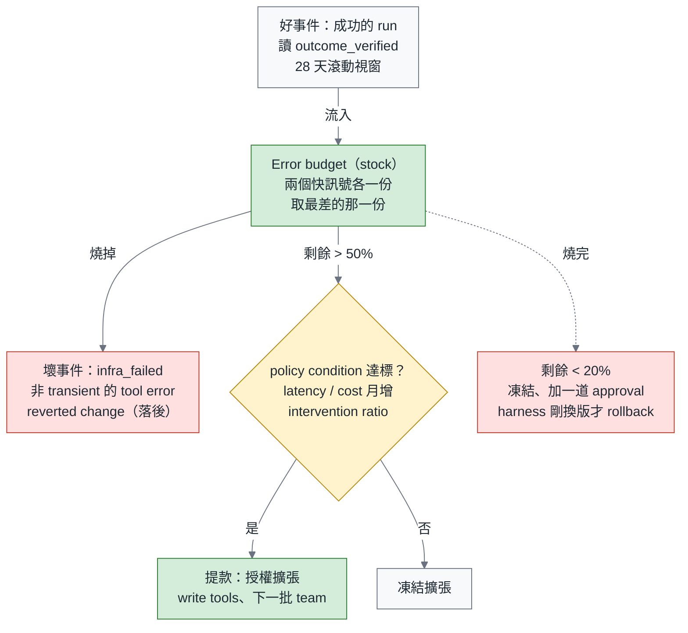
```mermaid
---
config:
  theme: base
  themeVariables:
    fontSize: 16px
    primaryColor: "#f8f9fa"
    primaryTextColor: "#1f2933"
    primaryBorderColor: "#6b7280"
    lineColor: "#6b7280"
    secondaryColor: "#f8f9fa"
    tertiaryColor: "#ffffff"
    clusterBkg: "#ffffff"
    clusterBorder: "#9ca3af"
    edgeLabelBackground: "#ffffff"
  flowchart:
    nodeSpacing: 36
    rankSpacing: 44
    padding: 12
    htmlLabels: true
    subGraphTitleMargin:
      top: 8
      bottom: 12
    curve: basis
---
flowchart TB
    classDef own fill:#d4edda,stroke:#2e7d32,color:#1f2933
    classDef buy fill:#fff3cd,stroke:#b8860b,color:#1f2933
    classDef bad fill:#ffe0e0,stroke:#c0392b,color:#1f2933
    classDef human fill:#e3f2fd,stroke:#1565c0,color:#1f2933
    IN["好事件：成功的 run<br/>讀 outcome_verified<br/>28 天滾動視窗"]
    ST["Error budget（stock）<br/>兩個快訊號各一份<br/>取最差的那一份"]
    OUT["壞事件：infra_failed<br/>非 transient 的 tool error<br/>reverted change（落後）"]
    G{"policy condition 達標？<br/>latency / cost 月增<br/>intervention ratio"}
    W["提款：授權擴張<br/>write tools、下一批 team"]
    F["凍結擴張"]
    RB["剩餘 < 20%<br/>凍結、加一道 approval<br/>harness 剛換版才 rollback"]
    IN -->|流入| ST
    ST -->|燒掉| OUT
    ST -->|剩餘 > 50%| G
    G -->|是| W
    G -->|否| F
    ST -.->|燒完| RB
    class ST,W own
    class G buy
    class OUT,RB bad
```

### R4 — 可靠篇 第六節：harness change management 四步與 rollback 迴路

**圖說**：pin、diff、canary、promote 是一條線；rollback 是從 canary 回到 pin 的紅色迴路，觸發它的是 burn rate。diff 那一步分兩種：你自己的變更用兩版 trace 對照，上游的靜默換版用同一份 lock 下的定期 smoke eval。

**預期尺寸**：`flowchart TB`、5 節點、實測 514×580、高／寬 1.13（大綱版 514×676；Pin、Diff、Canary 三個節點改斷行，不再被折成第四、五行）。Promote 與 Rollback 兩個節點要三行才撐得到 500 寬（兩行版實測 460）；改成表格畫不出紅色迴路，所以維持流程圖。負責人留在內文。

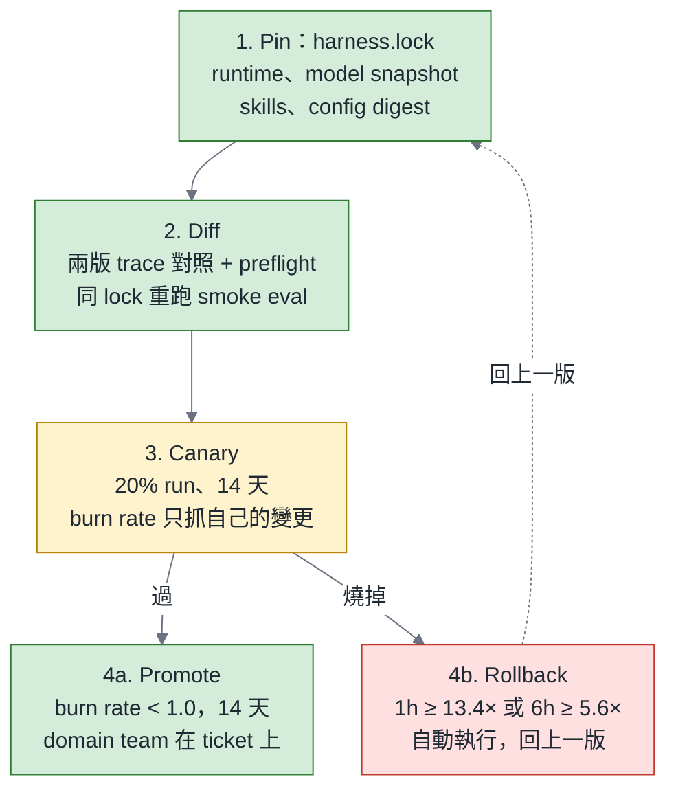
```mermaid
---
config:
  theme: base
  themeVariables:
    fontSize: 16px
    primaryColor: "#f8f9fa"
    primaryTextColor: "#1f2933"
    primaryBorderColor: "#6b7280"
    lineColor: "#6b7280"
    secondaryColor: "#f8f9fa"
    tertiaryColor: "#ffffff"
    clusterBkg: "#ffffff"
    clusterBorder: "#9ca3af"
    edgeLabelBackground: "#ffffff"
  flowchart:
    nodeSpacing: 36
    rankSpacing: 44
    padding: 12
    htmlLabels: true
    subGraphTitleMargin:
      top: 8
      bottom: 12
    curve: basis
---
flowchart TB
    classDef own fill:#d4edda,stroke:#2e7d32,color:#1f2933
    classDef buy fill:#fff3cd,stroke:#b8860b,color:#1f2933
    classDef bad fill:#ffe0e0,stroke:#c0392b,color:#1f2933
    classDef human fill:#e3f2fd,stroke:#1565c0,color:#1f2933
    P["1. Pin：harness.lock<br/>runtime、model snapshot<br/>skills、config digest"]
    D["2. Diff<br/>兩版 trace 對照 + preflight<br/>同 lock 重跑 smoke eval"]
    C["3. Canary<br/>20% run、14 天<br/>burn rate 只抓自己的變更"]
    PR["4a. Promote<br/>burn rate < 1.0，14 天<br/>domain team 在 ticket 上"]
    RB["4b. Rollback<br/>1h ≥ 13.4× 或 6h ≥ 5.6×<br/>自動執行，回上一版"]
    P --> D --> C
    C -->|過| PR
    C -->|燒掉| RB
    RB -.->|回上一版| P
    class P,D,PR own
    class C buy
    class RB bad
```

### R5 — 可靠篇 第七節：sandbox fleet 容量表（表格，不畫）

四列（並行 run 上限、每 run 記憶體、warm pool 大小、scale-to-zero 延遲）× 兩欄（數字 / 怎麼從 trace 推），表格比圖清楚。只給 1,000 人規模看；篇幅不夠時整節縮成一段並指向總論 F11，這張表留給 backlog。

**圖說**：容量規劃的四個數字各自從 trace 推—`invoke_agent` 的並行數與 duration 分布、sandbox 的記憶體峰值、cold start 在 run latency 裡的占比；agent sandbox 要規劃的是記憶體與啟動時間，不是 CPU。

（第五節的 G2 兩半邊小表是內文 markdown 表格，大綱明列「不算圖」，本檔不另列。）

---

## 三、應變與追責篇（5 張：I1、I2、I3、I4、I5）

### I1 — 應變篇 第一節：agent 當第一線的邊界（表格，不畫）

六列（read-only 診斷、提出 remediation、執行 remediation、核准自己的 PR、碰 production DB、關 alert）× 「可以 / 需 approval / 不行」，表格比圖清楚。依據是技術篇 tool 三級與 CCA-F 的 independent review instance；SteerBench 的兩個數字只在這一節的內文出現。

**圖說**：agent 當第一線可以做 read-only 診斷、可以提出 remediation；執行 remediation 要 `human.approval`（kind=remediation，計入 intervention ratio）；核准自己的 PR、碰 production DB、關 alert 一律不行。

### I2 — 應變篇 第二節：agent 出事的四種形狀決策樹

**圖說**：alert 先分四種形狀，每一種各有一份 runbook；分不出來的才交給人 triage。預設動作都是凍結 + ticket，只有形狀二與碰 production 的 workflow 會 page。

**預期尺寸**：`flowchart TB`、10 節點、實測 814×884、高／寬 1.09（與大綱同；Alert 節點改成三行）。問題節點用圓角矩形（stadium）不用菱形：四個兩行菱形實測 879×1539（高／寬 1.75），一行菱形也還是 1.69。訊號寫在問題節點裡，邊上只留「是 / 否」。

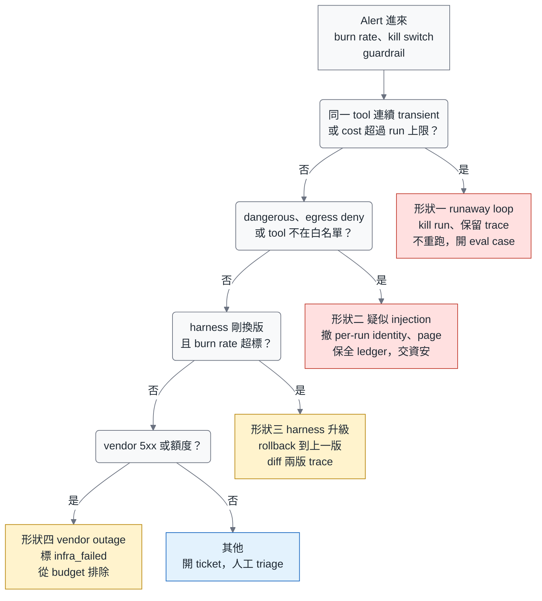
```mermaid
---
config:
  theme: base
  themeVariables:
    fontSize: 16px
    primaryColor: "#f8f9fa"
    primaryTextColor: "#1f2933"
    primaryBorderColor: "#6b7280"
    lineColor: "#6b7280"
    secondaryColor: "#f8f9fa"
    tertiaryColor: "#ffffff"
    clusterBkg: "#ffffff"
    clusterBorder: "#9ca3af"
    edgeLabelBackground: "#ffffff"
  flowchart:
    nodeSpacing: 36
    rankSpacing: 44
    padding: 12
    htmlLabels: true
    subGraphTitleMargin:
      top: 8
      bottom: 12
    curve: basis
---
flowchart TB
    classDef own fill:#d4edda,stroke:#2e7d32,color:#1f2933
    classDef buy fill:#fff3cd,stroke:#b8860b,color:#1f2933
    classDef bad fill:#ffe0e0,stroke:#c0392b,color:#1f2933
    classDef human fill:#e3f2fd,stroke:#1565c0,color:#1f2933
    A["Alert 進來<br/>burn rate、kill switch<br/>guardrail"]
    Q1("同一 tool 連續 transient<br/>或 cost 超過 run 上限？")
    Q2("dangerous、egress deny<br/>或 tool 不在白名單？")
    Q3("harness 剛換版<br/>且 burn rate 超標？")
    Q4("vendor 5xx 或額度？")
    R1["形狀一 runaway loop<br/>kill run、保留 trace<br/>不重跑，開 eval case"]
    R2["形狀二 疑似 injection<br/>撤 per-run identity、page<br/>保全 ledger，交資安"]
    R3["形狀三 harness 升級<br/>rollback 到上一版<br/>diff 兩版 trace"]
    R4["形狀四 vendor outage<br/>標 infra_failed<br/>從 budget 排除"]
    O["其他<br/>開 ticket，人工 triage"]
    A --> Q1
    Q1 -->|是| R1
    Q1 -->|否| Q2
    Q2 -->|是| R2
    Q2 -->|否| Q3
    Q3 -->|是| R3
    Q3 -->|否| Q4
    Q4 -->|是| R4
    Q4 -->|否| O
    class R1,R2 bad
    class R3,R4 buy
    class O human
```

### I3 — 應變篇 第三節：flight recorder 產生側

**圖說**：hooks 發出的 action event 進 append-only 帳本，每筆帶前一筆的 hash，每天收一個 Merkle root；上鏈是選配。transcript 與 trace 分開存，各有自己的 retention。

**預期尺寸**：`flowchart TB`、6 節點、實測 762×508、高／寬 0.67（大綱版 768×580；hooks 與 anchor 兩個節點改斷行）。只畫產生側；消費者側在觀測篇 G4。$2.30 這個數字只在這張圖與應變篇 §3 出現（總論 §九 一句）。

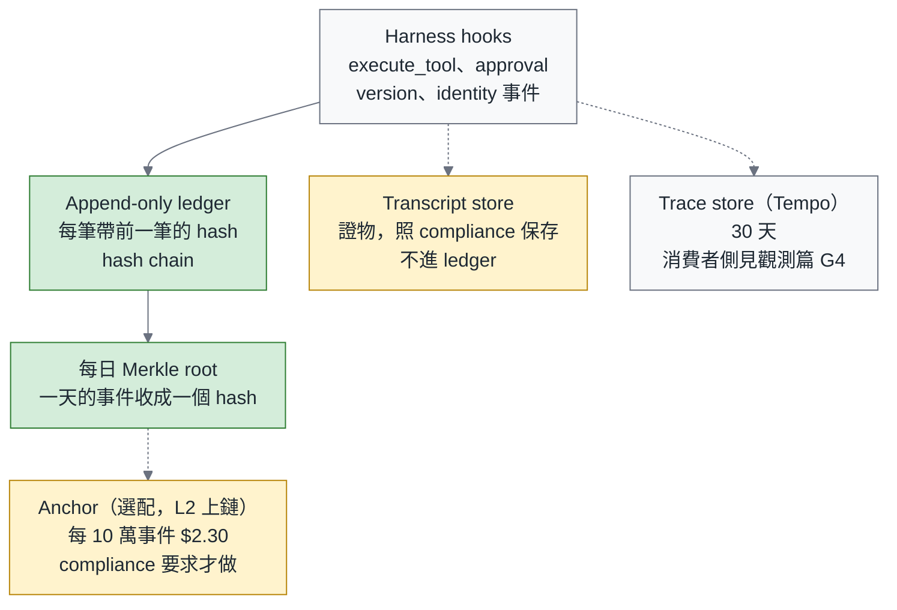
```mermaid
---
config:
  theme: base
  themeVariables:
    fontSize: 16px
    primaryColor: "#f8f9fa"
    primaryTextColor: "#1f2933"
    primaryBorderColor: "#6b7280"
    lineColor: "#6b7280"
    secondaryColor: "#f8f9fa"
    tertiaryColor: "#ffffff"
    clusterBkg: "#ffffff"
    clusterBorder: "#9ca3af"
    edgeLabelBackground: "#ffffff"
  flowchart:
    nodeSpacing: 36
    rankSpacing: 44
    padding: 12
    htmlLabels: true
    subGraphTitleMargin:
      top: 8
      bottom: 12
    curve: basis
---
flowchart TB
    classDef own fill:#d4edda,stroke:#2e7d32,color:#1f2933
    classDef buy fill:#fff3cd,stroke:#b8860b,color:#1f2933
    classDef bad fill:#ffe0e0,stroke:#c0392b,color:#1f2933
    classDef human fill:#e3f2fd,stroke:#1565c0,color:#1f2933
    H["Harness hooks<br/>execute_tool、approval<br/>version、identity 事件"]
    L["Append-only ledger<br/>每筆帶前一筆的 hash<br/>hash chain"]
    T["Transcript store<br/>證物，照 compliance 保存<br/>不進 ledger"]
    R["Trace store（Tempo）<br/>30 天<br/>消費者側見觀測篇 G4"]
    M["每日 Merkle root<br/>一天的事件收成一個 hash"]
    A["Anchor（選配，L2 上鏈）<br/>每 10 萬事件 $2.30<br/>compliance 要求才做"]
    H --> L
    H -.-> T
    H -.-> R
    L --> M
    M -.-> A
    class L,M own
    class T,A buy
```

### I4 — 應變篇 第四節：追責鏈

**圖說**：approval 是 trace 裡的 span，tuple hash 與 trigger_actor 由 harness 寫在 trace 上，一個 status check 拿 trace 與 review event 對 PR，讓「approver ≠ assigner ≠ agent」可執行—五分鐘內答得出誰批准的，而且答案不是 agent 寫的。

**預期尺寸**：`flowchart LR` 包兩個 `direction TB` subgraph、6 節點、實測 708×507、高／寬 0.72（大綱版 711×555；三個節點改斷行，status check 那行的「≠」去掉前後空格才塞得進一行）。tuple 的 hash 寫在 `invoke_agent` 節點第三行、不另開節點（另開會讓左欄變三欄、整張 920–992 寬）；邊只連 subgraph。

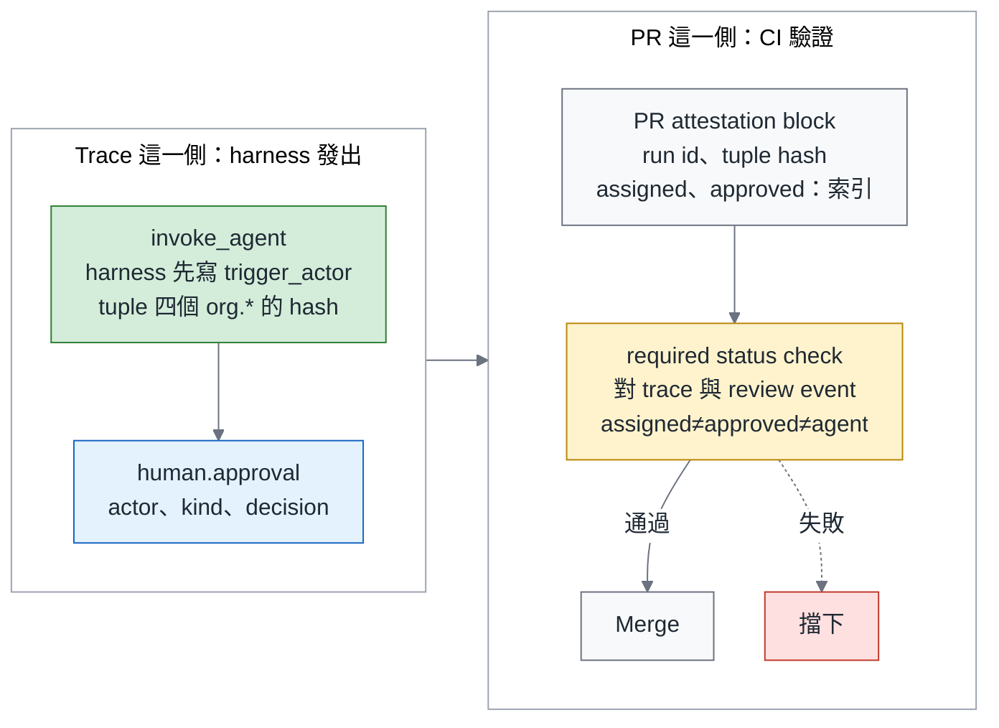
```mermaid
---
config:
  theme: base
  themeVariables:
    fontSize: 16px
    primaryColor: "#f8f9fa"
    primaryTextColor: "#1f2933"
    primaryBorderColor: "#6b7280"
    lineColor: "#6b7280"
    secondaryColor: "#f8f9fa"
    tertiaryColor: "#ffffff"
    clusterBkg: "#ffffff"
    clusterBorder: "#9ca3af"
    edgeLabelBackground: "#ffffff"
  flowchart:
    nodeSpacing: 36
    rankSpacing: 44
    padding: 12
    htmlLabels: true
    subGraphTitleMargin:
      top: 8
      bottom: 12
    curve: basis
---
flowchart LR
    classDef own fill:#d4edda,stroke:#2e7d32,color:#1f2933
    classDef buy fill:#fff3cd,stroke:#b8860b,color:#1f2933
    classDef bad fill:#ffe0e0,stroke:#c0392b,color:#1f2933
    classDef human fill:#e3f2fd,stroke:#1565c0,color:#1f2933
    subgraph tr["Trace 這一側：harness 發出"]
        direction TB
        A["invoke_agent<br/>harness 先寫 trigger_actor<br/>tuple 四個 org.* 的 hash"] --> B["human.approval<br/>actor、kind、decision"]
    end
    subgraph pr["PR 這一側：CI 驗證"]
        direction TB
        D["PR attestation block<br/>run id、tuple hash<br/>assigned、approved：索引"] --> E["required status check<br/>對 trace 與 review event<br/>assigned≠approved≠agent"]
        E -->|通過| F["Merge"]
        E -.->|失敗| G["擋下"]
    end
    tr --> pr
    class A own
    class B human
    class E buy
    class G bad
```

### I5 — 應變篇 第五節：agent postmortem 迴路

**圖說**：一次 incident 從 ledger 重播、寫成四欄的 postmortem，產出一個 eval case（回觀測篇 G5）、一條規則（進 pre-upgrade gate）與一則 guild 分享。

**預期尺寸**：`flowchart TB`、6 節點、實測 655×532、高／寬 0.81（大綱版 655×580；postmortem 節點的「claimed ≠ verified」改用同義的 `silent_fault`，incident 節點改三行）。eval case 節點接觀測篇 G5 的入口，不重畫 eval pipeline；rule 節點接可靠篇的 pre-upgrade gate。

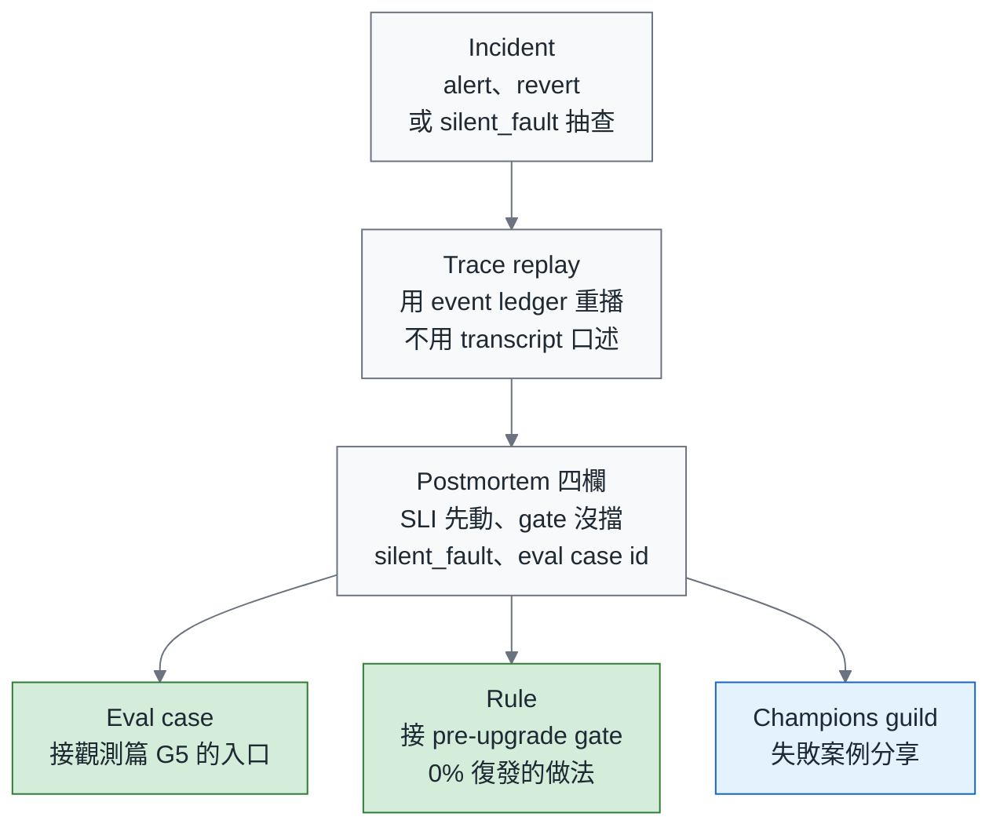
```mermaid
---
config:
  theme: base
  themeVariables:
    fontSize: 16px
    primaryColor: "#f8f9fa"
    primaryTextColor: "#1f2933"
    primaryBorderColor: "#6b7280"
    lineColor: "#6b7280"
    secondaryColor: "#f8f9fa"
    tertiaryColor: "#ffffff"
    clusterBkg: "#ffffff"
    clusterBorder: "#9ca3af"
    edgeLabelBackground: "#ffffff"
  flowchart:
    nodeSpacing: 36
    rankSpacing: 44
    padding: 12
    htmlLabels: true
    subGraphTitleMargin:
      top: 8
      bottom: 12
    curve: basis
---
flowchart TB
    classDef own fill:#d4edda,stroke:#2e7d32,color:#1f2933
    classDef buy fill:#fff3cd,stroke:#b8860b,color:#1f2933
    classDef bad fill:#ffe0e0,stroke:#c0392b,color:#1f2933
    classDef human fill:#e3f2fd,stroke:#1565c0,color:#1f2933
    I["Incident<br/>alert、revert<br/>或 silent_fault 抽查"]
    R["Trace replay<br/>用 event ledger 重播<br/>不用 transcript 口述"]
    P["Postmortem 四欄<br/>SLI 先動、gate 沒擋<br/>silent_fault、eval case id"]
    E["Eval case<br/>接觀測篇 G5 的入口"]
    U["Rule<br/>接 pre-upgrade gate<br/>0% 復發的做法"]
    G["Champions guild<br/>失敗案例分享"]
    I --> R
    R --> P
    P --> E
    P --> U
    P --> G
    class E,U own
    class G human
```

---

## 清單（26 條：14 張 Mermaid 圖 + 12 張表格）

| 圖 | 篇 / 節 | 類型 | 方向 | 節點 | 實測 | 高／寬 |
|---|---|---|---|---|---|---|
| F1 | 總論 §三 | Mermaid | LR 兩欄 | 8 | 651×600 | 0.92 |
| F2 | 總論 §四 | Mermaid | LR 兩欄 | 7 | 662×600 | 0.91 |
| F3 | 總論 §四 | 表格 | — | — | — | — |
| F4 | 總論 §五 | Mermaid | LR 兩欄 | 9 | 825×483 | 0.59 |
| F5 | 總論 §六（封面） | Mermaid | TB | 6 | 629×599 | 0.95 |
| F6 | 總論 §七 | 表格 | — | — | — | — |
| F7 | 總論 §四 | 表格 | — | — | — | — |
| F11 | 總論 §十 | 表格 | — | — | — | — |
| F12 | 總論 §十一 | 表格 | — | — | — | — |
| F13 | 總論 決策工件 | 表格 | — | — | — | — |
| G1 | 觀測篇 §1 | Mermaid | LR 兩欄 | 7 | 657×576 | 0.88 |
| G2a/b/c | 觀測篇 §2 | 表格 | — | — | — | — |
| G3 | 觀測篇 §3 | 表格（視篇幅） | — | — | — | — |
| G4 | 觀測篇 §4 | Mermaid | TB | 6 | 659×368 | 0.56 |
| G5 | 觀測篇 §5 | Mermaid | TB | 7 | 777×436 | 0.56 |
| G6 | 觀測篇 §6 | Mermaid | TB | 8 + subgraph | 661×762 | 1.15 |
| R1 | 可靠篇 §2 | 表格 | — | — | — | — |
| R2a/b | 可靠篇 §3 | 表格 | — | — | — | — |
| R3 | 可靠篇 §5 | Mermaid | TB | 7 | 825×751 | 0.91 |
| R4 | 可靠篇 §6 | Mermaid | TB | 5 | 514×580 | 1.13 |
| R5 | 可靠篇 §7 | 表格 | — | — | — | — |
| I1 | 應變篇 §1 | 表格 | — | — | — | — |
| I2 | 應變篇 §2 | Mermaid | TB | 10 | 814×884 | 1.09 |
| I3 | 應變篇 §3 | Mermaid | TB | 6 | 762×508 | 0.67 |
| I4 | 應變篇 §4 | Mermaid | LR 兩欄 | 6 | 708×507 | 0.72 |
| I5 | 應變篇 §5 | Mermaid | TB | 6 | 655×532 | 0.81 |
