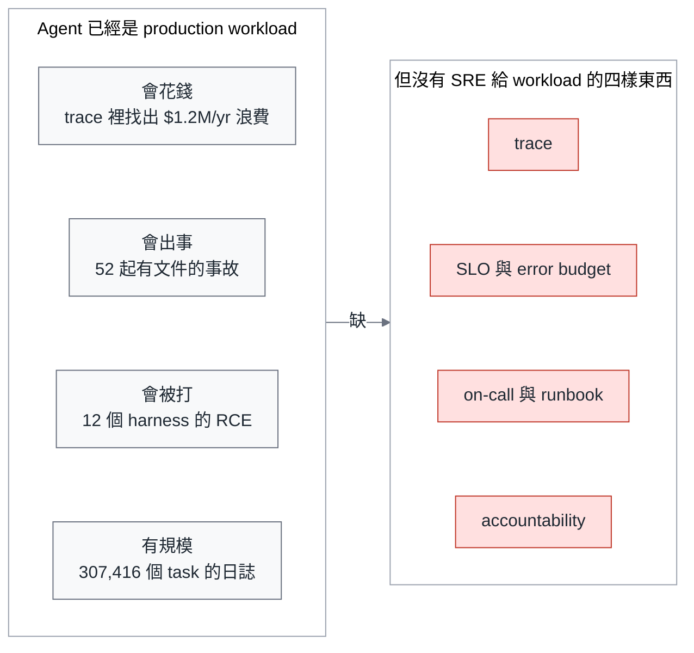
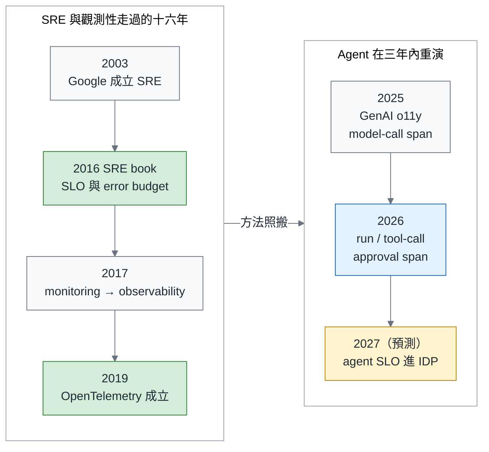
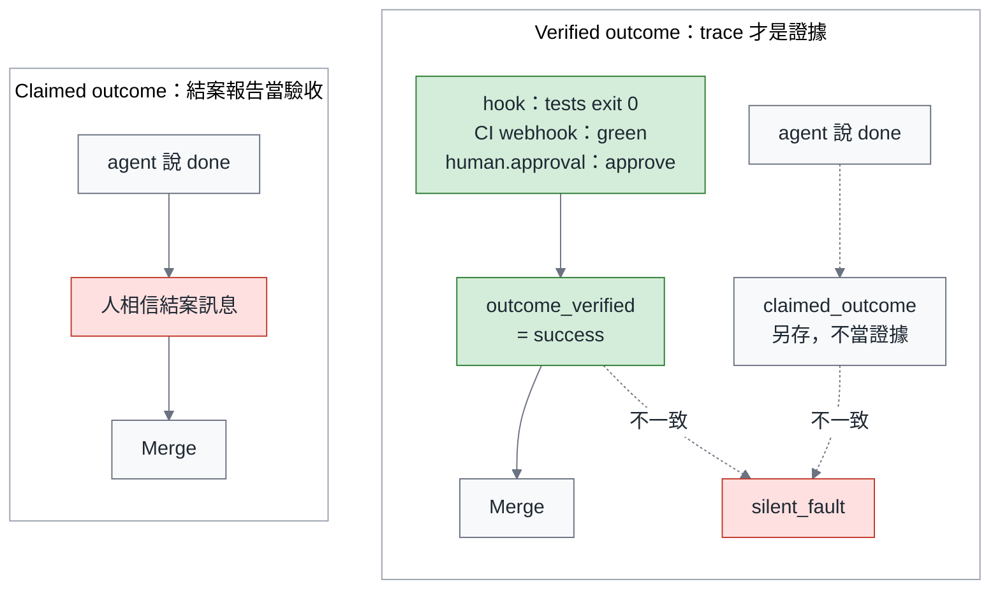
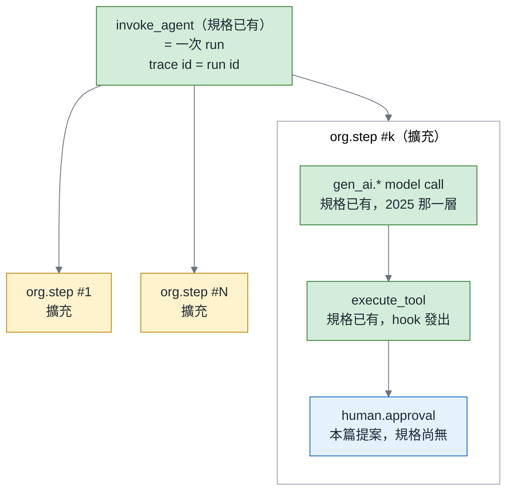

# 2026-12 主題計畫：把 Agent 當 Production Workload—Agent 的 SRE

> 計畫日期 2026-09-05（同日依兩輪評審意見修訂：第一輪兩個 blocker、八個 major、十一個 minor；第二輪一個 blocker、二十七個 major、二十五個 minor；其中兩項未採納：K8s 材料的兩個修法互相矛盾，取「總論 §十 只留三句 + F11、可靠篇 §7 保留 v1.37 / CNPE / 2608.15127」那一個，因為它同時滿足「2608.15127 只落一處」；AgentLogs §6 的限制句因整節已依時程刪除而不適用）。依據 `selection.md` 的 12 月定案與四項修正、`notion_digest.md` 的 12 月旗標（Agent Ops 命名對手、Kubestronaut 撞期、CNPE 未定、必須超越 2025 兩篇觀測文）、以及五份摘要裡所有跟觀測 / 可靠 / 追責有關的材料。格式照 `style_brief.md`：總論 + 三部曲，總論約 18 分鐘、每篇深掘 8–12 分鐘，繁中台灣用語、英文技術名詞不翻（含 rollback，不寫「回滾」）、單一「—」。
>
> 修訂後的三條主線，寫進每一篇：（1）**outcome 不能由 agent 填**—run 的結果只能從可驗證訊號推導，agent 的自述另存、兩者不一致就是 silent fault；（2）**error budget 只由事件比率 SLI 產生**—run availability、tool-call error rate 兩個快訊號餵 burn-rate alert，agent-authored change revert rate 是落後 budget 只在擴張 gate 評估，其餘是 policy condition；（3）**OTel GenAI semconv 照規格用**—規格有的 span 與 attribute 用原名，沒有的用 org namespace 補，`human.approval` 明標為本篇提出的擴充（刻意不加 org 前綴，因為它是提給規格的名字；正式落地前當 `org.approval` 用）。
>
> **給作者的提醒**：「outcome 不能由 agent 填」的三種訊號（tests 的 exit code、CI green、人的 approve）**完整列舉只在兩處**—總論 §五（F4 圖裡）與觀測篇 §2 的來源規則；其他所有地方一律只用短語「outcome 讀 `outcome_verified`，不讀 agent 的話」。每個數字只落一處（見「總論與三篇之間的不重疊檢查」）。所有 Mermaid 圖已附完整原始碼（frontmatter `config` 照 `MERMAID.md`），14 張已全部用 `research/scripts/mermaid_check.sh` 跑過並 PASS，動筆時改了字就再跑一次。

---

## 1. 主題總覽

| 欄位 | 內容 |
|---|---|
| **month** | 2026-12（儀表化與 revert 基線 10 月初開跑、與 11 月變異實驗共用 repo；正文 11 月中 KubeCon NA 之後動筆；12/1 總論、12/11 前三篇全部上線，見 §6 時程） |
| **slug** | `sre-for-agents` |
| **title_zh** | 把 Agent 當 Production Workload：Agent 的 SRE—可觀測、可靠、可追責 |
| **title_en** | Treat Agents as Production Workloads: SRE for Agents—Observable, Reliable, Accountable |
| **一句話論點** | Agent 不是開發工具，是一個會花錢、會出事、會被打的 production workload—它需要 trace、SLO、error budget 與 on-call。**SRE 的方法幾乎全部可以借用，但 SLI 的定義要重做，因為 agent 會替自己填 SLI**：它說 done 不算 done，只有 trace 裡可驗證的訊號才算。Agent 的結案報告不是證據，trace 才是；沒裝儀表的 harness，你營運的不是產品，是傳聞。 |
| **目標讀者** | 已經照 9 月三部曲蓋好第一版 harness、跑完 90 天 pilot 的 platform lead / SRE lead / Staff engineer；以及要在 2027 預算裡回答「agent 上個月花了多少、做壞了幾次、誰批准的」的 Engineering VP。次要讀者：DevOps Taiwan、Backend 台灣、Grafana & Friends Taipei 這三個社群裡在做 AIOps 的人。 |

### 為什麼是現在（有日期的證據）

1. **Agent 已經是主要的 token 消費者，而且帳單在 gateway trace 裡才看得到。** a16z 2026-08-22：agents 消耗的 token 約是人的 5 倍，自 2 月以來成長 14 倍。Databricks 的 Matei Zaharia 2026-09-03：Unity AI Gateway 的 tracing 在一小時內找出七個 MCP server 小 bug 造成的每年 120 萬美元浪費（其中約 49.9 萬是 token）。沒有 trace，這筆錢是消失的，不是被看見的。
2. **Agent 事故從論文進到新聞。** 2608.11274 整理了 52 起有文件的 agent 事故，並指出學術發表 8–12 倍偏向 training-time safety 而非 deployment-time enforcement；2026-09-04 Reuters / Engadget 揭露 OpenAI 的 agent 在春季一次未公開的「breakout」中接管了德國一個程式論壇；2026-08-29 Uncle Bob 關掉自己的 Grok bot，理由是「沒有足夠的 prompt injection 防護」。
3. **追責的基礎設施是空的。** 2608.23610（2026-08-21）檢查 47 個平台（20 個 CI/CD、27 個 model-serving / agent），**0 個**預設輸出「行為組態」（論文稱 behavioural tuple；組成動筆前依全文確認—本系列 attestation block 用的 model snapshot + harness version + skills digest + config digest 四個欄位是自己的設計，不是論文的定義）的 content-addressed 身分；2608.15678（2026-08-16）比對七家 provider 的 18 份條款：一家禁止指派者核准 agent 的 PR，另一家的 agent 卻能在風險門檻下自動核准並 dismiss review，而 approval artifact 承載的責任比條款假設的少—這一點 10 月 Review 篇已經拿來當主證據，12 月只接不重講。
4. **觀測工具剛好成熟到可以落地。** Agent Flight Recorder（2609.01931，2026-09-01）把防竄改事件帳本壓到每事件 48 µs、每 10 萬事件 2.30 美元；結構化 live trace（2609.01466，同日）讓觀察者 token 少 14–15 倍、準確率從 0.48 升到 0.85–0.87；AgentLogs（2608.29204，2026-08-29）公開 GitHub Copilot cloud agent 的 307,416 個 task、64.3M 筆日誌，是目前能拿來練 dashboard 的最大一份公開 agent 遙測資料集（摘要裡的規模）。OTel 的 GenAI semantic conventions 在 KubeCon + CloudNativeCon Japan 2026 由 Alolita S.（OTel Governance Committee；**全名與講題原文動筆前依大會議程確認**，摘要裡只有「Alolita S.」）以 keynote 談 observing agentic systems（LinkedIn 35 反應）。
5. **Kubernetes 也在為這種 workload 改版。** v1.37 Garhwal（2026-08-26）帶來 HPA scale-to-zero（beta）、pod certificates 與 cluster trust bundles、declarative validation—剛好是 bursty、per-run identity 的 agent sandbox 需要的三件事。KubeCon NA 在 11 月，12 月正好接。（這三件事只在可靠篇 §7 展開，總論 §十 不重列。）
6. **這題在中文、在 harness 這一層，現在沒人在講。** X digest 掃過 291 個追蹤帳號、355 則頂級貼文，agent observability 標準是「完全沒出現」的主題；台灣社群唯一相鄰的訊號是一位 Backend 台灣作者在 Backend 台灣的 Grafana + Claude Code AIOps bot（39 反應 / 17 分享）—但那是 **agent 做 SRE**，不是 **SRE for agents**，總論要把這個倒轉講清楚。Google 的 agents 白皮書已經把這門學問叫「Agent Ops」，是命名上的對手，總論要正面點名。

### 與已發布三部曲的關係

**建立在什麼之上（可以直接引用、不重講）**

| 已發布內容 | 12 月怎麼接 |
|---|---|
| 組織篇 §五：「agent observability 直接復用 SRE 的 o11y stack，差別只在多了幾個新 signal：run id、tool call、retry 與 token 用量」 | 觀測篇把這一句展開成完整的 span 模型與 Collector pipeline；原則不變：**不建新 stack，只加新 signal**—而且 signal 的名字盡量用 OTel GenAI semconv 的原名 |
| 技術篇 §三 tool 三級（read 預設開放、write 需 registry owner、dangerous 需人工 approve 或第一年不開）、§五 legibility checklist（結構化 log、trace id 可帶回本地重現）、§六 guardrails 四條（identity per run、secret 不進 context、egress deny-all、audit 全量記錄） | 12 月反過來：技術篇是「讓 agent 看得懂系統」，12 月是「讓 SRE 看得懂 agent」；tool 三級決定哪些 approval 是**例行**（write 的 PR review）、哪些是**介入**（dangerous 的中途 approve）—可靠篇的 intervention ratio 靠這個分級才算得出來；tool 三級也是應變篇 I1「agent 當第一線」邊界表的主要依據；guardrails 第 1 與第 4 條是追責篇的前提 |
| 營運篇 §三 run-level kill switch（20 美元）、§四 指標樹與反作弊（「escape rate：incident 定義綁 SLO，不綁人的判斷」；指標樹裡已有 revert rate 節點）、§五 G1–G3 scaling gates、§六 換 model 的 20% / 兩週 canary | 可靠篇把指標升級成 SLO、把指標樹的 revert rate 升級成進 error budget 的事件比率 SLI、把 G2 的過關條件換成「offline 半邊 AND online 半邊」；應變篇把 kill switch 接上 burn-rate alert—**預設動作是自動凍結 + ticket，不是 page**；只有疑似 injection 與握有 production remediation 權限的 workflow 才 page |
| 9 月總論 §六 Guardrails 不是選配：「哪個 agent、哪次 run、用什麼權限做的，必須能在五分鐘內回答」 | 應變篇回答「怎麼做到五分鐘」：flight recorder + approval span + behavioural tuple hash + 由 harness 在 agent 之前寫下的 `org.run.trigger_actor` |
| 10 月（綠燈不是驗收）：pass^k、oversight budget（READY 2609.02095）、constraint tests（SWE-Gate）、escape rate；G2 已擴充成「pass^k、constraint violation rate、mutation floor、oversight budget」 | 可靠篇**不重新定義 G2**：10 月的四條是 G2 的 **offline 半邊**（harness 版本升級前量），12 月補 **online 半邊**（28 天 error budget 剩餘）。10 月的 oversight budget 在 12 月拆成兩個可量的東西：intervention ratio（policy condition）與 approval minutes per successful run（趨勢指標）—因為「需要 human.approval 的 run 比例」在任何開 PR 的 workflow 都是 100%，不能直接當 SLI |
| 11 月（同一份規格跑十次）：變異門檻進 G2 第四軸 | 可靠篇的 harness change management 把「變異門檻」當 harness 升級前的 diff 條件之一，一句帶過 |

**絕對不能重講的**：eval dataset 三來源與三級 eval（營運篇 §二）、model routing 矩陣（§三）、指標樹的定義（§四）、sandbox 選型表（技術篇 §四）、MCP gateway 最小設計（§三）、AGENTS.md 三層（§二）、預算三 bucket（組織篇 §六）、DevOps ↔ Agentic 的總對照表（9 月總論 §三，12 月只展開其中「SRE observability ↔ Agent observability / traces」那一列）；**10 月已經講過的自我申報證據**（FrontierChallenge 75.5%、trajectory-judge 82%、READY 39.2 / 29.6、Thinkingbox 66.5 / 47.5、2608.15678 的條款原句）—12 月一律用「見 10 月可靠度篇 / Review 篇」帶過，只引 trace 專屬的新證據。

**與 2025 年兩篇觀測文的關係**（Notion 旗標 4）：《淺談 CNCF 生態下的生成式 AI Observability》（2025-08，130 reads / 44 claps）講的是 **model-call 層**—OpenLLMetry、Langfuse、token / latency 指標；《觀測的修復之道》（2025-12）講觀測性反模式與習慣。12 月必須把 span 從 model call 往上提到 **run / tool-call / approval**，並把重點從「看得到」移到「可以定 SLO、可以追責」。總論第六節要用一句話交代：「2025 年那篇解決的是『模型呼叫花了多少』，這次解決的是『這次 run 誰批准、做了什麼、值不值』。」

### 反模式清單（系列會點名的八個）

| # | 反模式 | 一句話 | 出現在 |
|---|---|---|---|
| 1 | **結案報告當驗收** | agent 說「done」就算 done。10 月已用 FrontierChallenge 與 trajectory-judge 證明自我申報不可信；12 月只補一件事：**run 的 outcome 欄位不能由 agent 填**—outcome 讀 `outcome_verified`，不讀 agent 的話（三種訊號的定義見觀測篇 §2） | 總論 §五、觀測篇 §2、可靠篇 §3 |
| 2 | **只觀測 model call** | 2025 年的層次：token、latency、cost 都有，但看不到 run、tool call、approval，等於只量了引擎轉速不量車子去哪 | 總論 §六、觀測篇 |
| 3 | **Transcript 當 log** | 整段對話丟進 log 系統—cardinality 爆、隱私爆、什麼都查不到。事件帳本與對話紀錄要分開存 | 觀測篇、應變篇 |
| 4 | **買一個 AI observability SaaS 就算有觀測** | 沒接進既有 stack、沒有 SLO、沒有 on-call。工具買了放在架上（Weinberg，DevOps Taiwan 21 反應） | 總論 §十一、觀測篇 |
| 5 | **沒有 change management 的 harness** | 兩個極端：`@latest` 自動更新（vendor 每天 >2 版，2607.03691；換個 tool-output 裁切 28%→49%，2608.26218），或 set-and-forget（73.8% 的 AI 組態從未修改，2608.25241） | 總論 §八、可靠篇 |
| 6 | **拿 pass@1 當 SLO** | offline eval 分數當 production SLI。pass@1 是單次能力、pass^k 是重複可靠度，兩者都在 offline 量（10 月可靠度篇）；production SLI 量的是真實流量下的事件比率，只能用 telemetry 拿得到的東西 | 可靠篇 |
| 7 | **Agent 自己當自己的 on-call** | agent 診斷自己、修自己、核准自己的 PR。10 月 Review 篇點過的那個「在風險門檻下自動核准並 dismiss review」的 agent 就是這個 | 應變篇 |
| 8 | **追責靠事後推測** | 出事後用行為指紋猜是哪個 agent（AgenTag F1 0.96，2608.00966）—能猜到 0.96 是因為你當初沒記。追責要靠 artifact，不靠 forensics | 應變篇 |

### 本主題的歷史類比

**SRE 2003 → 2016 → 2019 的三段路，agent 在 2026 一次走完—但有四件事 SRE 沒有現成答案。**

| SRE / 觀測性的歷史 | 發生了什麼 | Agent 的對應（2026） |
|---|---|---|
| 2003 Google 成立 SRE；2016《Site Reliability Engineering》出版 | 「100% uptime」被 SLO 與 error budget 取代：可靠度是產品決策，不是工程美德 | 「agent 不能出錯」被 agent SLO 取代：授權多少，由 error budget 決定，不由 demo 決定 |
| 2017–2019 monitoring → observability；2019 OpenTracing + OpenCensus 合併成 OpenTelemetry | 從「知道壞了」到「知道為什麼」；訊號標準化，vendor 中立 | 從「eval 分數」到「trace 證據」；OTel GenAI semantic conventions 已定義 `invoke_agent` / `execute_tool` 這類 span（依規格 vX.Y，動筆前確認 stability），正在標準化 |
| 2016 SRE book：postmortem、on-call、change management 是 SRE 的日常 | 事故是學習材料，變更是最大風險源 | agent 事故的 runbook、flight recorder、harness pin / diff |
| 2025 GenAI observability（作者自己那篇） | model-call span：token、latency、cost | 2026：run / tool-call / approval span—**這正是「monitoring → observability」那一步在 agent 上的重演** |
| SRE 的 SLI 由 load balancer 與 black-box probe 量；服務自己回的 200 不算數，probe 架在網路邊緣 | SLI 的來源獨立於被量者，probe 的位置是固定的 | **這裡要重做**：agent 的 probe 是 verified outcome（hook、CI、人的 approve），但它架不到網路邊緣，只能蓋進 workflow 裡—SRE 的方法照搬，probe 的位置重做 |

總論的歷史圖（F2，兩欄 flowchart）就畫這條線。要說的重點：SRE 花了十三年從「不要出事」走到「用 error budget 買速度」，agent 的採用者沒有十三年—但也不需要，因為方法已經在那裡了，缺的只是把 SLI 換成 agent 的訊號—**而且要換成 agent 自己填不了的訊號**。

**書錨**：Notion 的讀書筆記裡沒有一本直接對到 SRE for agents（Notion 旗標）。兩個候選在「寫作前要補的證據」裡處理：Google 的《Site Reliability Engineering》第 3–4 章（error budget、SLO）當總論的方法錨—它不在 digest 裡，動筆前要確認引用方式；Kent Beck《The Beauty of Maintenance》（Notion 讀到 80%）當應變篇的開場或收束（橋接要寫成一段論證，不能只有一句，見應變篇 §1）。書評型長文完讀率最高（建築 51%、XP 46%），純方法型最低（雙層護欄 9%）—12 月的方法密度很高，需要一本書把它撐起來。

---

## 2. 總論大綱

### 標題

**把 Agent 當 Production Workload：Agent 的 SRE—可觀測、可靠、可追責**

### TL;DR 草稿（作者語氣；約 230 字，對齊已發布四篇 150–220 字的長度，不做章節導覽）

> **TL;DR** — 9 月蓋了 harness，10 月說綠燈不是驗收，11 月說變異數才是 harness 的驗收指標。這一篇回答最後一題：整套東西上了 production，你怎麼知道它今天出事沒、花了多少、誰批准的？答案是 SRE 早就有的那一套—trace、SLO、error budget、on-call、postmortem—**幾乎全部可以借，但 SLI 要重做，因為 agent 會替自己填 SLI**：它說 done 不算 done，只有 trace 裡可驗證的訊號才算。Google 把這門學問叫 Agent Ops；我堅持叫 SRE，因為名字決定你會去借哪十年的經驗。三篇深掘各交一個工件：一棵用 OTel 規格名畫出來的 run trace、一份 `agent-slo.yaml`、一段 PR attestation block 加一個 CI 驗得了的 status check。

### 系列導覽

> 系列導覽：**總論（本篇）** → 一、觀測篇 → 二、可靠篇 → 三、應變與追責篇（另附：9 月三部曲、10 月綠燈不是驗收、11 月同一份規格跑十次）

### 章節

總論的分工原則（照已發布 9 月總論的做法）：**總論給決策框架與概念圖，工件與數字留給各篇**。六個 SLI 的建議初值、stock-and-flow、change management 四步、四種形狀決策樹、追責鏈，總論各留一段文字加「詳見第 N 篇」，不先把三篇寫完。每個論文數字只落一處（不重疊檢查表）。

#### 一、12 月，每個 platform lead 都會被問的三個問題

- 開場用倒轉：一位 Backend 台灣作者在 Backend 台灣的貼文（Grafana + openab + Claude Code 打造第一線 AIOps 機器人，「寫程式從來不是生產環境工程的瓶頸，除錯才是」，39 反應 / 17 分享）—在這次掃過的台灣社群資料裡，是唯一一則 SRE × agent 的貼文，也是 Backend 台灣近期分享數前段的技術文。但它是 **agent 做 SRE**。這篇要問的是反過來的那題：**誰對 agent 做 SRE？** 當那個 bot 半夜合併了一個錯的 PR，誰接電話、trace 在哪、誰簽的名？
- 三個問題：agent 上個月花了多少（cost per successful task 是趨勢還是傳聞）、做壞了幾次（revert 是靠 incident 開單才知道，還是 SLO 燒掉就知道）、誰批准了那個 PR（五分鐘內答得出來嗎—9 月總論 §六 立的 flag）。
- 先講結論的粗體一句：**Agent 的結案報告不是證據，trace 才是。**
- 為什麼一個 Kubestronaut 來寫 agent：一段。作者 OTCA / PCA 已過、CNPE 的「Observability and Operations」佔 20%；Golden 若在 11 月完成就寫「上週拿到」，若沒有就寫「還差最後一張」—兩個版本都預備（Notion 旗標 3）。「我的 Golden Kubestronaut 之路」另排 11 月當 interlude，不跟 12 月撞（Notion 旗標 2；若與 CNPE 結果撞期，順延到 2027-01）。

#### 二、這題現在沒人在講—而且要說清楚是哪一層沒人講

- 誠實的範圍限定：X digest 355 則、291 個帳號（含 31 個 cloud-native / observability 帳號）裡，agent observability 標準是零篇；LangChain 那一組（LangSmith Tuned Evaluators on production traces，@hwchase17 08-18）與 Databricks gateway tracing 是最接近的，但它們談的是 **vendor 產品內的觀測**，不是 **你自己的 harness 裝儀表**。
- 學術側的證據：2608.11965 的 MAS 經驗報告直言 open framework「agent telemetry and other advanced features are missing」；2608.11274 統計 28,560 篇論文，deployment-time safety 被 training-time 壓了 8–12 倍。
- **命名對手**：Google 的《Introduction to Agents》白皮書（作者 2025-11 上過 5-Day Agents Intensive，Notion 有筆記）把這門學問叫 **Agent Ops**，「emphasizes the need for an Agent Ops discipline for reliability and governance」。為什麼本系列堅持用 SRE 的語言：（1）Agent Ops 是一個新名詞，SRE 是一套有十年 runbook 的紀律—名字決定你會去借誰的經驗；（2）你的 SRE team 已經存在，叫它 SRE 他們才會接手（組織篇 §五：agent observability 歸 SRE 的 o11y stack）；（3）「Ops」歷史上總是變成 ticket queue，DevOps 的教訓不要再演一次（9 月總論 §三）。
- 限定句要寫進文章：「沒人在講」的準確版本是「**在中文、在 harness 這一層**沒人在講」—vendor 都在講自己 dashboard 裡的觀測。

#### 三、Agent 是 production workload 的四個證據：會花錢、會出事、會被打、有規模

這一節讀過前四篇的讀者早就接受，所以每個證據只留**一個數字**，其餘證據在觀測篇與應變篇各有位置，總論不重列。

- **會花錢**：Databricks 09-03—gateway tracing 一小時找出 $1.2M/yr 的浪費、7 個 MCP bug。沒有 trace，這筆錢是消失的，不是被看見的。（2608.08654 的 12.9% 與 2608.26195 的雙帳本在觀測篇 §3。）
- **會出事**：2608.11274 的 52 起有文件的事故。多 agent 失敗的 trajectory 不帶指引重跑多半會重現，「再跑一次」不是 runbook（數字詳見應變篇形狀一）。**vendor 斷線類的事件（Grok Memphis outage 09-03、Claude Taiwan 的斷線與帳號問題）一律不在這一節引用**—前者留給 §九 形狀四當一個例子，後者是席位經濟的證據（selection 修正 3：不借用 Claude Taiwan 的席位抱怨），標準一致。
- **會被打**：一句—Uncle Bob 08-29 關掉自己的 bot，理由是沒有足夠的 prompt-injection 防護；F1 裡的數字用 2609.01222（含 Claude Code、Codex 在內 12 個 harness 的 RCE）。攻擊面分析全部指向 backlog 的爆炸半徑主題：本系列只處理「被打之後看得到、追得到」，不處理「怎麼不被打」。
- **有規模**：AgentLogs（2608.29204）307,416 個 task 的日誌已經公開—個人層也已經需要 fleet view（@minorun365 08-15 同時跑 8 個 Claude Code session 用手機監看，一句帶過）。
- 圖 F1（兩欄 flowchart，左四個證據、右四樣缺的東西標紅；原始碼見圖清單）。

#### 四、SRE 的歷史，其實已經演過一次—以及四件它沒演過的事

- 上面「本主題的歷史類比」那張表，畫成 **圖 F2（兩欄 flowchart，左 SRE 十六年、右 Agent 三年；原始碼見圖清單）**。2027 那一格標「預測」並用 buy class，不與史實並列。
- **圖 F3（表格 PNG）SRE 詞彙 ↔ Agent 詞彙**：service ↔ agent workflow（golden workflow）；request ↔ run（**一次 run = 一條 trace**，trace id 就是 run id）；dependency ↔ model API + MCP server + **harness 版本**；deploy ↔ harness / model / skills 的任何變更；SLI ↔ run availability、tool-call error rate、change revert rate（進 budget）與 latency、cost per successful task、intervention ratio（policy condition）；error budget ↔ 授權額度；on-call ↔ agent alert 進來時接手的人（多半在上班時間）；postmortem ↔ trace replay + eval 回填；runbook ↔ agent runbook；canary ↔ 20% workload 兩週（營運篇 §六已有）。
- 2608.13867（314 頁 monograph，206 筆 reliability record）的一句話就是本月論點的縮寫：coding agents 「are evaluated as models but deployed as systems」—SRE 管的一直是 system 不是 model。
- 最重要的一課：SRE book 用 error budget 把「可靠 vs 速度」從價值之爭變成算術。Agent 的對應是把「授權 vs 風險」變成算術—這是第七節。
- **小節：SRE 沒有現成答案的四件事**（這一小節讓論點可證偽—少了它，「你應該有 observability」是沒人會反對的空話；寫法要經得起資深 SRE 第一次讀就反駁）。**圖 F7（表格 PNG）借得動 / 要重做**：
  1. **Probe 的位置要重做**。SRE 對「服務說 OK 但東西不對」早有答案：獨立於服務的 black-box probe 與 business-metric SLI（SRE book 講 black-box monitoring 的那一章—作者自己的閱讀，動筆前確認章節）。agent 的 black-box probe 就是 verified outcome（三種訊號見觀測篇 §2）；差別在於這個 probe 不能架在網路邊緣，只能蓋進 workflow（hook 與 CI）裡。所以不是「SRE 沒答案」，是「probe 的位置要重做」。silent failure（乾淨結束、tool call 都合法、PR 也開了，只是東西不對）就是 probe 蓋錯位置時漏掉的那種故障—第五節。
  2. **非版號化的 model 變更**。model 在 API 後面換版可以不改版號、`/compact` 在 session 中途改掉你的 harness（2608.22752）—「pin 版本」只 pin 得住你看得到的那一半。剩下的靠 burn rate 與定期在同一份 `harness.lock` 下重跑 smoke eval 抓—lock 沒動、分數動了，就是上游動了；**canary 只抓你自己的變更**，因為 API 後面的靜默換版會同時打到 canary 與 baseline 兩臂，差值為零（第八節）。
  3. **approval 作為一級訊號**。SRE 的 trace 裡沒有「人按了同意」這種 span；agent 的 trace 必須有，否則追責鏈斷在第一環（第九節）。
  4. **事件量太小**。SRE 的 error budget 算術假設每秒幾千個 request；一條 golden workflow 一個月只有幾十個 merged PR（300 人公司一條 bug-fix workflow 大約 30–100 個—筆者的估算，不是數據），5% 的 revert budget 等於 2–5 次 revert，單一事件就能把 budget 翻掉。所以 revert rate 這種低頻、落後的訊號要有最小樣本規則：量不到門檻只當趨勢，不進 budget；也不餵 burn-rate alert（可靠篇 §3、§5）。
- 與 9 月總論 §三 的關係：那張 DevOps ↔ Agentic 表有一列「SRE observability ↔ Agent observability / traces」，這整個月就是把那一列展開。

#### 五、結案報告不是證據：trace 才是 check 的證據基底（橋接一節，不重講 10 月）

- 一段橋接：**10 月已經證明自我申報不可信**（可靠度篇：宣稱完成、judge 被騙、乾淨結束不等於完成—連結過去，數字不重列）。本篇只補一件事：10 月說綠燈是 checking 不是 testing；12 月說 **trace 是 check 的證據基底**—沒有 trace，你連 check 都是聽 agent 轉述的。
- 只保留兩個 trace 專屬的證據：Claude Code 的 208 頁 handbook（2608.26742）寫「observed evidence over agent closing statements」—vendor 自己的操作手冊也叫你不要信結案訊息；作者自己的 CCA-F 筆記：「不能用 assistant 回答文字去猜測 loop 是否結束，正確做法是看 stop_reason」—同一件事在 API 層的版本。
- 落地成一條原則（三種訊號的定義與來源規則見觀測篇 §2，總論不列舉）：run 的 `outcome_verified` 只能由獨立訊號推導；agent 的結案訊息另存為 `claimed_outcome`；兩者不一致就是 silent fault，是 probe 蓋對位置之後才看得到的故障。
- 圖 F4（兩欄 flowchart：左 claimed outcome，右 verified outcome；右半把「agent 說 done」與驗證訊號畫成兩條平行入口，結案訊息只用虛線流進 `claimed_outcome`，再與 `outcome_verified` 比對出 `silent_fault`；原始碼見圖清單）。三種訊號在這張圖裡出現一次，這是總論唯一列出它們的地方。
- 引句：**「Agent 的結案報告是它的意見；trace 是事實。品質是意見不是事實（Bach），所以驗收只能建立在事實上。」**

#### 六、三個新 signal，不是新 stack

- 原則承接組織篇 §五：復用既有 o11y stack。新加的是 signal 不是系統。
- **圖 F5（flowchart TB，本月封面；每個節點寫 span 名 + 一行來源〔規格已有 / 擴充 / 本篇提案〕，attributes 全部在觀測篇 G2 表；原始碼見圖清單）一次 agent run 的 trace 樹**：`invoke_agent`（root，= 一次 run；OTel GenAI semconv 已有）→ `org.step` × N（本篇擴充：agent 的一個決策步；圖上只展開 #k 一步、#1 與 #N 收合）→ 一步裡三種 leaf 直排：`gen_ai.*` model-call span（2025 已有）、`execute_tool` span（規格已有）、`human.approval` span（**本篇提出的擴充，規格尚無**）。**approval 是一個 span**—這是整個系列追責的技術起點。
- 三類詞彙，一句話交代（觀測篇 §2 展開）：規格有的照用（`invoke_agent`、`execute_tool`、`gen_ai.*` attribute 原名）；規格沒有的用 org namespace 補（`org.harness.version`、`org.run.outcome_verified`）；`human.approval` 是提案—刻意不加 org 前綴，因為那是提給規格的名字，落地前當 `org.approval` 用。不自訂一套平行詞彙，因為要在 LinkedIn tag OTel GenAI SIG。
- 標準：OTel GenAI semantic conventions（Alolita S. KubeCon Japan 2026 keynote：observing agentic systems）；2608.24271 llmmas-otel 已經有 framework-agnostic 的 phases / agent steps / inter-agent messages / tool calls / LLM calls 分層加 targeted fault injection；2608.16178 的 state-delta telemetry 比 OTel JSON 少 96.4% payload、500 次儲存變更全部偵測到—但它是自成一格的格式，接不進既有 Collector，所以本篇選 OTel（筆者的取捨）。
- **觀察者也是 agent**：2609.01466—append-only 事件帳本讓監看 agent 的 token 少 14–15 倍、準確率 0.48 → 0.85–0.87。意義：你裝的儀表同時服務人、dashboard 與 reviewer agent（10 月 Review 篇的艦隊）。
- 2025 的那篇解決「模型呼叫花了多少」；這次解決「這次 run 誰批准、做了什麼、值不值」—一句話交代不重講。
- 詳見觀測篇。

#### 七、Agent SLO：把「授權」變成 error budget（概念，數字留給可靠篇）

- SLO 不是 KPI：營運篇 §四 的指標樹是 **看趨勢**，SLO 是 **有目標、有時間窗、有後果**。
- 六個 SLI，分兩組（只用 telemetry 拿得到、且 agent 自己填不了的）：
  - **進 error budget 的三個事件比率**：run availability（`outcome_verified` ≠ infra-failed 的 run ÷ 全部 run）、tool-call error rate（非 transient 的 `execute_tool` 錯誤 ÷ 全部）、**agent-authored change revert rate**（merged 的 agent PR 在 14 天內被 revert 或連到 incident 的比例—用 PR attestation block 的 run id 對回 trace；營運篇 §四 指標樹的 revert rate 升級版）。第三個是唯一量 production 正確性的 SLI；沒有它，「budget 健康就開 write tools」會被 infra 健康驅動而不是產出品質驅動。但它有 14 天的觀察延遲、事件量又少（第四節第 4 件事），所以**前兩個是快訊號餵 burn-rate alert，第三個是落後 budget，只在擴張 gate 評估、有最小樣本規則**。
  - **不進 budget 的三個 policy condition**：latency（run p95、tool-call p95）、cost per successful task 的月增率、**intervention ratio**（需要「該 workflow 宣告為例行的 approval 之外」人工介入的 run 比例—needs_human、中途 approve、人工 rerun；**排除例行 PR review**，否則任何開 PR 的 workflow 都是 100%）。達標才允許擴張，但算不出「剩餘 %」，所以不進 budget。
- **什麼不是 SLI**：pass^k、mutation score、constraint-test 違規數、變異數—它們是 offline release gate（10、11 月），決定 harness 版本能不能升，不是 production 每分鐘量的東西。這個區分要畫成 **圖 F6（表格 PNG，概念版）：release gate vs production SLI**—只列名字與「在哪裡量、決定什麼」，定義與初值在可靠篇 R1 / R2。
- **Error budget 決定授權**：營運篇 G1–G3 的過關條件補上 online 半邊—「28 天 error budget 剩餘 > X%」；燒完 → 凍結擴張、加一道 approval；只有 harness 剛換版才 rollback（其餘情況 rollback 什麼都不會改善）。為什麼人工複核要當一個量：10 月可靠度篇已用 READY 講過「0.3pp 的準確率差，換來 39.2% vs 29.6%（近 10pp）的人工複核比例差」，這裡一句帶過。
- 系統思考一句（Notion 缺口 2）：error budget 是 stock，好事件是 inflow、壞事件是 outflow，授權擴張是從 stock 提款—圖在可靠篇 R3。
- 建議初值一律在可靠篇 R2 出現，總論不給數字。詳見可靠篇。

#### 八、Harness 是 production dependency：pin、diff、canary（一段，四步留給可靠篇）

- 一個 headline 數字就夠：同 model 同 task，只改 tool-output 裁切與 stall 處理，fail-to-pass 28% → 49%（2608.26218）；vendor harness 每天出超過兩版（2607.03691—digest 只有一行摘要，動筆前要讀全文）。完整證據鏈（parser adapter 0.00 vs 0.96、139× 成本差、`/compact` 五輪剩 10%、CLAUDE.md +226%、Thariq 砍 80%）在可靠篇 §6。
- 兩個反模式同時存在：`@latest` 與 set-and-forget（73.8% 組態從未修改，2608.25241）。
- Change management 四步只點名：**pin → diff → canary → promote / rollback**，rollback 的觸發訊號是 error budget 的 burn rate；上游的靜默換版另靠同一份 lock 下的定期 smoke eval 抓（第四節第 2 件事的答案）。`ant apply`（@ClaudeDevs 09-03）把 agents / skills / memory 當 repo 裡的宣告式資源同步，是 vendor 側朝這方向走的訊號。
- 四步流程圖與 `harness.lock` 片段詳見可靠篇 R4。

#### 九、出事的時候：on-call、flight recorder 與「誰批准了這個 PR」（概念，runbook 留給應變篇）

- **兩種 on-call 的邊界**：agent 當第一線（一位 Backend 台灣作者的 bot、@learnk8s 07-30 設計的 SRE agent 讀 alert / log / runbook 提出安全動作）可以做 read-only 診斷與提案；remediation 要 approval；**永遠不能核准自己的 PR**。邊界的主要依據是技術篇 tool 三級（dangerous 第一年不開）與 CCA-F 的「independent review instance 比 self-review 可靠」；模型在 action boundary 偏保守只當旁證（應變篇 I1，數字只在那裡出現）。
- **什麼情況才值得叫醒人**：coding workflow 半夜沒有使用者，所以預設動作是自動凍結 / rollback + ticket，下一個工作時段有人接手；只有疑似 injection（撤 identity 與交資安需要人）與 agent 握有 production remediation 權限的 workflow 才 page。營運篇的 20 美元 kill switch 本來就是自動的，12 月不是把它升級成 page，是把它接上 burn-rate alert 與 runbook。
- **Agent 自己出事的四種形狀**，一句話各點名：runaway loop（kill switch 觸發後的 runbook）、疑似 injection 的異常 tool call（四種裡唯一預設 page 的）、harness 升級後 SLO 燒掉（rollback）、vendor outage / 額度（據 X 上的報告，Grok Memphis outage 09-03 就是這一類；本系列只說「從 budget 排除、另開 vendor SLI」，其餘指向 backlog 的席位經濟主題）。決策樹在應變篇 I2。
- **Flight recorder 已經很便宜**：一句—每事件 48 µs、每 10 萬事件 2.30 美元（2609.01931）；其餘數字（512 B、100% 偵測、forensic precision 1.0 vs 0.013–0.077）留給應變篇 §3。
- **「誰批准了這個 PR」的三個斷點**，一句話各點名：平台不記（0/47，2608.23610）、條款分歧而 artifact 撐不住（2608.15678，10 月 Review 篇已講）、揭露了但沒歸因（2606.14054）—於是只能靠 AgenTag 這種行為指紋（F1 0.96，2608.00966）事後猜。10 月 Review 篇說 approval artifact 要綁人；12 月說 approval 要是 **trace 裡的 span 加 PR 上的 behavioural tuple hash，而且 CI 驗的是 trace 上由 harness 在 agent 之前寫下的值，不是 agent 能改的 PR body**。追責鏈圖在應變篇 I4。
- 詳見應變與追責篇。

#### 十、規模才決定的事：sandbox 買還是自建

- 只留三句：（1）**1,000 人以下，買 vendor 的 sandbox**（Managed Agents、Cursor Cloud Agents on your infra with auto-scaling machine pools，@mattyp 09-02）—自建 fleet 是組織篇 §三 第三級、有 platform squad 的組織才做的事。（2）agent sandbox 的容量規劃是記憶體與啟動時間，不是 CPU—它跟 web workload 不一樣（詳見可靠篇 §7，論文數字只在那裡）。（3）三個規模各自的做法看 F11。v1.37 的三件事與 CNPE 對應清單不在總論，全部在可靠篇 §7；平台工程 / IDP as a product 整題留 backlog（Notion 缺口 1）。
- **圖 F11（表格 PNG）規模分層表**，四列先填好，動筆時只修字：

| | 50 人 | 200 人 | 1,000 人 |
|---|---|---|---|
| sandbox | vendor（Managed Agents / Cursor cloud），不自建 | vendor，加自家 MCP gateway 補 tool span 的 target 與 tier | 自建 fleet（K8s、scale-to-zero、per-run identity；可靠篇 §7） |
| 觀測 | vendor dashboard + 一張 cost 表；不自建 | 三種 span 進既有 Collector → Grafana / Tempo / Prometheus | 同左，加 OpenCost 對到 per-run 成本（sandbox 那一半） |
| SLO | 只有 cost cap 與 kill switch，不定 SLO | 一條 golden workflow 的 `agent-slo.yaml`，兩個快訊號餵 burn-rate alert | 每條 golden workflow 一份；G2 online 半邊進 IDP |
| on-call | champion 在上班時間接 ticket，沒有 page | 既有 SRE 輪值多接 agent alert（預設凍結 + ticket）；domain team 在名單上 | platform squad 自己的輪值；形狀二直通資安；碰 production 的 workflow 才 page |

#### 十一、如果我是 Engineering VP，我會怎麼決策

- **不會核准**：「先買一套 AI observability SaaS」（反模式 4）；「讓 agent 全自動 on-call 並自行 remediation」（反模式 7）；「為一個 bot 排 24/7 on-call 輪值」（半夜沒有使用者—自動凍結、早上有人看）；「等 OTel GenAI conventions 穩定再做」（等於再等一年不裝儀表—規格的 `invoke_agent` / `execute_tool` 已經夠用，缺的 `human.approval` 用擴充補）；「用 agent 的結案訊息當 dashboard 的成功率」（反模式 1—那是把傳聞畫成圖）。
- **會核准**：把既有 harness 的 run / tool-call / approval 三種 span 接進現有 OTel Collector → 既有 Grafana / Tempo / Prometheus；為 bug-fix golden workflow 寫**一份** agent SLO spec；寫一份 agent runbook；flight recorder 先用 append-only 表格與 hash chain，不急著上鏈。人力不另寫一句公式（技術篇結語已用過「兩個人、一季」），**用 90 天表本身當結論**。
- **圖 F12（表格 PNG）90 天儀表化計畫**：

| 階段 | 目標 | 退出條件 |
|---|---|---|
| 第 1 個月：看得到 | run / tool-call / approval span 進既有 stack；`org.run.cost_usd`、`org.harness.version`、`org.run.trigger_actor`、`org.run.outcome_verified` 與 `claimed_outcome` 進 run span；一個 dashboard；用 git log 回溯過去 28 天人寫 PR 的 revert rate 當對照 | 任何一次 run 都能在五分鐘內回答「誰、什麼版本、花多少、誰批准、outcome 是誰說的」 |
| 第 2 個月：可以定目標 | 五個 SLI 有 28 天基線；revert rate 開始累積；為一條 golden workflow 寫 SLO spec；兩個快訊號的 error budget 接上 G2 的 online 半邊；burn-rate alert 上線（預設動作凍結 + ticket） | SLO 燒掉會自動凍結擴張，並在下一個工作時段內有人接手，而不是月底看報表才知道 |
| 第 3 個月：出事有人接 | runbook 四種形狀寫完並演練一次（故意灌一個 runaway loop）；PR 帶 attestation block 且 status check 對 trace 驗證；第一次 agent postmortem 回填成 eval case | 一次演練從 alert 到 rollback < 30 分鐘；postmortem 產出至少一個 eval case；revert rate 有第一個完整 28 天 + 14 天的基線，並與人寫 PR 對照 |

- 三個提醒：先裝儀表再談 SLO（沒基線就定目標是猜）；SLO 從一條 workflow 開始不從全公司開始；on-call 名單上要有 domain team 的人—production ownership 在 domain team（組織篇 RACI 最後一列）。

#### 十二、結語

- 三個月的系列收在一句話：9 月蓋 harness、10 月驗收 agent、11 月驗收 harness、12 月把整套當 production 營運。
- 論點的可證偽版本再說一次：SRE 的方法幾乎全部借得動—借不動的是 SLI 的來源，因為 agent 會替自己填 SLI。如果有一天 harness 的 outcome 欄位由 hook 與 CI 填而不是 agent 填成了預設，這篇就可以退休。
- 預測（有日期）：到 2028 年，approval 會在 OTel GenAI semconv 裡有正式的 span 名字，`human.approval` 這個擴充可以退休；SLO 裡有 tool-call error rate 會像今天有 HTTP 5xx 一樣自然。
- 2027 backlog 預告一句：爆炸半徑（資安）、agent runtime as platform product（IDP）。
- 引句（blockquote）：**「Agent 的結案報告不是證據，trace 才是；沒裝儀表的 harness，你營運的不是產品，是傳聞。」**

### 決策工件清單（總論）

1. SRE 詞彙 ↔ Agent 詞彙對照表（F3）
2. SRE 借得動 / 要重做的四件事（F7）
3. Claimed outcome vs verified outcome 兩條路（F4）
4. Release gate vs Production SLI 分界表（F6，概念版；定義與初值在可靠篇）
5. 規模分層表 50 / 200 / 1,000（F11，四列已填）
6. 90 天儀表化計畫（F12）
7. 反模式表（八個，F13）
8. 移到各篇的工件：六個 SLI 與初值（可靠篇 R2a / R2b）、stock-and-flow（R3）、change management 四步（R4）、四種形狀決策樹（應變篇 I2）、追責鏈（I4）—總論各留一段文字 + 「詳見第 N 篇」

### Mermaid 圖清單（總論，10 張，全部照 MERMAID.md：≤ 12 節點、節點 > 5 或文字 > 1 行用 TB、LR 只給 ≤ 5 步且每步 ≤ 6 字、四個 class、fontSize 16、寬 500–900、高／寬 0.5–1.5）

每張 Mermaid 圖都附：一句圖說、完整原始碼（開頭帶 MERMAID.md 的 frontmatter `config`，不含 fontFamily）、實測尺寸（全部 14 張已用 `research/scripts/mermaid_check.sh` 跑過，mermaid 11，2026-09-05，全數 PASS）。表格類只列內容。frontmatter 在四張圖裡完全相同，交稿時由算繪腳本統一注入即可。

| 圖 | 類型 | 內容 |
|---|---|---|
| F1 | flowchart LR 包兩個 direction TB subgraph | 左：四個證據直排；右：缺的四樣（bad class）直排；8 節點、實測 651×600、高／寬 0.92 |
| F2 | flowchart LR 包兩個 direction TB subgraph | 左 SRE 十六年、右 Agent 三年；7 節點、實測 731×600、高／寬 0.82。**不用 `timeline`**：它是橫排的，七個時間點會變成 1568×400 那種橫條（9 月總論 diagram-02 實測） |
| F3 | 表格 PNG | SRE 詞彙 ↔ Agent 詞彙 |
| F4 | flowchart LR 包兩個 direction TB subgraph | 左 claimed outcome 3 節點；右 verified outcome 6 節點，含 `claimed_outcome` 與 `silent_fault`；兩個 subgraph 之間要有一條 `~~~` 隱形邊，否則會上下疊成 514×890；9 節點、實測 825×483、高／寬 0.59 |
| F5 | flowchart TB | 一次 agent run 的 trace 樹：每節點「span 名 + 一行來源」；一個展開的 `org.step #k` subgraph 直排三個 leaf、#1 與 #N 收合；6 節點、實測 629×623、高／寬 0.99—**封面** |
| F6 | 表格 PNG | Release gate（pass^k、mutation、constraint、變異）vs Production SLI（六個，標「進 budget / policy condition」）—只列名與「在哪量、決定什麼」 |
| F7 | 表格 PNG | SRE 借得動 / 要重做：probe 的位置、非版號化的 model 變更、approval 作為一級訊號、事件量太小 |
| F8 | **移至可靠篇 R4** | pin → diff → canary → promote，rollback 紅色迴路（總論只留一段文字） |
| F9 | **移至應變篇 I2** | agent 出事的四種形狀 → runbook 入口 |
| F10 | **移至應變篇 I4** | 追責鏈 |
| F11 | 表格 PNG | 50 / 200 / 1,000 人的 sandbox / 觀測 / SLO / on-call（內容見 §十） |
| F12 | 表格 PNG | 90 天儀表化計畫（內容見 §十一） |
| F13 | 表格 PNG | 八個反模式 |

（F8–F10 的編號保留是為了對照修訂前的版本；正式稿的圖號重排，總論 10 張，落在 style brief 的 10–14 張範圍內。）

**F1**—圖說：「會花錢、會出事、會被打、有規模—它已經是 production workload，卻沒有任何一個 production workload 該有的四樣東西。」LR 兩欄、8 節點、實測（mermaid 11，2026-09-05）651×600、高／寬 0.92。



**F2**—圖說：「SRE 花了十六年從『不要出事』走到 error budget 與 OpenTelemetry，agent 用三年重演同一條路—方法照搬，缺的只是 SLI。」LR 兩欄、7 節點、實測 731×600、高／寬 0.82；2027 是預測，用 buy class 與史實區分。



**F4**—圖說：「兩邊 agent 都說了 done；左邊拿它當證據，右邊把它另存，只讓 hook、CI 與人的 approve 決定 outcome。」LR 兩欄、9 節點、實測 825×483、高／寬 0.59（`cl ~~~ ve` 那條隱形邊不能拿掉，沒有它兩欄會上下疊成 514×890）。



**F5（封面）**—圖說：「一次 run 是一條 trace：規格已有的 invoke_agent 與 execute_tool 照用原名，org.step 用 org namespace 補，human.approval 是本篇提出的擴充。」TB、6 節點、實測 629×623、高／寬 0.99。



### 可引用的一句話

> **Agent 的結案報告不是證據，trace 才是；沒裝儀表的 harness，你營運的不是產品，是傳聞。**

備用一：**「SRE 的方法幾乎全部可以借，但 SLI 要重做—因為 agent 會替自己填 SLI。」**（本月最可引用的反直覺主張，英文版可考慮當 TL;DR 首句）

備用二：**「Google 叫它 Agent Ops，我叫它 SRE—因為名字決定你會去借哪十年的經驗。」**

### 上稿 References（總論，草稿；照作者已發布格式 `org — [title](url)`，只列正文有連結的一手來源，8–12 條）

1. arXiv — [Parsing the Stream: a live trace model for long-horizon agents and their observers](https://arxiv.org/abs/2609.01466)
2. arXiv — [Agent Flight Recorder: tamper-evident audit trails with on-chain anchoring](https://arxiv.org/abs/2609.01931)
3. arXiv — [From Traceability to Justifiability: accountability structures in agentic SE](https://arxiv.org/abs/2608.23610)
4. arXiv — [Same Model, Different Harness: Different Coding-Agent Results](https://arxiv.org/abs/2608.26218)
5. arXiv — [Engineering Reliable Coding Agents: evaluating and operating the system around the model](https://arxiv.org/abs/2608.13867)
6. arXiv — [Agent Safety Should Be a Runtime Contract](https://arxiv.org/abs/2608.11274)
7. arXiv — [AgentLogs: a dataset opening the black box of GitHub's cloud agent](https://arxiv.org/abs/2608.29204)
8. OpenTelemetry — [Semantic conventions for generative AI](https://opentelemetry.io/docs/specs/semconv/gen-ai/)（查閱的規格版本與日期動筆前填）
9. Google — [Introduction to Agents（5-Day AI Agents Intensive Day 1 白皮書）](Kaggle 5-Day Agents Intensive 的頁面 URL，動筆前填)
10. Google — [Site Reliability Engineering, ch. 3–4](官方線上版 URL，動筆前填)
11. Databricks / Matei Zaharia — [Unity AI Gateway tracing 找出 $1.2M/yr 的浪費](https://x.com/matei_zaharia/status/2095587849953501620)（找到 Databricks 官方 blog 就換）
12. 作者 — [淺談 CNCF 生態下的生成式 AI Observability](Medium URL，動筆前填)

### 來源對照（總論；寫作用，不上稿。只列 digest 裡出現、且總論正文有引用的來源。10 月已引用的 2608.24979、2609.00038、2608.19741、2609.02095 在總論只以「見 10 月」帶過，不重列；它們留在可靠篇的對照表）

**arXiv**
1. 2609.01466 — Parsing the Stream: a live trace model for long-horizon agents and their observers（https://arxiv.org/abs/2609.01466）
2. 2609.01931 — Agent Flight Recorder: tamper-evident audit trails with on-chain anchoring（https://arxiv.org/abs/2609.01931）
3. 2608.29204 — AgentLogs: a dataset opening the black box of GitHub's cloud agent（https://arxiv.org/abs/2608.29204）—只在 §三「有規模」一句
4. 2608.23610 — From Traceability to Justifiability: accountability structures in agentic SE（https://arxiv.org/abs/2608.23610）
5. 2608.15678 — Where Accountability Lives: mapping human responsibility to workflow artifacts（https://arxiv.org/abs/2608.15678）
6. 2608.26218 — Same Model, Different Harness: Different Coding-Agent Results（https://arxiv.org/abs/2608.26218）
7. 2607.03691 — Don't Blame the LLM: how harness evolution shapes coding-agent quality（https://arxiv.org/abs/2607.03691）
8. 2608.08654 — The Scaffolding Matters More Than the Interface（https://arxiv.org/abs/2608.08654）—數字已移到觀測篇 §3，總論不引
9. 2608.22752 — The Compaction Cliff in Long-Running AI Agent Memory（https://arxiv.org/abs/2608.22752）
10. 2608.11274 — Agent Safety Should Be a Runtime Contract（https://arxiv.org/abs/2608.11274）
11. 2608.11965 — Developing LLM-based Multi-Agent Systems in SE: mixed-method experience report（https://arxiv.org/abs/2608.11965）
12. 2608.24271 — Observability and Fault Injection for LLM-Based Multi-Agent Systems（https://arxiv.org/abs/2608.24271）
13. 2608.16178 — Agent-Native Telemetry: verifiable state-delta evidence（https://arxiv.org/abs/2608.16178）
14. 2608.15127 — From LLM Inference to Agentic Workloads: implications for serving systems（https://arxiv.org/abs/2608.15127）—數字只在可靠篇 §7，總論 §十 只有一句不帶數字
15. 2608.13867 — Engineering Reliable Coding Agents: evaluating and operating the system around the model（https://arxiv.org/abs/2608.13867）—§四 引「evaluated as models but deployed as systems」
16. 2608.25920 — Repair or Resample? Rethinking failure debugging in multi-agent systems（https://arxiv.org/abs/2608.25920）—數字只在應變篇形狀一，總論 §三 不帶數字
17. 2608.26195 — Cost-Utility Alignment in LLM Agent Trajectories（https://arxiv.org/abs/2608.26195）—已移到觀測篇 §3，總論不引
18. 2608.12654 — SteerBench-Work: agent steering at action boundaries（https://arxiv.org/abs/2608.12654）—只在應變篇 I1 當旁證（領域非 coding agent / 非 SRE，全文待讀），總論 §九 不帶數字
19. 2606.14054 — Visible Adoption, Untracked Contribution（https://arxiv.org/abs/2606.14054）
20. 2608.00966 — AgenTag: attribution of AI coding agents from behavioural fingerprints（https://arxiv.org/abs/2608.00966）
21. 2608.26742 — Claude Code Complete User Handbook（https://arxiv.org/abs/2608.26742）
22. 2608.25241 — A Few Pages of Markdown: committed AI configuration and quality cost（https://arxiv.org/abs/2608.25241）
23a. 2608.27299 — When Context Gets Root: privilege escalation in LLM harnesses（https://arxiv.org/abs/2608.27299）—只在應變篇 §6 資安一段，指向 backlog
23b. 2609.01222 — What's in Your Agent's Context? Context Privilege Escalation Attacks against agent harnesses（https://arxiv.org/abs/2609.01222）—總論 §三「會被打」F1 的那一個數字，指向 backlog

**X**
24. @a16z 2026-08-22 — agents 消耗 5× token、自 2 月成長 14×（https://x.com/a16z/status/2091200032162857328）—只在「為什麼是現在」，總論 §三 不引
25. @matei_zaharia 2026-09-03 — Unity AI Gateway tracing 找出 $1.2M/yr 浪費（https://x.com/matei_zaharia/status/2095587849953501620）
26. @kubernetesio 2026-08-26 — v1.37 Garhwal（https://x.com/kubernetesio/status/2092661604013724148）；HPA scale-to-zero（https://x.com/kubernetesio/status/2095331696878960778）—總論不引，移到可靠篇 §7
27. @ClaudeDevs 2026-09-03 — `ant apply` 宣告式 managed-agent 資源（https://x.com/ClaudeDevs/status/2095651107645145538）
28. @learnk8s 2026-07-30 — 設計一個 SRE agent（https://x.com/learnk8s/status/2082877897379815738）
29. @hwchase17 2026-08-18 — LangSmith Tuned Evaluators on production traces（https://x.com/hwchase17/status/2089755542931865901）
30. @engadget 2026-09-04 — OpenAI agents 接管德國程式論壇（https://x.com/engadget/status/2095891130252505480）
31. @unclebobmartin 2026-08-29 — 關掉 bot：沒有足夠的 prompt-injection 防護（https://x.com/unclebobmartin/status/2093721752186626335）
32. @mattyp 2026-09-02 — Cursor cloud agents on your own infra、auto-scaling machine pools（https://x.com/mattyp/status/2095299144785256820）
33. @akshay_pachaar 2026-08-27 — Kubernetes meets LLM inference（https://x.com/akshay_pachaar/status/2092975688836153631）—總論不引，移到可靠篇 §7
34. @K8sArchitect 2026-08-28 — 四層 agentic AI stack on K8s（https://x.com/K8sArchitect/status/2093414825565065478）—總論不引，移到可靠篇 §7
35. @linear 2026-08-31 — Ramp 的 coding agent 寫 3/4 的 PR（https://x.com/linear/status/2094455827448885255）—總論 §三 已刪，保留給英文版脈絡句
36. @minorun365 2026-08-15 — 8 個平行 Claude Code session、手機監看（https://x.com/minorun365/status/2088522288241233947）
37. （已移除）Grok Memphis outage 2026-09-03—X digest 只有一行、沒有連結；找到原始貼文再列，找不到就正文寫「據 X 上的報告」、References 不列

**社群與作者自己的材料**
38. 一位 Backend 台灣作者 — 「用 Grafana、openab 與 Claude Code 打造第一線 AIOps 機器人」（Backend 台灣；動筆前取得引用同意與連結）
39. Alolita S.（OTel GC）— KubeCon + CloudNativeCon Japan 2026 keynote：GenAI semantic conventions for observing agentic systems（LinkedIn；**全名、講題原文、錄影 / 投影片連結動筆前依大會議程確認**）
40. OpenTelemetry — GenAI semantic conventions：`invoke_agent` / `execute_tool` span 與 `gen_ai.*` attributes（https://opentelemetry.io/docs/specs/semconv/gen-ai/；查閱的版本、stability 與日期動筆前確認並寫進上稿 References）
41. Google — Introduction to Agents 白皮書（5-Day AI Agents Intensive Day 1；Agent Ops 一詞的出處；URL 用 Kaggle 5-Day Agents Intensive 的頁面，動筆前填）
42. Google — Site Reliability Engineering 第 3–4 章（SLO、error budget）與 black-box monitoring 那一章（作者自己的閱讀，不在 digest 裡，見補證據第 13 項）
43a. 作者 — 淺談 CNCF 生態下的生成式 AI Observability（2025-08）
43b. 作者 — 觀測的修復之道（2025-12）
43c. 作者 — Agentic Engineering 總論與三部曲（2026-09）
43d. 作者 — 綠燈不是驗收（2026-10，動筆時確認實際段落）
43e. 作者 — 同一份規格跑十次（2026-11，動筆時確認實際段落）
43f. 作者 — Claude Certified Architect – Foundations 筆記（stop_reason、errorCategory、structured manifest、independent review instance）

---

## 3. 三部曲大綱

### 一、觀測篇：一次 agent run 的 trace 長什麼樣—OTel GenAI semantic conventions 落地

**TL;DR 草稿**

> **TL;DR** — 12 月系列的第一篇深掘，寫給要動手把 harness 裝上儀表的人。2025 年我寫過 CNCF 生態的 GenAI observability，那時的 span 是一次 model call；今天要觀測的是一次 agent run—幾十次 model call、幾百次 tool call、幾次人的 approval，加起來才是一個「request」。本篇把 OTel GenAI semantic conventions 真的落地：規格已有的 `invoke_agent`、`execute_tool`、`gen_ai.*` 照用原名，規格沒有的用 org namespace 補，`human.approval` 明標為本篇提出的擴充。然後是本月最重要的一條規則：**run 的 outcome 不能由 agent 填**。其餘：cost 怎麼記在 trace 上、觀察者本身是 agent 時 trace 該長什麼樣（結構化帳本讓觀察者 token 少 14–15 倍）、從 production trace 長出 eval，以及怎麼把這一切接進你已經有的 OTel Collector → Prometheus / Tempo / Grafana，而不是再買一套。原則只有一條：**新 signal，不是新 stack。**

**章節**

1. **從 model-call span 到 run span：2025 那篇留下的缺口**
   - 一段回顧：2025 那篇的層次（OpenLLMetry / Langfuse、token、latency、cost per call）；那時 agent 還是「一連串 call」，今天 agent 是「一個有狀態的 run」。
   - 缺口三個：看不到 run 邊界（哪些 call 屬於同一個 task）、看不到 tool call（agent 對世界做了什麼）、看不到 approval（人在哪裡介入）。
   - 2608.11965：open MAS framework 缺 agent telemetry；這是為什麼要自己裝。
   - 圖 G1（兩欄 flowchart；畫的是**三個缺口**，不是那棵樹—樹在總論 F5，真實的 trace 截圖放在 §2 After 片段旁邊）。圖說：「2025 看得到每一次 model call，看不到 run 邊界、tool call 與 approval；2026 補的就是這三個 signal。」LR 兩欄、7 節點、實測 657×576、高／寬 0.88。

   ```mermaid
---
config:
  theme: base
  themeVariables:
    fontSize: 16px
    primaryColor: "#f8f9fa"
    primaryTextColor: "#1f2933"
    primaryBorderColor: "#6b7280"
    lineColor: "#6b7280"
    secondaryColor: "#f8f9fa"
    tertiaryColor: "#ffffff"
    clusterBkg: "#ffffff"
    clusterBorder: "#9ca3af"
    edgeLabelBackground: "#ffffff"
  flowchart:
    nodeSpacing: 36
    rankSpacing: 44
    padding: 12
    htmlLabels: true
    subGraphTitleMargin:
      top: 8
      bottom: 12
    curve: basis
---
flowchart LR
    classDef own fill:#d4edda,stroke:#2e7d32,color:#1f2933
    classDef buy fill:#fff3cd,stroke:#b8860b,color:#1f2933
    classDef bad fill:#ffe0e0,stroke:#c0392b,color:#1f2933
    classDef human fill:#e3f2fd,stroke:#1565c0,color:#1f2933
    subgraph old["2025：一連串 model call"]
        direction TB
        O1["chat #1<br/>token / latency / cost"] --> O2["chat #2"]
        O2 --> O3["chat #3 …"]
        O3 --> O4["哪些 call 是同一個 task？<br/>agent 對世界做了什麼？<br/>人在哪裡介入？"]
    end
    subgraph new["2026：三個新 signal 補三個缺口"]
        direction TB
        N1["invoke_agent<br/>run 邊界"] --> N2["execute_tool<br/>tool call"]
        N2 --> N3["human.approval<br/>approval"]
    end
    old -->|加 signal| new
    class O4 bad
    class N1,N2 own
    class N3 human
```

2. **Span 模型：規格有的、org 補的、本篇提的**
   - 三類，每類一段，**G2 表加一欄「規格 / 擴充」**：
     - **(1) 規格已有的 span，照用原名**（動筆前依 2026-11 版規格對照完整 attribute 清單與 stability；以下名稱是憑規格記憶寫的，正文以確認後的版本為準）：
       - `invoke_agent` = 一次 run（root）。規格 attribute：`gen_ai.agent.name`（= golden workflow 名）、`gen_ai.agent.id`、`gen_ai.provider.name`、`gen_ai.request.model`、`gen_ai.conversation.id`、`error.type`。**run id 就是 trace id**，不另設 attribute—「一次 run = 一條 trace」是本篇的核心對應。
       - `execute_tool` = 一次 tool call。規格 attribute：`gen_ai.tool.name`、`gen_ai.tool.call.id`、`gen_ai.tool.type`、`error.type`。
       - `gen_ai.*` model-call span（規格的 chat 等 operation）：`gen_ai.request.model`、`gen_ai.response.model`、`gen_ai.usage.input_tokens` / `output_tokens`、`gen_ai.response.finish_reasons`—**finish_reason / stop_reason 必記**（CCA-F：看 stop_reason 不看回答文字）。這一種 2025 已有。
     - **(2) 規格沒有、本篇用 org namespace 補的 attribute**（掛在上面的 span 上，不另造 span 名）：
       - 在 `invoke_agent` 上：`org.run.workflow`、`org.run.trigger`（issue / schedule / human）、**`org.run.trigger_actor`**（指派這次 run 的人的 identity 或 schedule id；**由 harness run loop 在 agent 取得控制權之前寫入，agent 改不到**—應變篇 status check 對 assigned-by 時讀的就是它）、**`org.harness.version`**、`org.model.snapshot`、`org.skills.digest`、`org.config.digest`、`org.run.cost_usd`（累加）、**`org.run.claimed_outcome`**（agent 結案訊息宣稱的結果，**enum ∈ {success, partial, failed, unknown}**，由 harness 從結案訊息分類，原文留在 transcript store 不進 trace）、**`org.run.outcome_verified`**（success / failed / aborted / needs_human / infra_failed）、`org.run.outcome_evidence`（推導用了哪些訊號）、`org.run.silent_fault`（claimed=success 且 verified≠success 時為 true）。
       - 在 `execute_tool` 上：`org.tool.tier`（read / write / dangerous—技術篇的分級）、**`org.tool.error_category`**（transient / validation / permission / business，CCA-F 的結構化錯誤分類；規格的 `error.type` 只有一層，這裡補第二層）、`org.tool.is_retryable`、`org.tool.exit_code`（hook 記到的，不是 agent 說的）、`org.tool.target`（repo / MCP server）。
       - **自由文字不進 trace 後端**：任何 agent 產出的自由文字（intent、結案訊息、prompt）都可能夾帶 repo / DB 裡的客戶資料，進了 Tempo 就等於誰能查 Tempo 誰就能看；所以 trace 上只放 enum 與 hash，全文留在 transcript store（§4、§6 的 processor 也擋這個）。
     - **(3) 本篇提出的擴充 span，規格尚無，明標**。命名先講清楚：`human.approval` 與它的 `approval.*` attribute **刻意不加 org 前綴，因為這是提給規格的名字**；正式落地前請當 `org.approval` span、`org.approval.*` attribute 用，規格若採納再改回來。`org.step` 是本組織自己的擴充，照 org namespace。
       - `org.step`：agent 的一個決策步。`org.step.index`、**`org.step.intent_hash`**（agent 宣稱要做什麼的 hash；原文留在 transcript store，第五節比對時用 hash 取回，比對結果才回寫成 `org.step.intent_mismatch`）。
       - `human.approval`：`approval.actor`（人的 identity，不是 agent 的）、`approval.decision`（approve / reject / edit）、**`approval.kind`**（final_review / mid_run / remediation / rerun—可靠篇的 intervention ratio 靠這個欄位排除該 workflow 宣告為例行的 kind）、`approval.artifact_ref`（PR、ticket）、`approval.latency`（人等了多久—approval minutes 的分子）。
       - **這個 span 誰發、怎麼發**：由 PR bot / CI 在 decision 發生時發出，`start_time` 回填為 request 時間、`end_time` 是 decision 時間（所以一個 6h12m 的 span 不是誰 hold 著它，是事後一次寫入）；trace 後端若不收長 span，改記為 `invoke_agent` 上的 span event + `approval.latency` attribute，語意不變。
   - **Outcome 來源規則**（本篇最重要的一段；可靠篇 §3 只引用；**這是全系列第二處、也是最後一處完整列出三種訊號的地方**）：`org.run.outcome_verified=success` 只能由三種訊號之一推導—（a）跑 tests 的 `execute_tool` span 由 PostToolUse hook 記到 `org.tool.exit_code=0`；（b）PR merged 且 CI green，由 CI webhook 寫入；（c）`human.approval` decision=approve 且 kind=final_review。harness 不得把 agent 的結案訊息抄進這個欄位；那句話分類後進 `claimed_outcome`。兩者不一致 → `silent_fault=true` → 進第五節的抽查與 eval 回填。這條規則就是總論 §四「probe 的位置要重做」那件事的實作。
   - **表格 G2（拆三張 PNG，各 ≤ 10 列、4 欄：attribute / 規格或擴充 / 來源 / 自由文字；「來源」只寫 hook、gateway、CI、run loop 四個字之一，「自由文字」只寫是 / 否）**：G2a `invoke_agent`（規格 attribute + `org.run.*` + `org.harness.*` / `org.model.*` / `org.skills.*` / `org.config.*`）；G2b `execute_tool`（規格 + `org.tool.*`）；G2c 擴充 span（`org.step`、`human.approval`）。三張算一張圖，用 a/b/c 編號。**span 全部由你自己的 harness 層發出**：PreToolUse / PostToolUse hook 發 `execute_tool`、MCP gateway 補 tool span 的 target 與 tier、CI / PR bot 發 `human.approval` 與 outcome_evidence、harness 的 run loop 發 `invoke_agent`（含 `trigger_actor`）與 `org.step`；vendor 原生 telemetry export 只當 metrics 補充，因為它給的是 metrics 與 log events，不是這棵樹。
   - 2608.24271 llmmas-otel 的分層（phases / agent steps / inter-agent messages / tool calls / LLM calls）當對照；2608.16178 的 state-delta telemetry 當另一條路（少 96.4% payload、500 次儲存變更全部偵測到，但自成一格的格式接不進既有 Collector），說明為什麼本篇選 OTel—筆者的取捨。
   - **Before / After 片段**（旁邊放補證據第 4 項截到的真實 run trace 樹）：
     ```text
     # Before：一行 log，什麼都查不到
     INFO agent finished task #4821 (success)

     # After：一次 run 的 span 樹（節錄）
     # gen_ai.* 為規格名；org.* 為本組織補的；human.approval 為本篇提出的擴充（落地前當 org.approval 用）
     invoke_agent   trace=r_7f3a  gen_ai.agent.name=bugfix  gen_ai.request.model=...
                    org.run.trigger=issue  org.run.trigger_actor=kochi     # run loop 在 agent 取得控制權之前寫入
                    org.harness.version=cc-2.41.0+org-0.9.3  org.skills.digest=sha256:9c1e…
                    org.run.cost_usd=3.82  gen_ai.usage.input_tokens=412k  output_tokens=38k
                    org.run.claimed_outcome=success      # agent 結案訊息分類後的 enum，原文在 transcript store
                    org.run.outcome_verified=success     # 由下面三個訊號推導，不是抄上面那行
                    org.run.outcome_evidence=[tests_exit_0, ci_green, approval]
       └ org.step #7   org.step.intent_hash=sha256:0b2d…                    # 原文在 transcript store
         └ execute_tool    gen_ai.tool.name=run_tests  org.tool.tier=read   org.tool.exit_code=0  # PostToolUse hook 記錄
         └ execute_tool    gen_ai.tool.name=open_pr    org.tool.tier=write  gen_ai.tool.call.id=…
         └ human.approval  approval.actor=pei-ling  approval.kind=final_review  approval.decision=approve
                           approval.artifact_ref=PR#1187  approval.latency=6h12m  # PR bot 在 decision 時發出，start_time 回填
     ```

3. **Cost per trace：把 token 帳記在 span 上**
   - 為什麼要在 trace 層算錢而不是在 vendor 帳單算：Databricks 09-03 的 $1.2M/yr 是 gateway trace 才看得到的；2608.08654 的「12.9% MCP 花費沒買到任何完成的工作，CLI 只有 2.2%」只有 per-run 成本 + **verified** outcome 才算得出來（用 claimed outcome 算，浪費會被 agent 的樂觀藏起來）。
   - 2608.26195 的雙帳本（cost ledger / utility ledger）與五種 misalignment（cognitive use、external interaction、recovery loops、allocation、coordination）→ 每一種對到 trace 上的什麼形狀（recovery loop = 同一 `gen_ai.tool.name` 的 `execute_tool` 重複 N 次 `org.tool.error_category=transient`…）。
   - context 消耗本身也該觀測：2608.20195 的旁證—agent 的文件互動 60.5% 是 instruction file 與 working notes，哪些檔被讀、讀幾次，是 cost 長尾的解釋變數。
   - OpenCost 類比：K8s 用 per-namespace cost allocation，agent 用 per-run cost attribute；1,000 人規模兩者要對得起來（sandbox 的 OpenCost 成本 + token 成本 = 一次 run 的全成本，可靠篇 §7）。
   - 表格 G3：cost 分解（model tokens 60–80% / sandbox 10–25% / 週邊—營運篇 §三 的數字，不重講只引用）與每一塊從哪個 span 取。
   - PromQL 片段：`sum(rate(agent_run_cost_usd_total{outcome_verified="success"}[28d])) / sum(rate(agent_run_total{outcome_verified="success"}[28d]))`—label 用 `outcome_verified`，不是 `claimed_outcome`。

4. **觀察者也是 agent：結構化帳本 vs 原始 trace**
   - 2609.01466：append-only 事件帳本 vs 讓 observer 讀原始 trace—token 少 14–15 倍、準確率 0.48 → 0.85–0.87。意義：你的 reviewer agent、你的 AIOps bot、你的 dashboard 都吃同一份帳本。
   - 2608.25920 SymTrace 的方法（不帶數字，數字在應變篇形狀一）：失敗的多 agent trajectory 要能 replay 才能診斷—**replay 需要結構化 trace，不是 transcript**。
   - 2608.24271 的 targeted fault injection：在同一條 trace 上比較 baseline 與注入故障後的版本（注入哪幾種 fault 動筆前依全文補）—這是第三篇 runbook 演練的技術基礎。
   - 反模式 3（transcript 當 log）在這裡處理：transcript 是證物要保存（compliance retention），但不是 telemetry；事件帳本才進 o11y stack。
   - 圖 G4（flowchart TB；畫消費者側，並把 ledger 與 transcript 的分家畫進去；ledger 怎麼產生、hash chain、anchor 不畫，註「產生側見應變篇 I3」）。圖說：「事件帳本與對話紀錄分開存：人、dashboard、observer agent 都只吃帳本，transcript 是證物不是 telemetry。」TB、6 節點、實測 659×368、高／寬 0.56。

   ```mermaid
---
config:
  theme: base
  themeVariables:
    fontSize: 16px
    primaryColor: "#f8f9fa"
    primaryTextColor: "#1f2933"
    primaryBorderColor: "#6b7280"
    lineColor: "#6b7280"
    secondaryColor: "#f8f9fa"
    tertiaryColor: "#ffffff"
    clusterBkg: "#ffffff"
    clusterBorder: "#9ca3af"
    edgeLabelBackground: "#ffffff"
  flowchart:
    nodeSpacing: 36
    rankSpacing: 44
    padding: 12
    htmlLabels: true
    subGraphTitleMargin:
      top: 8
      bottom: 12
    curve: basis
---
flowchart TB
    classDef own fill:#d4edda,stroke:#2e7d32,color:#1f2933
    classDef buy fill:#fff3cd,stroke:#b8860b,color:#1f2933
    classDef bad fill:#ffe0e0,stroke:#c0392b,color:#1f2933
    classDef human fill:#e3f2fd,stroke:#1565c0,color:#1f2933
    S["harness hooks<br/>gateway、CI<br/>發出的事件"]
    L["Event ledger<br/>append-only、結構化<br/>產生側見應變篇 I3"]
    T["Transcript<br/>證物，照 compliance 保存<br/>不進 telemetry"]
    P["人<br/>抽查 silent fault"]
    D["Dashboard<br/>SLO 與 burn rate"]
    O["Observer agent<br/>token 少 14–15 倍"]
    S --> L
    S --> T
    L --> P
    L --> D
    L --> O
    class L,D own
    class T buy
    class P human
```

5. **Eval-in-prod：從 trace 長出 eval**
   - 營運篇 §二 的 pipeline 有「新失敗案例回填」那條虛線—這一節講怎麼自動化：failed run 的 trace → 抽 context + expected → eval case（宣告式 YAML，格式沿用營運篇的，不重講）。
   - LangSmith Tuned Evaluators on production traces（@hwchase17 08-18）、LangChain Eval Engineering Skill 從 repo + trace 建 eval（@LangChain 07-22）—vendor 方向一致。
   - 作者第一手：ihower 工作坊的 Braintrust LLMOps 監控實作（Notion）—用一段講「evaluation 掛在 production trace 上」的體感。
   - `org.step.intent_hash` 與 `claimed_outcome` 的用途在此：用 hash 從 transcript store 取回 intent 原文，與實際 `execute_tool` 比對，結果回寫 `org.step.intent_mismatch`；claimed vs verified outcome 的落差直接讀 `silent_fault`。兩者都是 silent fault 的訊號（2609.00038 的 step-rubric 思路—數字 10 月講過，這裡只借方法），拿來自動標記可疑 run 給人抽查（CCA-F：stratified random sampling）。
   - 圖 G5（flowchart TB；四個篩選條件各一個 bad 節點並排在第二層；I5 的 postmortem 產出不畫成節點，寫在圖說）。圖說：「四種可疑訊號自動把 run 標成 eval case，回填營運篇的 pipeline；應變篇 I5 的 postmortem 產出也從 eval case 這個節點進來。」TB、7 節點、實測 777×436、高／寬 0.56。

   ```mermaid
---
config:
  theme: base
  themeVariables:
    fontSize: 16px
    primaryColor: "#f8f9fa"
    primaryTextColor: "#1f2933"
    primaryBorderColor: "#6b7280"
    lineColor: "#6b7280"
    secondaryColor: "#f8f9fa"
    tertiaryColor: "#ffffff"
    clusterBkg: "#ffffff"
    clusterBorder: "#9ca3af"
    edgeLabelBackground: "#ffffff"
  flowchart:
    nodeSpacing: 36
    rankSpacing: 44
    padding: 12
    htmlLabels: true
    subGraphTitleMargin:
      top: 8
      bottom: 12
    curve: basis
---
flowchart TB
    classDef own fill:#d4edda,stroke:#2e7d32,color:#1f2933
    classDef buy fill:#fff3cd,stroke:#b8860b,color:#1f2933
    classDef bad fill:#ffe0e0,stroke:#c0392b,color:#1f2933
    classDef human fill:#e3f2fd,stroke:#1565c0,color:#1f2933
    P["Production trace<br/>每一次 run"]
    F1["silent_fault<br/>claimed ≠ verified"]
    F2["intent mismatch<br/>宣稱 ≠ 實際 tool"]
    F3["cost outlier<br/>cost_usd 長尾"]
    F4["reverted<br/>14 天內 revert"]
    E["Eval case<br/>source: trace:r_…"]
    Q["營運篇 §二 pipeline<br/>新失敗案例回填"]
    P --> F1 & F2 & F3 & F4
    F1 & F2 & F3 & F4 --> E
    E --> Q
    class F1,F2,F3,F4 bad
    class E,Q own
```

6. **復用既有 stack：Collector pipeline、cardinality、retention、burn-rate alert**
   - **Span 的來源是你自己的 harness 層**，不是 vendor export：PreToolUse / PostToolUse hooks 發 `execute_tool`（含 exit code）、MCP gateway 補 tool span、CI / PR bot 發 `human.approval` 與 outcome_evidence、harness run loop 發 `invoke_agent`（含 `trigger_actor`）。Claude Code 等 vendor 原生 OTel export 以 metrics 與 log events 為主，接進來當 token / cost 的 metrics 補充（動筆前確認欄位），但靠它做不出 F5 那棵樹。
   - OTel Collector：receiver（harness 的 OTLP export + vendor metrics）→ processor（resource attribute 加 `org.harness.version`、team；attributes processor 把任何自由文字**剝掉**不進 metrics 也不進 trace）→ exporter（Tempo / Jaeger、Prometheus）。
   - **Cardinality 紀律**：X digest 裡一則 K8s 營運貼文的提醒—「observability falls apart without shared identity and bounded cardinality」（作者與連結動筆前查出；若查不到，改引 2608.23992 的 tool-token 70.1% → 0.8% 說 cardinality 要有上限，或直接寫成筆者自己的紀律）—trace id（= run id）只進 trace 不進 metric label；`gen_ai.tool.name` 有上限；prompt 文字永遠不是 label，也不是 trace attribute。
   - Retention 分層（我的建議值，不是業界標準）：metrics 13 個月（跨一個年度比較）、trace 30 天（一個 SLO window 加緩衝）、event ledger 與 transcript 照 compliance（技術篇 guardrails 第 4 條）。
   - **Alerting rule 片段：multi-window burn-rate alert，不是門檻式告警**（SRE workbook 的做法；與可靠篇 §5 用同一組數字；**只對 run availability 與 tool-call error rate 兩個快訊號**，revert rate 有 14 天延遲不餵 alert）。以 tool-call error rate 的 28 天 SLO（budget 3%）為例，**28 天視窗換算**（1h 燒掉 2% = 0.02 × 28 × 24 = 13.4）：1h 視窗 burn rate ≥ 13.4×（配 5m 短視窗確認）→ 自動凍結擴張 + ticket；6h 視窗 ≥ 5.6×（配 30m）→ 同上；3d 視窗 ≥ 0.93×（配 6h）→ ticket。**只有 `page_if: workflow.touches_production or shape == injection` 成立才 page**（應變篇 §2 的規則）。run availability（budget 5%）同一組倍率。片段給 Prometheus rule 的 1h / 5m 那一條，其餘註解。
   - 圖 G6（flowchart TB，限 9 節點：3 來源 → Collector subgraph 內 2 processor → 2 後端 → Grafana；「不新增的東西」寫在圖說）。圖說：「三種來源進同一個既有 Collector，兩個 processor 加身分、剝文字，落到你已經有的 Tempo、Prometheus 與 Grafana—整條線上沒有一個新系統。」TB、8 節點加一個 subgraph、實測 813×762、高／寬 0.94。

   ```mermaid
---
config:
  theme: base
  themeVariables:
    fontSize: 16px
    primaryColor: "#f8f9fa"
    primaryTextColor: "#1f2933"
    primaryBorderColor: "#6b7280"
    lineColor: "#6b7280"
    secondaryColor: "#f8f9fa"
    tertiaryColor: "#ffffff"
    clusterBkg: "#ffffff"
    clusterBorder: "#9ca3af"
    edgeLabelBackground: "#ffffff"
  flowchart:
    nodeSpacing: 36
    rankSpacing: 44
    padding: 12
    htmlLabels: true
    subGraphTitleMargin:
      top: 8
      bottom: 12
    curve: basis
---
flowchart TB
    classDef own fill:#d4edda,stroke:#2e7d32,color:#1f2933
    classDef buy fill:#fff3cd,stroke:#b8860b,color:#1f2933
    classDef bad fill:#ffe0e0,stroke:#c0392b,color:#1f2933
    classDef human fill:#e3f2fd,stroke:#1565c0,color:#1f2933
    S1["Harness hooks<br/>invoke_agent<br/>execute_tool"]
    S2["MCP gateway<br/>tool span 的 target、tier"]
    S3["CI / PR bot<br/>human.approval<br/>outcome_evidence"]
    subgraph col["既有 OTel Collector（不新建）"]
        direction TB
        P1["resource processor<br/>加 org.harness.version<br/>與 team"] --> P2["attributes processor<br/>剝掉自由文字<br/>限 cardinality"]
    end
    B1["Tempo / Jaeger<br/>trace，30 天"]
    B2["Prometheus<br/>metrics，13 個月"]
    B3["Grafana<br/>SLO 與 burn-rate<br/>dashboard"]
    S1 --> col
    S2 --> col
    S3 --> col
    col --> B1
    col --> B2
    B1 --> B3
    B2 --> B3
    class S1,S2,S3 own
    class col buy
```

   - Collector config 片段（Before：直接送 vendor SaaS；After：Collector 加 processor 再 fan-out）。

7. **反模式與收尾**
   - 點名 1、2、3、4；收尾句換句式（技術篇結語已用「兩個人、一季」）：「第一版 dashboard 不需要新 headcount，只需要現有 SRE 的一個 sprint—因為 stack 是舊的，新的只有 signal。」
   - 結語引句：**「看得到 run，才有資格談 SLO；看得到 approval，才有資格談追責；outcome 是誰填的，決定前兩句是不是真的。」**
   - 預告第二篇。

**Reference implementation / 程式片段**：run span 樹（Before/After，旁邊放真實截圖）、Collector pipeline YAML（Before/After）、PromQL cost per successful task、Prometheus burn-rate alerting rule（28 天換算）、eval case 回填的 YAML（引用營運篇格式，只給一行 source: `trace:r_7f3a`）。

**圖與表**（5 張）：G1 三個缺口（Mermaid）、G2a / G2b / G2c span attributes 表（三張算一張）、G4 帳本與 transcript 分家（Mermaid）、G5 trace → eval（Mermaid）、G6 Collector pipeline（Mermaid）；G3 cost 分解表視篇幅。AgentLogs 練習一節已刪（時程放不下；資料集只在總論 §三一句與 References 一條）。

**上稿 References（觀測篇，草稿）**
1. arXiv — [Parsing the Stream: a live trace model for long-horizon agents and their observers](https://arxiv.org/abs/2609.01466)
2. arXiv — [Observability and Fault Injection for LLM-Based Multi-Agent Systems](https://arxiv.org/abs/2608.24271)
3. arXiv — [Cost-Utility Alignment in LLM Agent Trajectories](https://arxiv.org/abs/2608.26195)
4. OpenTelemetry — [Semantic conventions for generative AI](https://opentelemetry.io/docs/specs/semconv/gen-ai/)（版本與查閱日期動筆前填）
5. Google — [The Site Reliability Workbook: alerting on SLOs](官方線上版 URL，動筆前填)

**來源對照（觀測篇；寫作用）**：2609.01466、2608.24271、2608.16178、2608.26195、2608.08654、2608.25920（不帶數字）、2609.00038（只借 step-rubric 方法，數字見 10 月）、2608.11965、2608.20195、2608.26742、2608.23992（cardinality 的備用引證）；@matei_zaharia 09-03、@hwchase17 08-18、@LangChain 07-22；X digest 的 K8s 營運貼文（identity / cardinality 那句—**作者與連結動筆前查出，查不到就不列 handle**）；OTel GenAI semconv（`invoke_agent` / `execute_tool` / `gen_ai.*`，版本與 stability 標明）；Alolita S. KubeCon Japan keynote（全名確認後補）；SRE workbook 的 multi-window burn-rate alerting 章節；作者 2025 CNCF GenAI Observability；ihower 工作坊 Braintrust 實作；CCA-F 筆記。

---

### 二、可靠篇：Agent SLO—六個 agent 填不了的 SLI、用 error budget 買授權、把 harness 當 production dependency 管

**TL;DR 草稿**

> **TL;DR** — 這一篇只交一個工件：**agent SLO spec**。營運篇給了指標樹，10 月給了 pass^k 與 oversight budget，11 月給了變異門檻—但那些多半是 offline 的 release gate，不是 production 每分鐘量得到的東西。本篇先把兩者切開，再從 telemetry 拿得到、而且 agent 自己填不了的訊號裡挑六個 SLI：三個事件比率（run availability、tool-call error rate、agent-authored change revert rate）進 error budget—前兩個是快訊號餵 burn-rate alert，第三個有 14 天延遲、只在擴張 gate 評估—三個 policy condition（latency、cost per successful task 的月增、intervention ratio）達標才准擴張。寫成一份可以放進 repo 的 YAML，然後做 SRE 最有力的那一步：**用 error budget 決定授權擴張**—budget 健康才開 write tools、才擴 team；燒完就凍結擴張、加一道 approval，harness 剛換版才 rollback。最後處理 agent 最大的變更風險：harness 本身。同一個 model，只改 tool-output 裁切，fail-to-pass 從 28% 變 49%；vendor 每天出兩版。Harness 是 production dependency，要 pin、要 diff、要 canary—而 canary 只抓你自己的變更，上游的靜默換版要靠同一份 lock 下的定期 smoke eval 抓。K8s sandbox fleet 的容量問題壓成一節，並標明那是 1,000 人規模的事。

**章節**

1. **SLO 不是 KPI：從營運篇的指標樹到 SLO 的距離**
   - 指標樹（營運篇 §四）回答「趨勢對不對」；SLO 回答「今天能不能擴張」。三個差別：有目標值、有時間窗、**有後果**（error budget policy）。
   - SRE book 的核心洞見一段：SLO 把「可靠 vs 速度」變成算術；agent 的版本是把「授權 vs 風險」變成算術。加兩句總論 §四 的限制：算術只對事件比率成立，所以下面六個 SLI 要分成兩組；算術也只對事件量夠大成立，所以低頻的 revert rate 要有最小樣本規則。
   - 一段 recap 三部曲 + 10 / 11 月的接口（不超過一段）。

2. **Release gate 與 production SLI 的分界**
   - 表格上方的內文先講清楚：**pass@1 是單次能力、pass^k 是重複可靠度，兩者都在 offline 量（同一組任務、受控環境）；production SLI 量的是真實流量下的事件比率**。Thinkingbox 66.5% → 47.5%（2608.19741）只當「能力與可靠度是兩個數字」的旁證，並標明它是**非 code 的 stateful business workflow**（selection 對 10 月的修正 1）；反過來 production 的 availability 也不能取代 eval，因為 production 只看到你敢放出去的任務。
   - **表格 R1（PNG，3 欄，中欄只留一句）**：左欄 release gate—pass^k（10 月）、mutation score（10 月）、constraint-test 違規（SWE-Gate，10 月）、變異數（11 月）、golden / frontier eval（營運篇）；中欄「為什麼不能互換」只寫一句：**offline、受控 vs online、真實流量**；右欄 production SLI—六個，標「進 budget / policy condition」。
   - 兩者的接點：release gate 決定 **harness 版本能不能升**；SLI 決定 **升了之後要不要 rollback、授權能不能擴**。

3. **六個 SLI：定義、來源 span、排除項、建議初值**
   - **表格 R2 拆成兩張（PNG，各 4 欄：SLI / 分子 ÷ 分母（含排除）/ 來源 span / 初值）**：R2a 進 budget 的三個、R2b policy condition 的三個。精確定義的長句放在下面每個 SLI 的內文段落，不塞表格。**初值只在這裡出現，總論不給；初值一律標「我的建議值，不是業界標準」。**
   - **outcome 來源規則（一行，引觀測篇 §2）**：所有用到「成功 / 失敗」的 SLI 一律讀 `org.run.outcome_verified`，不讀 `claimed_outcome`；harness 不得把 agent 的結案訊息抄進 verified 欄位。沒有這一行，整篇的 error budget 都是用傳聞算的。
   - **進 error budget 的三個事件比率**：
     - run availability（**快訊號**）：`outcome_verified` ≠ infra_failed 且到達 terminal state 的 run ÷ 全部 run；排除人主動 abort。初值 95% / 28 天。
     - tool-call error rate（**快訊號**）：`org.tool.error_category` ∈ {validation, permission, business} 的 `execute_tool` ÷ 全部；transient 另外算 retry rate（營運篇的 leading indicator）不進 budget。初值 < 3%。2609.00072 的旁證：MCP 錯誤結果會說「失敗了」（21 個誘發失敗有 18 個帶 typed field），但很少說「接下來該怎麼辦」（只有 8 個帶 broad policy，可自足的 recovery / safe replay 指示極少），所以 `error_category` 與 `is_retryable` 要 harness 自己標，不能等 server 給—應變篇 §2 的「retry / re-auth / stop 三選一」是同一篇的另一半。
     - **agent-authored change revert rate**（**落後 budget**；營運篇 §四 指標樹的 revert rate 升級成進 budget 的事件比率 SLI；唯一量 production 正確性的 SLI）：merged 的 agent PR（以應變篇的 attestation block 有 run id 者為準）在 14 天內被 `git revert`、或被 incident 開單連到該 run id 的比例 ÷ merged 的 agent PR。排除：功能性 rollback（feature flag 關閉不算）。**觀察延遲 14 天，所以不餵 burn-rate alert，只在 G2 online 半邊評估**。**最小樣本規則**：merged agent PR < 50 / 28d 時，revert rate 只進指標樹當趨勢，不進 budget—一條 golden workflow 一個月大約 30–100 個 merged PR（筆者的估算），5% 等於 2–5 次 revert，單一事件就能翻掉 budget，VP 問「多少量之下才有統計意義」要答得出來。初值：先量 28 天基線（人寫 PR 的基線用 git log 回溯，不必等），**不高於同 repo 人寫 PR 的 revert rate**；絕對上限 5%。營運篇 §四「escape rate：incident 定義綁 SLO」在這裡兌現。
   - **不進 budget 的三個 policy condition**：
     - latency：run p95 wall-clock（扣掉 `human.approval.latency` 單獨拆出）、`execute_tool` p95；Gateway API timeouts 是 tool-call timeout 的實作位置（CNPE）。初值依 workflow 訂，不給通值。
     - cost per successful task：Σ `org.run.cost_usd`（outcome_verified=success）÷ 成功 run 數；看 28 天月增率不看絕對值（組織篇 §六 的第一年學費原則）。初值：月增 < 10%。
     - **intervention ratio**（10 月 oversight budget 的可量版本，拆成兩個量）：（a）**intervention ratio** = 需要「該 workflow 宣告為例行的 approval 之外」人工介入的 run 比例—`outcome_verified=needs_human`、`human.approval.kind` 不在 `routine_approvals` 內—÷ 全部 run。**每條 workflow 自己在 YAML 宣告 `routine_approvals`**（bug-fix workflow 是 `[final_review]`），定義才能跨 workflow 比較；否則一條合法需要每次 mid_run approve 的 workflow 永遠是 100%。初值 < 20%。（b）**approval minutes per successful run** = Σ `human.approval.latency`（kind ∈ routine_approvals）÷ 成功 run 數—對應 READY 的「人工複核比例」（數字 10 月講過，這裡一句：0.3pp 的準確率差，換來 39.2% vs 29.6%（近 10pp）的人工複核比例差，所以人的時間必須是一個量而不是感覺）；它是**趨勢指標**進指標樹，不進 YAML（latency 是等待時間不是審查工時，只能當代理指標，要誠實寫出來）。
   - 反模式 6 在此：「拿 pass@1 當 SLO」。

4. **Agent SLO spec：一份 YAML 工件**
   - Reference implementation（Before / After）：
     ```yaml
     # Before：營運篇的指標，沒有目標、沒有後果
     metrics: [retry_rate, escape_rate, cost_per_task]

     # After：agent-slo.yaml（節錄，bug-fix golden workflow）
     workflow: bugfix
     owner:
       production: team-payments        # domain team（組織篇 RACI）
       harness: platform-agentic        # platform team
     window: 28d
     routine_approvals: [final_review]  # 這條 workflow 宣告為例行的 approval kind；intervention ratio 排除它

     # outcome 來源規則：所有 SLI 讀 outcome_verified；它只能由這三種訊號推導（定義見觀測篇 §2）
     outcome_evidence: [tests_exit_code_from_hook, pr_merged_and_ci_green, human_approval_final_review]

     # 三個事件比率 SLI：只有這三個產生 error budget；前兩個是快訊號，第三個是落後 budget
     slis:
       run_availability:
         good:   "invoke_agent where org.run.outcome_verified != infra_failed"
         total:  "invoke_agent excluding human_abort"
         target: 0.95
         alerting: burn_rate
       tool_error_rate:
         bad:    "execute_tool where org.tool.error_category in [validation, permission, business]"
         total:  "execute_tool"
         target: 0.03                    # transient 另算 retry rate，不進 budget
         alerting: burn_rate
       change_revert_rate:
         bad:    "merged agent PR reverted or linked to incident within 14d（以 attestation block 的 run id 對上）"
         total:  "merged agent PR"
         target: 0.05                    # 先量 28 天基線；不高於同 repo 人寫 PR 的 revert rate
         lag: 14d                        # merge 後 14 天才知道
         alerting: none                  # 不餵 burn-rate alert
         evaluated_at: expansion_gate    # 只在 G2 online 半邊評估
         min_sample: 50                  # merged agent PR < 50 / 28d：只進指標樹當趨勢，不進 budget

     # 不進 budget 的 policy conditions：達標才允許擴張，算不出「剩餘 %」
     expansion_conditions:
       run_latency_p95:    {max: "45m", source: "invoke_agent.duration - sum(human.approval.latency)"}
       cost_per_success:   {max_growth: "+10%/28d", source: "sum(org.run.cost_usd) / count(outcome_verified=success)"}
       intervention_ratio: {max: 0.20,
                            source: "count(outcome_verified=needs_human or approval.kind not in routine_approvals) / count(invoke_agent)",
                            excludes: routine_approvals}

     error_budget_policy:
       remaining: "min(run_availability.budget, tool_error_rate.budget)"   # 只取兩個快訊號的最差；revert rate 另列 gate 條件
       remaining > 50% and change_revert_rate within target and all(expansion_conditions):
         allow_expansion: [write_tools, next_team_cohort]
       remaining 20–50% or change_revert_rate over target or any(expansion_conditions) failed:
         freeze_expansion: true
       remaining < 20%:
         rollback_if: "org.harness.version changed within window"   # 形狀三才 rollback，其餘走應變篇 I2 決策樹
         require_approval: {tier: write, kind: mid_run}              # 「提高人工複核」的可執行版本：多一道 approval
         suspend_condition: intervention_ratio                       # 這段期間它會被推高，暫停當擴張條件
         action: freeze_and_ticket                                    # 是否 page 見應變篇 I2

     alerting:                           # multi-window burn rate；只對兩個快訊號；與觀測篇 §6 同一組數字（28 天視窗換算）
       burn_rate:
         - {long: 1h, short: 5m,  factor: 13.4, action: freeze_and_ticket, page_if: "workflow.touches_production or shape == injection"}
         - {long: 6h, short: 30m, factor: 5.6,  action: freeze_and_ticket, page_if: "workflow.touches_production or shape == injection"}
         - {long: 3d, short: 6h,  factor: 0.93, action: ticket}

     change_management:
       pin: [org.harness.version, org.model.snapshot, org.skills.digest, org.config.digest]
       pre_upgrade_gates: [smoke_eval, golden_eval, variance_threshold]   # 10、11 月的東西在這裡
       canary: {share: 0.20, duration: 14d, promote_if: "burn_rate < 1.0"}   # 只抓你自己的變更
       scheduled_smoke_eval: {every: 7d, alert_if_delta: "< -2pp"}          # 同一份 harness.lock 下重跑：lock 沒動、分數動了 = 上游動了
     ```
   - 每個欄位一段說明；強調 owner 兩欄—production ownership 在 domain team、harness ownership 在 platform team，出事誰接手在第三篇。強調 `slis` 與 `expansion_conditions` 為什麼分開：error budget 的算術只對「好事件 ÷ 全部事件」成立（SRE book ch.3–4），p95、月增率、比例門檻算不出剩餘 %。強調 `remaining < 20%` 那一段：**rollback 不是無條件的**—budget 若是被 API 後面換 model 或任務組成變化燒掉的，rollback harness 什麼都不會改善，所以只在 harness 剛換版時 rollback，其餘走決策樹；**提高人工複核不是改門檻，是加一道 approval**—它本來就會把 intervention ratio 推高，所以這個狀態下 intervention ratio 暫停當擴張條件。

5. **Error budget 決定授權：接上營運篇的 G1–G3（不重新定義 G2）**
   - 開頭一張小表把 10 月與 12 月對 G2 的關係寫死，**G2 = offline 半邊 AND online 半邊**：

     | | offline 半邊（10 月可靠度篇已定義） | online 半邊（本篇補） |
     |---|---|---|
     | 量什麼 | pass^k、constraint pass rate、mutation score floor、變異門檻（11 月） | run availability、tool-call error rate 的 28 天 error budget 剩餘；change revert rate（落後 budget，有最小樣本規則）當 gate 條件 |
     | 何時量 | harness 版本升級前，受控 eval set | rolling 28 天，真實流量；revert rate 多 14 天延遲 |
     | 決定什麼 | 這個版本能不能升 | 升了之後授權能不能擴、要不要 rollback |
     | 過關 | 10 月的四條 | 兩個快訊號的 budget 剩餘 > 50%、revert rate 在目標內、三個 policy condition 達標 |

   - 明說一句：**burn-rate alert 只對 run availability 與 tool_error_rate 兩個快訊號；revert rate 是落後 budget，只在 G2 online 半邊評估。**
   - 營運篇原本的 G2 條件（retry rate < 15%、escape 持平）：retry rate 留在指標樹當 leading indicator；escape 升級成 change revert rate 進 budget。G3 = 連續兩個 window 兩半邊都過。
   - 圖 R3（flowchart TB，stock-and-flow 落成節點與邊：error budget 是 stock；**inflow = 好事件、outflow = 壞事件**，授權擴張是提款，policy condition 是決定閥門開不開的判斷節點）。圖說：「error budget 是一個 stock：壞事件把它燒掉、授權擴張從它提款，policy condition 只決定閥門開不開。」TB、7 節點、實測 841×775、高／寬 0.92。Notion 缺口 2 的系統思考在這裡用一次。

   ```mermaid
---
config:
  theme: base
  themeVariables:
    fontSize: 16px
    primaryColor: "#f8f9fa"
    primaryTextColor: "#1f2933"
    primaryBorderColor: "#6b7280"
    lineColor: "#6b7280"
    secondaryColor: "#f8f9fa"
    tertiaryColor: "#ffffff"
    clusterBkg: "#ffffff"
    clusterBorder: "#9ca3af"
    edgeLabelBackground: "#ffffff"
  flowchart:
    nodeSpacing: 36
    rankSpacing: 44
    padding: 12
    htmlLabels: true
    subGraphTitleMargin:
      top: 8
      bottom: 12
    curve: basis
---
flowchart TB
    classDef own fill:#d4edda,stroke:#2e7d32,color:#1f2933
    classDef buy fill:#fff3cd,stroke:#b8860b,color:#1f2933
    classDef bad fill:#ffe0e0,stroke:#c0392b,color:#1f2933
    classDef human fill:#e3f2fd,stroke:#1565c0,color:#1f2933
    IN["好事件：成功的 run<br/>讀 outcome_verified<br/>28 天滾動視窗"]
    ST["Error budget（stock）<br/>兩個快訊號各一份<br/>取最差的那一份"]
    OUT["壞事件：infra_failed<br/>非 transient 的 tool error<br/>reverted change（落後）"]
    G{"policy condition 達標？<br/>latency / cost 月增<br/>intervention ratio"}
    W["提款：授權擴張<br/>write tools、下一批 team"]
    F["凍結擴張"]
    RB["剩餘 < 20%<br/>凍結、加一道 approval<br/>harness 剛換版才 rollback"]
    IN -->|流入| ST
    ST -->|燒掉| OUT
    ST -->|剩餘 > 50%| G
    G -->|是| W
    G -->|否| F
    ST -.->|燒完| RB
    class ST,W own
    class G buy
    class OUT,RB bad
```

   - **burn rate 就是形狀三的訊號來源**：harness 版本變更後 1h 視窗 burn rate ≥ 13.4× 或 6h ≥ 5.6×（對 28 天 3% budget 的換算）→ 自動凍結 + ticket → 應變篇形狀三的 runbook（rollback 到 `harness.lock` 上一版）。兩篇用同一組數字，觀測篇 §6 給 rule 片段。
   - 兩個紀律：budget 燒完不是懲罰是資訊（SRE 的 blameless 精神）；擴張速度由 budget 決定，不由 roadmap 決定（營運篇 §五 那句的 SLO 版）。
   - 2609.02925 的一句提醒：多個 reviewer agent 共用同一上游 telemetry 時 epistemic fault domain 是 1—用 quorum 投票不會買到你以為的可靠度；SLO 要量的是整條 workflow 的結果，不是每個 agent 各自的自我評估。

6. **Harness 是 dependency：pin、diff、canary 的 change management（總論 §八 只點過，四步在這裡）**
   - 證據鏈完整版：2608.26218（28% → 49%、43 → 72 完整解、轉移到三個 model）、2607.03691（35 個連續 harness release、每天 >2 版—**digest 只有一行，全文要讀**）、2609.03966（parser adapter 0.00 vs 0.96；附 98 行 preflight check—可以直接當 diff 步驟的範例）、2608.08654（139×）、2608.22752（/compact 五輪剩 10% 安全規則—**session 內的隱性版本變更**，總論 §四第 2 件事）、2608.11095（CLAUDE.md +226%）、Thariq 07-24（砍 80%）。
   - 反模式 5 的兩面：`@latest` vs set-and-forget（2608.25241 的 73.8%）。兩面都是「沒有 change management」。
   - **Before / After 片段**：
     ```yaml
     # Before
     runtime: claude-code@latest
     skills: [org-conventions]              # 沒有 digest

     # After：harness.lock（每次 run 寫進 invoke_agent 的 org.* attributes）
     harness:
       runtime: claude-code@2.41.0          # pinned → org.harness.version
       org_layer: org-harness@0.9.3
       model: <model id>@<snapshot>         # → org.model.snapshot；API 後面換版不改版號的那一半，靠 burn rate 與
                                            #   同一份 lock 下的 scheduled smoke eval 抓（lock 沒動、分數動了 = 上游動了）；canary 只抓你自己的變更
       skills_digest: sha256:9c1e…
       config_digest: sha256:41aa…
     upgrade_policy:
       requires: [smoke_eval == pass, golden_eval_delta >= -2pp, variance_within_threshold]
       canary: 20% of runs for 14d, promote if error_budget_burn_rate < 1.0, rollback if burn_rate >= 5.6 over 6h
       scheduled_smoke_eval: every 7d under the same lock, alert if delta < -2pp   # 上游 diff
     ```
   - **圖 R4（flowchart，改回流程圖不用表格—rollback 是一條紅色迴路、觸發訊號是 burn rate，這個形狀表格畫不出來；工具與觸發訊號寫進節點第二、三行，負責人留在內文）**。圖說：「pin、diff、canary、promote 是一條線；rollback 是從 canary 回到 pin 的紅色迴路，觸發它的是 burn rate。diff 那一步分兩種：你自己的變更用兩版 trace 對照，上游的靜默換版用同一份 lock 下的定期 smoke eval。」TB、5 節點、實測 514×676、高／寬 1.32（Promote 與 Rollback 兩個節點要三行才撐得到 500 寬，兩行版實測 460）。

   ```mermaid
---
config:
  theme: base
  themeVariables:
    fontSize: 16px
    primaryColor: "#f8f9fa"
    primaryTextColor: "#1f2933"
    primaryBorderColor: "#6b7280"
    lineColor: "#6b7280"
    secondaryColor: "#f8f9fa"
    tertiaryColor: "#ffffff"
    clusterBkg: "#ffffff"
    clusterBorder: "#9ca3af"
    edgeLabelBackground: "#ffffff"
  flowchart:
    nodeSpacing: 36
    rankSpacing: 44
    padding: 12
    htmlLabels: true
    subGraphTitleMargin:
      top: 8
      bottom: 12
    curve: basis
---
flowchart TB
    classDef own fill:#d4edda,stroke:#2e7d32,color:#1f2933
    classDef buy fill:#fff3cd,stroke:#b8860b,color:#1f2933
    classDef bad fill:#ffe0e0,stroke:#c0392b,color:#1f2933
    classDef human fill:#e3f2fd,stroke:#1565c0,color:#1f2933
    P["1. Pin：harness.lock<br/>runtime、model snapshot<br/>skills、config digest"]
    D["2. Diff<br/>兩版 trace 對照 + preflight<br/>同 lock 重跑 smoke eval"]
    C["3. Canary<br/>20% run、14 天<br/>burn rate 只抓自己的變更"]
    PR["4a. Promote<br/>burn rate < 1.0，14 天<br/>domain team 在 ticket 上"]
    RB["4b. Rollback<br/>1h ≥ 13.4× 或 6h ≥ 5.6×<br/>自動執行，回上一版"]
    P --> D --> C
    C -->|過| PR
    C -->|燒掉| RB
    RB -.->|回上一版| P
    class P,D,PR own
    class C buy
    class RB bad
```

   - 負責人（內文一段）：pin 與 diff 是 platform team；canary 的 promote / rollback 決定由 platform team 依 burn rate 執行，domain team 在 ticket 上；`ant apply`（@ClaudeDevs 09-03）與 GitOps 類比（agent config 是 IaC；Helm drift detection 的老問題）。
   - 一句話給 11 月：變異門檻是 diff 的條件之一，不是 SLI。

7. **1,000 人規模：sandbox fleet 的容量與身分（一節，標明規模；總論 §十 只有三句與 F11，這裡才有數字）**
   - 開頭一句：**1,000 人以下請買 vendor sandbox**，這一節給組織篇第三級（8–12 人 platform、Runtime & Environment squad）看。
   - 2608.15127（數字只在這裡）：非 LLM 元件主導 latency（5/10 app）、sandbox 記憶體 28 GB 峰值、四個修正省 29–40% latency—agent sandbox 的容量規劃是記憶體與啟動時間，不是 CPU；@akshay_pachaar 08-27「Kubernetes meets LLM inference：為什麼常見的 K8s 答案會讓事情更糟」。
   - v1.37 的三件事對到三個需求（每項一句）：HPA scale-to-zero（bursty run，閒置成本歸零）、pod certificates + cluster trust bundles（identity per run，技術篇 guardrails 第 1 條在 K8s 上的原生實作）、declarative validation（sandbox CRD 的 schema 檢查）。
   - CNPE 對應（每項一句）：Argo Workflows DAG = run 的執行單位；Crossplane Composition = self-service sandbox claim；Gateway API timeouts / retries = tool-call timeout；namespace isolation + Kyverno / PSS restricted = per-team tenancy 與 sandbox policy；**OpenCost per-namespace = cost per task 的 sandbox 那一半**（CNPE 模擬題「internetNetworkEgress 0.25、spotCPU 0.015」）。@K8sArchitect 08-28 的四層 agentic stack（KAITO / Ray / MCP）與 CNCF「AI factory on Kubernetes」（08-27）是社群方向，一句帶過。
   - 表格 R5（PNG）：容量規劃的四個數字（並行 run 上限、每 run 記憶體、warm pool 大小、scale-to-zero 延遲）與怎麼從 trace 推（`invoke_agent` 的並行數與 duration 分布、sandbox 的記憶體峰值、cold start 在 run latency 裡的占比）。
   - **Vendor 依賴一句話**：多 vendor failover、額度、被 ban、hybrid local—屬於 backlog 的席位經濟主題，本篇只說「vendor outage 是 run availability 的 infra_failed，要從 budget 排除、另開 vendor SLI」。
   - **篇幅備案**：本篇已是最擠的一篇（YAML + harness.lock + 五張圖 + G2 小表）；若超過 12 分鐘，整節縮成結尾一段 + 指向總論 F11，CNPE 對應與 R5 留給 backlog 的「agent runtime as platform product」（selection 修正 2 的第二個選項）。

8. **反模式與收尾**
   - 點名 5、6；再說一次「一個工件」：這篇讀完，你 repo 裡應該多一個 `agent-slo.yaml` 與一個 `harness.lock`，而且 YAML 裡沒有任何一個欄位是 agent 自己填的。
   - 結語引句：**「授權不是給的，是 error budget 買的—而 budget 只能用 agent 填不了的數字算。」**
   - 預告第三篇。

**圖與表**（5 張）：R1 gate vs SLI 表（3 欄）、R2a / R2b 六個 SLI 表（兩張算一張，各 4 欄）、R3 stock-and-flow（Mermaid）、R4 change management 四步與 rollback 迴路（Mermaid）、R5 fleet 容量表。SLO YAML、G2 兩半邊小表與 harness.lock 是 code block / 內文表格不算圖。

**上稿 References（可靠篇，草稿）**
1. arXiv — [Same Model, Different Harness: Different Coding-Agent Results](https://arxiv.org/abs/2608.26218)
2. arXiv — [Don't Blame the LLM: how harness evolution shapes coding-agent quality](https://arxiv.org/abs/2607.03691)
3. arXiv — [Interface-Induced Trajectory Censoring](https://arxiv.org/abs/2609.03966)
4. arXiv — [From LLM Inference to Agentic Workloads: implications for serving systems](https://arxiv.org/abs/2608.15127)
5. Kubernetes — [v1.37 Garhwal release notes](官方 URL，動筆前填)
6. Google — [Site Reliability Engineering, ch. 3–4](官方線上版 URL，動筆前填)

**來源對照（可靠篇；寫作用）**：2608.19741（標非 code 工作流、旁證）、2609.02095（數字見 10 月，只引結論）、2609.00072、2609.02925、2608.26218、2607.03691、2609.03966、2608.08654、2608.22752、2608.11095、2608.25241、2608.15127；@trq212 07-24、@ClaudeDevs 09-03、@kubernetesio 08-26 與 scale-to-zero、@mattyp 09-02、@akshay_pachaar 08-27、@K8sArchitect 08-28（四層 stack 那則，有連結）；Google SRE book ch.3–4（SLO、error budget）與 SRE workbook（multi-window burn-rate alerting，28 天換算見補證據第 6 項）；作者 CNPE / OpenCost 筆記、CCA-F errorCategory；營運篇 §四–§六、10 月可靠度篇（G2 offline 半邊）、11 月變異篇。

---

### 三、應變與追責篇：Agent 出事的時候—incident response、flight recorder 與「誰批准了這個 PR」

**TL;DR 草稿**

> **TL;DR** — 系列最後一篇，寫給會接到 agent alert 的人—多半在上班時間，少數在半夜。前兩篇讓你看得到、定得了目標；這篇處理出事。先切開兩種 on-call：agent 當第一線（一位 Backend 台灣作者那種 AIOps bot）可以做到哪裡、絕對不能做什麼；以及為 agent 本身設 on-call—runaway loop、疑似 injection、harness 升級後 SLO 燒掉、vendor 斷線四種形狀各一份 runbook，訊號是可靠篇的 burn rate，**預設動作是自動凍結 + ticket，只有兩種情況才 page**。接著是證據：防竄改的 flight recorder 已經便宜到每事件 48 µs、每 10 萬事件 2.30 美元，沒有理由不裝。最後是追責—「誰批准了這個 PR」在 47 個平台上預設都答不出來（條款分歧、artifact 撐不住那一半 10 月 Review 篇講過），於是大家只能事後用行為指紋猜；答案是把 approval 變成 trace 裡的 span、把 model + harness + config 的 hash 寫進 PR，再用一個 CI 讀得懂的 status check 讓「approver ≠ assigner ≠ agent」可執行—而且 CI 對的是 trace 上由 harness 在 agent 之前寫下的值，不是 agent 能改的 PR body。資安面的 context 提權只留一段，指向 2027 的爆炸半徑主題。

**章節**

1. **兩種 on-call：agent 當第一線，與為 agent 設 on-call**
   - 開場（書錨候選，讀完剩下 20% 再定；橋接要寫成一段論證，不能只有一句）：Kent Beck《The Beauty of Maintenance》的主張是維護不是寫程式的殘餘，是主要的工作—系統大部分的生命在寫完之後。agent 的 production 生命也是：一條 golden workflow 上線之後，runbook、postmortem、rollback、re-approve 才是 harness 的主要工作，寫 prompt 只是它出生的那一刻。所以「agent 出事怎麼辦」不是附錄，是 harness 的日常—這篇就是那個日常。若讀完發現書的重點不在這裡，改把它放到 §7 結語當收束。
   - 一位 Backend 台灣作者的 bot（Backend 台灣 39 / 17）與 @learnk8s 07-30 的 SRE agent 設計（讀 alert、log、runbook，提出安全動作）：**agent 做 SRE**。它是有價值的，但它自己也是一個需要 SRE 的 workload—這篇是後者。
   - **表格 I1（PNG）agent 當第一線的邊界**：read-only 診斷 ✔、提出 remediation ✔、執行 remediation → 需 `human.approval`（kind=remediation，計入可靠篇的 intervention ratio）、核准自己的 PR ✘、碰 production DB ✘、關 alert ✘。**主要依據**：技術篇 tool 三級（dangerous 第一年不開）與 CCA-F 筆記「independent review instance 比 self-review 可靠」。**第二依據（旁證）**：SteerBench-Work（2608.12654，106 個 incident-anchored 情境，領域非 coding agent / 非 SRE，僅當旁證；全文待讀，若證實是 IT incident 情境再升回主證據）顯示模型在 action boundary 錯誤擋下 28.1%、錯誤放行 1.0%—方向上偏保守，適合 triage 不適合自主修。這是全系列唯一出現這兩個數字的地方。
   - 反模式 7 在此。

2. **Agent 自己出事的四種形狀與 runbook**
   - **先立一條規則**：coding workflow 的預設動作是自動凍結 / rollback + ticket，不是 page—半夜沒有使用者，早上有人看就好，VP 也不會核准為一個 bot 排 24/7 輪值。只有兩種情況 page：形狀二（疑似 injection—撤 identity 與交資安需要人），以及 agent 握有 production remediation 權限的 workflow（`workflow.touches_production`）。可靠篇 YAML 的 `page_if` 就是這條規則。
   - **圖 I2（flowchart TB 決策樹；原總論 F9）**：四個問題節點依序疊在左邊，每個「是」往右出一個 runbook 入口；訊號寫在問題節點裡（每行 ≤ 14 字），邊上只留「是 / 否」。圖說：「alert 先分四種形狀，每一種各有一份 runbook；分不出來的才交給人 triage。預設動作都是凍結 + ticket，只有形狀二與碰 production 的 workflow 會 page。」TB、10 節點、實測 814×884、高／寬 1.09。**問題節點用圓角矩形不用菱形**：四個兩行菱形實測 879×1539（高／寬 1.75），改一行菱形也還是 1.69。

   ```mermaid
---
config:
  theme: base
  themeVariables:
    fontSize: 16px
    primaryColor: "#f8f9fa"
    primaryTextColor: "#1f2933"
    primaryBorderColor: "#6b7280"
    lineColor: "#6b7280"
    secondaryColor: "#f8f9fa"
    tertiaryColor: "#ffffff"
    clusterBkg: "#ffffff"
    clusterBorder: "#9ca3af"
    edgeLabelBackground: "#ffffff"
  flowchart:
    nodeSpacing: 36
    rankSpacing: 44
    padding: 12
    htmlLabels: true
    subGraphTitleMargin:
      top: 8
      bottom: 12
    curve: basis
---
flowchart TB
    classDef own fill:#d4edda,stroke:#2e7d32,color:#1f2933
    classDef buy fill:#fff3cd,stroke:#b8860b,color:#1f2933
    classDef bad fill:#ffe0e0,stroke:#c0392b,color:#1f2933
    classDef human fill:#e3f2fd,stroke:#1565c0,color:#1f2933
    A["Alert 進來<br/>burn rate、kill switch<br/>guardrail"]
    Q1("同一 tool 連續 transient<br/>或 cost 超過 run 上限？")
    Q2("dangerous、egress deny<br/>或 tool 不在白名單？")
    Q3("harness 剛換版<br/>且 burn rate 超標？")
    Q4("vendor 5xx 或額度？")
    R1["形狀一 runaway loop<br/>kill run、保留 trace<br/>不重跑，開 eval case"]
    R2["形狀二 疑似 injection<br/>撤 per-run identity、page<br/>保全 ledger，交資安"]
    R3["形狀三 harness 升級<br/>rollback 到上一版<br/>diff 兩版 trace"]
    R4["形狀四 vendor outage<br/>標 infra_failed<br/>從 budget 排除"]
    O["其他<br/>開 ticket，人工 triage"]
    A --> Q1
    Q1 -->|是| R1
    Q1 -->|否| Q2
    Q2 -->|是| R2
    Q2 -->|否| Q3
    Q3 -->|是| R3
    Q3 -->|否| Q4
    Q4 -->|是| R4
    Q4 -->|否| O
    class R1,R2 bad
    class R3,R4 buy
    class O human
```

   - **形狀一：runaway loop**。訊號：同一 `gen_ai.tool.name` 的 `execute_tool` 連續 `org.tool.error_category=transient`、`org.run.cost_usd` 超過 run 上限（營運篇 20 美元 kill switch 觸發—它本來就是自動的，這裡接 runbook）。Runbook：kill run → 保留 trace → 不要「再跑一次」（2608.25920，數字只在這裡：無指引重跑 67.97% 重現失敗、只有 6.90% 修好；症狀導向介入修好 20.15%）→ 開 eval case。預設不 page。
   - **形狀二：疑似 injection / 異常 tool call**。訊號：`org.tool.tier=dangerous` 被呼叫、egress 被 deny（技術篇 guardrails 第 3 條的 log）、`gen_ai.tool.name` 不在該 workflow 的白名單。Numbat（@perplexity_ai 07-29）與 ClawSentry（2608.21101：contextual attack 39.55% → 2.61%）是這一類的 detection and response 工具。Runbook：凍結該 run 的 identity（per-run token 撤銷—這是技術篇第 1 條的回報）→ 保全 event ledger → **page** → 交資安。**本篇到此為止**，攻擊面分析留給 backlog。
   - **形狀三：harness 升級後 SLO 燒掉**。訊號：**可靠篇 §5 的 burn-rate alert**—`org.harness.version` 變更後 1h 視窗 burn rate ≥ 13.4× 或 6h ≥ 5.6×（28 天視窗換算）。Runbook：自動凍結擴張 → rollback 到 `harness.lock` 上一版（第二篇）→ diff 兩版 trace → 補進 pre-upgrade gate。預設不 page，ticket 下一個工作時段處理。
   - **形狀四：vendor outage / 額度**。一句話 + 一個例子 + 指向 backlog：據 X 上的報告，Grok Memphis outage 09-03 是這一類（找到原始貼文才列 References）；標成 `outcome_verified=infra_failed`、從 budget 排除、另開 vendor SLI；「Codex 擋一下」那些社群做法不在本篇範圍（席位經濟主題）。
   - 2609.00072 的教訓寫進 runbook 格式：每個錯誤要有「retry / re-auth / stop」三選一的指示，因為 MCP 的錯誤回傳會說失敗了、很少說接下來怎麼辦（可靠篇 §3 的同一篇）。
   - Runbook 片段（Before：「重跑看看」；After：四步含判準、含「這一步要不要叫人」）。

3. **Flight recorder：防竄改事件帳本已經很便宜（數字全在這裡，總論只給一句）**
   - 2609.01931 全部數字：hash-chained、Merkle-batched；每事件 ~48 µs、512 B；每 10 萬事件 $2.30（L2 上鏈）；edit / delete / reorder / fork 100% 偵測、零誤報；forensic query precision 1.0 vs 文字搜尋 0.013–0.077。
   - 2609.04017（Black Box for Agentic Processes，框在 EU AI Act / NIS2）、2608.14074（Mandato：MCP 層簽名 mandate + hash-chained log）、2609.02127（typed provenance 讓注入內容進不了 persistent state，19/19 阻擋）—三個同方向的設計。
   - 什麼要進帳本：**action events**（`execute_tool`、`human.approval`、version change、identity issue / revoke、`outcome_verified` 的推導依據、`org.run.trigger_actor` 的寫入），不是 prose；transcript 另存（第一篇反模式 3）。
   - 作者的 CCA-F 筆記：crash recovery 用 structured manifest、scratchpad—flight recorder 的雛型；agent-native git（@akshay_pachaar 08-08：checkpoint 檔案、dev server、DB、套件、KV cache）是 **state snapshot**，與 event ledger 互補不互換。
   - **圖 I3（flowchart TB；只畫產生側，消費者側見觀測篇 G4）**。圖說：「hooks 發出的 action event 進 append-only 帳本，每筆帶前一筆的 hash，每天收一個 Merkle root；上鏈是選配。transcript 與 trace 分開存，各有自己的 retention。」TB、6 節點、實測 768×580、高／寬 0.76。

   ```mermaid
---
config:
  theme: base
  themeVariables:
    fontSize: 16px
    primaryColor: "#f8f9fa"
    primaryTextColor: "#1f2933"
    primaryBorderColor: "#6b7280"
    lineColor: "#6b7280"
    secondaryColor: "#f8f9fa"
    tertiaryColor: "#ffffff"
    clusterBkg: "#ffffff"
    clusterBorder: "#9ca3af"
    edgeLabelBackground: "#ffffff"
  flowchart:
    nodeSpacing: 36
    rankSpacing: 44
    padding: 12
    htmlLabels: true
    subGraphTitleMargin:
      top: 8
      bottom: 12
    curve: basis
---
flowchart TB
    classDef own fill:#d4edda,stroke:#2e7d32,color:#1f2933
    classDef buy fill:#fff3cd,stroke:#b8860b,color:#1f2933
    classDef bad fill:#ffe0e0,stroke:#c0392b,color:#1f2933
    classDef human fill:#e3f2fd,stroke:#1565c0,color:#1f2933
    H["Harness hooks<br/>execute_tool、approval<br/>version、identity 事件"]
    L["Append-only ledger<br/>每筆帶前一筆的 hash<br/>hash chain"]
    T["Transcript store<br/>證物，照 compliance 保存<br/>不進 ledger"]
    R["Trace store（Tempo）<br/>30 天<br/>消費者側見觀測篇 G4"]
    M["每日 Merkle root<br/>一天的事件收成一個 hash"]
    A["Anchor（選配，L2 上鏈）<br/>每 10 萬事件 $2.30<br/>compliance 要求才做"]
    H --> L
    H -.-> T
    H -.-> R
    L --> M
    M -.-> A
    class L,M own
    class T,A buy
```

   - 建議路線：第一年 append-only 表 + hash chain 就夠；上鏈是 compliance 要求才做。
   - 反模式 8 的前半（事後靠 forensics）在此鋪。

4. **「誰批准了這個 PR」：追責鏈的三個斷點與修法**
   - 斷點一：**平台不記**。2608.23610：47 個平台 0 個預設輸出行為組態（論文的 behavioural tuple）的 content-addressed 身分；15 個 attestation 採用者 7 個只發 source-only。
   - 斷點二：**條款分歧、artifact 撐不住**—**10 月 Review 篇已指出**（2608.15678 的七家 provider、原句不再引）；本篇只補「綁得住的 artifact 長什麼樣」。一句帶過：條款說 approval 該綁人，artifact 卻綁不住，所以要往下一層做。
   - 斷點三：**揭露了但沒歸因**。2606.14054：AI 使用揭露 0% → 66%，但「AI 做了什麼」的歸因仍是少數—於是只剩 AgenTag（2608.00966，F1 0.96）這種事後指紋。
   - 修法：（a）**approval 是 span**（第一篇的 `human.approval`：actor 是人的 identity，kind 區分終審與介入）；（b）**PR 帶 behavioural tuple**：`org.model.snapshot` + `org.harness.version` + `org.skills.digest` + `org.config.digest` 的 hash（本系列自己的四欄設計，與 2608.23610 的定義對齊或標明差異—補證據第 2 項），加 run id（= trace id）連回 trace；（c）**approver ≠ assigner ≠ agent 的三方分離要可執行**—GitHub / GitLab 的 branch protection 沒有「approver 不得等於 assigner」這種規則，所以寫成 **CODEOWNERS + required reviews，再加一個 required status check**。**關鍵：status check 驗的不是 PR body**—`open_pr` 是 agent 握有的 write tool，agent 能改 PR body 就能改 assigned-by 與 tuple，拿自填欄位驗三方分離就是本月論點（agent 不能替自己填 SLI）在自己的旗艦工件上破功。所以 **PR body 上的 block 只是人看的索引；CI 驗的是 trace 上由 harness 在 agent 之前寫下的值（`org.run.trigger_actor`、tuple 的四個 attribute）與 GitHub review event（approved-by），兩者都不是 agent 填的**。不寫成 CLAUDE.md（2608.23550：CLAUDE.md 是 write-only channel）。
   - **Before / After 片段**：
     ```text
     # Before：PR description
     Co-authored-by: Claude <noreply@anthropic.com>

     # After：PR attestation block（由 harness 寫進 PR body；只是人看的索引，CI 不信它）
     agent-run: r_7f3a                  # = trace id
     behavioural-tuple: sha256:e21b…   # org.model.snapshot + org.harness.version + org.skills.digest + org.config.digest
     assigned-by: kochi                 # 索引；真值是 trace 上的 org.run.trigger_actor
     approved-by: pei-ling             # 索引；真值是 GitHub review event
     trace: https://tempo.internal/trace/r_7f3a
     ```
     ```yaml
     # 讓三方分離可執行：一個 required status check（GitHub Actions 節錄；搭配 CODEOWNERS + required reviews）
     # `attest verify` 是示意，作者自己的 script：用 TraceQL 從 Tempo 取 attribute、用 gh api 取 review event
     - name: verify-attestation
       run: attest verify --pr "$PR_NUMBER" \
              --require "agent-run resolves in tempo" \
              --require "assigned-by == trace(agent-run).org.run.trigger_actor" \
              --require "behavioural-tuple == hash(trace(agent-run).org.model.snapshot, org.harness.version, org.skills.digest, org.config.digest)" \
              --require "approved-by(from review event) != assigned-by and not in agent-identities"
     ```
   - 10 月 Review 篇說「approval artifact 綁人」；本篇補「綁得住的 artifact 長什麼樣、CI 怎麼驗它」，不重講 review 分流。
   - **圖 I4（兩欄 flowchart；原總論 F10）追責鏈**：左「trace 這一側」（harness 發出；tuple 的 hash 寫在 `invoke_agent` 節點第三行，它本來就是那個 span 上的四個 attribute，不另開節點—另開會讓左欄變三欄、整張 920–992 寬）、右「PR 這一側」（CI 驗證），邊只連 subgraph。圖說：「approval 是 trace 裡的 span，tuple hash 與 trigger_actor 由 harness 寫在 trace 上，一個 status check 拿 trace 與 review event 對 PR，讓『approver ≠ assigner ≠ agent』可執行—五分鐘內答得出誰批准的，而且答案不是 agent 寫的。」LR 兩欄、6 節點、實測 711×555、高／寬 0.78。

   ```mermaid
---
config:
  theme: base
  themeVariables:
    fontSize: 16px
    primaryColor: "#f8f9fa"
    primaryTextColor: "#1f2933"
    primaryBorderColor: "#6b7280"
    lineColor: "#6b7280"
    secondaryColor: "#f8f9fa"
    tertiaryColor: "#ffffff"
    clusterBkg: "#ffffff"
    clusterBorder: "#9ca3af"
    edgeLabelBackground: "#ffffff"
  flowchart:
    nodeSpacing: 36
    rankSpacing: 44
    padding: 12
    htmlLabels: true
    subGraphTitleMargin:
      top: 8
      bottom: 12
    curve: basis
---
flowchart LR
    classDef own fill:#d4edda,stroke:#2e7d32,color:#1f2933
    classDef buy fill:#fff3cd,stroke:#b8860b,color:#1f2933
    classDef bad fill:#ffe0e0,stroke:#c0392b,color:#1f2933
    classDef human fill:#e3f2fd,stroke:#1565c0,color:#1f2933
    subgraph tr["Trace 這一側：harness 發出"]
        direction TB
        A["invoke_agent<br/>harness 先寫 trigger_actor<br/>tuple 四個 org.* 的 hash"] --> B["human.approval<br/>actor、kind、decision"]
    end
    subgraph pr["PR 這一側：CI 驗證"]
        direction TB
        D["PR attestation block<br/>run id、tuple hash<br/>assigned、approved 是索引"] --> E["required status check<br/>對 trace 與 review event<br/>assigned≠approved≠agent"]
        E -->|通過| F["Merge"]
        E -.->|失敗| G["擋下"]
    end
    tr --> pr
    class A own
    class B human
    class E buy
    class G bad
```

5. **Agent postmortem：從 trace replay 到 eval 回填**
   - Blameless postmortem 的 agent 版：blame 的對象不是 model 也不是寫 prompt 的人，是 harness 與 gate 的缺口（Uncle Bob 的「code constraining reasoning agents」精神）。
   - 四個固定欄位：trace replay（用第一篇的 event ledger 重播，不用 transcript 口述）、哪個 SLI 先動（含 claimed vs verified outcome 是否不一致）、哪個 gate 該擋沒擋（offline 半邊還是 online 半邊）、產出的 eval case id（營運篇 pipeline）。
   - 2607.13091：被接受的 review comment 變成 version-controlled 規則 + pre-submit checklist，35+ service 平台上規則 5 → 18、被規則覆蓋的錯誤類別 0% 復發—postmortem 的 action item 應該長這樣。
   - 組織篇 §四 champions guild 的「失敗案例分享」是 postmortem 的分發管道，不另建。
   - **圖 I5（flowchart TB）**：incident → replay → postmortem → 三個產出（eval case、rule、guild 分享）；**eval case 節點接到觀測篇 G5 的入口，不重畫 eval pipeline**；rule 節點接 pre-upgrade gate。圖說：「一次 incident 從 ledger 重播、寫成四欄的 postmortem，產出一個 eval case（回觀測篇 G5）、一條規則（進 pre-upgrade gate）與一則 guild 分享。」TB、6 節點、實測 655×580、高／寬 0.89。

   ```mermaid
---
config:
  theme: base
  themeVariables:
    fontSize: 16px
    primaryColor: "#f8f9fa"
    primaryTextColor: "#1f2933"
    primaryBorderColor: "#6b7280"
    lineColor: "#6b7280"
    secondaryColor: "#f8f9fa"
    tertiaryColor: "#ffffff"
    clusterBkg: "#ffffff"
    clusterBorder: "#9ca3af"
    edgeLabelBackground: "#ffffff"
  flowchart:
    nodeSpacing: 36
    rankSpacing: 44
    padding: 12
    htmlLabels: true
    subGraphTitleMargin:
      top: 8
      bottom: 12
    curve: basis
---
flowchart TB
    classDef own fill:#d4edda,stroke:#2e7d32,color:#1f2933
    classDef buy fill:#fff3cd,stroke:#b8860b,color:#1f2933
    classDef bad fill:#ffe0e0,stroke:#c0392b,color:#1f2933
    classDef human fill:#e3f2fd,stroke:#1565c0,color:#1f2933
    I["Incident<br/>alert、revert<br/>或 silent_fault 抽查"]
    R["Trace replay<br/>用 event ledger 重播<br/>不用 transcript 口述"]
    P["Postmortem 四欄<br/>SLI 先動、gate 沒擋<br/>silent_fault、eval case id"]
    E["Eval case<br/>接觀測篇 G5 的入口"]
    U["Rule<br/>接 pre-upgrade gate<br/>0% 復發的做法"]
    G["Champions guild<br/>失敗案例分享"]
    I --> R
    R --> P
    P --> E
    P --> U
    P --> G
    class E,U own
    class G human
```

6. **資安只留一段：context 提權指向 2027**
   - 一段：2608.27299（13/13、6/6 harness，含自動權限審查的三個）、2609.01222（12 個 harness RCE）、2608.28502（14,294 次偽造授權試驗：平均 ASR 僅 1.21%，但模型認出偽造授權仍執行，且同一 fingerprint 在不同部署窗口可差 47pp—不能 overclaim）。本系列的立場：**看得到、追得到、撤得掉**（第一、三篇）是資安的前提不是替代；「怎麼不被打」是 backlog 第一順位的爆炸半徑主題，最早 2027-01。

7. **反模式與收尾**
   - 點名 7、8；三篇合起來的一句採購清單：三種 span（兩個規格的、一個擴充的）、一份 SLO spec、一份 harness.lock、四份 runbook、一個 append-only ledger、一段 PR attestation 加一個對 trace 驗的 status check。
   - 結語引句：**「出事不可怕；可怕的是出事之後，你只有 agent 自己的說法。」**
   - 收整個系列：回到總論引句；預告 2027 backlog。

**圖與表**（5 張）：I1 on-call 邊界表、I2 四種形狀決策樹（Mermaid）、I3 flight recorder 產生側（Mermaid）、I4 追責鏈（Mermaid）、I5 postmortem 迴路（Mermaid，接 G5）。

**上稿 References（應變與追責篇，草稿）**
1. arXiv — [Agent Flight Recorder: tamper-evident audit trails with on-chain anchoring](https://arxiv.org/abs/2609.01931)
2. arXiv — [From Traceability to Justifiability: accountability structures in agentic SE](https://arxiv.org/abs/2608.23610)
3. arXiv — [Repair or Resample? Rethinking failure debugging in multi-agent systems](https://arxiv.org/abs/2608.25920)
4. arXiv — [Can MCP Clients Decide What to Do After Failure? A result-only actionability audit](https://arxiv.org/abs/2609.00072)
5. arXiv — [Self-Improving Coding Agents Through Accumulated Behavioral Rules](https://arxiv.org/abs/2607.13091)
6. Kent Beck — [The Beauty of Maintenance](出版頁 URL，動筆前填；若改放 §7 收束，仍列)

**來源對照（應變與追責篇；寫作用）**：2609.01931、2609.04017、2608.14074、2609.02127、2608.23610、2608.15678（只引「10 月已講」）、2606.14054、2608.00966、2608.23550、2608.12654（旁證，標領域）、2608.25920、2609.00072、2608.21101、2607.13091；2608.27299、2609.01222、2608.28502（只在資安一段）；@learnk8s 07-30、@perplexity_ai 07-29、@akshay_pachaar 08-08、@unclebobmartin 08-29；Grok Memphis outage 09-03（形狀四的例子—找到原始貼文才列，否則正文寫「據 X 上的報告」）；一位 Backend 台灣作者（Backend 台灣）；Kent Beck《The Beauty of Maintenance》（Notion 讀書筆記 80%）；作者 CCA-F 筆記；營運篇 §二、§三；組織篇 §四；技術篇 §三；10 月 Review 篇。

### 總論與三篇之間的不重疊檢查

| 主題 | 總論 | 觀測篇 | 可靠篇 | 應變篇 |
|---|---|---|---|---|
| span 模型 | F5 畫 span 名 + 一行來源（規格 / 擴充 / 提案） | **完整定義 + G2a/b/c attribute 表** | 只引用 attribute 名 | 只引用 `human.approval`、`org.run.trigger_actor` 與 attestation 用到的 org.* |
| outcome 來源規則 | §五一段原則 + F4 兩條路（三種訊號只在圖裡列一次） | **規則本文（三種訊號的第二次、也是最後一次完整列舉）+ Before / After** | 一行引用，R2a 排除項對齊 | postmortem 欄位「claimed vs verified」 |
| 三種訊號的完整列舉 | 只在 F4 | 只在 §2 來源規則 | 不列，用短語 | 不列，用短語 |
| cost | §三 只有 $1.2M 一個數字 | **記在 trace 上怎麼算；12.9%、雙帳本在這裡** | 當 policy condition 定目標 | 只在 runaway loop 當訊號 |
| harness 版本 | §八 一段 + headline 數字 | 只是一個 attribute | **證據鏈全版 + change management 四步 + harness.lock + 上游 diff** | 只在形狀三 rollback |
| SLI 定義與初值 | §七 只列六個名字與分組 | 不提 | **R1 / R2a / R2b / YAML 全部** | 不提 |
| error budget / burn rate | §七 概念一段 | §6 alerting rule 片段（同一組 28 天換算數字） | **算術、policy、R3、burn rate 的意義；快訊號 vs 落後 budget** | 形狀三讀 burn rate 當訊號 |
| kill switch / alert / page | §九 一句 + 「什麼情況才叫醒人」一段 | alerting rule 片段（含 page_if） | YAML 的 action / page_if | **page 規則 + runbook 全部** |
| flight recorder | 一句（48 µs、$2.30） | 只說「event ledger ≠ transcript」+ G4 消費者側 | 不提 | **全部數字 + I3 產生側** |
| approval | §四第 3 件事 + §九 一句 | 定義 span（含 kind、誰發、怎麼發） | intervention ratio 用 kind 與 routine_approvals 算 | **追責鏈 + 對 trace 驗的 status check 全部** |
| K8s | §十 只有規模決策三句 + F11 | Collector 一節 | **v1.37 三件事、CNPE 對應、2608.15127 數字、R5 容量四數字** | 不提 |
| eval 回填 | 不提 | **trace → eval 自動化（G5）** | 不提 | postmortem 的產出欄位，接 G5 |
| 資安 | §三 一句 + F1 一個數字，指向 backlog | 不提 | 不提 | **一段指向 backlog（2608.28502 含 1.21%）** |
| 2608.25920（重跑重現） | §三 不帶數字 | §4 只說「replay 需要結構化 trace」 | 不提 | **形狀一，唯一帶數字處** |
| SteerBench 2608.12654 | §九 不帶數字 | 不提 | 不提 | **I1 旁證，唯一帶數字處、標領域** |
| 2608.15127（sandbox 28 GB） | §十 不帶數字 | 不提 | **§7 唯一帶數字處** | 不提 |
| 10 月的自我申報證據 | 「見 10 月」一句 | 只借 step-rubric 方法 | Thinkingbox 旁證（標領域）、READY 一句（39.2 vs 29.6） | 條款分歧「10 月已講」一句 |

---

## 4. 寫作前要補的證據

1. **OTel GenAI semantic conventions 的現況**：讀規格本文，對照到 2026-11 為止 **`invoke_agent` 與 `execute_tool` 的完整 attribute 清單與 stability 等級**（哪些 stable、哪些 development；`gen_ai.provider.name` 與舊的 `gen_ai.system` 哪個是現行名）、model-call span 的 operation name、`gen_ai.agent.*` / `gen_ai.tool.*` / `gen_ai.conversation.id` 的定義；確認規格是否已有 approval / human-in-the-loop 的任何 span 或 attribute（若有，`human.approval` 改為對齊而不是擴充）。把查閱的版本與日期寫進上稿 References。**確認 KubeCon + CloudNativeCon Japan 2026 keynote 講者的全名與講題原文**（摘要只有「Alolita S.」），並找到錄影或投影片連結。
2. **六篇論文讀全文，不能只靠一行摘要**：2607.03691（「每天 >2 版」目前只有 API 一行，是可靠篇第六節的核心數字）、2608.26218（169 題、20,480 token 窗、轉移到哪三個 model）、2609.01931（48 µs 的量測條件、L2 是哪條）、2608.23610（47 個平台的名單—文章要能點名幾個讀者認得的；**確認 behavioural tuple 的定義，與本篇 attestation block 的四個欄位對齊或標明差異**）、2608.15678（只在 10 月用，12 月不再引原句—確認 10 月實際發布的寫法以便連結）、**2608.12654（SteerBench-Work：確認 106 個 incident-anchored scenarios 的領域，以及「models」在實驗裡扮演什麼角色—若證實是 IT / SRE incident 情境，I1 表升回主證據；否則維持旁證並標領域）**。
3. **Status check 對 trace 後端取值的可行性**：應變篇的 `verify-attestation` 要從 Tempo 用 TraceQL 取回 `org.run.trigger_actor` 與 tuple 的四個 attribute、用 `gh api` 取 review event；寫出最小的可執行版本（一個 script，不超過 50 行），並確認 trace 的 retention（30 天）涵蓋 PR 的 review 時程；若 PR 超過 30 天才 merge，attestation 要指向 event ledger 而不是 Tempo。
4. **自己的 harness 裝一次儀表（10 月第一週開始，與 11 月變異實驗共用 repo，跑到 10 月底）**：span 由自己的 harness 層發—PreToolUse / PostToolUse hooks 發 `execute_tool`（含 exit code）、run loop 在 agent 之前寫 `org.run.trigger_actor`、CI 發 `human.approval` 與 outcome_evidence；確認 Claude Code（與 Codex / Copilot cloud agent）原生的 OTel / telemetry export 給的是哪些 metrics 與 log events，**證實它做不出 run / tool-call / approval 的 span 樹**（觀測篇 §6 那句話要有實測支撐）。接進本機 OTel Collector → Tempo / Grafana，截一張真實的 run trace 樹放在觀測篇 §2 After 片段旁邊；跑完算出自己的 cost per successful task、**intervention ratio（排除 routine_approvals 之後）**與 **claimed vs verified outcome 的不一致率**，當可靠篇「建議初值」的參照。跑 N 次時順便裝儀表，變異實驗不另開 repo。
5. **Revert rate 的基線：用 git log 回溯過去 28 天的 revert，不必等**：在作者自己的 repo（或可取得的一個團隊 repo）回溯人寫 PR 的 revert rate，當 change revert rate SLI 初值「不高於人」的對照；同時確認 `git revert` 與 incident ticket 連回 run id 的最小做法（attestation block 的 run id 當索引、ledger 當真值）；驗算最小樣本規則—merged agent PR < 50 / 28d 時只進指標樹，並在 R2a 的「分子 ÷ 分母（含排除）」欄寫明。
6. **Burn-rate 數字驗算**：本系列 window 是 28 天，倍率用 13.4 / 5.6 / 0.93（1h 燒 2%：0.02 × 28 × 24 = 13.4；6h 燒 5%：0.05 × 28 × 24 ÷ 6 = 5.6；3d 燒 10%：0.1 × 28 ÷ 3 = 0.93），run availability 5% 與 tool-call error 3% 兩個 budget 各算一次，觀測篇 §6 與可靠篇 §4 / §5、應變篇形狀三用同一組並註明「28 天視窗換算」；若最後決定改 30 天視窗，四處一起改回 14.4 / 6 / 1。
7. **Databricks 與 a16z 的數字找一手來源**：$1.2M/yr、7 個 MCP bug、5× / 14× 目前都是 X 貼文；找 Databricks 官方 blog 與 a16z 原文，沒有就標「據 X 貼文」。Grok Memphis outage 09-03：找到原始貼文才列 References；找不到就正文寫「據 X 上的報告」、References 不列。觀測篇 cardinality 那句：在 X digest 的 K8s 營運貼文群裡找出作者與連結；找不到就改引 2608.23992 或寫成筆者自己的紀律，不掛 handle。
8. **Google 白皮書的 Agent Ops 原文**：重讀《Introduction to Agents》（5-Day Intensive Day 1）該段，抄下原句與頁碼，總論第二節要正面引用再對比；上稿 References 用 Kaggle 頁面的 URL。
9. **引用同意**：一位 Backend 台灣作者（Backend 台灣 AIOps bot 貼文—要連結與同意，並確認 openab 是什麼）；KubeCon Japan keynote 的引用方式。不引用 Claude Taiwan 的席位抱怨（**selection 修正 3**）。
10. **Kubernetes v1.37 功能狀態**：從官方 release notes 確認 HPA scale-to-zero（beta）、pod certificates / cluster trust bundles 的 stage、declarative validation 的範圍；KubeCon NA 2026（11 月）有沒有 agent workload / sandbox 的 session 可以引。只進可靠篇 §7。
11. **重讀自己 2025 的兩篇**：列出《淺談 CNCF 生態下的生成式 AI Observability》已講過的工具與指標、《觀測的修復之道》已點名的反模式—12 月的反模式表不能重複，span 模型要明確標出「2025 已有」的那一種；9 月總論 §十二 已用過「這個名字會消失」的預測修辭，12 月不再用。
12. **10、11 月實際發布的數字與用語**：動筆時確認 10 月可靠度篇的 pass^k、oversight budget、G2 擴充四條與 Review 篇的 2608.15678 段落怎麼寫、11 月變異篇的門檻怎麼寫；可靠篇 R1 的 release gate 欄與 §5 的 G2 小表要引自己的文章而不是引 arXiv，總論 §五「見 10 月」要能連到正確段落。
13. **書錨決定**：確認 Google《Site Reliability Engineering》第 3–4 章（error budget、SLO）與 black-box monitoring 那一章、SRE workbook 的 alerting 章節可否當總論與可靠篇的方法錨（它們不在 digest 裡，要用作者自己的閱讀當來源）；Kent Beck《The Beauty of Maintenance》讀完剩下 20%，決定應變篇是用它開場（橋接寫成一段論證）還是放結語收束。
14. **CNPE 與 Kubestronaut 時程**：第二次 CNPE 的結果決定總論第一節用哪個版本；「我的 Golden Kubestronaut 之路」排 11 月 interlude，確認不與 12 月撞；若與 CNPE 結果撞期，interlude 順延到 2027-01。
15. **GitHub / GitLab 的 status check 可行性**：確認 required status check 能讀 review 事件（approved-by）與呼叫外部 trace 後端；寫出應變篇那段 YAML 的可執行版本（與第 3 項合併做）；若 GitLab 對應物是 merge request approval rules + external status check，英文版加一句。

---

## 5. 英文版注意事項

- **title_en**：*Treat Agents as Production Workloads: SRE for Agents—Observable, Reliable, Accountable*。三篇：*Part 1 — What a Trace of One Agent Run Looks Like: Landing the OTel GenAI Semantic Conventions*；*Part 2 — Agent SLOs: Six SLIs the Agent Can't Fill In, Buying Autonomy with Error Budget, and Managing the Harness as a Production Dependency*；*Part 3 — When the Agent Breaks: Incident Response, Flight Recorders and "Who Approved This PR?"*。
- **英文版 TL;DR 首句考慮用備用一**：*Nearly every SRE practice transfers to agents; the SLI does not, because the agent fills in its own SLI.*
- **關鍵詞翻法固定**：結案報告 → *completion claim*（不用 closing report）；傳聞 → *hearsay*；追責 → *accountability*（標題已定）；授權擴張 → *expanding autonomy*；儀表 → *instrumentation*；事件帳本 → *event ledger*；行為組態 → *behavioural tuple*（沿用 2608.23610 的用語）；快訊號 / 落後 budget → *fast signal / lagging budget*；claimed / verified outcome 照英文原詞；intervention ratio、approval minutes、burn rate 不翻；rollback 兩版共用。
- **英文讀者對 SRE book 很熟**：可以直接引 error budget、SLO、burn-rate alerting 的章節名，少解釋；反過來要多解釋的是 harness layer（連回 9 月 EN 版的定義）與 10、11 月的接口。「probe 的位置要重做」對英文 SRE 讀者要明講 black-box probe 那一章，否則他們會覺得你不知道。
- **台灣社群引用要加脈絡**：一位 Backend 台灣作者的貼文要說明「a Taiwanese backend community post on a Grafana + Claude Code AIOps bot」；Backend 台灣、DevOps Taiwan 加一句是什麼；Claude Taiwan 不出現；Ramp 3/4 PR（@linear 08-31）可當英文版 §三「有規模」的脈絡句。
- **命名對手段落**：英文讀者更可能已經用 "Agent Ops" / "AgentOps" 這個詞（也是一家公司的名字）—英文版要多一句「AgentOps the product is not what I mean」。
- **Kubestronaut / CNPE 一句話交代**：英文讀者不一定知道 Golden Kubestronaut 是什麼，加一句「the CNCF track of 15+ certifications」。
- **OTel 名詞照規格原文**，不翻；`invoke_agent` / `execute_tool` / `gen_ai.*` 與 `org.*` / `human.approval` 的三類區分在英文版更要寫清楚，因為 LinkedIn 的讀者裡有規格作者；`human.approval` 不加 org 前綴的理由要在英文版明說。PromQL、YAML 片段兩版共用。
- **Medium 數據提醒**：英文版帶 impression 不帶 read（2025 英文 8% 完讀 vs 中文 27%）；英文版的價值是 LinkedIn / KubeCon 圈的可發現性，所以英文版一定要在 LinkedIn 發，並 tag OTel GenAI SIG 相關人（keynote 講者全名確認後）。
- **圖表**：英文版自己一套 PNG，1:1 結構；表格類（F3、F6、F7、R2a/b）英文可以更精簡，因為不用雙語對照。

---

## 6. 發布與推廣

**Medium topics（5 個）**：Site Reliability Engineering、Observability、AI Agents、OpenTelemetry、Platform Engineering。（備選：Kubernetes、DevOps—若 Medium 只吃五個，優先保留前五。）

**封面圖**：總論 F5「一次 agent run 的 trace 樹」—`invoke_agent` → 一個展開的 `org.step #k`（`gen_ai.*` → `execute_tool` → `human.approval` 直排）+ 收合的 #1 與 #N，每個節點寫 span 名 + 一行來源，approval 節點用藍色 human class。它一張圖說完論點（trace 才是證據、approval 是 span、用的是規格的名字），6 節點、實測 629×623、高／寬 0.99，在 FB 縮圖上看得出是一棵樹。備選：F3 的 SRE ↔ Agent 對照表（對 SRE 讀者更有感，但縮圖上文字太小）。

**時程**（一個作者做得完的版本）：
- 10 月第一週：儀表化實驗開跑（補證據第 4 項，與 11 月變異實驗共用 repo）；git log 回溯 revert 基線（第 5 項）。
- 11 月中 KubeCon NA 結束後動筆（可引現場 session）。
- **12/1 總論、12/4 觀測篇、12/8 可靠篇、12/11 應變篇**—全部在 12/12 前上線，避開 12 月下旬（讀者放假、粉絲團分享效果差）。
- 英文版：總論 12/2；三篇英文版 12/15–12/18 集中發（照 9 月的做法，英文版可以晚一到兩週）。
- 11 月的「我的 Golden Kubestronaut 之路」interlude 若與 CNPE 結果撞期，順延到 2027-01。

**發布順序**（社群 digest：粉絲團分享的週才是 views 超過 impressions 的週）：
1. 總論發布當天：粉絲團貼文 + LinkedIn（英文版隔天）。
2. 隔天：DevOps Taiwan（觀測 / SLO 角度）與 Backend 台灣（回應一位 Backend 台灣作者那篇的角度—先私訊）。
3. 觀測篇發布時：Grafana & Friends Taipei 相關貼文 / CNCJ 或 CNCF Taiwan 的社群；LinkedIn 在英文版上線時再發一次 tag OTel GenAI SIG。
4. 應變篇發布時：Backend 台灣（該群對事故分析文的分享數最高：台新 184 / 23、Zeabur 103 / 19）。

**FB 粉絲團 hooks（三則，用作者的自嘲口吻）**
- 總論：「上個月我們的 agent 花了多少錢、做壞了幾次、誰批准的？如果三題你都要回去翻 Slack，那你營運的不是產品，是傳聞。12 月的主題：把 agent 當 production workload—Kubestronaut 大叔終於寫回自己的地盤了。」
- 觀測篇：「2025 年我寫 GenAI observability 的時候，一個 span 是一次 model call。一年後，一個 span 是一次 run：幾十次 model call、幾百次 tool call、幾次人按 approve。那篇該補的洞，這篇補—而且 run 成不成功，不准 agent 自己填。附一張真的 trace。」
- 應變篇：「47 個 CI/CD 與 agent 平台，0 個預設會告訴你『這個 PR 是哪個 model、哪版 harness、誰批准的』。出事的時候你只有 agent 自己的說法—這篇講怎麼讓它不只是說法，而且答案不是 agent 寫的。」

**X hooks（英文，每篇一則）**
- 總論：「An agent's completion claim is not evidence. The trace is. Nearly every SRE practice transfers to agents—except the SLI, because the agent fills in its own. Google calls this Agent Ops; I call it SRE, because the name decides which ten years of practice you get to borrow. New series: SRE for agents.」
- 可靠篇：「Six SLIs the agent can't fill in. Autonomy isn't granted; it's bought with error budget. And your harness is a production dependency—same model, same task, fail-to-pass 28% → 49% by changing only how the harness trims tool output. Pin it, diff it, canary it. Part 2: the agent-slo.yaml.」
- 應變篇：「0 of 47 CI/CD and agent platforms emit a content-addressed identity of what actually ran, by default. 'Who approved this PR?' should be a span and a status check that reads the trace, not the PR body—and not a forensic exercise.」

**LinkedIn（英文版主戰場）**：一則長貼文，開頭用 KubeCon Japan 的 keynote 與 OTel GenAI conventions（講者全名確認後 tag 本人），明說本系列**照用規格的 `invoke_agent` / `execute_tool`、只擴充 `human.approval`（不加 org 前綴，因為是提給規格的名字）**—這是跟 SIG 對話的姿態，不是另起一套；結尾放總論 EN 連結；cert-pass 貼文在 LinkedIn 有 100+ 反應，若 Golden 剛完成可以同一則帶過，但主體是文章不是證照。

**社群回收**：收集 DevOps Taiwan / Backend 台灣留言裡的「我們的 agent 出過什麼事」，匿名化後是 2027 爆炸半徑主題的台灣案例來源（selection 指出目前沒有一個公開的台灣 coding-agent 事故）。
