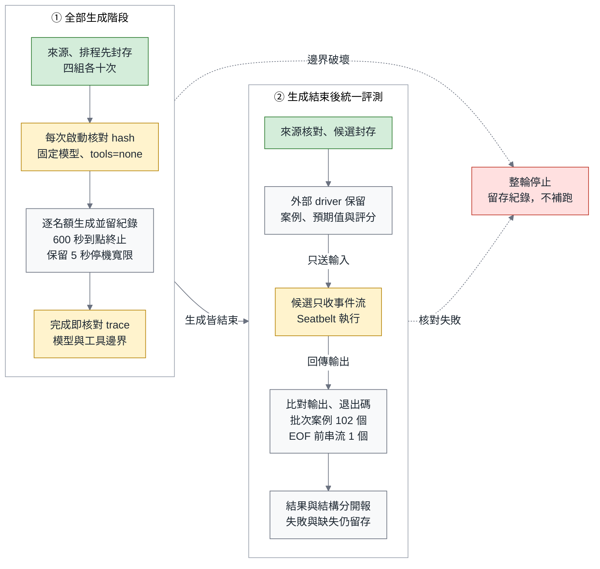
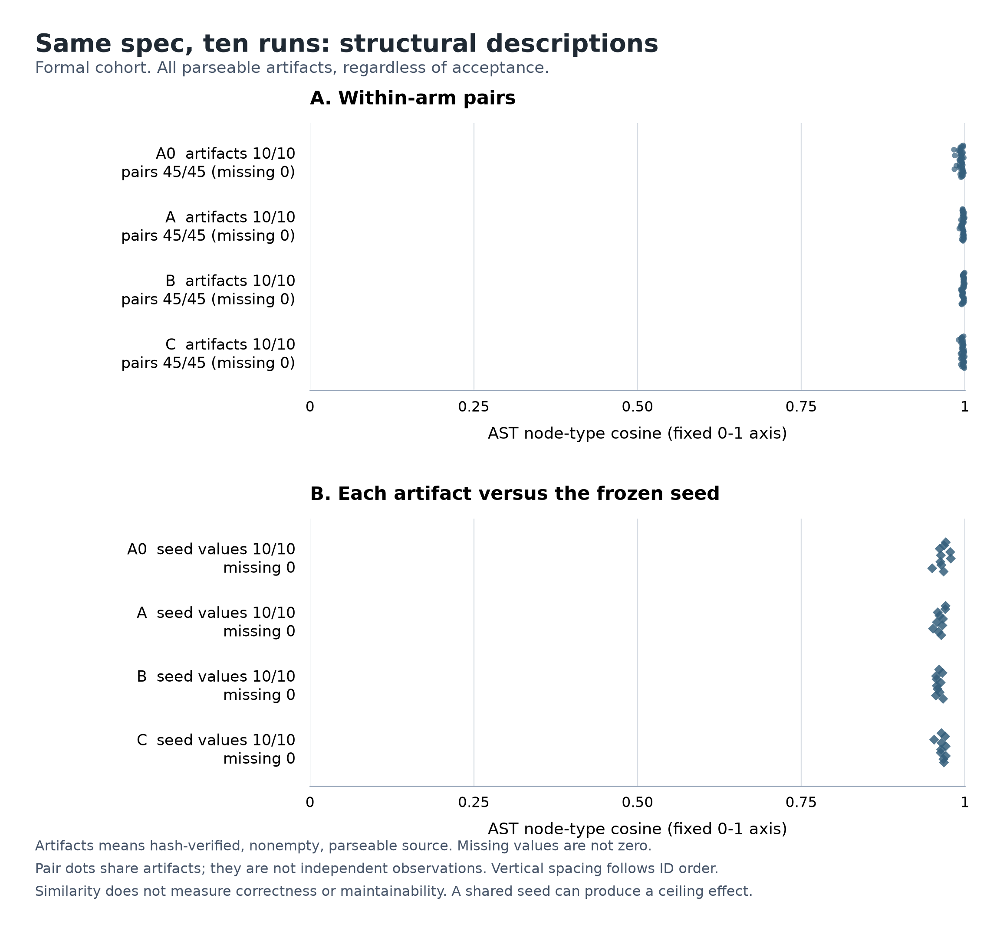

# 同一份規格，跑十次：研究圖表工件

> **本文件是研究流程圖與正式結果工件，非已完成文章。** F1、T1、T2 已對照正式封存來源；T3、F2 使用 2026-09-25 完成的四十個 formal 名額。所有數值都來自完整正式 ledger 與分析，pilot 不納入。

| 工件 | 用途與預定位置 | 本版狀態 |
|---|---|---|
| F1 | 研究方法：從來源封存到外部評測的實際順序 | 真實算繪及視覺檢查通過；已核對正式 bundle |
| T1 | 研究方法：四份指令包的共同要求與差異 | 正式 packets、共同 R01–R13 及前綴關係核對完成 |
| T2 | 契約：退出碼優先順位 | 排名表；已對照 frozen evaluator 的案例與預期退出碼 |
| T3 | 結果：完整名額、主要結果與資源資料 | 40/40 正式紀錄；各組 counts、CI、資源與 CLI × artifact |
| F2 | 探索性結構描述：來源之間及相對 seed 的差異 | frozen renderer 產出 SVG／PNG，metadata 及視覺檢查通過 |

依據：[執行前研究協議](../experiments/same-spec-ten-runs/results/formal-2026-09-25/source/PROTOCOL.md)、[runner](../experiments/same-spec-ten-runs/results/formal-2026-09-25/source/run_study.py)、[sandbox](../experiments/same-spec-ten-runs/results/formal-2026-09-25/source/sandbox.py)、[evaluator](../experiments/same-spec-ten-runs/results/formal-2026-09-25/source/evaluator.py)。正式資料入口：[manifest](../experiments/same-spec-ten-runs/results/formal-2026-09-25/manifest.json)、[完整 ledger](../experiments/same-spec-ten-runs/results/formal-2026-09-25/records.jsonl)、[summary](../experiments/same-spec-ten-runs/results/formal-2026-09-25/summary.json)、[分析報告](../experiments/same-spec-ten-runs/results/formal-2026-09-25/report.md)。本機製作歷史與正式來源核對紀錄保留在文末。

正式來源與量測輸入以 SHA-256 固定：

| 檔案 | SHA-256 |
|---|---|
| [manifest.json](../experiments/same-spec-ten-runs/results/formal-2026-09-25/manifest.json) | `ba30398118ecde62b2f682884c1e882b2864c22d70faf99549ceab0d7c0a55f2` |
| [records.jsonl](../experiments/same-spec-ten-runs/results/formal-2026-09-25/records.jsonl) | `2be5ed458de2e2defa2ab4f24d88f25bdd3b7340c9207915ab6aa0988c0db7f0` |
| [summary.json](../experiments/same-spec-ten-runs/results/formal-2026-09-25/summary.json) | `8198a4478b8158268298960576655d920db3b8d2dc2bd207348dcef8a346dfb9` |
| [render_results.py](../experiments/same-spec-ten-runs/results/formal-2026-09-25/source/render_results.py) | `ea3c6aa0377d5bd269b49addb56af2ba6860b8b3d309d1fbb83a85ebd46e2608` |

## F1：全部生成結束，再統一評測

**圖說：** 四組各十個名額先完成生成階段；只有封存後的候選程式才接收外部 driver 送來的事件流，預期輸出與評分留在 driver，生成邊界或完整性檢查失敗則停止整輪並保留紀錄。

**算繪與閱讀檢查：** Mermaid 11.17.2，`flowchart LR` 包兩個 `direction TB` 子圖；跨階段的邊連子圖本身。10 個節點，字級 16px；實測 viewBox **898 × 849 CSS px**，高／寬 **0.95**，`mermaid_check.sh` **PASS**。已開啟 PNG 視覺檢查，節點文字完整、箭頭方向可辨；不是只通過語法檢查。算繪使用 repo 腳本注入的中文字型串。原腳本的 SVG 在 shrink-to-fit 容器內被縮到約 300 CSS px；本次保留相同 viewBox 與 Mermaid 原始碼，僅把算繪 DOM 的 SVG 寬高明設為 viewBox 尺寸，再以 DPR 2 截圖，避免把預設小圖當成高解析成品。

本機工件：[完整 mmd](../../.context/same-spec-ten-runs/figures/F1.mmd)、[SVG](../../.context/same-spec-ten-runs/figures/F1.svg)、[2× PNG](../../.context/same-spec-ten-runs/figures/F1.png)。以上 `.context` 連結是 gitignored 的本機驗證產物；圖的完整原始碼已在本文件內。

**實作邊界與證據：**

- 圖中的「固定模型、tools=none」指生成 CLI 的 `--tools ""`、固定 model/effort，以及每次 trace 的 model、tools、MCP、skills、slash commands 核對。模型收到的是 seed＋該組規範，不收到 oracle、參考修補、同儕輸出或評分回饋；這個研究不量 runtime Skill。
- 每個生成名額上限 600 秒。到點會送終止訊號，保留最多 5 秒停機寬限，再封存程序終止後可取得的產物；因此 `artifact_success` 可能為真而 `cli_success` 為假。圖中的停機寬限不是把逾時完成改算準時。
- 正常路徑是**所有名額的生成階段結束後，才依排程統一評測**。生成期間每次完成即查 trace；發現生成邊界破壞便停止，不等剩餘名額。來源與 Python runtime 在每次生成啟動及評測前後核對；CLI binary／version 只在生成啟動時核對，評測不依賴 CLI 仍可用。續跑前也檢查既有紀錄與已生成 trace 的邊界違規，量測器故障會 halt。沒有成功產物的名額仍保留原始紀錄，不補跑。
- `Seatbelt` 節點表示目前採用的本機執行限制。候選執行時必然看得到事件流；外部 cases、expected outputs 與評分程式不交給它。可讀範圍包含候選檔、Python runtime 與必要系統 runtime 路徑，網路及檔案寫入受限制。
- **正式 probe 證據**：[launch-preflight.json](../experiments/same-spec-ten-runs/results/formal-2026-09-25/launch-preflight.json)，時間 `2026-09-25T04:24:22.093608+00:00`，記錄 `macos-seatbelt-v1` 下 oracle-file read、file write、localhost network bind 三項拒絕為 true。這是本機已觀察到的拒絕證據，不是所有 OS／IPC 通道都受保護的證明。正式 ledger 的四十個名額皆記錄 `boundary_ok=true`、`boundary_violation=false`；unknown／未確認邊界不等於已觀察到違規。
- 外部驗收分母是**每份候選 102 個 batch cases＋1 個 EOF 前 streaming probe**。後者先送一則訊息，在仍未送 terminal event／未關 stdin 時要求看到 stdout，再送餘下內容。這個 103 是每份候選的有限驗收覆蓋，不是完整正確性證明；套件未逐一檢查字面上保留 `main()`、所有額外 CLI 參數或每種內部編碼策略。正式 artifact 成功數另見 T3。

## T1：四組共享 R01–R13，改變的是文字包

**表說：** 所有組別修同一份 repository seed，以 R01–R13 為共同規範基準；詳略、理由與文字 pattern 是指令包差異。成稿時另找到 A0／A 的 CLI 範圍措辭差異，因此不能把介入概括為已證明只改寫法，詳見[補記](same-spec-ten-runs/manuscripts/packet-wording-caveat.md)。

| 組別 | 規範基準 | 文字差異 | 設計與限制 | 如何核對 |
|---|---|---|---|---|
| A0 | R01–R13 | 精簡表達 | 共同基準的精簡版本 | manifest＋逐條規範核對 |
| A | R01–R13 | 展開說明與結構 | 目標為相同要求；CLI 措辭強度仍有差異 | 同一 requirement ID 集合；AI 語義核對 |
| B | R01–R13 | A 全文＋非規範理由與自查清單 | 附加段不增要求；繼承 A 的措辭限制 | script 檢查 B 以 A 全文開頭 |
| C | R01–R13 | B 全文＋可選的純文字 implementation pattern | 附加段不增要求；繼承 A 的措辭限制 | script 檢查 C 以 B 全文開頭；沒有安裝或呼叫 Skill |
| 共同條件 | 同一 seed、模型、effort、CLI 與驗收 | 正式 manifest：`claude-opus-5-5`、`high`；生成 tools/MCP/skills/slash commands 為空 | 不因組別改變 | manifest、packet hashes、trace 已核對；未知 provider context 不在 hash 的保證內 |

核對者是 script 與 AI，沒有宣稱真人審查。script 能確認 requirement IDs、seed hash 與前綴關係；這些檢查本身不構成語義等價證明。依據：[requirements.json](../experiments/same-spec-ten-runs/results/formal-2026-09-25/source/requirements.json)、[A0](../experiments/same-spec-ten-runs/results/formal-2026-09-25/source/specs/A0.md)／[A](../experiments/same-spec-ten-runs/results/formal-2026-09-25/source/specs/A.md)／[B](../experiments/same-spec-ten-runs/results/formal-2026-09-25/source/specs/B.md)／[C](../experiments/same-spec-ten-runs/results/formal-2026-09-25/source/specs/C.md)、[equivalence tests](../experiments/same-spec-ten-runs/results/formal-2026-09-25/source/tests/test_task_evaluator.py)。正式 packet hash 位於 [manifest](../experiments/same-spec-ten-runs/results/formal-2026-09-25/manifest.json) 的 `input_packet_sha256`；四份包可直接檢查：[A0](../experiments/same-spec-ten-runs/results/formal-2026-09-25/packets/A0.txt)、[A](../experiments/same-spec-ten-runs/results/formal-2026-09-25/packets/A.txt)、[B](../experiments/same-spec-ten-runs/results/formal-2026-09-25/packets/B.txt)、[C](../experiments/same-spec-ten-runs/results/formal-2026-09-25/packets/C.txt)。

## T2：退出碼按條件排名，不是時間順序

**表說：** EOF 後依排名選第一個適用條件；較晚出現的 explicit failure 仍能勝過較早的 malformed event。

| 排名 | Exit | 條件 | 同時出現時的優先關係 | 外部驗證方式 |
|---:|---:|---|---|---|
| 1 | 3 | 任一 top-level `error` 或 `turn.failed` | 勝過其他條件；failed-turn 的巢狀內容錯型仍保留 explicit failure | batch：`later-error-outranks-malformed`、`earlier-error-outranks-malformed`、`wrong-failed-error-envelope-number` |
| 2 | 6 | 沒有 explicit failure，曾有 malformed event | 勝過 missing completion、silence；繼續讀取後續行 | batch：`malformed-outranks-disconnect`、`malformed-outranks-silence`、`physical-line-numbers-and-continuation` |
| 3 | 4 | 前兩項皆無，沒有有效 `turn.completed` | 勝過沒有 agent message | batch：`legacy-missing-completion`、`legacy-empty-input`、`legacy-incomplete-command` |
| 4 | 5 | 有有效完成事件，但沒有非空字串 agent message | 只有前三項皆不成立時才適用 | batch：`legacy-completed-silent`、`legacy-command-is-not-speech`、`legacy-empty-text-is-not-speech` |
| 5 | 0 | 有有效完成事件及非空字串 agent message，且無 explicit failure/malformed | 只有前四項皆不成立 | batch：`legacy-multiple-messages`、`legacy-cjk-c-locale` |

Streaming 是獨立契約，不是新增 exit 類別：`streaming-before-eof` 在真實子程序中逐段送 stdin，檢查 EOF 前輸出。其餘表列案例一次送完整串流，比對 stdout、stderr 和退出碼。契約來源：[R11–R12](../experiments/same-spec-ten-runs/results/formal-2026-09-25/source/requirements.json)；case IDs 來源：[evaluator.py](../experiments/same-spec-ten-runs/results/formal-2026-09-25/source/evaluator.py)，本表已對照正式 `manifest.source_sha256` 與 frozen evaluator 的 case IDs／預期退出碼；完整案例清單是評分器資料，未送給生成模型。

## T3：完整四十個正式名額

**資料狀態：** 2026-09-25 的 formal campaign 已完成 40/40 個預定名額，沒有 HALT、替補名額或缺少紀錄。四組各十次，全部 `completed`；`boundary_ok`、`cli_success`、`artifact_success`、`accepted_completion` 均為 true，`boundary_violation` 均為 false。來源為 [完整 ledger](../experiments/same-spec-ten-runs/results/formal-2026-09-25/records.jsonl) 與 [summary](../experiments/same-spec-ten-runs/results/formal-2026-09-25/summary.json)，不混入 pilot。

### T3a：依原定 block 保留四十個名額

**表說：** 每格是一個名額；`accepted` 表示 `cli_success && artifact_success`，並保留正常 CLI 完成、生成邊界完整及外部驗收三個條件。ID 為 `formal-{兩位 block}-{組別}`，可逐格對回 ledger；block 是平衡排程區塊，不是同步完成的配對窗口。

| Block | A0 | A | B | C |
|---:|---|---|---|---|
| 1 | accepted | accepted | accepted | accepted |
| 2 | accepted | accepted | accepted | accepted |
| 3 | accepted | accepted | accepted | accepted |
| 4 | accepted | accepted | accepted | accepted |
| 5 | accepted | accepted | accepted | accepted |
| 6 | accepted | accepted | accepted | accepted |
| 7 | accepted | accepted | accepted | accepted |
| 8 | accepted | accepted | accepted | accepted |
| 9 | accepted | accepted | accepted | accepted |
| 10 | accepted | accepted | accepted | accepted |

`boundary_ok=false` 本身不足以判定違規。若只是缺少確認證據，名額以操作失敗／未完成保留；已觀察到 `boundary_violation` 才表示生成邊界違規並停止整輪，完整性或量測錯誤也會 halt。這一輪沒有上述情況。判讀其他 campaign 時不能只看 `completed` 狀態或把未知邊界當成已證實違規。

### T3b：各組 accepted、CLI 與 artifact 結果

| 組別 | Accepted / planned | 雙側 95% Clopper–Pearson CI | CLI success / planned | Artifact success / planned |
|---|---:|---|---:|---:|
| A0 | 10/10 | 69.15%–100.00% | 10/10 | 10/10 |
| A | 10/10 | 69.15%–100.00% | 10/10 | 10/10 |
| B | 10/10 | 69.15%–100.00% | 10/10 | 10/10 |
| C | 10/10 | 69.15%–100.00% | 10/10 | 10/10 |

三種端點在本輪各組皆為 10/10，因此各自的區間同為 69.15%–100.00%。區間以二項模型的穩定性與獨立性假設為前提；同一任務、共用 provider 及可能的 cache／時間交互作用仍限制推論。十次全過沒有證明高可靠度，也不能把結果解釋為四種文字包等價、非劣性或某組勝出；協議未設定組間差值估計或假設檢定。

Artifact success 表示封存產物通過 **102 個 batch cases＋1 個 EOF 前 streaming probe**；是此套件的通過結果，不是所有可能行為的正確性證明。協議保留五秒停機寬限，本來允許 `CLI=false、artifact=true`；本輪未出現這個組合。

| 組別 | CLI=true／artifact=true | CLI=true／artifact=false | CLI=false／artifact=true | CLI=false／artifact=false |
|---|---:|---:|---:|---:|
| A0 | 10 | 0 | 0 | 0 |
| A | 10 | 0 | 0 | 0 |
| B | 10 | 0 | 0 | 0 |
| C | 10 | 0 | 0 | 0 |

### T3c：資源資料與缺失

**表說：** 時間、成本與 token 均保留 CLI／runner 回報值。下列每組每個欄位都是 observed **10/10**、missing **0**；缺失沒有補零。時間為名額啟動至 runner 觀察到完成的 wall seconds，名義輪詢間隔為 0.5 秒；表列三位小數便於核對，並不代表毫秒級完成時間精度。

| 組別 | Wall seconds 中位數 [最小, 最大] | 回報 USD 合計 | 回報 USD 中位數 [最小, 最大] | 每欄 observed / planned；missing |
|---|---|---:|---|---|
| A0 | 37.273 [30.551, 49.130] | 1.248397 | 0.123649 [0.110626, 0.150329] | 10/10；0 |
| A | 37.300 [32.201, 44.763] | 1.382626 | 0.136611 [0.127999, 0.156247] | 10/10；0 |
| B | 40.277 [34.887, 48.307] | 1.513502 | 0.149123 [0.136136, 0.164495] | 10/10；0 |
| C | 37.161 [32.250, 59.707] | 1.547817 | 0.148145 [0.136205, 0.199409] | 10/10；0 |

| 組別 | Input tokens 合計 | Output tokens 合計 | Cache read 合計 | Cache creation 合計 | 每欄 observed / planned；missing |
|---|---:|---:|---:|---:|---|
| A0 | 20 | 44,935 | 0 | 39,339 | 10/10；0 |
| A | 20 | 46,037 | 0 | 52,202 | 10/10；0 |
| B | 20 | 50,161 | 0 | 57,749 | 10/10；0 |
| C | 20 | 49,072 | 0 | 64,234 | 10/10；0 |

四十個正式名額的 CLI 回報成本合計為 **USD 5.692342**。這是 list-price estimate，不是帳單或訂閱實付；cache 沒有實驗性重置，沒有無 cache 的反事實估算。Input 欄原樣保留 terminal `usage`，cache 類別另列，不能把每組 20 input tokens 當成完整 prompt 大小。Haiku 出現在 `model_usage` 計費明細，沒有出現在候選生成的 assistant 訊息；trace 無法證明它在 CLI 內部的用途。不能以這張 token 表重建帳單。完整 launch 時點、名額順序與資源欄位保存在 [封存資料](../experiments/same-spec-ten-runs/results/formal-2026-09-25/archive.json)。本表不推算人類審查工時、維護成本或成本節省。

## F2：全部可解析產物的探索性結構描述

**圖說：** 上圖包含每組十份已核對 hash、非空且可解析產物的全部 45 pairs，合計 **180 個 pair 值**；下圖包含同一四十份產物相對 frozen seed 的 **40 個值**。各組均為 artifacts 10/10、pairs 45/45、seed values 10/10，所有缺失為零。納入條件不按 accepted 狀態篩選；本輪恰好四十份皆通過驗收。上下圖橫軸固定 **0–1**，縱向只按 run／pair ID 作確定性排列，不代表另一個量測維度。每組 45 pairs 共享十份檔案，**180 個點不是 180 個獨立 run**，沒有對 pair 進行獨立樣本檢定或 bootstrap。

Metric 是 **AST node-type multiset cosine**：計算節點種類計數的餘弦相似度，忽略順序與許多語義差異。所有值接近 1 時仍保留完整座標，不裁窄成放大微差的圖。下表補上精確到四位小數的描述，完整值與每個 run／pair ID 可在 [summary](../experiments/same-spec-ten-runs/results/formal-2026-09-25/summary.json) 與 [F2 metadata](../experiments/same-spec-ten-runs/results/figures-2026-09-25/F2.metadata.json) 核對。

| 組別 | Parsed / planned | Pairs / possible | Pair cosine 中位數 [最小, 最大] | 不同 normalized AST hash 數 | Seed cosine 中位數 [最小, 最大] |
|---|---:|---:|---|---:|---|
| A0 | 10/10 | 45/45 | 0.9947 [0.9831, 0.9982] | 10 | 0.9656 [0.9499, 0.9783] |
| A | 10/10 | 45/45 | 0.9970 [0.9913, 0.9996] | 10 | 0.9625 [0.9512, 0.9704] |
| B | 10/10 | 45/45 | 0.9975 [0.9937, 0.9997] | 10 | 0.9594 [0.9556, 0.9665] |
| C | 10/10 | 45/45 | 0.9965 [0.9903, 0.9997] | 10 | 0.9657 [0.9529, 0.9707] |

Seed 值各組 observed 10/10、missing 0。四組的 normalized AST hash 都是十種；此正規化省略位置並合併多種識別名稱，但保留 attribute、import path、常數與樹順序，並不具 binding awareness，也不是語義等價檢查。每份檔案的 function／async function／class counts 另留在 summary 的 `artifacts`。

這個單檔修補共用同一份 seed，高 cosine 可能包含共用骨架（scaffolding）的效應；seed 參照沒有扣除共用程式碼或校正因果關係。四組 observed acceptance 都是 10/10，沒有用結構微差推論可靠度提升或文字包優劣。相似度也不代表正確性、可維護性、人類工時或部署授權；本研究沒有量測人類 baseline 與維護成本。

**可分享工件與重現資料：** [SVG](../experiments/same-spec-ten-runs/results/figures-2026-09-25/F2.svg)、[PNG](../experiments/same-spec-ten-runs/results/figures-2026-09-25/F2.png)、[metadata](../experiments/same-spec-ten-runs/results/figures-2026-09-25/F2.metadata.json)、[frozen renderer](../experiments/same-spec-ten-runs/results/formal-2026-09-25/source/render_results.py)、[固定依賴版本](../experiments/same-spec-ten-runs/results/formal-2026-09-25/source/requirements-figures.txt)。算繪使用 Python 3.14.5、Matplotlib 3.11.2、NumPy 2.5.3、Agg、FreeType 2.14.3、DejaVu Sans；SVG 使用字形 paths，不依賴讀者的中文字型。PNG 為 **2304 × 2184 px／240 dpi**，SVG viewBox 為 **0 0 691.2 655.2**。renderer 僅讀取候選 bytes 核對 hash，沒有匯入或執行候選。

已用 `view_image` 開啟正式 PNG 檢視，標題、兩組 panel、分母、座標與限制文字完整且無裁切。另對 SVG 檢查到四個 45 點群及四個 10 點群，沒有外連圖片／script；metadata 的每個數值與 summary 相符，SVG／PNG hashes 及公開複本亦相同。本機 [F2.validation.json](../../.context/same-spec-ten-runs/figures/formal-results/F2.validation.json) 記錄這次檢查，公開 metadata 保留 renderer、manifest、records、summary、seed 與輸出 hashes。

## 製作歷史與正式證據邊界

本版的 active 資料連結使用 [正式公開封存目錄](../experiments/same-spec-ten-runs/results/formal-2026-09-25/archive.json)，不以可變動的 study 工作目錄冒充 frozen source。F1 Mermaid 原始碼保留在本文件，可直接重新算繪；F2 使用正式封存的 renderer 與固定依賴產生，圖檔放在 archive 的同層目錄，沒有改動原封存內容。

本機歷史保留 [F1 初次算繪與來源快照](../../.context/same-spec-ten-runs/figures/render-validation.json)、[生成期間的正式 bundle 核對](../../.context/same-spec-ten-runs/figures/formal-bundle-check.json)、[填入結果前的圖表稿](../../.context/same-spec-ten-runs/figures/figures-before-formal-results.md)。這些 gitignored 紀錄中的待封存文字、pilot probe 與舊工作目錄 hashes 是製作當時的狀態，沒有改寫為正式結果；正式來源以本文開頭的 manifest／ledger／summary hashes 為準。
