# 2026-12 把 Agent 當 Production Workload：全部圖表的 Mermaid 原始碼

> 依 `research/2026-10/2026-12-sre-for-agents.md`（2026-09-15 第三次改版、結構重切後的版本）的圖表清單，逐張給圖說、預期尺寸與完整 Mermaid 原始碼；每張都照 `MERMAID.md`：frontmatter `config`（theme base、themeVariables 顏色、flowchart 間距、subGraphTitleMargin；不含 fontFamily，字型由算繪腳本注入）、classDef 四色（own / buy / bad / human 四行每張都寫齊，沒用到的不影響版面）、節點 > 5 用 TB 或兩欄、≤ 12 節點、節點文字 ≤ 3 行、邊上文字 ≤ 6 字、不用 emoji、不寫逐節點 `style`、subgraph 裡有 `direction TB` 時邊只連 subgraph 本身。表格類（F3、F6、F7、F11、F12、F13、G7、G2a/b/c、G8、R1、R6、R2a/b、R7、I1）不是圖，直接用 markdown 表格、貼 Medium 時轉 PNG—各條只留一行說明與圖說，不畫。
>
> **本次（第三次改版）的異動**：刪 **F2**（SRE 十六年 timeline，與 9 月總論 §三 重複）、**G5**（eval 自動化圖，觀測篇 §4 只留一行 `source:`）、**G3**（cost 分解表，整節移到可靠篇 §3）、**R5**（fleet 容量表，隨 K8s 整節進 backlog）；新增 **F14**（兩個 store，**本月封面**）與 **I6**（tamper boundary 兩欄圖），以及四張新表格 **G7**（訊號可得性矩陣）、**G8**（資料治理）、**R6**（workflow evidence matrix）、**R7**（SLI → action）；重畫 **F4**（AND 鏈 + `accepted_risk`）、**G4**（升成三個 store 與各自的讀者）、**R3**（兩個 fast budget stock + 一個獨立的驗收閘）；改字 **F5**、**G1**、**G6**、**I2**、**I3**、**I4**、**I5**（落地名一律 `org.approval`、trace store 一律寫 Jaeger、page 條件改爆炸半徑五條件）。**F5 由封面降為內文圖**；**R4 一個字都沒動**，原始碼與上一版逐字相同。F8、F9、F10 在第一次修訂時分別併入 R4、I2、I4，編號保留只為對照舊版。
>
> 檢查：`research/scripts/mermaid_check_all.sh research/2026-10/2026-12-sre-for-agents.figures.md`（逐張算繪、印尺寸與 PASS／FAIL）。**2026-09-16 實測**（mermaid 11.17.2、gstack browse headless）：14 張全部 PASS，尺寸列在各圖的「預期尺寸」行與文末清單，PNG 也逐張看過，沒有被裁、也沒有被自動折成第四行的字。未動到的 F1 與 R4，沿用前一版的實測值。
>
> 給算繪腳本的提醒：`research/scripts/sync_figures.py` 的圖號正則是 `[FTRCP]\d{1,2}`，本月觀測篇（G）與應變篇（I）的圖號不在裡面；回寫大綱前要把 `G` 與 `I` 加進去，並留意 G1 前 600 字內提到「總論 F5」，靠「最後一個圖號」配對會配錯。

---

## 總論（10 張：F1、F3、F4、F5、F6、F7、F11、F12、F13、F14）

### F1 — 總論 第三節：Agent 是 production workload 的四個證據

**圖說**：會花錢、會出事、會被打、有規模—它已經是 production workload，卻沒有任何一個 production workload 該有的四樣東西。

**預期尺寸**：`flowchart LR` 包兩個 `direction TB` subgraph、8 節點、實測 651×600、高／寬 0.92（與大綱同）。左欄四個證據各只留一個數字（$1.2M/yr、52 起、12 個 harness、307,416 個 task），右欄缺的四樣用 bad class。

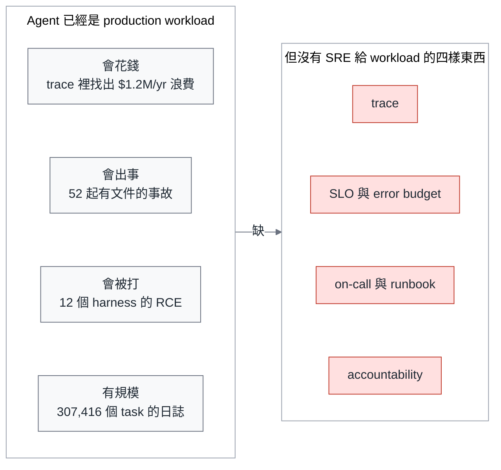
```mermaid
---
config:
  theme: base
  themeVariables:
    fontSize: 16px
    primaryColor: "#f8f9fa"
    primaryTextColor: "#1f2933"
    primaryBorderColor: "#6b7280"
    lineColor: "#6b7280"
    secondaryColor: "#f8f9fa"
    tertiaryColor: "#ffffff"
    clusterBkg: "#ffffff"
    clusterBorder: "#9ca3af"
    edgeLabelBackground: "#ffffff"
  flowchart:
    nodeSpacing: 36
    rankSpacing: 44
    padding: 12
    htmlLabels: true
    subGraphTitleMargin:
      top: 8
      bottom: 12
    curve: basis
---
flowchart LR
    classDef own fill:#d4edda,stroke:#2e7d32,color:#1f2933
    classDef buy fill:#fff3cd,stroke:#b8860b,color:#1f2933
    classDef bad fill:#ffe0e0,stroke:#c0392b,color:#1f2933
    classDef human fill:#e3f2fd,stroke:#1565c0,color:#1f2933
    subgraph ev["Agent 已經是 production workload"]
        direction TB
        E1["會花錢<br/>trace 裡找出 $1.2M/yr 浪費"] ~~~ E2["會出事<br/>52 起有文件的事故"]
        E2 ~~~ E3["會被打<br/>12 個 harness 的 RCE"]
        E3 ~~~ E4["有規模<br/>307,416 個 task 的日誌"]
    end
    subgraph gap["但沒有 SRE 給 workload 的四樣東西"]
        direction TB
        G1["trace"] ~~~ G2["SLO 與 error budget"]
        G2 ~~~ G3["on-call 與 runbook"]
        G3 ~~~ G4["accountability"]
    end
    ev -->|缺| gap
    class G1,G2,G3,G4 bad
```

### F3 — 總論 第四節：SRE 詞彙 ↔ Agent 詞彙（表格，不畫）

十二列兩欄的對照表（service ↔ golden workflow、request ↔ run、dependency ↔ model API + MCP server + harness 版本、deploy、SLI、error budget、on-call、postmortem、runbook、canary），表格比圖清楚；用 markdown 表格，貼 Medium 時轉 PNG。本次改兩處：**SLI 那一列換成新分組**（兩個 fast error budget / 一個 lagging quality gate / 三個 policy condition），並**新增一列「evidence store ↔ event ledger（不是 trace store）」**；其餘列不動。

**圖說**：SRE 的每個詞在 agent 這一側都有對應—service 是 golden workflow、request 是一次 run、error budget 是授權額度；唯一要換位置的是證據，它不在 trace store，在 event ledger。

### F4 — 總論 第五節：Claimed outcome vs verified outcome

**圖說**：兩邊 agent 都說了 done；左邊拿它當證據，右邊把它另存，只讓該 workflow 自己宣告的證據組合決定 outcome—只有人按了同意的那一條，記成 `accepted_risk`，不是 success。

**預期尺寸**：`flowchart LR` 包兩個 `direction TB` subgraph、9 節點、實測 855×765、高／寬 0.89（2026-09-16 重畫後重跑；改版前是三條平行入口的 825×483）。兩條隱形邊都不能拿掉：`cl ~~~ ve` 少了會上下疊，`V1 ~~~ V2` 少了會讓 claimed 那一格自成一欄、整張撐到 996 寬而 FAIL。三種訊號的完整列舉已從總論消失，右欄畫的是 AND 鏈加一個 `accepted_risk` 出口。

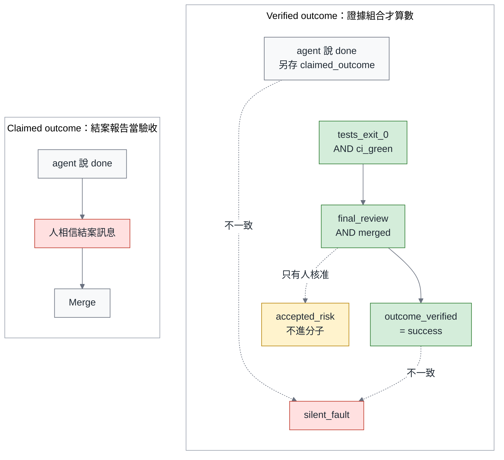
```mermaid
---
config:
  theme: base
  themeVariables:
    fontSize: 16px
    primaryColor: "#f8f9fa"
    primaryTextColor: "#1f2933"
    primaryBorderColor: "#6b7280"
    lineColor: "#6b7280"
    secondaryColor: "#f8f9fa"
    tertiaryColor: "#ffffff"
    clusterBkg: "#ffffff"
    clusterBorder: "#9ca3af"
    edgeLabelBackground: "#ffffff"
  flowchart:
    nodeSpacing: 36
    rankSpacing: 44
    padding: 12
    htmlLabels: true
    subGraphTitleMargin:
      top: 8
      bottom: 12
    curve: basis
---
flowchart LR
    classDef own fill:#d4edda,stroke:#2e7d32,color:#1f2933
    classDef buy fill:#fff3cd,stroke:#b8860b,color:#1f2933
    classDef bad fill:#ffe0e0,stroke:#c0392b,color:#1f2933
    classDef human fill:#e3f2fd,stroke:#1565c0,color:#1f2933
    subgraph cl["Claimed outcome：結案報告當驗收"]
        direction TB
        C1["agent 說 done"] --> C2["人相信結案訊息"]
        C2 --> C3["Merge"]
    end
    subgraph ve["Verified outcome：證據組合才算數"]
        direction TB
        V1["agent 說 done<br/>另存 claimed_outcome"] ~~~ V2["tests_exit_0<br/>AND ci_green"]
        V2 --> V3["final_review<br/>AND merged"]
        V3 --> V4["outcome_verified<br/>= success"]
        V3 -.->|只有人核准| V5["accepted_risk<br/>不進分子"]
        V1 -.->|不一致| V6["silent_fault"]
        V4 -.->|不一致| V6
    end
    cl ~~~ ve
    class C2 bad
    class V2,V3,V4 own
    class V5 buy
    class V6 bad
```

### F5 — 總論 第六節：一次 agent run 的 trace 樹（內文圖，封面改 F14）

**圖說**：一次 run 是一條 trace：名字以規格為準，規格沒有的先落 `org.*`—包括「被擋下」與「執行失敗」的區分，在 2026-08-31 的實查裡規格還表達不出來。

**預期尺寸**：`flowchart TB`、6 節點、實測 631×599、高／寬 0.95（2026-09-16 重跑；改版前 629×599）。來源標籤改成 semconv（2026-11 實查）／ org 擴充 ／ 本篇提案三選一，而 **`invoke_agent` 與 `execute_tool` 兩格在實查之前一律留白**，不預先標「規格已有」；`human.approval` 改標 `org.approval`。只展開 `org.step #k` 一步（subgraph 內三個 leaf 直排），#1 與 #N 收合；attributes 全部在觀測篇 G2 表，圖上只寫 span 名 + 一行來源。

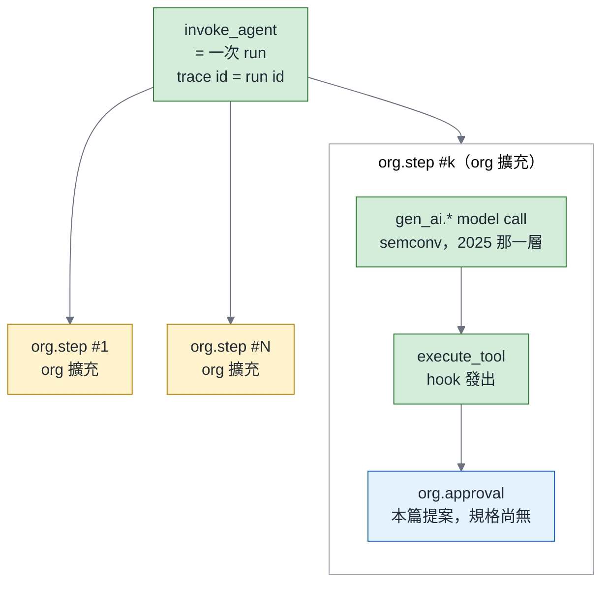
```mermaid
---
config:
  theme: base
  themeVariables:
    fontSize: 16px
    primaryColor: "#f8f9fa"
    primaryTextColor: "#1f2933"
    primaryBorderColor: "#6b7280"
    lineColor: "#6b7280"
    secondaryColor: "#f8f9fa"
    tertiaryColor: "#ffffff"
    clusterBkg: "#ffffff"
    clusterBorder: "#9ca3af"
    edgeLabelBackground: "#ffffff"
  flowchart:
    nodeSpacing: 36
    rankSpacing: 44
    padding: 12
    htmlLabels: true
    subGraphTitleMargin:
      top: 8
      bottom: 12
    curve: basis
---
flowchart TB
    classDef own fill:#d4edda,stroke:#2e7d32,color:#1f2933
    classDef buy fill:#fff3cd,stroke:#b8860b,color:#1f2933
    classDef bad fill:#ffe0e0,stroke:#c0392b,color:#1f2933
    classDef human fill:#e3f2fd,stroke:#1565c0,color:#1f2933
    R["invoke_agent<br/>= 一次 run<br/>trace id = run id"]
    S1["org.step #1<br/>org 擴充"]
    subgraph SK["org.step #k（org 擴充）"]
        direction TB
        M["gen_ai.* model call<br/>semconv，2025 那一層"] --> T["execute_tool<br/>hook 發出"]
        T --> H["org.approval<br/>本篇提案，規格尚無"]
    end
    SN["org.step #N<br/>org 擴充"]
    R --> S1
    R --> SK
    R --> SN
    class R,M,T own
    class S1,SN buy
    class H human
```

### F6 — 總論 第八節：Release gate vs Production SLI（表格，不畫）

兩欄清單（左：pass^k、mutation score、constraint-test 違規、變異數；右：六個 SLI 各標「進 budget / policy condition」），只列名字與「在哪裡量、決定什麼」，表格比圖清楚；定義與初值在可靠篇 R1 / R2。

**圖說**：release gate 在 offline 量、決定 harness 版本能不能升；production SLI 在真實流量下每分鐘量、決定升了之後要不要 rollback、授權能不能擴。

### F7 — 總論 第四節：SRE 借得動 / 要重做的四件事（表格，不畫）

四列（probe 的位置、非版號化的 model 變更、approval 作為一級訊號、事件量太小 → 每條 burn-rate rule 要有 `min_events`）× 「SRE 怎麼做 / agent 要怎麼重做」兩欄，表格比圖清楚。本次補兩句：第一列補「evidence store 與 debug store 要分開」，第三列補「規格今天連 denied-vs-failed 都表達不了（查證 2026-08-31）」。

**圖說**：SRE 的方法幾乎全部借得動；要重做的只有四件事—probe 的位置（而且證據與除錯要分家）、非版號化的 model 變更、approval 作為一級訊號、事件量太小所以每條 burn-rate rule 都要有 `min_events`。

### F11 — 總論 第十節：SRE 這一側的三層 delta（表格，不畫）

四列（trace、SLO、on-call、attestation）× 三欄（50 / 200 / 1,000 人）的矩陣，大綱 §十 已填好內容，表格比圖清楚。原本的「sandbox 買還是自建」那一列整列刪除（重複 9 月組織篇 §三）。

**圖說**：50 人只有 vendor dashboard、cost cap 與 kill switch，PR 上留一個 run id；200 人把三種 span 接進既有 Collector、為一條 golden workflow 寫一份 `agent-slo.yaml`、PR 帶 attestation block 與帳本；1,000 人才由 platform squad 自己輪值，status check 對帳本驗三方分離。

### F12 — 總論 第十節：90 天儀表化計畫（表格，不畫）

三列（第 1、2、3 個月）× 兩欄（目標、退出條件），大綱 §十 已填好內容，三個階段對齊三個交付工件 A1 / A2 / A3，表格比圖清楚。

**圖說**：第 1 個月交 A1—看得到，而且 agent 關不掉這份紀錄；第 2 個月交 A2—可以定目標，每條 burn-rate rule 的 `min_events` 都有驗算；第 3 個月交 A3—出事有人接，status check 讀帳本並對一個真的 PR 驗過一次。

### F13 — 總論 決策工件：九個反模式（表格，不畫）

九列（反模式、一句話、出現在哪一篇）的清單，大綱「反模式清單」已填好內容，表格比圖清楚。

**圖說**：九個反模式—結案報告當驗收、只觀測 model call、把可寫的 log 當證據、買一套 SaaS 就算有觀測、沒有 change management 的 harness、拿 pass@1 當 SLO、agent 自己當自己的 on-call、追責靠事後推測、控制點跟 agent 住在同一台機器上。

### F14 — 總論 第六節：三個新 signal，兩個 store（本月封面）

**圖說**：同一批事件寫兩個地方—Jaeger 30 天給人查、append-only ledger 照 compliance 保存給 CI 驗，SLI 與 status check 只讀後者。

**預期尺寸**：`flowchart TB`、8 節點、實測 827×532、高／寬 0.64（2026-09-16 首次算繪）。bad class 那一格畫的是反模式 3（把可寫的 log 當證據），由 trace store 拉一條虛線過去，因為可改的東西當證據才是錯的那一步。帳本怎麼產生（hash chain、Merkle root）在應變篇 I3，誰讀哪一份在觀測篇 G4；本圖只回答「為什麼要寫兩個地方」。

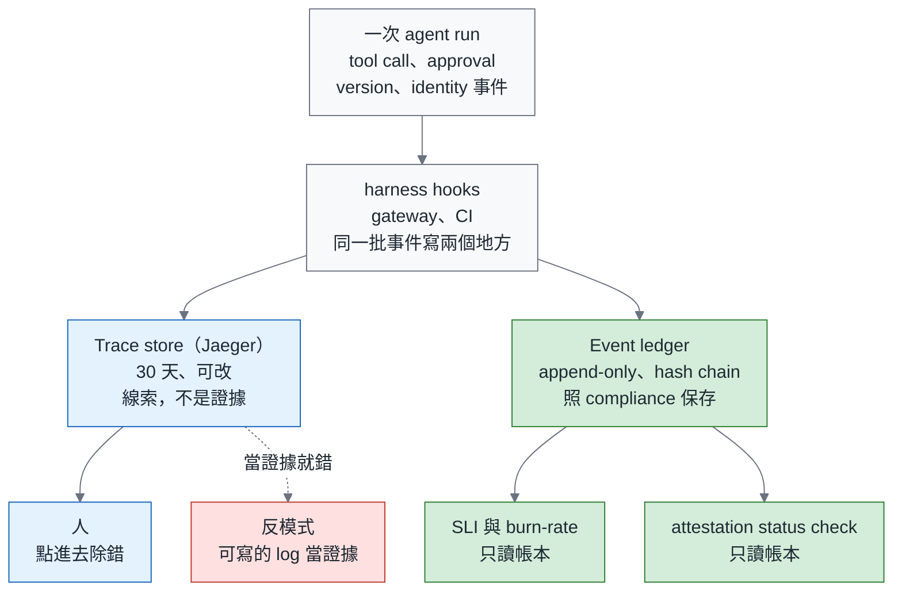
```mermaid
---
config:
  theme: base
  themeVariables:
    fontSize: 16px
    primaryColor: "#f8f9fa"
    primaryTextColor: "#1f2933"
    primaryBorderColor: "#6b7280"
    lineColor: "#6b7280"
    secondaryColor: "#f8f9fa"
    tertiaryColor: "#ffffff"
    clusterBkg: "#ffffff"
    clusterBorder: "#9ca3af"
    edgeLabelBackground: "#ffffff"
  flowchart:
    nodeSpacing: 36
    rankSpacing: 44
    padding: 12
    htmlLabels: true
    subGraphTitleMargin:
      top: 8
      bottom: 12
    curve: basis
---
flowchart TB
    classDef own fill:#d4edda,stroke:#2e7d32,color:#1f2933
    classDef buy fill:#fff3cd,stroke:#b8860b,color:#1f2933
    classDef bad fill:#ffe0e0,stroke:#c0392b,color:#1f2933
    classDef human fill:#e3f2fd,stroke:#1565c0,color:#1f2933
    A["一次 agent run<br/>tool call、approval<br/>version、identity 事件"]
    H["harness hooks<br/>gateway、CI<br/>同一批事件寫兩個地方"]
    R["Trace store（Jaeger）<br/>30 天、可改<br/>線索，不是證據"]
    L["Event ledger<br/>append-only、hash chain<br/>照 compliance 保存"]
    P["人<br/>點進去除錯"]
    S["SLI 與 burn-rate<br/>只讀帳本"]
    C["attestation status check<br/>只讀帳本"]
    X["反模式<br/>可寫的 log 當證據"]
    A --> H
    H --> R
    H --> L
    R --> P
    R -.->|當證據就錯| X
    L --> S
    L --> C
    class L,S,C own
    class R,P human
    class X bad
```

---

## 一、觀測篇（6 張：G1、G7、G2a/b/c、G4、G6、G8）

### G1 — 觀測篇 第一節：2025 的三個缺口

**圖說**：2025 看得到每一次 model call，看不到 run 邊界、tool call 與 approval；2026 補的就是這三個 signal。

**預期尺寸**：`flowchart LR` 包兩個 `direction TB` subgraph、7 節點、實測 657×576、高／寬 0.88（2026-09-16 重跑，與改版前同尺寸—只把 N3 的落地名由 `human.approval` 改成 `org.approval`，節點數與版面都沒動）。畫的是三個缺口，不是那棵樹（樹在總論 F5）。

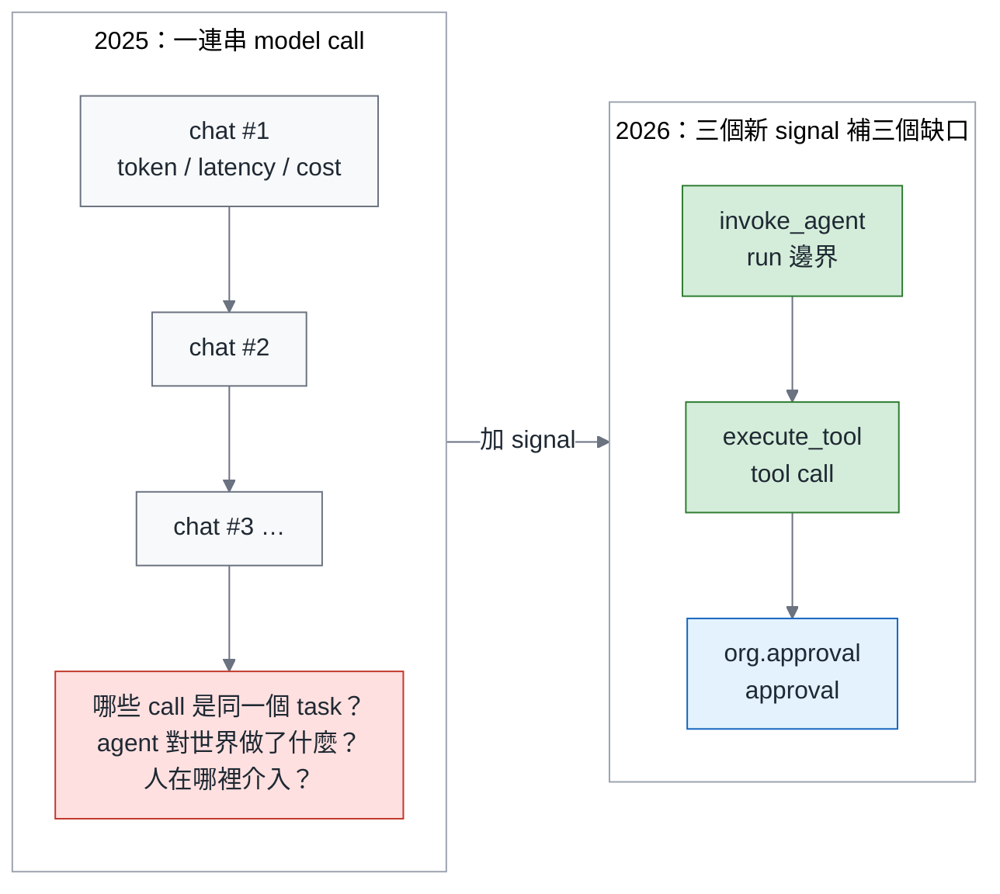
```mermaid
---
config:
  theme: base
  themeVariables:
    fontSize: 16px
    primaryColor: "#f8f9fa"
    primaryTextColor: "#1f2933"
    primaryBorderColor: "#6b7280"
    lineColor: "#6b7280"
    secondaryColor: "#f8f9fa"
    tertiaryColor: "#ffffff"
    clusterBkg: "#ffffff"
    clusterBorder: "#9ca3af"
    edgeLabelBackground: "#ffffff"
  flowchart:
    nodeSpacing: 36
    rankSpacing: 44
    padding: 12
    htmlLabels: true
    subGraphTitleMargin:
      top: 8
      bottom: 12
    curve: basis
---
flowchart LR
    classDef own fill:#d4edda,stroke:#2e7d32,color:#1f2933
    classDef buy fill:#fff3cd,stroke:#b8860b,color:#1f2933
    classDef bad fill:#ffe0e0,stroke:#c0392b,color:#1f2933
    classDef human fill:#e3f2fd,stroke:#1565c0,color:#1f2933
    subgraph old["2025：一連串 model call"]
        direction TB
        O1["chat #1<br/>token / latency / cost"] --> O2["chat #2"]
        O2 --> O3["chat #3 …"]
        O3 --> O4["哪些 call 是同一個 task？<br/>agent 對世界做了什麼？<br/>人在哪裡介入？"]
    end
    subgraph new["2026：三個新 signal 補三個缺口"]
        direction TB
        N1["invoke_agent<br/>run 邊界"] --> N2["execute_tool<br/>tool call"]
        N2 --> N3["org.approval<br/>approval"]
    end
    old -->|加 signal| new
    class O4 bad
    class N1,N2 own
    class N3 human
```

### G7 — 觀測篇 第二節：訊號可得性矩陣（表格，不畫）

七欄（採集點 / run / tool call / approval / cost / outcome / 來源與限制）× 十列的矩陣，格子只填 ○（直接拿得到）／△（拿得到但有明講的限制）／✕（拿不到）／—（本系列尚未實查，不猜）；最後一列（Copilot cloud agent、Cursor cloud、Managed Agents）刻意整列留「—，未實查，不填」。大綱 §二 已填好內容，按採集點列不按 vendor 產品列，表格比圖清楚。

**圖說**：approval 幾乎每個採集點都是 ✕、outcome 沒有一格是乾淨的 ○—所以 `org.approval` 要自己發，而拿不到的訊號不要進 SLI。

### G2a / G2b / G2c — 觀測篇 第三節：span attributes 表（表格，不畫）

三張各 ≤ 10 列、**6 欄**（attribute / 規格狀態（2026-11 實查）/ 來源 / 自由文字 / **agent 改得到嗎** / 備註）的表：G2a `invoke_agent`（規格 attribute + `org.run.*`、`org.harness.*`、`org.model.*`、`org.skills.*`、`org.config.*`）、G2b `execute_tool`（規格 + `org.tool.*`）、G2c 擴充 span（`org.step`、`org.approval`）。「規格狀態」只寫 semconv（版本 + 查閱日期）／ org 擴充 ／ 本篇提案三種值之一，**實查之前一律留白，不預填**；「來源」只寫 hook、gateway、CI、run loop 之一；「自由文字」只寫是 / 否；「agent 改得到嗎」直接對到應變篇 §2 的 tamper boundary。attribute 清單是表格內容，畫成圖會超過 12 節點。

**圖說**：三張 attribute 表算一張圖—每一列標明規格狀態、由 hook / gateway / CI / run loop 哪一個發出、是否含自由文字，以及 agent 改不改得到；填「改得到」的那些，一律不准當 SLI 或 status check 的真值。

### G4 — 觀測篇 第四節：三個 store 與它們各自的讀者

**圖說**：三個 store 各有自己的讀者：dashboard 與 CI 的 status check 只吃 append-only 帳本，trace 只給人查，transcript 是證物不是 telemetry。

**預期尺寸**：`flowchart LR` 包兩個 `direction TB` subgraph、7 節點、實測 589×696、高／寬 1.18（2026-09-16 重畫後重跑；改版前是兩個 store 的 TB 六節點 659×368）。三個 store 與四個讀者各自直排，要用 `~~~` 隱形邊才不會被排成一列；邊只連 subgraph 本身，誰讀哪一份寫在讀者節點的第二、三行—四個讀者並排的 TB 版實測只有 0.43，太扁。與總論 F14 的分工：F14 講為什麼要分，本圖講誰讀誰；ledger 怎麼產生、hash chain、anchor 在應變篇 I3。

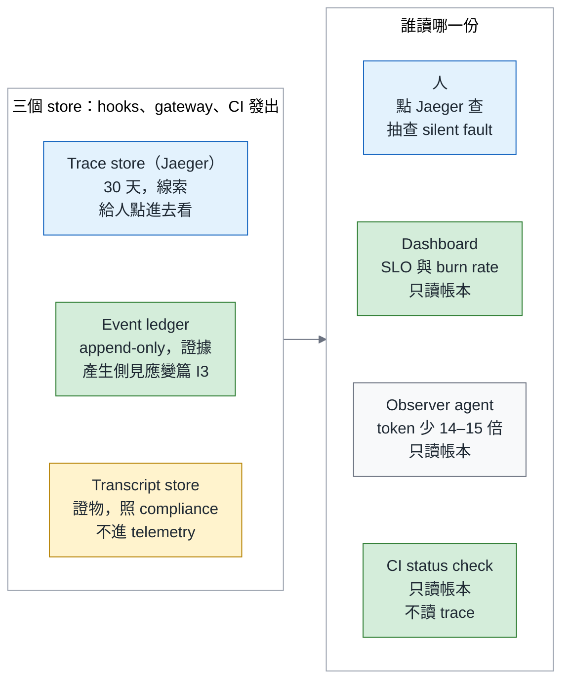
```mermaid
---
config:
  theme: base
  themeVariables:
    fontSize: 16px
    primaryColor: "#f8f9fa"
    primaryTextColor: "#1f2933"
    primaryBorderColor: "#6b7280"
    lineColor: "#6b7280"
    secondaryColor: "#f8f9fa"
    tertiaryColor: "#ffffff"
    clusterBkg: "#ffffff"
    clusterBorder: "#9ca3af"
    edgeLabelBackground: "#ffffff"
  flowchart:
    nodeSpacing: 36
    rankSpacing: 44
    padding: 12
    htmlLabels: true
    subGraphTitleMargin:
      top: 8
      bottom: 12
    curve: basis
---
flowchart LR
    classDef own fill:#d4edda,stroke:#2e7d32,color:#1f2933
    classDef buy fill:#fff3cd,stroke:#b8860b,color:#1f2933
    classDef bad fill:#ffe0e0,stroke:#c0392b,color:#1f2933
    classDef human fill:#e3f2fd,stroke:#1565c0,color:#1f2933
    subgraph st["三個 store：hooks、gateway、CI 發出"]
        direction TB
        R["Trace store（Jaeger）<br/>30 天，線索<br/>給人點進去看"] ~~~ L["Event ledger<br/>append-only，證據<br/>產生側見應變篇 I3"]
        L ~~~ T["Transcript store<br/>證物，照 compliance<br/>不進 telemetry"]
    end
    subgraph rd["誰讀哪一份"]
        direction TB
        P["人<br/>點 Jaeger 查<br/>抽查 silent fault"] ~~~ D["Dashboard<br/>SLO 與 burn rate<br/>只讀帳本"]
        D ~~~ O["Observer agent<br/>token 少 14–15 倍<br/>只讀帳本"]
        O ~~~ C["CI status check<br/>只讀帳本<br/>不讀 trace"]
    end
    st --> rd
    class L,D,C own
    class T buy
    class R,P human
```

### G6 — 觀測篇 第五節：復用既有 Collector pipeline（工件 A1 的主圖）

**圖說**：三種來源進同一個既有 Collector，兩個 processor 加身分、剝文字，落到你已經有的 Jaeger、Prometheus 與 Grafana—整條線上沒有一個新系統。

**預期尺寸**：`flowchart TB`、8 節點加一個 subgraph、實測 661×762、高／寬 1.15（2026-09-16 重跑，與改版前同尺寸—只把 B1 的「Tempo / Jaeger」改成「Jaeger」、S3 的 `human.approval` 改成 `org.approval`）。本圖由觀測篇 §6 移到 §5，跟四件套同一節。Collector subgraph 用 buy class（既有、不新建）；三個來源用 own class（你自己的 harness 層）。

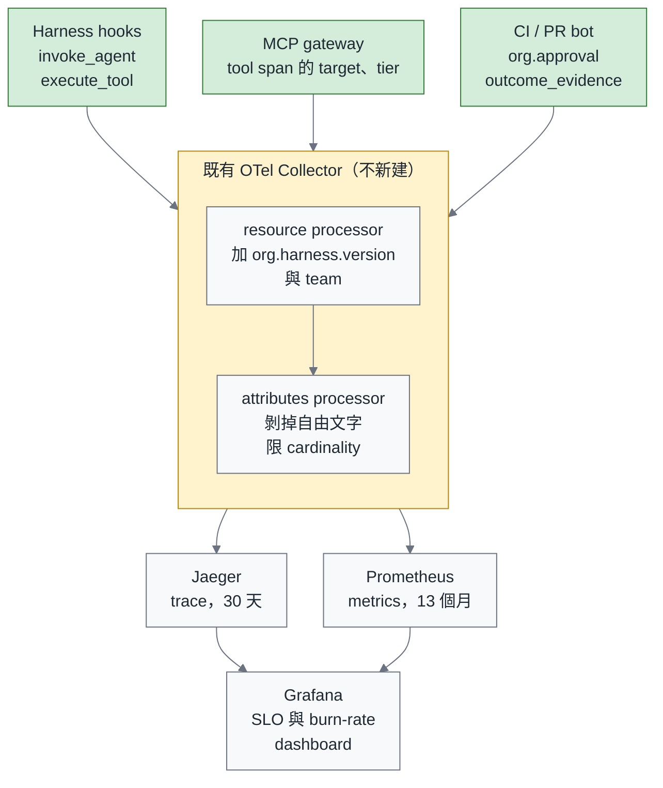
```mermaid
---
config:
  theme: base
  themeVariables:
    fontSize: 16px
    primaryColor: "#f8f9fa"
    primaryTextColor: "#1f2933"
    primaryBorderColor: "#6b7280"
    lineColor: "#6b7280"
    secondaryColor: "#f8f9fa"
    tertiaryColor: "#ffffff"
    clusterBkg: "#ffffff"
    clusterBorder: "#9ca3af"
    edgeLabelBackground: "#ffffff"
  flowchart:
    nodeSpacing: 36
    rankSpacing: 44
    padding: 12
    htmlLabels: true
    subGraphTitleMargin:
      top: 8
      bottom: 12
    curve: basis
---
flowchart TB
    classDef own fill:#d4edda,stroke:#2e7d32,color:#1f2933
    classDef buy fill:#fff3cd,stroke:#b8860b,color:#1f2933
    classDef bad fill:#ffe0e0,stroke:#c0392b,color:#1f2933
    classDef human fill:#e3f2fd,stroke:#1565c0,color:#1f2933
    S1["Harness hooks<br/>invoke_agent<br/>execute_tool"]
    S2["MCP gateway<br/>tool span 的 target、tier"]
    S3["CI / PR bot<br/>org.approval<br/>outcome_evidence"]
    subgraph col["既有 OTel Collector（不新建）"]
        direction TB
        P1["resource processor<br/>加 org.harness.version<br/>與 team"] --> P2["attributes processor<br/>剝掉自由文字<br/>限 cardinality"]
    end
    B1["Jaeger<br/>trace，30 天"]
    B2["Prometheus<br/>metrics，13 個月"]
    B3["Grafana<br/>SLO 與 burn-rate<br/>dashboard"]
    S1 --> col
    S2 --> col
    S3 --> col
    col --> B1
    col --> B2
    B1 --> B3
    B2 --> B3
    class S1,S2,S3 own
    class col buy
```

### G8 — 觀測篇 第六節：資料治理表（表格，不畫）

六欄（資料 / 進 trace？ / 進 ledger？ / 存哪裡 / 誰能看 / Retention）× 八列，大綱 §六 已填好內容，表格比圖清楚。一條原則：trace 上只放 enum、id 與 hash，任何自由文字一律另存。

**圖說**：欄位分三種去處—enum 與 hash 進 trace 與帳本、自由文字只進 transcript store、credential 值哪裡都不進；retention 也跟著分層，metrics 13 個月、trace 30 天、帳本與 transcript 照 compliance。

---

## 二、可靠篇（6 張：R1、R6、R2a/b、R7、R3、R4）

### R1 — 可靠篇 第一節：Release gate vs Production SLI（表格，不畫）

三欄表（左：pass^k、mutation score、constraint-test 違規、變異數、golden / frontier eval；中欄一句「offline、受控 vs online、真實流量」；右：依新分組標明兩個 fast error budget、一個 lagging quality gate、三個 policy condition），表格比圖清楚。是總論 F6 的定義版。

**圖說**：release gate 決定 harness 版本能不能升，production SLI 決定升了之後要不要 rollback、授權能不能擴；兩邊不能互換，因為一邊是 offline 受控、一邊是 online 真實流量。

### R6 — 可靠篇 第二節：workflow evidence matrix（表格，不畫）

五欄（workflow / `outcome_verified=success` 需要（全部成立）/ 只有人核准時記成 / 明確不算證據 / 口徑）× 五列（bug-fix PR、docs change、dependency bump、incident triage、production remediation），大綱 §二 已填好內容，表格比圖清楚。

**圖說**：`outcome_verified` 不是一個 OR，是一張表—每條 workflow 自己宣告哪幾份證據要同時成立（AND），只有人按了同意的那一種記成 `accepted_risk`，而 agent 的結案訊息、LLM judge 的評分與覆蓋率數字一律不算證據。

### R2a / R2b — 可靠篇 第三節：六個 SLI 定義表（表格，不畫）

兩張各 5 欄（SLI / 分子 ÷ 分母（含排除）/ 來源 span / 初值 / **`min_events`**）：R2a 是兩個 fast error budget（run availability、unexpected tool failure rate）加一個 lagging quality gate（change acceptance，原 agent-authored change revert rate，改名並移出 budget）；R2b 是三個 policy condition（latency 拆成 automation active time 與 end-to-end lead time 兩個讀者、cost 拆成三個量並分層、intervention ratio）。tool error rate 在表裡拆成三個分子（unexpected / policy violation / expected check failure）。定義是長句，表格比圖清楚；初值只在這裡出現，總論不給。

**圖說**：六個 SLI 全部讀 `outcome_verified`、沒有一個是 agent 自己填的—兩個 fast 事件比率餵 burn-rate alert，change acceptance 是延遲 14 天的驗收閘、只在擴張 gate 評估，三個 policy condition 達標才准擴張；每一列都有 `min_events`，事件量不足的視窗沒有資格叫人。

### R7 — 可靠篇 第五節：SLI → action（表格，不畫）

五欄（先動的訊號 / 第一動作（自動）/ 第二動作 / page？ / 何時解除）× 十列，大綱 §五 已填好內容，表格比圖清楚。最後一列是唯一一列 page（爆炸半徑五條件任一成立），規則的定義在應變篇 §4，本表只引用。

**圖說**：哪一個訊號先動就走哪一條—預設是凍結擴張加一張 ticket，只有 harness 剛換版才 rollback，`policy_violation_rate` 上升不凍結只開安全 ticket，`change_acceptance` 未達標不 alert 只擋下一次擴張；十列裡只有一列 page。

### R3 — 可靠篇 第五節：error budget 的 stock-and-flow

**圖說**：error budget 是一個 stock：壞事件把它燒掉、授權擴張從它提款，policy condition 只決定閥門開不開—而驗收是一道閘，不是一桶水，它決定要不要提款，但它自己不會被燒掉。

**預期尺寸**：`flowchart TB`、8 節點、實測 634×744、高／寬 1.17（2026-09-16 重畫後重跑；改版前是單一 stock 的 825×751）。兩個 fast budget 各畫一個 stock、取最差的那一份仍寫在內文；change acceptance 是不設 class 的中性灰節點（不燒 budget、只擋提款），outflow 已移除「reverted change（落後）」那一行。policy condition 那一格**用圓角矩形不用菱形**：三行菱形實測 634×915（高／寬 1.44），換成 stadium 才降到 1.17—同 I2 的理由。

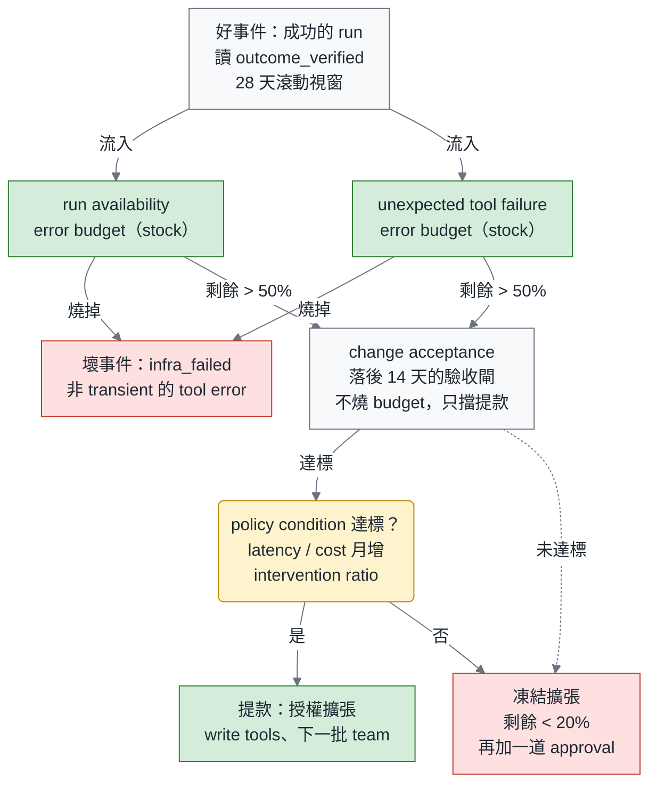
```mermaid
---
config:
  theme: base
  themeVariables:
    fontSize: 16px
    primaryColor: "#f8f9fa"
    primaryTextColor: "#1f2933"
    primaryBorderColor: "#6b7280"
    lineColor: "#6b7280"
    secondaryColor: "#f8f9fa"
    tertiaryColor: "#ffffff"
    clusterBkg: "#ffffff"
    clusterBorder: "#9ca3af"
    edgeLabelBackground: "#ffffff"
  flowchart:
    nodeSpacing: 36
    rankSpacing: 44
    padding: 12
    htmlLabels: true
    subGraphTitleMargin:
      top: 8
      bottom: 12
    curve: basis
---
flowchart TB
    classDef own fill:#d4edda,stroke:#2e7d32,color:#1f2933
    classDef buy fill:#fff3cd,stroke:#b8860b,color:#1f2933
    classDef bad fill:#ffe0e0,stroke:#c0392b,color:#1f2933
    classDef human fill:#e3f2fd,stroke:#1565c0,color:#1f2933
    IN["好事件：成功的 run<br/>讀 outcome_verified<br/>28 天滾動視窗"]
    S1["run availability<br/>error budget（stock）"]
    S2["unexpected tool failure<br/>error budget（stock）"]
    OUT["壞事件：infra_failed<br/>非 transient 的 tool error"]
    GA["change acceptance<br/>落後 14 天的驗收閘<br/>不燒 budget，只擋提款"]
    G("policy condition 達標？<br/>latency / cost 月增<br/>intervention ratio")
    W["提款：授權擴張<br/>write tools、下一批 team"]
    F["凍結擴張<br/>剩餘 < 20%<br/>再加一道 approval"]
    IN -->|流入| S1
    IN -->|流入| S2
    S1 -->|燒掉| OUT
    S2 -->|燒掉| OUT
    S1 -->|剩餘 > 50%| GA
    S2 -->|剩餘 > 50%| GA
    GA -->|達標| G
    GA -.->|未達標| F
    G -->|是| W
    G -->|否| F
    class S1,S2,W own
    class G buy
    class OUT,F bad
```

### R4 — 可靠篇 第六節：harness change management 四步與 rollback 迴路

**圖說**：pin、diff、canary、promote 是一條線；rollback 是從 canary 回到 pin 的紅色迴路，觸發它的是 burn rate。diff 那一步分兩種：你自己的變更用兩版 trace 對照，上游的靜默換版用同一份 lock 下的定期 smoke eval。

**預期尺寸**：`flowchart TB`、5 節點、實測 514×580、高／寬 1.13（本次一個字都沒動，沿用前一版的實測值）。Promote 與 Rollback 兩個節點要三行才撐得到 500 寬（兩行版實測 460）；改成表格畫不出紅色迴路，所以維持流程圖。負責人留在內文。

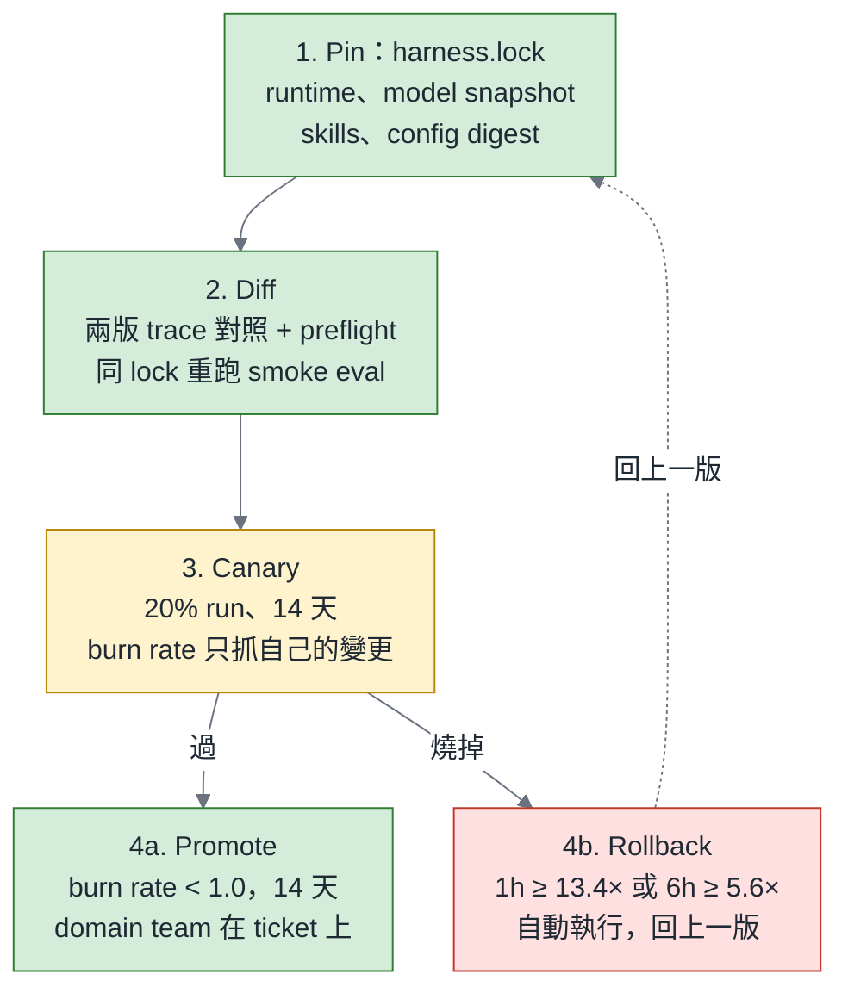
```mermaid
---
config:
  theme: base
  themeVariables:
    fontSize: 16px
    primaryColor: "#f8f9fa"
    primaryTextColor: "#1f2933"
    primaryBorderColor: "#6b7280"
    lineColor: "#6b7280"
    secondaryColor: "#f8f9fa"
    tertiaryColor: "#ffffff"
    clusterBkg: "#ffffff"
    clusterBorder: "#9ca3af"
    edgeLabelBackground: "#ffffff"
  flowchart:
    nodeSpacing: 36
    rankSpacing: 44
    padding: 12
    htmlLabels: true
    subGraphTitleMargin:
      top: 8
      bottom: 12
    curve: basis
---
flowchart TB
    classDef own fill:#d4edda,stroke:#2e7d32,color:#1f2933
    classDef buy fill:#fff3cd,stroke:#b8860b,color:#1f2933
    classDef bad fill:#ffe0e0,stroke:#c0392b,color:#1f2933
    classDef human fill:#e3f2fd,stroke:#1565c0,color:#1f2933
    P["1. Pin：harness.lock<br/>runtime、model snapshot<br/>skills、config digest"]
    D["2. Diff<br/>兩版 trace 對照 + preflight<br/>同 lock 重跑 smoke eval"]
    C["3. Canary<br/>20% run、14 天<br/>burn rate 只抓自己的變更"]
    PR["4a. Promote<br/>burn rate < 1.0，14 天<br/>domain team 在 ticket 上"]
    RB["4b. Rollback<br/>1h ≥ 13.4× 或 6h ≥ 5.6×<br/>自動執行，回上一版"]
    P --> D --> C
    C -->|過| PR
    C -->|燒掉| RB
    RB -.->|回上一版| P
    class P,D,PR own
    class C buy
    class RB bad
```

（第五節開頭那張 G2 兩半邊小表是內文 markdown 表格，大綱明列「不算圖」，本檔不另列；`agent-slo.yaml` 與 `harness.lock` 是 code block，同樣不算圖。）

---

## 三、應變與追責篇（6 張：I1、I6、I3、I2、I4、I5）

### I1 — 應變篇 第一節：agent 當第一線的邊界（表格，不畫）

六列（read-only 診斷、提出 remediation、執行 remediation、核准自己的 PR、碰 production DB、關 alert）× 「可以 / 需 approval / 不行」，格子不變，表格比圖清楚。依據整批換成四個生產現場的說法（never touches production、opens a PR never merges、the model can recommend it cannot authorize，加上書裡「模型可以提出完成，但不能批准自己的完成」），不再靠 benchmark；SteerBench 的兩個數字降為腳註並標明領域。

**圖說**：agent 當第一線可以做 read-only 診斷、可以提出 remediation；執行 remediation 要 `org.approval`（kind=remediation，計入 intervention ratio）；核准自己的 PR、碰 production DB、關 alert 一律不行—判準不是「能不能碰 production」，是這個動作可不可逆、不可逆的那一刻人在不在。

### I6 — 應變篇 第二節：tamper boundary

**圖說**：左邊是 agent 寫得到的東西，右邊是它構不到的東西—「Agentが操作できる環境の外側で、境界を強制する」，而 PR body 它改得到，所以「Model output is input, not authorization」。

**預期尺寸**：`flowchart LR` 包兩個 `direction TB` subgraph、9 節點、實測 636×765、高／寬 1.20（2026-09-16 首次算繪）。兩欄各自直排要用 `~~~` 隱形邊，邊只連 subgraph 本身；邊上那句完整的原文放不進 6 個字，所以圖上只寫「強制點在右」，整句留在圖說。左欄四格全 bad class（它寫得到），右欄五格全 own class（它構不到）。

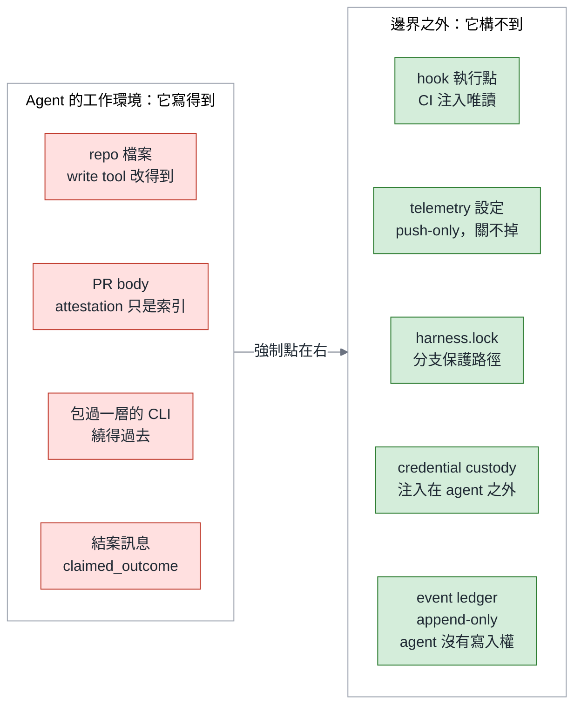
```mermaid
---
config:
  theme: base
  themeVariables:
    fontSize: 16px
    primaryColor: "#f8f9fa"
    primaryTextColor: "#1f2933"
    primaryBorderColor: "#6b7280"
    lineColor: "#6b7280"
    secondaryColor: "#f8f9fa"
    tertiaryColor: "#ffffff"
    clusterBkg: "#ffffff"
    clusterBorder: "#9ca3af"
    edgeLabelBackground: "#ffffff"
  flowchart:
    nodeSpacing: 36
    rankSpacing: 44
    padding: 12
    htmlLabels: true
    subGraphTitleMargin:
      top: 8
      bottom: 12
    curve: basis
---
flowchart LR
    classDef own fill:#d4edda,stroke:#2e7d32,color:#1f2933
    classDef buy fill:#fff3cd,stroke:#b8860b,color:#1f2933
    classDef bad fill:#ffe0e0,stroke:#c0392b,color:#1f2933
    classDef human fill:#e3f2fd,stroke:#1565c0,color:#1f2933
    subgraph ag["Agent 的工作環境：它寫得到"]
        direction TB
        A1["repo 檔案<br/>write tool 改得到"] ~~~ A2["PR body<br/>attestation 只是索引"]
        A2 ~~~ A3["包過一層的 CLI<br/>繞得過去"]
        A3 ~~~ A4["結案訊息<br/>claimed_outcome"]
    end
    subgraph out["邊界之外：它構不到"]
        direction TB
        B1["hook 執行點<br/>CI 注入唯讀"] ~~~ B2["telemetry 設定<br/>push-only，關不掉"]
        B2 ~~~ B3["harness.lock<br/>分支保護路徑"]
        B3 ~~~ B4["credential custody<br/>注入在 agent 之外"]
        B4 ~~~ B5["event ledger<br/>append-only<br/>agent 沒有寫入權"]
    end
    ag -->|強制點在右| out
    class A1,A2,A3,A4 bad
    class B1,B2,B3,B4,B5 own
```

### I3 — 應變篇 第三節：flight recorder 產生側

**圖說**：hooks 發出的 action event 進 append-only 帳本，每筆帶前一筆的 hash，每天收一個 Merkle root；上鏈是選配。發事件的 hook 在 agent 構不到的地方，而且寫在 credential 進場之前。transcript 與 trace 分開存，各有自己的 retention。

**預期尺寸**：`flowchart TB`、6 節點、實測 774×508、高／寬 0.66（2026-09-16 重跑；改版前 762×508）。hooks 節點改成 own class 並標「sandbox 外，見 I6」與「寫在 credential 注入之前」（audit 在 stage 06、credential 注入在 07）；Trace store 由 Tempo 改成 **Jaeger**。只畫產生側；消費者側在觀測篇 G4。$2.30 這個數字只在這張圖與應變篇 §3 出現（總論 §九 一句）。

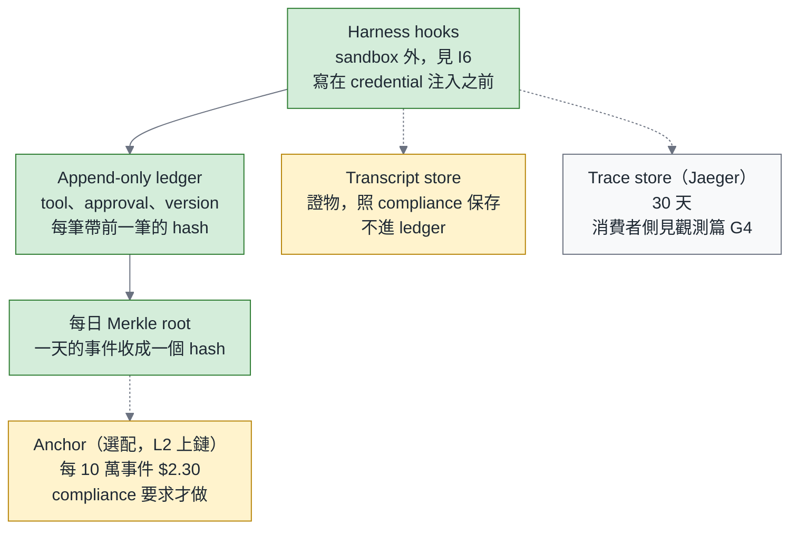
```mermaid
---
config:
  theme: base
  themeVariables:
    fontSize: 16px
    primaryColor: "#f8f9fa"
    primaryTextColor: "#1f2933"
    primaryBorderColor: "#6b7280"
    lineColor: "#6b7280"
    secondaryColor: "#f8f9fa"
    tertiaryColor: "#ffffff"
    clusterBkg: "#ffffff"
    clusterBorder: "#9ca3af"
    edgeLabelBackground: "#ffffff"
  flowchart:
    nodeSpacing: 36
    rankSpacing: 44
    padding: 12
    htmlLabels: true
    subGraphTitleMargin:
      top: 8
      bottom: 12
    curve: basis
---
flowchart TB
    classDef own fill:#d4edda,stroke:#2e7d32,color:#1f2933
    classDef buy fill:#fff3cd,stroke:#b8860b,color:#1f2933
    classDef bad fill:#ffe0e0,stroke:#c0392b,color:#1f2933
    classDef human fill:#e3f2fd,stroke:#1565c0,color:#1f2933
    H["Harness hooks<br/>sandbox 外，見 I6<br/>寫在 credential 注入之前"]
    L["Append-only ledger<br/>tool、approval、version<br/>每筆帶前一筆的 hash"]
    T["Transcript store<br/>證物，照 compliance 保存<br/>不進 ledger"]
    R["Trace store（Jaeger）<br/>30 天<br/>消費者側見觀測篇 G4"]
    M["每日 Merkle root<br/>一天的事件收成一個 hash"]
    A["Anchor（選配，L2 上鏈）<br/>每 10 萬事件 $2.30<br/>compliance 要求才做"]
    H --> L
    H -.-> T
    H -.-> R
    L --> M
    M -.-> A
    class H,L,M own
    class T,A buy
```

### I2 — 應變篇 第四節：agent 出事的四種形狀決策樹

**圖說**：alert 先分四種形狀，每一種各有一份 runbook；分不出來的才交給人 triage。預設動作都是凍結 + ticket，只有爆炸半徑五條件成立才 page。

**預期尺寸**：`flowchart TB`、10 節點、實測 839×884、高／寬 1.05（2026-09-16 重跑；改版前 814×884）。四個問題節點與結構不變，改的是四個 runbook 節點的第三行—page 條件由「injection 或碰 production」改成爆炸半徑五條件（dangerous tool、credential exposure、prod data mutation、external side effect、疑似 injection），五條件的唯一定義在應變篇 §4。問題節點用圓角矩形（stadium）不用菱形：四個兩行菱形實測 879×1539（高／寬 1.75），一行菱形也還是 1.69。訊號寫在問題節點裡，邊上只留「是 / 否」。

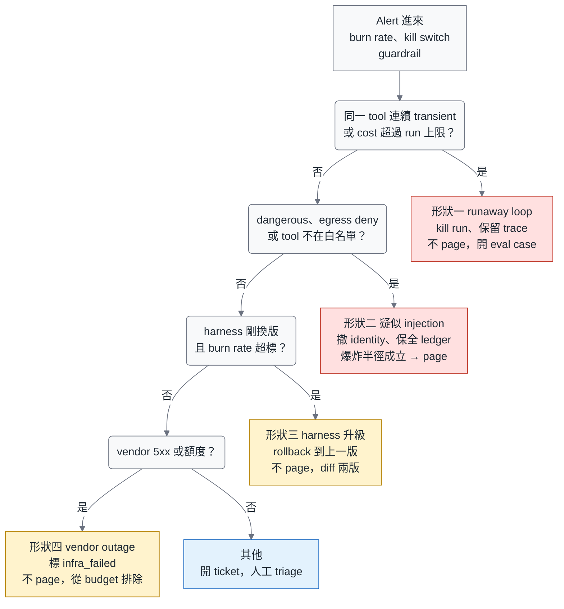
```mermaid
---
config:
  theme: base
  themeVariables:
    fontSize: 16px
    primaryColor: "#f8f9fa"
    primaryTextColor: "#1f2933"
    primaryBorderColor: "#6b7280"
    lineColor: "#6b7280"
    secondaryColor: "#f8f9fa"
    tertiaryColor: "#ffffff"
    clusterBkg: "#ffffff"
    clusterBorder: "#9ca3af"
    edgeLabelBackground: "#ffffff"
  flowchart:
    nodeSpacing: 36
    rankSpacing: 44
    padding: 12
    htmlLabels: true
    subGraphTitleMargin:
      top: 8
      bottom: 12
    curve: basis
---
flowchart TB
    classDef own fill:#d4edda,stroke:#2e7d32,color:#1f2933
    classDef buy fill:#fff3cd,stroke:#b8860b,color:#1f2933
    classDef bad fill:#ffe0e0,stroke:#c0392b,color:#1f2933
    classDef human fill:#e3f2fd,stroke:#1565c0,color:#1f2933
    A["Alert 進來<br/>burn rate、kill switch<br/>guardrail"]
    Q1("同一 tool 連續 transient<br/>或 cost 超過 run 上限？")
    Q2("dangerous、egress deny<br/>或 tool 不在白名單？")
    Q3("harness 剛換版<br/>且 burn rate 超標？")
    Q4("vendor 5xx 或額度？")
    R1["形狀一 runaway loop<br/>kill run、保留 trace<br/>不 page，開 eval case"]
    R2["形狀二 疑似 injection<br/>撤 identity、保全 ledger<br/>爆炸半徑成立 → page"]
    R3["形狀三 harness 升級<br/>rollback 到上一版<br/>不 page，diff 兩版"]
    R4["形狀四 vendor outage<br/>標 infra_failed<br/>不 page，從 budget 排除"]
    O["其他<br/>開 ticket，人工 triage"]
    A --> Q1
    Q1 -->|是| R1
    Q1 -->|否| Q2
    Q2 -->|是| R2
    Q2 -->|否| Q3
    Q3 -->|是| R3
    Q3 -->|否| Q4
    Q4 -->|是| R4
    Q4 -->|否| O
    class R1,R2 bad
    class R3,R4 buy
    class O human
```

### I4 — 應變篇 第五節：追責鏈

**圖說**：PR 上那幾行是索引；CI 驗的是 append-only 帳本裡由 harness 先寫下的值，加上平台自己產生的 review event—兩邊都不是 agent 填的。Jaeger 連結只給人看。

**預期尺寸**：`flowchart LR` 包兩個 `direction TB` subgraph、6 節點、實測 715×507、高／寬 0.71（2026-09-16 重畫後重跑；改版前 708×507）。左欄由 Trace 改成 **Ledger**（harness 在 agent 取得控制權之前寫下 run 開始事件），`human.approval` 改標 `org.approval`；右欄的 status check 改成「對 ledger 與 review event」驗，並多一條 merge commit 綁定（斷點四）。tuple 的 digest 寫在 run 開始事件節點的第三行、不另開節點（另開會讓左欄變三欄、整張 920–992 寬）；邊只連 subgraph。「合的就是審的」是 `merge_commit_sha == review_event.commit_id` 的六字版，完整寫法在正文的 status check 片段。

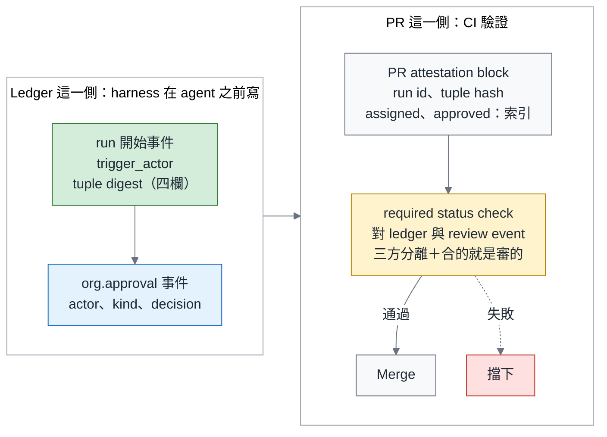
```mermaid
---
config:
  theme: base
  themeVariables:
    fontSize: 16px
    primaryColor: "#f8f9fa"
    primaryTextColor: "#1f2933"
    primaryBorderColor: "#6b7280"
    lineColor: "#6b7280"
    secondaryColor: "#f8f9fa"
    tertiaryColor: "#ffffff"
    clusterBkg: "#ffffff"
    clusterBorder: "#9ca3af"
    edgeLabelBackground: "#ffffff"
  flowchart:
    nodeSpacing: 36
    rankSpacing: 44
    padding: 12
    htmlLabels: true
    subGraphTitleMargin:
      top: 8
      bottom: 12
    curve: basis
---
flowchart LR
    classDef own fill:#d4edda,stroke:#2e7d32,color:#1f2933
    classDef buy fill:#fff3cd,stroke:#b8860b,color:#1f2933
    classDef bad fill:#ffe0e0,stroke:#c0392b,color:#1f2933
    classDef human fill:#e3f2fd,stroke:#1565c0,color:#1f2933
    subgraph le["Ledger 這一側：harness 在 agent 之前寫"]
        direction TB
        A["run 開始事件<br/>trigger_actor<br/>tuple digest（四欄）"] --> B["org.approval 事件<br/>actor、kind、decision"]
    end
    subgraph pr["PR 這一側：CI 驗證"]
        direction TB
        D["PR attestation block<br/>run id、tuple hash<br/>assigned、approved：索引"] --> E["required status check<br/>對 ledger 與 review event<br/>三方分離＋合的就是審的"]
        E -->|通過| F["Merge"]
        E -.->|失敗| G["擋下"]
    end
    le --> pr
    class A own
    class B human
    class E buy
    class G bad
```

### I5 — 應變篇 第六節：agent postmortem 迴路

**圖說**：一次 incident 從 append-only 帳本重播、寫成七欄的 postmortem，產出一個 eval case（回觀測篇 §4 的那一行 `source:`）、一條規則（進 pre-upgrade gate）與一則 guild 分享。

**預期尺寸**：`flowchart TB`、6 節點、實測 642×532、高／寬 0.83（2026-09-16 重跑；改版前 655×532）。replay 節點標明來源是 event ledger（不是 trace、也不是 transcript 口述）；postmortem 節點由四欄改七欄（多了第一個偏差發生在哪一步、harness 與 tool-set 版本、根因還是後果）；eval case 節點改接觀測篇 §4 的那一行 `source: trace:r_…`—G5 已刪，不再接 G5。rule 節點接可靠篇的 pre-upgrade gate。

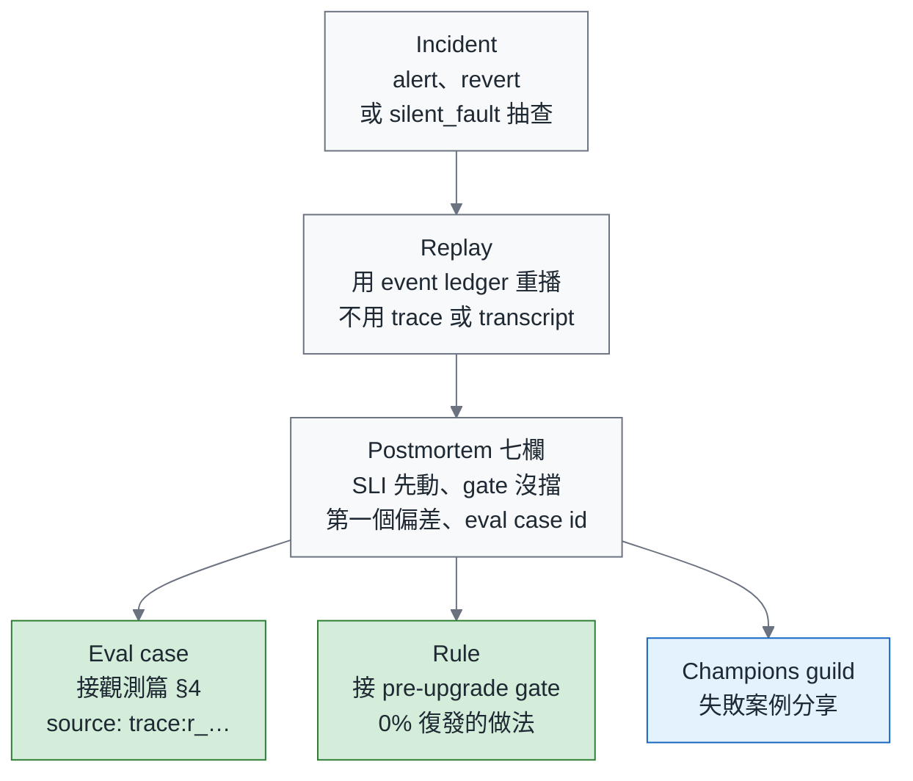
```mermaid
---
config:
  theme: base
  themeVariables:
    fontSize: 16px
    primaryColor: "#f8f9fa"
    primaryTextColor: "#1f2933"
    primaryBorderColor: "#6b7280"
    lineColor: "#6b7280"
    secondaryColor: "#f8f9fa"
    tertiaryColor: "#ffffff"
    clusterBkg: "#ffffff"
    clusterBorder: "#9ca3af"
    edgeLabelBackground: "#ffffff"
  flowchart:
    nodeSpacing: 36
    rankSpacing: 44
    padding: 12
    htmlLabels: true
    subGraphTitleMargin:
      top: 8
      bottom: 12
    curve: basis
---
flowchart TB
    classDef own fill:#d4edda,stroke:#2e7d32,color:#1f2933
    classDef buy fill:#fff3cd,stroke:#b8860b,color:#1f2933
    classDef bad fill:#ffe0e0,stroke:#c0392b,color:#1f2933
    classDef human fill:#e3f2fd,stroke:#1565c0,color:#1f2933
    I["Incident<br/>alert、revert<br/>或 silent_fault 抽查"]
    R["Replay<br/>用 event ledger 重播<br/>不用 trace 或 transcript"]
    P["Postmortem 七欄<br/>SLI 先動、gate 沒擋<br/>第一個偏差、eval case id"]
    E["Eval case<br/>接觀測篇 §4<br/>source: trace:r_…"]
    U["Rule<br/>接 pre-upgrade gate<br/>0% 復發的做法"]
    G["Champions guild<br/>失敗案例分享"]
    I --> R
    R --> P
    P --> E
    P --> U
    P --> G
    class E,U own
    class G human
```

---

## 清單（28 條：14 張 Mermaid 圖 + 14 張表格）

| 圖 | 篇 / 節 | 類型 | 方向 | 節點 | 實測 | 高／寬 |
|---|---|---|---|---|---|---|
| F1 | 總論 §三 | Mermaid | LR 兩欄 | 8 | 651×600 | 0.92 |
| F3 | 總論 §四 | 表格 | — | — | — | — |
| F4 | 總論 §五 | Mermaid | LR 兩欄 | 9 | 855×765 | 0.89 |
| F5 | 總論 §六 | Mermaid | TB | 6 | 631×599 | 0.95 |
| F6 | 總論 §八 | 表格 | — | — | — | — |
| F7 | 總論 §四 | 表格 | — | — | — | — |
| F11 | 總論 §十 | 表格 | — | — | — | — |
| F12 | 總論 §十 | 表格 | — | — | — | — |
| F13 | 總論 決策工件 | 表格 | — | — | — | — |
| F14 | 總論 §六（封面） | Mermaid | TB | 8 | 827×532 | 0.64 |
| G1 | 觀測篇 §1 | Mermaid | LR 兩欄 | 7 | 657×576 | 0.88 |
| G7 | 觀測篇 §2 | 表格 | — | — | — | — |
| G2a/b/c | 觀測篇 §3 | 表格 | — | — | — | — |
| G4 | 觀測篇 §4 | Mermaid | LR 兩欄 | 7 | 589×696 | 1.18 |
| G6 | 觀測篇 §5 | Mermaid | TB | 8 + subgraph | 661×762 | 1.15 |
| G8 | 觀測篇 §6 | 表格 | — | — | — | — |
| R1 | 可靠篇 §1 | 表格 | — | — | — | — |
| R6 | 可靠篇 §2 | 表格 | — | — | — | — |
| R2a/b | 可靠篇 §3 | 表格 | — | — | — | — |
| R7 | 可靠篇 §5 | 表格 | — | — | — | — |
| R3 | 可靠篇 §5 | Mermaid | TB | 8 | 634×744 | 1.17 |
| R4 | 可靠篇 §6 | Mermaid | TB | 5 | 514×580 | 1.13 |
| I1 | 應變篇 §1 | 表格 | — | — | — | — |
| I6 | 應變篇 §2 | Mermaid | LR 兩欄 | 9 | 636×765 | 1.20 |
| I3 | 應變篇 §3 | Mermaid | TB | 6 | 774×508 | 0.66 |
| I2 | 應變篇 §4 | Mermaid | TB | 10 | 839×884 | 1.05 |
| I4 | 應變篇 §5 | Mermaid | LR 兩欄 | 6 | 715×507 | 0.71 |
| I5 | 應變篇 §6 | Mermaid | TB | 6 | 642×532 | 0.83 |
