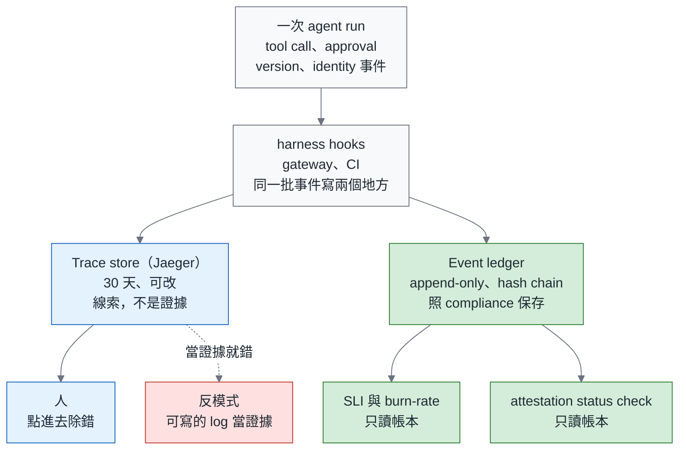
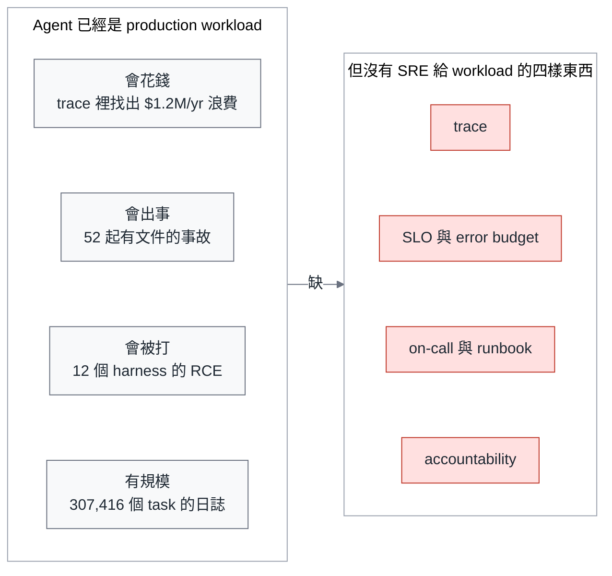
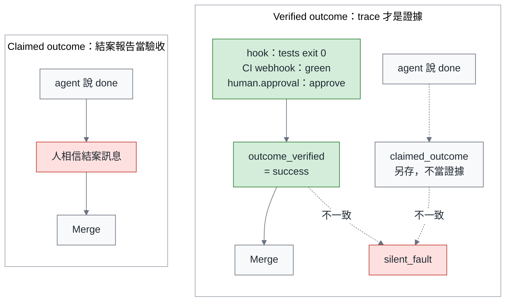
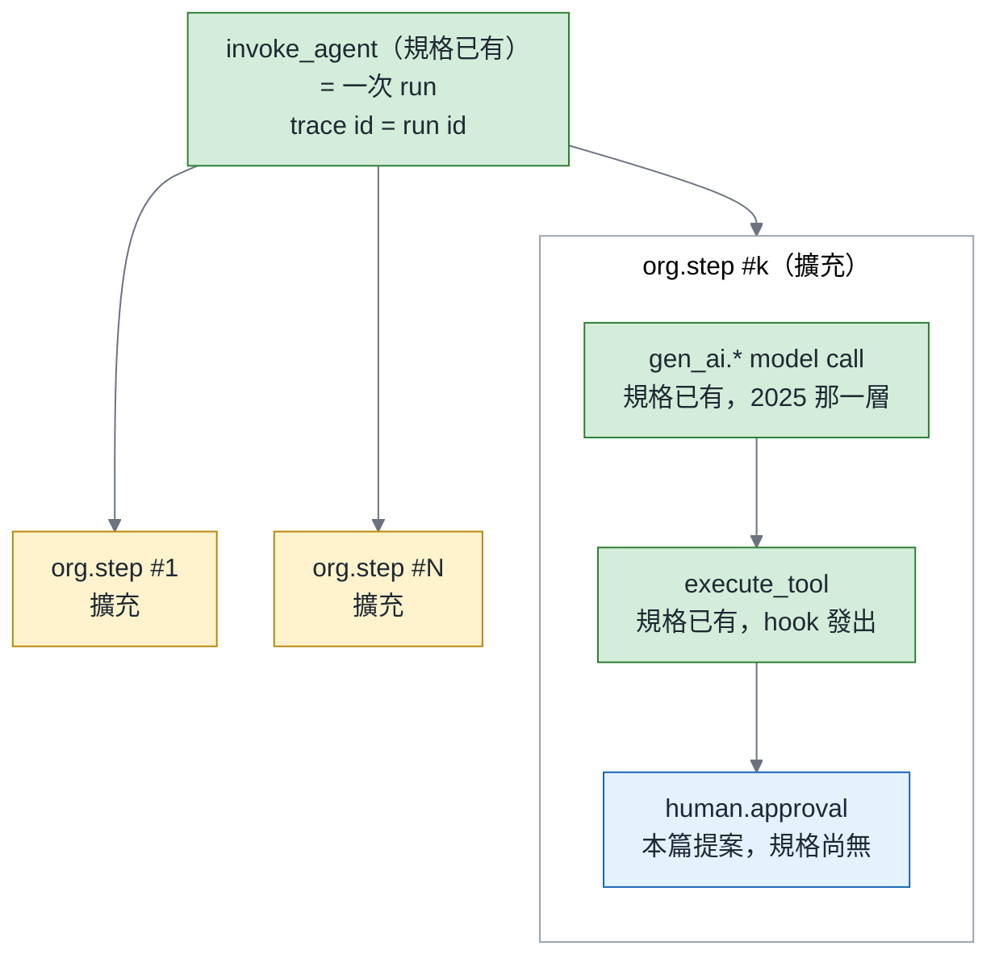

# 2026-12 主題計畫：把 Agent 當 Production Workload—Agent 的 SRE

> 計畫日期 2026-09-05；**2026-09-15 第三次改版（本次為結構重切）**。本次改版的依據有四份：（a）第二模型的完整審查 `research/2026-09/codex-review-2026-12-sre-for-agents.md`（判定不合格，36 項：致命 6／重要 12／次要 5／建議刪除 6／建議補充 7，本次**全部處理、零項駁回**）；（b）作者現場參加的 **AGNTCon + MCPCon Japan 2026**（東京，2026-09-10–11，整合摘要 `research/2026-10/conference_digest.md`，逐場筆記 `.context/research/2026-09-conf/notes_sep10.md`、`notes_sep11.md`）；（c）李博杰《深入理解 AI Agent：設計原理與工程實踐》**v2.0**（2026-09-06，Apache-2.0，`research/2026-10/book_ai_agent_book.md`）；（d）**arXiv 2026-09-01→15 掃描**與作者自己的 Notion 材料（`research/2026-10/arxiv.md`、`notion_digest.md`）。2026-09 的舊 digest 對既有引用仍然有效。格式照 `style_brief.md`：總論 + 三部曲，總論約 18 分鐘、每篇深掘 8–12 分鐘，繁中台灣用語、英文技術名詞不翻（含 rollback，不寫「回滾」）、單一「—」。
>
> **本次重切的主軸：從「把 harness 裝上儀表」改成「flight recorder / accountability」。**承重句是：**trace 是除錯用的，ledger 才是證據用的。**
>
> 修訂後的三條主線，寫進每一篇：
> （1）**outcome 不能由 agent 填，而且不是三選一**—`outcome_verified` 由該 workflow 在 `agent-slo.yaml` 宣告的證據組合（AND）推導；**只有人按了同意、沒有機器可獨立複核的訊號時記成 `accepted_risk`**，它進不了任何 SLI 的分子，只進追責鏈。表在可靠篇 §2。
> （2）**trace 是線索、ledger 才是證據，而且儀表要裝在 agent 構不到的地方**—同一批事件寫兩個地方：trace store（Jaeger，30 天，給人查）與 append-only event ledger（照 compliance 保存，給 SLI 與 CI 的 status check 讀）；hook、`harness.lock`、telemetry 開關與帳本一律在 agent 的環境之外，PR body 它改得到所以 CI 不信它（總論 §七、應變篇 §2）。error budget 只由**兩個 fast 事件比率**產生（run availability、unexpected tool failure rate），change acceptance 是 **lagging quality gate** 不是 budget，而且**每一條 burn-rate rule 都要有 `min_events`**。
> （3）**規格詞彙以實查為準，規格沒有的先落 `org.*`**—2026-08-31 的實查顯示 OTel GenAI semconv 連「執行前被擋下」與「執行了才失敗」都還沒有可攜表示法；本系列實作一律寫 `org.approval`，並明確提出兩個提案名（`org.approval.*`、`org.tool.decision`），動筆前依 2026-11 版規格再查一次。
>
> **給作者的提醒**：「三種 outcome 訊號的完整列舉」**全系列不再出現**—它已經不是三種訊號。每個數字只落一處（見「總論與三篇之間的不重疊檢查」）；**burn-rate 的換算式與 13.4 / 5.6 / 0.93 這三個倍率，唯一出處是可靠篇 §5**；**`min_events` 的統計換算（SE ≈ √(p(1−p)/n) 與 170 / 300 / 170）唯一出處是可靠篇 §3**—§3 的節名就是「最小樣本」，兩者分家，四處指標一律照這個寫。既有的 Mermaid 圖已附完整原始碼（frontmatter `config` 照 `MERMAID.md`），**本次新增的 F14、I6 原始碼已補齊並算繪過**（2026-09-16，14 張全 PASS）；本次刪 F2、G5，新增 F14、I6，並改 F4 / F5 / G1 / G4 / G6 / R3 / I2 / I3 / I4 / I5 的圖說與規格—**Mermaid 區塊本身不動，改的是圖說與 prose spec，並在區塊上方留下 `<!-- FIGURE ... -->` 標記**，交由 figures 步驟處理，改完一律重跑 `research/scripts/mermaid_check.sh`。

---

## 1. 主題總覽

| 欄位 | 內容 |
|---|---|
| **month** | 2026-12（儀表化與 revert 基線 10 月初開跑、與 11 月變異實驗共用 repo；正文 11 月中 KubeCon NA 之後動筆；12/1 總論、12/11 前三篇全部上線，見 §6 時程） |
| **slug** | `sre-for-agents` |
| **title_zh** | 把 Agent 當 Production Workload：Agent 的 SRE—可觀測、可靠、可追責 |
| **title_en** | Treat Agents as Production Workloads: SRE for Agents—Observable, Reliable, Accountable |
| **一句話論點** | Agent 不是開發工具，是一個會花錢、會出事、會被打的 production workload—它需要 trace、SLO、error budget 與 on-call。**SRE 的方法幾乎全部可以借用，但 SLI 的定義要重做，因為 agent 會替自己填 SLI**：它說 done 不算 done，只有 trace 裡可驗證的訊號才算。Agent 的結案報告不是證據，trace 才是；沒裝儀表的 harness，你營運的不是產品，是傳聞。 |
| **目標讀者** | 已經照 9 月三部曲蓋好第一版 harness、跑完 90 天 pilot 的 platform lead / SRE lead / Staff engineer；以及要在 2027 預算裡回答「agent 上個月花了多少、做壞了幾次、誰批准的」的 Engineering VP。次要讀者：DevOps Taiwan、Backend 台灣、Grafana & Friends Taipei 這三個社群裡在做 AIOps 的人。 |

### 為什麼是現在（有日期的證據）

1. **Agent 已經是主要的 token 消費者，而且帳單在 gateway trace 裡才看得到。** a16z 2026-08-22：agents 消耗的 token 約是人的 5 倍，自 2 月以來成長 14 倍。Databricks 的 Matei Zaharia 2026-09-03：Unity AI Gateway 的 tracing 在一小時內，找出七個 MCP server 小 bug 造成的每年 120 萬美元浪費（其中約 49.9 萬是 token）。沒有 trace，這筆錢是消失的，不是被看見的。
2. **Agent 事故不必等新聞，自建報告裡就有。** 2608.11274 整理了 52 起有文件的 agent 事故，並指出學術發表 8–12 倍偏向 training-time safety 而非 deployment-time enforcement。新聞事件一律不引—Reuters / Engadget 的 breakout 報導與 Grok 的 outage 都只在 X digest 上出現過轉述，找不到一手原文就不進正文，也不進 References。取而代之的是一份可以指名的建置報告：Hitachi R&D 把同一套採購多 agent 系統用三種架構各蓋一次，在「還缺什麼」那一頁寫下他們觀察到的忠實性失效—「**orders were sometimes placed despite unmet terms or approvals**」（`2QlEG` p.24，2026-09-11；該篇未給發生率）。這是一家公司自己的建置報告，不是 vendor 宣傳，也不是新聞轉述。
3. **追責的基礎設施是空的。** 2608.23610（2026-08-21）檢查 47 個平台（20 個 CI/CD、27 個 model-serving / agent），**0 個**預設輸出「行為組態」（論文稱 behavioural tuple；組成動筆前依全文確認—本系列 attestation block 用的 model snapshot + harness version + skills digest + config digest 四個欄位，是自己的設計，不是論文的定義）的 content-addressed 身分；2608.15678（2026-08-16）比對七家 provider 的 18 份條款：一家禁止指派者核准 agent 的 PR，另一家的 agent 卻能在風險門檻下自動核准並 dismiss review，而 approval artifact 承載的責任比條款假設的少—這一點 10 月 Review 篇已經拿來當主證據，12 月只接不重講。
4. **觀測工具剛好成熟到可以落地。** Agent Flight Recorder（2609.01931，2026-09-01）把防竄改事件帳本壓到每事件 48 µs、每 10 萬事件 2.30 美元；結構化 live trace（2609.01466，同日）讓觀察者 token 少 14–15 倍、準確率從 0.48 升到 0.85–0.87；AgentLogs（2608.29204，2026-08-29）公開 GitHub Copilot cloud agent 的 307,416 個 task、64.3M 筆日誌—**一份可以拿來對照規模的公開 agent 遙測資料集**（摘要裡的規模；本系列不使用它做練習）。不寫「最大」：2026 年 9 月上半的掃描又多了兩份同類語料（2609.12205 的 5,851 場真實開發者 session / 355,942 次 tool call，以及 2607.23999 的 17,640 筆 trace 紀錄與一份共用的 rollout-trace schema），這個形容詞沒有根據。OTel 的 GenAI semantic conventions 在 KubeCon + CloudNativeCon Japan 2026 由 Alolita S.（OTel Governance Committee；**全名與講題原文動筆前依大會議程確認**，摘要裡只有「Alolita S.」）以 keynote 談 observing agentic systems（LinkedIn 35 反應）。
5. **Kubernetes 上剛好有幾個可以借的 primitive—不是為 agent 改的。** v1.37 Garhwal（2026-08-26）的 HPA scale-to-zero（beta）、pod certificates 與 cluster trust bundles、declarative validation，都是通用的平台元件；它們只是剛好對得上 bursty、per-run identity 的 agent sandbox 需求。要說清楚這是**借**不是**為你做的**：把 2026 年 9 月上半的 arXiv 用七個不同的 query string 掃過，「agent 跑在 Kubernetes 上」這個題目在視窗內是 **0 篇**，最接近的幾篇都停在 serving 層（KV cache、記憶體、排程），不是平台層。所以這一段只能是規模化的一段，不能是論點。（同一句在可靠篇 §7 用一次，總論 §十 不重列。）
6. **這題在中文、在 harness 這一層，現在沒人在講。** X digest 掃過 291 個追蹤帳號、355 則頂級貼文，agent observability 標準是「完全沒出現」的主題；台灣社群唯一相鄰的訊號是一位 Backend 台灣成員在該社團貼的 Grafana + Claude Code AIOps bot—但那是 **agent 做 SRE**，不是 **SRE for agents**，總論要把這個倒轉講清楚。Google 的 agents 白皮書已經把這門學問叫「Agent Ops」，是命名上的對手，總論要正面點名。

### 與已發布三部曲的關係

**建立在什麼之上（可以直接引用、不重講）**

| 已發布內容 | 12 月怎麼接 |
|---|---|
| 組織篇 §五：「agent observability 直接復用 SRE 的 o11y stack，差別只在多了幾個新 signal：run id、tool call、retry 與 token 用量」 | 觀測篇把這一句展開成完整的 span 模型與 Collector pipeline；原則不變：**不建新 stack，只加新 signal**—而且 signal 的名字盡量用 OTel GenAI semconv 的原名 |
| 技術篇 §三 tool 三級（read 預設開放、write 需 registry owner、dangerous 需人工 approve 或第一年不開）、§五 legibility checklist（結構化 log、trace id 可帶回本地重現）、§六 guardrails 四條（identity per run、secret 不進 context、egress deny-all、audit 全量記錄） | 12 月反過來：技術篇是「讓 agent 看得懂系統」，12 月是「讓 SRE 看得懂 agent」；tool 三級決定哪些 approval 是**例行**（write 的 PR review）、哪些是**介入**（dangerous 的中途 approve）—可靠篇的 intervention ratio 靠這個分級才算得出來；tool 三級也是應變篇 I1「agent 當第一線」邊界表的主要依據；guardrails 第 1 與第 4 條是追責篇的前提 |
| 營運篇 §三 run-level kill switch（20 美元）、§四 指標樹與反作弊（「escape rate：incident 定義綁 SLO，不綁人的判斷」；指標樹裡已有 revert rate 節點）、§五 G1–G3 scaling gates、§六 換 model 的 20% / 兩週 canary | 可靠篇把指標升級成 SLO、把指標樹的 revert rate 升級成進 error budget 的事件比率 SLI、把 G2 的過關條件換成「offline 半邊 AND online 半邊」；應變篇把 kill switch 接上 burn-rate alert—**預設動作是自動凍結 + ticket，不是 page**；只有疑似 injection 與握有 production remediation 權限的 workflow 才 page |
| 9 月總論 §六 Guardrails 不是選配：「哪個 agent、哪次 run、用什麼權限做的，必須能在五分鐘內回答」 | 應變篇回答「怎麼做到五分鐘」：flight recorder + approval span + behavioural tuple hash + 由 harness 在 agent 之前寫下的 `org.run.trigger_actor` |
| 10 月（綠燈不是驗收）：pass^k、oversight budget（READY 2609.02095）、constraint tests（SWE-Gate）、escape rate；G2 已擴充成「pass^k、constraint violation rate、mutation floor、oversight budget」 | 可靠篇**不重新定義 G2**：10 月的四條是 G2 的 **offline 半邊**（harness 版本升級前量），12 月補 **online 半邊**（28 天 error budget 剩餘）。10 月的 oversight budget 在 12 月拆成兩個可量的東西：intervention ratio（policy condition）與 approval minutes per successful run（趨勢指標）—因為「需要 `org.approval` 的 run 比例」在任何開 PR 的 workflow 都是 100%，不能直接當 SLI |
| 11 月（同一份規格跑十次）：變異門檻進 G2 第四軸 | 可靠篇的 harness change management 把「變異門檻」當 harness 升級前的 diff 條件之一，一句帶過 |

**絕對不能重講的**：eval dataset 三來源與三級 eval（營運篇 §二）、model routing 矩陣（§三）、指標樹的定義（§四）、sandbox 選型表（技術篇 §四）、MCP gateway 最小設計（§三）、AGENTS.md 三層（§二）、預算三 bucket（組織篇 §六）、DevOps ↔ Agentic 的總對照表（9 月總論 §三，12 月只展開其中「SRE observability ↔ Agent observability / traces」那一列）；**10 月已經講過的自我申報證據**（FrontierChallenge 75.5%、trajectory-judge 82%、READY 39.2 / 29.6、Thinkingbox 66.5 / 47.5、2608.15678 的條款原句）—12 月一律用「見 10 月可靠度篇 / Review 篇」帶過，只引 trace 專屬的新證據。

**與 2025 年兩篇觀測文的關係**（Notion 旗標 4）：《淺談 CNCF 生態下的生成式 AI Observability》（2025-08，130 reads / 44 claps）講的是 **model-call 層**—OpenLLMetry、Langfuse、token / latency 指標；《觀測的修復之道》（2025-12）講觀測性反模式與習慣。12 月必須把 span 從 model call 往上提到 **run / tool-call / approval**，並把重點從「看得到」移到「可以定 SLO、可以追責」。總論第六節要用一句話交代：「2025 年那篇解決的是『模型呼叫花了多少』，這次解決的是『這次 run 誰批准、做了什麼、值不值』。」

### 反模式清單（系列會點名的九個）

| # | 反模式 | 一句話 | 出現在 |
|---|---|---|---|
| 1 | **結案報告當驗收** | agent 說「done」就算 done。10 月已用 FrontierChallenge 與 trajectory-judge 證明自我申報不可信；12 月只補一件事：**run 的 outcome 欄位不能由 agent 填**—outcome 讀 `outcome_verified`，不讀 agent 的話（證據清單由該 workflow 宣告，表在可靠篇 §2） | 總論 §五、觀測篇 §3、可靠篇 §2 |
| 2 | **只觀測 model call** | 2025 年的層次：token、latency、cost 都有，但看不到 run、tool call、approval，等於只量了引擎轉速不量車子去哪 | 總論 §六、觀測篇 |
| 3 | **把可寫的 log 當證據** | 整段對話丟進 log 系統—cardinality 爆、隱私爆、什麼都查不到，是這個反模式的前半；後半更致命：**可寫的紀錄根本不是證據**。「A writable log can be altered or deleted. A later audit cannot undo execution」（`2VRYC`）。事件帳本與對話紀錄要分開存，而且帳本要 append-only、在 agent 的 namespace 之外 | 總論 §六、觀測篇 §4、應變篇 §3 |
| 4 | **買一個 AI observability SaaS 就算有觀測** | 沒接進既有 stack、沒有 SLO、沒有 on-call。工具買了放在架上（Weinberg；DevOps Taiwan 有一串在講同一件事） | 總論 §十、觀測篇 |
| 5 | **沒有 change management 的 harness** | 兩個極端：`@latest` 自動更新（vendor 每天 >2 版，2607.03691；換個 tool-output 裁切 28%→49%，2608.26218），或 set-and-forget（73.8% 的 AI 組態從未修改，2608.25241） | 總論 §八、可靠篇 |
| 6 | **拿 pass@1 當 SLO** | offline eval 分數當 production SLI。pass@1 是單次能力、pass^k 是重複可靠度，兩者都在 offline 量（10 月可靠度篇）；production SLI 量的是真實流量下的事件比率，只能用 telemetry 拿得到的東西 | 可靠篇 |
| 7 | **Agent 自己當自己的 on-call** | agent 診斷自己、修自己、核准自己的 PR。10 月 Review 篇點過的那個「在風險門檻下自動核准並 dismiss review」的 agent 就是這個 | 應變篇 |
| 8 | **追責靠事後推測** | 出事後用行為指紋猜是哪個 agent（AgenTag F1 0.96，2608.00966）—能猜到 0.96 是因為你當初沒記。追責要靠 artifact，不靠 forensics | 應變篇 |
| 9 | **控制點跟 agent 住在同一台機器上** | hook、policy 檔、`harness.lock`、telemetry 設定都在 agent 寫得到的地方—包裝過的 CLI 是可以繞過去的（「元のCLIやAPIを直接呼べる」「制御用の設定・経路を書き換えられる」，`2QlDX` slide 58）。邊界要強制在 agent 操作得到的環境外面 | 總論 §七、應變篇 §2（全系列只在該處展開） |

### 本主題的歷史類比

**SRE 走過的路，agent 在 2026 一次走完—但有四件事 SRE 沒有現成答案。** 歷史對照只留兩列，因為 DevOps 那條線 9 月總論 §三 已經畫過一次。

| SRE / 觀測性的歷史 | 發生了什麼 | Agent 的對應（2026） |
|---|---|---|
| 2025 GenAI observability（作者自己那篇） | model-call span：token、latency、cost | 2026：run / tool-call / approval span—**這正是「monitoring → observability」那一步在 agent 上的重演** |
| SRE 的 SLI 由 load balancer 與 black-box probe 量；服務自己回的 200 不算數，probe 架在網路邊緣 | SLI 的來源獨立於被量者，probe 的位置是固定的 | **這裡要重做**：agent 的 probe 是 verified outcome（hook、CI、平台的 review event），但它架不到網路邊緣，只能蓋進 workflow 裡 |

（原表的另外四列全部刪除：2003 SRE 成立、2017–2019 monitoring → observability、2016 SRE book 的日常、以及其中「OTel GenAI semantic conventions 已定義 `invoke_agent` / `execute_tool` 這類 span」那句沒有驗證的斷言—規格現況以 2026-11 實查為準，見總論 §六。歷史對照壓成 §四 的兩段文字，**F2 不畫**，理由見 §四。）

要說的重點留一句：SRE 花了十三年從「不要出事」走到「用 error budget 買速度」，agent 的採用者沒有十三年—但也不需要，因為方法已經在那裡了，缺的只是把 SLI 換成 agent 的訊號—**而且要換成 agent 自己填不了的訊號**。

**書錨（已定案）**：總論的書錨用李博杰《深入理解 AI Agent：設計原理與工程實踐》v2.0（2026-09-06，Apache-2.0，十章、109 個配套實驗，github.com/bojieli/ai-agent-book；repo 內另有 @tigercosmos 的繁中譯本）。三個理由：（1）它站在 agent 這一側，Google《Site Reliability Engineering》站在 SRE 那一側—本月的論點是「方法借得動、SLI 借不動」，兩側各有一本書撐著，才不會變成作者一個人的主張；（2）第 1 章〈Harness 工程：模型之外的競爭力〉把 Harness 定義成「上下文管理 + 工具介面 + 約束 + 驗證 + 糾正」，這正是本系列從 9 月蓋到現在、卻一直沒有外部定義可引的那一層；（3）第 7 章〈Agent 的評估〉與第 9 章〈Agent 的持續進化〉，用一個非 SRE 作者的話，把 12 月的核心規則講完了—驗證只看結構化資料、完成聲明必須附真實執行過的命令輸出、安全機制不可自我修改。

三本書的分工寫死：**《深入理解 AI Agent》是總論的書錨**（§五第一段）；Google SRE book 第 3–4 章與 SRE workbook，降為可靠篇的方法引用（error budget 的算術與 burn-rate alerting）；Kent Beck《The Beauty of Maintenance》維持應變篇的開場或收束。**引用一律標 v2.0 與章節**：v1.4 → v2.0 動過章號（舊的第 6 章評估章變成第 7 章），而 repo 裡的 `slides/COURSE_OUTLINE.md`、`chapter1/README.md`、`docs/EXPERIMENT_STATUS.md` 都還停在舊編號，一律以英文版 PDF v2.0 的目次為準。書評型長文完讀率最高（建築 51%、XP 46%）、純方法型最低（9%），12 月的方法密度很高，需要的正是這種一本書撐起一段論證的寫法。

### 字數預算（硬性；動筆前貼在每篇檔頭）

閱讀時間（總論約 18 分鐘、每篇深掘 8–12 分鐘）是結果，不是預算。預算是下面這張表—**四篇一起算，不准互相借額度**。

| 篇 | CJK 正文字數 | 節數 | code block | 其他硬上限 |
|---|---|---|---|---|
| **總論** | **3,600 字（±10%）** | **11 節** | **0 段**（總論不放 code block，只放圖與表） | 圖 10 張（4 Mermaid + 6 表格 PNG） |
| **觀測篇** | **2,300 字（±10%）** | **7 節** | **≤ 4 段** | 圖與表 6 張；Collector config 節錄 ≤ 25 行 |
| **可靠篇** | **2,300 字（±10%）** | **7 節** | **≤ 3 段** | **`agent-slo.yaml` 主檔 ≤ 45 行**（其餘欄位用內文表格帶）；圖與表 6 張 |
| **應變篇** | **2,000 字（±10%）** | **6 節** | **≤ 3 段** | **`attest verify` status check ≤ 50 行、且必須是可執行的**；圖與表 6 張 |

**超支時照這四條順序砍，不准跳號**（砍的是重複與裝飾，不是論證）：

1. **先砍重複的證據**—一個主張只留最強的來源，數字也只留一個，其餘全部退回「來源對照」，正文不提。這一條幾乎每次都夠用。
2. **再砍 code block 的行數**—節錄，只留讀者真的會抄走的那幾行，完整版留給 repo；`agent-slo.yaml` 與 status check 的行數上限不准破，先砍註解，再砍欄位。
3. **再砍脈絡段**—會議現場的鋪陳、書的轉述、歷史對照，一律壓成「一句引文 + 出處」，敘事全刪。
4. **最後才砍節**—整節移到 backlog 或併進鄰節，**絕不把一節縮成半節**（半節會兩邊都不成立）。**總論的 11 節與三個工件 A1 / A2 / A3 是硬底線**，砍到它們代表題目切錯，回頭改題目而不是繼續壓字數。

---

## 2. 總論大綱

### 標題

**把 Agent 當 Production Workload：Agent 的 SRE—可觀測、可靠、可追責**

### TL;DR 草稿（作者語氣；約 230 字，對齊已發布四篇 150–220 字的長度，不做章節導覽）

> **TL;DR** — 9 月蓋了 harness，10 月說綠燈不是驗收，11 月說變異數才是 harness 的驗收指標。這一篇回答最後一題：整套東西上了 production，你怎麼知道它今天出事沒、花了多少、誰批准的？答案是 SRE 早就有的那一套—trace、SLO、error budget、on-call、postmortem—**幾乎全部可以借，但兩件事要重做**：SLI 的來源，因為 agent 會替自己填 SLI；以及證據的存放，因為 **trace 是除錯用的，只有 append-only 的帳本才是證據用的**。而帳本要成立，hook、lock 與 telemetry 開關就必須放在 agent 構不到的地方。Google 把這門學問叫 Agent Ops、這個領域的基金會叫它 agents accountability；我堅持叫 SRE，因為名字決定你會去借哪十年的經驗。三篇深掘各交一個工件：一棵用實查過的規格名畫出來的 run trace、一份 `agent-slo.yaml`、一個讀帳本而不是讀 PR body 的 attestation status check。

### 系列導覽

> 系列導覽：**總論（本篇）** → 一、觀測篇 → 二、可靠篇 → 三、應變與追責篇（另附：9 月三部曲、10 月綠燈不是驗收、11 月同一份規格跑十次）

### 章節

總論由十二節改為十一節，主軸重切到 flight recorder / accountability：

1. 一、開場：一個在台上燒掉的預算，與一條四回合的 trace（rewrite）
2. 二、這題有人在講了，但不是在你要的那一層—兼論 Agent Ops 這個命名對手（rewrite）
3. 三、Agent 是 production workload 的四個證據（trim）
4. 四、SRE 借得動的，與要重做的四件事（rewrite，刪 F2）
5. 五、結案報告不是證據：agent 連自己做了什麼都可能記錯（rewrite，書錨段在此）
6. 六、三個新 signal，兩個 store：trace 是除錯用的，ledger 才是證據用的（rewrite，新封面 F14）
7. **七、儀表要裝在 agent 構不到的地方：tamper boundary（新節）**
8. 八、Agent SLO：把授權變成 error budget，把 harness 當 dependency（原 §七 + §八 合併）
9. 九、出事的時候：on-call、flight recorder 與「誰批准了這個 PR」（trim）
10. 十、如果我是 Engineering VP，我會怎麼決策（原 §十 規模併入，只留 F11 的 SRE delta）
11. 十一、結語（trim）

總論的分工原則（照已發布 9 月總論的做法）不變：**總論給決策框架與概念圖，工件與數字留給各篇**。六個 SLI 的建議初值、stock-and-flow、change management 四步、四種形狀決策樹、追責鏈，總論各留一段文字加「詳見第 N 篇」，不先把三篇寫完。每個論文數字只落一處（不重疊檢查表）。新增一條：**總論不再出現三種 outcome 訊號的列舉**—它已經不是三種訊號，而是一張 workflow evidence matrix（可靠篇 §2）。總論圖數**維持 10 張**（刪 F2、加 F14，一減一加）：4 張 Mermaid（F1、F4、F5、F14）+ 6 張表格 PNG（F3、F6、F7、F11、F12、F13）。

#### 一、開場：一個在台上燒掉的預算，與一條四回合的 trace

- **開場改用東京現場**：2026-09-10，AGNTCon + MCPCon Japan 的 keynote 上，Solo.io 的 Lin Sun 把 agentgateway 擋在一個 director agent、兩個 A2A 子 agent 與五個 MCP server 中間，當場示範了三件事—每個 agent 有自己的預算（現場設 **$10 per day**，另一條 200/day 的配額當場噴出 429，她說那個值「a little bit too low」，改 config 不用重啟）；Jaeger 上「We had four turns together… **the last one has 62 spans**」，其中 **46 秒**花在產生影片的那一個 span 上，A2A 的 hop 也在同一條 trace 上；而換一把 token 之後，同一組工具從「16 tools」變成「20 tools」—**授權改變了工具面，程式一行沒改**（`2Qral` [00:30:52–00:39:10]）。
- 這就是本月要講的東西的樣子：一次 agent run 是一條有幾十個 span 的 trace，上面同時有錢、有時間、有授權決定。**但台上那條 trace 只是給人看的**—它可以被改、三十天後就過期。所以這篇的第二句話是：trace 是線索，證據要另外存。
- 誰該對這條 trace 負責，AAIF 自己在台上問過：一個客服 agent 退了十倍的錢，該算誰的？「Was it the team that set the rules, the runtime that managed the loop, the model that chose the action, or the tool that carried it out?」—四個嫌疑人，而每一層該有的能力是三個動詞：inspect what happened、constrain what can happen、change the system when it no longer meets their needs；她最後那句「Who owns the outcome when an agent acts on your behalf?」台上沒給答案（`2Wbgx`，Angie Jones, VP, AAIF，2026-09-10；**該場僅有議程描述，無投影片、無錄影**）。本系列三篇就是在補那三個動詞的工具：trace（inspect）、SLO 與 error budget（constrain）、runbook 與 attestation（change）。
- 一位 Backend 台灣作者的 AIOps bot 那段**不刪但下移一句**：Grafana + openab + Claude Code 打造第一線 AIOps 機器人（貼文的論點是瓶頸從來不在寫程式，而在除錯；逐字與反應數見 `community_digest.md`），是這次掃過的台灣社群資料裡唯一一則 SRE × agent 的貼文—但它是 **agent 做 SRE**，這篇問的是反過來的那題：**誰對 agent 做 SRE？** 當那個 bot 半夜合併了一個錯的 PR，誰接電話、trace 在哪、誰簽的名？
- 三個問題：agent 上個月花了多少（cost per successful task 是趨勢還是傳聞）、做壞了幾次（revert 是靠 incident 開單才知道，還是 gate 擋下來就知道）、誰批准了那個 PR（五分鐘內答得出來嗎—9 月總論 §六 立的 flag）。

> 為什麼是我來寫這題：我的地盤在 Kubernetes 與 observability（OTCA、PCA，CNPE 的「Observability and Operations」佔 20%），而這一次要觀測的不是叢集，是 agent。

- 先講結論的粗體兩句：**Agent 的結案報告不是證據，trace 才是；而 trace 只是給人看的線索，證據要寫在它改不到的地方。**

（證照的敘事全部刪除—含「上週拿到」／「還差最後一張」的兩版寫法，以及 Golden Kubestronaut interlude 的交代；那些屬於 11 月那篇 interlude，不屬於這一篇。）

#### 二、這題有人在講了，但不是在你要的那一層—兼論 Agent Ops 這個命名對手

- **先收回一句話**：東京推翻了「完全沒人在講」。Agentic AI Foundation 已經有 observability working group，而且在 2026-09-11 當週新增了 **agents accountability** working group（`2QsV2` [00:02:02–00:02:26]）；基金會自報會員 269 家、橫跨 14 個 sector（`2RaW6` [00:09:29–00:09:52]，**organiser-reported，要標**）。
- **但最強的「還沒人量」證據，也來自這個領域自己的基金會**：執行董事 Mazin Gilbert 在第二天 keynote 上說：「we understand tokens per dollar, tokens per watt, but **we don't talk about agentic AI evaluations**… what matters to us is can we complete the entire task successfully at the lowest cost」（`2QsV2` [00:05:55–00:06:14]）。同一場他點名基金會缺 memory 與 hardware 兩個 WG（[00:07:15–00:07:30]）。**連把這題當成題目的那個組織，都還沒有一個公認的量法。**
- 學術側的證據：2608.11965 的 MAS 經驗報告直言 open framework「agent telemetry and other advanced features are missing」；2608.11274 統計 28,560 篇論文，deployment-time safety 被 training-time 壓了 8–12 倍。
- 所以「沒人在講」的準確版本要改寫成三句：場子剛開（WG 成立不到一個月）、講的多半是 **vendor 自家 gateway 內的觀測**、而**在中文、在你自己 harness 這一層，沒有**。X digest 掃過 291 個帳號、agent observability 標準零篇，降為佐證，不再當主證據；LangChain 那一組（LangSmith Tuned Evaluators on production traces，@hwchase17 08-18）與 Databricks gateway tracing 是最接近的，但它們談的還是 vendor 產品內的觀測。
- **命名因此有三個對手**：Google 叫 Agent Ops（《Introduction to Agents》白皮書，「emphasizes the need for an Agent Ops discipline for reliability and governance」；作者 2025-11 上過 5-Day Agents Intensive，Notion 有筆記）、AAIF 叫 agents accountability、我叫 SRE。三個名字對應三種借來的經驗：產品營運、法遵、十年 runbook。本系列選第三個，理由不變—（1）SRE 是一套有十年 runbook 的紀律，名字決定你會去借誰的經驗；（2）你的 SRE team 已經存在，叫它 SRE 他們才會接手（組織篇 §五：agent observability 歸 SRE 的 o11y stack）；（3）「Ops」歷史上總是變成 ticket queue，DevOps 的教訓不要再演一次（9 月總論 §三）。

#### 三、Agent 是 production workload 的四個證據：會花錢、會出事、會被打、有規模

這一節讀過前四篇的讀者早就接受，所以每個證據只留**一個數字**，其餘證據在觀測篇與應變篇各有位置，總論不重列。

- **會花錢**：Databricks 09-03—gateway tracing 一小時找出 $1.2M/yr 的浪費、7 個 MCP bug。沒有 trace，這筆錢是消失的，不是被看見的。（2608.08654 的 12.9% 與 2608.26195 的雙帳本在可靠篇 §3。）
- **會出事**：2608.11274 的 52 起有文件的事故，加一份 vendor-neutral 的自建報告—Hitachi R&D 為了盤點 open agentic stack，自己蓋了一套採購流程的 multi-agent 參考實作（Coordinator 加 Budget / Compliance / Procurement / Ordering，A2A 串接、MCP 接四個後端系統），在「還缺什麼」那一頁寫著：「**orders were sometimes placed despite unmet terms or approvals**」—條件與核准都還沒到位，訂單已經送出去了（`2QlEG` p.24）。這是 agent 事故最便宜的存在證明：它發生在一個不賣產品、刻意用 OSS 兜出來的參考建置裡。**新聞事件一律不引**（理由見「為什麼是現在」第 2 點；Claude Taiwan 的斷線與帳號問題同樣不引，那是席位經濟的證據—selection 修正 3）；多 agent 失敗「再跑一次」不是 runbook（數字詳見應變篇形狀一）。
- **會被打**：一句—Uncle Bob 08-29 關掉自己的 bot，理由是沒有足夠的 prompt-injection 防護；F1 裡的數字用 2609.01222（含 Claude Code、Codex 在內 12 個 harness 的 RCE）。攻擊面分析全部指向 backlog 的爆炸半徑主題：本系列只處理「被打之後看得到、追得到」，不處理「怎麼不被打」。
- **有規模**：企業側的規模先講，因為它離讀者最近。Uber 的 DebugAssist 每月產出約 **9,000 份 RCA**，以 8 種 agent type、5 個 monorepo、各自的 Docker image 與 pipeline 打包上線（`2QlDI` slides 12、14；**Uber 自報**，議程摘要另寫 5,000 RCAs/month，以 deck 為準）—這已經不是「幾個人在用 Claude Code」，是一支跑在 production 的 agent 機隊。單一 run 的規模也量得出來：NTT DOCOMO BUSINESS 從真實 session 收出的平均值是**一個 session 127.2 次 tool call**（`2So56` slide 2；**turn 數、peak context window 與它的 32 倍落差只落在觀測篇 §1，總論不重列**）—一次「request」裡有一百多次對世界的動作，這就是為什麼一個 run 要是一條 trace，不是一行 log。AgentLogs（2608.29204）的 307,416 個 task 日誌是**一份可以拿來對照規模的公開 agent 遙測資料集**，只在這裡一句、References 一條，**不寫「最大」、不拿來練 dashboard**。個人層也已經需要 fleet view（@minorun365 08-15，一句帶過）。
- 圖 F1（兩欄 flowchart，左四個證據、右四樣缺的東西標紅；原始碼見圖清單）。

#### 四、SRE 借得動的，與要重做的四件事

- **歷史對照壓成一段，不畫圖**：SRE 花了十三年，從「不要出事」走到「用 error budget 買速度」；DevOps 那條線 9 月總論 §三 已經畫過一次，這裡不重畫。這一節要交的不是歷史，是**可證偽的那一半**—SRE 有哪四件事對 agent 不成立。
- **圖 F3（表格 PNG）SRE 詞彙 ↔ Agent 詞彙**（保留，但 SLI 那列改成新分組、並新增 evidence store 一列）：service ↔ agent workflow（golden workflow）；request ↔ run（**一次 run = 一條 trace**，trace id 就是 run id）；dependency ↔ model API + MCP server + **harness 版本**；deploy ↔ harness / model / skills 的任何變更；SLI ↔ **兩個 fast error budget**（run availability、unexpected tool failure rate）、**一個 lagging quality gate**（change acceptance）與**三個 policy condition**（latency、cost per successful task、intervention ratio）；**evidence store ↔ event ledger（不是 trace store）**；error budget ↔ 授權額度；on-call ↔ agent alert 進來時接手的人（多半在上班時間）；postmortem ↔ trace replay + eval 回填；runbook ↔ agent runbook；canary ↔ 20% workload 兩週（營運篇 §六已有）。
- 2608.13867（314 頁 monograph，206 筆 reliability record）的一句話就是本月論點的縮寫：coding agents 「are evaluated as models but deployed as systems」—SRE 管的一直是 system 不是 model。
- 最重要的一課：SRE book 用 error budget 把「可靠 vs 速度」從價值之爭變成算術。Agent 的對應是把「授權 vs 風險」變成算術—這是第八節。
- **小節：SRE 沒有現成答案的四件事**（這一小節讓論點可證偽—少了它，「你應該有 observability」是沒人會反對的空話；寫法要經得起資深 SRE 第一次讀就反駁）。**圖 F7（表格 PNG）借得動 / 要重做**—刪 F2 之後，它是本節唯一的圖，四件事維持原樣：
  1. **Probe 的位置要重做**。SRE 對「服務說 OK 但東西不對」早有答案：獨立於服務的 black-box probe 與 business-metric SLI（SRE book 講 black-box monitoring 的那一章—作者自己的閱讀，動筆前確認章節）。agent 的 black-box probe 就是 verified outcome（outcome 讀 `outcome_verified`，證據清單由該 workflow 宣告，表在可靠篇 §2）；差別在於這個 probe 不能架在網路邊緣，只能蓋進 workflow（hook 與 CI）裡，而且**量它的那份紀錄要跟除錯用的那份分開存**（evidence store 與 debug store，§六）。所以不是「SRE 沒答案」，是「probe 的位置要重做」。silent failure（乾淨結束、tool call 都合法、PR 也開了，只是東西不對）就是 probe 蓋錯位置時漏掉的那種故障—第五節。
  2. **非版號化的 model 變更**。model 在 API 後面換版可以不改版號、`/compact` 在 session 中途改掉你的 harness（2608.22752）—「pin 版本」只 pin 得住你看得到的那一半。剩下的靠 burn rate 與定期在同一份 `harness.lock` 下重跑 smoke eval 抓—lock 沒動、分數動了，就是上游動了；**canary 只抓你自己的變更**，因為 API 後面的靜默換版會同時打到 canary 與 baseline 兩臂，差值為零（第八節）。
  3. **approval 作為一級訊號**。SRE 的 trace 裡沒有「人按了同意」這種 span；agent 的 trace 必須有，否則追責鏈斷在第一環（第九節）。

     而且「同意」不只有人按的那一種。Hitachi 的 MCP authorization workshop 把 authorization 拆成兩件事—delegation（「Does the user grant this client permission?… This is what MCP Authorization standardizes」）與 access control（「May this token call this tool? The gateway validates the token and checks its scopes for each tool, then allows the call or answers 401 / 403」），並讓 gateway 在 `403 insufficient_scope` 上做 step-up，最後留下那句「**the scope grew, the tool did not change**」（`2RpxA` slides 5、20）。**一次被擋下的呼叫，跟一次被批准的呼叫，是同等級的訊號**—SRE 的 trace 裡兩者都沒有，agent 的 trace 裡兩者都要有。

     更麻煩的是，規格今天連這兩者都分不開：「Standardize how a trace records whether a tool action was **denied before execution** or **executed and failed**… **No portable representation exists today**, and the question is under discussion in the OpenTelemetry GenAI community」（`2So56` slide 18，footer 標明 verified 2026-08-31）。所以這一件事不只是「SRE 沒演過」，是**現在的規格也還表達不了**—完整引文與本系列的提案見 §六。
  4. **事件量太小 → 每條 burn-rate rule 都要有 min_events**。SRE 的 error budget 算術假設每秒幾千個 request；一條 golden workflow 一個月只有幾十個 merged PR（300 人公司一條 bug-fix workflow 大約 30–100 個—筆者的估算，不是數據）。這不代表「所以不要定 SLO」：Woven by Toyota 的 security exception ticket agent，就是在幾百張 ticket 的量級上，把 latency 百分位、每張 ticket 的成本與 retry 分布全部量出來的（數字見可靠篇 §3，`2TjiE`）—他們整場沒講過一次 SLO，量出來的東西卻正好是 SLO 的形狀。**低事件量要改的是告警的統計規則（最小樣本、視窗拉長），不是放棄目標值。**門檻怎麼算得出來（SE ≈ √(p(1−p)/n)，SE ≤ error budget 的三分之一）在可靠篇 §3，總論不給數字。
- 與 9 月總論 §三 的關係：那張 DevOps ↔ Agentic 表有一列「SRE observability ↔ Agent observability / traces」，這整個月就是把那一列展開。

#### 五、結案報告不是證據：agent 連自己做了什麼都可能記錯（橋接一節，不重講 10 月）

本節第一段，全篇唯一一段書評式開場，約 250 字，放在橋接句之前：

> 這個月讀的是李博杰《深入理解 AI Agent：設計原理與工程實踐》v2.0—Pine AI 的首席科學家寫的，十章、109 個實驗，連跑出負結果的實驗都留在 ledger 裡沒有刪。它不是一本 SRE 的書，卻先把 12 月最需要有人說的那句話說完了。第 1 章〈Harness 工程：模型之外的競爭力〉列出 harness 的五個功能，「驗證」那一條是這樣寫的：**「安全檢查只看結構化資料…而不看模型自由生成的文字，因為後者可能已被提示注入操縱。」**注意它出現在一本談怎麼「建」agent 的書裡，不是談怎麼「營運」agent 的書裡—連建的人都知道，不能拿模型寫出來的字當判斷依據。第 10 章〈失敗模式〉把理由講得更白：agent 的故障天生是拜占庭式的，「它很少徑直停止運行，而是繼續給出看似可信的錯誤結論，且錯誤不會主動聲明自己是錯誤」。第 7 章的實驗 7-6 給了一個量級：**52 個真實失敗案例裡，有 24 個是 agent 自己宣告完成、再被 verifier 打回來的**（本系列只在這裡出現這個數字）。所以接下來要立的那條規則—run 的 outcome 不能由 agent 填—不是 SRE 的潔癖，是寫 agent 的人自己的結論。

- 一段橋接：**10 月已經證明自我申報不可信**（可靠度篇：宣稱完成、judge 被騙、乾淨結束不等於完成—連結過去，數字不重列）。本篇只補一件事：10 月說綠燈是 checking 不是 testing；12 月說 **check 要有自己的證據基底**—trace 給線索、帳本給證據（§六），沒有它們，你連 check 都是聽 agent 轉述的。
- 只保留三個 trace 專屬的證據，三個都不必替任何 vendor 背書（**2608.26742 的 208 頁 handbook 整條刪除**—無法確認它是不是 vendor 官方的操作手冊）：
  1. **現場對照**：東京那份 session 分析裡，tool span 記的是 `$ rm -f events.jsonl -> blocked`，同一次 session 的對話紀錄卻寫著「I apologize for removing the events.jsonl file without your permission」—檔案從來沒被刪掉，「**The model could not observe the outcome of its own blocked call.**」（`2So56` slide 13）。**agent 對自己那一次 run 的敘述，連它自己都不是可靠的目擊者。**
  2. **有規模的量測**：2609.12205 分析 5,851 場真實開發者 session、355,942 次 tool call—agent 的自述「大約每十一個動作才提到一個」，只讀報告的讀者「大約還原五分之一的動作紀錄」，而且**執行偏離計畫越遠，報告越往當初宣稱的計畫靠**。結案報告不是壞在偶爾說謊，是壞在取樣率只有十一分之一，偏誤方向又剛好是你最需要知道的那一次。
  3. **API 層的版本**：作者自己的 CCA-F 筆記—不能用 assistant 的回答文字猜 loop 有沒有結束，要看 `stop_reason`。
- 落地成一條原則（總論不列舉訊號：outcome 讀 `outcome_verified`，證據清單由該 workflow 宣告，表在可靠篇 §2）：run 的 `outcome_verified` 只能由獨立訊號推導；agent 的結案訊息另存為 `claimed_outcome`；兩者不一致就是 silent fault，是 probe 蓋對位置之後才看得到的故障。
- 圖 F4 改畫 AND 邏輯，不再畫「三條平行入口」：右欄由 `tests_exit_0` → `ci_green` → `final_review` → `merged` 串成一條 AND 鏈，單獨的 human approval 另出一條虛線到一個新節點 `accepted_risk`，claimed 與 verified 不一致仍導向 `silent_fault`。圖說改成：「兩邊 agent 都說了 done；左邊拿它當證據，右邊把它另存，只讓該 workflow 自己宣告的證據組合決定 outcome—只有人按了同意的那一條，記成 `accepted_risk`，不是 success。」**三種訊號的完整列舉從此在總論消失**，改用短語「outcome 讀 `outcome_verified`，證據清單由該 workflow 宣告，表在可靠篇 §2」。
- 引句：**「Agent 的結案報告是它的意見；trace 是事實。品質是意見不是事實（Bach），所以驗收只能建立在事實上。」**

#### 六、三個新 signal，兩個 store：trace 是除錯用的，ledger 才是證據用的

- 原則承接組織篇 §五不變（復用既有 o11y stack，新加的是 signal 不是系統），但要補上原則沒說完的那一半：**同一批事件要寫兩個地方**。
  - **Trace store**（本系列的實作是 Jaeger）：30 天，給人點進去看，是**線索**。
  - **Event ledger**（append-only、hash chain、在 agent 的 namespace 之外）：照 compliance 保存，給 SLI 與 CI 的 status check 讀，是**證據**。
- 為什麼一定要分家，三個理由都不是偏好問題：（1）**自我記錄的東西不能當自己的證據**—「the entity producing the activity log is the same entity whose activity is being logged」（2606.04193）；（2）**trace 在設計上就是可改的**—「mutable: alterable undetected, with no recipe for re-executing it」（2609.12582）；（3）**兩邊各記一半才看得全**—Hitachi R&D 把同一套系統用三種架構各蓋一次之後，把缺口寫成一句：「**the gateway logs who accessed tools/agents; OTel audits why -> either alone leaves audit gaps**」（`2QlEG` p.24）。只有 gateway，你知道誰碰了什麼、不知道為什麼；只有 OTel，你知道 run 裡發生什麼、不知道那個身分憑什麼進得來。
- **必須正面回答的反方立場**（而不是繞過去）：東京有人主張 log 根本不是追責—「A writable log can be altered or deleted. A later audit cannot undo execution」，所以控制點要移到執行之前，用可驗證的 policy proof 擋住簽章，收尾是「**logs explain later · proofs decide now**」（`2VRYC`）。本系列的回答三句：他說對了一半，**append-only-by-convention 與 tamper-evident-by-construction 是兩種不同的保證**；ZK 對本篇讀者太遠，但他那五條驗收測試不需要 ZK 就能照抄（應變篇 §3）；**證據不能決定當下，但可以決定下一次**—這就是 error budget 的價值，也是本系列把帳本接在 SLO 上而不是接在法遵上的理由。
- **新圖 F14（本月封面）**：

<!-- FIGURE NEW: F14 — flowchart TB、8 節點。harness hooks（來源）分兩條：Trace store（Jaeger、30 天、除錯用、human class）與 Event ledger（append-only、hash chain、證據用、own class）；ledger 再出兩條到 SLI / burn-rate 與 attestation status check；旁邊一個 bad class 節點「可寫的 log 當證據」標明反模式。圖說：同一批事件寫兩個地方—Jaeger 30 天給人查、append-only ledger 照 compliance 保存給 CI 驗，SLI 與 status check 只讀後者。 -->



- 三個 signal 的產生點要兩邊都接：`invoke_agent` 與 `org.step` 由 harness 發、`execute_tool` 的 target 與 tier 由 gateway 補、`org.approval` 由 CI / PR bot 發。而 brownfield 的第一版可以從 gateway 開始—台上那個 demo 的一句話就是理由：「**I don't have to make any code change on my MCP server**」（`2Qral`）。
- 生態現況標一句，因為台上沒有人講：AAIF 現在同時托管兩個 gateway—**Agent Router**（前身 Envoy AI Gateway，2026-09-09 成為第六個專案）與 **agentgateway**，兩者關係沒有交代。本系列採用的切法是筆者自己的：**Agent Router 是 model 流量的控制面，agentgateway 是懂 MCP 與 A2A 的 agent 邊界 proxy**—要 tool span 的 target、tier 與 per-tool 授權，接的是後者。
- **圖 F5 由封面降為內文圖**（封面改 F14）**：一次 agent run 的 trace 樹**—`invoke_agent`（root，= 一次 run）→ `org.step` × N（agent 的一個決策步；圖上只展開 #k 一步、#1 與 #N 收合）→ 一步裡三種 leaf 直排：`gen_ai.*` model-call span、`execute_tool` span、`org.approval` span。每個節點第二行的來源標籤，由「規格已有 / 擴充 / 本篇提案」改成 **semconv（2026-11 實查）/ org 擴充 / 本篇提案**；`invoke_agent` 與 `execute_tool` 兩格在實查之前一律留白，不預先標「規格已有」；原本的 `human.approval` 節點改標 `org.approval`。attributes 全部在觀測篇 G2 表。圖說末句改成：「名字以規格為準，規格沒有的先落 `org.*`—包括『被擋下』與『執行失敗』的區分，在 2026-08-31 的實查裡規格還表達不出來。」**approval 是一個 span**—這是整個系列追責的技術起點。
- **先把話說準：這棵樹用的是 OTel 的資料模型，不是 OTel 已經寫好的詞彙。** 一個 task 一條 trace、每一次 model call / tool call / retrieval 是一個 span—這個資料模型沒有爭議，連 2026 年講 agent 工程的書都直接這樣寫（《深入理解 AI Agent》v2.0 §7.8，該節點名 OpenTelemetry 與 OpenInference，但**整節沒有提到 GenAI semantic conventions**）。有爭議的是詞彙：2026 年 9 月的東京，NTT DOCOMO BUSINESS 的 Kota Tsuyuzaki，在一張註明「verified 2026-08-31」的投影片上，把缺口寫成一條待辦—連「這個 tool call 是執行前被擋下，還是執行了才失敗」都還沒有可攜的表示法，而且**這個問題正在 OpenTelemetry GenAI 社群裡討論**（`2So56` slide 18）。反面佐證有兩條：2026-09-01→15 的 arXiv 全視窗只有一篇 OTel 論文（2609.12582），而且只把 OTel 當管線用。
- 所以本系列的規則改成三句（觀測篇 §3 展開）：
  1. **規格有的照用原名，但以 2026-11 實查為準**—動筆前對一次 semconv 本文，把版本與查閱日期寫進 References；查到的 stability 是 development 就在表格裡標 development。
  2. **規格沒有的先落 `org.*`**（`org.harness.version`、`org.run.outcome_verified`），不要在確認前替規格背書。實作一律寫 `org.approval` 與 `org.approval.*`。
  3. **規格連問題都還沒收斂的，本系列提一個名字並說明它是提案**—`org.approval` 是一個，`org.tool.decision` ∈ `denied_before_execution | executed_failed | executed_ok` 是第二個，後者正是 Tsuyuzaki 點名的那個洞。若哪天規格採納，把 `org.` 前綴拿掉就好；在那之前，**不要在自己的 Collector 裡用一個規格還沒有的名字**。
- 不自訂一套平行詞彙的理由不變：要在 LinkedIn 跟 OTel GenAI SIG 對話。而這個提案姿態現在是有對象的—AAIF 的 observability WG 與 agents accountability WG，「**every working group is open to non-members**」（`2RaW6` [00:08:34–00:08:41]）。
- 標準：OTel GenAI semantic conventions（Alolita S. KubeCon Japan 2026 keynote：observing agentic systems）；2608.24271 llmmas-otel 已經有 framework-agnostic 的 phases / agent steps / inter-agent messages / tool calls / LLM calls 分層加 targeted fault injection；2608.16178 的 state-delta telemetry 比 OTel JSON 少 96.4% payload、500 次儲存變更全部偵測到—但它是自成一格的格式，接不進既有 Collector，所以本篇選 OTel（筆者的取捨）。
- **觀察者也是 agent**：2609.01466—結構化的 append-only 事件帳本讓監看 agent 既省 token 又看得準（**倍數與準確率兩個數字只落在觀測篇 §4**）。意義：你裝的儀表同時服務人、dashboard 與 reviewer agent（10 月 Review 篇的艦隊）。
- 2025 的那篇解決「模型呼叫花了多少」；這次解決「這次 run 誰批准、做了什麼、值不值」—一句話交代不重講。
- 詳見觀測篇。

#### 七、儀表要裝在 agent 構不到的地方：tamper boundary

上一節說證據要另外存。這一節回答那個必然的追問：**存在哪裡才算數？**四個問題，四個一樣的答案—agent 能不能改自己的 hook 設定？能不能改 `harness.lock`？能不能關掉 telemetry？能不能改 PR body 上的 assigned-by？**在它自己的機器上，四個都能，所以前三樣都不能放在它的機器上；第四樣它改得到，所以 CI 一律不信它。**

這句不是我推的，是一個蓋過的人自己收回來的。一家日本公司把 CLI 包成一層安全 wrapper（`safe-gh`、`safe-push`、`safe-webfetch`，附可用的 policy 檔），做完之後在倒數第二張投影片承認 wrapper 是走得掉的—「元のCLIやAPIを直接呼べる」「認証情報や別の実行手段を使える」「**制御用の設定・経路を書き換えられる**」；下一張的結論只有一句：「**Agentが操作できる環境の外側で、境界を強制する**」（`2QlDX` slides 58–59）。同一份 deck 把病因寫得更早：「「実行できること」が「今回実行してよいこと」を上回る状態」（slide 17）。

代價有人量過，而且便宜到沒有藉口：把這層擋在 egress 上，median latency 多 **0.85 ms**（0.55 ms → 1.40 ms，AKS、200 req/s、16 條 keep-alive；該 deck 自標為 documented snapshot 且「captured egress, not a complete agent sandbox」，`2QlDF` slides 8、11）。順序也有人做對了：**audit 寫在 credential 注入之前**（stage 06 對 stage 07，`2QlDF` slide 6）—證據先落地，秘密才進場。

一句收束，借那份 deck 的結論：「AIの善意に依存しない安全性を、Platformが支える」—**不依賴 AI 的善意，是平台的工作。**四條可驗規則與那張表在應變篇 §2，本節只交這個原則：**沒有 tamper boundary，上一節的「證據」兩個字就不成立。**

新圖不在此節（I6 在應變篇）；本節不畫圖。

#### 八、Agent SLO：把授權變成 error budget，把 harness 當 dependency（概念，數字留給可靠篇）

（原 §七 Agent SLO 與原 §八 Harness 是 production dependency 合併成這一節，騰出 §七 給 tamper boundary。合併後的結構：SLO 不是 KPI 一段 → 六個 SLI 只列名字與分組 → error budget 決定授權一段 → harness 當 dependency 一段 + 一個 headline 數字 → 「詳見可靠篇」。F6 保留。）

- SLO 不是 KPI：營運篇 §四 的指標樹是 **看趨勢**，SLO 是 **有目標、有時間窗、有後果**。
- 六個 SLI，分三組（只用 telemetry 拿得到、且 agent 自己填不了的）：
  - **兩個 fast error budget，一個 lagging quality gate**（分組改名，全系列一致）：
    - **fast error budget**（產生剩餘 %、餵 burn-rate alert）：run availability（`outcome_verified` ≠ infra-failed 的 run ÷ 全部 run）、unexpected tool failure rate（非 transient 的 `execute_tool` 錯誤 ÷ 全部）。
    - **lagging quality gate**（不產生剩餘 %、不餵 alert、只在擴張 gate 評估）：**change acceptance**—merged 的 agent PR 在 14 天內沒有被 revert、也沒有被 incident 連回該 run id 的比例（用 PR attestation block 的 run id 對回帳本；營運篇 §四 指標樹的 revert rate 升級版）。
    - **policy condition**（達標才准擴張，但算不出「剩餘 %」，所以不進 budget）：latency（run p95、tool-call p95）、cost per successful task 的月增率、**intervention ratio**（需要「該 workflow 宣告為例行的 approval 之外」人工介入的 run 比例—needs_human、中途 approve、人工 rerun；**排除例行 PR review**，否則任何開 PR 的 workflow 都是 100%）。
  - 把 revert rate 改叫 change acceptance 有兩個好處：方向與其他 SLI 一致（越高越好），而且它明說自己量的是**驗收**，不是可用度。為什麼它不該長在 burn-rate alert 上，現場有證據：Uber 的 DebugAssist 在 production 上，agent「產出了修補」與「修補真的落地了」之間差了幾十個百分點，而那段差距是被工程出來的（`2QlDI`；**RCA 正確率與 PR merge rate 兩個數字只落在可靠篇 §3，每月的 RCA 產量在 §三**）。一個會延遲 14 天、而且落地率遠低於產出率的訊號，本來就該長在 gate 上，不是長在 alert 上。
  - **再加一句所有分組都適用的規則**：每一條 burn-rate rule 都要有 `min_events`—事件量不足的視窗不評估，改記一筆 insufficient_data 進每日 / 每週的 gate。算術在可靠篇 §3。
  - 總論到此為止，**不列舉三種 outcome 訊號**，改用短語：outcome 讀 `outcome_verified`，證據清單由該 workflow 自己宣告。
- **什麼不是 SLI**：pass^k、mutation score、constraint-test 違規數、變異數—它們是 offline release gate（10、11 月），決定 harness 版本能不能升，不是 production 每分鐘量的東西。這個區分要畫成 **圖 F6（表格 PNG，概念版）：release gate vs production SLI**—只列名字與「在哪裡量、決定什麼」，定義與初值在可靠篇 R1 / R2。
- **Error budget 決定授權**：營運篇 G1–G3 的過關條件補上 online 半邊—「28 天 error budget 剩餘 > X%」；燒完 → 凍結擴張、加一道 approval；只有 harness 剛換版才 rollback（其餘情況 rollback 什麼都不會改善）。為什麼人工複核要當一個量：10 月可靠度篇已經用 READY 講過「準確率幾乎沒差、人工複核比例卻差一大截」這件事（**數字見 10 月，12 月一律不重列**），這裡一句帶過。
- 系統思考一句（Notion 缺口 2）：error budget 是 stock，好事件是 inflow、壞事件是 outflow，授權擴張是從 stock 提款—圖在可靠篇 R3。
- （原 §八 併入本節，壓成一段）**Harness 是 production dependency。** 一個 headline 數字就夠：同 model 同 task，只改 tool-output 裁切與 stall 處理，fail-to-pass 28% → 49%（2608.26218）；vendor harness 每天出超過兩版（2607.03691）。這件事現在有一個可以引的產業版本：「I know that models get a lot of the press these days, but **harnesses are even more important**. The same model can… perform two very different ways with the same exact model and two different harnesses.」—Mazin Gilbert，AAIF 執行董事，2026-09-11 keynote（`2QsV2` [00:01:10–00:01:22]）。**論文量到的事，基金會的執行董事在台上用同一句話說了一次**—所以「harness 是 production dependency」不是筆者的比喻，是這個領域已有共識、只是還沒變成工程紀律的事。完整證據鏈（parser adapter 0.00 vs 0.96、139× 成本差、`/compact` 五輪剩 10%、CLAUDE.md +226%、Thariq 砍 80%）在可靠篇 §6。
- Change management 四步只點名：**pin → diff → canary → promote / rollback**；完整證據鏈、`harness.lock` 與四步流程圖在可靠篇 §6。兩個反模式同時存在（`@latest` 與 set-and-forget，73.8% 組態從未修改，2608.25241）一句帶過；`ant apply`（@ClaudeDevs 09-03）把 agents / skills / memory 當 repo 裡的宣告式資源同步，是 vendor 側朝這方向走的訊號。
- **第一個推論是擁有權**：hook、lock 與 telemetry 開關必須在 agent 碰不到的地方，否則 pin、diff、canary 三步都可以被它自己繞過—見 §七 與應變篇 §2。
- 建議初值一律在可靠篇 R2 出現，總論不給數字。詳見可靠篇。

#### 九、出事的時候：on-call、flight recorder 與「誰批准了這個 PR」（概念，runbook 留給應變篇）

- **兩種 on-call 的邊界**：agent 當第一線（一位 Backend 台灣作者的 bot、@learnk8s 07-30 設計的 SRE agent 讀 alert / log / runbook 提出安全動作）可以做 read-only 診斷與提案；remediation 要 approval；**永遠不能核准自己的 PR**。邊界的主要依據是技術篇 tool 三級（dangerous 第一年不開）與 CCA-F 的「independent review instance 比 self-review 可靠」；模型在 action boundary 偏保守只當旁證（應變篇 I1，數字只在那裡出現）。
- **什麼情況才值得叫醒人**：coding workflow 半夜沒有使用者，所以預設動作是自動凍結 / rollback + ticket，下一個工作時段有人接手。**page 的條件改用爆炸半徑寫，不用「碰不碰 production」**—`dangerous` tier 的工具被呼叫、憑證外洩跡象、production 資料被改、對外部世界不可逆的動作（付款、寄信、下單、發佈）、疑似 injection，**五取一才 page**，其餘一律凍結 + ticket。理由：外部副作用不一定碰 production，而碰 production 的 read-only 診斷不需要叫醒人。這條線的九個字版本在東京有人講過：「**A chat response can be wrong. A tool call can change production.**」（`2QlEV`）。營運篇的 20 美元 kill switch 本來就是自動的，12 月不是把它升級成 page，是把它接上 burn-rate alert 與 runbook。
- 預設不 page 有現場資料撐著：一份事故 agent 的經驗報告指出，**絕大多數 alert 最後都不需要人動手，而 MTTR 真正花掉的時間在診斷、不在動手修**（`2QlDv`，Adobe 內部經驗，deck 未給前後對照；**兩個比例與診斷耗時的數字只落在應變篇 §4**）。**agent 該幫的是診斷那一段，不是多發一個 alert。**
- **邊界不是我一個人畫的**：三家在同一場會議上、彼此沒見過面的團隊把同一條線畫在同一個位置—「drafts a fix command. **It never touches production**」（`2QlEA`）、「Fix-Proposer — **Opens a PR, never merges**」（`2QlDv` slide 10）、「**The Model Can Recommend. It Cannot Authorize.**」（`2QlD9` slide 21）。細節與表在應變篇 §1。
- **Agent 自己出事的四種形狀**，一句話各點名：runaway loop（kill switch 觸發後的 runbook）、疑似 injection 的異常 tool call（五個 page 條件之一，見上面那條爆炸半徑規則）、harness 升級後 SLO 燒掉（rollback）、vendor outage / 額度（**具體的 outage 事件一律不點名**，理由見「為什麼是現在」第 2 點；本系列只說「從 budget 排除、另開 vendor SLI」，其餘指向 backlog 的席位經濟主題）。決策樹在應變篇 I2。
- **Flight recorder 已經很便宜**：一句—每事件 48 µs、每 10 萬事件 2.30 美元（2609.01931）；其餘數字（512 B、100% 偵測、forensic precision 1.0 vs 0.013–0.077）留給應變篇 §3。
- **「誰批准了這個 PR」的三個斷點**，一句話各點名：平台不記（2608.23610 檢查 47 個平台、188 個雙重評分的欄位，**沒有一個平台的預設紀錄會輸出「行為組態」的 content-addressed 身分**；agent 那一類有 16/27 只記到名義層）、條款分歧而 artifact 撐不住（2608.15678，10 月 Review 篇已講）、揭露了但沒歸因（2606.14054）—於是大家只能事後用行為指紋猜（AgenTag F1 0.96，2608.00966）。
- 10 月 Review 篇說 approval artifact 要綁人；12 月說 approval 要是 **trace 裡的一個 span、tuple 的 digest 要寫進 run 的第一筆 ledger event，而 CI 驗的是那本帳本與平台自己產生的 review event—不是 agent 能改的 PR body，也不是三十天後就過期的 trace**。追責鏈圖在應變篇 §5。
- 詳見應變與追責篇。

#### 十、如果我是 Engineering VP，我會怎麼決策

這一節只回答一件事—**規模不同，SRE 這一側要加什麼（F11），其餘的決策清單照舊。**（原 §十「規模才決定的事：sandbox 買還是自建」整節刪除，內容壓成下面三句 + F11。）

- **1,000 人以下買 vendor 的 sandbox**（Managed Agents、Cursor Cloud Agents on your infra with auto-scaling machine pools，@mattyp 09-02），自建 fleet 是組織篇 §三 第三級的事—買還是自建、選型怎麼比，組織篇與技術篇已經講完，這裡不重講。
- 買之前先問四題（這一格比「買還是建」有用）：哪一個操作算 commit、可以丟掉多少已確認的工作（RPO）、多久要接回來（RTO）、誰有權 restore / fork / publish / erase—「**The agent is stateless. The work is not.**」（`2QlE7` p.2）。答不出來就不是在選 sandbox，是在選一個以後會弄丟東西的地方。展開見可靠篇 §7。
- 容量規劃那一句見可靠篇（CPU 不是唯一主軸）。v1.37 的三件事在「為什麼是現在」第 5 點已經講過一次，本節不重列；可靠篇 §7 只留一句形狀，逐項對應與 CNPE 對應清單整批進 backlog；平台工程 / IDP as a product 整題留 backlog（Notion 缺口 1）。
- **圖 F11（表格 PNG）SRE 這一側的三層 delta**，四列先填好，動筆時只修字（sandbox 買/建那一列整列刪除，重複 9 月組織篇 §三）：

| | 50 人 | 200 人 | 1,000 人 |
|---|---|---|---|
| **trace** | vendor dashboard + 一張 cost 表 | 三種 span 進既有 Collector → Grafana / Jaeger / Prometheus | 同左，加 per-run 成本歸戶 |
| **SLO** | 只有 cost cap 與 kill switch，不定 SLO | 一條 golden workflow 一份 `agent-slo.yaml`；兩個 fast budget 餵 burn-rate alert | 每條 golden workflow 一份；run availability 的短視窗改在跨 workflow 聚合層評估 |
| **on-call** | champion 上班時間接 ticket，沒有 page | 既有 SRE 輪值多接 agent alert（預設凍結 + ticket） | platform squad 自己的輪值；碰 production 的 workflow 才 page |
| **attestation** | 只留 run id 在 PR body | PR attestation block + ledger | status check 對 ledger 驗三方分離，ledger 進 compliance retention |

- **不會核准**（原五條）：「先買一套 AI observability SaaS」（反模式 4）；「讓 agent 全自動 on-call 並自行 remediation」（反模式 7）；「為一個 bot 排 24/7 on-call 輪值」（半夜沒有使用者—自動凍結、早上有人看）；「等 OTel GenAI conventions 穩定再做」（等於再等一年不裝儀表—實查（2026-11）拿得到的名字先用，拿不到的落 `org.*`，包括 `org.approval`）；「用 agent 的結案訊息當 dashboard 的成功率」（反模式 1—那是把傳聞畫成圖）。
- **不會核准**（再加四條，全部有出處）：
  - **「讓 agent 自己維護自己的 hook 與 telemetry 設定」**—那等於讓它自己填 SLI（§七）。
  - **「用 LLM judge 當 SLI」**—「Judgment is not fully reproducible. Violations cannot be detected 100%. False positives / negatives must be handled.」（`2RCwp` slide 15）。judge 可以進抽查佇列，不能進 error budget 的分子。
  - **「每一次工具呼叫、每一次建資料夾都跳 Y/N 讓人按」**—在壓力下必然被繞過：「**heavy approval flows get skipped under stress. Keep the important ones lightweight, or people route around them**」（`2QlDv` slide 17）。
  - **「先做稽核，盤點之後再說」**—順序反了：「**You can't control what you can't see.**」（`2QlED` p.7、p.12）。先有清單，才有稽核。
- **會核准**：把既有 harness 的 run / tool-call / approval 三種 span 接進現有 OTel Collector → 既有 Grafana / Jaeger / Prometheus；為 bug-fix golden workflow 寫**一份** agent SLO spec；寫一份 agent runbook；flight recorder 先用 append-only 表格與 hash chain，不急著上鏈。人力不另寫一句公式（技術篇結語已用過「兩個人、一季」），**用 90 天表本身當結論**。
- **圖 F12（表格 PNG）90 天儀表化計畫**：

| 階段 | 目標 | 退出條件 |
|---|---|---|
| 第 1 個月：看得到（交 **A1**） | run / tool-call / approval span 進既有 stack，同一批事件同時寫進 append-only ledger；`org.run.cost_usd`、`org.harness.version`、`org.run.trigger_actor`、`org.run.outcome_verified` 與 `claimed_outcome` 進 run span；**hook 與 telemetry 設定搬到 agent 構不到的地方**；一個 dashboard；用 git log 回溯過去 28 天人寫 PR 的 revert 當對照 | 任何一次 run 都能在五分鐘內回答「誰、什麼版本、花多少、誰批准、outcome 是誰說的」，而且 agent 關不掉這份紀錄 |
| 第 2 個月：可以定目標（交 **A2**） | 六個 SLI 有 28 天基線；change acceptance 開始累積；為一條 golden workflow 寫 `agent-slo.yaml`，**每條 burn-rate rule 的 `min_events` 都有驗算**；兩個 fast budget 接上 G2 的 online 半邊；burn-rate alert 上線（預設動作凍結 + ticket） | SLO 燒掉會自動凍結擴張，並在下一個工作時段內有人接手，而不是月底看報表才知道；事件量不足的視窗記 insufficient_data，不誤報 |
| 第 3 個月：出事有人接（交 **A3**） | runbook 四種形狀寫完並演練一次（故意灌一個 runaway loop）；PR 帶 attestation block，**status check 讀 ledger（不是讀 PR body、也不是讀 trace）並對一個真的 PR 驗過一次**；第一次 agent postmortem 回填成 eval case | 一次演練從 alert 到 rollback < 30 分鐘；postmortem 產出至少一個 eval case；change acceptance 有第一個完整 28 天 + 14 天的基線，並與人寫 PR 對照 |

- 三個提醒：先裝儀表再談 SLO（沒基線就定目標是猜）；SLO 從一條 workflow 開始不從全公司開始；on-call 名單上要有 domain team 的人—production ownership 在 domain team（組織篇 RACI 最後一列）。

#### 十一、結語

- 三個月的系列收在一句話：9 月蓋 harness、10 月驗收 agent、11 月驗收 harness、12 月把整套當 production 營運。
- 論點的可證偽版本改寫成新脊椎：**SRE 的方法幾乎全部借得動—借不動的是 SLI 的來源，與證據的存放。**如果有一天 harness 的 outcome 欄位預設由 hook 與 CI 填、而且證據預設寫進一本 agent 改不到的帳本，這篇就可以退休。
- 預測（有日期），而且這次有一個可以回頭對帳的起點：**2026-08-31**，OTel GenAI semantic conventions 連 denied-before-execution 與 executed-then-failed 都還分不出來（`2So56` slide 18）；**2026-09-11**，AAIF 成立了 agents accountability working group（`2QsV2` [00:02:02–00:02:26]）。到 2028 年，approval 會在 semconv 裡有正式的 span 名字，`org.approval` 這個擴充可以退休；SLO 裡有 tool failure rate 會像今天有 HTTP 5xx 一樣自然。**如果 2028 年還不在規格裡，這篇的擴充命名就算押錯—請回來鞭。**
- 2027 backlog 預告一句：爆炸半徑（資安）、agent runtime as platform product（IDP）。
- 引句（blockquote）：**「Agent 的結案報告不是證據，trace 才是；而 trace 只是給人看的線索—證據要寫在 agent 改不到的地方。」**

### 決策工件清單（總論）

1. SRE 詞彙 ↔ Agent 詞彙對照表（F3）
2. SRE 借得動 / 要重做的四件事（F7）
3. Claimed outcome vs verified outcome 兩條路（F4）
4. Release gate vs Production SLI 分界表（F6，概念版；定義與初值在可靠篇）
5. **SRE 這一側的三層 delta**（F11，50 / 200 / 1,000 人三欄、四列已填）
6. 90 天儀表化計畫（F12）
7. 反模式表（九個，F13）
8. 移到各篇的工件（**三個交付工件 + 五張決策表**）：
   - **A1（觀測篇）**：trace schema + Collector config—G2a/b/c span attribute 表（含規格狀態與「agent 改得到嗎」兩欄）、hook 片段、Collector Before/After、兩段 PromQL、一張 Jaeger 的真 trace 截圖。
   - **A2（可靠篇）**：`agent-slo.yaml`（`harness.lock` 是它的 pin 區塊，不另算工件）。
   - **A3（應變篇）**：PR attestation block + 讀帳本的 `attest verify` status check—**正文版本壓在 50 行以內，而且必須是跑得起來的**（字數預算表的硬上限）。
   - 五張決策表：**訊號可得性矩陣（觀測篇 G7）**、**資料治理表（觀測篇 G8）**、**workflow evidence matrix（可靠篇 R6）**、**SLI → action（可靠篇 R7）**、**tamper boundary（應變篇 §2 的四條表 + 圖 I6）**。
   - 總論各留一段文字 + 「詳見第 N 篇」，**不先把三篇寫完**。

**本月不再交付第四個工件**：runbook 範本、postmortem 範本、AgentLogs dashboard 練習、K8s fleet 容量表、資安 survey 一律以「文中示意 + backlog」處理。

### Mermaid 圖清單（總論，**10 張**：4 張 Mermaid + 6 張表格 PNG，全部照 MERMAID.md：≤ 12 節點、節點 > 5 或文字 > 1 行用 TB、LR 只給 ≤ 5 步且每步 ≤ 6 字、四個 class、fontSize 16、寬 500–900、高／寬 0.5–1.5）

**本次改版異動**：刪 **F2**（SRE 十六年 / Agent 三年 timeline，與 9 月總論 §三 重複），新增 **F14**（兩個 store，**本月封面**）；**F5 由封面降為內文圖**；F3、F4、F7、F11、F12、F13 的內容有改（見各節）。**總論維持 10 張**（刪 F2、加 F14，一減一加）：Mermaid 4 張（F1、F4、F5、F14）+ 表格 PNG 6 張（F3、F6、F7、F11、F12、F13）。**全系列 Mermaid 仍是 14 張**（三篇各自的數見各篇「圖與表」），刪 F2、G5，新增 F14、I6，**淨值不變**—但十張的圖說或規格改過，交稿前一律重跑 `research/scripts/mermaid_check.sh`。

每張 Mermaid 圖都附：一句圖說、完整原始碼（開頭帶 MERMAID.md 的 frontmatter `config`，不含 fontFamily）、實測尺寸（**2026-09-16 已用 `research/scripts/mermaid_check_all.sh` 對 `.figures.md` 重跑一次：14 張全部 PASS**，含新增的 F14、I6 與重畫的 F4 / G4 / R3；尺寸見各圖那一行與 `.figures.md` 文末清單）。表格類只列內容。frontmatter 在四張圖裡完全相同，交稿時由算繪腳本統一注入即可。

| 圖 | 類型 | 內容 |
|---|---|---|
| F1 | flowchart LR 包兩個 direction TB subgraph | 左：四個證據直排；右：缺的四樣（bad class）直排；8 節點、實測 651×600、高／寬 0.92 |
| F2 | **已刪除，不畫** | 原為 SRE 十六年 ↔ Agent 三年的 timeline；與 9 月總論 §三 的 DevOps ↔ Agentic 對照重複，歷史對照改壓成 §四 的一段文字。原始碼已由 figures 步驟刪除（本檔與 `.figures.md` 都不再有 F2 的區塊） |
| F3 | 表格 PNG | SRE 詞彙 ↔ Agent 詞彙。SLI 那列改成新分組（兩個 fast SLI / 一個 lagging gate / 三個 policy condition）；**新增一列「evidence store ↔ event ledger（不是 trace store）」**；其餘列不動 |
| F4 | flowchart LR 包兩個 direction TB subgraph | 左 claimed outcome 3 節點；右 verified outcome 6 節點，含 `claimed_outcome` 與 `silent_fault`；兩個 subgraph 之間要有一條 `~~~` 隱形邊，否則會上下疊成 514×890；9 節點、實測 825×483、高／寬 0.59 |
| F5 | flowchart TB | 一次 agent run 的 trace 樹：每節點「span 名 + 一行來源（semconv〔2026-11 實查〕/ org 擴充 / 本篇提案）」；一個展開的 `org.step #k` subgraph 直排三個 leaf、#1 與 #N 收合；`human.approval` 改標 `org.approval`；6 節點、實測 629×623、高／寬 0.99—**由封面降為內文圖，封面改 F14** |
| F6 | 表格 PNG | Release gate（pass^k、mutation、constraint、變異）vs Production SLI（六個，標「進 budget / policy condition」）—只列名與「在哪量、決定什麼」 |
| F7 | 表格 PNG | SRE 借得動 / 要重做的四件事。第三件補一句「規格今天連 denied-vs-failed 都表達不了（查證 2026-08-31）」；第四件由「事件量太小」改寫成「事件量太小 → 每條 burn-rate rule 要有 min_events」；第一件「probe 的位置」那列補一句 **evidence store 與 debug store 要分開**。本節唯一的圖 |
| F8 | **移至可靠篇 R4** | pin → diff → canary → promote，rollback 紅色迴路（總論只留一段文字） |
| F9 | **移至應變篇 I2** | agent 出事的四種形狀 → runbook 入口 |
| F10 | **移至應變篇 I4** | 追責鏈 |
| F11 | 表格 PNG | **SRE 這一側的三層 delta**，四列：trace、SLO、on-call、attestation（50 / 200 / 1,000 人三欄，內容見 §十）。sandbox 買/建那一列整列刪除（重複 9 月組織篇 §三） |
| F12 | 表格 PNG | 90 天儀表化計畫，三個月的目標與退出條件改成**對齊三個工件**：第 1 個月交 A1（三種 span 進既有 stack，且 hook 與 telemetry 設定在 agent 構不到的地方）；第 2 個月交 A2（含 min_events 的驗算，兩個 fast budget 接上 G2 的 online 半邊）；第 3 個月交 A3（status check 讀 ledger、對一個真的 PR 驗過一次，並演練一次 runbook）（內容見 §十） |
| F13 | 表格 PNG | **九個反模式**：#3 由「transcript 當 log」升級成「把可寫的 log 當證據」（引 `2VRYC` 的原句），新增第九條「控制點跟 agent 住在同一台機器上」，其餘七條不動 |
| F14 | flowchart TB | **本月封面**：同一批事件寫兩個地方—harness hooks → Trace store（Jaeger、30 天、除錯用）與 Event ledger（append-only、hash chain、證據用）；ledger 再出兩條到 SLI / burn-rate 與 attestation status check；旁邊一個 bad class 節點「可寫的 log 當證據」標明反模式。8 節點、實測 827×532、高／寬 0.64（2026-09-16 首次算繪，PASS；原始碼見 §六） |

（F8–F10 的編號保留是為了對照修訂前的版本，**不計入張數**；正式稿的圖號重排，總論 10 張，落在 style brief 的 10–14 張範圍內。）

**F1**—圖說：「會花錢、會出事、會被打、有規模—它已經是 production workload，卻沒有任何一個 production workload 該有的四樣東西。」LR 兩欄、8 節點、實測（mermaid 11，2026-09-05）651×600、高／寬 0.92。



**F4**—圖說：「兩邊 agent 都說了 done；左邊拿它當證據，右邊把它另存，只讓該 workflow 自己宣告的證據組合決定 outcome—只有人按了同意的那一條，記成 `accepted_risk`，不是 success。」LR 兩欄、9 節點、實測 855×765、高／寬 0.89（2026-09-16 重畫後重跑；改版前 825×483）。兩條隱形邊都不能拿掉：`cl ~~~ ve` 少了會上下疊成 514×890，`V1 ~~~ V2` 少了會讓 claimed 那一格自成一欄、整張撐到 996 寬而 FAIL。

<!-- FIGURE CHANGED: F4 — 右欄由三條平行入口改成 AND 鏈，新增 accepted_risk 節點，圖說改寫；V3 節點的「human.approval：approve」改為「org.approval：approve」 -->



**F5（內文圖；封面改 F14）**—圖說：「一次 run 是一條 trace：名字以規格為準，規格沒有的先落 `org.*`—包括『被擋下』與『執行失敗』的區分，在 2026-08-31 的實查裡規格還表達不出來。」TB、6 節點、實測 631×599、高／寬 0.95（2026-09-16 重跑；改版前 629×623）。

<!-- FIGURE CHANGED: F5 — 來源標籤改為 semconv（2026-11 實查）/ org 擴充 / 本篇提案；human.approval 改標 org.approval；由封面降為內文圖 -->



### 可引用的一句話

> **Agent 的結案報告不是證據，trace 才是；而 trace 只是給人看的線索—證據要寫在 agent 改不到的地方。**

備用一：**「SRE 的方法幾乎全部可以借，但兩件事要重做：SLI 的來源，與證據的存放。」**（本月最可引用的反直覺主張，英文版可考慮當 TL;DR 首句）

備用二：**「Google 叫它 Agent Ops、基金會叫它 accountability，我叫它 SRE—因為名字決定你會去借哪十年的經驗。」**

備用三（現場感最強，適合 FB / X）：**「The model could not observe the outcome of its own blocked call.」—agent 對自己那一次 run 的敘述，連它自己都不是可靠的目擊者。**

### 上稿 References（總論，草稿；照作者已發布格式 `org — [title](url)`，只列正文有連結的一手來源，8–12 條）

1. arXiv — [Parsing the Stream: a live trace model for long-horizon agents and their observers](https://arxiv.org/abs/2609.01466)
2. arXiv — [Agent Flight Recorder: tamper-evident audit trails with on-chain anchoring](https://arxiv.org/abs/2609.01931)
3. arXiv — [From Traceability to Justifiability: accountability structures in agentic SE](https://arxiv.org/abs/2608.23610)
4. arXiv — [Same Model, Different Harness: Different Coding-Agent Results](https://arxiv.org/abs/2608.26218)
5. arXiv — [Engineering Reliable Coding Agents: evaluating and operating the system around the model](https://arxiv.org/abs/2608.13867)
6. arXiv — [Agent Safety Should Be a Runtime Contract](https://arxiv.org/abs/2608.11274)
7. arXiv — [AgentLogs: a dataset opening the black box of GitHub's cloud agent](https://arxiv.org/abs/2608.29204)
8. OpenTelemetry — [Semantic conventions for generative AI](https://opentelemetry.io/docs/specs/semconv/gen-ai/)（**查閱的版本、stability 與日期動筆前填，正文以實查為準**）
9. Google — [Introduction to Agents（5-Day AI Agents Intensive Day 1 白皮書）](Kaggle 5-Day Agents Intensive 的頁面 URL，動筆前填)
10. Google — [Site Reliability Engineering, ch. 3–4](官方線上版 URL，動筆前填)
11. Databricks / Matei Zaharia — [Unity AI Gateway tracing 找出 $1.2M/yr 的浪費](https://x.com/matei_zaharia/status/2095587849953501620)（找到 Databricks 官方 blog 就換）
12. 作者 — [淺談 CNCF 生態下的生成式 AI Observability](Medium URL，動筆前填)
13. Agentic AI Foundation — [Keynote: Welcome — Mazin Gilbert（AGNTCon + MCPCon Japan 2026, Day 2）](https://sched.co/2QsV2)
14. Hitachi, Ltd. R&D Group — [What's Missing in the Open Agentic Stack: Lessons From OSS Integration](https://sched.co/2QlEG)
15. NTT DOCOMO BUSINESS — [Trace-Based Evaluation of Open-Weight Coding Agents: Measuring Real Agent Behavior](https://sched.co/2So56)
16. Solo.io — [Every AI Agent Needs a Gateway](https://sched.co/2Qral)
17. 李博杰 — [深入理解 AI Agent：設計原理與工程實踐 v2.0](https://github.com/bojieli/ai-agent-book)（2026-09-06，Apache-2.0；英文版 *AI Agents in Depth* v2.0 PDF 與繁中譯本同一個 repo，引用時標章節）

**守住 8–12 條的上限**：本清單目前 17 條。把第 5 條 2608.13867、第 7 條 2608.29204 併回正文連結、第 10 條 SRE book 移到各篇之後還有 14 條，仍超出上限—再把第 13 條 `2QsV2` 與第 16 條 `2Qral` 併回正文連結（`2Qral` 在觀測篇 References 第 8 條已另有一條），總論才回到 12 條。

### 來源對照（總論；寫作用，不上稿。只列 digest 裡出現、且**系列正文仍然有引用**的來源；本次整條刪掉的來源保留編號但標成「（已刪除）」，只當刪除紀錄，不是待用來源。10 月已引用的 2608.19741、2609.02095 在總論只以「見 10 月」帶過，不重列，它們留在可靠篇的對照表；2609.00038 留在觀測篇的對照表；2608.24979 本次全系列不再引用）

**arXiv**
1. 2609.01466 — Parsing the Stream: a live trace model for long-horizon agents and their observers（https://arxiv.org/abs/2609.01466）
2. 2609.01931 — Agent Flight Recorder: tamper-evident audit trails with on-chain anchoring（https://arxiv.org/abs/2609.01931）
3. 2608.29204 — AgentLogs: a dataset opening the black box of GitHub's cloud agent（https://arxiv.org/abs/2608.29204）—只在 §三「有規模」一句
4. 2608.23610 — From Traceability to Justifiability: accountability structures in agentic SE（https://arxiv.org/abs/2608.23610）
5. 2608.15678 — Where Accountability Lives: mapping human responsibility to workflow artifacts（https://arxiv.org/abs/2608.15678）
6. 2608.26218 — Same Model, Different Harness: Different Coding-Agent Results（https://arxiv.org/abs/2608.26218）
7. 2607.03691 — Don't Blame the LLM: how harness evolution shapes coding-agent quality（https://arxiv.org/abs/2607.03691）
8. 2608.08654 — The Scaffolding Matters More Than the Interface（https://arxiv.org/abs/2608.08654）—數字已移到可靠篇 §3，總論不引
9. 2608.22752 — The Compaction Cliff in Long-Running AI Agent Memory（https://arxiv.org/abs/2608.22752）
10. 2608.11274 — Agent Safety Should Be a Runtime Contract（https://arxiv.org/abs/2608.11274）
11. 2608.11965 — Developing LLM-based Multi-Agent Systems in SE: mixed-method experience report（https://arxiv.org/abs/2608.11965）
12. 2608.24271 — Observability and Fault Injection for LLM-Based Multi-Agent Systems（https://arxiv.org/abs/2608.24271）
13. 2608.16178 — Agent-Native Telemetry: verifiable state-delta evidence（https://arxiv.org/abs/2608.16178）
14. 2608.15127 — From LLM Inference to Agentic Workloads: implications for serving systems（https://arxiv.org/abs/2608.15127）—數字只在可靠篇 §7，總論 §十 只有一句不帶數字
15. 2608.13867 — Engineering Reliable Coding Agents: evaluating and operating the system around the model（https://arxiv.org/abs/2608.13867）—§四 引「evaluated as models but deployed as systems」
16. 2608.25920 — Repair or Resample? Rethinking failure debugging in multi-agent systems（https://arxiv.org/abs/2608.25920）—數字只在應變篇形狀一，總論 §三 不帶數字
17. 2608.26195 — Cost-Utility Alignment in LLM Agent Trajectories（https://arxiv.org/abs/2608.26195）—已移到可靠篇 §3，總論不引
18. 2608.12654 — SteerBench-Work: agent steering at action boundaries（https://arxiv.org/abs/2608.12654）—只在應變篇 I1 當旁證（領域非 coding agent / 非 SRE，全文待讀），總論 §九 不帶數字
19. 2606.14054 — Visible Adoption, Untracked Contribution（https://arxiv.org/abs/2606.14054）
20. 2608.00966 — AgenTag: attribution of AI coding agents from behavioural fingerprints（https://arxiv.org/abs/2608.00966）
21. **（已刪除）** 2608.26742 — Claude Code Complete User Handbook—208 頁 handbook 整條刪除（總論 §四），不進正文也不進 References
22. 2608.25241 — A Few Pages of Markdown: committed AI configuration and quality cost（https://arxiv.org/abs/2608.25241）
23a. 2608.27299 — When Context Gets Root: privilege escalation in LLM harnesses（https://arxiv.org/abs/2608.27299）—只在應變篇 §6 資安一段，指向 backlog
23b. 2609.01222 — What's in Your Agent's Context? Context Privilege Escalation Attacks against agent harnesses（https://arxiv.org/abs/2609.01222）—總論 §三「會被打」F1 的那一個數字，指向 backlog

**X**
24. @a16z 2026-08-22 — agents 消耗 5× token、自 2 月成長 14×（https://x.com/a16z/status/2091200032162857328）—只在「為什麼是現在」，總論 §三 不引
25. @matei_zaharia 2026-09-03 — Unity AI Gateway tracing 找出 $1.2M/yr 浪費（https://x.com/matei_zaharia/status/2095587849953501620）
26. @kubernetesio 2026-08-26 — v1.37 Garhwal（https://x.com/kubernetesio/status/2092661604013724148）；HPA scale-to-zero（https://x.com/kubernetesio/status/2095331696878960778）—K8s 整節進 backlog，但 v1.37 primitive 的一句仍留在總論「為什麼是現在」第 5 點與可靠篇 §7，本列保留；隨 backlog 走的是逐項對應與 CNPE 清單
27. @ClaudeDevs 2026-09-03 — `ant apply` 宣告式 managed-agent 資源（https://x.com/ClaudeDevs/status/2095651107645145538）
28. @learnk8s 2026-07-30 — 設計一個 SRE agent（https://x.com/learnk8s/status/2082877897379815738）
29. @hwchase17 2026-08-18 — LangSmith Tuned Evaluators on production traces（https://x.com/hwchase17/status/2089755542931865901）
30. **（已刪除）** @engadget 2026-09-04 — OpenAI agents 接管德國程式論壇—新聞事件一律不引（理由見「為什麼是現在」第 2 點），不進正文也不進 References
31. @unclebobmartin 2026-08-29 — 關掉 bot：沒有足夠的 prompt-injection 防護（https://x.com/unclebobmartin/status/2093721752186626335）
32. @mattyp 2026-09-02 — Cursor cloud agents on your own infra、auto-scaling machine pools（https://x.com/mattyp/status/2095299144785256820）
33. **（已刪除）** @akshay_pachaar 2026-08-27 — Kubernetes meets LLM inference—同上，隨可靠篇 §7 進 backlog
34. **（已刪除）** @K8sArchitect 2026-08-28 — 四層 agentic AI stack on K8s—同上，隨可靠篇 §7 進 backlog
35. **（正文不引，只留英文版脈絡句）** @linear 2026-08-31 — Ramp 的 coding agent 寫 3/4 的 PR（https://x.com/linear/status/2094455827448885255）—總論 §三 的引用已刪；中文四篇正文一處都不用，英文版若要一句脈絡才回頭取，不進任何 References
36. @minorun365 2026-08-15 — 8 個平行 Claude Code session、手機監看（https://x.com/minorun365/status/2088522288241233947）
37. （已移除）Grok Memphis outage 2026-09-03—X digest 只有一行、沒有連結；找到原始貼文再列，找不到就正文寫「據 X 上的報告」、References 不列

**社群與作者自己的材料**
38. 一位 Backend 台灣作者 — 「用 Grafana、openab 與 Claude Code 打造第一線 AIOps 機器人」（Backend 台灣；動筆前取得引用同意與連結）
39. Alolita S.（OTel GC）— KubeCon + CloudNativeCon Japan 2026 keynote：GenAI semantic conventions for observing agentic systems（LinkedIn；**全名、講題原文、錄影 / 投影片連結動筆前依大會議程確認**）
40. OpenTelemetry — GenAI semantic conventions：`invoke_agent` / `execute_tool` span 與 `gen_ai.*` attributes（https://opentelemetry.io/docs/specs/semconv/gen-ai/；查閱的版本、stability 與日期動筆前確認並寫進上稿 References）
41. Google — Introduction to Agents 白皮書（5-Day AI Agents Intensive Day 1；Agent Ops 一詞的出處；URL 用 Kaggle 5-Day Agents Intensive 的頁面，動筆前填）
42. Google — Site Reliability Engineering 第 3–4 章（SLO、error budget）與 black-box monitoring 那一章（作者自己的閱讀，不在 digest 裡，見補證據第 13 項）
43a. 作者 — 淺談 CNCF 生態下的生成式 AI Observability（2025-08）
43b. 作者 — 觀測的修復之道（2025-12）
43c. 作者 — Agentic Engineering 總論與三部曲（2026-09）
43d. 作者 — 綠燈不是驗收（2026-10，動筆時確認實際段落）
43e. 作者 — 同一份規格跑十次（2026-11，動筆時確認實際段落）
43f. 作者 — Claude Certified Architect – Foundations 筆記（stop_reason、errorCategory、structured manifest、independent review instance）

**書**
44. 李博杰《深入理解 AI Agent：設計原理與工程實踐》v2.0（2026-09-06，Apache-2.0，github.com/bojieli/ai-agent-book）—總論 §五書錨段（ch.1 §1.2 的 Verify、ch.10 §10.5 拜占庭故障、ch.7 Exp 7-6 的 24/52）、§二命名一句；其餘落點見不重疊檢查表。**引用一律標 v2.0 與章節**（v1.4 → v2.0 動過章號，repo 內三個檔案還停在舊編號，以英文版 PDF v2.0 目次為準）。

**會議：AGNTCon + MCPCon Japan 2026（AAIF / Linux Foundation，ベルサール渋谷ガーデン，2026-09-10～11；作者現場參加。整合摘要 `research/2026-10/conference_digest.md`，逐場筆記 `.context/research/2026-09-conf/notes_sep10.md`、`notes_sep11.md`）**
45. `2QsV2` — Keynote: Welcome，Mazin Gilbert（Executive Director, AAIF），09-11—總論 §二、§八、§十一；可靠篇 §6
46. `2QlEG` — What's Missing in the Open Agentic Stack，Tatsuya Sato & Satoshi Ito（Hitachi R&D），09-11—總論「為什麼是現在」、§三、§六；應變篇 §5
47. `2So56` — Trace-Based Evaluation of Open-Weight Coding Agents，Kota Tsuyuzaki（NTT DOCOMO BUSINESS），09-11—總論 §三、§四、§五、§六、§十一；觀測篇 §1、§2、§3、§6；可靠篇 §1、§2；應變篇 §6
48. `2Qral` — Every AI Agent Needs a Gateway，Lin Sun（Solo.io），09-10—總論 §一、§六；觀測篇 §2
49. `2QlDa` — Running an MCP Proxy at Scale，Camila Rondinini（Anthropic, MCP Connectivity），09-10—觀測篇 §1、§3、§4、§6；可靠篇 §3；應變篇 §3、§4（**vendor 自報，deck 自己標明**）
50. `2QlDI` — MCP-Powered Crash Investigation at Uber，Kriti Dangi（Uber），09-11—總論 §三、§八；可靠篇 §3、§4；觀測篇 §2（**Uber 自報；deck 與議程摘要數字不一致，以 deck 為準**）
51. `2QlDv` — The 3 AM Page，Madhu Patel & Sudhanshu Sah（Adobe），09-11—總論 §九、§十；觀測篇 §4；可靠篇 §3、§5；應變篇 §1、§4
52. `2QlEA` — From Clicks To Context，Inês Bolaños（PagerDuty），09-11—觀測篇 §2、§4；可靠篇 §3（Red Line Rate）；應變篇 §1
53. `2QlD9` — Letting an Agent Upgrade Production Kubernetes，Sanskar Agrawalla & Abhijeet Chaudhuri（Quartic.ai），09-10—總論 §九；觀測篇 §3；應變篇 §1（**成功率與節省時間只在口頭、deck 內沒有，不引用**）
54. `2RpxA` — Workshop: Building MCP Authorization with Keycloak and agentgateway，Yoshiyuki Tabata & Michito Okai（Hitachi），09-10—總論 §四；觀測篇 §5；可靠篇 §5；應變篇 §5
55. `2QlDX` — Intent as Code，Masaya Nakamura（Studist），09-10—總論 §七、反模式 9；應變篇 §2
56. `2QlDF` — Stop Giving Agents Tokens: Securing With Side-Car Proxies，Ritwik Ranjan，09-10—總論 §七（0.85 ms 唯一帶數字處）；觀測篇 §5（只引結論）、§6（資料治理紀律）；應變篇 §2、§3、§5
57. `2VRYC` — From Logs to Proofs，Aggre Hiroyuki（FRAME00 / Lemma Oracle），09-11—總論 §六、反模式 3；應變篇 §3（**反方立場；全場無 proving time 數字**）
58. `2TjiE` — Building an AI for Security Exception Tickets，Juan Corena（Woven by Toyota），09-10—總論 §四；可靠篇 §3（**團隊自報**）
59. `2QlE7` — Stateful Sandboxes for Stateless Agents，Rui Su（Juicedata），09-11—總論 §十；觀測篇 §6；可靠篇 §7
60. `2QlED` — What's Actually Running in Your Coding Agent，Alexander Frazer（Runlayer，AAIF Security & Privacy WG 主席），09-11—總論 §十；觀測篇 §2、§6；應變篇 §6
61. `2QlEM` — You Have 1000 Employees and None of Them Have a Name，Marcus Tenorio（Bitso），09-11—應變篇 §5（**僅議程描述，無投影片**）
62. `2Wbgx` — Who Owns the Agentic Loop?，Angie Jones（VP, AAIF），09-10—總論 §一（**僅議程描述，無投影片、無錄影**）
63. `2RaW6` — Keynote: Opening Remarks，Mazin Gilbert，09-10—總論 §二、§六（**organiser-reported 的會員數要標**）
64. `2VPr7` — Same Prompt, Different Agent，Kan Wang（Raytone），09-10—可靠篇 §3（30× 成本波動；**二手轉引 arXiv:2604.22750，動筆前查不到原文就整段不用**）
65. `2QlLo` — Skills Over MCP，Ola Hungerford（Nordstrom，MCP maintainer），09-11—應變篇 §5
66. `2QlEe` — Externalizing Agent State，Tadatoshi Sekiguchi（PingCAP），09-11—可靠篇 §7
67. `2QlEh` — Carbon-Aware Agentic Engineering，Kouki Hama（NTT, Inc.），09-10—應變篇 §4（bounded retry）
68. `2QlDp` — agentmemory 架構，Rohit Ghumare，09-11—觀測篇 §2、§6（hook 數量）
69. `2SrLI` — Workshop: Delegated Authorization for AI Agents，Sohan Maheshwar（AuthZed），09-11—可靠篇 §5（**僅議程描述**）
70. `2RCwp` — 治理場次，SoftBank Iijima，09-11—可靠篇 §2；總論 §十（LLM judge 不能當 SLI）
71. `2QlEV` — 09-11—應變篇 §4（A chat response can be wrong. A tool call can change production.）
72. AAIF blog 2026-09-09 — Agent Router 加入 AAIF（foundation-reported）—總論 §六；觀測篇 §2（URL 動筆前填）
73. AAIF blog 2026-09-09（Tabata & Obuchi）— Keycloak enterprise-managed MCP authorization：PR #46048 以 experimental 併入 26.7、PR #49998 審查中、**Keycloak 建議勿用於 production**—可靠篇 §5（URL 動筆前填）

**arXiv（本次新增，2026-09-01→15 掃描）**
74. 2608.07899 — TelemetrySuffBench（偵測—定位落差）—觀測篇 §1
75. 2606.04193 — 自我記錄問題—總論 §六；觀測篇 §4
76. 2609.12582 — trace is mutable / Run Capsule 的 redaction attestation—總論 §六；觀測篇 §4、§6
77. 2609.07680 — 只讀報告 4.1% vs 讀原始紀錄 60.3%—觀測篇 §4；應變篇 §3（只引結論）
78. 2609.12205 — 5,851 場 session、每十一個動作提到一個—總論 §五、「為什麼是現在」
79. 2607.23999 / 2609.12012 — equal terminal outcomes ≠ equal containment；evaluation independence—可靠篇 §2
80. 2609.07785 / 2609.12742 / 2609.11076 — 樣本不足的三個旁證—可靠篇 §3
81. 2609.06128 / 2609.08020 — SLO 的兩個外圍錨—可靠篇 §1
82. 2609.04518 — harness 4.3× vs 訓練配方 1.16×—可靠篇 §6
83. 2609.07360 / 2609.14119 / 2609.15397 / 2609.12001 — MCP pin、端點飄移、tool 標註缺口—可靠篇 §6；觀測篇 §3；應變篇 §2
84. 2609.03884 / 2609.02035 / 2609.08371 / 2609.05901 — hook 攻擊面與修法形狀—應變篇 §2
85. 2609.02866 — merge 綁不到被審的 commit—應變篇 §5
86. 2609.11264 — blast-radius gate（87.4% / 25.6%→5.2% / +8 s）—**四個數字的唯一落點是應變篇 §4**；可靠篇 §5 只引結論、不帶數字
87. 2609.01040 / 2605.12078 / 2609.06445 / 2609.13466 — Decision-Evidence Packet、跨 vendor 缺口、EU 時程、attestation deficit（**後者為第三方或業界自報，要標**）—應變篇 §5
88. 2609.11294 — sandbox 記憶體 8.7×—可靠篇 §7

**本次刪除的來源**（不再進正文、也不進 References；上表對應的列已標成「（已刪除）」，編號只作刪除紀錄）：@engadget 09-04（OpenAI agent 接管德國論壇，第 30 列）、Grok Memphis outage 09-03（第 37 列）、2608.26742（208 頁 handbook，第 21 列）、@akshay_pachaar / @K8sArchitect 的 K8s 兩則（第 33、34 列，隨可靠篇 §7 一起進 backlog）。@linear 08-31（第 35 列）中文四篇一處都不用，只保留給英文版的一句脈絡。

---

## 3. 三部曲大綱

### 一、觀測篇：一次 agent run 的 trace 長什麼樣—OTel GenAI semantic conventions 落地

**TL;DR 草稿**

> **TL;DR** — 12 月系列的第一篇深掘，寫給要動手把 harness 裝上儀表的人。2025 年我寫過 CNCF 生態的 GenAI observability，那時的 span 是一次 model call；今天要觀測的是一次 agent run—幾十次 model call、幾百次 tool call、幾次人的 approval，加起來才是一個「request」。本篇把 OTel GenAI semantic conventions 真的落地：規格有的 `invoke_agent`、`execute_tool`、`gen_ai.*` 照用原名（以 2026-11 實查為準），規格沒有的一律用 org namespace 補—**人按下同意那一刻落地的 span 就叫 `org.approval`**，並明標它是本篇提給規格的擴充。然後是本月最重要的一條規則：**run 的 outcome 不能由 agent 填**。其餘：先用一張訊號可得性矩陣確認你的採集點到底拿得到什麼、證據該放在 trace 還是 append-only 帳本（結構化帳本讓觀察者 token 少 14–15 倍）、哪個欄位進得了 trace 哪個只能留在 transcript store，以及怎麼把這一切接進你已經有的 OTel Collector → Prometheus / Jaeger / Grafana，而不是再買一套。原則只有一條：**新 signal，不是新 stack。**

**章節**

1. **從 model-call span 到 run span：2025 那篇留下的三個缺口**
   - 一段回顧壓到三句，**不重列 2025 的工具清單**：那時一個 span 是一次 model call，量的是 token、latency、cost；今天 agent 是有狀態的 run。
   - **先把「一個 run 有多大」講成數字**，後面的 cardinality、retention 與抽樣才有依據：NTT DOCOMO BUSINESS 的 Kota Tsuyuzaki 從自己實際使用 Claude Code 的 **103 次 session** 收出平均值—一次 session **23.5 個 turn、127.2 次 tool call、峰值 context window 307,013 token**（最小 31,546、最大 998,491；收案條件是「至少 3 個 turn 且輸出超過 1,000 token」，`2So56` slide 2）。**峰值 context 在同一個人的工作負載上，就有 32 倍落差**—這就是 trace 要能收斂的範圍。（總論 §三 只借 **127.2 次 tool call** 這一個數字當「有規模」的證據，103 個 session、23.5 turn 與 context window 的分布**唯一完整出現的地方就是這裡**。）
   - 缺口三個：看不到 run 邊界（哪些 call 屬於同一個 task）、看不到 tool call（agent 對世界做了什麼）、看不到 approval（人在哪裡介入）。
   - 第四個缺口值得單獨點名，因為它是**看不到「什麼都沒發生」**：Anthropic 的 MCP proxy 團隊發現同一個使用者對同一個 server 會重複 `initialize → notifications/initialized → tools/list`，一組樣本是「4 sessions / 12 setup requests / **0 tool calls**」—全是準備動作，一次真正的 tool call 都沒有。註腳是本篇的 epigraph 候選：**「a partner pointed it out before our dashboards did」**（`2QlDa` slide 26，vendor 自報）。**沒有 run 邊界的儀表，看不出零產出的忙碌。**
   - **但先講一個會讓你少做白工的限制：span 形狀的 trace 能偵測，不能定位。** TelemetrySuffBench（2608.07899）用五個 frontier model、統一協定與一個凍結的盲測 holdout，把「偵測失敗」與「定位失敗起點」分開量：完整 telemetry 下 origin-step Top-1 落在 33.8%–97.2%，但 **Metadata、OpenTelemetry-compatible 與 OpenInference-compatible 三種 view 都保住 99.5%–100% 的偵測 F1，origin-step 準確率卻被壓在 0.5% 以下**；把決策內容拿掉，origin-step 準確率對每一個 model 都掉到零。這個「偵測—定位落差」直接決定本篇的分工：**trace 負責偵測、算 SLI、餵 burn-rate alert；定位要靠 §4 的事件帳本與 replay，以及 `org.step.intent_hash` 取回的決策內容**。買一套 OTel 形狀的觀測就以為能回答「是哪一步壞的」，是這個月最貴的誤解—也是本篇不把 trace 當唯一證據基底的第一個理由。
   - 2608.11965：open MAS framework 缺 agent telemetry；這是為什麼要自己裝。
   - 圖 G1（兩欄 flowchart；畫的是**三個缺口**，不是那棵樹—樹在總論 F5，真實的 trace 截圖放在 §3 的 After 片段旁邊，截圖本身從 §5 的最小可跑版本產出）。圖說：「2025 看得到每一次 model call，看不到 run 邊界、tool call 與 approval；2026 補的就是這三個 signal。」LR 兩欄、7 節點、實測 657×576、高／寬 0.88。

   `<!-- FIGURE CHANGED: G1 — N3 節點的「human.approval」改為「org.approval」（落地名一律帶 org 前綴），節點數與版面不變 -->`

   ```mermaid
---
config:
  theme: base
  themeVariables:
    fontSize: 16px
    primaryColor: "#f8f9fa"
    primaryTextColor: "#1f2933"
    primaryBorderColor: "#6b7280"
    lineColor: "#6b7280"
    secondaryColor: "#f8f9fa"
    tertiaryColor: "#ffffff"
    clusterBkg: "#ffffff"
    clusterBorder: "#9ca3af"
    edgeLabelBackground: "#ffffff"
  flowchart:
    nodeSpacing: 36
    rankSpacing: 44
    padding: 12
    htmlLabels: true
    subGraphTitleMargin:
      top: 8
      bottom: 12
    curve: basis
---
flowchart LR
    classDef own fill:#d4edda,stroke:#2e7d32,color:#1f2933
    classDef buy fill:#fff3cd,stroke:#b8860b,color:#1f2933
    classDef bad fill:#ffe0e0,stroke:#c0392b,color:#1f2933
    classDef human fill:#e3f2fd,stroke:#1565c0,color:#1f2933
    subgraph old["2025：一連串 model call"]
        direction TB
        O1["chat #1<br/>token / latency / cost"] --> O2["chat #2"]
        O2 --> O3["chat #3 …"]
        O3 --> O4["哪些 call 是同一個 task？<br/>agent 對世界做了什麼？<br/>人在哪裡介入？"]
    end
    subgraph new["2026：三個新 signal 補三個缺口"]
        direction TB
        N1["invoke_agent<br/>run 邊界"] --> N2["execute_tool<br/>tool call"]
        N2 --> N3["human.approval<br/>approval"]
    end
    old -->|加 signal| new
    class O4 bad
    class N1,N2 own
    class N3 human
```

2. **先看你拿得到什麼：signal availability matrix（表 G7）**
   - **在畫 span 樹之前，先承認一件事：這五種訊號不是每個採集點都給你。** 下表按**採集點**列，不按 vendor 產品列—因為同一個 harness 換一個採集點，拿得到的東西就完全不同。○ = 直接拿得到；△ = 拿得到但有明講的限制；✕ = 拿不到；— = 本系列尚未實查，不猜。

   | 採集點 | run | tool call | approval | cost | outcome | 來源與限制 |
   |---|---|---|---|---|---|---|
   | **Claude Code hooks（12 個）** | ○ `-resume` / `fork_session` 給 run identity；`claude -p --output-format json --json-schema` 給 CI 用的結構化結果 | ○ PostToolUse 帶 exit code，可攔截可擋 | △ 只有你自己做的 gate 才有 | △ token 有，錢要自己換算 | △ 必須讀 `stop_reason`，不能用回答文字猜 | `2QlDp` slide 30；**作者 CCA-F 筆記（一手）**；Batches API「不適合 pre-merge blocking checks」是延遲面的限制 |
   | **Codex hooks（6 個）／ JSONL event stream** | ○ | ○ | ✕ | △ | △ | `2QlDp` slide 30；**本 repo 的 `research/scripts/codex_jsonl.py` 已在解析這條事件流（一手）** |
   | **hooks → MLflow（NTT DOCOMO 的做法）** | ○ 每 session 一個 span | ○ 每 tool call 一個 span | ✕ | — | △ **artifact 對不等於 session 對**（6/6 vs 5/6） | `2So56` slides 6、10、15；captured reasoning 只有 6 個 session 裡的 4 個拿得到，且**採集是每 turn 一次，turn 內後續子動作之前的推理看不到** |
   | **agentgateway（agent 邊界 proxy）** | ○ 一次 turn 一條 trace（現場：四回合、最後一回合 62 spans） | ○ 含 per-tool JWT 授權決定（同一把 token 從 16 tools 變 20 tools） | △ 只到「准不准呼叫」，不到「誰按了同意」 | ○ per-agent 預算（$10/day，配額到就 429） | ✕ | `2Qral` [00:30:52–00:39:10] |
   | **Agent Router（model 流量控制面）** | △ 每個 request，不是每個 run | ✕ | ✕ | ○ usage、cost、latency + quota | ✕ | aaif.io 2026-09-09，**foundation-reported** |
   | **MCP proxy 的結構化事件** | △ 每個被代理請求一筆 | ○ 含 `fault_domain` 與 `exclude_from_error_rate` | ✕ | ✕ | ✕ | `2QlDa` slide 35；本篇 tool span 欄位的主要來源 |
   | **11 個 MCP server 當證據面（Uber DebugAssist）** | ○ 四階段各有 max turns（20 / 30–50 / 20 / 20） | ○ 程式碼搜尋、crash 分析、Jira、feature flag、Jaeger、logging 全部經 MCP | △ 落在 PR review | — | ○ **用 merge rate 當 outcome**（5% → 30%） | `2QlDI` slides 11、14（以 deck 為準） |
   | **產品側事件管線（PagerDuty）** | ○ | ○ | ○ 動作被權限層擋下會 fires an event | — | ○ 五個對話級指標（含 Red Line Rate） | `2QlEA`；第一層是**用 agent 自己的原始碼產生固定規則**去分類，「Zero model drift and zero hallucination」 |
   | **網路 / 端點（不在 harness 裡）** | ✕ | △ | ✕ | ✕ | ✕ | `2QlED` p.7：「Network requires TLS intercept (non-trivial); Endpoint doesn't surface text file events and doesn't have file content」 |
   | Copilot cloud agent / Cursor cloud / Managed Agents | — | — | — | — | — | **本系列未實查，不填**；10 月儀表化實驗補（補證據 #1） |

   - **這張表要讀出三件事**（然後才進 §3 的 span 模型）：
     1. **approval 幾乎到處都是 ✕。** 這就是為什麼本系列要自己發 `org.approval` span—沒有任何一個採集點會替你記「誰按了同意」。
     2. **outcome 沒有任何一格是乾淨的 ○。** 最好的兩格，一個用 merge rate 當代理、一個用五個對話級指標當代理。這正是「outcome 不能由 agent 填」要做成一張 evidence matrix 而不是一條規則的原因（可靠篇 §2）。
     3. **四層證據各自壞在不同地方**，而且有人把它們列成一張表：成品「Does not record attempts or deliberation」、tool span「Records actions, not intent」、對話紀錄「Agent self-report error; operator attribution error」、擷取到的推理「Requires inference」，作者還標明「Not a ranking — each layer answers a question the others cannot」（`2So56` slide 7）。**沒有哪一層是全能的**—所以本篇的 span 模型是四層混用，不是選一層。
   - 這一節的結論寫死：**拿不到的訊號不要進 SLI。** 可靠篇的六個 SLI 只用這張表上「是」的格子。

   `<!-- FIGURE NEW: G7 — 表格 PNG，7 欄：採集點 / run / tool call / approval / cost / outcome / 來源與限制。十列，最後一列刻意留「未實查，不填」 -->`

3. **Span 模型與 trace schema：規格能表達什麼、不能表達什麼**
   - 三類，每類一段，**G2 表加一欄「規格 / 擴充」**：
     - **(0) 先說規格還沒有的**：到 **2026-08-31** 為止，OTel GenAI semantic conventions 還無法表達一件最基本的事—「Standardize how a trace records whether a tool action was denied before execution or executed and failed… This is not a proposed schema or an accepted convention. **No portable representation exists today**, and the question is under discussion in the OpenTelemetry GenAI community」（`2So56` slide 18，頁尾標明 verified 2026-08-31）。反面佐證：2026-09-01→15 的 arXiv 全視窗只有一篇 OTel 論文（2609.12582），而且它自己說「貢獻的是整合，不是新的密碼學」，把 OTel 當水電用—換句話說，「規格已經有一套可以照抄的 agent semconv」這個故事，在 9 月的文獻裡找不到任何支撐。
     - **(1) 規格有的照用原名，但以 2026-11 實查為準**（動筆前對一次 semconv 本文，把版本、stability 與查閱日期寫進 References；查到是 development 就在 G2 表裡標 development。以下名稱是憑規格記憶寫的，正文以確認後的版本為準）：
       - `invoke_agent` = 一次 run（root）。規格 attribute：`gen_ai.agent.name`（= golden workflow 名）、`gen_ai.agent.id`、`gen_ai.provider.name`、`gen_ai.request.model`、`gen_ai.conversation.id`、`error.type`。**run id 就是 trace id**，不另設 attribute—「一次 run = 一條 trace」是本篇的核心對應。
       - `execute_tool` = 一次 tool call。規格 attribute：`gen_ai.tool.name`、`gen_ai.tool.call.id`、`gen_ai.tool.type`、`error.type`。
       - `gen_ai.*` model-call span（規格的 chat 等 operation）：`gen_ai.request.model`、`gen_ai.response.model`、`gen_ai.usage.input_tokens` / `output_tokens`、`gen_ai.response.finish_reasons`—**finish_reason / stop_reason 必記**（CCA-F：看 stop_reason 不看回答文字）。這一種 2025 已有。
     - **(2) 規格沒有、本篇用 org namespace 補的 attribute**（掛在上面的 span 上，不另造 span 名）：
       - 在 `invoke_agent` 上：`org.run.workflow`、`org.run.trigger`（issue / schedule / human）、**`org.run.trigger_actor`**（指派這次 run 的人的 identity 或 schedule id；**由 harness run loop 在 agent 取得控制權之前寫入，agent 改不到**—應變篇 status check 對 assigned-by 時讀的就是它）、**`org.harness.version`**、`org.model.snapshot`、`org.skills.digest`、`org.config.digest`、`org.run.cost_usd`（累加；由 hook 記到的 token 用量，在 run 收尾時換算寫上去—**cost 的定義、分層與三個量在可靠篇 §3，本篇只講它記在哪個 span 上**）、**`org.run.claimed_outcome`**（agent 結案訊息宣稱的結果，**enum ∈ {success, partial, failed, unknown}**，由 harness 從結案訊息分類，原文留在 transcript store 不進 trace）、**`org.run.outcome_verified`**（success / failed / aborted / needs_human / infra_failed）、`org.run.outcome_evidence`（推導用了哪些訊號）、`org.run.silent_fault`（claimed=success 且 verified≠success 時為 true）。
       - 在 `execute_tool` 上：`org.tool.tier`（read / write / dangerous—技術篇的分級）、**`org.tool.fault_domain`**（取代原本的 `error_category`，值域直接對齊生產 schema：`none | internal | upstream_server | upstream_auth_server | user_auth_expired | misconfiguration | expected_noauth | policy_denied`）、**`org.tool.exclude_from_error_rate`**（布林；**不是故障的故障要能被排除**）、`org.tool.is_retryable`、`org.tool.exit_code`（hook 記到的，不是 agent 說的）、`org.tool.target`（repo / MCP server host，**hash 或正規化，不放完整 URL**）、以及本系列提案的 `org.tool.decision` ∈ `denied_before_execution | executed_failed | executed_ok`。
       - **這一組欄位不是憑空設計的，有一份 production schema 可以對照**：Anthropic 的 MCP proxy 對每一次代理請求寫一筆結構化事件 `event: mcp_proxy_request_completed`，欄位含 `mcp_method`、`server_host`（hashed or normalised, never the full URL）、`installation_source`、一個判決區塊（`outcome`、`error_code`、`fault_domain`、`exclude_from_error_rate`）、憑證區塊、上游區塊與 `cache_result`（hit | stale | miss | skipped；tools/call is never cached）（`2QlDa` slides 34–35）。作者自己的建議是：「**If I were to build an MCP proxy from scratch, I'd include it from day one.**」把「哪些失敗不算失敗」做成 schema 的一欄，是生產環境已經做過的事。
       - **`org.tool.tier` 與 `org.tool.target` 一定要由你的 MCP gateway 標，不能抄 server 自己的 annotation**—這點有母體級的證據：2609.15397 量了 **98,291 個已註冊 MCP server 上的 tool** 的標註詞彙，結論是欄位到處都有，**卻沒有一個能完整表達「這個 tool 會對外部世界做什麼」**；2609.12001 從行為端驗證同一件事—一個實際跑起來的 agent 執行的 **144 個指令裡，34.7% 帶有該 skill 文件沒有提到的後果類別**。所以 tier 是**你的 registry owner 指派的一個 org 欄位**，target 要記 gateway 實際連到的端點。
       - **自由文字不進 trace 後端**：任何 agent 產出的自由文字（intent、結案訊息、prompt）都可能夾帶 repo / DB 裡的客戶資料，進了 Jaeger 就等於誰能查 trace 誰就能看；所以 trace 上只放 enum 與 hash，全文留在 transcript store（§4 的分層、§5 的 processor 與 §6 的表 G8 都擋這個）。
     - **(3) 本篇提出的擴充 span，規格尚無，明標**。命名先講清楚，順序不要弄反：**落地名一律是 `org.approval` span 與 `org.approval.*` attribute**—規格今天沒有這個名字，本系列的實作、YAML、status check 與所有圖表因此全部寫 `org.approval`，一個例外都沒有。`org.step` 同樣是本組織的擴充，照 org namespace。（至於提給規格時該叫什麼—本篇的提案名是不帶 org 前綴的 `human.approval`，理由與 `org.tool.decision` 一樣：提案要用規格自己的語彙。**這件事只在本節最後一段交代一次，正文其他地方一律只出現 `org.approval`**；若哪天 semconv 採納，把 org 前綴拿掉就好。）
       - `org.step`：agent 的一個決策步。`org.step.index`、**`org.step.intent_hash`**（agent 宣稱要做什麼的 hash；原文留在 transcript store，§4 節末的回填小節比對時用 hash 取回，比對結果才回寫成 `org.step.intent_mismatch`）。
       - `org.approval`：`org.approval.actor`（人的 identity，不是 agent 的）、`org.approval.decision`（approve / reject / edit）、**`org.approval.kind`**（final_review / mid_run / remediation / rerun—可靠篇的 intervention ratio 靠這個欄位排除該 workflow 宣告為例行的 kind）、`org.approval.artifact_ref`（PR、ticket）、`org.approval.latency`（人等了多久—approval minutes 的分子）。
       - **這個 span 誰發、怎麼發**：由 PR bot / CI 在 decision 發生時發出，`start_time` 回填為 request 時間、`end_time` 是 decision 時間（所以一個 6h12m 的 span 不是誰 hold 著它，是事後一次寫入）；trace 後端若不收長 span，改記為 `invoke_agent` 上的 span event + `org.approval.latency` attribute，語意不變。
       - **（本節收尾的提案段，全篇唯一一處）**：以上兩個名字本系列都會往上提—`org.approval.*` 提案時寫成不帶 org 前綴的 `human.approval.*`，`org.tool.decision` 提案時寫成 `gen_ai.tool.decision`。**提案歸提案，落地一律 `org.*`**：在規格採納之前，不要在自己的 Collector 裡用一個規格還沒有的無前綴名字。
   - **Outcome 來源規則：不是三選一，是一張表**（本篇給規則與 enum，表在可靠篇 §2；**全系列不再有「三種訊號完整列舉」這種東西**）：
     1. `org.run.outcome_verified` 由**該 workflow 在 `agent-slo.yaml` 的 `outcome_evidence` 欄自己宣告的證據組合**推導，而且是 AND 不是 OR。bug-fix workflow 至少是 `tests_exit_0 AND ci_green AND final_review AND merged`。
     2. **只有人按了 approve、沒有任何機器可獨立複核的訊號時，記成 `accepted_risk`，不是 success**。`accepted_risk` 進不了 run availability 的分子，只進追責鏈—它記的是誰承擔了這個風險，不是這件事做對了。
     3. harness 不得把 agent 的結案訊息抄進 verified 欄位；那句話分類後進 `claimed_outcome`，兩者不一致 → `silent_fault=true` → 進 §4 的抽查與 eval 回填。
     4. **enum 要補兩個終端狀態**：`org.run.outcome_verified` 由 success / failed / aborted / needs_human / infra_failed 增為含 **`loop`** 與 **`timeout`**—它們在應變篇是形狀一的入口，混進 failed 就再也看不出來。這個 enum 借自一份公開的單次 run 軌跡 schema（`extras/agent-lab/SCHEMA.md`，outcome ∈ success | failure | loop | timeout，並明寫 never edit the actual tool calls or results）。
     5. **反過來列一份「不算證據」的黑名單，比正面列舉更擋得住**：tool call 回 exit code 0（只證明那一次呼叫成功）、sandbox 起得來、PR 開出來了、CI 跑起來了（不是 green）、agent 說測試過了—**五件事一件都不能進 `outcome_evidence`**。寫法借自那本書 repo 的實驗規範：「Successful authentication, model listing, installation, or browser launch is not task-completion evidence」。
   - **非 code 的 workflow 也有現成寫法可抄**：Quartic.ai 讓 agent 端到端升級 production Kubernetes，驗收不是看指令的 exit code，而是升級後獨立跑五題健康檢查—所有 node Ready、所有 node 在目標版本、所有 API service 可用、沒有 pod 卡在 Running / Succeeded 之外、所有 admission webhook 還在—標題就是「**A Successful Command Does Not Mean a Healthy Cluster**」（`2QlD9` slides 21、27）。同一份 deck 還給了最容易被漏掉的一格：verdict 解析不出來時 **UNKNOWN — Unparseable or incomplete output is also blocked**—**讀不懂要當失敗，不是當通過。**
   - 這條規則就是總論 §四「probe 的位置要重做」那件事的實作。
   - **表格 G2（拆三張 PNG，各 ≤ 10 列、6 欄：attribute / 規格狀態（2026-11 實查）/ 來源 / 自由文字 / agent 改得到嗎 / 備註）**：G2a `invoke_agent`（規格 attribute + `org.run.*` + `org.harness.*` / `org.model.*` / `org.skills.*` / `org.config.*`）；G2b `execute_tool`（規格 + `org.tool.*`）；G2c 擴充 span（`org.step`、`org.approval`）。三張算一張圖，用 a/b/c 編號。
     - 「規格狀態」欄只寫三種值之一：semconv（版本 + 查閱日期）／ org 擴充 ／ 本篇提案—**實查之前一律留白，不預填**。
     - 「agent 改得到嗎」欄是新增的，直接對到應變篇 §2 的 tamper boundary：`org.run.trigger_actor` 與 tuple 四個 digest 一律「否（run loop 在 agent 取得控制權之前寫入）」，PR body 上的對應欄位一律「是（所以 CI 不信它）」。
     - 「來源」欄只寫 hook、gateway、CI、run loop 四個字之一；**span 全部由你自己的 harness 層發出**：PreToolUse / PostToolUse hook 發 `execute_tool`、MCP gateway 補 tool span 的 target 與 tier、CI / PR bot 發 `org.approval` 與 outcome_evidence、harness 的 run loop 發 `invoke_agent`（含 `trigger_actor`）與 `org.step`；vendor 原生 export 只當 metrics 補充。

   `<!-- FIGURE CHANGED: G2 — 由 4 欄增為 6 欄，新增「規格狀態（查證日期）」與「agent 改得到嗎」 -->`
   - **為什麼是 OTel 的資料模型，先借書裡的話說一次**：《深入理解 AI Agent》第 7 章〈Agent 的可觀測性〉給的資料模型，跟本篇完全一致—一個 task 一條 trace，每一次 LLM 呼叫、tool 呼叫、retrieval 各是一個 span，親子關係就是執行樹；標準上它點名 OpenTelemetry 與 OpenInference，理由是「採集與分析解耦」、避免被單一平台鎖定（§7.8）。第 5 章再給一條紀律：軌跡「不該按任何一家的介面格式儲存，而應保存為一份中立格式」（§5.1.5）—**vendor 原生 export 只能當補充，span 由自己的 harness 層發**，理由書裡已經寫過一次了。第 1 章則解釋為什麼 run 是那個單位：agent 的上下文是「靜態前綴 + 軌跡」，而軌跡就是讓系統「易於解釋和調試」的那個東西—換成 SRE 的說法，**軌跡是 agent 唯一可除錯的單位**（§1.1.5）。
   - 本篇與它的差別只有一個，而且要寫出來：我們把 span 再往上提一層到 **run 與 approval**。
   - 2608.24271 llmmas-otel 的分層（phases / agent steps / inter-agent messages / tool calls / LLM calls）當對照；2608.16178 的 state-delta telemetry 當另一條路（少 96.4% payload、500 次儲存變更全部偵測到，但自成一格的格式接不進既有 Collector），說明為什麼本篇選 OTel—筆者的取捨。
   - **Before / After 片段**（旁邊放補證據第 4 項截到的真實 run trace 樹）：
     ```text
     # Before：一行 log，什麼都查不到
     INFO agent finished task #4821 (success)

     # After：一次 run 的 span 樹（節錄）
     # gen_ai.* 為規格名；org.* 為本組織補的擴充（org.approval 是本篇提給規格的名字，落地一律帶 org 前綴）
     invoke_agent   trace=r_7f3a  gen_ai.agent.name=bugfix  gen_ai.request.model=...
                    org.run.trigger=issue  org.run.trigger_actor=kochi     # run loop 在 agent 取得控制權之前寫入
                    org.harness.version=cc-2.41.0+org-0.9.3  org.skills.digest=sha256:9c1e…
                    org.run.cost_usd=3.82  gen_ai.usage.input_tokens=412k  output_tokens=38k
                    org.run.claimed_outcome=success      # agent 結案訊息分類後的 enum，原文在 transcript store
                    org.run.outcome_verified=success     # 由下面三個訊號推導，不是抄上面那行
                    org.run.outcome_evidence=[tests_exit_0, ci_green, approval]
       └ org.step #7   org.step.intent_hash=sha256:0b2d…                    # 原文在 transcript store
         └ execute_tool    gen_ai.tool.name=run_tests  org.tool.tier=read   org.tool.exit_code=0  # PostToolUse hook 記錄
         └ execute_tool    gen_ai.tool.name=open_pr    org.tool.tier=write  gen_ai.tool.call.id=…
         └ org.approval    org.approval.actor=pei-ling  org.approval.kind=final_review  org.approval.decision=approve
                           org.approval.artifact_ref=PR#1187  org.approval.latency=6h12m  # PR bot 在 decision 時發出，start_time 回填
     ```

4. **事件帳本 vs trace vs transcript：證據存在哪裡**
   - 本節由原 §3（cost，定義與三個量已移到可靠篇 §3，本篇只留 `org.run.cost_usd` 記在哪個 span 上）、原 §4（觀察者）、原 §5（eval，壓成節末小節）合併而成。主張一句話：**trace 30 天給人查、append-only ledger 才是 SLI 與 status check 的真值來源、transcript 是證物**。
   - **理由是信任邊界，不是格式**：「the entity producing the activity log is the same entity whose activity is being logged」（2606.04193）—產出活動日誌的，就是活動被記錄的那一方；被攻陷或只是有 bug 的 agent 可以省略、竄改、捏造自己的 trace，而營運者沒有獨立的方法偵測。另一端說同一件事：一條 trace 是「mutable: alterable undetected, with no recipe for re-executing it」（2609.12582）。
   - **帳本長什麼樣，有一份跑在最大規模上的答案可以對照**：一次代理請求一筆結構化事件，帶 `mcp_method`、hash 過的 `server_host`、判決區塊與 `cache_result`（`2QlDa` slides 34–35）。**帳本收 action event，不收 prose。**
   - **「不收 prose」現在有一個很不舒服的實驗支撐**：2609.07680 用一條六個 agent 分工的 pipeline、每個 chain model 345,600 次請求—**稽核者只讀「報告」時找得出真正源頭的比例是 4.1%（比亂猜的 20% 還低），而讀同一批 episode 的原始紀錄時是 60.3%**；把「每個 agent 自己下的結論」那一欄刪掉，準確率會升到 45.2%（+41.2 pp）。**摘要在追責路徑上不只是有損壓縮，它是有害的**（該文自己的預先註冊假設也因此沒有被支持，引用時一併寫出來）。
   - **但帳本不等於把 transcript 存成 JSON**，正面版本在 Adobe 的 incident agent：先用**沒有模型的程式碼**把原始 log 收斂成一份有型別的 incident JSON—「regex strips UUIDs, timestamps, and numbers so for example, **2,341 log lines collapse to one pattern with a count**」—然後才讓模型讀，規則是「**The model never sees a raw log stream. It sees an evidence package it can cite.**」（`2QlDv` slides 8、14、15）。同一份 deck 要求每則結論帶 `supporting_evidence`、`contradicting_evidence`、`gaps_in_evidence` 三個欄位—這三個可以直接當 `org.run.outcome_evidence` 的鄰居。
   - **書把分層的理由說得最清楚**：軌跡是「只增不改…用於追溯、除錯或審計的原始事件記錄」，而每一輪送進模型的 context 可以被壓縮重組—「**前者是流水賬，後者是檔案**」（《深入理解 AI Agent》§3.1.2）。本篇 trace / ledger / transcript 三分家，就是這句話的實作。
   - 觀察者側的數字照留：append-only 事件帳本讓監看 agent 的 token 少 14–15 倍、準確率 0.48 → 0.85–0.87（2609.01466）—你的 reviewer agent、AIOps bot 與 dashboard 都吃同一份帳本。replay 需要結構化 trace 不是 transcript（2608.25920，不帶數字）。
   - **帳本怎麼產生、hash chain、Merkle root 不在本篇**—見應變篇 §3。
   - 2608.24271 的 targeted fault injection：在同一條 trace 上，比較 baseline 與注入故障後的版本（注入哪幾種 fault 動筆前依全文補）—這是第三篇 runbook 演練的技術基礎。
   - 反模式 3（transcript 當 log）在這裡處理：transcript 是證物要保存（compliance retention），但不是 telemetry；事件帳本才進 o11y stack。
   - 圖 G4 由「帳本 vs transcript」升級成**三個 store 與它們各自的讀者**：Trace store（**Jaeger**，30 天，除錯用，human class）、Event ledger（append-only，證據用，own class）、Transcript store（證物，buy class）；讀者側四個—人抽查 silent fault、Dashboard 的 SLO 與 burn rate、Observer agent（token 少 14–15 倍）、**CI 的 attestation status check（只讀 ledger）**。與總論 F14 分工：F14 講為什麼要分，G4 講誰讀誰。7 節點。圖說：「三個 store 各有自己的讀者：dashboard 與 CI 的 status check 只吃 append-only 帳本，trace 只給人查，transcript 是證物不是 telemetry。」ledger 怎麼產生、hash chain、anchor 不畫，註「產生側見應變篇 I3」。

   `<!-- FIGURE CHANGED: G4 — 由兩個 store 升級為三個 store；Tempo 改 Jaeger；新增 CI status check 只讀 ledger 的那條邊 -->`

   ```mermaid
---
config:
  theme: base
  themeVariables:
    fontSize: 16px
    primaryColor: "#f8f9fa"
    primaryTextColor: "#1f2933"
    primaryBorderColor: "#6b7280"
    lineColor: "#6b7280"
    secondaryColor: "#f8f9fa"
    tertiaryColor: "#ffffff"
    clusterBkg: "#ffffff"
    clusterBorder: "#9ca3af"
    edgeLabelBackground: "#ffffff"
  flowchart:
    nodeSpacing: 36
    rankSpacing: 44
    padding: 12
    htmlLabels: true
    subGraphTitleMargin:
      top: 8
      bottom: 12
    curve: basis
---
flowchart TB
    classDef own fill:#d4edda,stroke:#2e7d32,color:#1f2933
    classDef buy fill:#fff3cd,stroke:#b8860b,color:#1f2933
    classDef bad fill:#ffe0e0,stroke:#c0392b,color:#1f2933
    classDef human fill:#e3f2fd,stroke:#1565c0,color:#1f2933
    S["harness hooks<br/>gateway、CI<br/>發出的事件"]
    L["Event ledger<br/>append-only、結構化<br/>產生側見應變篇 I3"]
    T["Transcript<br/>證物，照 compliance 保存<br/>不進 telemetry"]
    P["人<br/>抽查 silent fault"]
    D["Dashboard<br/>SLO 與 burn rate"]
    O["Observer agent<br/>token 少 14–15 倍"]
    S --> L
    S --> T
    L --> P
    L --> D
    L --> O
    class L,D own
    class T buy
    class P human
```

   - **節末小節：回填只寫一件事—eval case 從哪裡來**（約 150 字，取代原 §5 整節）。eval pipeline 本身在營運篇 §二 已經畫完，這裡不重畫；本篇只補 trace 這一側的入口—五個可疑訊號（`silent_fault`、intent mismatch、cost 長尾、14 天內被 revert、**deterministic coverage 往下掉**）自動把 run 標成候選，寫成一行 `source`：

     ```yaml
     # eval case（格式沿用營運篇 §二；本篇只補 source 這一行）
     id: bugfix-silent-fault-0043
     source: trace:r_7f3a#step7     # ← 從 production trace 長出來，而且指到步
     trigger: silent_fault          # claimed=success 且 verified≠success
     ```

   - **長出來的應該是哪一種 eval case，書裡有分法**：端到端任務守的是整條 workflow，**軌跡前綴任務**則是把狀態凍結在第一個錯誤發生之前、只考那一個決策點，答案寫成「可接受的動作集合 + 禁止的動作」；書的判斷是「對於需要高可靠性的生產級 Agent，構建軌跡前綴回歸任務集往往比端到端回歸任務集更重要」（《深入理解 AI Agent》§7.5.3）。**這件事只有有 trace 的人做得到**—剛好是本篇的產出，所以 `source` 要帶到 step。驗收的 assertion 直接抄書裡兩條硬規則：**不得修改測試斷言**、**完成聲明必須附帶真實執行過的命令輸出**。
   - 第五個訊號值得單獨解釋，因為它抓的是慢性失效：**deterministic coverage**—「whether users are increasingly asking for things outside the agent's contract. **The trend is the signal itself.**」（`2QlEA`）**涵蓋率往下掉，就是這條 workflow 的定義開始跟現實脫節。** 一句紀律不展開：**做評估的那一層自己也要被評估**—「Evaluate the evaluator: every LLM layer is scored against a human-labeled gold set」（同上）。書的說法是同一件事的結果：上線一段時間之後，**生產軌跡回流的用例會成為評估集的主體**（§7.4.6）。
   - `org.step.intent_hash` 與 `claimed_outcome` 的用途在此：用 hash 從 transcript store 取回 intent 原文，與實際 `execute_tool` 比對，結果回寫 `org.step.intent_mismatch`；claimed vs verified 的落差直接讀 `silent_fault`（2609.00038 的 step-rubric 思路—數字 10 月講過，這裡只借方法），拿來自動標記可疑 run 給人抽查（CCA-F：stratified random sampling）。

5. **最小可跑版本：hook → Collector → Prometheus / Jaeger / Grafana（工件 A1）**
   - **四件套，全部放在文章裡，不是附錄：**
     1. **一個 PostToolUse hook，把 tool call 發成 OTLP span**—帶 `gen_ai.tool.name`、`org.tool.tier`、`org.tool.exit_code`（**hook 記到的 exit code，不是 agent 說的**）、`org.tool.fault_domain`、`org.tool.exclude_from_error_rate`。這條路有人走通過：NTT DOCOMO 就是用 hook 把 Claude Code 與 OpenCode 的事件變成**每 session / 每 turn / 每 tool call 一個 OTel span**（`2So56` slides 6、15）。
     2. **一份 OTel Collector config（Before / After）**—receiver 收 harness 的 OTLP、processor 兩個（resource 加 `org.harness.version` 與 team；attributes **剝掉所有自由文字**並限制 cardinality）、exporter 送 **Jaeger** 與 Prometheus。
     3. **兩段 PromQL**—一段算 `cost_per_successful_task`（label 用 `outcome_verified`，不是 `claimed_outcome`；那個量的定義在可靠篇 §3），一段算 `unexpected_tool_failure_rate`。
     4. **一張真的 trace 樹截圖，從 Jaeger UI 截**—不是 Tempo。理由很簡單：Jaeger 是我實際跑過、實際把 OTLP 打進 `jaeger-collector.tracing:4317` 並在 UI 裡確認過的那一套；文章裡出現的東西應該是我按過的東西。Grafana 那一側維持 Prometheus + PromQL（dashboard 用 API 建、query 用 PromQL，也是實際做過的）。
   - **不必從零兜**：Hitachi 的 MCP authorization workshop 把 Keycloak、agentgateway、MCP Inspector 與 trace 後端全部寫成 Docker Compose，放在 `github.com/Hitachi/oss-assets` 的 `sessions/2026/agntcon-jp/workshop`（`2RpxA` slides 8、12）。它架構圖上有一行是本節的設計原則，值得照抄：「Observability plane — Tempo + Grafana: every component above exports spans; **it is not part of the request path**」—**觀測不在請求路徑上，Collector 掛了 agent 不能跟著停。**（這裡保留原作者寫的 Tempo，因為那是別人的架構。）
   - **「多一層會不會太貴」有公開數字可以回答**：一個側掛的 policy / 憑證代理在 egress 上量到的 median latency 增加**不到一毫秒**（`2QlDF`；**實測值、量測條件與那句 documented snapshot 的但書只落在總論 §七**）。本篇的 Collector 比這個更輕—它**根本不在請求路徑上**—所以「裝儀表會拖慢 agent」這個反對意見在這裡不成立。
   - **這棵樹是 hook 產出來的，不是 vendor 的 telemetry export 產出來的**—而且已經有人做過（見上面四件套第 1 項的 NTT DOCOMO 實例；hook 的表面積是數得出來的—Claude 與 Codex 各有幾個 hook，數字在 §2 的 G7 表裡已經列過，`2QlDp` slide 30）。所以本篇的主張**不是**「vendor 做不出來」，而是：

     > **run / tool-call / approval 三層 span 的產生點在你的 harness 層（hook、gateway、CI），vendor 的原生 export 是 metrics 與 log event 的補充。**

     vendor export 具體給哪些欄位，在 10 月的儀表化實驗裡逐一列出並附上實查日期（補證據 #1）；在那之前正文不寫「做不出來」，只寫產生點在哪。順帶把邊界也寫清楚—有些訊號從外面根本看不到：「Network requires TLS intercept (non-trivial); Endpoint doesn't surface text file events and doesn't have file content」（`2QlED` p.7）。**這也是為什麼儀表要裝在 harness 裡，而不是裝在網路或端點上。**
   - OTel Collector：receiver（harness 的 OTLP export + vendor metrics）→ processor（resource attribute 加 `org.harness.version`、team；attributes processor 把任何自由文字**剝掉**不進 metrics 也不進 trace）→ exporter（**Jaeger**、Prometheus）。**全系列一律寫 Jaeger**—那是作者實際把 OTLP 打進 `jaeger-collector.tracing:4317`、實際在 UI 驗過的那一套；只有引用別人的架構時才保留 Tempo 原名，並在那裡註明是別人的選型。不要兩個名字交替出現，讀者會以為那是兩套系統。
   - **Cardinality 紀律**：X digest 裡一則 K8s 營運貼文的提醒—「observability falls apart without shared identity and bounded cardinality」（作者與連結動筆前查出；若查不到，改引 2608.23992 的 tool-token 70.1% → 0.8% 說 cardinality 要有上限，或直接寫成筆者自己的紀律）—trace id（= run id）只進 trace 不進 metric label；`gen_ai.tool.name` 有上限；prompt 文字永遠不是 label，也不是 trace attribute。
   - **Alerting rule 片段：multi-window burn-rate alert，不是門檻式告警**（SRE workbook 的做法）。**數字不在本篇**—倍率同可靠篇 §5（28 天換算）、`min_events` 同可靠篇 §3（最小樣本），這裡只給 Prometheus 的寫法。片段保留 1h / 5m 那一條，其餘註解，並在每條 rule 前面加一行註解：
     `# 每條 rule 前面都要有 min_events 守門：事件量不足時 rule 不評估，不是評估成 0`
     rule 只掛在兩個 fast SLI 上（run availability、unexpected tool failure rate），change acceptance 是 gate 不是 budget，不餵 alert；**`page_if` 一律引用爆炸半徑那五條件—`tool.tier == dangerous`、credential exposure、prod data mutation、external side effect、疑似 injection—五取一才 page，其餘凍結 + ticket**（**規則的唯一定義在應變篇 §4**，本篇只在 rule 片段裡引用它，不重列理由）。
   - 圖 G6（flowchart TB，限 9 節點：3 來源 → Collector subgraph 內 2 processor → 2 後端 → Grafana；「不新增的東西」寫在圖說）—**本圖是工件 A1 的主圖，所以它跟四件套同一節**（原本擺在 §6，已移回這裡；§6 只留資料治理）。圖說：「三種來源進同一個既有 Collector，兩個 processor 加身分、剝文字，落到你已經有的 Jaeger、Prometheus 與 Grafana—整條線上沒有一個新系統。」TB、8 節點加一個 subgraph、實測 661×762、高／寬 1.15（2026-09-16 重跑，圖說與 B1、S3 改字後版面未變）。

   `<!-- FIGURE CHANGED: G6 — B1 節點的「Tempo / Jaeger」改為「Jaeger」；S3 節點的「human.approval」改為「org.approval」；圖說同步（全系列統一 Jaeger、落地名一律 org.*）；本圖由觀測篇 §6 移到 §5 當工件 A1 的主圖。（計畫表把 G6 記成 status=keep / marker=null，但規格本身就要求改 B1 與 S3 的文字，所以這裡是 CHANGED—**計畫表的 G6 一列應改成 status=change**。） -->`

   ```mermaid
---
config:
  theme: base
  themeVariables:
    fontSize: 16px
    primaryColor: "#f8f9fa"
    primaryTextColor: "#1f2933"
    primaryBorderColor: "#6b7280"
    lineColor: "#6b7280"
    secondaryColor: "#f8f9fa"
    tertiaryColor: "#ffffff"
    clusterBkg: "#ffffff"
    clusterBorder: "#9ca3af"
    edgeLabelBackground: "#ffffff"
  flowchart:
    nodeSpacing: 36
    rankSpacing: 44
    padding: 12
    htmlLabels: true
    subGraphTitleMargin:
      top: 8
      bottom: 12
    curve: basis
---
flowchart TB
    classDef own fill:#d4edda,stroke:#2e7d32,color:#1f2933
    classDef buy fill:#fff3cd,stroke:#b8860b,color:#1f2933
    classDef bad fill:#ffe0e0,stroke:#c0392b,color:#1f2933
    classDef human fill:#e3f2fd,stroke:#1565c0,color:#1f2933
    S1["Harness hooks<br/>invoke_agent<br/>execute_tool"]
    S2["MCP gateway<br/>tool span 的 target、tier"]
    S3["CI / PR bot<br/>human.approval<br/>outcome_evidence"]
    subgraph col["既有 OTel Collector（不新建）"]
        direction TB
        P1["resource processor<br/>加 org.harness.version<br/>與 team"] --> P2["attributes processor<br/>剝掉自由文字<br/>限 cardinality"]
    end
    B1["Tempo / Jaeger<br/>trace，30 天"]
    B2["Prometheus<br/>metrics，13 個月"]
    B3["Grafana<br/>SLO 與 burn-rate<br/>dashboard"]
    S1 --> col
    S2 --> col
    S3 --> col
    col --> B1
    col --> B2
    B1 --> B3
    B2 --> B3
    class S1,S2,S3 own
    class col buy
```

   - Collector config 片段（Before：直接送 vendor SaaS；After：Collector 加 processor 再 fan-out）。

   - **誠實的缺口，要寫在圖說旁邊**：接收端（Collector → Jaeger / Prometheus / Grafana / alerting rule）是我操作過的；**發送端—會發 OTLP 的 hook、剝自由文字的 processor，以及那張截圖—必須從 10 月的儀表化實驗產出**（補證據 #1）。在那之前，這四件套在計畫裡是空的，文章不能先寫。

6. **資料治理：哪個欄位進哪裡、誰能看、留多久（表 G8）**
   - **接 §5**：Collector pipeline、cardinality 紀律、burn-rate rule 與 G6 都在 §5 的工件 A1 裡收完了；本節只回答剩下那個沒人想先回答、出事才發現非答不可的問題—**這些欄位到底存在哪、誰看得到、留多久。**

   - **表格 G8（PNG，6 欄）資料治理：一條原則—trace 上只放 enum、id 與 hash；任何自由文字一律另存。** 理由不是隱私潔癖：repo 與 DB 裡的客戶資料會夾在 agent 的自由文字裡，進了 trace 後端就等於「誰能查 trace，誰就能看」。

   | 資料 | 進 trace？ | 進 ledger？ | 存哪裡 | 誰能看 | Retention |
   |---|---|---|---|---|---|
   | span 名、`gen_ai.*` 規格 attribute | ○ 原值 | ○ | trace + ledger | 全工程 | trace 30 天 / ledger 依 compliance |
   | `org.tool.*`（tier、fault_domain、exit_code、is_retryable） | ○ enum | ○ | 同上 | 全工程 | 同上 |
   | tool target（repo、MCP server host） | △ **hash 或正規化，不放完整 URL** | ○ hash | 同上 | 全工程 | 同上 |
   | `org.run.trigger_actor`、`org.approval.actor` | ○ identity | ○ | 同上 | 全工程（identity 是公開的責任歸屬） | 同上 |
   | tuple 四欄 digest | ○ | ○ | 同上 | 全工程 | ledger 依 compliance |
   | agent 的 intent、結案訊息、prompt | ✕ **只放 `intent_hash` 與 `claimed_outcome` 的 enum** | ✕ | **transcript store** | 事故調查與抽查名單（申請制，有紀錄） | 依 compliance，與 trace 不同層 |
   | 擷取到的推理（reasoning） | ✕ | ✕ | transcript store | 同上 | 同上；**而且採集本身就不完整**—六個 session 只有四個拿得到，一個前沿 API 根本不吐明文推理，且採集是每 turn 一次（`2So56` slide 15） |
   | credential、token 值 | ✕ | ✕ **只記 metadata** | 不存 | 無 | — |

   - **三句抄來的紀律。**（1）欄位級：`server_host`「hashed or normalised, never the full URL」（`2QlDa` slide 35）。（2）決策證據：「**Decision evidence — Metadata, never token values**」，配「Credential custody — Outside the agent runtime」（`2QlDF` slide 5）。（3）快照：「**Verify secrets never enter snapshots or clones**」—而且它是一個測試項，不是一句口號（`2QlE7` p.13）。
   - **遮蔽本身也要留下可驗證的紀錄**：2609.12582 的 Run Capsule，把 redaction attestation 當成證據的一部分，並實測 14 種憑證型別全數遮蔽、9 個誘餌全部保留—不能只是口頭上「我們有清掉」。
   - **脫敏要用本機小模型**，因為「日誌本身可能包含敏感資訊，發送到雲端脫敏就違背了隱私保護初衷」；而且要偵測的不只是結構化欄位，還有自然語言裡的秘密，所以正規表示式只能當第一關（《深入理解 AI Agent》§3.1.8）。
   - **最後一行是時程，不是技術**：歐盟 AI Act 的解釋權與證據義務之間有一年半的落差—**細節與日期只在應變篇 §5 出現一次**，本表只寫一行「ledger 的 retention 依 compliance，理由見應變篇 §5」。
   - Retention 分層（我的建議值，不是業界標準）照留：metrics 13 個月（跨一個年度比較）、trace 30 天（一個 SLO window 加緩衝）、event ledger 與 transcript 照 compliance（技術篇 guardrails 第 4 條）；並加一行註解：`# ledger 是證據，trace 是線索；只有前者有 SLA`。

   `<!-- FIGURE NEW: G8 — 表格 PNG，6 欄：資料 / 進 trace？ / 進 ledger？ / 存哪裡 / 誰能看 / Retention。八列 -->`

7. **反模式與收尾**
   - 點名反模式 1、2、4 與升級後的 **3（把可寫的 log 當證據）**，並預告第九條（控制點跟 agent 住在同一台機器上）由應變篇 §2 接手。
   - 收尾句換句式（技術篇結語已用過「兩個人、一季」）：「第一版 dashboard 不需要新 headcount，只需要現有 SRE 的一個 sprint—因為 stack 是舊的，新的只有 signal 與一本帳本。」
   - 結語引句改寫，把新脊椎帶進去：**「看得到 run，才有資格談 SLO；看得到 approval，才有資格談追責；而這兩句成不成立，取決於 outcome 是誰填的、證據放在誰改得到的地方。」**
   - 預告第二篇。

**Reference implementation / 程式片段**：run span 樹（Before/After，旁邊放真實截圖）、Collector pipeline YAML（Before/After）、PromQL cost per successful task、Prometheus burn-rate alerting rule（只給寫法與 `min_events` 守門；倍率見可靠篇 §5、`min_events` 的算法見可靠篇 §3）、eval case 回填的 YAML（引用營運篇格式，只給一行 source: `trace:r_7f3a`）。

**圖與表**（6 張）：G1 三個缺口（Mermaid）、G7 訊號可得性矩陣（表格 PNG）、G2a / G2b / G2c span attributes 表（三張算一張）、G4 三個 store 與它們的讀者（Mermaid）、G6 Collector pipeline（Mermaid）、G8 資料治理表（表格 PNG）。Mermaid 由 4 張降為 3 張（G5 刪）。AgentLogs 練習一節已刪（時程放不下；資料集只在總論 §三一句與 References 一條）。

**上稿 References（觀測篇，草稿）**
1. arXiv — [Parsing the Stream: a live trace model for long-horizon agents and their observers](https://arxiv.org/abs/2609.01466)
2. arXiv — [Observability and Fault Injection for LLM-Based Multi-Agent Systems](https://arxiv.org/abs/2608.24271)
3. arXiv — [TelemetrySuffBench: Is Agent Telemetry Sufficient for Failure-Origin Diagnosis?](https://arxiv.org/abs/2608.07899)（cost 那一篇 2608.26195 隨 cost 段一起移到可靠篇 §3，本篇不列）
4. OpenTelemetry — [Semantic conventions for generative AI](https://opentelemetry.io/docs/specs/semconv/gen-ai/)（版本與查閱日期動筆前填）
5. Google — [The Site Reliability Workbook: alerting on SLOs](官方線上版 URL，動筆前填)
6. Anthropic — [Running an MCP Proxy at Scale](https://sched.co/2QlDa)
7. NTT DOCOMO BUSINESS — [Trace-Based Evaluation of Open-Weight Coding Agents: Measuring Real Agent Behavior](https://sched.co/2So56)
8. Solo.io — [Every AI Agent Needs a Gateway](https://sched.co/2Qral)
9. Hitachi — [oss-assets：MCP authorization workshop（Keycloak + agentgateway + trace 後端，Docker Compose）](https://github.com/Hitachi/oss-assets)
（2608.07899 已列於第 3 條，不重複；正文引的是「span 形狀的 telemetry 測得到什麼、測不到什麼」那一段。）

**來源對照（觀測篇；寫作用）**：2608.07899（偵測—定位落差，本篇的骨幹）、2606.04193、2609.12582、2609.07680、2609.15397、2609.12001、2609.01466、2608.24271、2608.16178、2608.25920（不帶數字）、2609.00038（只借 step-rubric 方法，數字見 10 月）、2608.11965、2608.23992（cardinality 的備用引證）；**cost 的三篇（2608.08654、2608.26195、2608.20195）隨 cost 段移到可靠篇 §3，本篇不列**；東京場次 `2So56`、`2QlDa`、`2QlDp`、`2QlDI`、`2QlEA`、`2QlED`、`2QlDv`、`2QlD9`、`2QlDF`、`2QlE7`、`2Qral`、`2RpxA`；《深入理解 AI Agent》v2.0 §1.1.5、§3.1.2、§3.1.8、§7.4.6、§7.5.3、§7.8 與 repo 的 `extras/agent-lab/SCHEMA.md`、`docs/EXPERIMENT_CONVENTIONS.md`；X digest 的 K8s 營運貼文（identity / cardinality 那句—**作者與連結動筆前查出，查不到就不列 handle**）；OTel GenAI semconv（`invoke_agent` / `execute_tool` / `gen_ai.*`，版本與 stability 標明）；Alolita S. KubeCon Japan keynote（全名確認後補）；SRE workbook 的 multi-window burn-rate alerting 章節；作者 2025 CNCF GenAI Observability；ihower 工作坊 Braintrust 實作；CCA-F 筆記。

（本篇新增一行會議與新掃描來源，格式與總論來源對照的會議區塊一致，只列本篇實際引用的）

觀測篇加：`2So56`（slides 2、3、6、7、10、15、18）、`2QlDa`（slides 19、26、34–35）、`2Qral`、`2QlD9`（slides 21、27）、`2QlDv`（slides 8、14、15）、`2QlEA`（deterministic coverage、Evaluate the evaluator）、`2QlED`（p.7）、`2QlDp`（slide 30）、`2RpxA`（slides 8、12）、`2QlDF`（slides 5、8、11）、`2QlE7`（p.13）、AAIF blog 2026-09-09（Agent Router）；arXiv：2608.07899、2606.04193、2609.12582、2609.07680、2609.15397、2609.12001；書：ch.1 §1.1.5、ch.3 §3.1.2 / §3.1.8、ch.5 §5.1.5、ch.7 §7.4.6 / §7.5.3 / §7.8、`extras/agent-lab/SCHEMA.md`、`docs/EXPERIMENT_CONVENTIONS.md`；Notion：CCA-F（一手）、`research/scripts/codex_jsonl.py`（一手）、CPNE Mock Exam 01 Q12 / Q13（Jaeger 實作，一手）。

**刪除**：2608.26195、2608.08654、2608.20195（cost 三筆隨 §3 整節移到可靠篇 §3）。

---

### 二、可靠篇：Agent SLO—六個 agent 填不了的 SLI、用 error budget 買授權、把 harness 當 production dependency 管

**TL;DR 草稿**

> **TL;DR** — 這一篇只交一個工件：**`agent-slo.yaml`**。營運篇給了指標樹，10 月給了 pass^k 與 oversight budget，11 月給了變異門檻—但那些多半是 offline 的 release gate，不是 production 每分鐘量得到的東西。本篇先把兩者切開，再回答一個更前面的問題：**這條 workflow 的「成功」到底由哪幾份證據定義**—`outcome_verified` 不是一個 OR，是一張表，只有人按了同意的那一種記成 `accepted_risk`。然後才從 telemetry 拿得到、而且 agent 自己填不了的訊號裡挑六個 SLI：**兩個 fast error budget**（run availability、unexpected tool failure rate）餵 burn-rate alert，**一個 lagging quality gate**（change acceptance，延遲 14 天、只在擴張 gate 評估），**三個 policy condition**（latency 拆成兩個讀者、cost 拆成三個量並分層、intervention ratio）達標才准擴張—每一條都附一個 `min_events`，因為事件量不夠的視窗沒有資格叫人。寫成一份可以放進 repo 的 YAML，然後做 SRE 最有力的那一步：**用 error budget 決定授權擴張**—budget 健康才把 `write` scope 加進去、才擴 team；燒完就把那個 scope 收回去、加一道輕的 approval，harness 剛換版才 rollback，而且哪一個訊號先動就走哪一條，一張表列到底。最後處理 agent 最大的變更風險：harness 本身。24,000 次封測評估算出來的比例是：**評估用的 harness 把解題率推了 4.3 倍，訓練配方只推得動 1.16 倍**；vendor 每天出兩版，MCP 上游有四成是無聲改的。Harness 是 production dependency，要 pin、要 diff、要 canary—而 canary 只抓你自己的變更，上游的靜默換版要靠同一份 lock 下的定期 smoke eval 抓。K8s sandbox fleet 的容量只壓成一段，並標明那是 1,000 人規模的事。

**章節**

1. **SLO 不是 KPI：從指標樹到 SLO，以及 release gate 與 production SLI 的分界**（原 §1 + §2 合併）
   - 指標樹（營運篇 §四）回答「趨勢對不對」；SLO 回答「今天能不能擴張」。三個差別：有目標值、有時間窗、**有後果**（error budget policy）。
   - SRE book 的核心洞見一段：SLO 把「可靠 vs 速度」變成算術；agent 的版本是把「授權 vs 風險」變成算術。
   - **一句誠實的來源交代，要寫進正文、不是塞註腳**：2026-09-01 至 09-15 的 arXiv 掃描裡，`error budget OR SLO` 在視窗內的 17 篇命中**全部**是 LLM serving 的延遲題（KV cache、排程、功耗），**沒有任何一篇替 agent run 定義過 SLO 或 error budget**。所以本篇的 SLO 語彙是**我從 SRE 搬過來的轉譯，不是在引一條文獻**—讀者要分得出哪些是論文、哪些是我的設計。文獻能給的是兩個外圍的錨：2609.06128 記錄 Amazon Rufus（服務數百萬客戶）的 real-time / async / batch 三種模式**各有不同的 service-level objectives**、通常也各有 runtime，而同一張 typed dataflow graph 編到三種 binding **輸出品質沒有可偵測的差異**—模式不同、SLO 就不同，這正是「每條 golden workflow 一份 `agent-slo.yaml`」的理由；2609.08020（IEEE Reliability Magazine，**不是 agent 論文**）把服務健康度定義成**端到端使用者旅程的完成率**而不是元件 dashboard，配 service promise、SLI/SLO、watchdog 與每週 service-health review，而且**刻意把 AI 排除在決策之外**—這是「run 是 request、workflow 是 service」那個對應的外部佐證。
   - 加兩句總論 §四 的限制：算術只對事件比率成立，所以下面六個 SLI 要分組；算術也只對事件量夠大成立，所以每一條 burn-rate rule 都要有 `min_events`（§3）。
   - 一段 recap 三部曲 + 10 / 11 月的接口（不超過一段）。
   - **接著把分界講死**（原 §2 併進來，順序是：指標樹 → SLO 的三個差別 → release gate vs production SLI（R1）→ 兩者的接點）。
   - 表格上方的內文先講清楚：**pass@1 是單次能力、pass^k 是重複可靠度，兩者都在 offline 量（同一組任務、受控環境）；production SLI 量的是真實流量下的事件比率**。Thinkingbox 那組「單次能力高、重複可靠度掉一截」的落差（2608.19741，**數字見 10 月可靠度篇，12 月不重列**）只當「能力與可靠度是兩個數字」的旁證，並標明它是**非 code 的 stateful business workflow**（selection 對 10 月的修正 1）；反過來 production 的 availability 也不能取代 eval，因為 production 只看到你敢放出去的任務。
   - **表格 R1（PNG，3 欄，中欄只留一句）**：左欄 release gate—pass^k（10 月）、mutation score（10 月）、constraint-test 違規（SWE-Gate，10 月）、變異數（11 月）、golden / frontier eval（營運篇）；中欄「為什麼不能互換」只寫一句：**offline、受控 vs online、真實流量**；右欄 production SLI—依新分組標明**兩個 fast budget**（run availability、unexpected tool failure rate）、**一個 lagging quality gate**（change acceptance）、**三個 policy condition**（latency、cost、intervention ratio）。
   - 中欄那一句要有白話版，用現場說法：「**Published benchmarks answer standardized questions. We need our own evidence to know whether their results apply to our workload.**」（`2So56` slide 3）—**release gate 問的是標準化問題，production SLI 問的是你的工作負載；兩邊都要，但沒有一邊可以代替另一邊。**
   - 兩者的接點：release gate 決定 **harness 版本能不能升**；SLI 決定 **升了之後要不要 rollback、授權能不能擴**。
   - **六個 SLI 為什麼分三組，借一組書裡的名字會講得更清楚**：《深入理解 AI Agent》第 7 章把指標分成**機制指標**（我改的那個東西）、**目標指標**（我真正在乎的東西）與**護欄指標**（不能變差的底線），並逼人問一句：「我改變的東西（機制）和我真正關心的東西（目標）是同一個嗎？」（§7.10）。對回本篇：run availability 與 unexpected tool failure rate 是**機制指標**（快、量大、可以每分鐘看）、change acceptance 是**目標指標**（慢、量小，但它才是你在乎的）、三個 policy condition 是**護欄指標**。這也解釋了為什麼把 change acceptance 塞進快訊號的 budget 算式會失真—**拿機制指標的更新頻率去要求目標指標，是在量錯東西。**
   - 同章另一句直接進 §6 的 `pre_upgrade_gates`：「**每個主要特性都應是可獨立關閉的**」—harness 的每個擴充都要有單獨關掉的開關，否則 rollback 只剩整版退這一種粒度。

2. **Workflow evidence matrix：不同 workflow 的「成功」由不同證據定義（表 R6）**
   - **`org.run.outcome_verified` 不是一個 OR，是一張表。**原因有三個，三個都不是我推論出來的：
     - **成品對與過程對是兩個問題。** NTT DOCOMO 拿六個 model 各跑一次同一個種下 bug 的任務：**六份最終檔案全部通過專案自己的測試，只有五次 session 真的成功**—「Artifact correctness and session outcome are different questions」（`2So56` slides 9、10）。
     - **自報完成的失敗率是數得出來的。**《深入理解 AI Agent》的失敗歸因實驗留下一份 ledger：**52 個真實失敗裡，24 個是 agent 自己宣告完成、再被 verifier 駁回的**（Exp 7-6；同書 §7.4.2：「評估框架必須核實機器可獨立複核的事實，而非 Agent 的自我陳述」）。
     - **人的同意不是事實，model 的判讀也不是。** SoftBank 在治理場次裡把後者寫死：「**Judgment is not fully reproducible. Violations cannot be detected 100%.** False positives / negatives must be handled.」（`2RCwp` slide 15）。所以 LLM judge 不能當 SLI，理由和「人的 approve 不能單獨算 verified success」是同一個。
   - **表 R6（PNG，5 欄：workflow / `outcome_verified=success` 需要（全部成立）/ 只有人核准時記成 / 明確不算證據 / 口徑）**：

   | workflow | success 需要（**AND**） | 只有人核准時記成 | 明確**不算**證據 | 口徑 |
   |---|---|---|---|---|
   | **bug-fix PR** | `tests_exit_0`（hook 記的 exit code）**AND** `ci_green` **AND** `final_review`（平台 review event）**AND** `merged` | `accepted_risk` | agent 的結案訊息；LLM judge 的評分；覆蓋率數字 | ALL correct |
   | **docs / comment change** | `ci_green` **AND** `merged` | `accepted_risk` | 同上 | ALL correct（只有兩欄） |
   | **dependency bump** | `tests_exit_0` **AND** `ci_green` **AND** `merged` **AND** 14 天內未被 revert | `accepted_risk` | 「build 過了」單獨不算 | ALL correct + 落後確認 |
   | **incident triage / RCA（read-only）** | `org.approval.kind=final_review` **AND** 人在 ticket 上標記 RCA 被採用 | —（這條 workflow 本來就以人的判斷為終點） | agent 的 confidence 分數 | 人為終點，明寫 |
   | **production remediation** | `org.approval.kind=remediation` **AND** 動作後的健康檢查通過 **AND** 無 rollback | `accepted_risk`（且一律 page，見應變篇 §4） | 「指令成功執行」 | ALL correct；**指令成功不等於系統健康** |

   - **三個設計規則，寫在表下面**：（1）**gold label 來自任務規格，不來自模型**—每一欄都要能在 trace 或平台 API 上獨立驗證，不能是 agent 自報的欄位；（2）**客觀欄位用 deterministic 判斷，主觀品質才用 rubric**，而 rubric 的結果進不了 `outcome_verified`，只進抽查佇列；（3）**當「部分成功」在營運上沒有意義時，用 ALL correct**—bug-fix 沒有「一半修好」這種狀態，docs change 有。（三條都來自作者自己的 GTC Taipei 2026 workshop 評估設計筆記：「客觀欄位用確定性評分，主觀品質用評估指標」「金標籤來自任務規格，不是來自模型」「當『部分成功』在運營上沒有意義時，ALL correct 才是更好的選擇」。）
   - **為什麼不能只靠 `tests_exit_0`，還有兩個獨立來源**：（a）測試會過本身並不證明行為等價—2609.12012 整理 87 筆研究，把 test availability、test validity、feedback use 與 **evaluation independence** 分成四個不同的性質；（b）**「equal terminal outcomes do not imply equal containment」**—600 組配對在兩種防護下都沒有出現任何違規，卻有 **441 組（73.5%）在 12 欄的 trace 摘要上不一樣**（2607.23999）。書裡還有一條更具體的：SWE-bench Verified 要同時看 FAIL_TO_PASS 與 PASS_TO_PASS，因為「只檢驗前者，Agent 可以透過刪改妨礙通過的斷言蒙混；只檢驗後者，則等同於未作檢驗」（§7.4.2）—所以每條 workflow 的過程證據至少要有一條「這次 run 沒有動到測試斷言與 skip」的 diff 檢查，**由 CI 產生，不由 agent 宣稱**。
   - **帶 communicate 步驟的 workflow 要多一欄**：τ²-bench 基線裡，704 次有 communicate 要求的 run 有 240 次失敗，其中 **80 次（佔全部失敗的三分之一）環境狀態是對的、給使用者的資訊是錯的**（§7.5.2）。環境對不等於 outcome 對—這是本系列唯一出現這個數字的地方。
   - **`accepted_risk` 是一級狀態，不是失敗。** 它進不了 run availability 的分子，但它進追責鏈—它記的是「這件事沒有機器可驗的證據，是某個人決定放行的」。在 28 天報表上，**`accepted_risk` 的比例自己就是一個值得看的趨勢：它漲了，代表你的證據面在退化。**
   - 一句收尾，用書裡最省事的那句：**「動作執行成功與任務成功是兩件事。」**（§9.2.3）

   `<!-- FIGURE NEW: R6 — 表格 PNG，5 欄 × 5 列，workflow evidence matrix -->`

3. **六個 SLI：定義、來源 span、排除項、最小樣本、建議初值**
   - **表格 R2 拆成兩張（PNG，各 5 欄：SLI / 分子 ÷ 分母（含排除）/ 來源 span / 初值 / `min_events`）**：R2a 進 budget 的三個、R2b policy condition 的三個。精確定義的長句放在下面每個 SLI 的內文段落，不塞表格。**初值只在這裡出現，總論不給；初值一律標「我的建議值，不是業界標準」。**
   - **outcome 來源規則（一行，引 §2 的 R6 與觀測篇 §3）**：所有用到「成功 / 失敗」的 SLI 一律讀 `org.run.outcome_verified`，而它由該 workflow 在 `outcome_evidence` 欄宣告的**證據組合**推導；單獨的 human approval 記成 `accepted_risk`，不進任何 SLI 的分子。harness 不得把 agent 的結案訊息抄進 verified 欄位。沒有這一行，整篇的 error budget 都是用傳聞算的。
   - **先算一次，再決定哪個視窗有資格叫人：`min_events`。**（本節新增一段。**`min_events` 的換算式與 170 / 300 / 170 這三個值，全系列唯一完整出處就是這一段**—本節的標題就是「最小樣本」；§5 只管 burn-rate 的三個倍率，YAML 與觀測篇的 rule 片段只寫值、不重推導。總論 §四 與 §八 兩處都指到這裡。）事件比率的標準誤是 **SE ≈ √(p(1−p)/n)**—這是評估統計的基本功，不是 SRE 的專利（《深入理解 AI Agent》§7.7 用同一條公式說明 n=100、p=0.70 時誤差 ±9 pp，所以「新模型 73% 對舊模型 70%」不足以支持切換）。我的規則是：**一個視窗要能餵 burn-rate alert，它的 SE 必須小於該 SLI error budget 的三分之一。** 代進去：

   | SLI | target | budget | SE ≤ | 需要的 n | 結論 |
   |---|---|---|---|---|---|
   | run availability | 95% | 5 pp | 1.67 pp | **170** | 單一 workflow 的 1h 視窗永遠達不到 → 1h / 5m 只在跨 workflow 聚合層評估 |
   | unexpected tool failure rate | < 3% | 3 pp | 1.0 pp | **300** | tool call 是高事件量訊號，1h 視窗成立 |
   | change acceptance gate | 95% | 5 pp | 1.67 pp | **170** | 一條 workflow 一個月 30–100 個 merged PR（筆者估算）→ **在這個規模上它永遠只能是趨勢，不能是 budget** |

     （以上 n 為**筆者依 §7.7 的公式換算，不是業界標準**；arXiv 兩輪掃描明說沒有任何一篇提供低流量 SLO 方法。）這也就回答了 VP 一定會問的那題—「多少量之下才有統計意義」：**tool-call 層有，run 層要靠聚合，change acceptance 在你這個規模上沒有。**誠實地寫出第三格，比硬給它一個 budget 有用。
     三個統計旁證各一句：排行榜上接近的名次在 estimand-aware 的程序下**常常是無法分辨的**（2609.07785）；GEPA 的 **+4.9 pp** 在單一 repo 的資料量下**無法與 agent 的 run-to-run variance 分離**（2609.12742）；預先註冊的 sign test 在四項中的三項**得不出結論**（p = 0.3125，2609.11076）。作者自己的話更直白：「**樣本數決定了解析度。小型評估偵測得到大幅度的變動，不適合用來分辨微小的差異。**」
   - **進 error budget 的兩個 fast 事件比率**：
     - run availability（**快訊號**）：`outcome_verified` ≠ infra_failed 且到達 terminal state 的 run ÷ 全部 run；排除人主動 abort。初值 95% / 28 天，`min_events: 170`—**單一 workflow 只跑得動 3d 視窗，1h / 5m 只在跨 workflow 聚合層評估**。
     - **一個 tool error rate 是錯的，因為裡面混了「壞掉」與「照設計擋下」。**這不是我推的，是跑最大一套 MCP proxy 的團隊公布的欄位表：每個被代理請求寫一筆結構化事件，裡面有 `fault_domain` ∈ `none | internal | upstream_server | upstream_auth_server | user_auth_expired | misconfiguration | expected_noauth`，以及一個**明確的旗標 `exclude_from_error_rate`**（`2QlDa` slide 35）。書的說法是同一件事的另一半：**先分類再計數**，不要「出錯就重試」（《深入理解 AI Agent》§5.1.5，四層錯誤分類 API / 工具 / 上下文 / 控制流）。所以一條 SLI 拆成三條：

   | 名稱 | 分子 | 進不進 budget | 意義 |
   |---|---|---|---|
   | `unexpected_tool_failure_rate` | `org.tool.fault_domain` ∈ {internal, upstream_server, upstream_auth_server, misconfiguration} 且 `exclude_from_error_rate=false` | **進 fast budget** | 東西壞了 |
   | `policy_violation_rate` | `org.tool.fault_domain=policy_denied` 或 gateway / MCP 權限層擋下 | 不進 budget，**單獨當安全趨勢** | agent 想越界的頻率 |
   | `expected_check_failure_rate` | 測試紅燈、business rule 拒絕、故意的 deny（`expected_noauth`） | 不進 budget | 控制在運作 |

     `policy_violation_rate` 值得單獨留一個名字，因為 PagerDuty 已經把它定義成一個產品指標—**Red Line Rate**：「Events suggested by the agent that the MCP's permission check rejects」（`2QlEA`）。它由 gateway 或 MCP 權限層直接產生、不需要 golden set，而且是唯一能在**擴張授權之前**提早示警的量。
     最後一句要寫進文章，因為它是 `fault_domain` 這一欄的成本：同一份 deck 量過自家 OAuth refresh 的失敗形狀，**只有 74% 是符合規格的錯誤**（72.5% 是帶 RFC 6749 §5.2 代碼的 400、1.4% 是 401 `invalid_client`），10% 是 HTTP 伺服器錯誤，16% 是其他—也就是「**~25% of refresh failures don't look like anything in the oauth-compliant error**」（`2QlDa` slide 19，vendor 自報）。**四分之一的上游證據不會自己分類**—所以 `fault_domain` 與 `is_retryable` 是 harness 要標的，不是等 server 給的（2609.00072 的結論是同一件事的另一半：MCP 錯誤結果會說「失敗了」，很少說「接下來該怎麼辦」；應變篇 §4 的「retry / re-auth / stop 三選一」是同一篇的另一半）。初值：`unexpected_tool_failure_rate` < 3%，`min_events: 300`。transient 另外算 retry rate（營運篇的 leading indicator），不進 budget。
   - **不進 budget 的 lagging quality gate：`change_acceptance`**（原 agent-authored change revert rate，改名 + 降為 lagging quality gate；營運篇 §四 指標樹的 revert rate 在這裡兌現，也是唯一量 production 正確性的 SLI）：merged 的 agent PR 在 14 天內**沒有**被 `git revert`、也沒有被 incident 開單連回該 run id 的比例 ÷ merged 的 agent PR（以應變篇 attestation block 的 run id 對上）。排除功能性 rollback（feature flag 關閉不算）。**改名有兩個好處**：方向與其他 SLI 一致（越高越好），而且它明說自己量的是**驗收**、不是可用度。
     - **它不產生剩餘 %、不餵 burn-rate alert、只在擴張 gate 評估**—`alerting: none`、`evaluated_at: expansion_gate`。現場數字說明為什麼：Uber 的 DebugAssist（每月的 RCA 產量見總論 §三，這裡不重列）**RCA 正確率 50%**（對照工程師實際的修法）、**PR merge rate 從 5% 拉到 30%**（`2QlDI` slide 14，Uber 自報，以 deck 為準；**這兩個數字全系列只落在這裡**）。**七成的 agent PR 仍然沒落地**，而那 30% 是被工程出來的—一個會延遲 14 天、做得好也只有三成的訊號，本來就不該長在 alert 上。這組數字同時替本 SLI 的分母辯護：revert 只在「已 merged」這個分母上才有意義。
     - **最小事件量**：`min: 170`（換算見上），低於門檻只進指標樹當趨勢（`below_min: trend_only`）。初值：先量 28 天基線（人寫 PR 的基線用 git log 回溯，不必等），**不低於同 repo 人寫 PR 的接受率**；先訂 95%。營運篇 §四「escape rate：incident 定義綁 SLO」在這裡兌現。
     - 圖 R3 同步：**驗收是一道閘，不是一桶水**—它決定要不要提款，但它自己不會被燒掉。
   - **不進 budget 的三個 policy condition**：
     - **latency 拆成兩個指標，兩個讀者**（只報一個會有人被騙）：
       - `automation_active_time_p95` = `invoke_agent` 的 duration 扣掉 `org.approval.latency`—**給 platform team 看**，它量的是 harness 快不快。初值 45m（`execute_tool` p95 另列，依 workflow 訂）。
       - `end_to_end_lead_time_p95` = 從 run 觸發到 PR merge 的牆鐘時間，**一分鐘都不扣**—**給 VP 看**，它量的是這件事對交付週期到底有沒有幫助。初值 3d。
       - 分開報不是我發明的做法：Woven by Toyota 的 ticket agent 就是這樣報的—agent 本身「**AVG: 25.1 seconds, MED: 22.3, 99%: 50.1s**」，而 **CI workflow 另外寫 5 分鐘左右**（`2TjiE` slide 22，團隊自報，樣本為數百張 ticket）—兩個數字並排，誰是瓶頸一眼就看得到。另一家的事故資料把同樣的結構放大：真正吃掉 MTTR 的是從 ack 到形成假設那一段，不是動手修的那一段（`2QlDv`；**分鐘數與佔比只落在應變篇 §4**）。**如果你只報 25 秒，你會去最佳化那 25 秒。**
     - **cost 拆成三個量，而且一律分層**（原觀測篇 §3 的 cost 一節已整批移來這裡，含 2608.08654 的 12.9%、2608.26195 的雙帳本、2608.20195 的 60.5%—**這三個數字從此只落在這一段**）：

   | 量 | 定義 | 用途 |
   |---|---|---|
   | `cost_per_attempted_run` | Σ `org.run.cost_usd` ÷ 全部 run（含失敗與 abort） | 真實單位成本；預算對得上帳單的那一個 |
   | `cost_per_successful_task` | Σ `org.run.cost_usd`（`outcome_verified=success`）÷ 成功 run 數 | 看 28 天月增率，不看絕對值（組織篇 §六 的第一年學費原則）。初值：月增 < 10% |
   | `waste_cost_rate` | Σ `org.run.cost_usd`（`outcome_verified` ≠ success）÷ Σ 全部 | **浪費比例**；這一格漲了就是 harness 在燒錢 |

       分層維度兩個：`task_class`（bug-fix / docs / dependency bump / remediation）與 `risk_tier`。理由是任務組成一變，三個數字全都會動—不分層就分不出「變貴了」和「換了一批比較難的任務」。書也給了同一個理由：「Agent 運行成本在不同任務上可能差一兩個數量級」（§7.8）。
       **生產環境確實是這樣報的**：Woven by Toyota 的工單 agent 公布的是**每張工單、每次迭代**的成本—「On average **45.1k tokens per ticket（95.2% read, 4.8% completions）**」、「About **0.12 USD per ticket** in LLM costs at gpt-4o pricing **per iteration**」（`2TjiE` slide 22），旁邊就放著重試分佈「3 retries per ticket (1st: 86%, 2nd: 99%)」（slide 18）。**「每次迭代」這四個字就是分母的誠實版本**，而「95.2% 花在 read」告訴你省錢先動 context、不是先換 model。
       **還要看分布不是只看平均**：同一個任務的成本波動可以到 **30 倍，而且最貴的那一次結果並沒有比較好**（`2VPr7` slide 17—**該頁是二手轉引** Bai et al., arXiv:2604.22750；**動筆前必須對原文查核，查不到就整段不用**）。
       **書把控制面補上**：成本要分三層算，基礎設施層明列「日誌與追蹤儲存（用於可觀測性）」也是成本—**裝儀表本身要進成本表**—而且必須有**每任務成本上限並自動終止迴圈**（§7.6.3），那正是營運篇那個 20 美元 kill switch 在文獻裡的位置。
     - **intervention ratio**（10 月 oversight budget 的可量版本，拆成兩個量）：（a）**intervention ratio** = 需要「該 workflow 宣告為例行的 approval 之外」人工介入的 run 比例—`outcome_verified=needs_human`、`org.approval.kind` 不在 `routine_approvals` 內—÷ 全部 run。**每條 workflow 自己在 YAML 宣告 `routine_approvals`**（bug-fix workflow 是 `[final_review]`），定義才能跨 workflow 比較；否則一條合法需要每次 mid_run approve 的 workflow 永遠是 100%。初值 < 20%。（b）**approval minutes per successful run** = Σ `org.approval.latency`（kind ∈ routine_approvals）÷ 成功 run 數—對應 READY 的「人工複核比例」（**數字見 10 月可靠度篇，12 月不重列**：準確率幾乎沒差、人工複核比例卻差一大截，所以人的時間必須是一個量而不是感覺）；它是**趨勢指標**進指標樹，不進 YAML（latency 是等待時間不是審查工時，只能當代理指標，要誠實寫出來）。
   - 反模式 6 在此：「拿 pass@1 當 SLO」。

4. **`agent-slo.yaml`：一份可以放進 repo 的工件（`harness.lock` 收進本檔的 pin 區塊）**
   - Reference implementation（Before / After）：
     ```yaml
     # Before：營運篇的指標，沒有目標、沒有後果
     metrics: [retry_rate, escape_rate, cost_per_task]

     # After：agent-slo.yaml（節錄，bug-fix golden workflow）
     workflow: bugfix
     owner:
       production: team-payments        # domain team（組織篇 RACI）
       harness: platform-agentic        # platform team
     window: 28d
     routine_approvals: [final_review]  # 這條 workflow 宣告為例行的 approval kind；intervention ratio 排除它

     # outcome 來源規則：所有 SLI 讀 outcome_verified；它由本 workflow 宣告的證據組合推導（AND，見 §2 表 R6）
     outcome_evidence:
       all_of: [tests_exit_code_from_hook, ci_green, final_review_event, merged]
       human_approval_only: accepted_risk   # 只有人按了同意：一級狀態，不進任何 SLI 的分子

     # 兩個 fast error budget
     slis:
       run_availability:
         good:   "invoke_agent where org.run.outcome_verified not in [infra_failed]"
         total:  "invoke_agent excluding human_abort"
         target: 0.95
         alerting: burn_rate
         min_events:
           per_workflow: {windows: [3d], min: 170}
           aggregated:   {windows: [1h, 6h, 3d], min: 170, group_by: org}   # 跨 workflow 聚合才准用短視窗
       unexpected_tool_failure_rate:
         bad:    "execute_tool where org.tool.fault_domain in [internal, upstream_server, upstream_auth_server, misconfiguration] and not org.tool.exclude_from_error_rate"
         total:  "execute_tool where not org.tool.exclude_from_error_rate"
         target: 0.03                    # transient 另算 retry rate，不進 budget
         alerting: burn_rate
         min_events:
           per_workflow: {windows: [1h, 6h, 3d], min: 300}

     # 不產生剩餘 % 的兩條：一條是安全趨勢，一條是控制在運作
     policy_violation_rate:              # = Red Line Rate：被權限層擋下的比例
       bad:    "execute_tool where org.tool.fault_domain == policy_denied"
       total:  "execute_tool"
       evaluated_at: expansion_gate
       alerting: none
     expected_check_failure_rate:
       alerting: none                    # 測試紅、business rule 說不行—只進指標樹

     # lagging quality gate：不是 budget
     lagging_quality_gate:
       change_acceptance:
         good:   "merged agent PR neither reverted nor linked to an incident within 14d"
         total:  "merged agent PR"
         target: 0.95                    # 先量 28 天基線；不低於同 repo 人寫 PR 的接受率
         lag: 14d                        # merge 後 14 天才知道
         alerting: none                  # 不餵 burn-rate alert
         evaluated_at: expansion_gate    # 只在 G2 online 半邊評估
         min_events: {window: 28d, min: 170, below_min: trend_only}

     below_min_events: daily_gate        # 事件量不足的視窗一律不發 burn-rate alert，只進每日 / 每週 gate

     # 不進 budget 的 policy conditions：達標才允許擴張，算不出「剩餘 %」
     expansion_conditions:
       automation_active_time_p95: {max: "45m", source: "invoke_agent.duration - sum(org.approval.latency)"}
       end_to_end_lead_time_p95:   {max: "3d",  source: "pr.merged_at - invoke_agent.start_time", note: "不扣任何等待"}
       cost_per_success:   {max_growth: "+10%/28d", by: [task_class, risk_tier]}
       waste_cost_rate:    {max: 0.15, by: [task_class]}      # 我的建議值，不是業界標準
       # cost_per_attempted_run 只進指標樹，不當 gate—它是預算對帳用的
       intervention_ratio: {max: 0.20,
                            source: "count(outcome_verified=needs_human or approval.kind not in routine_approvals) / count(invoke_agent)",
                            excludes: routine_approvals}

     error_budget_policy:
       remaining: "min(run_availability.budget, unexpected_tool_failure_rate.budget)"
       # 只有這兩個 fast budget 產生剩餘 %；change_acceptance 是 gate 條件，不是 budget
       remaining > 50% and change_acceptance within target and all(expansion_conditions):
         allow_expansion: [write_tools, next_team_cohort]
       remaining 20–50% or change_acceptance below target or any(expansion_conditions) failed:
         freeze_expansion: true
       remaining < 20%:
         rollback_if: "org.harness.version changed within window"   # 形狀三才 rollback，其餘走應變篇 I2 決策樹
         require_approval: {tier: write, kind: mid_run}              # 「提高人工複核」的可執行版本：多一道 approval
         suspend_condition: intervention_ratio                       # 這段期間它會被推高，暫停當擴張條件
         action: freeze_and_ticket                                    # 是否 page 一律看下面的 page_if（爆炸半徑五條件，應變篇 §4）

     alerting:                           # multi-window burn rate；只對兩個 fast budget
       page_if: &blast_radius >          # 爆炸半徑五條件，五取一才 page—規則的唯一定義在應變篇 §4
         tool.tier == dangerous or credential_exposure or prod_data_mutation
         or external_side_effect or shape == injection
       burn_rate:                        # 倍率只寫值；換算式見 §5、min_events 見 §3
         - {long: 1h, short: 5m,  factor: 13.4, action: freeze_and_ticket, page_if: *blast_radius}
         - {long: 6h, short: 30m, factor: 5.6,  action: freeze_and_ticket, page_if: *blast_radius}
         - {long: 3d, short: 6h,  factor: 0.93, action: ticket}

     change_management:                  # 這一段就是 harness.lock：pin 區塊收在本檔裡
       pin: [org.harness.version, org.model.snapshot, org.skills.digest, org.config.digest,
             org.tool.routing, org.sandbox.image, org.retry_policy,      # Gilbert 的 harness 定義少的那三樣
             org.mcp.servers, org.mcp.endpoints_digest]                  # 上游那一層：版本與端點各自 pin
       pre_upgrade_gates: [smoke_eval, golden_eval, variance_threshold, failed_trajectory_replay]
       per_stage_turn_caps: {plan: 20, investigate: 50, fix: 20, report: 20}   # runaway 的事前控制
       feature_flags: per_capability     # 每個主要特性都可獨立關掉，rollback 才有整版退以外的粒度
       canary: {share: 0.20, duration: 14d, promote_if: "burn_rate < 1.0"}   # 只抓你自己的變更
       scheduled_smoke_eval: {every: 7d, alert_if_delta: "< -2pp", also_diff: org.mcp.endpoints_digest}
                                         # 同一份 lock 下重跑：lock 沒動、分數動了 = 上游動了
     ```
   - 每個欄位一段說明；強調 owner 兩欄—production ownership 在 domain team、harness ownership 在 platform team，出事誰接手在第三篇。強調 `slis` 與 `expansion_conditions` 為什麼分開：error budget 的算術只對「好事件 ÷ 全部事件」成立（SRE book ch.3–4），p95、月增率、比例門檻算不出剩餘 %。強調 `remaining < 20%` 那一段：**rollback 不是無條件的**—budget 若是被 API 後面換 model 或任務組成變化燒掉的，rollback harness 什麼都不會改善，所以只在 harness 剛換版時 rollback，其餘走決策樹；**提高人工複核不是改門檻，是加一道 approval**—它本來就會把 intervention ratio 推高，所以這個狀態下 intervention ratio 暫停當擴張條件。

5. **SLI → action：燒掉之後做什麼、誰接手、要不要 page（表 R7；error budget 決定授權，接上營運篇的 G1–G3，不重新定義 G2）**
   - 開頭一張小表把 10 月與 12 月對 G2 的關係寫死，**G2 = offline 半邊 AND online 半邊**：

     | | offline 半邊（10 月可靠度篇已定義） | online 半邊（本篇補） |
     |---|---|---|
     | 量什麼 | pass^k、constraint pass rate、mutation score floor、變異門檻（11 月） | run availability、unexpected tool failure rate 的 28 天 error budget 剩餘；change acceptance（lagging quality gate，有 `min_events`）當 gate 條件 |
     | 何時量 | harness 版本升級前，受控 eval set | rolling 28 天，真實流量；change acceptance 多 14 天延遲 |
     | 決定什麼 | 這個版本能不能升 | 升了之後授權能不能擴、要不要 rollback |
     | 過關 | 10 月的四條 | 兩個 fast budget 剩餘 > 50%、change acceptance 在目標內、三個 policy condition 達標 |

   - **本節是全系列 burn-rate 倍率的 canonical 出處**：13.4 / 5.6 / 0.93 的**換算式只在這裡出現一次**（1h 燒 2%：0.02 × 28 × 24 = 13.4；6h 燒 5%：0.05 × 28 × 24 ÷ 6 = 5.6；3d 燒 10%：0.1 × 28 ÷ 3 = 0.93），並標「28 天視窗換算」。**其他地方只准出現倍率值本身、不准重推導**：§4 的 YAML、§6 的 canary rollback 條件與圖 R4 的節點文字都只寫數字，觀測篇 §5 只給 Prometheus 寫法，應變篇形狀三只寫「可靠篇 §5 的 burn-rate alert」。**`min_events` 不在本節**—它的統計換算與 170 / 300 / 170 的唯一出處是 §3。
   - 明說一句：**burn-rate alert 只對 run availability 與 unexpected tool failure rate 兩個 fast budget；change acceptance 是 lagging quality gate，只在擴張 gate 評估。**
   - **表 R7（PNG，5 欄：先動的訊號 / 第一動作（自動）/ 第二動作 / page？ / 何時解除）—哪一個燒掉，走哪一條，不是「燒掉就凍結」一句帶過**：

   | 先動的訊號 | 第一動作（自動） | 第二動作 | page？ | 何時解除 |
   |---|---|---|---|---|
   | `run_availability` budget < 50% | 凍結擴張 + ticket | 查 `fault_domain`：internal 找 harness、upstream 走 vendor 那一列 | 否 | 剩餘回到 > 50% 且連續 7 天 |
   | budget < 20% **且** `org.harness.version` 在視窗內變更 | **rollback 到 `harness.lock` 上一版** | diff 兩版 trace，補進 pre-upgrade gate | 否（除非碰 production） | rollback 後 burn rate < 1.0 |
   | budget < 20% **且** harness 未變更 | 凍結 + **加一道輕的 approval**（PR 上一個 required reviewer，不是每個 tool call 跳 Y/N） | 這段期間 intervention ratio 暫停當擴張條件 | 否 | 剩餘回到 > 50% |
   | `unexpected_tool_failure_rate` 短視窗超標 | 凍結 + ticket | 按 `fault_domain` 分流：upstream_server → vendor；misconfiguration → platform | 否 | 同上 |
   | `policy_violation_rate` 上升 | **不凍結**，開安全 ticket | 看是不是權限範圍該擴（`403 insufficient_scope` 的 step-up）還是 agent 真的在越界 | 依爆炸半徑五條件 | 趨勢回落 |
   | `change_acceptance` 未達標（落後 14 天） | **不 alert**、不凍結現有授權 | **擋下下一次擴張**；進 G2 online 半邊 | 否 | 下一個 28 天視窗達標 |
   | `waste_cost_rate` 或 cost 月增超標 | 凍結擴張 | 分 `task_class` 看是變貴還是換了任務 | 否 | 月增回到門檻內 |
   | `intervention_ratio` 超標 | 凍結擴張 | 檢查是不是 `routine_approvals` 宣告錯了 | 否 | 同上 |
   | vendor 5xx / 額度（`infra_failed`） | 標 `infra_failed`、**從 budget 排除** | **vendor escalation**：另開 vendor SLI，一句話帶過 | 否 | vendor 恢復 |
   | 爆炸半徑五條件任一成立 | **page** + 凍結該 run 的 identity | 保全 ledger，交資安 | **是** | 資安結案 |

   - **兩句話寫在表下面。**第一句是為什麼要分這麼細：把候選動作先按風險分級、只自動執行低風險的那些，可以在幾乎不犧牲 recovery 的前提下把附帶損害砍掉四分之三以上，代價只有幾秒的 MTTR（2609.11264；**recovery、附帶損害與 MTTR 那四個數字只落在應變篇 §4**）—**分級是會賺的**。第二句是為什麼不能再細：一份現場的核准矩陣在最重那一格寫「Trigger a rollback / change prod config — **Explicit approval + 2FA**」，同一張投影片也寫了它的代價—「**heavy approval flows get skipped under stress. Keep the important ones lightweight, or people route around them**」（`2QlDv` slide 17）。**所以這張表只有十列，而且只有一列 page。**
   - 另外抄一句設計紀律進 YAML 的註解：「**Confidence isn't a vibe. It's a field in a JSON object that downstream code branches on.**」（`2QlDv` slide 12）—這張表的每一列都必須是程式讀得懂的欄位，不是人讀得懂的形容詞。（同一份 deck 的 deterministic `risk_score` 是範例：error-rate delta > 300% → +0.5、p99 delta > 200% → +0.3、「> 0.7 = flagged a suspect deployment」，slide 22。）

   `<!-- FIGURE NEW: R7 — 表格 PNG，5 欄 × 10 列，SLI → action -->`

   - **「擴張授權」要有一個可執行的機制，不然它只是一句話。**現成做法是 incremental / step-up authorization：token 先只帶 `read`，agent 呼叫需要更高權限的工具時 gateway 回 `403 insufficient_scope` 並**指名缺的是哪個 scope**，重新授權後 token 變成 `scope: read admin`—**同一個工具、同一段程式碼都不用改**。Hitachi 的 workshop 把整條路做成可跑的 lab，留下那兩句：「**incremental authorization, not a new tool**」與「**the scope grew, the tool did not change**」（`2RpxA` slides 10、19–20）。接到 error budget 上就是：**budget 剩餘 > 50% 才把 `write` scope 加進該 workflow 的 client scope；燒完就把那個 optional scope 收回去**—擴張與凍結因此是同一個開關的兩個方向，而不是兩套流程。
   - **成熟度要誠實寫出來**：Keycloak 這一側的 enterprise-managed authorization（ID-JAG）目前是 **PR #46048 以 experimental 併入 Keycloak 26.7、PR #49998 仍在審查，而且 Keycloak 自己建議不要用在 production**（AAIF blog，2026-09-09）。**2026 年底先用 scope 手動收放，把自動化排進 2027。**
   - 撤銷那一邊也有人做成關聯式的：ReBAC 可以表達「revoking staging access automatically suspends production too, something role-based systems can't express cleanly」（`2SrLI`，**僅議程描述，無投影片**）—**收回一層，底下自動跟著收**，正是 budget 燒完時你想要的語意。
   - 營運篇原本的 G2 條件（retry rate < 15%、escape 持平）：retry rate 留在指標樹當 leading indicator；escape 升級成 change acceptance 當 lagging quality gate。G3 = 連續兩個 window 兩半邊都過。
   - 圖 R3（flowchart TB，stock-and-flow 落成節點與邊；**本圖移到本節**）：畫成**兩個各自獨立的 fast budget stock**（run availability、unexpected tool failure）＋**一個分開的 gate 節點**（change acceptance，灰色，不燒 budget、只擋擴張）；**inflow = 好事件、outflow = 壞事件**，授權擴張是提款，policy condition 仍是決定閥門開不開的判斷節點。outflow 節點移除「reverted change（落後）」那一行。圖說：「error budget 是一個 stock：壞事件把它燒掉、授權擴張從它提款，policy condition 只決定閥門開不開—而**驗收是一道閘，不是一桶水**，它決定要不要提款，但它自己不會被燒掉。」TB、8 節點、實測 634×744、高／寬 1.17（2026-09-16 重畫後重跑；改版前 841×775）。policy condition 那一格改用圓角矩形不用菱形—三行菱形實測 634×915、高／寬 1.44，太接近上限。Notion 缺口 2 的系統思考在這裡用一次。

<!-- FIGURE CHANGED: R3 — 改成兩個各自獨立的 fast budget stock + 一個獨立的 change acceptance gate 節點；outflow 移除 reverted change 那一行；圖說補「驗收是一道閘，不是一桶水」；本圖移到 §5 -->

   ```mermaid
---
config:
  theme: base
  themeVariables:
    fontSize: 16px
    primaryColor: "#f8f9fa"
    primaryTextColor: "#1f2933"
    primaryBorderColor: "#6b7280"
    lineColor: "#6b7280"
    secondaryColor: "#f8f9fa"
    tertiaryColor: "#ffffff"
    clusterBkg: "#ffffff"
    clusterBorder: "#9ca3af"
    edgeLabelBackground: "#ffffff"
  flowchart:
    nodeSpacing: 36
    rankSpacing: 44
    padding: 12
    htmlLabels: true
    subGraphTitleMargin:
      top: 8
      bottom: 12
    curve: basis
---
flowchart TB
    classDef own fill:#d4edda,stroke:#2e7d32,color:#1f2933
    classDef buy fill:#fff3cd,stroke:#b8860b,color:#1f2933
    classDef bad fill:#ffe0e0,stroke:#c0392b,color:#1f2933
    classDef human fill:#e3f2fd,stroke:#1565c0,color:#1f2933
    IN["好事件：成功的 run<br/>讀 outcome_verified<br/>28 天滾動視窗"]
    ST["Error budget（stock）<br/>兩個快訊號各一份<br/>取最差的那一份"]
    OUT["壞事件：infra_failed<br/>非 transient 的 tool error<br/>reverted change（落後）"]
    G{"policy condition 達標？<br/>latency / cost 月增<br/>intervention ratio"}
    W["提款：授權擴張<br/>write tools、下一批 team"]
    F["凍結擴張"]
    RB["剩餘 < 20%<br/>凍結、加一道 approval<br/>harness 剛換版才 rollback"]
    IN -->|流入| ST
    ST -->|燒掉| OUT
    ST -->|剩餘 > 50%| G
    G -->|是| W
    G -->|否| F
    ST -.->|燒完| RB
    class ST,W own
    class G buy
    class OUT,RB bad
```

   - **burn rate 就是形狀三的訊號來源**：harness 版本變更後 1h 視窗 burn rate ≥ 13.4× 或 6h ≥ 5.6×（倍率同 §5，此處不重推導）→ 自動凍結 + ticket → 應變篇形狀三的 runbook（rollback 到 `harness.lock` 上一版）。兩篇用同一組數字，觀測篇 §5 給 rule 片段。
   - 兩個紀律：budget 燒完不是懲罰是資訊（SRE 的 blameless 精神）；擴張速度由 budget 決定，不由 roadmap 決定（營運篇 §五 那句的 SLO 版）。
   - 2609.02925 的一句提醒：多個 reviewer agent 共用同一上游 telemetry 時 epistemic fault domain 是 1—用 quorum 投票不會買到你以為的可靠度；SLO 要量的是整條 workflow 的結果，不是每個 agent 各自的自我評估。

6. **Harness 是 production dependency：pin、diff、canary 的 change management（總論 §八 只點過，四步在這裡）**
   - **證據鏈砍到五項以內**：2608.26218、2607.03691（35 個連續 harness release、每天 >2 版—**digest 只有一行，全文要讀**）、2609.03966（parser adapter 0.00 vs 0.96；附 98 行 preflight check—可以直接當 diff 步驟的範例）、2608.22752（/compact 五輪剩 10% 安全規則—**session 內的隱性版本變更**，總論 §四第 2 件事）、2608.25241；2608.08654 的 139× 與 2608.11095 的 +226% 移除，Thariq 07-24 只留一句不帶數字。
   - **開場數字換成 9 月新出、目前最乾淨的那一個**：2609.04518 跑了 **24,000 次封測的 SWE-bench Verified 評估**，結論是**評估用的 harness 把平均解題率從 2.14% 推到 9.27%（4.3 倍），訓練配方只推得動 1.16 倍**—這是「harness 是變因、model 是常數」目前最直接的量化版本。2608.26218 的 28% → 49% 留在總論 §八 當 headline，這裡不重複展開。
   - **`harness.lock` 該 pin 哪些東西，有一份從台上唸出來的清單**：Gilbert 對 harness 的定義是「the loop itself from reasoning all the way to execution… **the tool routing the context the memory the sandbox and the executions… permissions authorizations and some of the errors and retries**」（`2QsV2` [00:01:24–00:01:45]）。對照本篇 lock 現有的四個欄位，少了三樣、而且三樣都會在換版時出事：**tool routing、sandbox image、retry / timeout 政策**。**`org.config.digest` 不該是什麼都塞得進去的抽屜**，塞進去就 diff 不出來是哪一項變了。
   - **還少了一層：MCP server 的版本與端點。**兩個母體級量測說明為什麼：2609.07360 掃 3,171 個 repo、2,660 組多元件設定，**9.8% 安裝了完全沒有 pin 版本的 MCP server**、16.0% 的設定帶有資安缺陷（原始掃描器報 25.5%，三分之一撐不過三重驗證）；上游更糟，2609.14119 對公開 registry 做全量普查（21,643 個 server、72,606 筆版本紀錄），**51.1% 的多版本 server 改過自己宣告的東西、40.6% 是無聲改的、4.2% 換了端點主機卻保留 registry 身分**（無聲飄移對應高嚴重度發現的 OR = 2.96，star 數幾乎不保護）。所以 lock 要多兩行—逐一 pin `mcp_servers`、記下 `mcp_endpoints_digest`—而 `scheduled_smoke_eval` 要順便比對這個 digest：**lock 沒動、digest 動了，就是上游無聲換了東西。**這是總論 §四第 2 件事在 tool 這一側的具體形狀。
   - 反模式 5 的兩面：`@latest` vs set-and-forget（2608.25241 的 73.8%）。兩面都是「沒有 change management」。
   - **Before / After 片段**：
     ```yaml
     # Before
     runtime: claude-code@latest
     skills: [org-conventions]              # 沒有 digest

     # After：harness.lock（= agent-slo.yaml 的 change_management.pin 區塊展開；每次 run 寫進 invoke_agent 的 org.* attributes）
     harness:
       runtime: claude-code@2.41.0          # pinned → org.harness.version
       org_layer: org-harness@0.9.3
       model: <model id>@<snapshot>         # → org.model.snapshot；API 後面換版不改版號的那一半，靠 burn rate 與
                                            #   同一份 lock 下的 scheduled smoke eval 抓（lock 沒動、分數動了 = 上游動了）；canary 只抓你自己的變更
       skills_digest: sha256:9c1e…
       config_digest: sha256:41aa…
       tool_routing_digest: sha256:7b02…    # Gilbert 的定義少的那三樣，從 config_digest 這個抽屜拆出來
       sandbox_image: ghcr.io/org/agent-sbx@sha256:5d3f…
       retry_policy_digest: sha256:c118…
       mcp_servers:                         # 上游那一層：逐一 pin 版本
         - fs-server@1.4.2
         - jira-server@0.8.0
       mcp_endpoints_digest: sha256:2ea9…   # 端點主機換了但 registry 身分沒換：只有 digest 看得出來
     upgrade_policy:
       requires: [smoke_eval == pass, golden_eval_delta >= -2pp, variance_within_threshold,
                  failed_trajectory_replay == pass]          # 觀測篇 §4 存下來的失敗軌跡，升級前重放一次
       canary: 20% of runs for 14d, promote if error_budget_burn_rate < 1.0, rollback if burn_rate >= 5.6 over 6h
       scheduled_smoke_eval: every 7d under the same lock, alert if delta < -2pp,
                             also diff mcp_endpoints_digest  # 上游 diff：分數與端點各看一次
     ```
   - **圖 R4（flowchart，改回流程圖不用表格—rollback 是一條紅色迴路、觸發訊號是 burn rate，這個形狀表格畫不出來；工具與觸發訊號寫進節點第二、三行，負責人留在內文）**。圖說：「pin、diff、canary、promote 是一條線；rollback 是從 canary 回到 pin 的紅色迴路，觸發它的是 burn rate。diff 那一步分兩種：你自己的變更用兩版 trace 對照，上游的靜默換版用同一份 lock 下的定期 smoke eval。」TB、5 節點、實測 514×676、高／寬 1.32（Promote 與 Rollback 兩個節點要三行才撐得到 500 寬，兩行版實測 460）。

   ```mermaid
---
config:
  theme: base
  themeVariables:
    fontSize: 16px
    primaryColor: "#f8f9fa"
    primaryTextColor: "#1f2933"
    primaryBorderColor: "#6b7280"
    lineColor: "#6b7280"
    secondaryColor: "#f8f9fa"
    tertiaryColor: "#ffffff"
    clusterBkg: "#ffffff"
    clusterBorder: "#9ca3af"
    edgeLabelBackground: "#ffffff"
  flowchart:
    nodeSpacing: 36
    rankSpacing: 44
    padding: 12
    htmlLabels: true
    subGraphTitleMargin:
      top: 8
      bottom: 12
    curve: basis
---
flowchart TB
    classDef own fill:#d4edda,stroke:#2e7d32,color:#1f2933
    classDef buy fill:#fff3cd,stroke:#b8860b,color:#1f2933
    classDef bad fill:#ffe0e0,stroke:#c0392b,color:#1f2933
    classDef human fill:#e3f2fd,stroke:#1565c0,color:#1f2933
    P["1. Pin：harness.lock<br/>runtime、model snapshot<br/>skills、config digest"]
    D["2. Diff<br/>兩版 trace 對照 + preflight<br/>同 lock 重跑 smoke eval"]
    C["3. Canary<br/>20% run、14 天<br/>burn rate 只抓自己的變更"]
    PR["4a. Promote<br/>burn rate < 1.0，14 天<br/>domain team 在 ticket 上"]
    RB["4b. Rollback<br/>1h ≥ 13.4× 或 6h ≥ 5.6×<br/>自動執行，回上一版"]
    P --> D --> C
    C -->|過| PR
    C -->|燒掉| RB
    RB -.->|回上一版| P
    class P,D,PR own
    class C buy
    class RB bad
```

   - 負責人（內文一段）：pin 與 diff 是 platform team；canary 的 promote / rollback 決定由 platform team 依 burn rate 執行，domain team 在 ticket 上；`ant apply`（@ClaudeDevs 09-03）與 GitOps 類比（agent config 是 IaC；Helm drift detection 的老問題）。
   - **四步之外，升級要當一次 release 來辦—書裡有一份現成的清單**：《深入理解 AI Agent》第 9 章把 agent 修改自己的 harness 當成一次軟體發布—獨立 worktree → 最小 patch → 靜態檢查 → 單元測試 → 安全掃描 → **重放失敗軌跡** → 回歸 → canary（§9.2.3）。對照本篇的 `pre_upgrade_gates`，我們少的就是「重放失敗軌跡」那一步—而觀測篇 §4 已經把失敗軌跡存成 eval case 了，所以這一步幾乎免費：**升級前先把上一版留下的 silent fault 與 change acceptance 失敗案例重放一次**。
   - 同一節還有一份可以直接抄的 diff 交付格式，書裡叫**可證偽的變更契約**：失敗證據、推斷的根因、動到哪個 harness 元件、提案、預期修好什麼、**哪些行為有被弄壞的風險**、以及正反兩面各自的測試—七欄。本篇 §6 的 diff 步驟現在只寫「兩版 trace 對照 + preflight」，把這七欄補上，harness 升級的 PR 才有東西可審。
   - **分不出是 model 退了還是 harness 壞了的時候，有一個現成的實驗設計**：同一章開宗明義說「評估的對象不應只是模型，而應是模型與 Harness 的組合體」，並給了兩個對稱的動作—**model-swap**（harness 固定，換 model）指認「模型能力不足」、**ablation**（model 固定，拿掉一個 harness 元件）指認「Harness 設計缺陷」。對到本篇：smoke eval 發現 lock 沒動、分數動了之後，下一步不是直接 rollback，而是在同一份 lock 下跑一次 model-swap—**分數回來就是上游動了，分數不回來就往 harness 找。**
   - 兩句護欄照抄：「安全能力的進化不能由修改者自證成功」（Exp 9-7）、「「是否能發布」必須由模型外的測試、審計和 rollback 機制決定」（Exp 9-6）—這正是 §1 那條 release gate 與 production SLI 不能互換的理由，也是應變篇 §2 為什麼要把 `harness.lock` 與門檻放進「agent 改不到」那一欄。
   - 一句話給 11 月：變異門檻是 diff 的條件之一，不是 SLI。

7. **反模式、規模的一段話與收尾**（原 §7 的 K8s 整節壓成本節第一段，原 §8 接在後面）
   - **規模那一段（取代整節）**：最後一件屬於 1,000 人規模的事，本篇只留一段。**1,000 人以下請買 vendor sandbox。**買之前先回答四題，這四題跨規模都用得上—runtime：哪一個操作算 commit（write · close · fsync）；sandbox：可以丟掉多少已確認的工作（RPO）；infrastructure：多久要接回來（RTO、remount、failover）；lifecycle：retention 與權限「Who may restore, fork, publish, or erase?」（`2QlE7` p.7）。**驗收方式不是跑 benchmark，是注入故障**—殺 process、殺 sandbox、掉 node、掉 mount、切網路—收尾一句：「**If you only benchmark throughput, you have not tested durability.**」（p.13）另一家的說法更短：「**Sandboxes are disposable. Workspaces should not be.**」（`2QlEe`）。
   - **容量規劃那一句要軟化**：**agent sandbox 的容量規劃，CPU 不是唯一主軸**—memory peak、cold start 與非 LLM 段的 latency 必須一起量（2608.15127：10 個應用裡有 5 個是非 LLM 元件主導 latency、sandbox 記憶體峰值 28 GB、四個修正省 29–40% latency；另一條獨立結果是 **8.7 倍**的 sandbox 記憶體壓縮，2609.11294—記憶體確實是主軸，但它是**可以工程化的**主軸）。
   - **Kubernetes 那一句**：v1.37 上有幾個剛好可以借的 primitive（HPA scale-to-zero、pod certificates 與 cluster trust bundles、declarative validation），但它們是通用元件、不是為 agent workload 設計的—**把 2026 年 9 月上半的 arXiv 用七個 query string 掃過，「agent 跑在 Kubernetes 上」在視窗內是 0 篇**，最接近的都停在 serving 層。所以整個「agent runtime 是一個平台產品」的題目留給 backlog，最早 2027（CNPE 對應清單與 R5 容量表一併移過去）。身分那一半只留一句形狀：路徑範圍加有效期限的 agent 憑證（`drive9 token issue agent-2 --ttl 1h --allow /repo/docs:read,list,search,write`，`2QlEe`）是技術篇 guardrails 第 1 條在檔案層的具體版本。
   - **Vendor 依賴一句話**不變：多 vendor failover、額度、被 ban、hybrid local 屬於 backlog 的席位經濟主題，本篇只說「vendor outage 是 run availability 的 `infra_failed`，要從 budget 排除、另開 vendor SLI」。
   - **反模式與收尾**：點名 5、6；再說一次「一個工件」—這篇讀完，你 repo 裡應該多一個 `agent-slo.yaml`（`harness.lock` 是它的 pin 區塊），而且**裡面沒有任何一個欄位是 agent 自己填的，也沒有一個欄位是 agent 改得到的**。
   - 結語引句：**「授權不是給的，是 error budget 買的—而 budget 只能用 agent 填不了的數字算。」**
   - 預告第三篇。

**圖與表**（**6 張**：4 張表格 PNG + 2 張 Mermaid）：R1 gate vs SLI 表（3 欄）、**R6 workflow evidence matrix（新，5 欄 × 5 列）**、R2a / R2b 六個 SLI 表（兩張算一張，各 5 欄—新增 `min_events` 欄）、**R7 SLI → action（新，5 欄 × 10 列）**、R3 stock-and-flow（Mermaid，改畫兩個 fast budget stock + 一個 gate）、R4 change management 四步與 rollback 迴路（Mermaid，不動）。**算式：原 5 張 − R5（刪）+ R6 + R7（新）= 6 張。****R5 fleet 容量表刪除。** `agent-slo.yaml`、G2 兩半邊小表與 `harness.lock`（= YAML 的 pin 區塊）是 code block / 內文表格不算圖。

`<!-- FIGURE CHANGED: R2 — tool error rate 拆成三個分子、cost 拆三、latency 拆二、change_revert_rate 改名 change_acceptance 並移出 budget、每列新增 min_events 欄 -->`

**上稿 References（可靠篇，草稿）**
1. arXiv — [Same Model, Different Harness: Different Coding-Agent Results](https://arxiv.org/abs/2608.26218)
2. arXiv — [Don't Blame the LLM: how harness evolution shapes coding-agent quality](https://arxiv.org/abs/2607.03691)
3. arXiv — [Interface-Induced Trajectory Censoring](https://arxiv.org/abs/2609.03966)
4. arXiv — [From LLM Inference to Agentic Workloads: implications for serving systems](https://arxiv.org/abs/2608.15127)
5. （**第 5 條 Kubernetes v1.37 刪除**—原 §7 的 K8s 整節已進 backlog，現 §7 只留一段）
6. Google — [Site Reliability Engineering, ch. 3–4](官方線上版 URL，動筆前填)
7. Woven by Toyota — [Building an AI for Security Exception Tickets: What Actually Worked](https://sched.co/2TjiE)
8. Uber — [MCP-Powered Crash Investigation: How 11 MCP Servers Help an AI Agent Debug Production Issues at Uber](https://sched.co/2QlDI)
9. PagerDuty — [From Clicks To Context: Building an Open-Source Evaluation Pipeline for AI Agents](https://sched.co/2QlEA)
10. Anthropic — [Running an MCP Proxy at Scale](https://sched.co/2QlDa)
11. Juicedata — [Stateful Sandboxes for Stateless Agents: Designing Durable Volumes for MCP Tool Workspaces](https://sched.co/2QlE7)
12. arXiv — [Harness or Recipe? Decomposing SWE-bench Verified gains](https://arxiv.org/abs/2609.04518)

**來源對照（可靠篇；寫作用）**：2608.19741（標非 code 工作流、旁證）、2609.02095（數字見 10 月，只引結論）、2609.00072、2609.02925、2608.26218、2607.03691、2609.03966、2608.08654、2608.22752、2608.25241、2608.15127；@trq212 07-24、@ClaudeDevs 09-03；Google SRE book ch.3–4（SLO、error budget）與 SRE workbook（multi-window burn-rate alerting，28 天換算見補證據第 6 項）；作者 CNPE / OpenCost 筆記、CCA-F errorCategory；營運篇 §四–§六、10 月可靠度篇（G2 offline 半邊）、11 月變異篇。

可靠篇加：`2TjiE`（slides 18、22）、`2QlDI`（slides 11、14）、`2QlDa`（slides 19、34–35）、`2QlEA`（Red Line Rate）、`2QlDv`（slides 12、17、22；slides 4、5 的數字只給應變篇 §4）、`2RpxA`（slides 10、19–20）、`2SrLI`（僅議程描述）、`2QsV2`（[00:01:24–00:01:45]）、`2So56`（slides 3、9、10）、`2RCwp`（slide 15）、`2QlE7`（pp.7、13）、`2QlEe`、`2VPr7`（slide 17，**二手轉引 arXiv:2604.22750，未查核前不引用**）、AAIF blog 2026-09-09（Keycloak ID-JAG 成熟度）；arXiv：2609.06128、2609.08020、2609.07785、2609.12742、2609.11076、2607.23999、2609.12012、2609.04518、2609.07360、2609.14119、2609.11294；書：ch.5 §5.1.5、ch.7 §7.4.2 / §7.5.2 / §7.6.3 / §7.7 / §7.8 / §7.10、ch.9 §9.1 / §9.2.3、Exp 7-6 / 9-6 / 9-7；Notion：GTC Taipei 2026 workshop 評估設計筆記（一手）。

**新增本篇專屬的移入來源**（原屬觀測篇 §3）：2608.08654（12.9%）、2608.26195（雙帳本）、2608.20195（60.5%）。**刪除**（上面的清單已經不再列它們）：@kubernetesio 08-26 與 scale-to-zero、@akshay_pachaar 08-27、@K8sArchitect 08-28 三則 X 貼文（隨 §7 的 K8s 整節進 backlog）、2608.11095 的 +226%（§6 已移除）、2608.15127 的 CNPE 對應段（2608.15127 本身仍留一句，帶 5/10 非 LLM 主導、28 GB 與 29–40% 三個數字）。

---

### 三、應變與追責篇：Agent 出事的時候—tamper boundary、flight recorder 與「誰批准了這個 PR」（工件 A3）

**TL;DR 草稿**

> **TL;DR** — 系列最後一篇，寫給會接到 agent alert 的人—多半在上班時間，少數在半夜。前兩篇讓你看得到、定得了目標；這篇處理出事，只交一個工件：**一個讀帳本的 attestation status check**。先切開兩種 on-call：agent 當第一線（一位 Backend 台灣作者那種 AIOps bot）可以做到哪裡、絕對不能做什麼—三家生產現場把同一條線畫在同一個位置，而判準不是「能不能碰 production」，是**這個動作可不可逆、不可逆的那一刻人在不在**。然後回答一個必須先回答的問題：**這些證據，agent 自己改得到嗎**—hook、`harness.lock`、telemetry 設定與帳本一律放在它構不到的地方，因為連自己蓋過安全 wrapper 的人都承認 wrapper 走得掉。接著是證據本身：防竄改的 flight recorder 已經便宜到每事件 48 µs、每 10 萬事件 2.30 美元，沒有理由不裝；而「可寫的 log 根本不是追責」這個最強的反方立場，本篇正面回答。再來才是 runbook—runaway loop、疑似 injection、harness 升級後 SLO 燒掉、vendor 斷線四種形狀各一份，訊號是可靠篇的 burn rate，**預設動作是自動凍結 + ticket，只有爆炸半徑五條件成立才 page**。最後是追責—「誰批准了這個 PR」在 47 個平台上預設都答不出來（條款分歧、artifact 撐不住那一半 10 月 Review 篇講過），於是大家只能事後用行為指紋猜；答案是把 approval 記成 span、把 run 的 behavioural tuple digest 寫進 **append-only 帳本的第一筆事件**，再用一個 status check 讓「approver ≠ assigner ≠ agent」可執行，並多驗一條「合進去的就是被審過的那個 commit」—**CI 對的是帳本與平台自己產生的 review event，不是 agent 能改的 PR body，也不是三十天就過期的 trace**。資安面的 context 提權只留一段，指向 2027 的爆炸半徑主題。

**章節**

1. **兩種 on-call：agent 當第一線的邊界**
   - 開場（書錨候選，讀完剩下 20% 再定；橋接要寫成一段論證，不能只有一句）：Kent Beck《The Beauty of Maintenance》的主張是維護不是寫程式的殘餘，是主要的工作—系統大部分的生命在寫完之後。agent 的 production 生命也是：一條 golden workflow 上線之後，runbook、postmortem、rollback、re-approve 才是 harness 的主要工作，寫 prompt 只是它出生的那一刻。所以「agent 出事怎麼辦」不是附錄，是 harness 的日常—這篇就是那個日常。若讀完發現書的重點不在這裡，改把它放到 §6 結語當收束。
   - 一位 Backend 台灣成員的 bot與 @learnk8s 07-30 的 SRE agent 設計（讀 alert、log、runbook，提出安全動作）：**agent 做 SRE**。它是有價值的，但它自己也是需要 SRE 的 workload—這篇是後者。
   - **表格 I1（PNG）agent 當第一線的邊界**，格子不變（read-only 診斷 ✔、提出 remediation ✔、執行 remediation 需 `org.approval`（kind=remediation，計入可靠篇的 intervention ratio）、核准自己的 PR ✘、碰 production DB ✘、關 alert ✘），但**依據整批換成四個生產環境的說法，不靠 benchmark**。三家在同一場會議上、彼此沒見過面的團隊，把同一條線畫在同一個位置：
     - **一家事故管理廠商**：「drafts a fix command. **It never touches production**」，決定性的那一半是「MCP guardrail check — Role-based access control, Command blocklist, **Production is read-only**」；範圍內「Read-only calls execute. **Anything destructive waits for a human approval**」，而被擋下時「Returns 'no permission' and **fires an event**」—**被擋下要發事件，不是安靜地回一句做不到**（`2QlEA`；這一格正是可靠篇 §3 `policy_violation_rate` 的資料來源）。他們替 agent 寫的 job description 裡直接有一行「Acts as a co-pilot, not the captain」。
     - **一家軟體公司的事故 agent 名冊**，五個 agent 裡只有兩個有寫入權：「Fix-Proposer — **Opens a PR, never merges**」、「Comms & Reporter — Gated by human approval」；最重的那一格是「Trigger a rollback / change prod config — **Explicit approval + 2FA**」（`2QlDv` slides 10、17）。
     - **一家真的讓 agent 端到端升級 production Kubernetes 的團隊**，把界線寫成一張投影片的標題：「**The Model Can Recommend. It Cannot Authorize.**」，並在後面補了一句給所有以為綠燈就是好了的人：「**A Successful Command Does Not Mean a Healthy Cluster.**」（`2QlD9` slides 21、27）。
     - **第四個依據來自書，而且它把這條線寫成一條不變量**：「**模型可以提出「完成」，但不能批准自己的「完成」**」，以及配套的那一句—「**審核者不能修改測試、證據採集器或發布門檻；否則「獨立驗證」會退化成自我批准**」（《深入理解 AI Agent》§10.4.3）。後半句直接就是本篇 §2 tamper boundary 的定義，兩節因此扣在一起。
   - 其餘依據不變：技術篇 tool 三級（dangerous 第一年不開）與 CCA-F 筆記「independent review instance 比 self-review 可靠」。
   - **但這條線不是「agent 不准碰 production」**，否則本節會變成一張禁令表。反例就在同一場會議、同一個題目上：Quartic.ai 的兩位 SRE，讓 agent 端到端跑完一次 production Kubernetes 升級—read-only 的收集器（只准 `kubectl get / version / top / api-resources / cluster-info`，mutating 動詞在函式邊界就被擋）、先跑不含模型的決定性相容性檢查、模型只輸出可機器解析的 verdict、**不可逆的那一步要人按一次 `[y/n]`**、升級後由獨立的五題健康檢查判定成敗。三句話就是本節的邊界原則：「The agent decides what to do next. **The system decides what it is allowed to do.**」（slide 13）、「The Model Can Recommend. It Cannot Authorize.」（slide 21）、「Yes — but not by trusting the model more. **By designing the system better.**」（slide 31）（`2QlD9`；**該場的成功率與節省時間等數字只在口頭、deck 內沒有，不引用**）。
   - 所以 I1 的判準不是「agent 能不能碰」，而是**這個動作可不可逆、以及不可逆的那一刻人在不在**—這也正是本篇 TL;DR 那句「多半在上班時間，少數在半夜」的來源：**把人放在唯一那個不可逆的點上，其餘全部自動。**這條判準直接生出 §4 的 page 規則。
   - **腳註（不進正文）**：SteerBench-Work（2608.12654）的 106 個 incident-anchored 情境**領域非 coding agent、非 SRE**，模型在 action boundary 錯誤擋下 28.1%、錯誤放行 1.0%—方向上偏保守，僅供參考，不當本表的依據。
   - 反模式 7 在此。

2. **Tamper boundary：hook、lock、telemetry、PR body，agent 一律改不到**
   - **接總論 §七，但這裡交規則。** 那四個問題總論已經問完（能不能改自己的 hook 設定？能不能改 `harness.lock`？能不能關掉 telemetry？能不能改 PR body 上的 assigned-by？），答案都是同一個—**在它自己的機器上四個都能，所以前三樣都不能放在它的機器上，第四樣則因為它改得到，所以 CI 一律不信它。**本節不重講那個自承走得掉的 CLI wrapper（總論 §七 引過 `2QlDX` slides 58–59），只補它的另外兩句：設計規則是「**AIによる非決定的な判断は最後の砦であるべき**」（slide 33），而做法是把認證與執行許可整個搬出 agent 的工作環境—「**認証情報と実行可否の制御を、Agentの作業環境から分離**」（slide 59）。
   - **研究側的證據指同一個方向**：hook 這個機制本身可以透過 plugin metadata 被攻擊者控制—**七個受測 harness 全中、單一 harness 最高 92.5%（1,000 次執行），而 Microsoft Defender 的 recall 是 0%、三種靜態防禦加起來仍漏 47.5%**（2609.03884）；更陰險的一種**完全沒有注入任何指令、只是把 metadata 寫得好看**，目標 skill 的被選中率就從 15.2% 升到 63.5%，而**人類審查者只擋下 2.9%**（明示的操控則被擋下 91.4%，2609.02035）；供應鏈那一面是可靠篇 §6 已經量過的那個數字—**完全沒有 pin 任何 MCP 版本的設定比例**（2609.07360，數字只在該處出現）。修法的形狀也有人做了：capability 存在 model context 之外（2609.08371，注入生效率從 33–47/75 掉到 3/75、修復成功率幾乎不變）、簽章金鑰與每一份 threshold share 都在所有 LLM process 之外（2609.05901）。
   - **所以邊界這樣畫（四條，全部可檢查）**：

   | 東西 | 放在哪裡 | 為什麼 agent 改不到 | 改了會怎麼被發現 |
   |---|---|---|---|
   | hook 腳本、`harness.lock` | **CI 擁有的分支保護路徑**（CODEOWNERS 指到 platform team），run 開始時由 CI 注入唯讀 | agent 的 write tool 改不到受保護路徑；改了 PR 也過不了 CODEOWNERS | PR 被擋；唯讀掛載的 diff |
   | telemetry 開關與 Collector endpoint | **sandbox 外的環境設定**，push-only，沒有關閉的介面 | sandbox 內沒有可寫的組態 | 關不掉，只能被觀察到停止送—span 數量對不上前一個 window |
   | event ledger | **append-only，在 agent 的 namespace 之外**，agent 的 identity 沒有寫入權 | 只能 append，不能改不能刪 | hash chain 斷裂；每日 Merkle root 對不上 |
   | PR body 的 attestation block | agent **可以**改—所以它只是索引 | 不適用 | CI 驗的是 ledger 與 review event，兩者都不是 agent 填的（§5） |

   - **一句實作與一句代價。**實作那一句是 CNPE 的形狀：**namespace 隔離 + PSS restricted + ResourceQuota / LimitRange + NetworkPolicy egress deny-all，只開 Collector 與帳本端點，credential 由外部 proxy 注入**—這是我真的跑過的那一套，一句話帶過，不展開（展開屬於 backlog 的 agent runtime 主題）。代價那一句總論 §七 已經給過數字（egress 上那個 median latency 的增加），這裡只重複它的結論：**政策層不貴，貴的是出事之後沒有東西可信。**同一份 deck 的另外兩條性質照抄：「**Fail closed — No usable state? Deny.**」與主張句「**Model output is input, not authorization**」（`2QlDF` slides 3、5；credential custody 那一條觀測篇 §6 已引，不重列）。
   - **最後把書裡的不變量抄下來**：業務 agent「不能修改批准自身更新的驗證器、測試用例、發布門檻、審計日誌和穩定版本備份。否則，一個 Agent 只需降低測試閾值或刪除失敗用例，就能把退化偽裝成進步」（《深入理解 AI Agent》§9.3.2）—它與 §1 引的那句審核者版本（§10.4.3）是同一件事在兩個尺度上的寫法。**本系列的 tamper boundary 就是這兩句的工程版本。**收束借那份 deck 的一句：「**AIの善意に依存しない安全性を、Platformが支える**」。
   - 這一節與觀測篇 G2 的「agent 改得到嗎」那一欄互相扣住：**那一欄填 ✔ 的 attribute，一律不准當 SLI 或 status check 的真值。**

   `<!-- FIGURE NEW: I6 — flowchart TB、10 節點內、兩欄。左「Agent 的工作環境（它寫得到）」＝repo 檔案、PR body、CLI wrapper、結案訊息（bad class）；右「邊界之外（它構不到）」＝hook 執行點、telemetry 設定、harness.lock、credential custody、event ledger（own class）；中間一條邊標「enforcement 在這條線的右邊」。圖說引「Agentが操作できる環境の外側で、境界を強制する」與「Model output is input, not authorization」 -->`

   ```mermaid
---
config:
  theme: base
  themeVariables:
    fontSize: 16px
    primaryColor: "#f8f9fa"
    primaryTextColor: "#1f2933"
    primaryBorderColor: "#6b7280"
    lineColor: "#6b7280"
    secondaryColor: "#f8f9fa"
    tertiaryColor: "#ffffff"
    clusterBkg: "#ffffff"
    clusterBorder: "#9ca3af"
    edgeLabelBackground: "#ffffff"
  flowchart:
    nodeSpacing: 36
    rankSpacing: 44
    padding: 12
    htmlLabels: true
    subGraphTitleMargin:
      top: 8
      bottom: 12
    curve: basis
---
flowchart LR
    classDef own fill:#d4edda,stroke:#2e7d32,color:#1f2933
    classDef buy fill:#fff3cd,stroke:#b8860b,color:#1f2933
    classDef bad fill:#ffe0e0,stroke:#c0392b,color:#1f2933
    classDef human fill:#e3f2fd,stroke:#1565c0,color:#1f2933
    subgraph ag["Agent 的工作環境：它寫得到"]
        direction TB
        A1["repo 檔案<br/>write tool 改得到"] ~~~ A2["PR body<br/>attestation 只是索引"]
        A2 ~~~ A3["包過一層的 CLI<br/>繞得過去"]
        A3 ~~~ A4["結案訊息<br/>claimed_outcome"]
    end
    subgraph out["邊界之外：它構不到"]
        direction TB
        B1["hook 執行點<br/>CI 注入唯讀"] ~~~ B2["telemetry 設定<br/>push-only，關不掉"]
        B2 ~~~ B3["harness.lock<br/>分支保護路徑"]
        B3 ~~~ B4["credential custody<br/>注入在 agent 之外"]
        B4 ~~~ B5["event ledger<br/>append-only<br/>agent 沒有寫入權"]
    end
    ag -->|強制點在右| out
    class A1,A2,A3,A4 bad
    class B1,B2,B3,B4,B5 own
```

3. **Flight recorder：事件帳本的產生側—防竄改已經很便宜（數字全在這裡，總論只給一句）**
   - 2609.01931 全部數字：hash-chained、Merkle-batched；每事件 ~48 µs、512 B；每 10 萬事件 $2.30（L2 上鏈）；edit / delete / reorder / fork 100% 偵測、零誤報；forensic query precision 1.0 vs 文字搜尋 0.013–0.077。
   - 2609.04017（Black Box for Agentic Processes，框在 EU AI Act / NIS2）、2608.14074（Mandato：MCP 層簽名 mandate + hash-chained log）、2609.02127（typed provenance 讓注入內容進不了 persistent state，19/19 阻擋）—三個同方向的設計。
   - 什麼要進帳本：**action events**（`execute_tool`、`org.approval`、version change、identity issue / revoke、`outcome_verified` 的推導依據、`org.run.trigger_actor` 的寫入），不是 prose；transcript 另存（第一篇反模式 3）。
   - **每一筆事件該長什麼樣，有一份跑在最大規模上的答案可以逐欄抄**（觀測篇 §4 只指過這份 schema，產生側要照它建）：一次代理請求一筆結構化事件，帶 `mcp_method`、hash 過的 `server_host`、`installation_source`、判決區塊（`outcome` / `error_code` / `fault_domain` / `exclude_from_error_rate`）、憑證區塊、上游區塊與 `cache_result`—作者自己的評語是「**If I were to build an MCP proxy from scratch, I'd include it from day one.**」（`2QlDa` slides 34–35）。她也明講這份 schema「Still missing — Sharing this with server developers」：**帳本目前是平台單向的記錄，還不是雙方可查的證據**—這正是本篇要往前推的一步。
   - **「不是 prose」這件事有一個很不舒服的實驗支撐**（數字在觀測篇 §4 已出現，這裡只引結論一句）：**只讀報告的稽核者找得出真正源頭的比例比亂猜還低，讀原始紀錄則高出一個量級**（2609.07680）—帳本只收 action event 與可驗證欄位，agent 的敘述一律走 transcript store。
   - **書把分層的理由說得最短**（觀測篇 §4 引過「前者是流水賬，後者是檔案」，這裡只補後半句）：agent **不得修改審計日誌**（《深入理解 AI Agent》§9.3.2）—帳本的「只增不改」不是實作偏好，是不變量，見 §2。
   - 作者的 CCA-F 筆記：crash recovery 用 structured manifest、scratchpad—flight recorder 的雛型；agent-native git（@akshay_pachaar 08-08：checkpoint 檔案、dev server、DB、套件、KV cache）是 **state snapshot**，與 event ledger 互補不互換。
   - **圖 I3（flowchart TB；只畫產生側，消費者側見觀測篇 G4）**加兩個語意、改一個名字：（1）**寫入點在 credential 注入之前**—hooks 節點下方標一行「audit 在 stage 06、credential 注入在 07」；（2）**hook 在 agent 環境之外**—hooks 節點加 own class 並標「sandbox 外」，接 §2 的 I6；（3）「Trace store（Tempo）」節點改成「**Trace store（Jaeger）30 天**」。Merkle root 與上鏈維持選配虛線。6–7 節點。圖說：「hooks 發出的 action event 進 append-only 帳本，每筆帶前一筆的 hash，每天收一個 Merkle root；上鏈是選配。**發事件的 hook 在 agent 構不到的地方，而且寫在 credential 進場之前。**transcript 與 trace 分開存，各有自己的 retention。」

   `<!-- FIGURE CHANGED: I3 — hooks 標「sandbox 外、寫在 credential 注入之前」；Tempo 改 Jaeger；接 I6 -->`

   ```mermaid
---
config:
  theme: base
  themeVariables:
    fontSize: 16px
    primaryColor: "#f8f9fa"
    primaryTextColor: "#1f2933"
    primaryBorderColor: "#6b7280"
    lineColor: "#6b7280"
    secondaryColor: "#f8f9fa"
    tertiaryColor: "#ffffff"
    clusterBkg: "#ffffff"
    clusterBorder: "#9ca3af"
    edgeLabelBackground: "#ffffff"
  flowchart:
    nodeSpacing: 36
    rankSpacing: 44
    padding: 12
    htmlLabels: true
    subGraphTitleMargin:
      top: 8
      bottom: 12
    curve: basis
---
flowchart TB
    classDef own fill:#d4edda,stroke:#2e7d32,color:#1f2933
    classDef buy fill:#fff3cd,stroke:#b8860b,color:#1f2933
    classDef bad fill:#ffe0e0,stroke:#c0392b,color:#1f2933
    classDef human fill:#e3f2fd,stroke:#1565c0,color:#1f2933
    H["Harness hooks<br/>execute_tool、approval<br/>version、identity 事件"]
    L["Append-only ledger<br/>每筆帶前一筆的 hash<br/>hash chain"]
    T["Transcript store<br/>證物，照 compliance 保存<br/>不進 ledger"]
    R["Trace store（Tempo）<br/>30 天<br/>消費者側見觀測篇 G4"]
    M["每日 Merkle root<br/>一天的事件收成一個 hash"]
    A["Anchor（選配，L2 上鏈）<br/>每 10 萬事件 $2.30<br/>compliance 要求才做"]
    H --> L
    H -.-> T
    H -.-> R
    L --> M
    M -.-> A
    class L,M own
    class T,A buy
```

   - **必須正面回答的反方立場**（放在本節結尾，不要放進引句區）：有人主張 log 根本不是追責—「**A writable log can be altered or deleted. A later audit cannot undo execution.**」，所以控制點要移到執行之前，用一個可驗證的 policy proof 擋住簽章，「no proof, no payment」，收尾是「**logs explain later · proofs decide now**」（`2VRYC`；**該場全程沒有 proving time 或吞吐量的數字**）。本系列的回答寫成三句：
     1. **他說對了一半**—`append-only by convention` 與 `tamper-evident by construction` 是兩種不同的保證，本篇提的是後者的入門版（hash chain 加每日 Merkle root），要標明、不要含糊。
     2. **ZK 對本篇讀者太遠，但他那五條驗收測試不需要 ZK 就能照抄到任何授權閘門上**—「forged evidence => reject; changed payment => no signature; missing evidence => no signature; replayed request => no second payment; concurrent spend => no budget overrun」—**把 payment 換成 merge、把 signature 換成 status check，就是 §5 的測項。**
     3. **證據不能決定當下，但可以決定下一次**—這是 error budget 的價值，也是本系列把帳本接在 SLO 上而不是接在法遵上的理由。
   - 建議路線不變：第一年 append-only 表 + hash chain 就夠；上鏈是 compliance 要求才做。retention 指回觀測篇 §6 的 G8。
   - 反模式 8 的前半（事後靠 forensics）在此鋪。

4. **Agent 自己出事的四種形狀與 runbook**
   - **先立一條規則**：coding workflow 的預設動作是自動凍結 / rollback + ticket，不是 page—半夜沒有使用者，早上有人看就好，VP 也不會核准為一個 bot 排 24/7 輪值。這條規則有兩個數字撐著：一份事故 agent 的資料顯示「**Over time, 80%+ of alerts become non-actionable or self-resolving**」，配一句「Bolting more AI-generated signal onto this makes it worse, not better」；而時間其實花在診斷—「**Diagnose (ack → hypothesis) 20–90 min (60–70% of total MTTR)**」（`2QlDv` slides 4、5，與 I1 第二格同一份 deck，團隊自報的內部經驗，deck 未給前後對照；**總論 §九 只給結論、數字落在這裡**）。**兩個推論**：agent 該幫的是那 60–70% 的診斷，不是多發一個 alert；而八成的 alert 本來就不該叫醒人。
   - **page 的條件改用爆炸半徑寫，不用「形狀二 or touches_production」兩格**：
     ```yaml
     page_if: >
       tool.tier == dangerous
       or credential_exposure                      # secret 出現在 tool 參數、輸出或 egress
       or prod_data_mutation                       # 對 production 資料的寫入或刪除
       or external_side_effect                     # 對外部世界不可逆的動作（付款、寄信、下單、發佈）
       or shape == injection
     ```
     **五取一才 page，其餘一律凍結 + ticket。**為什麼是這五條而不是「碰不碰 production」：因為外部副作用不一定碰 production，而碰 production 的 read-only 診斷不需要叫醒人—這就是 §1 那條可逆性判準的可執行版本。這條線的九個字版本在東京有人講過：「**A chat response can be wrong. A tool call can change production.**」（`2QlEV`）。
   - **兩個支撐。**第一，**按爆炸半徑分級、只自動執行低風險，是量過代價的**：把每個候選修復先在數位孿生裡模擬、標上風險，只自動執行低風險的那些—recovery 87.4%，附帶損害從 25.6% 降到 5.2%（相對 −79.7%），代價是 MTTR 多約 8 秒（2609.11264）。**用 8 秒換掉四分之三的附帶損害**，這是 page 規則值得做細的理由；而且要寫清楚**它是爆炸半徑 gate，不是 SLO gate**—error budget 取代不了風險分級。第二，**分級核准是現場做法**：最重的那一格是「Trigger a rollback / change prod config — Explicit approval + 2FA」，同一張投影片還有一句必須抄進本系列的警告—「**heavy approval flows get skipped under stress. Keep the important ones lightweight, or people route around them**」（`2QlDv` slide 17）。**所以 page 只留給那五條，其餘不要加儀式：加得太多，重要的那幾道會一起被繞過。**
   - **這五條是全系列 page 規則的唯一定義處。**可靠篇 §4 的 `agent-slo.yaml` 用一個 YAML anchor（`page_if: &blast_radius`）把它掛在兩條 burn-rate rule 上、表 R7 最後一列寫「爆炸半徑五條件任一成立 → page」、觀測篇 §5 的 Prometheus rule 片段引用同一個 `page_if`—**三處都只引用、不重列理由**，舊的 `workflow.touches_production or shape == injection` 全系列一處都不留。
   - **圖 I2（flowchart TB 決策樹；原總論 F9）**：四個問題節點依序疊在左邊，每個「是」往右出一個 runbook 入口；訊號寫在問題節點裡（每行 ≤ 14 字），邊上只留「是 / 否」。**page 條件由「injection 或 touches production」改成爆炸半徑五項**，寫在圖說與每個 runbook 節點的第三行；四個問題節點與 10 節點的結構不變。圖說改成：「alert 先分四種形狀，每一種各有一份 runbook；分不出來的才交給人 triage。**預設動作都是凍結 + ticket，只有爆炸半徑五條件成立才 page。**」TB、10 節點、實測 839×884、高／寬 1.05（2026-09-16 重跑；改版前 814×884）。**問題節點用圓角矩形不用菱形**：四個兩行菱形實測 879×1539（高／寬 1.75），改一行菱形也還是 1.69。

   `<!-- FIGURE CHANGED: I2 — page 條件改成 blast radius 五項（dangerous tool、credential exposure、prod data mutation、external side effect、injection），圖說同步 -->`

   ```mermaid
---
config:
  theme: base
  themeVariables:
    fontSize: 16px
    primaryColor: "#f8f9fa"
    primaryTextColor: "#1f2933"
    primaryBorderColor: "#6b7280"
    lineColor: "#6b7280"
    secondaryColor: "#f8f9fa"
    tertiaryColor: "#ffffff"
    clusterBkg: "#ffffff"
    clusterBorder: "#9ca3af"
    edgeLabelBackground: "#ffffff"
  flowchart:
    nodeSpacing: 36
    rankSpacing: 44
    padding: 12
    htmlLabels: true
    subGraphTitleMargin:
      top: 8
      bottom: 12
    curve: basis
---
flowchart TB
    classDef own fill:#d4edda,stroke:#2e7d32,color:#1f2933
    classDef buy fill:#fff3cd,stroke:#b8860b,color:#1f2933
    classDef bad fill:#ffe0e0,stroke:#c0392b,color:#1f2933
    classDef human fill:#e3f2fd,stroke:#1565c0,color:#1f2933
    A["Alert 進來<br/>burn rate、kill switch<br/>guardrail"]
    Q1("同一 tool 連續 transient<br/>或 cost 超過 run 上限？")
    Q2("dangerous、egress deny<br/>或 tool 不在白名單？")
    Q3("harness 剛換版<br/>且 burn rate 超標？")
    Q4("vendor 5xx 或額度？")
    R1["形狀一 runaway loop<br/>kill run、保留 trace<br/>不重跑，開 eval case"]
    R2["形狀二 疑似 injection<br/>撤 per-run identity、page<br/>保全 ledger，交資安"]
    R3["形狀三 harness 升級<br/>rollback 到上一版<br/>diff 兩版 trace"]
    R4["形狀四 vendor outage<br/>標 infra_failed<br/>從 budget 排除"]
    O["其他<br/>開 ticket，人工 triage"]
    A --> Q1
    Q1 -->|是| R1
    Q1 -->|否| Q2
    Q2 -->|是| R2
    Q2 -->|否| Q3
    Q3 -->|是| R3
    Q3 -->|否| Q4
    Q4 -->|是| R4
    Q4 -->|否| O
    class R1,R2 bad
    class R3,R4 buy
    class O human
```

   - **形狀一：runaway loop**。訊號：同一 `gen_ai.tool.name` 的 `execute_tool` 連續失敗（`org.tool.fault_domain` ≠ none，欄名以觀測篇 §3 為準）、`org.run.cost_usd` 超過 run 上限（營運篇 20 美元 kill switch 觸發—它本來就是自動的，這裡接 runbook）。Runbook：kill run → 保留 trace → 不要「再跑一次」（2608.25920，數字只在這裡：無指引重跑 67.97% 重現失敗、只有 6.90% 修好；症狀導向介入修好 20.15%）→ 開 eval case。預設不 page。
     **訊號與門檻不必自己發明**：偵測用**重複呼叫指紋**（tool 名稱 + 參數）與**每條路徑各自的連續失敗計數**；長時間的工具與連線要有**活性訊號**，因為串流故障多半不是斷線而是靜止—「每個長連接都需要活性信號，而非僅依賴連接超時」（《深入理解 AI Agent》§5.1.5）。**門檻要從線上資料量出來**：Claude Code 的壓縮熔斷器設「連續 3 次」，是因為線上有單一 session 在同一條路徑上失敗「三千餘次」，這類重試每天全球約 25 萬次 API 呼叫，且有超過 1,000 個 session 出現 50 次以上連續失敗—所以 runbook 要寫「第一次用書裡的 3 次起步，一個月後用自己的 trace 重算」。
     **預防那一半要寫進 runbook 的「補進 gate」欄**：（a）**每個階段給硬上限**—Uber 的 DebugAssist 在四個階段分別設「20 max turns」「30-50 max turns」「20」「20」，沒有一個階段可以無限跑（`2QlDI` slide 11）；（b）**retry 要「有變化」而且「有停止條件」**—「A bounded retry **changes the next attempt** and **defines a stop condition**. Correct the input or format, ask a person, or stop at the attempt limit.」（`2QlEh` slide 14）。**沒有停止條件的重試不是重試，是 runaway loop 的前半段。**
     **補一個本篇原本沒寫到的爆量形狀**：「失控的 Agent 有時會生成數千個子 Agent」（《深入理解 AI Agent》§10.5），對策是**每個自主 agent 配自己的 API key 與配額**—這樣 kill switch 才有東西可關（技術篇 guardrails 第 1 條在多 agent 下的缺口）。
     **整節的立論句用書裡章末那句最省事**：「**Agent 的可靠性不取決於模型犯不犯錯，而取決於每類故障是否都有對應的檢測、恢復、接管與終止路徑。**」四種形狀各一份 runbook，就是這句話的實作；而「錯誤處理的邊界不是單次請求，而是整個恢復循環」說明了為什麼 runbook 的終點是 eval case，不是「重跑成功」。
   - **形狀二：疑似 injection / 異常 tool call**。訊號：`org.tool.tier=dangerous` 被呼叫、egress 被 deny（技術篇 guardrails 第 3 條的 log）、`gen_ai.tool.name` 不在該 workflow 的白名單。Numbat（@perplexity_ai 07-29）與 ClawSentry（2608.21101：contextual attack 39.55% → 2.61%）是這一類的 detection and response 工具。Runbook：凍結該 run 的 identity（per-run token 撤銷—這是技術篇第 1 條的回報）→ 保全 event ledger → **page** → 交資安。**本篇到此為止**，攻擊面分析留給 backlog。
   - **形狀三：harness 升級後 SLO 燒掉**。訊號一句引用、不重列倍率：**可靠篇 §5 的 burn-rate alert**（`org.harness.version` 變更後短視窗超標）—倍率只在可靠篇 §5 出現一次、`min_events` 只在可靠篇 §3 出現一次。Runbook：自動凍結擴張 → rollback 到 `harness.lock` 上一版（可靠篇 §6）→ diff 兩版 trace → 補進 pre-upgrade gate。預設不 page，ticket 下一個工作時段處理。
     **Runbook 要先加一個第 0 步：先確認是 agent 退步，還是儀表壞了。**書的第一條就是「看到 Agent 表現下降時，應先檢查評測系統本身，再動 Agent」—runner 資源被餓死、verifier 有 bug、測試環境與 production 漂移，「**在結果數字上都跟模型退化一模一樣**」（《深入理解 AI Agent》§7.9）。搬到 production 更危險：Collector 掉封包、hook 沒發 `execute_tool`、CI webhook 壞掉沒回寫 `outcome_evidence`，畫出來的 burn rate 跟真的燒掉長得一模一樣，而 **rollback 一個其實沒問題的 harness 只是多一次變更**。所以第 0 步是三個對照—**span 數量與上一個 window 比、`outcome_evidence` 為空的 run 比例、同一份 `harness.lock` 下最近一次 scheduled smoke eval 的分數**—三個都正常才進 rollback。
   - **形狀四：vendor outage / 額度**。一句話 + 一個例子 + 指向 backlog：據 X 上的報告，Grok Memphis outage 09-03 是這一類（找到原始貼文才列 References）；標成 `outcome_verified=infra_failed`、從 budget 排除、另開 vendor SLI；「Codex 擋一下」那些社群做法不在本篇範圍（席位經濟主題）。
   - 2609.00072 的教訓寫進 runbook 格式：每個錯誤要有「retry / re-auth / stop」三選一的指示，因為 MCP 的錯誤回傳會說失敗了、很少說接下來怎麼辦（可靠篇 §3 的同一篇）。**而這個格式有一份寫好的現成版本可以照抄**：Anthropic 的 MCP proxy 對每一種上游回應都給了動作—`invalid_grant` →「Dead. Re-auth.」；`invalid_client` 要看註冊方式（DCR →「Dead. Re-auth.」、CIMD →「Most likely a blip fetching the metadata document. **Retry.**」、預先註冊 →「Recoverable, not by the user.」）；5xx →「Retry with backoff.」；不合規的 →「It depends.」（`2QlDa` slide 20）。
   - **runbook 最該抄的是它的第二層判讀規則：同一個狀態碼在不同脈絡是不同故障**—「a 401 is either 'Token no longer valid…' or 'No token was sent — We couldn't fetch it internally and the request went upstream without one. **That's on us.**'」（`2QlDa` slide 33）。**「是我們的錯」要在 runbook 裡有一格**，否則所有故障都會被記成上游的。
   - **順帶補一個形狀四漏掉的子型：平台自己弄壞使用者。**同一份 deck 的 refresh race—A 在 t=0 ms 換到新 token，B 在 t=1 ms 拿著一毫秒前剛死的舊 token，換到 `400 invalid_grant`，有些 provider 會直接把整張授權撤掉—結果是「A user who was happily connected gets 'please reconnect', **caused entirely by the proxy**… It scales with activity: the heavier the user, the more certain the failure.」（`2QlDa` slide 14）。**這種故障不能標 `infra_failed` 排除掉，它要算在你自己的 budget 裡**，而且用量越大越必然發生。
   - Runbook 片段（Before：「重跑看看」；After：四步含判準、含「這一步要不要叫人」）。

5. **Ledger-backed attestation：「誰批准了這個 PR」的五個斷點與修法（工件 A3）**
   - 斷點一：**平台不記，而且它們記的是名字不是內容。** 2608.23610 已讀全文，數字與用語照論文原文寫：檢查 **47 個平台**（20 個 CI/CD、27 個 model-serving / agent），在 **188 個雙重評分的欄位**裡得到一個負向結論—「across the 47 platforms, in a survey of 188 double-graded cells, we found **no platform, in either class, whose default record emits a content-addressed identity over the behavioral tuple**, including all 27 platforms in the class where it would most plausibly exist」（§6.2 p.9）。更精準的一句在 §7.2：agent 那一類**有 16 / 27 個平台預設用 immutable version 記下這個 tuple**—所以行為連續性在那裡「determinable nominally but not at the content layer」。**名字有了，內容沒有。**論文自己把兩者的差別定義得很乾淨：「a reference is either **content-addressed**（a digest of the state itself, which cannot drift without the state changing）or **nominal**（a label maintained by convention, which can drift independently of what it names）」（§3.2 p.5）。
   - 深度研究那一邊補上另一個洞：**15 個因為採用 attestation 工具而被選進來的 repository 裡，有 7 個只發 source-only release**，所以它們 workflow 宣告的綁定根本無從驗證；七個可量測的採用者中有五個真的把綁定做到底。
   - **論文自己寫了被推翻的條件，這句適合原樣引用，因為它正是本系列希望發生的事**：只要有人舉出一個預設就輸出 content-addressed tuple 身分的平台，這個發現就被推翻；而當標準化工作在某個主流平台上以預設形式落地時，它是「**過期**」而不是「被推翻」（§7.2 p.13）。
   - 可信度背書一句（可放腳註）：該欄位的兩次評分在 agent 類 27 格裡一致 23 格、CI/CD 類 20/20，而且「**四次分歧全部往同一個方向、對論文自己的主張不利**」。
   - 斷點二：**條款分歧、artifact 撐不住**—**10 月 Review 篇已指出**（2608.15678 的七家 provider、原句不再引）；本篇只補「綁得住的 artifact 長什麼樣」。一句帶過：條款說 approval 該綁人，artifact 卻綁不住，所以要往下一層做。
   - 斷點三：**揭露了但沒歸因**。2606.14054：AI 使用揭露 0% → 66%，但「AI 做了什麼」的歸因仍是少數—於是只剩 AgenTag（2608.00966，F1 0.96）這種事後指紋。
   - **斷點四：核准的那一版，未必是合進去的那一版。** 2609.02866 研究「授權到什麼時候才算關閉」，案例正是 GitHub、Kubernetes、NATS 與 Kafka，而 GitHub 那一條直接打在本篇的工件上：「**the GitHub tool cannot bind a merge to the reviewed commit**」，而且一次受控實驗證實它可能 merge 到另一個 commit。意思是：就算你把 approver ≠ assigner ≠ agent 驗得滴水不漏，**被合進去的也未必是被審過的那份 diff**—agent 只要在 approve 之後再推一個 commit 就行。修法一行：status check 多一條 `merge_commit_sha == review_event.commit_id`，並在 branch protection 打開 dismiss stale approvals。**這一條比 tuple hash 更便宜、也更容易被忽略。**
   - **斷點五：多一跳，就少一段追責。** Hitachi R&D 在自家的採購參考實作上寫下第二個缺口：當 Agent → Agent → Tool → Resource 的路徑是動態決定的，「an E2E-consistent way is needed to handle **whose authority applies, what is delegated downstream, and how permissions narrow at each hop**」（`2QlEG` p.24）。本篇的 attestation block 只記了**最外面那一跳**。誠實的寫法是：**四欄 tuple 對單 agent workflow 成立；多 agent 的 per-hop delegation 目前沒有標準答案，1,000 人規模要自己補 `org.step.delegated_from` 這類欄位**—並標明這是 2027 的題目。這一題的最小可行解也在同一場會議：把 authorization 拆成 delegation 與 access control，讓 gateway 對每一個工具驗 token 的 scope 並回 401 / 403，**把每一個 403 都留成一條帶 scope 決策的 span**（`2RpxA` slide 5）—**一次被拒絕的呼叫，跟一次被批准的呼叫，是同一種追責證據。**
   - **跨 vendor 的形狀，讓斷點的結論更精準**：2605.12078 把同一份 Decision Event Schema 原封不動套到**六個公開 vendor SDK 的紀錄樣本**上，結果是 strict-governance-completeness 分成三層、從 42.9% 到 85.7%，而且**只有一個缺口是跨所有 vendor 都存在的：reasoning trace**。所以可以收成一句：**vendor 之間差的是「記多少」，但大家都不記的是「為什麼這樣做」**—而後者剛好是 postmortem 裡最需要的那一欄（§6）。（該文自述限制：單一標註者、每格一個 anchor、僅描述性。）
   - **實務上這件事從「誰」開始而不是從「什麼」開始**—三個問題把它問完：「**do you know which agent did what? Can you revoke access to just one of them? Can you prove to an auditor that your agents only touched what they were supposed to?**」（`2QlEM`，**僅議程描述，無投影片**）。**這三題答不出來，本節後面的工件都是裝飾。**
   - **一句有日期的急迫性**（全系列只在這裡出現）：歐盟 AI Act **第 86 條的 right to an explanation 自 2026-08-02 起已經適用**，而能證明它的**第 12 條 logging 與 Annex IV 文件義務被 Regulation (EU) 2026/1744 延到 2027-12-02**（2609.06445 原句）。**權利先到、證據義務後到**—中間這一年半，能不能回答「這個決定是怎麼來的」，靠的是你自己現在裝的那份帳本。對台灣讀者這不是合規義務，而是一個清楚的訊號：**義務會比工具先到。**（同一篇的差異實驗是預先註冊、**但沒有跑**，所以只引這段時間軸。若要用 2609.13466 的 attestation deficit 數字，一律標明那些是第三方或業界自報。）
   - **skills digest 有標準側的對應可以引**：MCP 的「Skills over MCP」擴充把 skill 的身分定成 server 加上 skill 的 resource URI，並要求「making sure that you have a **digest for every skill and every file** included with the skill… **have I approved this skill, has the skill changed**」；該 SEP 已被接受、接近定稿（`2QlLo` [00:38:35–00:41:08]）。**意思是 attestation block 裡的 skills digest，不是本篇自創的欄位，是這個生態正在長出來的同一個東西**—動筆前查該 SEP 的最終欄位名，能對齊就對齊。
   - **修法整個重寫—三層，一層比一層可信，CI 只信最下面那一層**（`approval` 本身仍是 span：actor 是人的 identity，kind 區分終審與介入，定義見觀測篇 §3；三方分離仍靠 **CODEOWNERS + required reviews + 一個 required status check**，因為 branch protection 沒有「approver 不得等於 assigner」這種規則）：

   ```text
PR body（agent 可寫）      → 索引，給人看
  ↓ 由 run id 指向
Event ledger（append-only，agent 的 namespace 之外）  → CI 的真值來源
  ↑ 由 harness 在 agent 取得控制權之前寫入第一筆
平台 review event（GitHub / GitLab 產生）              → approved-by 的真值來源
```

   | 欄位 | 誰寫 | CI 去哪裡驗 | 為什麼 |
   |---|---|---|---|
   | `agent-run`（= trace id / ledger key） | harness run loop，在 agent 取得控制權之前 | **event ledger**（append-only、chain_valid） | agent 改不到 |
   | `behavioural-tuple` | harness，寫在 run 開始的第一筆 ledger event | **event ledger** | 四欄 digest 是子集，定義見下 |
   | `assigned-by` | harness run loop | **event ledger** 的 `org.run.trigger_actor` | PR body 上那行只是給人看的 |
   | `approved-by` | GitHub / GitLab | **review event API**（`gh api`） | 平台自己的紀錄，不是 agent 產的 |
   | **`approved-commit`** | GitHub / GitLab | **review event 的 `commit_id`，並比對 merge commit sha** | 見斷點四 |
   | `trace` 連結 | harness | **不驗**，人用 | Jaeger 連結只是方便人看，過期就過期 |

     **關鍵仍然是那一句**：`open_pr` 是 agent 握有的 write tool，agent 能改 PR body 就能改 assigned-by 與 tuple—拿自填欄位驗三方分離，就是本月論點（agent 不能替自己填 SLI）在自己的旗艦工件上破功。
   - **三個設計理由，一句一個。**（1）**證據要寫在祕密進場之前**—容器層那個實作把 audit 排在 credential 注入的前一個 stage（`2QlDF` slide 6，總論 §七 引過該順序）；本系列照抄：`org.run.trigger_actor` 與 tuple digest 是 run 的第一筆 ledger event，寫在 agent 拿到任何 token 之前。（2）**帳本要便宜到沒有藉口**—hash-chain 加 Merkle batch 的那組數字在 §3，forensic query 的 precision 1.0 對照純文字搜尋的 0.013 也在那裡（2609.01931）。同方向的設計可以引一句：2609.01040 讓每個決策帶一份簽名的 Decision-Evidence Packet，**以密碼學方式把該次判斷綁到一個 DAG digest 上**—本篇的 attestation block 就是它的窮人版，差別只在我們綁的是 behavioural tuple 而不是因果圖。（3）**第三方能不能查得出有人事後改過**，是這個 flow 的最後一哩—而那正是 2026-09-17–18 阿姆斯特丹那場「Six Months of Proof」要 demo 的東西：一個獨立的 transparency log，「**can reveal whether someone changed an agent record after the action**」。**這份材料一週後就會存在，動筆前要收**（補證據 #4）。
   - **retention 一併對齊**：trace 30 天是 debug 的窗口，**event ledger 照 compliance 保存**—PR 若超過 30 天才 merge，status check 仍然驗得過，**因為它從來沒讀過 trace**。這一句同時關掉「trace store 只有 30 天」這個原本會炸掉旗艦工件的問題。
   - 不寫成 CLAUDE.md（2608.23550：CLAUDE.md 是 write-only channel）。
   - **Before / After 片段**：
     ```text
     # Before：PR description
     Co-authored-by: Claude <noreply@anthropic.com>

     # After：PR attestation block（由 harness 寫進 PR body；只是人看的索引，CI 不信它）
     agent-run: r_7f3a                  # = trace id，也是 ledger key
     behavioural-tuple: sha256:e21b…   # org.model.snapshot + org.harness.version + org.skills.digest + org.config.digest
     assigned-by: kochi                 # 索引；真值是 ledger 第一筆事件的 org.run.trigger_actor
     approved-by: pei-ling             # 索引；真值是平台的 review event
     trace: https://jaeger.internal/trace/r_7f3a   # 只給人看，30 天後過期也不影響驗證
     ```
     ```yaml
     # required status check（節錄）：五個 --require，沒有一個讀 PR body 的欄位當真值
     # `attest verify` 是示意，作者自己的 script：真值讀 append-only ledger 與 gh api 的 review event
     - name: verify-attestation
       run: attest verify --pr "$PR_NUMBER" \
              --require "ledger.has(run_id) and ledger.chain_valid(run_id)" \
              --require "pr.assigned_by == ledger.first_event(run_id).org_run_trigger_actor" \
              --require "pr.behavioural_tuple == ledger.first_event(run_id).tuple_digest" \
              --require "review_event.approved_by != ledger.first_event(run_id).org_run_trigger_actor \
                         and review_event.approved_by not in agent_identities" \
              --require "merge_commit_sha == review_event.commit_id"
     ```
   - **那四欄與論文的 tuple 是什麼關係（定義已確認，可以正面寫）：這個 tuple 有七個組件，不是四個，而且不是這篇論文發明的。** 2608.23610 正文兩次列出它：「behavior depends on a tuple (**source, model version, instructions, retrieval configuration, tool definitions, runtime configuration, environment**)」（§1.1 p.2，明寫是 cited background [44, 17]）、「The full behavioral tuple that was evaluated is the tuple that is running」（§3 p.4）。**注意摘要只列五個**（省掉 source 與 environment）—**要引就引正文的七個**。論文的貢獻是 invariant / variant 的切分、nominal 與 content-addressed 的分野、0–4 級的深度量表，以及那兩次量測；不是 tuple 本身。
   - **所以本系列的 attestation block 是它的子集，不是它的定義。** 寫進 PR 的四欄—`org.model.snapshot`、`org.harness.version`、`org.skills.digest`、`org.config.digest`—對到七個裡的 model version、runtime configuration、instructions（skills）、retrieval / runtime configuration；剩下的三個裡，**source 已經是 PR 的 commit sha**（不必重記）、**environment 依論文 §3.1 屬於 variant by design**（本來就該每個環境不同，記的是標籤不是 digest）、**retrieval configuration 在 coding workflow 多半是空的**。
   - **而論文自己畫了適用邊界，這句話要寫進文章**：沒有 runtime retrieval 的時候 tuple 會塌回 source digest，「conventional artifact provenance is sufficient, and **this paper predicts no advantage from anything more elaborate**」（§1.1 p.3 的 demarcation）。翻成讀者聽得懂的話：**你的 agent 如果 model 有 pin、prompt 在 repo 裡、沒有 runtime retrieval、tool 是靜態的，那你不需要這個 block。**
   - （圖與英文版）若要畫 tuple，**畫七格**，把本系列涵蓋的四格標實色、另外三格標「已在別處 / 本系列不記」。英文版關鍵詞表維持 *behavioural tuple*（沿用 2608.23610 的用語），但加一句 *the paper's tuple has seven components; the four columns here are a subset*。
   - 10 月 Review 篇說「approval artifact 綁人」；本篇補「綁得住的 artifact 長什麼樣、CI 怎麼驗它」，不重講 review 分流。
   - **圖 I4（兩欄 flowchart；原總論 F10）追責鏈，重畫**：左欄由「Trace 這一側」改成「**Ledger 這一側：harness 在 agent 之前寫**」，兩個節點分別是「run 開始事件：trigger_actor、tuple digest（七欄中的四欄）」與「approval 事件：actor、kind、decision」；右欄「PR 這一側：CI 驗證」不變，但 status check 節點的第二行改成「**對 ledger 與 review event 驗**」，第三行加「assigned ≠ approved ≠ agent，且 merge commit == approved commit」。圖說改成：「PR 上那幾行是索引；CI 驗的是 append-only 帳本裡由 harness 先寫下的值，加上平台自己產生的 review event—**兩邊都不是 agent 填的**。Jaeger 連結只給人看。」LR 兩欄、6 節點、實測 715×507、高／寬 0.71（2026-09-16 重畫後重跑；改版前 711×555）。status check 第三行在圖上寫成六字版「三方分離＋合的就是審的」，完整的 `merge_commit_sha == review_event.commit_id` 留在正文的 status check 片段。

   `<!-- FIGURE CHANGED: I4 — 左欄由 Trace 改成 Ledger（harness 在 agent 之前寫）；B 節點的「human.approval」改為「org.approval」；status check 改對 ledger 與 review event；新增 merge commit 綁定；圖說改寫 -->`

   ```mermaid
---
config:
  theme: base
  themeVariables:
    fontSize: 16px
    primaryColor: "#f8f9fa"
    primaryTextColor: "#1f2933"
    primaryBorderColor: "#6b7280"
    lineColor: "#6b7280"
    secondaryColor: "#f8f9fa"
    tertiaryColor: "#ffffff"
    clusterBkg: "#ffffff"
    clusterBorder: "#9ca3af"
    edgeLabelBackground: "#ffffff"
  flowchart:
    nodeSpacing: 36
    rankSpacing: 44
    padding: 12
    htmlLabels: true
    subGraphTitleMargin:
      top: 8
      bottom: 12
    curve: basis
---
flowchart LR
    classDef own fill:#d4edda,stroke:#2e7d32,color:#1f2933
    classDef buy fill:#fff3cd,stroke:#b8860b,color:#1f2933
    classDef bad fill:#ffe0e0,stroke:#c0392b,color:#1f2933
    classDef human fill:#e3f2fd,stroke:#1565c0,color:#1f2933
    subgraph tr["Trace 這一側：harness 發出"]
        direction TB
        A["invoke_agent<br/>harness 先寫 trigger_actor<br/>tuple 四個 org.* 的 hash"] --> B["human.approval<br/>actor、kind、decision"]
    end
    subgraph pr["PR 這一側：CI 驗證"]
        direction TB
        D["PR attestation block<br/>run id、tuple hash<br/>assigned、approved 是索引"] --> E["required status check<br/>對 trace 與 review event<br/>assigned≠approved≠agent"]
        E -->|通過| F["Merge"]
        E -.->|失敗| G["擋下"]
    end
    tr --> pr
    class A own
    class B human
    class E buy
    class G bad
```

6. **Postmortem、資安一段與收尾**（原 §5 + §6 + §7 合併）
   - Blameless postmortem 的 agent 版：blame 的對象不是 model 也不是寫 prompt 的人，是 harness 與 gate 的缺口（Uncle Bob 的「code constraining reasoning agents」精神）。
   - **四個固定欄位照留**：trace replay（用 event ledger 重播，不用 transcript 口述）、哪個 SLI 先動（含 claimed vs verified outcome 是否不一致）、哪個 gate 該擋沒擋（offline 半邊還是 online 半邊）、產出的 eval case id（營運篇 pipeline）。
   - **再補三個欄位，借書裡的歸因記錄結構**：**第一個偏差發生在哪一步**（規則是歸因「第一個」偏差而不是最後一個錯誤，因為最後那個錯誤多半只是後果）、**這次 run 的 agent 版本與 tool-set 版本**（直接抄 `org.harness.version` 與 tuple 四欄）、以及**根因還是後果、可不可恢復、判斷的信心**（《深入理解 AI Agent》§7.5.2）。再加一條格式要求：**結論必須帶證據位置**—哪一輪、哪一次 tool call—而且**證據不足時可以拒絕評分**（§9.1）。**這點請認真寫進範本：postmortem 允許的結論之一是「證據不足，先補儀表」**，這比硬寫一個根因誠實得多，而且它本身就是下一個 action item。書對這種自我檢討的底線只有五個字：**「反思本身不是證據。」**
   - **欄位各有一個現場反例可以當範例**，全部出自同一次 trace 研究（`2So56`）：
     - 「哪個訊號先動」的反例：一次失敗 session 裡，八次不成功的嘗試分成「EXECUTED, THEN FAILED」與「OPERATOR DENIED BEFORE EXECUTION」兩類，但 trace 上都只是 ERROR—「**The generic ERROR status was not enough to decide what to investigate next.**」（slide 12）。**第一格要填的不是「失敗了」，是哪一種失敗**—而這正是規格目前給不了的那一格（觀測篇 §3）。
     - 「人做了什麼」的反例：一次 operator 的糾正寫著「no no, you should not remove the jsonl file.」，但 tool span 的目標路徑是 `/tmp/test_events.jsonl`—**那次糾正針對的是一件沒發生的事，而只有 span 上的檔案路徑證明得了**（slide 14）。所以「人的介入」欄位要寫**介入當下的 span id**，不是寫「某某在 Slack 上說了什麼」。**人的記憶也會錯**—這比只批評 agent 的自述更有說服力，也更符合 blameless 的立場。
     - 一條規則寫進範本，借他的方法論：**每一個結論都要指名它站在哪一層證據上**（NAME THE EVIDENCE LAYER THAT SUPPORTS EVERY CLAIM，slide 19）—四層是 artifact / tool span / conversation record / captured reasoning（觀測篇 G7）。
   - 2607.13091：被接受的 review comment 變成 version-controlled 規則 + pre-submit checklist，35+ service 平台上規則 5 → 18、被規則覆蓋的錯誤類別 0% 復發—postmortem 的 action item 應該長這樣。
   - 組織篇 §四 champions guild 的「失敗案例分享」，是 postmortem 的分發管道，不另建。
   - **圖 I5（flowchart TB）**：incident → replay → postmortem → 三個產出（eval case、rule、guild 分享）；**eval case 節點改接觀測篇 §4 的那一行 eval case 範例（`source: trace:r_…`），G5 已刪，不再接 G5**；rule 節點仍接 pre-upgrade gate；replay 節點的第二行改成「用 event ledger 重播（不是 trace、不是 transcript）」。圖說：「一次 incident 從 append-only 帳本重播、寫成七欄的 postmortem，產出一個 eval case（回觀測篇 §4 的那一行 `source:`）、一條規則（進 pre-upgrade gate）與一則 guild 分享。」TB、6 節點、實測 642×532、高／寬 0.83（2026-09-16 重跑；改版前 655×580）。

   `<!-- FIGURE CHANGED: I5 — eval case 節點改接觀測篇 §4 的 eval case 範例（G5 已刪）；replay 節點標明來源是 event ledger；postmortem 節點由四欄改七欄 -->`

   ```mermaid
---
config:
  theme: base
  themeVariables:
    fontSize: 16px
    primaryColor: "#f8f9fa"
    primaryTextColor: "#1f2933"
    primaryBorderColor: "#6b7280"
    lineColor: "#6b7280"
    secondaryColor: "#f8f9fa"
    tertiaryColor: "#ffffff"
    clusterBkg: "#ffffff"
    clusterBorder: "#9ca3af"
    edgeLabelBackground: "#ffffff"
  flowchart:
    nodeSpacing: 36
    rankSpacing: 44
    padding: 12
    htmlLabels: true
    subGraphTitleMargin:
      top: 8
      bottom: 12
    curve: basis
---
flowchart TB
    classDef own fill:#d4edda,stroke:#2e7d32,color:#1f2933
    classDef buy fill:#fff3cd,stroke:#b8860b,color:#1f2933
    classDef bad fill:#ffe0e0,stroke:#c0392b,color:#1f2933
    classDef human fill:#e3f2fd,stroke:#1565c0,color:#1f2933
    I["Incident<br/>alert、revert<br/>或 silent_fault 抽查"]
    R["Trace replay<br/>用 event ledger 重播<br/>不用 transcript 口述"]
    P["Postmortem 四欄<br/>SLI 先動、gate 沒擋<br/>silent_fault、eval case id"]
    E["Eval case<br/>接觀測篇 G5 的入口"]
    U["Rule<br/>接 pre-upgrade gate<br/>0% 復發的做法"]
    G["Champions guild<br/>失敗案例分享"]
    I --> R
    R --> P
    P --> E
    P --> U
    P --> G
    class E,U own
    class G human
```

   - **資安一段，數字全部刪除，只留立場**：本系列的資安立場一段話講完—**看得到、追得到、撤得掉，是資安的前提，不是資安的替代。** harness 層的攻擊面（context 提權、hook 與 plugin 的供應鏈、MCP 版本沒有 pin）是一整個題目，不是一節；它是 backlog 第一順位的「爆炸半徑」主題，**最早 2027-01，而且要找一位資安協作者一起寫**。這一篇只保證一件事：**出事之後，你手上的不是 agent 的說法。**
   - 補一句 2026 年現場的版本，因為它決定本系列的順序：真正沒被看見的不是 prompt injection，是**你不知道存在的那些東西**—「MCP servers that you don't know about see your data; Skills, rules, and instruction files you don't know about steer your agents; Plugins you don't know about bring MCP servers and skills you don't know about」，而它們對既有工具是隱形的，因為「**The risk is intent encoded in static text; STDIO MCPs never touch the wire; Skills/Instruction files never spawn a process**」（`2QlED` pp.4–5、12）。他的一句話就是本系列的立場順序：「**You can't control what you can't see.**」—**看得到 → 追得到 → 撤得掉**，然後才輪到「怎麼不被打」。
   - 三篇論文（2608.27299、2609.01222、2608.28502）全部移出正文；其中與「agent 能不能改自己的 hook」直接相關的兩筆已移進 §2 的 tamper boundary 段。
   - **收尾**：點名反模式 7、8、9；三篇合起來的採購清單改成—**三種 span（規格的兩個、`org.approval` 一個）、一份 `agent-slo.yaml`（含 `harness.lock`）、四份 runbook、一本 append-only ledger、一條 tamper boundary，以及一段 PR attestation 加一個讀帳本的 status check。**
   - 結語引句改寫成：**「出事不可怕；可怕的是出事之後，你只有 agent 自己的說法—而它連自己做了什麼都可能記錯。」**
   - 收整個系列：回到總論引句；預告 2027 backlog（爆炸半徑、agent runtime as platform product）。

**圖與表**（6 張：1 張表格 PNG + 5 張 Mermaid）：I1 on-call 邊界表（表格 PNG）、**I6 tamper boundary 兩欄圖（新，Mermaid）**、I3 flight recorder 產生側（Mermaid）、I2 四種形狀決策樹（Mermaid）、I4 追責鏈（Mermaid，左欄改 ledger）、I5 postmortem 迴路（Mermaid，eval case 接觀測篇 §4）。順序照新章節：I1 → I6 → I3 → I2 → I4 → I5。

**上稿 References（應變與追責篇，草稿）**
1. arXiv — [Agent Flight Recorder: tamper-evident audit trails with on-chain anchoring](https://arxiv.org/abs/2609.01931)
2. arXiv — [From Traceability to Justifiability: accountability structures in agentic SE](https://arxiv.org/abs/2608.23610)
3. arXiv — [Repair or Resample? Rethinking failure debugging in multi-agent systems](https://arxiv.org/abs/2608.25920)
4. arXiv — [Can MCP Clients Decide What to Do After Failure? A result-only actionability audit](https://arxiv.org/abs/2609.00072)
5. arXiv — [Self-Improving Coding Agents Through Accumulated Behavioral Rules](https://arxiv.org/abs/2607.13091)
6. arXiv — [When Does Authorization End? Effect closure at provider boundaries](https://arxiv.org/abs/2609.02866)（斷點四：merge 綁不住被審的 commit）
7. arXiv — [A Blind Trust, the Bloody Thrust: attacker-controlled hook updates steer agent harnesses](https://arxiv.org/abs/2609.03884)（§2 tamper boundary）
8. Kent Beck — [The Beauty of Maintenance](出版頁 URL，動筆前填；若改放 §6 收束，仍列)
9. Adobe — [The 3 AM Page: Turning Chaos Into Context With Bounded AI and Structured Evidence](https://sched.co/2QlDv)
10. PagerDuty — [From Clicks To Context: Building an Open-Source Evaluation Pipeline for AI Agents](https://sched.co/2QlEA)
11. Quartic.ai — [Letting an Agent Upgrade Production Kubernetes—Without Getting Paged at 3 AM](https://sched.co/2QlD9)
12. Studist — [Intent as Code: Why Existing Permissions Aren't Enough for AI](https://sched.co/2QlDX)
13. FRAME00 / Lemma Oracle — [From Logs to Proofs: Cryptographic Compliance for Agentic Payments](https://sched.co/2VRYC)
14. Hitachi — [Workshop: Building MCP Authorization with Keycloak and agentgateway](https://sched.co/2RpxA)
（2608.23610 已列於第 2 條，不重複列；正文**改引七欄 tuple 的頁碼 §1.1 p.2 / §3 p.4**。）

**來源對照（應變與追責篇；寫作用）**：2609.01931（§3 全部數字）、2609.04017、2608.14074、2609.02127、2608.23610（§5 已讀全文：§1.1 p.2–3、§3 p.4、§3.1、§3.2 p.5、§6.2 p.9、§7.2 p.13）、2608.15678（只引「10 月已講」）、2606.14054、2608.00966、2608.23550、2608.25920（形狀一，唯一帶數字處）、2609.00072、2608.21101、2607.13091；**本次新增**：2609.03884、2609.02035、2609.08371、2609.05901（§2 tamper boundary；2609.07360 的數字留在可靠篇 §6）、2609.11264（§4 爆炸半徑分級）、2609.02866（斷點四）、2605.12078（跨 vendor）、2609.06445（EU 時間軸，2609.13466 只在標明自報時使用）、2609.01040（Decision-Evidence Packet）、2609.07680（§3 只引結論，數字在觀測篇 §4）；**降為腳註**：2608.12654（標領域，不當依據）；**移出正文**：2608.27299、2609.01222、2608.28502（資安整段只留立場，見 §6）。東京場次：`2QlEA`、`2QlDv`、`2QlD9`、`2QlDX`、`2QlDF`、`2QlDa`、`2QlDI`、`2QlEh`、`2QlEV`、`2QlEG`、`2QlEM`、`2QlED`、`2QlLo`、`2RpxA`、`2So56`、`2VRYC`；《深入理解 AI Agent》v2.0 §5.1.5、§7.5.2、§7.9、§9.1、§9.3.2、§10.4.3、§10.5；@learnk8s 07-30、@perplexity_ai 07-29、@akshay_pachaar 08-08、@unclebobmartin 08-29；Grok Memphis outage 09-03（形狀四的例子—找到原始貼文才列，否則正文寫「據 X 上的報告」）；一位 Backend 台灣作者（Backend 台灣）；Kent Beck《The Beauty of Maintenance》（Notion 讀書筆記 80%）；作者 CNPE / CCA-F 筆記；營運篇 §二、§三；組織篇 §四；技術篇 §三；10 月 Review 篇；阿姆斯特丹「Six Months of Proof」（2026-09-17–18，材料動筆前收）。

應變篇加：`2QlEA`（THE RED LINE）、`2QlDv`（slides 4、5、10、17）、`2QlD9`（slides 11、13、21、27、31）、`2QlDa`（slides 14、20、33、34–35）、`2QlDX`（slides 17、33、58–59、62）、`2QlDF`（slides 3、5、6、8、11）、`2VRYC`、`2QlEG`（p.24）、`2RpxA`（slide 5）、`2QlEM`（僅議程描述）、`2QlLo`（[00:38:35–00:41:08]）、`2So56`（slides 12、14、19）、`2QlED`（pp.4–5、12）、`2QlEh`（slide 14）、`2QlDI`（slide 11）、Amsterdam 2026-09-17–18 的 Six Months of Proof（**收料中，9 月底前收齊，否則只能用二手**）；arXiv：2608.23610（全文）、2609.02866、2605.12078、2609.06445、2609.13466（自報數字要標）、2609.01040、2609.11264、2609.03884、2609.02035、2609.07360、2609.08371、2609.05901、2609.07680（只引結論）；書：ch.3 §3.1.2、ch.5 §5.1.5、ch.7 §7.5.2 / §7.9、ch.9 §9.1 / §9.2.1 / §9.3.2、ch.10 §10.4.3 / §10.5；Notion：CCA-F、CNPE 隔離實作（一手）。

**刪除**：Grok Memphis outage 09-03（形狀四改寫成「據 X 上的報告」且不列 References）、2608.27299 / 2609.01222 / 2608.28502 的數字（資安段只留立場）。

### 總論與三篇之間的不重疊檢查

（既有各列保留，但下列七列改寫、六列新增）

**改寫：**

| 主題 | 總論 | 觀測篇 | 可靠篇 | 應變篇 |
|---|---|---|---|---|
| outcome 來源規則 | §五一段原則 + F4（**AND 鏈 + accepted_risk**，不列舉三種訊號） | 規則本文 + enum（含 loop / timeout）+ 不算證據的黑名單 | **表 R6 workflow evidence matrix（唯一完整處）** | postmortem 欄位「claimed vs verified」 |
| 三種訊號的完整列舉 | **不再出現**（全系列零處） | 不列，用短語 | 不列，用短語 | 不列，用短語 |
| cost | §三 只有 $1.2M 一個數字 | 只有一個 attribute（`org.run.cost_usd`） | **三個量 + 分層 + 12.9% / 雙帳本 / 60.5% / Woven 的 0.12 USD 全在這裡** | 只在 runaway loop 當訊號 |
| SLI 定義與初值 | §八 只列名字與**新分組**（兩 fast budget / 一 lagging gate / policy condition） | 不提 | **R1 / R2a / R2b / R6 / R7 / YAML 全部** | 不提 |
| error budget / burn rate | §八 概念一段，不給數字 | §5 只給 Prometheus 寫法，數字在 YAML 裡 | **換算式與 13.4 / 5.6 / 0.93 三個倍率的唯一出處是 §5；`min_events` 的統計換算與 170 / 300 / 170 的唯一出處是 §3**（§4 的 YAML 與圖 R4 只寫值） | 形狀三只寫「可靠篇 §5 的 burn-rate alert」 |
| K8s | §十 只有 F11 四列（**無 sandbox 買/建那列**） | Collector 一節 | **§7 一段：CPU 不是唯一主軸 + durability 四題 + 七個 query string 零命中**（無 v1.37 逐項、無 CNPE 對應、無 R5） | 不提 |
| 資安 | §三 一句 + F1 一個數字，指向 backlog | 不提 | 不提 | **一段立場（無論文數字）；hook 攻擊面兩筆移進 §2 tamper boundary** |

**新增：**

| 主題 | 總論 | 觀測篇 | 可靠篇 | 應變篇 |
|---|---|---|---|---|
| 兩個 store（trace vs ledger） | **§六 立論 + F14 封面** | G4 三個 store 與誰讀誰 | 不提（只說 SLI 讀 ledger） | **§3 產生側 + §5 CI 真值來源** |
| tamper boundary | §七 原則 + **0.85 ms 一句（side-car latency 的唯一帶數字處）** | G2 的「agent 改得到嗎」欄；§5 只寫「不到一毫秒」不帶數字 | §6 一句（lock 與門檻 agent 改不到） | **§2 四條規則 + I6（唯一完整處）；代價只引結論不帶數字** |
| 訊號可得性 | 不提 | **G7（唯一處）** | 一句「拿不到的訊號不要進 SLI」 | 不提 |
| 資料治理 / retention | 不提 | **G8（唯一處）** | 不提 | §3 一句指回 G8 |
| behavioural tuple 七欄 | §九 一句（不列七欄） | 不提 | lock 的 pin 欄位（不重述 tuple） | **§5 七欄與四欄子集的說明（唯一處）** |
| EU AI Act 時程 | 不提 | G8 一行指回應變篇 | 不提 | **§5（唯一處：2026-08-02 / 2027-12-02）** |
| 《深入理解 AI Agent》 | **§五書錨段**（Verify、拜占庭故障、Exp 7-6 的 24/52—全系列唯一帶書數字處）；§二命名一句 | §3 資料模型、outcome 黑名單與 enum；§4 流水賬 vs 檔案、軌跡前綴回歸；§6 脫敏 | §1 機制/目標/護欄；§2 三層 verifier 與 704/240/80；§3 SE 公式（±9pp）、錯誤分類、成本三層；§6 變更契約與 model-swap | §1 LoopX 不變式；§2 §9.3.2 / §10.4.3；§4 指紋、活性訊號、熔斷門檻、子 agent 爆量、先查儀表；§6 歸因欄位與「反思本身不是證據」 |
| burn-rate 倍率 | 不提 | 只給 rule 寫法 | **唯一出處（§5）** | 只寫「可靠篇 §5 的 burn-rate alert」 |
| `min_events`（SE 公式與 170 / 300 / 170） | §四 與 §八 各一句「算術在可靠篇 §3」，不給數字 | rule 前面一行守門註解，不給數字 | **唯一出處（§3「最小樣本」）** | 不提 |
| page 規則（爆炸半徑五條件） | §九 一段文字，不寫 YAML | §5 的 rule 片段引用 `page_if`，不列理由 | §4 的 YAML 與表 R7 最後一列引用，不列理由 | **§4 五條件的唯一定義 + I2 圖說** |

**未改動的既有各列：**

| 主題 | 總論 | 觀測篇 | 可靠篇 | 應變篇 |
|---|---|---|---|---|
| span 模型 | F5 畫 span 名 + 一行來源（規格 / 擴充 / 提案） | **完整定義 + G2a/b/c attribute 表；`human.approval` 只在 §3 收尾的提案段出現一次** | 只引用 attribute 名 | 只引用 `org.approval`、`org.run.trigger_actor` 與 attestation 用到的 org.* |
| harness 版本 | §八 一段 + headline 數字 | 只是一個 attribute | **證據鏈全版 + change management 四步 + harness.lock + 上游 diff** | 只在形狀三 rollback |
| kill switch / alert / page | §九 一句 + 「什麼情況才叫醒人」一段 | alerting rule 片段（含 page_if） | YAML 的 action / page_if | **page 規則 + runbook 全部** |
| flight recorder | 一句（48 µs、$2.30） | 只說「event ledger ≠ transcript」+ G4 消費者側 | 不提 | **全部數字 + I3 產生側** |
| approval | §四第 3 件事 + §九 一句 | 定義 span（含 kind、誰發、怎麼發） | intervention ratio 用 kind 與 routine_approvals 算 | **追責鏈 + 對 trace 驗的 status check 全部** |
| eval 回填 | 不提 | **§4 的 eval case 入口（`source: trace:r_…`）；G5 已刪，不再畫自動化圖** | 不提 | postmortem 的產出欄位，接觀測篇 §4 |
| 2608.25920（重跑重現） | §三 不帶數字 | §4 只說「replay 需要結構化 trace」 | 不提 | **形狀一，唯一帶數字處** |
| SteerBench 2608.12654 | §九 不帶數字 | 不提 | 不提 | **I1 旁證，唯一帶數字處、標領域** |
| 2608.15127（sandbox 28 GB） | §十 不帶數字 | 不提 | **§7 唯一帶數字處** | 不提 |
| 10 月的自我申報證據 | 「見 10 月」一句，**不帶任何數字** | 只借 step-rubric 方法 | Thinkingbox 旁證（標領域）、READY 一句—**兩處都寫「見 10 月」，不重列 66.5 / 47.5 與 39.2 / 29.6** | 條款分歧「10 月已講」一句 |

---

## 4. 寫作前要補的證據（**由 15 項砍到 8 項**；刪掉的六項隨被刪章節一起走，另一項合併）

1. **自己的 harness 裝一次儀表（最優先，10 月第一週開跑，與 11 月變異實驗共用 repo）。** 這一項提到第一位，因為三個工件全部依賴它，而且它有硬性退場條件（10/31 沒跑出真 trace 與可查詢的 ledger，12 月降為三篇）。要交出四樣東西：（a）**會發 OTLP 的 PostToolUse hook**（含 `org.tool.fault_domain` 與 `exclude_from_error_rate`）、剝自由文字的 processor，以及一張 **Jaeger UI 的真實 run trace 截圖**（路徑照走過的那條：OTLP → `jaeger-collector.tracing:4317` → Collector → Jaeger / Prometheus）；（b）**append-only event ledger 要在 10 月就長出來**—它是新脊椎，不能等 12 月；（c）**實測 agent 能不能改自己的 hook 設定**，結果寫成應變篇 §2 tamper boundary 表的第一列，不能只寫「應該不行」；（d）**vendor 原生 telemetry 到底給哪些 metrics 與 log event**（Claude Code / Codex / Copilot cloud agent 各一次），回填觀測篇 G7 那三格「未實查」。跑完算出自己的 cost 三個量、intervention ratio 與 claimed vs verified 的不一致率，當可靠篇初值的參照。
2. **OTel GenAI semconv 實查（2026-11）**：`invoke_agent` / `execute_tool` 的完整 attribute 清單與 stability、model-call span 的 operation name、`gen_ai.provider.name` 與舊 `gen_ai.system` 哪個是現行名；**確認規格是否已有 approval / human-in-the-loop 的任何 span 或 attribute**（若有，`org.approval` 改為對齊而不是提案），以及 denied-vs-failed 的討論進度。把版本與查閱日期寫進上稿 References。
3. **三篇論文讀全文**：2607.03691（「每天 >2 版」目前只有一行）、2608.26218（169 題、20,480 token 窗、轉移到哪三個 model）、2609.01931（48 µs 的量測條件、L2 是哪條）。**2608.23610 已由 arXiv sweep 取回全文**（七欄 tuple 已確認，只剩「點名幾個讀者認得的平台」—名單在論文第 9 頁，含 Bedrock、Vertex AI、SageMaker、MLflow、LangSmith、Databricks 等，正文挑三到五個）；**2608.12654 降為腳註後不必讀全文**；2608.15678 只連 10 月。
4. **Amsterdam 收料（有截止日，最高優先）**：AGNTCon + MCPCon Europe，**2026-09-17–18**—Steven Mih 的「Six Months of Proof, Independently Verifiable Records for Agent Actions Under the EU AI Act」（Agent Action Capsule 與獨立 transparency log）、Seshu Tolety 與 Ayush Bhardwaj 的「Governance You Can Run, Checkable Properties for Production Agents」、Mirela Takacs 的 EU 法規。**不出席，只收 deck / 錄影 / AAIF blog，9 月底前收齊**，否則 12 月的追責篇只能用二手。
5. **Revert / change acceptance 的基線**：用 git log 回溯過去 28 天人寫 PR 的 revert rate 當對照；確認 `git revert` 與 incident ticket 連回 run id 的最小做法（attestation block 的 run id 當索引、ledger 當真值）。
6. **burn-rate 與 min_events 的驗算**：28 天視窗、倍率 13.4 / 5.6 / 0.93（0.02×28×24；0.05×28×24÷6；0.1×28÷3），run availability 5% 與 unexpected tool failure 3% 各算一次；`min_events` 依 SE ≈ √(p(1−p)/n)、SE ≤ budget/3 驗算 170 / 300 / 170。**兩件事的落點不同，指標要分開寫**：倍率的四處引用一律寫「同可靠篇 §5」，`min_events` 的四處引用一律寫「同可靠篇 §3」（§3 的節名就是「最小樣本」）。若最後改 30 天視窗，倍率四處一起改回 14.4 / 6 / 1，`min_events` 重算一次。
7. **Databricks 與 a16z 的一手來源**：$1.2M/yr、7 個 MCP bug、5× / 14× 目前都是 X 貼文；找不到官方 blog 就標「據 X 貼文」。**Grok outage 與 Reuters / Engadget 一律不再嘗試**（已從正文刪除）。觀測篇 cardinality 那句：找不到作者與連結就寫成筆者自己的紀律，不掛 handle。
8. **Google 白皮書的 Agent Ops 原句**：重讀《Introduction to Agents》該段，抄下原句與頁碼，總論 §二 要正面引用再對比三個命名對手。

**刪掉的項目與理由**：原第 3 項（status check 從 Tempo 取值的可行性）—真值已改成 ledger，不再需要；原第 10 項（v1.37 功能狀態）、原第 14 項（CNPE 與 Kubestronaut 時程）—隨 K8s 與證照敘事一起刪；原第 11、12 項（重讀 2025 兩篇、確認 10/11 月用語）—合併成動筆時的例行檢查，不另列；原第 13 項（書錨決定）—**已定案**（見「本主題的歷史類比」）；原第 15 項（GitHub status check 可行性）—併入第 1 項一起做，但**新增一條驗收**：確認 review event 的 `commit_id` 拿得到，以便驗「merge commit == approved commit」。

**書的引用要釘死版本與出處**（併入第 3 項執行）：一律標 v2.0 與章節；從英文版 PDF 目次補上每一處引用的 EN 節號與頁碼；要引的句子回到中文原版核對用字再繁中化；確認 `extras/agent-lab/SCHEMA.md` 的 outcome 四個值在 HEAD 上還在；**不要引 `slides/COURSE_OUTLINE.md` 與 `docs/EXPERIMENT_STATUS.md` 的章節與實驗編號**（仍是 v1.4 舊號）。

**一條自我檢查**：全系列不要出現「在公司我們…」這種以工作現場當證據的句子—Notion 裡沒有任何一頁工作筆記可以支撐，寫了就變成不可查證的主張。要講第一手，就講 CNPE / OTCA / PCA 的實作與 CCA-F 筆記。

---

## 5. 英文版與推廣

英文版與發布推廣的完整計畫移至 **`research/2026-10/2026-12-sre-for-agents.publish.md`**（新檔，動筆前建立）。主計畫只保留一份短清單：

- **英文版是固定交付**，四篇都要有；1:1 結構、不新增段落與來源。title_en 與關鍵詞翻法在該檔維護。
- **關鍵詞四個不可動**：*completion claim*（不用 closing report）、*event ledger*、*behavioural tuple*（沿用 2608.23610，並加一句 *the paper's tuple has seven components; the four columns here are a subset*）、*tamper boundary*。`org.approval`、claimed / verified outcome、burn rate、rollback 一律不翻。
- **三處英文讀者特別敏感的地方**：（a）OTel 名詞照規格原文，並明說 `org.*` 是本組織擴充、哪兩個是提案—LinkedIn 讀者裡有規格作者；（b）「Agent Ops」也是一家公司的名字，要加一句 *AgentOps the product is not what I mean*；（c）「probe 的位置要重做」要明講 black-box probe 那一章，否則英文 SRE 讀者會覺得你不知道。
- **書的引用形式**：中文寫《深入理解 AI Agent》第 N 章〈節標題〉；英文一律寫 *AI Agents in Depth* v2.0, §N.N.N "Title" (EN p.NN)，第一次出現補一句 *a 2026 open-source book by Bojie Li; Apache-2.0, github.com/bojieli/ai-agent-book*。
- **上線窗口 12/1–12/12**，四篇順序不變；**中文版全部上線之後再處理英文版與社群分發**（總論 EN 12/02，三篇 EN 12/15–12/18）。

**主計畫從這裡起只回答一個問題：四篇寫不寫得完、三個工件交不交得出來。**

---

## 6. 發布

**時程**（一個作者做得完的版本；寫作順序刻意與發布順序相反）：
- **9/16–9/18**：只做一件事—收 Amsterdam（2026-09-17–18）的 tamper-evidence 材料（補證據 #4）。
- **9/19–9/30**：定三個工件的欄位；讀三篇論文全文；補證據清單定版。
- **10/01–10/31**：儀表化實驗（補證據 #1，與 11 月變異實驗共用 repo）；第一週把 hook → OTLP → Collector → Jaeger / Prometheus **與 append-only ledger** 一起打通；git log 回溯 revert 基線；實測 G7 的三格。
- **10/15–11/05**：先寫**應變與追責篇**，再寫**觀測篇**（A3 最難、A1 是 A3 的前提；這兩篇不依賴 28 天基線）。
- **11/06–11/20**：寫**可靠篇**（28 天基線這時才出得來，初值與 min_events 驗算只能到這時才填）。
- **11/21–11/30**：最後寫**總論**（收三篇的交叉引用，必須最後寫）；重跑所有 `mermaid_check.sh`。KubeCon NA 的現場材料只補句子，不動章節。
- **12/01 總論 → 12/04 觀測篇 → 12/08 可靠篇 → 12/11 應變篇**，全部在 12/12 前上線，避開 12 月下旬。
- **硬性退場條件**：若 10/31 儀表化沒有跑出真實的 run trace 與可查詢的 ledger，12 月降為「總論 + 觀測篇 + 可靠篇」三篇，應變與追責篇順延 2027-01。**寧可少一篇，不要用沒跑過的 status check 當旗艦工件。**
- **不排進 12 月**：「我的 Golden Kubestronaut 之路」interlude 一律 2027-01 以後。

**FB 粉絲團 hooks（三則，用作者的自嘲口吻）**
- 總論：「上個月我們的 agent 花了多少錢、做壞了幾次、誰批准的？如果三題你都要回去翻 Slack，那你營運的不是產品，是傳聞。而且就算你有 trace—那也只是給人看的線索，三十天後就過期。12 月的主題：把 agent 當 production workload。」
- 觀測篇：「2025 年我寫 GenAI observability 的時候，一個 span 是一次 model call。一年後，一個 span 是一次 run：二十三個 turn、一百二十七次 tool call、峰值三十萬 token 的 context。那篇該補的洞，這篇補—而且 run 成不成功，不准 agent 自己填。附一張真的 trace。」
- 應變篇：「東京有人給我看了一段紀錄：agent 在對話裡道歉說『抱歉我未經允許刪掉了那個檔案』，但 trace 上寫的是那次刪除被擋下來了—檔案從頭到尾都在。出事的時候你只有 agent 自己的說法，而它連自己做了什麼都可能記錯。這篇講怎麼讓答案不是它寫的。」

**其餘推廣（Medium topics、封面圖決策、發布順序、X / LinkedIn 貼文、社群回收）移至 `research/2026-10/2026-12-sre-for-agents.publish.md`**—主計畫只留這一行指標。封面圖已由 F5 改為 **F14**（兩個 store），該檔要同步。
