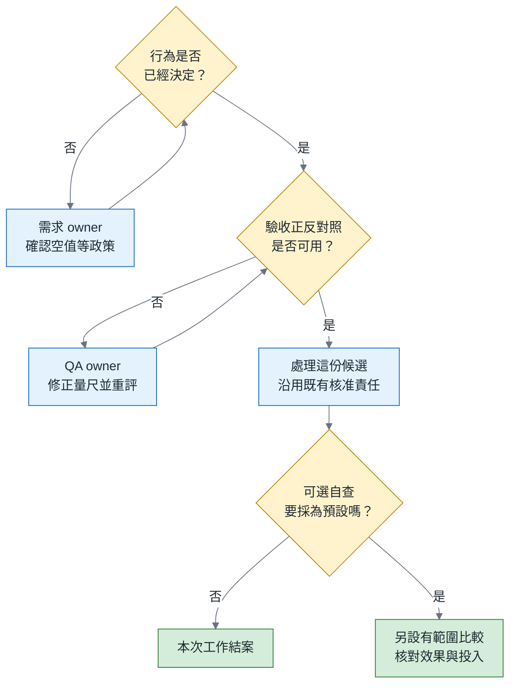
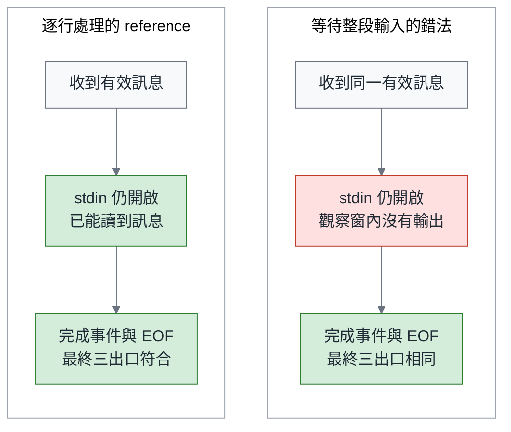

# 全面重寫圖表

兩圖只服務於新的判斷過程，不以圖數對標 October。已用 repo Mermaid 11.17.2 管線檢查並目視核對：總論 638×856 CSS px、8 節點、長寬比 1.34；契約篇 513×435、6 節點、0.85。字型 16px，由腳本注入。

## F1 — 總論：先辨認缺口，再決定是否需要比較

圖前說明：同樣是準備修改團隊指引，當下缺的是需求決定、驗收保護力或採用證據，接手的人和下一步都不同。

圖後必須補清楚：需求或量尺的缺口處理完後，才恢復對候選的判斷；既有驗收與人類核准仍須完成。這是下一筆證據的分流，不是只要正反對照綠燈就保證可交付。不是每次修補都需要額外做 P/Q 研究。採用比較只針對以改善交付為理由的可選自查；必要行為仍依需求決定與驗收。圖中返回箭頭表示補正後重查原問題。

## F2 — 契約篇：終態相同，輸出時點仍可違約

圖前說明：兩個獨立 probe 收到相同的訊息和完成事件；差別只在 stdin 還開著時，能否先讀到要求的文字。

圖後必須補清楚：左右是兩次獨立教學執行的概念對照，不是同步的效能競賽。一秒是本機觀察預算，不是產品 SLO；reference 若也沒及時輸出，要先核對 fixture、程式行為、環境與 driver，確認觀察前提無效才記為不能判定。終態相同只指圖示及已重播案例；具體 splitlines 改法仍可能在其他輸入造成分行差異。本圖只測第一則訊息，不推定 stdout/stderr 全域先後，沒有串流承諾的 CSV 也不因此違約。

