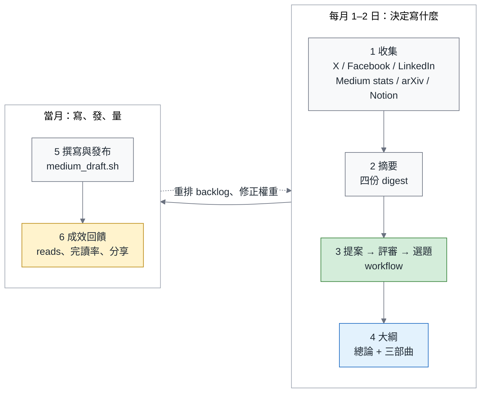

# research/ — 每月主題研究迴圈

這個資料夾放的是流程，用來決定下個月寫什麼；文章本身不在這裡，仍然一篇一個
`YYYY-MM-slug/` 資料夾（見上層 [README.md](../README.md)）。

目標是每月轉一圈、越轉越準的迴圈：



第一圈在 2026-09-05 跑過，產出在 [`2026-09/`](2026-09/)。

## 每月節奏

| 日期 | 做什麼 | 產出 |
|---|---|---|
| 每月 1 日 | `research/scripts/collect.sh all`；arXiv 掃描交給 agent（見 `prompts/arxiv.md`） | `.context/research/YYYY-MM/*.json`、`arxiv.md` |
| 1–2 日 | 四個 digest agent（X、社群、arXiv、Notion）→ 執行 `workflows/plan-next-three-themes.js` | `research/YYYY-MM/` 下的主題大綱 + `backlog.md` |
| 2 日 | `workflows/review-outlines.js` 第二輪批評／修訂 → 每份大綱跑 `research/scripts/codex_review.sh`（Codex，reasoning xhigh，第二個模型的意見）→ 依意見修訂 → 大綱裡每張 Mermaid 圖跑 `research/scripts/mermaid_check.sh`（規範見 [MERMAID.md](../MERMAID.md)）→ 所有中文產出過 zh-tw MCP 檢查（`mcp__zhtw-mcp__zhtw`，markdown、lexical_safe） | `codex-review-*.md`、修訂後的大綱 |
| 2 日 | 人工看一遍：選題是否對、調整大綱、決定要不要換掉某一個 | 定稿的大綱 |
| 3–14 日 | 長度基準（Medium 讀時算 CJK 字、英文字與圖）：已發布總論 3,629 個中文字 ≈ 18 分鐘，深掘 1,800–2,300 字 ≈ 8–12 分鐘，寫的時候以此為準。每篇跑 `workflows/write-article.js`（草稿 → 三視角批評 → 修訂 → 驗證）→ zh-tw agent → 英文版；`scripts/article_to_paste.py` 產 `publish/medium-paste.md`、`scripts/render_images.sh` 算繪圖與表格 PNG；`python3 tools/test_tools.py` 過 lockstep；`tools/medium_draft.sh` 建草稿 | 四篇草稿 × 兩種語言 |
| 15–20 日 | 發布。Medium 24 小時內最多 2 篇，八篇至少要四天，順序見 [PUBLISHING.md](../PUBLISHING.md) | 上線文章 + `PUBLISHED.md` |
| 發布當天 | 粉絲團與 X 貼分享文。2025 年的資料顯示，reads 主要來自粉絲團分享 | 分享文 |
| 月底 | `collect.sh medium` 抓一次 stats，比對上月；回填 `backlog.md` 的權重 | 成效表 |

節奏是建議值。發布配額是硬限制，其餘都可以壓縮。

## 資料來源

| 來源 | 登入方式 | 抓什麼 | 腳本 | 已知問題 |
|---|---|---|---|---|
| X | Chrome Default profile 的 cookie（`auth_token`、`ct0`），`tools/chrome_cookies.py x.com` | 「正在跟隨」時間軸、書籤、追蹤名單、以及 `filter:follows since:… min_faves:…` 的熱門搜尋（8 組關鍵字） | `collect.sh x`、`extract_tweets.js`、`extract_users.js` | 書籤裡的 X 長文只有連結沒有內文；三個 Chrome profile 都是同一個 X 帳號 |
| Facebook | 同上，`facebook.com --subdomains` | 已加入的技術社團、自己的動態、粉絲團「榮民叔叔的藏書筆記」 | `collect.sh facebook`、`extract_fb2.js`（社團，走 `div[role=feed]`）、`extract_fb_timeline.js`（個人頁與粉絲團，用作者名切文字） | 首頁動態是私人內容，不抓；Claude / OpenClaw / Antigravity / GCP 幾個社團多半是轉賣、範本與 cheat sheet 雜訊，真正有訊號的是搞笑談軟工、DevOps Taiwan、Backend 台灣、Scrum、Agile 內湖、DDDesign、Twinkle AI |
| LinkedIn | `linkedin.com --subdomains`（`li_at` 掛在 `.www.linkedin.com`） | 動態牆、已儲存貼文 | `collect.sh linkedin`、`extract_li2.js` | 動態牆 2026-09 只抓到 8 篇（用「Feed post」切文字），selector 待修；已儲存貼文的價值比較高 |
| Medium | `medium.com`（Default profile，同 `medium_draft.sh`） | `me/stats` 全表（presentations / views / reads）、個人頁文章清單 | `collect.sh medium`、`extract_medium.js` | 這是回饋迴圈的輸入；Cloudflare 擋 headless，一律 `--headed` |
| arXiv | 不用登入 | `export.arxiv.org/api/query` 各主題各 50 筆，再讀 abstract；批次查詢會被 429，改用 arxiv.org 搜尋頁補 | agent（`prompts/arxiv.md`） | 提交日與公告日可能差一個多月，表裡要註明 |
| Notion | 桌面版 app 的 cookie（Electron 同款加密），`research/scripts/notion_cookies.py notion.com`；第一次讀 Keychain 要人按「允許」（2026-09-05 10:47 已授權） | 工作區的側欄、最近編輯的 100 頁（內部 `/api/v3/search`）、指定頁面的算繪文字 | `collect.sh notion`、`notion_search.js`、`notion_chunk.js` | `token_v2` 掛在 `app.notion.com`，browse 只收「網域是目前頁面字尾」的 cookie，所以要分兩批：站在 `www.notion.com` 匯入 `.notion.com` 那批，再站在 `app.notion.com` 匯入 `app.notion.com` 那批；`msgstore-*.app.notion.com` 的 AWSALB cookie 丟掉。內部 API 沒有版本保證 |

所有 cookie 都只存在 `mktemp -d`（0700）裡，匯入完就刪；`.gitignore` 也擋了 `*cookies*.json`。
原始 JSON 含別人的貼文，留在 `.context/research/`（gitignored），**不要 commit**；
commit 的只有 digest、大綱、backlog。

## 目錄

```
research/
├── README.md                 # 本檔：迴圈怎麼轉
├── scripts/
│   ├── collect.sh            # 收集階段的驅動腳本（由 2026-09-05 跑通的指令整理而成）
│   ├── extract_*.js          # 各平台的 DOM 擷取；selector 會壞，壞了先修這裡
│   ├── merge.py / merge_users.py
│   ├── codex_review.sh       # 用 Codex（xhigh）二審一份大綱，原話存 codex-review-<slug>.md
│   ├── codex_jsonl.py        # codex exec --json 的串流解析（拆出來是因為 bash 單引號裡塞 python 會壞）
│   ├── mermaid_check.sh      # 用 browse 算繪一張 Mermaid 圖並依 MERMAID.md 判 PASS／FAIL（寬、高／寬、節點數）
│   ├── mermaid_check_all.sh  # 抽出一份 .md 裡所有 mermaid 區塊逐張檢查，列成一張表
│   ├── sync_figures.py       # 用 <slug>.figures.md 的已驗證版本覆蓋大綱內嵌的 mermaid（依圖 id）
│   ├── article_to_paste.py   # article.md → publish/medium-paste.md（mermaid → 📌圖、表格 → 📌表，其餘一字不差）+ figures.json
│   └── render_images.sh      # 依 figures.json 算繪 diagram-NN.png（走 mermaid_check）與 table-NN.png（HTML 截圖）
│   ├── notion_cookies.py     # Notion 桌面版 cookie 解密（Keychain 授權一次）
│   └── notion_search.js / notion_chunk.js   # Notion 內部 API：最近頁面清單、單頁文字
├── prompts/                  # 四個 digest agent 的 prompt，每月照抄改日期
├── workflows/
│   ├── plan-next-three-themes.js   # 提案 → 合併 → 評審/反駁 → 選題 → 大綱/批評/修訂 → backlog
│   ├── review-outlines.js          # 第二輪：每份大綱 4 個視角批評（證據稽核／VP 讀者／編輯／圖表設計）→ 修訂 → 補 Mermaid 圖檔 → 驗證，最多兩輪
│   ├── finish-outline.js           # 續跑：批評已跑完但修訂／圖檔被中斷時，用存下來的 issues 驗證 → 必要時修訂 → 補圖檔
│   └── write-article.js            # 寫一篇：從大綱與 figures.md 產 article.md → 三視角批評 → 修訂 → 驗證
└── YYYY-MM/                  # 每一圈的產出
    ├── style_brief.md        # 寫法摘要；寫完新系列後更新
    ├── 2026-10-<slug>.md     # 三個主題的完整大綱（總論 + 三部曲）
    ├── 2026-11-<slug>.md
    ├── 2026-12-<slug>.md
    ├── 2026-1x-<slug>.figures.md   # 每張圖的 Mermaid 原始碼（依 MERMAID.md），mermaid_check.sh 逐張驗過
    ├── codex-review-*.md     # Codex 二審的原話
    └── backlog.md            # 落選主題 + 訊號監看清單

.context/research/YYYY-MM/    # 原始資料與 digest（gitignored）
```

## 分析階段

四份 digest 分工固定，prompt 在 `prompts/`：

1. `x_digest.md`：追蹤名單分群、貼文依讚數與「書籤／讚」比排序（書籤比高＝有用的技術內容，讚多＝發布新聞）、10–14 個主題、正在爭論的張力、作者自己的訊號（書籤）、與已發布系列的缺口。
2. `community_digest.md`：台灣社團在問什麼、作者自己在 FB 上的聲音、LinkedIn 儲存貼文、Medium 全表成效與完讀率、機會清單。
3. `arxiv.md`：近三個月論文分群、跟業界說法相反的實證、可直接成文的訊號。
4. `notion_digest.md`：作者自己的 Notion：正在讀哪些證照與課程、工作坊筆記、讀書筆記與待讀清單、草稿。用來找第一手材料，也看作者當下的可信地盤（prompt 在 `prompts/notion_digest.md`）。

選題交給 workflow（`workflows/plan-next-three-themes.js`），設計刻意不省：

- 5 個視角各提 4 個候選（續集／作者強項／社群痛點／研究前沿／策略逆風）→ 合併去重成 6–10 個
- 每個候選：2 位不同視角的評審（讀者 VP、資深編輯）打 5 個分項 + 1 位反方（預設要駁倒）
- 選題 agent 看全部分數與反駁，挑 3 個並排到 10／11／12 月，落選的全部進 backlog
- 每個主題：大綱 → 批評（對 style brief、對已發布文章、對 digest 逐一查引用）→ 修訂
- 大綱寫完後再跑一次 `workflows/review-outlines.js`（args：root、month、files；可選 `lenses: ["evidence","diagram"]` 只跑部分視角、`skipFigures: true` 跳過圖檔階段。**一次只放一份大綱**：2026-09-06 實測 12 個 critic 同時讀 100K 字元大綱加 digest 會在幾分鐘內撞到 session 上限，只有證據稽核視角需要讀 digest）：每份大綱四個視角獨立批評—證據稽核（逐一對 digest 查引用與數字）、VP 讀者（會不會讀完並轉發）、編輯（格式、重疊、一個月寫得完嗎）、圖表設計（每張圖都要有符合 [MERMAID.md](../MERMAID.md) 的 Mermaid 原始碼，700px 下可讀）—合併 blocker/major 後修訂、再驗證，最多兩輪。
- workflow 之外再加兩道關卡（2026-09-05 決定）：
  1. **Codex 二審**：`research/scripts/codex_review.sh <outline.md>`，用 OpenAI Codex（`~/.codex/config.toml` 的 model，reasoning `xhigh`）審每份大綱。理由是大綱由 Claude 寫、Claude 批評、Claude 修訂，同一個模型審自己有盲點；Codex 在 repo 根目錄 read-only 跑，會自己讀 digest 與 selection.md 查引用。原話存成 `codex-review-<slug>.md`，再由 Claude 修訂大綱。
  2. **zh-tw 檢查**：所有要給人讀的中文檔（大綱、backlog、selection.md、本 README、之後的 article.md 與 medium-paste.md）最後都過 `mcp__zhtw-mcp__zhtw`（content_type markdown、fix_mode lexical_safe、translationese_domain technical、fix_output search_replace），**逐條看它提議的替換再套，不要整檔覆蓋**：2026-09-06 實測它會把「未通過」改成「未透過」、「縮進容器」改成「縮排容器」、「原始碼」改成「原始程式碼」，三個都是誤判。真正有用的是翻譯腔警告（定語堆疊、被動語態），照著拆句即可。這是最後一步，任何修改之後都要再跑。**大檔（> 30K 字元）交給一個 agent 做**：MCP 工具只吃 `text` 參數，主迴圈自己貼會把整份大綱當輸出 token 重打一遍；agent 依標題切成 ≤ 30K 的段、逐段呼叫、逐條判斷再套回原檔（prompt 見 `prompts/zhtw_pass.md`）。

重跑：把 `.context/research/YYYY-MM/` 準備好，改腳本開頭的 `ROOT`／`R`／`OUT` 路徑（目前寫死在 2026-09 的 worktree）與 `INPUTS` 裡的日期與月份，
在 Claude Code 裡用 Workflow 工具帶 `scriptPath` 執行；中途掛掉可用 `resumeFromRunId` 續跑，
已完成的 agent 會回快取結果。

## 讓它越轉越準：回饋與成長機制

這一節是迴圈跟「只做一次的研究」的差別。

**1. 成效回填 backlog。** 每月底抓 Medium stats，算每篇的 reads/views（完讀率）與 claps。
把「表現好的主題族」的權重寫回 `backlog.md`，下個月的選題 agent 會讀到。已知的基準：
2025 年中文長文完讀率 27%、英文 8%；書評型（建築、XP）完讀 46–51%；文章 views 超過
presentations 的那幾週，都是粉絲團有分享的週。這些數字放在 `style_brief.md` 的「reception」段，
每月更新一次。

**2. backlog 是狀態機，不是筆記。** 每個條目有：升級條件（什麼證據出現就升上去）、最早適合的月份、
上次評分。每月 workflow 的 Select 階段會重新排它。連續三個月沒有新證據的條目降到「觀察中」。

**3. 訊號監看清單越長越好。** `backlog.md` 末尾的清單（帳號、arXiv 查詢字串、社團、會議日期）
是下個月 `collect.sh` 與 arXiv prompt 的輸入來源。新發現一個有訊號的帳號或社團，就加進去；
一個社團連續兩個月只有雜訊，就從 `FB_GROUPS` 拿掉。

**4. digest 累積成觀點資料庫。** 每個月的三份 digest 都留在 `.context/research/YYYY-MM/`，
寫文章時可以回頭引用「三個月前社群在爭什麼」；跨月比對也是 總論 裡「市場走到哪裡了」那一節的素材。

**5. style brief 隨每個系列更新。** 新系列寫完，把用得順的結構、被讀者回應的段落、
出過問題的格式（例如 `——` 會裂）補回 `style_brief.md`。它是給 agent 的 AGENTS.md，
標準跟技術篇說的一樣：新來的 agent 拿著它，能不能不問人就寫出對的大綱。

**6. 系列互連。** 每個新主題的總論要回連上一個系列；本圈的三個主題都建立在 Agentic Engineering
三部曲之上。舊文也要補一句指向新系列，讓讀者能沿著鏈讀。修改已發布文章用 `tools/medium_patch.py`。

## 自動化的邊界

收集階段需要**本機**：Chrome 的 Keychain、headed 瀏覽器、以及第一次讀 Keychain 時人按「允許」。
所以雲端排程（Claude Code 的 schedule routine）跑不了 `collect.sh`；可行的組合是：

- 每月 1 日手動（或本機 cron / launchd）跑 `collect.sh all`，人在旁邊按掉 Keychain 提示；
- 之後的 digest 與 workflow 都不需要瀏覽器，可以在同一個 Claude Code session 裡一次跑完，
  或用 `/loop` 在收集完成後自動接上。

不要為了全自動而把 cookie 存到固定路徑或環境變數；`medium_draft.sh` 對這件事的態度同樣適用。

## 待辦

- [x] Notion：2026-09-05 已打通（Keychain 授權 + 分網域兩批匯入），流程在 `collect.sh notion`，digest prompt 在 `prompts/notion_digest.md`。資料庫頁（讀書筆記／待讀清單）loadPageChunk 抓不到列，要用算繪文字（`collect.sh` 尚未納入這一步）。
- 大綱與 `<slug>.figures.md` 都會有 Mermaid：修訂 agent 會把圖嵌進大綱、圖檔 agent 另寫一份。以 **figures.md 為準**（它是逐張算繪驗過的），大綱裡的內嵌版要用 figures.md 的同 id 版本覆蓋（2026-09-06 對 10 月做過：先 `mermaid_check_all.sh` 兩份都跑，再依圖 id 把大綱內嵌版換掉）。
- [x] 2026-10 第二輪完成（2026-09-06 14:40）：4 視角 41 major 全數修訂、驗證通過；22 張 Mermaid 圖經 `mermaid_check_all.sh` 全部 PASS（5 張由筆者重畫）。11、12 月依序進行。
- [x] 2026-11 第二輪完成（2026-09-06 22:40）：3 視角 + 圖表視角共 70 條意見，`finish-outline.js` 驗證／修訂後補圖檔；16 張 Mermaid 全部 PASS，大綱內嵌版已同步。
- [x] 2026-12 第二輪完成（2026-09-06 23:15）：4 視角 27 major，修訂 51 條、驗證通過（3 個殘留由筆者手修）；14 張 Mermaid 全部 PASS，大綱內嵌版已同步。
- [ ] **10 月四篇初稿都已寫好、機械檢查全過（2026-09-07 00:10）**，等 02:00 額度重置後跑批評／修訂：

      | 篇 | 目錄 | 中文字（正文） | 圖／表 | 目標字數 |
      |---|---|---|---|---|
      | 總論 | `2026-10-green-overview` | 7,168 | 10／9 | 3,500–4,500 |
      | 一、測試篇 | `2026-10-green-testing` | 3,820 | 4／4 | 1,900–2,600 |
      | 二、Review 篇 | `2026-10-green-review` | 3,925 | 4／3 | 1,900–2,600 |
      | 三、可靠度篇 | `2026-10-green-reliability` | 2,850 | 4／3 | 1,900–2,600 |

      四篇的圖全部 `mermaid_check` PASS、`article_to_paste.py` 與 `render_images.sh` 都跑過、`tools/test_tools.py` OK、`——` 為 0；
      三部曲已先跑過一輪 zh-tw（只採納 場景→情境、是一個→是、可執行行→可執行的行；通過→透過、數據→資料、實例→實體、依賴→相依性 都是誤判，未套）。
      批評／修訂（每篇一個 run，總論先；`prev` 帶前面各篇的目錄）：
      `Workflow({scriptPath: "research/workflows/write-article.js", args: {root, month: "2026-09", outline: "research/2026-09/2026-10-agentic-green-is-not-done.md", figures: "research/2026-09/2026-10-agentic-green-is-not-done.figures.md", piece: "總論", dir: "2026-10-green-overview", skipDraft: true, today: "2026-09-07"}})`，
      再依序 `piece: "一、測試篇", dir: "2026-10-green-testing", prev: ["2026-10-green-overview"]`、`piece: "二、Review 篇", dir: "2026-10-green-review", prev: [總論, 測試篇]`、`piece: "三、可靠度篇", dir: "2026-10-green-reliability", prev: [前三篇]`。
      每篇修訂後重跑 `article_to_paste.py`、`render_images.sh`、`tools/test_tools.py`，**最後**再跑一次 zh-tw（修訂會改動正文）；然後寫英文版（`article.en.md`，`--lang en`）。三份大綱的 zh-tw agent 也還沒跑完（三次都撞上限）。
- [ ] **Codex 二審尚未跑**：2026-09-05 22:36 撞到 Codex 用量上限（重置時間 2026-09-07 10:25）。重置後對 `selection.md` 與三份大綱各跑一次 `research/scripts/codex_review.sh`，依意見修訂，再跑一次 zh-tw 檢查。
- [ ] LinkedIn 動態牆的 selector（目前靠「Feed post」切文字，只抓到 8 篇）。
- [ ] `collect.sh` 還沒以單一腳本從頭跑過一次；第一次請逐段看。
- [ ] 這些腳本目前放 `research/scripts/`，不在 `tools/`：`tools/` 的規矩是每個函式要有測試，
      這裡的擷取邏輯依賴外部 DOM、沒辦法離線測。等 selector 穩定、值得保護的部分
      （merge、cookie 包裝）再搬進 `tools/` 補測試。
- [ ] 每月更新 `style_brief.md` 的 reception 段與 `backlog.md` 的權重。
